5102 Data Analysis by Agency / Department
================
CalEPA Racial Equity Team
*Updated: 2021-08-11*

-   [5102 Data Analysis by Agency /
    Department](#5102-data-analysis-by-agency--department)
    -   [Introduction](#introduction)
    -   [CA Workforce Data Resources](#ca-workforce-data-resources)
    -   [Enter Parameters](#enter-parameters)
    -   [Load & Transform Data](#load--transform-data)
        -   [5102 Data](#5102-data)
            -   [Ethnicity Groupings](#ethnicity-groupings)
            -   [Filter for Selected
                Agency](#filter-for-selected-agency)
        -   [Census Data](#census-data)
            -   [Census Data Resources](#census-data-resources)
            -   [Download Census Data](#download-census-data)
    -   [Plots](#plots)
        -   [Enter Plotting Parameters](#enter-plotting-parameters)
        -   [Format Data & Create Plotting
            Functions](#format-data--create-plotting-functions)
        -   [Department Summary Plots](#department-summary-plots)
            -   [Level 1 Ethnicity](#level-1-ethnicity)
            -   [Level 2 Ethnicity](#level-2-ethnicity)
        -   [Department by Employee
            Class](#department-by-employee-class)
            -   [Level 1 Ethnicity](#level-1-ethnicity-1)
            -   [Level 2 Ethnicity](#level-2-ethnicity-1)
        -   [Department/BDO Comparison](#departmentbdo-comparison)
            -   [Level 2 Ethnicity](#level-2-ethnicity-2)

# 5102 Data Analysis by Agency / Department

## Introduction

This code can be modified and applied to any department(s) in the
California state system listed in California Department of Human
Resource’s (CalHR) 5102 data set. This code was written by California
Environmental Protection Agency’s (CalEPA) Racial Equity Team (CRET)
Data Subteam in Spring 2021 to provide helpful racial demographics
visualizations for the workforce of the Agency and its Boards,
Departments, and Office (BDOs). The effort came out of a desire to
supplement the Agency’s Race Forward survey results with workforce
demographic data. The Data Subteam intends on maintaining and building
off this and other resources and datasets. The vision of the Workforce
Equity Subteam’s work is to create a workforce in which one’s work
and/or career outcomes are not predicted by one’s race. The Data
Subteam’s efforts support this vision. This vision is informed by more
detailed goals and objectives related to work/career satisfaction,
promotion and retention, compensation, inclusion, mental and other
health safety, and more. CRET’s model of change - normalize, organize
and operationalize – is aligned with over 200 government organizations
part of a nationwide network to transform governments to deliver more
racial equity. We anticipate that these demographic metrics and
resulting performance measures will evolve over time and will be
informed by future data and analyses of surveys, workforce demographics,
and research. Finally, the Data Subteam acknowledges that racial equity
work is complex and cannot be pared down to simple numbers in bins. This
code and resulting visualizations seeks to be the first step in
critically examining an agency’s racial demographics, and may be more
helpful in developing the right questions that need to be asked, rather
than immediate answers and/or numeric targets. If you have any questions
about this code, please email Leah Jones at
<leah.jones@waterboards.ca.gov>.

## CA Workforce Data Resources

-   CalHR data page:
    <https://www.calhr.ca.gov/pages/statewide-reports.aspx>

-   Workforce data on CA open data portal:
    <https://data.ca.gov/dataset/calhr-civil-rights-data-for-gare-capital-cohort-2019>

## Enter Parameters

Enter the year of the most recently published 5102 report and the most
recently published ACS data, and if needed edit the URL for the 5102
data set on the California Open Data Portal. Also, edit default plot
titles and captions as needed (CalEPA and its 6 Boards, Departments, and
Offices \[BDOs\] are the examples used here).

``` r
# enter parameters (for current reporting year) -----------------------------
report_year <- 2020
acs_data_year <- 2019

agency_name <- 'CalEPA'

url_data_all_yrs <- 'https://data.ca.gov/dataset/e620a64f-6b86-4ce0-ab4b-03d06674287b/resource/aba87ad9-f6b0-4a7e-a45e-d1452417eb7f/download/calhr_5102_statewide_2011-2020.csv'

default_pl_title <- glue('{agency_name} Workforce Compared to State Population (Year {report_year})')
default_pl_title_groups <- glue('{agency_name} Workforce by Occupation and Ethnicity Group Compared to State Population (Year {report_year})')
default_pl_title_bdo <- glue('{agency_name} Workforce by BDO Compared to State Population (Year {report_year})')

default_pl_subtitle <- element_blank()
default_pl_caption <- glue('Data sources: state population data from {acs_data_year} 1 yr American Community Survey  |  workforce data from {report_year} CalHR 5102 Report')
```

## Load & Transform Data

### 5102 Data

CalHR’s biannual 5102 report “captures the race/ethnicity, gender,
disability, and veteran status by occupational group and classification
for all state employees.” Data source: [CalHR’s Statewide 5102
report](https://www.calhr.ca.gov/pages/statewide-reports.aspx). A
cleaned and compiled version of that data is available on the California
Open Data Portal at:
<https://data.ca.gov/dataset/calhr-civil-rights-data-for-gare-capital-cohort-2019>

#### Ethnicity Groupings

The ethnicity groupings were thought of in two levels. Level one is
“white” versus “BIPOC”, where BIPOC stands for black, indigenous, and
people of color, and includes all ethnicity values other than white.
Level two ethnicity groups some sub-groupings, in this case all Asian
identities. We recognize that all ethnicities, including sub-groups of
Asian ethnicities, experience discrimination differently. However, for
the purposes of creating useful visualizations with a relatively small
dataset, we chose to group the identity variables in this way. Feel free
to explore the data and re-group for your purposes as you see fit.

``` r
# 1 - load / transform data ---------------------------------------------------------------

## 5102 ----
df_5102 <- read_csv(url_data_all_yrs) %>%
    clean_names() 

# add additional levels for ethnicity grouping
#   identity_variable (in original dataset) is most detailed level
#   level 1 groups all BIPOC together (resulting groups are BIPOC and white)
#   level 2 groups some identity_variable sub-groupings together (Asian group and Pacific Islander group)
df_5102 <- df_5102 %>% 
    mutate(
        ethnicity_level1 = case_when(
            identity_variable == 'White' ~ 'White', 
            TRUE ~ 'BIPOC'),
        ethnicity_level2 = case_when(
            str_detect(identity_variable, 'Pacific Islander') ~ 'Pacific Islander', # groups (all start with "Pacific Islander - "): Guamanian, Hawaiian, Other or Multiple, and Samoan
            str_detect(identity_variable, 'Asian') ~ 'Asian', # groups (all start with "Asian - "): Cambodian, Chinese, Filipino, Indian, Japanese, Korean, Laotian, Other or Multiple, Vietnamese
            TRUE ~ identity_variable)
    )

# add a year column
df_5102 <- df_5102 %>% 
    mutate(reporting_year = year(as_of_date))
```

#### Filter for Selected Agency

Search for the name of your selected agency from the box below, then
copy and paste into the subsequent code chunk.

List of agency names in the 5102 data set:

``` r
# list of all departments
depts_list <- df_5102 %>% 
    distinct(dept) %>% 
    arrange(dept) %>% 
    rename('Department Name' = dept)


depts_list %>%
    kbl() %>%
    kable_paper() %>%
    scroll_box(width = "500px", height = "200px") %>%
    {.}
```

<div
style="border: 1px solid #ddd; padding: 0px; overflow-y: scroll; height:200px; overflow-x: scroll; width:500px; ">

<table class=" lightable-paper" style="font-family: &quot;Arial Narrow&quot;, arial, helvetica, sans-serif; margin-left: auto; margin-right: auto;">
<thead>
<tr>
<th style="text-align:left;position: sticky; top:0; background-color: #FFFFFF;">
Department Name
</th>
</tr>
</thead>
<tbody>
<tr>
<td style="text-align:left;">
Achieving a Better Life Experience for People With Disabilities,
California
</td>
</tr>
<tr>
<td style="text-align:left;">
Administrative Law, Office of
</td>
</tr>
<tr>
<td style="text-align:left;">
African-American Museum, California
</td>
</tr>
<tr>
<td style="text-align:left;">
Aging, Commission on
</td>
</tr>
<tr>
<td style="text-align:left;">
Aging, Department of
</td>
</tr>
<tr>
<td style="text-align:left;">
Agricultural Association, 22nd District
</td>
</tr>
<tr>
<td style="text-align:left;">
Agricultural Association, 32nd District
</td>
</tr>
<tr>
<td style="text-align:left;">
Agricultural Associations
</td>
</tr>
<tr>
<td style="text-align:left;">
Agricultural Labor Relations Board
</td>
</tr>
<tr>
<td style="text-align:left;">
Air Resources Board
</td>
</tr>
<tr>
<td style="text-align:left;">
Alcohol and Drug Programs, Department of
</td>
</tr>
<tr>
<td style="text-align:left;">
Alcoholic Beverage Control Appeals Board
</td>
</tr>
<tr>
<td style="text-align:left;">
Alcoholic Beverage Control, Department of
</td>
</tr>
<tr>
<td style="text-align:left;">
Alternative Energy and Advanced Transportation Financing Authority
</td>
</tr>
<tr>
<td style="text-align:left;">
Arts Council, California
</td>
</tr>
<tr>
<td style="text-align:left;">
Baldwin Hills Conservancy
</td>
</tr>
<tr>
<td style="text-align:left;">
Business and Economic Development, Governor’s Office of
</td>
</tr>
<tr>
<td style="text-align:left;">
Business Oversight, Department of
</td>
</tr>
<tr>
<td style="text-align:left;">
Business, Consumer Services, and Housing Agency
</td>
</tr>
<tr>
<td style="text-align:left;">
Business, Transportation, and Housing Agency
</td>
</tr>
<tr>
<td style="text-align:left;">
CA Complete Count, Census 2020
</td>
</tr>
<tr>
<td style="text-align:left;">
Child Support Services, Department of
</td>
</tr>
<tr>
<td style="text-align:left;">
Children and Families First Commission
</td>
</tr>
<tr>
<td style="text-align:left;">
Chiropractic Examiners, Board of
</td>
</tr>
<tr>
<td style="text-align:left;">
Coachella Valley Mountains Conservancy
</td>
</tr>
<tr>
<td style="text-align:left;">
Coastal Commission, California
</td>
</tr>
<tr>
<td style="text-align:left;">
Coastal Conservancy, State
</td>
</tr>
<tr>
<td style="text-align:left;">
Colorado River Board
</td>
</tr>
<tr>
<td style="text-align:left;">
Community Colleges, California
</td>
</tr>
<tr>
<td style="text-align:left;">
Community Services and Development, Department of
</td>
</tr>
<tr>
<td style="text-align:left;">
Compensation Insurance Fund, State
</td>
</tr>
<tr>
<td style="text-align:left;">
Conservation Corps, California
</td>
</tr>
<tr>
<td style="text-align:left;">
Conservation, Department of
</td>
</tr>
<tr>
<td style="text-align:left;">
Consumer Affairs, Department of
</td>
</tr>
<tr>
<td style="text-align:left;">
Controller, Office of the California State
</td>
</tr>
<tr>
<td style="text-align:left;">
Corrections and Rehabilitation, California Department of
</td>
</tr>
<tr>
<td style="text-align:left;">
Debt and Investment Advisory Commission, California
</td>
</tr>
<tr>
<td style="text-align:left;">
Debt Limit Allocation Committee, California
</td>
</tr>
<tr>
<td style="text-align:left;">
Delta Protection Commission
</td>
</tr>
<tr>
<td style="text-align:left;">
Delta Stewardship Council
</td>
</tr>
<tr>
<td style="text-align:left;">
Developmental Disabilities, State Council on
</td>
</tr>
<tr>
<td style="text-align:left;">
Developmental Services, Department of
</td>
</tr>
<tr>
<td style="text-align:left;">
Disability Access, California Commission on
</td>
</tr>
<tr>
<td style="text-align:left;">
Earthquake Authority, California
</td>
</tr>
<tr>
<td style="text-align:left;">
Education Audit Appeals Panel
</td>
</tr>
<tr>
<td style="text-align:left;">
Education, Department of
</td>
</tr>
<tr>
<td style="text-align:left;">
Educational Facilities Authority, California
</td>
</tr>
<tr>
<td style="text-align:left;">
Emergency Medical Services Authority
</td>
</tr>
<tr>
<td style="text-align:left;">
Emergency Services, California Governor’s Office of
</td>
</tr>
<tr>
<td style="text-align:left;">
Employment Development Department
</td>
</tr>
<tr>
<td style="text-align:left;">
Employment Training Panel, California
</td>
</tr>
<tr>
<td style="text-align:left;">
Energy Resources Conservation and Development Commission
</td>
</tr>
<tr>
<td style="text-align:left;">
Environmental Health Hazard Assessment, Office of
</td>
</tr>
<tr>
<td style="text-align:left;">
Environmental Protection Agency
</td>
</tr>
<tr>
<td style="text-align:left;">
Equalization, Board of
</td>
</tr>
<tr>
<td style="text-align:left;">
Exposition and State Fair, California
</td>
</tr>
<tr>
<td style="text-align:left;">
Fair Employment and Housing Commission
</td>
</tr>
<tr>
<td style="text-align:left;">
Fair Employment and Housing, Department of
</td>
</tr>
<tr>
<td style="text-align:left;">
Fair Political Practices Commission
</td>
</tr>
<tr>
<td style="text-align:left;">
Finance, Department of
</td>
</tr>
<tr>
<td style="text-align:left;">
Financial Institutions, Department of
</td>
</tr>
<tr>
<td style="text-align:left;">
Financial Protection and Innovation, Department of
</td>
</tr>
<tr>
<td style="text-align:left;">
FISCal
</td>
</tr>
<tr>
<td style="text-align:left;">
Fish and Wildlife, Department of
</td>
</tr>
<tr>
<td style="text-align:left;">
Food and Agriculture, Department of
</td>
</tr>
<tr>
<td style="text-align:left;">
Forestry and Fire Protection, Department of
</td>
</tr>
<tr>
<td style="text-align:left;">
Franchise Tax Board
</td>
</tr>
<tr>
<td style="text-align:left;">
Gambling Control Commission, California
</td>
</tr>
<tr>
<td style="text-align:left;">
General Services, Department of
</td>
</tr>
<tr>
<td style="text-align:left;">
Government Operations Agency
</td>
</tr>
<tr>
<td style="text-align:left;">
Health and Human Services Agency
</td>
</tr>
<tr>
<td style="text-align:left;">
Health Benefit Exchange, California
</td>
</tr>
<tr>
<td style="text-align:left;">
Health Care Services, Department of
</td>
</tr>
<tr>
<td style="text-align:left;">
Health Facilities Financing Authority, California
</td>
</tr>
<tr>
<td style="text-align:left;">
Health Planning and Development, Office of Statewide
</td>
</tr>
<tr>
<td style="text-align:left;">
High Speed Rail Authority, California
</td>
</tr>
<tr>
<td style="text-align:left;">
Highway Patrol, California
</td>
</tr>
<tr>
<td style="text-align:left;">
Horse Racing Board, California
</td>
</tr>
<tr>
<td style="text-align:left;">
Housing and Community Development, Department of
</td>
</tr>
<tr>
<td style="text-align:left;">
Housing Finance Agency, California
</td>
</tr>
<tr>
<td style="text-align:left;">
Human Resources, California Department of
</td>
</tr>
<tr>
<td style="text-align:left;">
Independent Living Council, State
</td>
</tr>
<tr>
<td style="text-align:left;">
Industrial Relations, Department of
</td>
</tr>
<tr>
<td style="text-align:left;">
Inspector General, Office of the
</td>
</tr>
<tr>
<td style="text-align:left;">
Insurance, Department of
</td>
</tr>
<tr>
<td style="text-align:left;">
Justice, Department of
</td>
</tr>
<tr>
<td style="text-align:left;">
Labor and Workforce Development Agency
</td>
</tr>
<tr>
<td style="text-align:left;">
Law Revision Commission, California
</td>
</tr>
<tr>
<td style="text-align:left;">
Legislative Counsel, Office of
</td>
</tr>
<tr>
<td style="text-align:left;">
Library, California State
</td>
</tr>
<tr>
<td style="text-align:left;">
Little Hoover Commission
</td>
</tr>
<tr>
<td style="text-align:left;">
Lottery, California State
</td>
</tr>
<tr>
<td style="text-align:left;">
Managed Health Care, Department of
</td>
</tr>
<tr>
<td style="text-align:left;">
Managed Risk Medical Insurance Board
</td>
</tr>
<tr>
<td style="text-align:left;">
Mental Health Services Oversight and Accountability Commission
</td>
</tr>
<tr>
<td style="text-align:left;">
Military Department
</td>
</tr>
<tr>
<td style="text-align:left;">
Motor Vehicles, Department of
</td>
</tr>
<tr>
<td style="text-align:left;">
Native American Heritage Commission
</td>
</tr>
<tr>
<td style="text-align:left;">
Natural Resources Agency, California
</td>
</tr>
<tr>
<td style="text-align:left;">
Osteopathic Medical Board of California
</td>
</tr>
<tr>
<td style="text-align:left;">
Parks and Recreation, Department of
</td>
</tr>
<tr>
<td style="text-align:left;">
Peace Officer Standards and Training, Commission on
</td>
</tr>
<tr>
<td style="text-align:left;">
Personnel Board, State
</td>
</tr>
<tr>
<td style="text-align:left;">
Pesticide Regulation, Department of
</td>
</tr>
<tr>
<td style="text-align:left;">
Pilot Commissioners, Board of
</td>
</tr>
<tr>
<td style="text-align:left;">
Pollution Control Financing Authority, California
</td>
</tr>
<tr>
<td style="text-align:left;">
Postsecondary Education Commission, California
</td>
</tr>
<tr>
<td style="text-align:left;">
Prison Industry Authority, California
</td>
</tr>
<tr>
<td style="text-align:left;">
Public Defender, Office of the State
</td>
</tr>
<tr>
<td style="text-align:left;">
Public Employees’ Retirement System, California
</td>
</tr>
<tr>
<td style="text-align:left;">
Public Employment Relations Board
</td>
</tr>
<tr>
<td style="text-align:left;">
Public Health, California Department of
</td>
</tr>
<tr>
<td style="text-align:left;">
Public Utilities Commission, California
</td>
</tr>
<tr>
<td style="text-align:left;">
Real Estate Appraisers, Office of
</td>
</tr>
<tr>
<td style="text-align:left;">
Real Estate, Department of
</td>
</tr>
<tr>
<td style="text-align:left;">
Rehabilitation, Department of
</td>
</tr>
<tr>
<td style="text-align:left;">
Resources Recycling and Recovery, Department of
</td>
</tr>
<tr>
<td style="text-align:left;">
Sacramento-San Joaquin Delta Conservancy
</td>
</tr>
<tr>
<td style="text-align:left;">
San Diego River Conservancy
</td>
</tr>
<tr>
<td style="text-align:left;">
San Francisco Bay Conservation and Development Commission
</td>
</tr>
<tr>
<td style="text-align:left;">
San Gabriel Lower Los Angeles Rivers and Mountains Conservancy
</td>
</tr>
<tr>
<td style="text-align:left;">
San Joaquin River Conservancy
</td>
</tr>
<tr>
<td style="text-align:left;">
Santa Monica Mountains Conservancy
</td>
</tr>
<tr>
<td style="text-align:left;">
Scholarshare Investment Board
</td>
</tr>
<tr>
<td style="text-align:left;">
School Finance Authority, California
</td>
</tr>
<tr>
<td style="text-align:left;">
Science Center, California
</td>
</tr>
<tr>
<td style="text-align:left;">
Secretary of State
</td>
</tr>
<tr>
<td style="text-align:left;">
Secure Choice Retirement Savings Investment Board, California
</td>
</tr>
<tr>
<td style="text-align:left;">
Seismic Safety Commission
</td>
</tr>
<tr>
<td style="text-align:left;">
Senior Legislature, California
</td>
</tr>
<tr>
<td style="text-align:left;">
Sierra Nevada Conservancy
</td>
</tr>
<tr>
<td style="text-align:left;">
Social Services, Department of
</td>
</tr>
<tr>
<td style="text-align:left;">
State and Community Corrections, Board of
</td>
</tr>
<tr>
<td style="text-align:left;">
State and Consumer Services Agency, California
</td>
</tr>
<tr>
<td style="text-align:left;">
State Audits, Bureau of
</td>
</tr>
<tr>
<td style="text-align:left;">
State Hospitals, Department of
</td>
</tr>
<tr>
<td style="text-align:left;">
State Lands Commission
</td>
</tr>
<tr>
<td style="text-align:left;">
State Mandates, Commission on
</td>
</tr>
<tr>
<td style="text-align:left;">
Student Aid Commission, California
</td>
</tr>
<tr>
<td style="text-align:left;">
Summer School for the Arts
</td>
</tr>
<tr>
<td style="text-align:left;">
Systems Integration, Office of
</td>
</tr>
<tr>
<td style="text-align:left;">
Tahoe Conservancy, California
</td>
</tr>
<tr>
<td style="text-align:left;">
Tax and Fee Administration, California Department of
</td>
</tr>
<tr>
<td style="text-align:left;">
Tax Appeals, Office of
</td>
</tr>
<tr>
<td style="text-align:left;">
Tax Credit Allocation Committee, California
</td>
</tr>
<tr>
<td style="text-align:left;">
Teacher Credentialing, Commission on
</td>
</tr>
<tr>
<td style="text-align:left;">
Teachers’ Retirement System, California State
</td>
</tr>
<tr>
<td style="text-align:left;">
Technology, Department of
</td>
</tr>
<tr>
<td style="text-align:left;">
Toxic Substances Control, Department of
</td>
</tr>
<tr>
<td style="text-align:left;">
Traffic Safety, Office of
</td>
</tr>
<tr>
<td style="text-align:left;">
Transportation Agency, California State
</td>
</tr>
<tr>
<td style="text-align:left;">
Transportation Commission, California
</td>
</tr>
<tr>
<td style="text-align:left;">
Transportation, Department of
</td>
</tr>
<tr>
<td style="text-align:left;">
Treasurer, Office of the State
</td>
</tr>
<tr>
<td style="text-align:left;">
Unemployment Insurance Appeals Board, California
</td>
</tr>
<tr>
<td style="text-align:left;">
Unmapped Department
</td>
</tr>
<tr>
<td style="text-align:left;">
Veterans Affairs, California Department of
</td>
</tr>
<tr>
<td style="text-align:left;">
Victim Compensation Board, California
</td>
</tr>
<tr>
<td style="text-align:left;">
Water Resources Control Board
</td>
</tr>
<tr>
<td style="text-align:left;">
Water Resources, Department of
</td>
</tr>
<tr>
<td style="text-align:left;">
Wildlife Conservation Board, California
</td>
</tr>
<tr>
<td style="text-align:left;">
Women and Girls, Commission on the Status of
</td>
</tr>
<tr>
<td style="text-align:left;">
Workforce Development Board, California
</td>
</tr>
</tbody>
</table>

</div>

Enter departments to be included in the analysis, and modify the
variable names as you see fit:

``` r
# Filtering for EPA and related BDOs 
df_5102_dept <- df_5102 %>% 
    filter(dept == "Air Resources Board"|
               dept == "Environmental Health Hazard Assessment, Office of"|
               dept == "Environmental Protection Agency"|
               dept == "Pesticide Regulation, Department of"|
               dept == "Resources Recycling and Recovery, Department of"|
               dept == "Toxic Substances Control, Department of"|
               dept == "Water Resources Control Board")

# filter for data from the report year (selected above)
df_5102_dept_1yr <- df_5102_dept %>% 
    filter(reporting_year == report_year)
```

### Census Data

For this report, we use data from the U.S. Census Bureau’s 1-year
American Community Survey (ACS) dataset, which provides a statewide
estimate of population and demographic data for a given year. The
selected year (entered above) should match the year of the workforce
data being analyzed, or if the ACS data for the desired year is not yet
available the previous year’s 1-year ACS dataset can be used. To access
the ACS data we use the tidycensus R package, which provides a user
friendly interface to to the Census Bureau’s API via R.

The ACS dataset provides information about a wide variety of topics,
with different data types provided in separate tables, and fields within
those tables defined by codes. We used ACS table B03002 to obtain
estimates of statewide population by racial/ethnic group, because that
table includes information about hispanic/latino origin (note that the
primary ACS table for race/ethnicity information is table B02001, but
that table does not contain information about hispanic/latino origin, as
hispanic/latino orginin considered to be a characteristic that is
tracked independent of race).

The ethnicity groupings provided in ACS table B03002 are roughly
analogous to the “level 2” ethnicity groupings described above for the
state workforce data. To make the census data consistent with the level
2 groupings state workforce data, the only transformation applied to the
census data is grouping the “Other” and “Multiple” category into one
‘Other or Multiple Race’ category. We also create an ACS dataset
consistent with the level 1 ethnicity groupings described above by
combining all of the racial/ethnic categories except “White” into one
“BIOPOC” category.

For more information about the tidycensus R package or the various types
of data available from the U.S. Census Bureau, see the resources listed
below.

#### Census Data Resources

-   tidycensus R package:
    <https://walker-data.com/tidycensus/articles/basic-usage.html>

-   general census workshop w/ R:
    <https://jennhuck.github.io/workshops/tidycensus.html>

-   ACS Table B02001 data (race w/o hispanic/latino data):
    <https://censusreporter.org/data/table/?table=B02001&geo_ids=04000US06>

-   ACS Table B03002 data (race with hispanic/latino data):
    <https://censusreporter.org/data/table/?table=B03002&geo_ids=04000US06>

-   info about race in census data:
    <https://censusreporter.org/topics/race-hispanic/>

-   other general info about concepts and tables in census data:
    <https://censusreporter.org/topics/>

-   check/validation of the numbers for CA:
    <https://www.ppic.org/publication/californias-population/>

#### Download Census Data

To download the census data, you need to first request a key here:
<https://api.census.gov/data/key_signup.html/> Then, enter
census\_api\_key(“*your\_key*”, install = TRUE) in your console.

``` r
## census data (ACS 1 yr) ----

### get ACS data
acs_data_raw <- get_acs(geography = 'state', 
                        variables = c(# total_state_pop = 'B02001_001',
                            'Hispanic or Latino' = 'B03002_012', # Total Hispanic or Latino
                            'White' = 'B03002_003', # White (Not Hispanic or Latino)
                            'Black or African American' = 'B03002_004', # Black or African American (Not Hispanic or Latino)
                            'Native American or Alaska Native' = 'B03002_005', # American Indian and Alaska Native (Not Hispanic or Latino)
                            'Asian' = 'B03002_006', # Asian (Not Hispanic or Latino)
                            'Pacific Islander' = 'B03002_007', # Native Hawaiian and Other Pacific Islander (Not Hispanic or Latino)
                            'Other' = 'B03002_008', # Some other race (Not Hispanic or Latino)
                            'Multiple' = 'B03002_009'# Two or more races (Not Hispanic or Latino)
                        ),
                        summary_var = c(total_state_pop = 'B02001_001'), 
                        survey = 'acs1', # use 'acs1' or 'acs5' to get 1 or 5 year acs
                        state = 'CA', 
                        geometry = FALSE, # set to TRUE to get as geospatial data
                        year = acs_data_year)

# clean / reformat the acs data (the data will be formatted to be 
# consistent with the "level 2" ethnicity groupings in the workforce 
# data that are created above)
acs_data_level2 <- acs_data_raw %>% 
    clean_names() %>% 
    rename(total_state_pop = summary_est, 
           total_state_pop_moe = summary_moe,
           location_name = name,
           ethnicity_level2 = variable)

    ## check (should be TRUE) - make sure sum of populations by group == total state population
    # sum(acs_data_level2$estimate) == acs_data_level2$total_state_pop[1]

### group the 'Other' and 'Multiple' rows into one 'Other or Multiple Race' row
acs_data_level2 <- acs_data_level2 %>% 
    mutate(ethnicity_level2 = 
               case_when(ethnicity_level2 == 'Other' | 
                             ethnicity_level2 == 'Multiple' ~ 
                             'Other or Multiple Race',
                         TRUE ~ ethnicity_level2)) %>% 
    group_by(geoid, location_name, ethnicity_level2, total_state_pop) %>% 
    summarize(estimate = sum(estimate)) %>%
    ungroup() %>% 
    {.}
    
    ## check (should be TRUE) - make sure sum of populations by group == total state population
    # sum(acs_data_level2$estimate) == acs_data_level2$total_state_pop[1]
    
### add a column with each ethnicity's % of total state population
acs_data_level2 <- acs_data_level2 %>% 
    mutate(pop_pct = estimate / total_state_pop) %>% 
    {.}

### create a dataset grouped at level 1 - all BIPOC together (resulting groups are BIPOC and white)
acs_data_level1 <- acs_data_level2 %>%  
    mutate(
        ethnicity_level1 = case_when(
            ethnicity_level2 == 'White' ~ 'White', 
            TRUE ~ 'BIPOC')
    ) %>% 
    group_by(geoid, location_name, ethnicity_level1, total_state_pop) %>% 
    summarize(estimate = sum(estimate)) %>% 
    ungroup() %>% 
    mutate(pop_pct = estimate / total_state_pop) %>% # update the pop_pct to reflect level 1 numbers
    {.}
    
    ## check 
    # sum(acs_data_level1$estimate) == acs_data_level1$total_state_pop[1]
```

## Plots

### Enter Plotting Parameters

Here you can modify the plot color palette and other parameters:

``` r
# !!!!!!!!!!!!!!!!!!!!!!!!!!!!!!!!!!!!!!!!!!!!!!!!!!!!!!!!!!!!!!!!!!!!!!!!!!!!!!!!!!
# !!!!!!!!!!!!!!!!!!!!!!!!!!!!!!!!!!!!!!!!!!!!!!!!!!!!!!!!!!!!!!!!!!!!!!!!!!!!!!!!!!
# 2 - 5102 summaries (vs CA pop) -----------------------------------------------
## define color palette for plots
### state pop vs dept workforce plots
colors_5102_state_dept <-c('gold', 'darkgreen') # state pop / dept workforce
### colors for ethnicities (in stacked bar plots) - trying to keep 'white' the same for both levels of plots for consistency/comparison
brewer_colors <- rev(RColorBrewer::brewer.pal(n = 7, name = 'Set2'))
colors_5102_2 <- brewer_colors[6:7] # BIPOC / White
colors_5102_7 <- brewer_colors # detailed ethnic groups: Asian ... White
```

### Format Data & Create Plotting Functions

No changes necessary here, unless you would like to update variable
and/or title names:

``` r
## format census data for plot (all of CA) ----
acs_data_level1 <- acs_data_level1 %>%
    mutate(type = factor('State Population')) %>%
    rename(ethnicity_total = estimate,
           rate = pop_pct) %>%
    
    {.}

acs_data_level2 <- acs_data_level2 %>%
    mutate(type = factor('State Population')) %>%
    rename(ethnicity_total = estimate,
           rate = pop_pct) %>%
    {.}

## 5102 summary functions
fun_summary_5102_l1 <- function(dataset) {
    dataset %>%
        add_count(ethnicity_level1,
                  wt = record_count,
                  name = 'ethnicity_total') %>%
        select(ethnicity_level1, ethnicity_total) %>%
        distinct() %>%
        mutate(rate = ethnicity_total / sum(ethnicity_total)) %>%
        mutate(type = 'Department Workforce') %>%
        arrange(ethnicity_level1) %>%
        mutate(type = factor(type)) %>% 
        {.}
}

fun_summary_5102_l2 <- function(dataset) {
    dataset %>%
        add_count(ethnicity_level2,
                  wt = record_count,
                  name = 'ethnicity_total') %>%
        select(ethnicity_level2, ethnicity_total) %>%
        distinct() %>%
        mutate(rate = ethnicity_total / sum(ethnicity_total)) %>%
        mutate(type = 'Department Workforce') %>%
        arrange(ethnicity_level2) %>%
        mutate(type = factor(type)) %>% 
        {.}
}

## plot function
fun_plot_5102_l1 <- function(dataset, plot_title, plot_caption) {
    dataset %>% 
        ggplot() +
        geom_bar(mapping = aes(x = ethnicity_level1, 
                               y = rate, 
                               fill = factor(type, levels = rev(levels(type)))), 
                 stat = 'identity', 
                 position = 'dodge') +
        scale_fill_manual(values = colors_5102_state_dept) +
        scale_y_continuous(labels = label_percent(accuracy = 1L)) +
        labs(title = plot_title,
             x = 'Ethnicity Group',
             y = 'Percent of Total', 
             caption = plot_caption) +
        coord_flip() + 
        theme(legend.position = 'bottom', 
              legend.title = element_blank()) +
        guides(fill = guide_legend(reverse = TRUE))
}

fun_plot_5102_l1_stack <- function(dataset, plot_title, plot_caption) {
    dataset %>% 
        mutate(type = fct_rev(type)) %>% 
        ggplot() +
        geom_bar(mapping = aes(x = type, # ethnicity_level1, 
                               y = rate, 
                               fill = ethnicity_level1), # factor(type, levels = rev(levels(type)))), 
                 stat = 'identity') +
        scale_fill_manual(values = colors_5102_2) +
        scale_y_continuous(labels = label_percent(accuracy = 1L)) +
        labs(title = plot_title,
             x = element_blank(),
             y = 'Percent of Total', 
             caption = plot_caption) + 
        coord_flip() + 
        theme(legend.position = 'bottom', 
              legend.title = element_blank()) +
        guides(fill = guide_legend(reverse = TRUE))
}


fun_plot_5102_l2 <- function(dataset, plot_title, plot_caption) {
    dataset %>% 
        ggplot() +
        geom_bar(mapping = aes(x = ethnicity_level2, 
                               y = rate, 
                               fill = factor(type, levels = rev(levels(type)))), 
                 stat = 'identity', 
                 position = 'dodge') +
        scale_fill_manual(values = colors_5102_state_dept) +
        scale_y_continuous(labels = label_percent(accuracy = 1L)) +
        labs(title = plot_title,
             x = 'Ethnicity Group',
             y = 'Percent of Total', 
             caption = plot_caption) +
        coord_flip() + 
        theme(legend.position = 'bottom', 
              legend.title = element_blank()) +
        guides(fill = guide_legend(reverse = TRUE))
}

fun_plot_5102_l2_stack <- function(dataset, plot_title, plot_caption) {
    dataset %>% 
        mutate(type = fct_rev(type)) %>%
        ggplot() +
        geom_bar(mapping = aes(x = type, 
                               y = rate, 
                               fill = ethnicity_level2), # factor(type, levels = rev(levels(type)))), 
                 stat = 'identity') +
        scale_fill_manual(values = colors_5102_7) +
        scale_y_continuous(labels = label_percent(accuracy = 1L)) +
        labs(title = plot_title,
             x = element_blank(),
             y = 'Percent of Total', 
             caption = plot_caption) +
        coord_flip() + 
        theme(legend.position = 'bottom', 
              legend.title = element_blank()) +
        guides(fill = guide_legend(reverse = TRUE))
}
```

### Department Summary Plots

*To save the graphs as png image files, remove the comment symbols (\#)
from the* *ggsave lines.*

#### Level 1 Ethnicity

``` r
#### Level 1 ---- 
(pl_5102_dept_l1 <- df_5102_dept_1yr %>% 
     fun_summary_5102_l1() %>% 
     bind_rows(acs_data_level1) %>% 
     fun_plot_5102_l1(plot_title = default_pl_title, 
                      plot_caption = default_pl_caption))
```

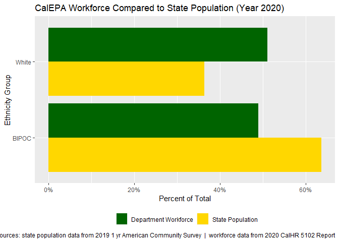<!-- -->

``` r
(pl_5102_dept_l1_stack <- df_5102_dept_1yr %>% 
        fun_summary_5102_l1() %>% 
        bind_rows(acs_data_level1) %>% 
        fun_plot_5102_l1_stack(plot_title = default_pl_title, 
                               plot_caption = default_pl_caption))
```

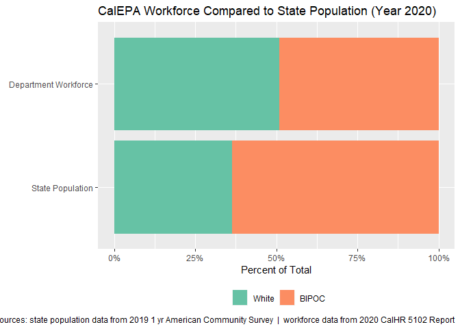<!-- -->

``` r
# ggsave(filename = here('07_slides', '2021-05-14', 'images', 
#                        '5102_dept_level1_stack.png'), 
#        plot = pl_5102_dept_l1_stack, 
#        width = 10, 
#        height = 6, 
#        dpi = 125
#        )

# # patchwork (combine plots) - Level 1
# pl_5512_patch_dept_l1 <- pl_5102_dept_l1_stack / pl_5102_dept_l1
```

#### Level 2 Ethnicity

``` r
### Level 2 ----
(pl_5102_dept_l2 <- df_5102_dept_1yr %>% 
     fun_summary_5102_l2() %>% 
     bind_rows(acs_data_level2) %>% 
     fun_plot_5102_l2(plot_title = default_pl_title, 
                      plot_caption = default_pl_caption))
```

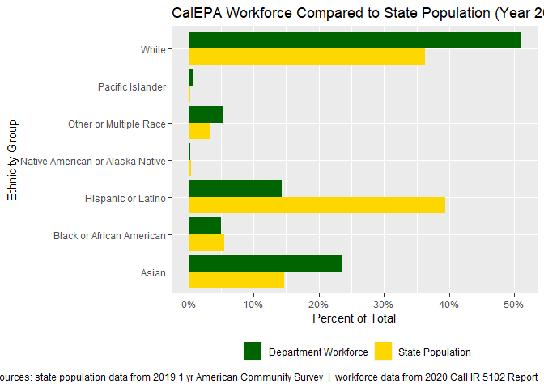<!-- -->

``` r
# ggsave(filename = here('07_slides', '2021-05-14', 'images', 
#                        '5102_dept_level2.png'), 
#        plot = pl_5102_dept_l2, 
#        width = 10, 
#        height = 6, 
#        dpi = 125
#        )

(pl_5102_dept_l2_stack <- df_5102_dept_1yr %>% 
        fun_summary_5102_l2() %>% 
        bind_rows(acs_data_level2) %>% 
        fun_plot_5102_l2_stack(plot_title = default_pl_title, 
                               plot_caption = default_pl_caption))
```

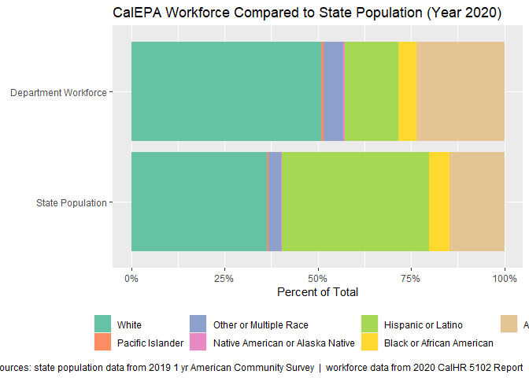<!-- -->

``` r
# ggsave(filename = here('07_slides', '2021-05-14', 'images', 
#                        '5102_dept_level2_stack.png'), 
#        plot = pl_5102_dept_l2_stack, 
#        width = 10, 
#        height = 6, 
#        dpi = 125
#        )

# patchwork (combine plots) - Level 1 and Level 2 stacked plots
pl_5102_patch_dept_stack_combined <- pl_5102_dept_l1_stack / pl_5102_dept_l2_stack
pl_5102_patch_dept_stack_combined[[1]] <- pl_5102_patch_dept_stack_combined[[1]] + 
    labs(title = element_blank(),
         subtitle = element_blank(),
         caption = element_blank())
pl_5102_patch_dept_stack_combined[[2]] <- pl_5102_patch_dept_stack_combined[[2]] + 
    labs(title = element_blank(),
         subtitle = element_blank(),
         caption = element_blank())
pl_5102_patch_dept_stack_combined <- pl_5102_patch_dept_stack_combined + 
    plot_layout(heights = c(1.7, 2)) +
    plot_annotation(
        title = default_pl_title,
        caption = default_pl_caption)
# ggsave(filename = here('07_slides', '2021-05-14', 'images', 
#                        '5102_dept_level1_2_combined_stack.png'), 
#        plot = pl_5102_patch_dept_stack_combined, 
#        width = 10, 
#        height = 6, 
#        dpi = 125
#        )

# patchwork (combine plots) - both L2 plots
pl_5102_patch_dept_l2 <- pl_5102_dept_l2_stack / pl_5102_dept_l2
pl_5102_patch_dept_l2[[1]] <- pl_5102_patch_dept_l2[[1]] + 
    labs(title = element_blank(),
         subtitle = element_blank(),
         caption = element_blank())
pl_5102_patch_dept_l2[[2]] <- pl_5102_patch_dept_l2[[2]] + 
    labs(title = element_blank(),
         subtitle = element_blank(),
         caption = element_blank())
pl_5102_patch_dept_l2 <- pl_5102_patch_dept_l2 + 
    plot_annotation(
        title = default_pl_title,
        caption = default_pl_caption)
# ggsave(filename = here('07_slides', '2021-05-14', 'images', 
#                        '5102_dept_level2_combined.png'), 
#        plot = pl_5102_patch_dept_l2, 
#        width = 10, 
#        height = 6, 
#        dpi = 125
#        )
```

### Department by Employee Class

To compare across employee categories, use the code chunks below to
identify your desired groupings and modify the categories/classes as you
see fit.

``` r
## 2.2. - Department By Group ----

# To view list of all categories
categories_list <- df_5102 %>% 
  distinct(employee_category,sub_category, class_title) %>% 
  arrange(employee_category) %>% 
  rename('Employee Category' = employee_category) %>%
  rename('Sub-Category' = sub_category) %>% 
  rename('Class Title' = class_title)


categories_list %>% 
    kbl() %>% 
    kable_paper() %>%
    scroll_box(width = "500px", height = "200px") %>%
    {.}
```

<div
style="border: 1px solid #ddd; padding: 0px; overflow-y: scroll; height:200px; overflow-x: scroll; width:500px; ">

<table class=" lightable-paper" style="font-family: &quot;Arial Narrow&quot;, arial, helvetica, sans-serif; margin-left: auto; margin-right: auto;">
<thead>
<tr>
<th style="text-align:left;position: sticky; top:0; background-color: #FFFFFF;">
Employee Category
</th>
<th style="text-align:left;position: sticky; top:0; background-color: #FFFFFF;">
Sub-Category
</th>
<th style="text-align:left;position: sticky; top:0; background-color: #FFFFFF;">
Class Title
</th>
</tr>
</thead>
<tbody>
<tr>
<td style="text-align:left;">
Architecture and Engineering Occupations
</td>
<td style="text-align:left;">
Electrical and Electronics Engineers
</td>
<td style="text-align:left;">
TELECOMMUNICATIONS SYSTEMS ANALYST I
</td>
</tr>
<tr>
<td style="text-align:left;">
Architecture and Engineering Occupations
</td>
<td style="text-align:left;">
Drafters
</td>
<td style="text-align:left;">
ARCHITECTURAL ASSISTANT
</td>
</tr>
<tr>
<td style="text-align:left;">
Architecture and Engineering Occupations
</td>
<td style="text-align:left;">
Electrical and Electronics Engineers
</td>
<td style="text-align:left;">
TELECOMMUNICATIONS SYSTEMS MANAGER I (SUPERVISOR)
</td>
</tr>
<tr>
<td style="text-align:left;">
Architecture and Engineering Occupations
</td>
<td style="text-align:left;">
Electrical and Electronics Engineers
</td>
<td style="text-align:left;">
TELECOMMUNICATIONS SYSTEMS ANALYST II
</td>
</tr>
<tr>
<td style="text-align:left;">
Architecture and Engineering Occupations
</td>
<td style="text-align:left;">
Environmental Engineers
</td>
<td style="text-align:left;">
AIR RESOURCES ENGINEER
</td>
</tr>
<tr>
<td style="text-align:left;">
Architecture and Engineering Occupations
</td>
<td style="text-align:left;">
Environmental Engineers
</td>
<td style="text-align:left;">
AIR RESOURCES SUPERVISOR I
</td>
</tr>
<tr>
<td style="text-align:left;">
Architecture and Engineering Occupations
</td>
<td style="text-align:left;">
Environmental Engineers
</td>
<td style="text-align:left;">
AIR RESOURCES SUPERVISOR II
</td>
</tr>
<tr>
<td style="text-align:left;">
Architecture and Engineering Occupations
</td>
<td style="text-align:left;">
Civil Engineers
</td>
<td style="text-align:left;">
SENIOR ENGINEER, SAN FRANCISCO BAY CONSERVATION AND DEVELOPMENT
COMMISSION
</td>
</tr>
<tr>
<td style="text-align:left;">
Architecture and Engineering Occupations
</td>
<td style="text-align:left;">
Mining and Geological Engineers, Including Mining Safety Engineers
</td>
<td style="text-align:left;">
SENIOR ENGINEERING GEOLOGIST
</td>
</tr>
<tr>
<td style="text-align:left;">
Architecture and Engineering Occupations
</td>
<td style="text-align:left;">
Civil Engineers
</td>
<td style="text-align:left;">
ENGINEER, WATER RESOURCES
</td>
</tr>
<tr>
<td style="text-align:left;">
Architecture and Engineering Occupations
</td>
<td style="text-align:left;">
Civil Engineers
</td>
<td style="text-align:left;">
SUPERVISING HYDRAULIC ENGINEER
</td>
</tr>
<tr>
<td style="text-align:left;">
Architecture and Engineering Occupations
</td>
<td style="text-align:left;">
Civil Engineers
</td>
<td style="text-align:left;">
SENIOR HYDRAULIC ENGINEER
</td>
</tr>
<tr>
<td style="text-align:left;">
Architecture and Engineering Occupations
</td>
<td style="text-align:left;">
Industrial Engineers, Including Health and Safety
</td>
<td style="text-align:left;">
SENIOR INDUSTRIAL HYGIENE SPECIALIST, STATE COMPENSATION INSURANCE FUND
</td>
</tr>
<tr>
<td style="text-align:left;">
Architecture and Engineering Occupations
</td>
<td style="text-align:left;">
Mining and Geological Engineers, Including Mining Safety Engineers
</td>
<td style="text-align:left;">
ENERGY AND MINERAL RESOURCES ENGINEER
</td>
</tr>
<tr>
<td style="text-align:left;">
Architecture and Engineering Occupations
</td>
<td style="text-align:left;">
Civil Engineers
</td>
<td style="text-align:left;">
SENIOR CIVIL ENGINEER
</td>
</tr>
<tr>
<td style="text-align:left;">
Architecture and Engineering Occupations
</td>
<td style="text-align:left;">
Petroleum Engineers
</td>
<td style="text-align:left;">
SENIOR OIL AND GAS ENGINEER (SUPERVISOR)
</td>
</tr>
<tr>
<td style="text-align:left;">
Architecture and Engineering Occupations
</td>
<td style="text-align:left;">
Petroleum Engineers
</td>
<td style="text-align:left;">
ASSOCIATE OIL AND GAS ENGINEER
</td>
</tr>
<tr>
<td style="text-align:left;">
Architecture and Engineering Occupations
</td>
<td style="text-align:left;">
Engineering Technicians, Except Drafters
</td>
<td style="text-align:left;">
OIL AND GAS TECHNICIAN I
</td>
</tr>
<tr>
<td style="text-align:left;">
Architecture and Engineering Occupations
</td>
<td style="text-align:left;">
Mining and Geological Engineers, Including Mining Safety Engineers
</td>
<td style="text-align:left;">
SUPERVISING ENGINEERING GEOLOGIST
</td>
</tr>
<tr>
<td style="text-align:left;">
Architecture and Engineering Occupations
</td>
<td style="text-align:left;">
Civil Engineers
</td>
<td style="text-align:left;">
ASSOCIATE CIVIL ENGINEER
</td>
</tr>
<tr>
<td style="text-align:left;">
Architecture and Engineering Occupations
</td>
<td style="text-align:left;">
Drafters
</td>
<td style="text-align:left;">
GEOLOGICAL DRAFTING TECHNICIAN
</td>
</tr>
<tr>
<td style="text-align:left;">
Architecture and Engineering Occupations
</td>
<td style="text-align:left;">
Electrical and Electronics Engineers
</td>
<td style="text-align:left;">
STAFF ELECTRONICS AND INSTRUMENTATION ENGINEER
</td>
</tr>
<tr>
<td style="text-align:left;">
Architecture and Engineering Occupations
</td>
<td style="text-align:left;">
Engineering Technicians, Except Drafters
</td>
<td style="text-align:left;">
OIL AND GAS TECHNICIAN III
</td>
</tr>
<tr>
<td style="text-align:left;">
Architecture and Engineering Occupations
</td>
<td style="text-align:left;">
Engineering Technicians, Except Drafters
</td>
<td style="text-align:left;">
PRECISION ELECTRONICS SPECIALIST
</td>
</tr>
<tr>
<td style="text-align:left;">
Architecture and Engineering Occupations
</td>
<td style="text-align:left;">
Materials Engineers
</td>
<td style="text-align:left;">
SENIOR MATERIALS AND RESEARCH ENGINEER
</td>
</tr>
<tr>
<td style="text-align:left;">
Architecture and Engineering Occupations
</td>
<td style="text-align:left;">
Petroleum Engineers
</td>
<td style="text-align:left;">
SUPERVISING OIL AND GAS ENGINEER
</td>
</tr>
<tr>
<td style="text-align:left;">
Architecture and Engineering Occupations
</td>
<td style="text-align:left;">
Environmental Engineers
</td>
<td style="text-align:left;">
AIR QUALITY ENGINEER I, DEPARTMENT OF CONSUMER AFFAIRS
</td>
</tr>
<tr>
<td style="text-align:left;">
Architecture and Engineering Occupations
</td>
<td style="text-align:left;">
Environmental Engineers
</td>
<td style="text-align:left;">
AIR QUALITY ENGINEER II, DEPARTMENT OF CONSUMER AFFAIRS
</td>
</tr>
<tr>
<td style="text-align:left;">
Architecture and Engineering Occupations
</td>
<td style="text-align:left;">
Industrial Engineers, Including Health and Safety
</td>
<td style="text-align:left;">
FLAMMABILITY RESEARCH TEST ENGINEER
</td>
</tr>
<tr>
<td style="text-align:left;">
Architecture and Engineering Occupations
</td>
<td style="text-align:left;">
Miscellaneous Engineers
</td>
<td style="text-align:left;">
SENIOR REGISTRAR, BOARD FOR PROFESSIONAL ENGINEERS AND LAND SURVEYORS
</td>
</tr>
<tr>
<td style="text-align:left;">
Architecture and Engineering Occupations
</td>
<td style="text-align:left;">
Engineering Technicians, Except Drafters
</td>
<td style="text-align:left;">
STUDENT ASSISTANT -ENGINEERING AND ARCHITECTURAL SCIENCES-
</td>
</tr>
<tr>
<td style="text-align:left;">
Architecture and Engineering Occupations
</td>
<td style="text-align:left;">
Environmental Engineers
</td>
<td style="text-align:left;">
SENIOR AIR QUALITY ENGINEER, DEPARTMENT OF CONSUMER AFFAIRS
</td>
</tr>
<tr>
<td style="text-align:left;">
Architecture and Engineering Occupations
</td>
<td style="text-align:left;">
Civil Engineers
</td>
<td style="text-align:left;">
PROJECT DIRECTOR I
</td>
</tr>
<tr>
<td style="text-align:left;">
Architecture and Engineering Occupations
</td>
<td style="text-align:left;">
Surveyors, Cartographers, and Photogrammetrists
</td>
<td style="text-align:left;">
PRISON INDUSTRIES MANAGER (DIGITAL SERVICES)
</td>
</tr>
<tr>
<td style="text-align:left;">
Architecture and Engineering Occupations
</td>
<td style="text-align:left;">
Architects, Except Naval
</td>
<td style="text-align:left;">
SENIOR ARCHITECT
</td>
</tr>
<tr>
<td style="text-align:left;">
Architecture and Engineering Occupations
</td>
<td style="text-align:left;">
Electrical and Electronics Engineers
</td>
<td style="text-align:left;">
SENIOR ELECTRICAL ENGINEER
</td>
</tr>
<tr>
<td style="text-align:left;">
Architecture and Engineering Occupations
</td>
<td style="text-align:left;">
Electrical and Electronics Engineers
</td>
<td style="text-align:left;">
ASSOCIATE ELECTRONICS ENGINEER
</td>
</tr>
<tr>
<td style="text-align:left;">
Architecture and Engineering Occupations
</td>
<td style="text-align:left;">
Civil Engineers
</td>
<td style="text-align:left;">
PROJECT DIRECTOR II
</td>
</tr>
<tr>
<td style="text-align:left;">
Architecture and Engineering Occupations
</td>
<td style="text-align:left;">
Architects, Except Naval
</td>
<td style="text-align:left;">
SUPERVISING ARCHITECT
</td>
</tr>
<tr>
<td style="text-align:left;">
Architecture and Engineering Occupations
</td>
<td style="text-align:left;">
Mechanical Engineers
</td>
<td style="text-align:left;">
SUPERVISING MECHANICAL ENGINEER
</td>
</tr>
<tr>
<td style="text-align:left;">
Architecture and Engineering Occupations
</td>
<td style="text-align:left;">
Mechanical Engineers
</td>
<td style="text-align:left;">
SENIOR MECHANICAL ENGINEER
</td>
</tr>
<tr>
<td style="text-align:left;">
Architecture and Engineering Occupations
</td>
<td style="text-align:left;">
Architects, Except Naval
</td>
<td style="text-align:left;">
ASSOCIATE ARCHITECT
</td>
</tr>
<tr>
<td style="text-align:left;">
Architecture and Engineering Occupations
</td>
<td style="text-align:left;">
Biomedical Engineers
</td>
<td style="text-align:left;">
RESEARCH DATA SPECIALIST III
</td>
</tr>
<tr>
<td style="text-align:left;">
Architecture and Engineering Occupations
</td>
<td style="text-align:left;">
Civil Engineers
</td>
<td style="text-align:left;">
PROJECT DIRECTOR III
</td>
</tr>
<tr>
<td style="text-align:left;">
Architecture and Engineering Occupations
</td>
<td style="text-align:left;">
Electrical and Electronics Engineers
</td>
<td style="text-align:left;">
SUPERVISING ELECTRICAL ENGINEER
</td>
</tr>
<tr>
<td style="text-align:left;">
Architecture and Engineering Occupations
</td>
<td style="text-align:left;">
Civil Engineers
</td>
<td style="text-align:left;">
SENIOR ENGINEER WATER RESOURCES
</td>
</tr>
<tr>
<td style="text-align:left;">
Architecture and Engineering Occupations
</td>
<td style="text-align:left;">
Engineering Technicians, Except Drafters
</td>
<td style="text-align:left;">
ELECTRONICS TECHNICIAN SUPERVISOR
</td>
</tr>
<tr>
<td style="text-align:left;">
Architecture and Engineering Occupations
</td>
<td style="text-align:left;">
Electrical and Electronics Engineers
</td>
<td style="text-align:left;">
ASSOCIATE ELECTRICAL ENGINEER
</td>
</tr>
<tr>
<td style="text-align:left;">
Architecture and Engineering Occupations
</td>
<td style="text-align:left;">
Mechanical Engineers
</td>
<td style="text-align:left;">
MECHANICAL ENGINEER
</td>
</tr>
<tr>
<td style="text-align:left;">
Architecture and Engineering Occupations
</td>
<td style="text-align:left;">
Electrical and Electronics Engineers
</td>
<td style="text-align:left;">
ELECTRICAL ENGINEER
</td>
</tr>
<tr>
<td style="text-align:left;">
Architecture and Engineering Occupations
</td>
<td style="text-align:left;">
Mechanical Engineers
</td>
<td style="text-align:left;">
ASSOCIATE MECHANICAL ENGINEER
</td>
</tr>
<tr>
<td style="text-align:left;">
Architecture and Engineering Occupations
</td>
<td style="text-align:left;">
Mechanical Engineers
</td>
<td style="text-align:left;">
ASSOCIATE AUTOMOTIVE EQUIPMENT STANDARDS ENGINEER
</td>
</tr>
<tr>
<td style="text-align:left;">
Architecture and Engineering Occupations
</td>
<td style="text-align:left;">
Environmental Engineers
</td>
<td style="text-align:left;">
WATER RESOURCE CONTROL ENGINEER
</td>
</tr>
<tr>
<td style="text-align:left;">
Architecture and Engineering Occupations
</td>
<td style="text-align:left;">
Petroleum Engineers
</td>
<td style="text-align:left;">
SENIOR PETROLEUM AND MINING APPRAISAL ENGINEER
</td>
</tr>
<tr>
<td style="text-align:left;">
Architecture and Engineering Occupations
</td>
<td style="text-align:left;">
Engineering Technicians, Except Drafters
</td>
<td style="text-align:left;">
CIVIL ENGINEERING ASSOCIATE
</td>
</tr>
<tr>
<td style="text-align:left;">
Architecture and Engineering Occupations
</td>
<td style="text-align:left;">
Civil Engineers
</td>
<td style="text-align:left;">
TRANSPORTATION ENGINEER (CIVIL)
</td>
</tr>
<tr>
<td style="text-align:left;">
Architecture and Engineering Occupations
</td>
<td style="text-align:left;">
Civil Engineers
</td>
<td style="text-align:left;">
ASSOCIATE HYDRAULIC ENGINEER
</td>
</tr>
<tr>
<td style="text-align:left;">
Architecture and Engineering Occupations
</td>
<td style="text-align:left;">
Electrical and Electronics Engineers
</td>
<td style="text-align:left;">
TELECOMMUNICATIONS SYSTEMS MANAGER I (SPECIALIST)
</td>
</tr>
<tr>
<td style="text-align:left;">
Architecture and Engineering Occupations
</td>
<td style="text-align:left;">
Industrial Engineers, Including Health and Safety
</td>
<td style="text-align:left;">
ASSOCIATE SAFETY ENGINEER
</td>
</tr>
<tr>
<td style="text-align:left;">
Architecture and Engineering Occupations
</td>
<td style="text-align:left;">
Drafters
</td>
<td style="text-align:left;">
ARCHITECTURAL ASSOCIATE
</td>
</tr>
<tr>
<td style="text-align:left;">
Architecture and Engineering Occupations
</td>
<td style="text-align:left;">
Industrial Engineers, Including Health and Safety
</td>
<td style="text-align:left;">
PIPELINE SAFETY ENGINEER
</td>
</tr>
<tr>
<td style="text-align:left;">
Architecture and Engineering Occupations
</td>
<td style="text-align:left;">
Engineering Technicians, Except Drafters
</td>
<td style="text-align:left;">
CIVIL ENGINEERING TECHNICIAN II
</td>
</tr>
<tr>
<td style="text-align:left;">
Architecture and Engineering Occupations
</td>
<td style="text-align:left;">
Industrial Engineers, Including Health and Safety
</td>
<td style="text-align:left;">
SUPERVISING PIPELINE SAFETY ENGINEER
</td>
</tr>
<tr>
<td style="text-align:left;">
Architecture and Engineering Occupations
</td>
<td style="text-align:left;">
Surveyors, Cartographers, and Photogrammetrists
</td>
<td style="text-align:left;">
TRANSPORTATION SURVEYOR (CALTRANS)
</td>
</tr>
<tr>
<td style="text-align:left;">
Architecture and Engineering Occupations
</td>
<td style="text-align:left;">
Surveyors, Cartographers, and Photogrammetrists
</td>
<td style="text-align:left;">
TRANSPORTATION SURVEYOR PARTY CHIEF (CALTRANS)
</td>
</tr>
<tr>
<td style="text-align:left;">
Architecture and Engineering Occupations
</td>
<td style="text-align:left;">
Surveyors, Cartographers, and Photogrammetrists
</td>
<td style="text-align:left;">
SENIOR LAND SURVEYOR
</td>
</tr>
<tr>
<td style="text-align:left;">
Architecture and Engineering Occupations
</td>
<td style="text-align:left;">
Electrical and Electronics Engineers
</td>
<td style="text-align:left;">
ASSOCIATE TELECOMMUNICATIONS ENGINEER
</td>
</tr>
<tr>
<td style="text-align:left;">
Architecture and Engineering Occupations
</td>
<td style="text-align:left;">
Electrical and Electronics Engineers
</td>
<td style="text-align:left;">
SENIOR TELECOMMUNICATIONS ENGINEER
</td>
</tr>
<tr>
<td style="text-align:left;">
Architecture and Engineering Occupations
</td>
<td style="text-align:left;">
Civil Engineers
</td>
<td style="text-align:left;">
SUPERVISING STRUCTURAL ENGINEER
</td>
</tr>
<tr>
<td style="text-align:left;">
Architecture and Engineering Occupations
</td>
<td style="text-align:left;">
Civil Engineers
</td>
<td style="text-align:left;">
DISTRICT STRUCTURAL ENGINEER
</td>
</tr>
<tr>
<td style="text-align:left;">
Architecture and Engineering Occupations
</td>
<td style="text-align:left;">
Civil Engineers
</td>
<td style="text-align:left;">
SENIOR STRUCTURAL ENGINEER
</td>
</tr>
<tr>
<td style="text-align:left;">
Architecture and Engineering Occupations
</td>
<td style="text-align:left;">
Industrial Engineers, Including Health and Safety
</td>
<td style="text-align:left;">
FIRE AND LIFE SAFETY OFFICER II (DIVISION OF THE STATE ARCHITECT)
</td>
</tr>
<tr>
<td style="text-align:left;">
Architecture and Engineering Occupations
</td>
<td style="text-align:left;">
Materials Engineers
</td>
<td style="text-align:left;">
SENIOR PROCUREMENT ENGINEER
</td>
</tr>
<tr>
<td style="text-align:left;">
Architecture and Engineering Occupations
</td>
<td style="text-align:left;">
Materials Engineers
</td>
<td style="text-align:left;">
ASSOCIATE PROCUREMENT ENGINEER
</td>
</tr>
<tr>
<td style="text-align:left;">
Architecture and Engineering Occupations
</td>
<td style="text-align:left;">
Industrial Engineers, Including Health and Safety
</td>
<td style="text-align:left;">
FIRE AND LIFE SAFETY OFFICER I (DIVISION OF THE STATE ARCHITECT)
</td>
</tr>
<tr>
<td style="text-align:left;">
Architecture and Engineering Occupations
</td>
<td style="text-align:left;">
Architects, Except Naval
</td>
<td style="text-align:left;">
SENIOR LANDSCAPE ARCHITECT
</td>
</tr>
<tr>
<td style="text-align:left;">
Architecture and Engineering Occupations
</td>
<td style="text-align:left;">
Civil Engineers
</td>
<td style="text-align:left;">
STRUCTURAL ENGINEERING ASSOCIATE
</td>
</tr>
<tr>
<td style="text-align:left;">
Architecture and Engineering Occupations
</td>
<td style="text-align:left;">
Architects, Except Naval
</td>
<td style="text-align:left;">
ASSOCIATE LANDSCAPE ARCHITECT (SPECIALIST)
</td>
</tr>
<tr>
<td style="text-align:left;">
Architecture and Engineering Occupations
</td>
<td style="text-align:left;">
Drafters
</td>
<td style="text-align:left;">
SENIOR DELINEATOR
</td>
</tr>
<tr>
<td style="text-align:left;">
Architecture and Engineering Occupations
</td>
<td style="text-align:left;">
Drafters
</td>
<td style="text-align:left;">
DELINEATOR
</td>
</tr>
<tr>
<td style="text-align:left;">
Architecture and Engineering Occupations
</td>
<td style="text-align:left;">
Civil Engineers
</td>
<td style="text-align:left;">
SUPERVISING ENGINEER -CIVIL SECTION- OFFICE OF ARCHITECTURE AND
CONSTRUCTION
</td>
</tr>
<tr>
<td style="text-align:left;">
Architecture and Engineering Occupations
</td>
<td style="text-align:left;">
Drafters
</td>
<td style="text-align:left;">
MECHANICAL ENGINEERING TECHNICIAN I
</td>
</tr>
<tr>
<td style="text-align:left;">
Architecture and Engineering Occupations
</td>
<td style="text-align:left;">
Industrial Engineers, Including Health and Safety
</td>
<td style="text-align:left;">
PRINCIPAL-FIRE AND LIFE SAFETY (DIVISION OF THE STATE ARCHITECT)
</td>
</tr>
<tr>
<td style="text-align:left;">
Architecture and Engineering Occupations
</td>
<td style="text-align:left;">
Industrial Engineers, Including Health and Safety
</td>
<td style="text-align:left;">
FIRE AND LIFE SAFETY OFFICER II (HEALTH FACILITIES CONSTRUCTION)
</td>
</tr>
<tr>
<td style="text-align:left;">
Architecture and Engineering Occupations
</td>
<td style="text-align:left;">
Civil Engineers
</td>
<td style="text-align:left;">
SUPERVISOR, HEALTH FACILITIES REVIEW
</td>
</tr>
<tr>
<td style="text-align:left;">
Architecture and Engineering Occupations
</td>
<td style="text-align:left;">
Industrial Engineers, Including Health and Safety
</td>
<td style="text-align:left;">
FIRE AND LIFE SAFETY OFFICER I (HEALTH FACILITIES CONSTRUCTION)
</td>
</tr>
<tr>
<td style="text-align:left;">
Architecture and Engineering Occupations
</td>
<td style="text-align:left;">
Industrial Engineers, Including Health and Safety
</td>
<td style="text-align:left;">
CHIEF FIRE AND LIFE SAFETY OFFICER (HEALTH FACILITIES CONSTRUCTION)
</td>
</tr>
<tr>
<td style="text-align:left;">
Architecture and Engineering Occupations
</td>
<td style="text-align:left;">
Civil Engineers
</td>
<td style="text-align:left;">
SENIOR TRANSPORTATION ENGINEER, CALTRANS
</td>
</tr>
<tr>
<td style="text-align:left;">
Architecture and Engineering Occupations
</td>
<td style="text-align:left;">
Mechanical Engineers
</td>
<td style="text-align:left;">
AUTOMOTIVE EQUIPMENT STANDARDS ENGINEER
</td>
</tr>
<tr>
<td style="text-align:left;">
Architecture and Engineering Occupations
</td>
<td style="text-align:left;">
Mechanical Engineers
</td>
<td style="text-align:left;">
SENIOR AUTOMOTIVE EQUIPMENT STANDARDS ENGINEER
</td>
</tr>
<tr>
<td style="text-align:left;">
Architecture and Engineering Occupations
</td>
<td style="text-align:left;">
Architects, Except Naval
</td>
<td style="text-align:left;">
SENIOR DESIGN OFFICER, CALIFORNIA HOUSING FINANCE AGENCY
</td>
</tr>
<tr>
<td style="text-align:left;">
Architecture and Engineering Occupations
</td>
<td style="text-align:left;">
Industrial Engineers, Including Health and Safety
</td>
<td style="text-align:left;">
ASSOCIATE SAFETY ENGINEER (PRESSURE VESSELS)
</td>
</tr>
<tr>
<td style="text-align:left;">
Architecture and Engineering Occupations
</td>
<td style="text-align:left;">
Industrial Engineers, Including Health and Safety
</td>
<td style="text-align:left;">
ASSOCIATE SAFETY ENGINEER (ELEVATORS)
</td>
</tr>
<tr>
<td style="text-align:left;">
Architecture and Engineering Occupations
</td>
<td style="text-align:left;">
Industrial Engineers, Including Health and Safety
</td>
<td style="text-align:left;">
DISTRICT MANAGER, DIVISION OF OCCUPATIONAL SAFETY AND HEALTH
</td>
</tr>
<tr>
<td style="text-align:left;">
Architecture and Engineering Occupations
</td>
<td style="text-align:left;">
Industrial Engineers, Including Health and Safety
</td>
<td style="text-align:left;">
SENIOR SAFETY ENGINEER -PRESSURE VESSELS-
</td>
</tr>
<tr>
<td style="text-align:left;">
Architecture and Engineering Occupations
</td>
<td style="text-align:left;">
Industrial Engineers, Including Health and Safety
</td>
<td style="text-align:left;">
SENIOR SAFETY ENGINEER -INDUSTRIAL-
</td>
</tr>
<tr>
<td style="text-align:left;">
Architecture and Engineering Occupations
</td>
<td style="text-align:left;">
Industrial Engineers, Including Health and Safety
</td>
<td style="text-align:left;">
JUNIOR SAFETY ENGINEER
</td>
</tr>
<tr>
<td style="text-align:left;">
Architecture and Engineering Occupations
</td>
<td style="text-align:left;">
Industrial Engineers, Including Health and Safety
</td>
<td style="text-align:left;">
SENIOR SAFETY ENGINEER -ELEVATORS-
</td>
</tr>
<tr>
<td style="text-align:left;">
Architecture and Engineering Occupations
</td>
<td style="text-align:left;">
Industrial Engineers, Including Health and Safety
</td>
<td style="text-align:left;">
AREA MANAGER, CAL/OSHA CONSULTATION SERVICE
</td>
</tr>
<tr>
<td style="text-align:left;">
Architecture and Engineering Occupations
</td>
<td style="text-align:left;">
Industrial Engineers, Including Health and Safety
</td>
<td style="text-align:left;">
ASSISTANT SAFETY ENGINEER
</td>
</tr>
<tr>
<td style="text-align:left;">
Architecture and Engineering Occupations
</td>
<td style="text-align:left;">
Industrial Engineers, Including Health and Safety
</td>
<td style="text-align:left;">
ASSOCIATE SAFETY ENGINEER (MINING, TUNNELING AND MINERAL INDUSTRIES)
</td>
</tr>
<tr>
<td style="text-align:left;">
Architecture and Engineering Occupations
</td>
<td style="text-align:left;">
Industrial Engineers, Including Health and Safety
</td>
<td style="text-align:left;">
SENIOR SAFETY ENGINEER (AMUSEMENT RIDES)
</td>
</tr>
<tr>
<td style="text-align:left;">
Architecture and Engineering Occupations
</td>
<td style="text-align:left;">
Industrial Engineers, Including Health and Safety
</td>
<td style="text-align:left;">
ASSOCIATE SAFETY ENGINEER (AMUSEMENT RIDES)
</td>
</tr>
<tr>
<td style="text-align:left;">
Architecture and Engineering Occupations
</td>
<td style="text-align:left;">
Industrial Engineers, Including Health and Safety
</td>
<td style="text-align:left;">
SENIOR SAFETY ENGINEER -MINING AND TUNNELING-
</td>
</tr>
<tr>
<td style="text-align:left;">
Architecture and Engineering Occupations
</td>
<td style="text-align:left;">
Architects, Except Naval
</td>
<td style="text-align:left;">
LANDSCAPE ARCHITECT
</td>
</tr>
<tr>
<td style="text-align:left;">
Architecture and Engineering Occupations
</td>
<td style="text-align:left;">
Mechanical Engineers
</td>
<td style="text-align:left;">
EQUIPMENT ENGINEER
</td>
</tr>
<tr>
<td style="text-align:left;">
Architecture and Engineering Occupations
</td>
<td style="text-align:left;">
Architects, Except Naval
</td>
<td style="text-align:left;">
RESTORATION ARCHITECT
</td>
</tr>
<tr>
<td style="text-align:left;">
Architecture and Engineering Occupations
</td>
<td style="text-align:left;">
Architects, Except Naval
</td>
<td style="text-align:left;">
SENIOR RESTORATION ARCHITECT
</td>
</tr>
<tr>
<td style="text-align:left;">
Architecture and Engineering Occupations
</td>
<td style="text-align:left;">
Environmental Engineers
</td>
<td style="text-align:left;">
ASSOCIATE SANITARY ENGINEER
</td>
</tr>
<tr>
<td style="text-align:left;">
Architecture and Engineering Occupations
</td>
<td style="text-align:left;">
Mechanical Engineers
</td>
<td style="text-align:left;">
SENIOR EQUIPMENT ENGINEER
</td>
</tr>
<tr>
<td style="text-align:left;">
Architecture and Engineering Occupations
</td>
<td style="text-align:left;">
Industrial Engineers, Including Health and Safety
</td>
<td style="text-align:left;">
ASSOCIATE PRODUCT ENGINEER, PRISON INDUSTRIES
</td>
</tr>
<tr>
<td style="text-align:left;">
Architecture and Engineering Occupations
</td>
<td style="text-align:left;">
Environmental Engineers
</td>
<td style="text-align:left;">
SENIOR SANITARY ENGINEER
</td>
</tr>
<tr>
<td style="text-align:left;">
Architecture and Engineering Occupations
</td>
<td style="text-align:left;">
Environmental Engineers
</td>
<td style="text-align:left;">
SANITARY ENGINEER
</td>
</tr>
<tr>
<td style="text-align:left;">
Architecture and Engineering Occupations
</td>
<td style="text-align:left;">
Engineering Technicians, Except Drafters
</td>
<td style="text-align:left;">
SANITARY ENGINEERING TECHNICIAN
</td>
</tr>
<tr>
<td style="text-align:left;">
Architecture and Engineering Occupations
</td>
<td style="text-align:left;">
Environmental Engineers
</td>
<td style="text-align:left;">
SUPERVISING SANITARY ENGINEER
</td>
</tr>
<tr>
<td style="text-align:left;">
Architecture and Engineering Occupations
</td>
<td style="text-align:left;">
Engineering Technicians, Except Drafters
</td>
<td style="text-align:left;">
SANITARY ENGINEERING ASSOCIATE
</td>
</tr>
<tr>
<td style="text-align:left;">
Architecture and Engineering Occupations
</td>
<td style="text-align:left;">
Miscellaneous Engineers
</td>
<td style="text-align:left;">
SENIOR UTILITIES ENGINEER (SUPERVISOR)
</td>
</tr>
<tr>
<td style="text-align:left;">
Architecture and Engineering Occupations
</td>
<td style="text-align:left;">
Miscellaneous Engineers
</td>
<td style="text-align:left;">
SENIOR UTILITIES ENGINEER (SPECIALIST)
</td>
</tr>
<tr>
<td style="text-align:left;">
Architecture and Engineering Occupations
</td>
<td style="text-align:left;">
Miscellaneous Engineers
</td>
<td style="text-align:left;">
UTILITIES ENGINEER
</td>
</tr>
<tr>
<td style="text-align:left;">
Architecture and Engineering Occupations
</td>
<td style="text-align:left;">
Biomedical Engineers
</td>
<td style="text-align:left;">
SENIOR REHABILITATION ENGINEERING CONSULTANT
</td>
</tr>
<tr>
<td style="text-align:left;">
Architecture and Engineering Occupations
</td>
<td style="text-align:left;">
Environmental Engineers
</td>
<td style="text-align:left;">
SENIOR WASTE MANAGEMENT ENGINEER
</td>
</tr>
<tr>
<td style="text-align:left;">
Architecture and Engineering Occupations
</td>
<td style="text-align:left;">
Environmental Engineers
</td>
<td style="text-align:left;">
WASTE MANAGEMENT ENGINEER
</td>
</tr>
<tr>
<td style="text-align:left;">
Architecture and Engineering Occupations
</td>
<td style="text-align:left;">
Environmental Engineers
</td>
<td style="text-align:left;">
SUPERVISING WASTE MANAGEMENT ENGINEER
</td>
</tr>
<tr>
<td style="text-align:left;">
Architecture and Engineering Occupations
</td>
<td style="text-align:left;">
Civil Engineers
</td>
<td style="text-align:left;">
ASSOCIATE ENGINEER, PETROLEUM STRUCTURES
</td>
</tr>
<tr>
<td style="text-align:left;">
Architecture and Engineering Occupations
</td>
<td style="text-align:left;">
Civil Engineers
</td>
<td style="text-align:left;">
SENIOR ENGINEER, PETROLEUM STRUCTURES (SPECIALIST)
</td>
</tr>
<tr>
<td style="text-align:left;">
Architecture and Engineering Occupations
</td>
<td style="text-align:left;">
Mining and Geological Engineers, Including Mining Safety Engineers
</td>
<td style="text-align:left;">
ASSOCIATE MINERAL RESOURCES ENGINEER
</td>
</tr>
<tr>
<td style="text-align:left;">
Architecture and Engineering Occupations
</td>
<td style="text-align:left;">
Industrial Engineers, Including Health and Safety
</td>
<td style="text-align:left;">
ASSOCIATE PROCESS SAFETY ENGINEER
</td>
</tr>
<tr>
<td style="text-align:left;">
Architecture and Engineering Occupations
</td>
<td style="text-align:left;">
Surveyors, Cartographers, and Photogrammetrists
</td>
<td style="text-align:left;">
ASSISTANT BOUNDARY DETERMINATION OFFICER
</td>
</tr>
<tr>
<td style="text-align:left;">
Architecture and Engineering Occupations
</td>
<td style="text-align:left;">
Mining and Geological Engineers, Including Mining Safety Engineers
</td>
<td style="text-align:left;">
SENIOR MINERAL RESOURCES ENGINEER
</td>
</tr>
<tr>
<td style="text-align:left;">
Architecture and Engineering Occupations
</td>
<td style="text-align:left;">
Petroleum Engineers
</td>
<td style="text-align:left;">
PETROLEUM RESERVOIR ENGINEER STATE LANDS DIVISION
</td>
</tr>
<tr>
<td style="text-align:left;">
Architecture and Engineering Occupations
</td>
<td style="text-align:left;">
Petroleum Engineers
</td>
<td style="text-align:left;">
PETROLEUM PRODUCTION ENGINEER
</td>
</tr>
<tr>
<td style="text-align:left;">
Architecture and Engineering Occupations
</td>
<td style="text-align:left;">
Petroleum Engineers
</td>
<td style="text-align:left;">
PETROLEUM DRILLING ENGINEER
</td>
</tr>
<tr>
<td style="text-align:left;">
Architecture and Engineering Occupations
</td>
<td style="text-align:left;">
Petroleum Engineers
</td>
<td style="text-align:left;">
SENIOR PROCESS SAFETY ENGINEER (SUPERVISOR)
</td>
</tr>
<tr>
<td style="text-align:left;">
Architecture and Engineering Occupations
</td>
<td style="text-align:left;">
Surveying and Mapping Technicians
</td>
<td style="text-align:left;">
BOUNDARY DETERMINATION TECHNICIAN
</td>
</tr>
<tr>
<td style="text-align:left;">
Architecture and Engineering Occupations
</td>
<td style="text-align:left;">
Surveyors, Cartographers, and Photogrammetrists
</td>
<td style="text-align:left;">
SENIOR BOUNDARY DETERMINATION OFFICER (SPECIALIST)
</td>
</tr>
<tr>
<td style="text-align:left;">
Architecture and Engineering Occupations
</td>
<td style="text-align:left;">
Surveyors, Cartographers, and Photogrammetrists
</td>
<td style="text-align:left;">
ASSOCIATE BOUNDARY DETERMINATION OFFICER
</td>
</tr>
<tr>
<td style="text-align:left;">
Architecture and Engineering Occupations
</td>
<td style="text-align:left;">
Surveyors, Cartographers, and Photogrammetrists
</td>
<td style="text-align:left;">
SENIOR BOUNDARY DETERMINATION OFFICER (SUPERVISORY)
</td>
</tr>
<tr>
<td style="text-align:left;">
Architecture and Engineering Occupations
</td>
<td style="text-align:left;">
Drafters
</td>
<td style="text-align:left;">
ELECTRICAL ENGINEERING TECHNICIAN II
</td>
</tr>
<tr>
<td style="text-align:left;">
Architecture and Engineering Occupations
</td>
<td style="text-align:left;">
Drafters
</td>
<td style="text-align:left;">
ELECTRICAL ENGINEERING TECHNICIAN I
</td>
</tr>
<tr>
<td style="text-align:left;">
Architecture and Engineering Occupations
</td>
<td style="text-align:left;">
Electrical and Electronics Engineers
</td>
<td style="text-align:left;">
SUPERVISING TELECOMMUNICATIONS ENGINEER
</td>
</tr>
<tr>
<td style="text-align:left;">
Architecture and Engineering Occupations
</td>
<td style="text-align:left;">
Electrical and Electronics Engineers
</td>
<td style="text-align:left;">
ASSISTANT TELECOMMUNICATIONS ENGINEER
</td>
</tr>
<tr>
<td style="text-align:left;">
Architecture and Engineering Occupations
</td>
<td style="text-align:left;">
Electrical and Electronics Engineers
</td>
<td style="text-align:left;">
TELECOMMUNICATIONS SYSTEMS MANAGER II (SUPERVISOR)
</td>
</tr>
<tr>
<td style="text-align:left;">
Architecture and Engineering Occupations
</td>
<td style="text-align:left;">
Environmental Engineers
</td>
<td style="text-align:left;">
SUPERVISING HAZARDOUS SUBSTANCES ENGINEER I
</td>
</tr>
<tr>
<td style="text-align:left;">
Architecture and Engineering Occupations
</td>
<td style="text-align:left;">
Environmental Engineers
</td>
<td style="text-align:left;">
SENIOR HAZARDOUS SUBSTANCES ENGINEER
</td>
</tr>
<tr>
<td style="text-align:left;">
Architecture and Engineering Occupations
</td>
<td style="text-align:left;">
Environmental Engineers
</td>
<td style="text-align:left;">
HAZARDOUS SUBSTANCES ENGINEER
</td>
</tr>
<tr>
<td style="text-align:left;">
Architecture and Engineering Occupations
</td>
<td style="text-align:left;">
Environmental Engineers
</td>
<td style="text-align:left;">
SUPERVISING HAZARDOUS SUBSTANCES ENGINEER II
</td>
</tr>
<tr>
<td style="text-align:left;">
Architecture and Engineering Occupations
</td>
<td style="text-align:left;">
Architects, Except Naval
</td>
<td style="text-align:left;">
LANDSCAPE ASSOCIATE, CALTRANS
</td>
</tr>
<tr>
<td style="text-align:left;">
Architecture and Engineering Occupations
</td>
<td style="text-align:left;">
Electrical and Electronics Engineers
</td>
<td style="text-align:left;">
SENIOR ELECTRICAL ENGINEER, CALTRANS (SPECIALIST)
</td>
</tr>
<tr>
<td style="text-align:left;">
Architecture and Engineering Occupations
</td>
<td style="text-align:left;">
Electrical and Electronics Engineers
</td>
<td style="text-align:left;">
TRANSPORTATION ENGINEER, (ELECTRICAL)
</td>
</tr>
<tr>
<td style="text-align:left;">
Architecture and Engineering Occupations
</td>
<td style="text-align:left;">
Architects, Except Naval
</td>
<td style="text-align:left;">
SENIOR LANDSCAPE ARCHITECT, CALTRANS
</td>
</tr>
<tr>
<td style="text-align:left;">
Architecture and Engineering Occupations
</td>
<td style="text-align:left;">
Civil Engineers
</td>
<td style="text-align:left;">
ASSOCIATE TRANSPORTATION ENGINEER, CALTRANS
</td>
</tr>
<tr>
<td style="text-align:left;">
Architecture and Engineering Occupations
</td>
<td style="text-align:left;">
Civil Engineers
</td>
<td style="text-align:left;">
ASSOCIATE TRANSPORTATION ENGINEER, CALTRANS (REGISTERED)
</td>
</tr>
<tr>
<td style="text-align:left;">
Architecture and Engineering Occupations
</td>
<td style="text-align:left;">
Civil Engineers
</td>
<td style="text-align:left;">
SENIOR BRIDGE ENGINEER
</td>
</tr>
<tr>
<td style="text-align:left;">
Architecture and Engineering Occupations
</td>
<td style="text-align:left;">
Civil Engineers
</td>
<td style="text-align:left;">
ASSOCIATE TRANSPORTATION ENGINEER, CALTRANS (SPECIALIST)
</td>
</tr>
<tr>
<td style="text-align:left;">
Architecture and Engineering Occupations
</td>
<td style="text-align:left;">
Drafters
</td>
<td style="text-align:left;">
LANDSCAPE TECHNICIAN
</td>
</tr>
<tr>
<td style="text-align:left;">
Architecture and Engineering Occupations
</td>
<td style="text-align:left;">
Drafters
</td>
<td style="text-align:left;">
STRUCTURAL DESIGN TECHNICIAN III
</td>
</tr>
<tr>
<td style="text-align:left;">
Architecture and Engineering Occupations
</td>
<td style="text-align:left;">
Drafters
</td>
<td style="text-align:left;">
STRUCTURAL DESIGN TECHNICIAN II
</td>
</tr>
<tr>
<td style="text-align:left;">
Architecture and Engineering Occupations
</td>
<td style="text-align:left;">
Drafters
</td>
<td style="text-align:left;">
STRUCTURAL DESIGN TECHNICIAN I
</td>
</tr>
<tr>
<td style="text-align:left;">
Architecture and Engineering Occupations
</td>
<td style="text-align:left;">
Drafters
</td>
<td style="text-align:left;">
BRIDGE ARCHITECTURAL ASSOCIATE
</td>
</tr>
<tr>
<td style="text-align:left;">
Architecture and Engineering Occupations
</td>
<td style="text-align:left;">
Electrical and Electronics Engineers
</td>
<td style="text-align:left;">
SENIOR ELECTRICAL ENGINEER, CALTRANS (SUPERVISOR)
</td>
</tr>
<tr>
<td style="text-align:left;">
Architecture and Engineering Occupations
</td>
<td style="text-align:left;">
Electrical and Electronics Engineers
</td>
<td style="text-align:left;">
SENIOR TRANSPORTATION ELECTRICAL ENGINEER (SPECIALIST)
</td>
</tr>
<tr>
<td style="text-align:left;">
Architecture and Engineering Occupations
</td>
<td style="text-align:left;">
Electrical and Electronics Engineers
</td>
<td style="text-align:left;">
SENIOR TRANSPORTATION ELECTRICAL ENGINEER (SUPERVISOR)
</td>
</tr>
<tr>
<td style="text-align:left;">
Architecture and Engineering Occupations
</td>
<td style="text-align:left;">
Electrical and Electronics Engineers
</td>
<td style="text-align:left;">
ASSOCIATE TRANSPORTATION ELECTRICAL ENGINEER (SUPERVISOR)
</td>
</tr>
<tr>
<td style="text-align:left;">
Architecture and Engineering Occupations
</td>
<td style="text-align:left;">
Electrical and Electronics Engineers
</td>
<td style="text-align:left;">
ASSOCIATE TRANSPORTATION ELECTRICAL ENGINEER (SPECIALIST)
</td>
</tr>
<tr>
<td style="text-align:left;">
Architecture and Engineering Occupations
</td>
<td style="text-align:left;">
Electrical and Electronics Engineers
</td>
<td style="text-align:left;">
SENIOR ELECTRONIC ENGINEER, CALTRANS
</td>
</tr>
<tr>
<td style="text-align:left;">
Architecture and Engineering Occupations
</td>
<td style="text-align:left;">
Engineering Technicians, Except Drafters
</td>
<td style="text-align:left;">
TRANSPORTATION ENGINEERING TECHNICIAN
</td>
</tr>
<tr>
<td style="text-align:left;">
Architecture and Engineering Occupations
</td>
<td style="text-align:left;">
Materials Engineers
</td>
<td style="text-align:left;">
ASSOCIATE MATERIALS AND RESEARCH ENGINEER
</td>
</tr>
<tr>
<td style="text-align:left;">
Architecture and Engineering Occupations
</td>
<td style="text-align:left;">
Civil Engineers
</td>
<td style="text-align:left;">
ASSOCIATE BRIDGE ENGINEER
</td>
</tr>
<tr>
<td style="text-align:left;">
Architecture and Engineering Occupations
</td>
<td style="text-align:left;">
Drafters
</td>
<td style="text-align:left;">
DRAFTING SERVICES AID
</td>
</tr>
<tr>
<td style="text-align:left;">
Architecture and Engineering Occupations
</td>
<td style="text-align:left;">
Drafters
</td>
<td style="text-align:left;">
SUPERVISOR OF DRAFTING SERVICES
</td>
</tr>
<tr>
<td style="text-align:left;">
Architecture and Engineering Occupations
</td>
<td style="text-align:left;">
Drafters
</td>
<td style="text-align:left;">
MECHANICAL ENGINEERING TECHNICIAN III
</td>
</tr>
<tr>
<td style="text-align:left;">
Architecture and Engineering Occupations
</td>
<td style="text-align:left;">
Drafters
</td>
<td style="text-align:left;">
ELECTRICAL ENGINEERING TECHNICIAN III
</td>
</tr>
<tr>
<td style="text-align:left;">
Architecture and Engineering Occupations
</td>
<td style="text-align:left;">
Engineering Technicians, Except Drafters
</td>
<td style="text-align:left;">
MATERIALS AND RESEARCH ENGINEERING ASSOCIATE (SPECIALIST)
</td>
</tr>
<tr>
<td style="text-align:left;">
Architecture and Engineering Occupations
</td>
<td style="text-align:left;">
Surveyors, Cartographers, and Photogrammetrists
</td>
<td style="text-align:left;">
SENIOR TRANSPORTATION SURVEYOR (CALTRANS)
</td>
</tr>
<tr>
<td style="text-align:left;">
Architecture and Engineering Occupations
</td>
<td style="text-align:left;">
Surveyors, Cartographers, and Photogrammetrists
</td>
<td style="text-align:left;">
PHOTOGRAMMETRIST II
</td>
</tr>
<tr>
<td style="text-align:left;">
Architecture and Engineering Occupations
</td>
<td style="text-align:left;">
Mechanical Engineers
</td>
<td style="text-align:left;">
SENIOR MECHANICAL ENGINEER, CALTRANS (SUPERVISOR)
</td>
</tr>
<tr>
<td style="text-align:left;">
Architecture and Engineering Occupations
</td>
<td style="text-align:left;">
Drafters
</td>
<td style="text-align:left;">
DRAFTING SERVICES MANAGER
</td>
</tr>
<tr>
<td style="text-align:left;">
Architecture and Engineering Occupations
</td>
<td style="text-align:left;">
Mechanical Engineers
</td>
<td style="text-align:left;">
ASSOCIATE MECHANICAL ENGINEER, CALTRANS
</td>
</tr>
<tr>
<td style="text-align:left;">
Architecture and Engineering Occupations
</td>
<td style="text-align:left;">
Chemical Engineers
</td>
<td style="text-align:left;">
SENIOR CHEMICAL TESTING ENGINEER
</td>
</tr>
<tr>
<td style="text-align:left;">
Architecture and Engineering Occupations
</td>
<td style="text-align:left;">
Drafters
</td>
<td style="text-align:left;">
BRIDGE ARCHITECTURAL TRAINEE
</td>
</tr>
<tr>
<td style="text-align:left;">
Architecture and Engineering Occupations
</td>
<td style="text-align:left;">
Drafters
</td>
<td style="text-align:left;">
MECHANICAL ENGINEERING TECHNICIAN II
</td>
</tr>
<tr>
<td style="text-align:left;">
Architecture and Engineering Occupations
</td>
<td style="text-align:left;">
Engineering Technicians, Except Drafters
</td>
<td style="text-align:left;">
LEAD STRUCTURAL STEEL INSPECTOR (NONDESTRUCTIVE TESTING)
</td>
</tr>
<tr>
<td style="text-align:left;">
Architecture and Engineering Occupations
</td>
<td style="text-align:left;">
Engineering Technicians, Except Drafters
</td>
<td style="text-align:left;">
STRUCTURAL STEEL INSPECTOR (NONDESTRUCTIVE TESTING)
</td>
</tr>
<tr>
<td style="text-align:left;">
Architecture and Engineering Occupations
</td>
<td style="text-align:left;">
Materials Engineers
</td>
<td style="text-align:left;">
PURCHASING SPECIFICATIONS ANALYST
</td>
</tr>
<tr>
<td style="text-align:left;">
Architecture and Engineering Occupations
</td>
<td style="text-align:left;">
Mechanical Engineers
</td>
<td style="text-align:left;">
SENIOR MECHANICAL ENGINEER, CALTRANS (SPECIALIST)
</td>
</tr>
<tr>
<td style="text-align:left;">
Architecture and Engineering Occupations
</td>
<td style="text-align:left;">
Environmental Engineers
</td>
<td style="text-align:left;">
SENIOR WATER RESOURCE CONTROL ENGINEER
</td>
</tr>
<tr>
<td style="text-align:left;">
Architecture and Engineering Occupations
</td>
<td style="text-align:left;">
Environmental Engineers
</td>
<td style="text-align:left;">
SUPERVISING WATER RESOURCE CONTROL ENGINEER (SUPERVISORY)
</td>
</tr>
<tr>
<td style="text-align:left;">
Architecture and Engineering Occupations
</td>
<td style="text-align:left;">
Civil Engineers
</td>
<td style="text-align:left;">
SUPERVISING ENGINEER WATER RESOURCES
</td>
</tr>
<tr>
<td style="text-align:left;">
Architecture and Engineering Occupations
</td>
<td style="text-align:left;">
Electrical and Electronics Engineers
</td>
<td style="text-align:left;">
ASSOCIATE CONTROL ENGINEER
</td>
</tr>
<tr>
<td style="text-align:left;">
Architecture and Engineering Occupations
</td>
<td style="text-align:left;">
Electrical and Electronics Engineers
</td>
<td style="text-align:left;">
SUPERVISING HYDROELECTRIC POWER UTILITY ENGINEER
</td>
</tr>
<tr>
<td style="text-align:left;">
Architecture and Engineering Occupations
</td>
<td style="text-align:left;">
Electrical and Electronics Engineers
</td>
<td style="text-align:left;">
SENIOR HYDROELECTRIC POWER UTILITY ENGINEER (SUPERVISOR)
</td>
</tr>
<tr>
<td style="text-align:left;">
Architecture and Engineering Occupations
</td>
<td style="text-align:left;">
Electrical and Electronics Engineers
</td>
<td style="text-align:left;">
ASSOCIATE HYDROELECTRIC POWER UTILITY ENGINEER
</td>
</tr>
<tr>
<td style="text-align:left;">
Architecture and Engineering Occupations
</td>
<td style="text-align:left;">
Engineering Technicians, Except Drafters
</td>
<td style="text-align:left;">
WATER RESOURCES ENGINEERING ASSOCIATE (SPECIALIST)
</td>
</tr>
<tr>
<td style="text-align:left;">
Architecture and Engineering Occupations
</td>
<td style="text-align:left;">
Mechanical Engineers
</td>
<td style="text-align:left;">
SENIOR MECHANICAL ENGINEER HYDRAULIC STRUCTURES
</td>
</tr>
<tr>
<td style="text-align:left;">
Architecture and Engineering Occupations
</td>
<td style="text-align:left;">
Surveyors, Cartographers, and Photogrammetrists
</td>
<td style="text-align:left;">
PHOTOGRAMMETRIST I
</td>
</tr>
<tr>
<td style="text-align:left;">
Architecture and Engineering Occupations
</td>
<td style="text-align:left;">
Civil Engineers
</td>
<td style="text-align:left;">
SENIOR SPECIFICATION WRITER HYDRAULIC STRUCTURES
</td>
</tr>
<tr>
<td style="text-align:left;">
Architecture and Engineering Occupations
</td>
<td style="text-align:left;">
Engineering Technicians, Except Drafters
</td>
<td style="text-align:left;">
JUNIOR ENGINEERING TECHNICIAN
</td>
</tr>
<tr>
<td style="text-align:left;">
Architecture and Engineering Occupations
</td>
<td style="text-align:left;">
Engineering Technicians, Except Drafters
</td>
<td style="text-align:left;">
WATER RESOURCES TECHNICIAN II
</td>
</tr>
<tr>
<td style="text-align:left;">
Architecture and Engineering Occupations
</td>
<td style="text-align:left;">
Engineering Technicians, Except Drafters
</td>
<td style="text-align:left;">
WATER RESOURCES TECHNICIAN I
</td>
</tr>
<tr>
<td style="text-align:left;">
Architecture and Engineering Occupations
</td>
<td style="text-align:left;">
Electrical and Electronics Engineers
</td>
<td style="text-align:left;">
SUPERVISING ELECTRICAL ENGINEER HYDRAULIC STRUCTURES
</td>
</tr>
<tr>
<td style="text-align:left;">
Architecture and Engineering Occupations
</td>
<td style="text-align:left;">
Electrical and Electronics Engineers
</td>
<td style="text-align:left;">
ASSOCIATE ELECTRICAL ENGINEER HYDRAULIC STRUCTURES
</td>
</tr>
<tr>
<td style="text-align:left;">
Architecture and Engineering Occupations
</td>
<td style="text-align:left;">
Mechanical Engineers
</td>
<td style="text-align:left;">
ASSOCIATE MECHANICAL ENGINEER HYDRAULIC STRUCTURES
</td>
</tr>
<tr>
<td style="text-align:left;">
Architecture and Engineering Occupations
</td>
<td style="text-align:left;">
Electrical and Electronics Engineers
</td>
<td style="text-align:left;">
SENIOR CONTROL ENGINEER (SUPERVISOR)
</td>
</tr>
<tr>
<td style="text-align:left;">
Architecture and Engineering Occupations
</td>
<td style="text-align:left;">
Electrical and Electronics Engineers
</td>
<td style="text-align:left;">
SENIOR HYDROELECTRIC POWER UTILITY ENGINEER (SPECIALIST)
</td>
</tr>
<tr>
<td style="text-align:left;">
Architecture and Engineering Occupations
</td>
<td style="text-align:left;">
Electrical and Electronics Engineers
</td>
<td style="text-align:left;">
SENIOR ELECTRICAL ENGINEER HYDRAULIC STRUCTURES
</td>
</tr>
<tr>
<td style="text-align:left;">
Architecture and Engineering Occupations
</td>
<td style="text-align:left;">
Electrical and Electronics Engineers
</td>
<td style="text-align:left;">
SENIOR CONTROL ENGINEER (SPECIALIST)
</td>
</tr>
<tr>
<td style="text-align:left;">
Architecture and Engineering Occupations
</td>
<td style="text-align:left;">
Engineering Technicians, Except Drafters
</td>
<td style="text-align:left;">
WATER SERVICES SUPERVISOR
</td>
</tr>
<tr>
<td style="text-align:left;">
Architecture and Engineering Occupations
</td>
<td style="text-align:left;">
Engineering Technicians, Except Drafters
</td>
<td style="text-align:left;">
WATER RESOURCES ENGINEERING ASSOCIATE (SUPERVISOR)
</td>
</tr>
<tr>
<td style="text-align:left;">
Architecture and Engineering Occupations
</td>
<td style="text-align:left;">
Materials Engineers
</td>
<td style="text-align:left;">
ASSOCIATE CORROSION ENGINEER
</td>
</tr>
<tr>
<td style="text-align:left;">
Architecture and Engineering Occupations
</td>
<td style="text-align:left;">
Civil Engineers
</td>
<td style="text-align:left;">
ASSOCIATE SPECIFICATION WRITER HYDRAULIC STRUCTURES
</td>
</tr>
<tr>
<td style="text-align:left;">
Architecture and Engineering Occupations
</td>
<td style="text-align:left;">
Electrical and Electronics Engineers
</td>
<td style="text-align:left;">
SUPERVISING CONTROL ENGINEER
</td>
</tr>
<tr>
<td style="text-align:left;">
Architecture and Engineering Occupations
</td>
<td style="text-align:left;">
Materials Engineers
</td>
<td style="text-align:left;">
SENIOR CORROSION ENGINEER
</td>
</tr>
<tr>
<td style="text-align:left;">
Architecture and Engineering Occupations
</td>
<td style="text-align:left;">
Materials Engineers
</td>
<td style="text-align:left;">
SUPERVISING ENGINEER EQUIPMENT AND MATERIALS SECTION
</td>
</tr>
<tr>
<td style="text-align:left;">
Architecture and Engineering Occupations
</td>
<td style="text-align:left;">
Mechanical Engineers
</td>
<td style="text-align:left;">
SUPERVISING MECHANICAL ENGINEER HYDRAULIC STRUCTURES
</td>
</tr>
<tr>
<td style="text-align:left;">
Architecture and Engineering Occupations
</td>
<td style="text-align:left;">
Surveyors, Cartographers, and Photogrammetrists
</td>
<td style="text-align:left;">
INDUSTRIAL SUPERVISOR, PRISON INDUSTRIES (DIGITAL SERVICES)
</td>
</tr>
<tr>
<td style="text-align:left;">
Architecture and Engineering Occupations
</td>
<td style="text-align:left;">
Materials Engineers
</td>
<td style="text-align:left;">
ASSISTANT PROCUREMENT ENGINEER
</td>
</tr>
<tr>
<td style="text-align:left;">
Architecture and Engineering Occupations
</td>
<td style="text-align:left;">
Industrial Engineers, Including Health and Safety
</td>
<td style="text-align:left;">
ASSOCIATE SAFETY ENGINEER (CONSTRUCTION)
</td>
</tr>
<tr>
<td style="text-align:left;">
Architecture and Engineering Occupations
</td>
<td style="text-align:left;">
Engineering Technicians, Except Drafters
</td>
<td style="text-align:left;">
STUDENT ENGINEERING AID
</td>
</tr>
<tr>
<td style="text-align:left;">
Architecture and Engineering Occupations
</td>
<td style="text-align:left;">
Environmental Engineers
</td>
<td style="text-align:left;">
VEHICLE PROGRAM SPECIALIST, AIR RESOURCES BOARD
</td>
</tr>
<tr>
<td style="text-align:left;">
Architecture and Engineering Occupations
</td>
<td style="text-align:left;">
Engineering Technicians, Except Drafters
</td>
<td style="text-align:left;">
OIL AND GAS TECHNICIAN II
</td>
</tr>
<tr>
<td style="text-align:left;">
Architecture and Engineering Occupations
</td>
<td style="text-align:left;">
Engineering Technicians, Except Drafters
</td>
<td style="text-align:left;">
SANITARY ENGINEERING TECHNICIAN TRAINEE
</td>
</tr>
<tr>
<td style="text-align:left;">
Architecture and Engineering Occupations
</td>
<td style="text-align:left;">
Drafters
</td>
<td style="text-align:left;">
PRODUCT ENGINEERING TECHNICIAN, PRISON INDUSTRIES
</td>
</tr>
<tr>
<td style="text-align:left;">
Architecture and Engineering Occupations
</td>
<td style="text-align:left;">
Drafters
</td>
<td style="text-align:left;">
BRIDGE ARCHITECTURAL ASSISTANT
</td>
</tr>
<tr>
<td style="text-align:left;">
Architecture and Engineering Occupations
</td>
<td style="text-align:left;">
Civil Engineers
</td>
<td style="text-align:left;">
ENGINEER, CIVIL
</td>
</tr>
<tr>
<td style="text-align:left;">
Architecture and Engineering Occupations
</td>
<td style="text-align:left;">
Chemical Engineers
</td>
<td style="text-align:left;">
ASSISTANT CHEMICAL TESTING ENGINEER
</td>
</tr>
<tr>
<td style="text-align:left;">
Architecture and Engineering Occupations
</td>
<td style="text-align:left;">
Petroleum Engineers
</td>
<td style="text-align:left;">
SENIOR OIL AND GAS ENGINEER (SPECIALIST)
</td>
</tr>
<tr>
<td style="text-align:left;">
Arts, Design, Entertainment, Sports, and Media Occupations
</td>
<td style="text-align:left;">
Designers
</td>
<td style="text-align:left;">
EXHIBIT DESIGNER-INSTALLER
</td>
</tr>
<tr>
<td style="text-align:left;">
Arts, Design, Entertainment, Sports, and Media Occupations
</td>
<td style="text-align:left;">
Designers
</td>
<td style="text-align:left;">
EXHIBIT SUPERINTENDENT II
</td>
</tr>
<tr>
<td style="text-align:left;">
Arts, Design, Entertainment, Sports, and Media Occupations
</td>
<td style="text-align:left;">
Public Relations Specialists
</td>
<td style="text-align:left;">
ASSISTANT INFORMATION OFFICER
</td>
</tr>
<tr>
<td style="text-align:left;">
Arts, Design, Entertainment, Sports, and Media Occupations
</td>
<td style="text-align:left;">
Broadcast and Sound Engineering Technicians and Radio Operators
</td>
<td style="text-align:left;">
AUDIO-VISUAL EQUIPMENT TECHNICIAN
</td>
</tr>
<tr>
<td style="text-align:left;">
Arts, Design, Entertainment, Sports, and Media Occupations
</td>
<td style="text-align:left;">
Writers and Editors
</td>
<td style="text-align:left;">
EDITORIAL TECHNICIAN
</td>
</tr>
<tr>
<td style="text-align:left;">
Arts, Design, Entertainment, Sports, and Media Occupations
</td>
<td style="text-align:left;">
Designers
</td>
<td style="text-align:left;">
EXHIBIT TECHNICIAN
</td>
</tr>
<tr>
<td style="text-align:left;">
Arts, Design, Entertainment, Sports, and Media Occupations
</td>
<td style="text-align:left;">
Designers
</td>
<td style="text-align:left;">
GRAPHIC DESIGNER I
</td>
</tr>
<tr>
<td style="text-align:left;">
Arts, Design, Entertainment, Sports, and Media Occupations
</td>
<td style="text-align:left;">
Designers
</td>
<td style="text-align:left;">
GRAPHIC DESIGNER II
</td>
</tr>
<tr>
<td style="text-align:left;">
Arts, Design, Entertainment, Sports, and Media Occupations
</td>
<td style="text-align:left;">
Designers
</td>
<td style="text-align:left;">
GRAPHIC DESIGNER III
</td>
</tr>
<tr>
<td style="text-align:left;">
Arts, Design, Entertainment, Sports, and Media Occupations
</td>
<td style="text-align:left;">
Public Relations Specialists
</td>
<td style="text-align:left;">
INFORMATION OFFICER II
</td>
</tr>
<tr>
<td style="text-align:left;">
Arts, Design, Entertainment, Sports, and Media Occupations
</td>
<td style="text-align:left;">
Public Relations Specialists
</td>
<td style="text-align:left;">
INFORMATION OFFICER I (SPECIALIST)
</td>
</tr>
<tr>
<td style="text-align:left;">
Arts, Design, Entertainment, Sports, and Media Occupations
</td>
<td style="text-align:left;">
Miscellaneous Media and Communication Workers
</td>
<td style="text-align:left;">
SUPPORT SERVICES ASSISTANT (INTERPRETER)
</td>
</tr>
<tr>
<td style="text-align:left;">
Arts, Design, Entertainment, Sports, and Media Occupations
</td>
<td style="text-align:left;">
Writers and Editors
</td>
<td style="text-align:left;">
ASSOCIATE EDITOR OF PUBLICATIONS
</td>
</tr>
<tr>
<td style="text-align:left;">
Arts, Design, Entertainment, Sports, and Media Occupations
</td>
<td style="text-align:left;">
Actors, Producers, and Directors
</td>
<td style="text-align:left;">
TELEVISION SPECIALIST
</td>
</tr>
<tr>
<td style="text-align:left;">
Arts, Design, Entertainment, Sports, and Media Occupations
</td>
<td style="text-align:left;">
Actors, Producers, and Directors
</td>
<td style="text-align:left;">
DIRECTOR, TELEVISION COMMUNICATIONS CENTER (SUPERVISOR)
</td>
</tr>
<tr>
<td style="text-align:left;">
Arts, Design, Entertainment, Sports, and Media Occupations
</td>
<td style="text-align:left;">
Writers and Editors
</td>
<td style="text-align:left;">
SUPERVISOR OF TECHNICAL PUBLICATIONS
</td>
</tr>
<tr>
<td style="text-align:left;">
Arts, Design, Entertainment, Sports, and Media Occupations
</td>
<td style="text-align:left;">
Actors, Producers, and Directors
</td>
<td style="text-align:left;">
DIRECTOR, TELEVISION COMMUNICATIONS CENTER (SPECIALIST)
</td>
</tr>
<tr>
<td style="text-align:left;">
Arts, Design, Entertainment, Sports, and Media Occupations
</td>
<td style="text-align:left;">
Designers
</td>
<td style="text-align:left;">
ARCHITECTURAL DESIGNER
</td>
</tr>
<tr>
<td style="text-align:left;">
Arts, Design, Entertainment, Sports, and Media Occupations
</td>
<td style="text-align:left;">
Writers and Editors
</td>
<td style="text-align:left;">
RESEARCH WRITER
</td>
</tr>
<tr>
<td style="text-align:left;">
Arts, Design, Entertainment, Sports, and Media Occupations
</td>
<td style="text-align:left;">
Broadcast and Sound Engineering Technicians and Radio Operators
</td>
<td style="text-align:left;">
MOTION PICTURE OPERATOR
</td>
</tr>
<tr>
<td style="text-align:left;">
Arts, Design, Entertainment, Sports, and Media Occupations
</td>
<td style="text-align:left;">
Musicians, Singers, and Related Workers
</td>
<td style="text-align:left;">
CHAPEL MUSICIAN
</td>
</tr>
<tr>
<td style="text-align:left;">
Arts, Design, Entertainment, Sports, and Media Occupations
</td>
<td style="text-align:left;">
Miscellaneous Media and Communication Workers
</td>
<td style="text-align:left;">
TRANSLATOR
</td>
</tr>
<tr>
<td style="text-align:left;">
Arts, Design, Entertainment, Sports, and Media Occupations
</td>
<td style="text-align:left;">
Writers and Editors
</td>
<td style="text-align:left;">
PUBLICATIONS CONSULTANT DEPARTMENT OF EDUCATION
</td>
</tr>
<tr>
<td style="text-align:left;">
Arts, Design, Entertainment, Sports, and Media Occupations
</td>
<td style="text-align:left;">
Miscellaneous Media and Communication Workers
</td>
<td style="text-align:left;">
EMERGENCY NOTIFICATION CONTROLLER, OFFICE OF EMERGENCY SERVICES
</td>
</tr>
<tr>
<td style="text-align:left;">
Arts, Design, Entertainment, Sports, and Media Occupations
</td>
<td style="text-align:left;">
Miscellaneous Media and Communication Workers
</td>
<td style="text-align:left;">
COORDINATOR -COMMUNICATIONS- O.E.S.
</td>
</tr>
<tr>
<td style="text-align:left;">
Arts, Design, Entertainment, Sports, and Media Occupations
</td>
<td style="text-align:left;">
Public Relations Specialists
</td>
<td style="text-align:left;">
ASSISTANT TAX SERVICE SPECIALIST
</td>
</tr>
<tr>
<td style="text-align:left;">
Arts, Design, Entertainment, Sports, and Media Occupations
</td>
<td style="text-align:left;">
Designers
</td>
<td style="text-align:left;">
EXHIBIT DESIGNER/COORDINATOR
</td>
</tr>
<tr>
<td style="text-align:left;">
Arts, Design, Entertainment, Sports, and Media Occupations
</td>
<td style="text-align:left;">
Designers
</td>
<td style="text-align:left;">
ASSOCIATE SPACE PLANNER
</td>
</tr>
<tr>
<td style="text-align:left;">
Arts, Design, Entertainment, Sports, and Media Occupations
</td>
<td style="text-align:left;">
Designers
</td>
<td style="text-align:left;">
STAFF SPACE PLANNER
</td>
</tr>
<tr>
<td style="text-align:left;">
Arts, Design, Entertainment, Sports, and Media Occupations
</td>
<td style="text-align:left;">
Designers
</td>
<td style="text-align:left;">
STATE FACILITIES MANAGER I
</td>
</tr>
<tr>
<td style="text-align:left;">
Arts, Design, Entertainment, Sports, and Media Occupations
</td>
<td style="text-align:left;">
Designers
</td>
<td style="text-align:left;">
SPACE PLANNER
</td>
</tr>
<tr>
<td style="text-align:left;">
Arts, Design, Entertainment, Sports, and Media Occupations
</td>
<td style="text-align:left;">
Actors, Producers, and Directors
</td>
<td style="text-align:left;">
TELEVISION ASSISTANT
</td>
</tr>
<tr>
<td style="text-align:left;">
Arts, Design, Entertainment, Sports, and Media Occupations
</td>
<td style="text-align:left;">
Designers
</td>
<td style="text-align:left;">
GRAPHIC SERVICES SUPERVISOR
</td>
</tr>
<tr>
<td style="text-align:left;">
Arts, Design, Entertainment, Sports, and Media Occupations
</td>
<td style="text-align:left;">
Photographers
</td>
<td style="text-align:left;">
SENIOR PHOTOGRAPHER
</td>
</tr>
<tr>
<td style="text-align:left;">
Arts, Design, Entertainment, Sports, and Media Occupations
</td>
<td style="text-align:left;">
Television, Video, and Motion Picture Camera Operators and Editors
</td>
<td style="text-align:left;">
CHIEF ENGINEER AND PRODUCTION CONSULTANT, TELEVISION COMMUNICATIONS
CENTER
</td>
</tr>
<tr>
<td style="text-align:left;">
Arts, Design, Entertainment, Sports, and Media Occupations
</td>
<td style="text-align:left;">
Designers
</td>
<td style="text-align:left;">
PROMOTIONAL SPECIALIST, PRISON INDUSTRIES
</td>
</tr>
<tr>
<td style="text-align:left;">
Arts, Design, Entertainment, Sports, and Media Occupations
</td>
<td style="text-align:left;">
Artists and Related Workers
</td>
<td style="text-align:left;">
INSTITUTION ARTIST/FACILITATOR
</td>
</tr>
<tr>
<td style="text-align:left;">
Arts, Design, Entertainment, Sports, and Media Occupations
</td>
<td style="text-align:left;">
Designers
</td>
<td style="text-align:left;">
AUDIO-VISUAL ASSISTANT
</td>
</tr>
<tr>
<td style="text-align:left;">
Arts, Design, Entertainment, Sports, and Media Occupations
</td>
<td style="text-align:left;">
Designers
</td>
<td style="text-align:left;">
EXHIBIT SUPERINTENDENT I
</td>
</tr>
<tr>
<td style="text-align:left;">
Arts, Design, Entertainment, Sports, and Media Occupations
</td>
<td style="text-align:left;">
Miscellaneous Media and Communication Workers
</td>
<td style="text-align:left;">
HEARING REPORTER
</td>
</tr>
<tr>
<td style="text-align:left;">
Arts, Design, Entertainment, Sports, and Media Occupations
</td>
<td style="text-align:left;">
Miscellaneous Media and Communication Workers
</td>
<td style="text-align:left;">
CHIEF HEARING REPORTER, DIVISION OF WORKERS’ COMPENSATION
</td>
</tr>
<tr>
<td style="text-align:left;">
Arts, Design, Entertainment, Sports, and Media Occupations
</td>
<td style="text-align:left;">
Miscellaneous Media and Communication Workers
</td>
<td style="text-align:left;">
HEARING REPORTER PUBLIC UTILITIES COMMISSION
</td>
</tr>
<tr>
<td style="text-align:left;">
Arts, Design, Entertainment, Sports, and Media Occupations
</td>
<td style="text-align:left;">
Miscellaneous Media and Communication Workers
</td>
<td style="text-align:left;">
CHIEF HEARING REPORTER PUBLIC UTILITIES COMMISSION
</td>
</tr>
<tr>
<td style="text-align:left;">
Building and Grounds Cleaning and Maintenance Occupations
</td>
<td style="text-align:left;">
Building Cleaning Workers
</td>
<td style="text-align:left;">
FAIRGROUND ATTENDANT, DISTRICT FAIRS
</td>
</tr>
<tr>
<td style="text-align:left;">
Building and Grounds Cleaning and Maintenance Occupations
</td>
<td style="text-align:left;">
Building Cleaning Workers
</td>
<td style="text-align:left;">
FAIRGROUND AID, DISTRICT FAIRS
</td>
</tr>
<tr>
<td style="text-align:left;">
Building and Grounds Cleaning and Maintenance Occupations
</td>
<td style="text-align:left;">
Building Cleaning Workers
</td>
<td style="text-align:left;">
SATELLITE WAGERING FACILITY LEAD JANITOR
</td>
</tr>
<tr>
<td style="text-align:left;">
Building and Grounds Cleaning and Maintenance Occupations
</td>
<td style="text-align:left;">
Grounds Maintenance Workers
</td>
<td style="text-align:left;">
SERVICE ASSISTANT (MAINTENANCE)
</td>
</tr>
<tr>
<td style="text-align:left;">
Building and Grounds Cleaning and Maintenance Occupations
</td>
<td style="text-align:left;">
Building Cleaning Workers
</td>
<td style="text-align:left;">
CUSTODIAN
</td>
</tr>
<tr>
<td style="text-align:left;">
Building and Grounds Cleaning and Maintenance Occupations
</td>
<td style="text-align:left;">
Building Cleaning Workers
</td>
<td style="text-align:left;">
SATELLITE WAGERING FACILITY JANITOR
</td>
</tr>
<tr>
<td style="text-align:left;">
Building and Grounds Cleaning and Maintenance Occupations
</td>
<td style="text-align:left;">
Grounds Maintenance Workers
</td>
<td style="text-align:left;">
GROUNDSKEEPER
</td>
</tr>
<tr>
<td style="text-align:left;">
Building and Grounds Cleaning and Maintenance Occupations
</td>
<td style="text-align:left;">
Building Cleaning Workers
</td>
<td style="text-align:left;">
LEAD CUSTODIAN
</td>
</tr>
<tr>
<td style="text-align:left;">
Building and Grounds Cleaning and Maintenance Occupations
</td>
<td style="text-align:left;">
First-Line Supervisors of Building and Grounds Cleaning and Maintenance
Workers
</td>
<td style="text-align:left;">
CUSTODIAN SUPERVISOR II
</td>
</tr>
<tr>
<td style="text-align:left;">
Building and Grounds Cleaning and Maintenance Occupations
</td>
<td style="text-align:left;">
Building Cleaning Workers
</td>
<td style="text-align:left;">
CUSTODIAN (CORRECTIONAL FACILITY)
</td>
</tr>
<tr>
<td style="text-align:left;">
Building and Grounds Cleaning and Maintenance Occupations
</td>
<td style="text-align:left;">
First-Line Supervisors of Building and Grounds Cleaning and Maintenance
Workers
</td>
<td style="text-align:left;">
SUPERVISING GROUNDSKEEPER II -CORRECTIONAL FACILITY-
</td>
</tr>
<tr>
<td style="text-align:left;">
Building and Grounds Cleaning and Maintenance Occupations
</td>
<td style="text-align:left;">
Grounds Maintenance Workers
</td>
<td style="text-align:left;">
LEAD GROUNDSKEEPER -CORRECTIONAL FACILITY-
</td>
</tr>
<tr>
<td style="text-align:left;">
Building and Grounds Cleaning and Maintenance Occupations
</td>
<td style="text-align:left;">
Grounds Maintenance Workers
</td>
<td style="text-align:left;">
GROUNDSKEEPER -CORRECTIONAL FACILITY-
</td>
</tr>
<tr>
<td style="text-align:left;">
Building and Grounds Cleaning and Maintenance Occupations
</td>
<td style="text-align:left;">
Building Cleaning Workers
</td>
<td style="text-align:left;">
LEAD CUSTODIAN (CORRECTIONAL FACILITY)
</td>
</tr>
<tr>
<td style="text-align:left;">
Building and Grounds Cleaning and Maintenance Occupations
</td>
<td style="text-align:left;">
First-Line Supervisors of Building and Grounds Cleaning and Maintenance
Workers
</td>
<td style="text-align:left;">
CUSTODIAN SUPERVISOR III (CORRECTIONAL FACILITY)
</td>
</tr>
<tr>
<td style="text-align:left;">
Building and Grounds Cleaning and Maintenance Occupations
</td>
<td style="text-align:left;">
First-Line Supervisors of Building and Grounds Cleaning and Maintenance
Workers
</td>
<td style="text-align:left;">
CUSTODIAN SUPERVISOR II (CORRECTIONAL FACILITY)
</td>
</tr>
<tr>
<td style="text-align:left;">
Building and Grounds Cleaning and Maintenance Occupations
</td>
<td style="text-align:left;">
Grounds Maintenance Workers
</td>
<td style="text-align:left;">
LEAD GROUNDSKEEPER I (CORRECTIONAL FACILITY)
</td>
</tr>
<tr>
<td style="text-align:left;">
Building and Grounds Cleaning and Maintenance Occupations
</td>
<td style="text-align:left;">
Pest Control Workers
</td>
<td style="text-align:left;">
PEST CONTROL TECHNICIAN (CORRECTIONAL FACILITY)
</td>
</tr>
<tr>
<td style="text-align:left;">
Building and Grounds Cleaning and Maintenance Occupations
</td>
<td style="text-align:left;">
Building Cleaning Workers
</td>
<td style="text-align:left;">
SERVICE ASSISTANT (CUSTODIAN)
</td>
</tr>
<tr>
<td style="text-align:left;">
Building and Grounds Cleaning and Maintenance Occupations
</td>
<td style="text-align:left;">
Building Cleaning Workers
</td>
<td style="text-align:left;">
HOSPITAL WORKER
</td>
</tr>
<tr>
<td style="text-align:left;">
Building and Grounds Cleaning and Maintenance Occupations
</td>
<td style="text-align:left;">
First-Line Supervisors of Building and Grounds Cleaning and Maintenance
Workers
</td>
<td style="text-align:left;">
SUPERVISING HOUSEKEEPER I
</td>
</tr>
<tr>
<td style="text-align:left;">
Building and Grounds Cleaning and Maintenance Occupations
</td>
<td style="text-align:left;">
First-Line Supervisors of Building and Grounds Cleaning and Maintenance
Workers
</td>
<td style="text-align:left;">
CUSTODIAN SUPERVISOR III
</td>
</tr>
<tr>
<td style="text-align:left;">
Building and Grounds Cleaning and Maintenance Occupations
</td>
<td style="text-align:left;">
First-Line Supervisors of Building and Grounds Cleaning and Maintenance
Workers
</td>
<td style="text-align:left;">
SUPERVISING HOUSEKEEPER II
</td>
</tr>
<tr>
<td style="text-align:left;">
Building and Grounds Cleaning and Maintenance Occupations
</td>
<td style="text-align:left;">
Pest Control Workers
</td>
<td style="text-align:left;">
PEST CONTROL TECHNICIAN
</td>
</tr>
<tr>
<td style="text-align:left;">
Building and Grounds Cleaning and Maintenance Occupations
</td>
<td style="text-align:left;">
Building Cleaning Workers
</td>
<td style="text-align:left;">
SERVICE ASSISTANT (HOSPITAL)
</td>
</tr>
<tr>
<td style="text-align:left;">
Building and Grounds Cleaning and Maintenance Occupations
</td>
<td style="text-align:left;">
First-Line Supervisors of Building and Grounds Cleaning and Maintenance
Workers
</td>
<td style="text-align:left;">
SUPERVISING GROUNDSKEEPER II
</td>
</tr>
<tr>
<td style="text-align:left;">
Building and Grounds Cleaning and Maintenance Occupations
</td>
<td style="text-align:left;">
Grounds Maintenance Workers
</td>
<td style="text-align:left;">
LEAD GROUNDSKEEPER
</td>
</tr>
<tr>
<td style="text-align:left;">
Building and Grounds Cleaning and Maintenance Occupations
</td>
<td style="text-align:left;">
Grounds Maintenance Workers
</td>
<td style="text-align:left;">
SUPERVISING GROUNDSKEEPER I
</td>
</tr>
<tr>
<td style="text-align:left;">
Building and Grounds Cleaning and Maintenance Occupations
</td>
<td style="text-align:left;">
Grounds Maintenance Workers
</td>
<td style="text-align:left;">
TREE MAINTENANCE WORKER
</td>
</tr>
<tr>
<td style="text-align:left;">
Building and Grounds Cleaning and Maintenance Occupations
</td>
<td style="text-align:left;">
Grounds Maintenance Workers
</td>
<td style="text-align:left;">
TREE MAINTENANCE LEADWORKER
</td>
</tr>
<tr>
<td style="text-align:left;">
Building and Grounds Cleaning and Maintenance Occupations
</td>
<td style="text-align:left;">
Building Cleaning Workers
</td>
<td style="text-align:left;">
ARMORY CUSTODIAN I
</td>
</tr>
<tr>
<td style="text-align:left;">
Building and Grounds Cleaning and Maintenance Occupations
</td>
<td style="text-align:left;">
Building Cleaning Workers
</td>
<td style="text-align:left;">
MUSEUM CUSTODIAN
</td>
</tr>
<tr>
<td style="text-align:left;">
Building and Grounds Cleaning and Maintenance Occupations
</td>
<td style="text-align:left;">
Building Cleaning Workers
</td>
<td style="text-align:left;">
PARK MAINTENANCE ASSISTANT
</td>
</tr>
<tr>
<td style="text-align:left;">
Building and Grounds Cleaning and Maintenance Occupations
</td>
<td style="text-align:left;">
Grounds Maintenance Workers
</td>
<td style="text-align:left;">
PARK LANDSCAPE MAINTENANCE TECHNICIAN
</td>
</tr>
<tr>
<td style="text-align:left;">
Building and Grounds Cleaning and Maintenance Occupations
</td>
<td style="text-align:left;">
Building Cleaning Workers
</td>
<td style="text-align:left;">
PARK MAINTENANCE ASSISTANT (ANGEL ISLAND)
</td>
</tr>
<tr>
<td style="text-align:left;">
Building and Grounds Cleaning and Maintenance Occupations
</td>
<td style="text-align:left;">
Building Cleaning Workers
</td>
<td style="text-align:left;">
WINDOW CLEANER
</td>
</tr>
<tr>
<td style="text-align:left;">
Building and Grounds Cleaning and Maintenance Occupations
</td>
<td style="text-align:left;">
Grounds Maintenance Workers
</td>
<td style="text-align:left;">
TREE MAINTENANCE WORKER, CALTRANS
</td>
</tr>
<tr>
<td style="text-align:left;">
Building and Grounds Cleaning and Maintenance Occupations
</td>
<td style="text-align:left;">
Grounds Maintenance Workers
</td>
<td style="text-align:left;">
TREE MAINTENANCE LEADWORKER, CALTRANS
</td>
</tr>
<tr>
<td style="text-align:left;">
Building and Grounds Cleaning and Maintenance Occupations
</td>
<td style="text-align:left;">
First-Line Supervisors of Building and Grounds Cleaning and Maintenance
Workers
</td>
<td style="text-align:left;">
TREE MAINTENANCE SUPERVISOR, CALTRANS
</td>
</tr>
<tr>
<td style="text-align:left;">
Building and Grounds Cleaning and Maintenance Occupations
</td>
<td style="text-align:left;">
Grounds Maintenance Workers
</td>
<td style="text-align:left;">
AQUATIC PEST CONTROL SPECIALIST, DEPARTMENT OF BOATING AND WATERWAYS
</td>
</tr>
<tr>
<td style="text-align:left;">
Building and Grounds Cleaning and Maintenance Occupations
</td>
<td style="text-align:left;">
Grounds Maintenance Workers
</td>
<td style="text-align:left;">
AQUATIC PEST CONTROL TECHNICIAN, DEPARTMENT OF BOATING AND WATERWAYS
</td>
</tr>
<tr>
<td style="text-align:left;">
Building and Grounds Cleaning and Maintenance Occupations
</td>
<td style="text-align:left;">
Building Cleaning Workers
</td>
<td style="text-align:left;">
HOUSEKEEPER
</td>
</tr>
<tr>
<td style="text-align:left;">
Building and Grounds Cleaning and Maintenance Occupations
</td>
<td style="text-align:left;">
First-Line Supervisors of Building and Grounds Cleaning and Maintenance
Workers
</td>
<td style="text-align:left;">
AQUATIC PEST CONTROL ASSISTANT PROGRAM MANAGER, DEPARTMENT OF BOATING
AND WATERWAYS
</td>
</tr>
<tr>
<td style="text-align:left;">
Building and Grounds Cleaning and Maintenance Occupations
</td>
<td style="text-align:left;">
Building Cleaning Workers
</td>
<td style="text-align:left;">
CUSTODIAN II
</td>
</tr>
<tr>
<td style="text-align:left;">
Building and Grounds Cleaning and Maintenance Occupations
</td>
<td style="text-align:left;">
Building Cleaning Workers
</td>
<td style="text-align:left;">
CUSTODIAN I
</td>
</tr>
<tr>
<td style="text-align:left;">
Building and Grounds Cleaning and Maintenance Occupations
</td>
<td style="text-align:left;">
First-Line Supervisors of Building and Grounds Cleaning and Maintenance
Workers
</td>
<td style="text-align:left;">
CUSTODIAN SUPERVISOR I
</td>
</tr>
<tr>
<td style="text-align:left;">
Business and Financial Operations Occupations
</td>
<td style="text-align:left;">
Management Analysts
</td>
<td style="text-align:left;">
STAFF SERVICES ANALYST (GENERAL)
</td>
</tr>
<tr>
<td style="text-align:left;">
Business and Financial Operations Occupations
</td>
<td style="text-align:left;">
Accountants and Auditors
</td>
<td style="text-align:left;">
ACCOUNTING OFFICER (SPECIALIST)
</td>
</tr>
<tr>
<td style="text-align:left;">
Business and Financial Operations Occupations
</td>
<td style="text-align:left;">
Budget Analysts
</td>
<td style="text-align:left;">
FISCAL OFFICER I
</td>
</tr>
<tr>
<td style="text-align:left;">
Business and Financial Operations Occupations
</td>
<td style="text-align:left;">
Management Analysts
</td>
<td style="text-align:left;">
ASSOCIATE GOVERNMENTAL PROGRAM ANALYST
</td>
</tr>
<tr>
<td style="text-align:left;">
Business and Financial Operations Occupations
</td>
<td style="text-align:left;">
Meeting, Convention, and Event Planners
</td>
<td style="text-align:left;">
EXHIBIT SUPERVISOR
</td>
</tr>
<tr>
<td style="text-align:left;">
Business and Financial Operations Occupations
</td>
<td style="text-align:left;">
Accountants and Auditors
</td>
<td style="text-align:left;">
SENIOR ACCOUNTING OFFICER (SUPERVISOR)
</td>
</tr>
<tr>
<td style="text-align:left;">
Business and Financial Operations Occupations
</td>
<td style="text-align:left;">
Accountants and Auditors
</td>
<td style="text-align:left;">
GENERAL AUDITOR III
</td>
</tr>
<tr>
<td style="text-align:left;">
Business and Financial Operations Occupations
</td>
<td style="text-align:left;">
Accountants and Auditors
</td>
<td style="text-align:left;">
ACCOUNTING ADMINISTRATOR I (SUPERVISOR)
</td>
</tr>
<tr>
<td style="text-align:left;">
Business and Financial Operations Occupations
</td>
<td style="text-align:left;">
Management Analysts
</td>
<td style="text-align:left;">
STAFF SERVICES MANAGER II (SUPERVISORY)
</td>
</tr>
<tr>
<td style="text-align:left;">
Business and Financial Operations Occupations
</td>
<td style="text-align:left;">
Management Analysts
</td>
<td style="text-align:left;">
ASSOCIATE ADMINISTRATIVE ANALYST -ACCOUNTING SYSTEMS-
</td>
</tr>
<tr>
<td style="text-align:left;">
Business and Financial Operations Occupations
</td>
<td style="text-align:left;">
Management Analysts
</td>
<td style="text-align:left;">
AGING PROGRAMS ANALYST II
</td>
</tr>
<tr>
<td style="text-align:left;">
Business and Financial Operations Occupations
</td>
<td style="text-align:left;">
Accountants and Auditors
</td>
<td style="text-align:left;">
AUDITOR I
</td>
</tr>
<tr>
<td style="text-align:left;">
Business and Financial Operations Occupations
</td>
<td style="text-align:left;">
Management Analysts
</td>
<td style="text-align:left;">
STAFF SERVICES MANAGER I
</td>
</tr>
<tr>
<td style="text-align:left;">
Business and Financial Operations Occupations
</td>
<td style="text-align:left;">
Budget Analysts
</td>
<td style="text-align:left;">
ASSOCIATE BUDGET ANALYST
</td>
</tr>
<tr>
<td style="text-align:left;">
Business and Financial Operations Occupations
</td>
<td style="text-align:left;">
Accountants and Auditors
</td>
<td style="text-align:left;">
SUPERVISING GOVERNMENTAL AUDITOR I
</td>
</tr>
<tr>
<td style="text-align:left;">
Business and Financial Operations Occupations
</td>
<td style="text-align:left;">
Accountants and Auditors
</td>
<td style="text-align:left;">
ACCOUNTANT I (SPECIALIST)
</td>
</tr>
<tr>
<td style="text-align:left;">
Business and Financial Operations Occupations
</td>
<td style="text-align:left;">
Accountants and Auditors
</td>
<td style="text-align:left;">
GENERAL AUDITOR II
</td>
</tr>
<tr>
<td style="text-align:left;">
Business and Financial Operations Occupations
</td>
<td style="text-align:left;">
Compensation, Benefits, and Job Analysis Specialists
</td>
<td style="text-align:left;">
ASSOCIATE PERSONNEL ANALYST
</td>
</tr>
<tr>
<td style="text-align:left;">
Business and Financial Operations Occupations
</td>
<td style="text-align:left;">
Management Analysts
</td>
<td style="text-align:left;">
ASSOCIATE BUSINESS MANAGEMENT ANALYST
</td>
</tr>
<tr>
<td style="text-align:left;">
Business and Financial Operations Occupations
</td>
<td style="text-align:left;">
Management Analysts
</td>
<td style="text-align:left;">
HEALTH PROGRAM SPECIALIST I
</td>
</tr>
<tr>
<td style="text-align:left;">
Business and Financial Operations Occupations
</td>
<td style="text-align:left;">
Training and Development Specialists
</td>
<td style="text-align:left;">
TRAINING OFFICER I
</td>
</tr>
<tr>
<td style="text-align:left;">
Business and Financial Operations Occupations
</td>
<td style="text-align:left;">
Accountants and Auditors
</td>
<td style="text-align:left;">
ACCOUNTING TECHNICIAN
</td>
</tr>
<tr>
<td style="text-align:left;">
Business and Financial Operations Occupations
</td>
<td style="text-align:left;">
Meeting, Convention, and Event Planners
</td>
<td style="text-align:left;">
EXHIBIT REPRESENTATIVE I
</td>
</tr>
<tr>
<td style="text-align:left;">
Business and Financial Operations Occupations
</td>
<td style="text-align:left;">
Market Research Analysts and Marketing Specialists
</td>
<td style="text-align:left;">
MARKETING SPECIALIST, CALIFORNIA MUSEUM OF SCIENCE AND INDUSTRY/DISTRICT
AGRICULTURAL ASSOCIATIONS
</td>
</tr>
<tr>
<td style="text-align:left;">
Business and Financial Operations Occupations
</td>
<td style="text-align:left;">
Meeting, Convention, and Event Planners
</td>
<td style="text-align:left;">
RENTALS AND OPERATIONS OFFICER, 1-A DISTRICT AGRICULTURAL ASSOCIATION
</td>
</tr>
<tr>
<td style="text-align:left;">
Business and Financial Operations Occupations
</td>
<td style="text-align:left;">
Meeting, Convention, and Event Planners
</td>
<td style="text-align:left;">
EVENT COORDINATOR, DISTRICT AGRICULTURAL ASSOCIATION
</td>
</tr>
<tr>
<td style="text-align:left;">
Business and Financial Operations Occupations
</td>
<td style="text-align:left;">
Meeting, Convention, and Event Planners
</td>
<td style="text-align:left;">
ASSISTANT BOX OFFICE MANAGER, COW PALACE
</td>
</tr>
<tr>
<td style="text-align:left;">
Business and Financial Operations Occupations
</td>
<td style="text-align:left;">
Meeting, Convention, and Event Planners
</td>
<td style="text-align:left;">
EXHIBIT REPRESENTATIVE II
</td>
</tr>
<tr>
<td style="text-align:left;">
Business and Financial Operations Occupations
</td>
<td style="text-align:left;">
Meeting, Convention, and Event Planners
</td>
<td style="text-align:left;">
EVENTS SERVICES SUPERVISOR
</td>
</tr>
<tr>
<td style="text-align:left;">
Business and Financial Operations Occupations
</td>
<td style="text-align:left;">
Miscellaneous Business Operations Specialists
</td>
<td style="text-align:left;">
DEPUTY MANAGER II, DISTRICT AGRICULTURAL ASSOCIATION
</td>
</tr>
<tr>
<td style="text-align:left;">
Business and Financial Operations Occupations
</td>
<td style="text-align:left;">
Miscellaneous Business Operations Specialists
</td>
<td style="text-align:left;">
ASSISTANT SATELLITE FACILITY SUPERVISOR
</td>
</tr>
<tr>
<td style="text-align:left;">
Business and Financial Operations Occupations
</td>
<td style="text-align:left;">
Accountants and Auditors
</td>
<td style="text-align:left;">
ACCOUNTING OFFICER (SUPERVISOR)
</td>
</tr>
<tr>
<td style="text-align:left;">
Business and Financial Operations Occupations
</td>
<td style="text-align:left;">
Meeting, Convention, and Event Planners
</td>
<td style="text-align:left;">
BOX OFFICE MANAGER, COW PALACE
</td>
</tr>
<tr>
<td style="text-align:left;">
Business and Financial Operations Occupations
</td>
<td style="text-align:left;">
Miscellaneous Business Operations Specialists
</td>
<td style="text-align:left;">
DEPUTY MANAGER I, DISTRICT AGRICULTURAL ASSOCIATION
</td>
</tr>
<tr>
<td style="text-align:left;">
Business and Financial Operations Occupations
</td>
<td style="text-align:left;">
Accountants and Auditors
</td>
<td style="text-align:left;">
ACCOUNTANT TRAINEE
</td>
</tr>
<tr>
<td style="text-align:left;">
Business and Financial Operations Occupations
</td>
<td style="text-align:left;">
Accountants and Auditors
</td>
<td style="text-align:left;">
ACCOUNTING ADMINISTRATOR II
</td>
</tr>
<tr>
<td style="text-align:left;">
Business and Financial Operations Occupations
</td>
<td style="text-align:left;">
Market Research Analysts and Marketing Specialists
</td>
<td style="text-align:left;">
FACILITY MARKETING REPRESENTATIVE, DISTRICT AGRICULTURAL ASSOCIATION
</td>
</tr>
<tr>
<td style="text-align:left;">
Business and Financial Operations Occupations
</td>
<td style="text-align:left;">
Meeting, Convention, and Event Planners
</td>
<td style="text-align:left;">
CHIEF, EXPOSITION EVENTS
</td>
</tr>
<tr>
<td style="text-align:left;">
Business and Financial Operations Occupations
</td>
<td style="text-align:left;">
Meeting, Convention, and Event Planners
</td>
<td style="text-align:left;">
STATE FAIR ACTIVITY SUPERVISOR
</td>
</tr>
<tr>
<td style="text-align:left;">
Business and Financial Operations Occupations
</td>
<td style="text-align:left;">
Meeting, Convention, and Event Planners
</td>
<td style="text-align:left;">
AREA OPERATIONS SUPERVISOR CALIFORNIA STATE FAIR
</td>
</tr>
<tr>
<td style="text-align:left;">
Business and Financial Operations Occupations
</td>
<td style="text-align:left;">
Miscellaneous Business Operations Specialists
</td>
<td style="text-align:left;">
SATELLITE FACILITY SUPERVISOR
</td>
</tr>
<tr>
<td style="text-align:left;">
Business and Financial Operations Occupations
</td>
<td style="text-align:left;">
Compliance Officers
</td>
<td style="text-align:left;">
FIELD EXAMINER I, AGRICULTURAL LABOR RELATIONS BOARD
</td>
</tr>
<tr>
<td style="text-align:left;">
Business and Financial Operations Occupations
</td>
<td style="text-align:left;">
Compliance Officers
</td>
<td style="text-align:left;">
FIELD EXAMINER II, AGRICULTURAL LABOR RELATIONS BOARD
</td>
</tr>
<tr>
<td style="text-align:left;">
Business and Financial Operations Occupations
</td>
<td style="text-align:left;">
Compliance Officers
</td>
<td style="text-align:left;">
FIELD EXAMINER III, AGRICULTURAL LABOR RELATIONS BOARD
</td>
</tr>
<tr>
<td style="text-align:left;">
Business and Financial Operations Occupations
</td>
<td style="text-align:left;">
Accountants and Auditors
</td>
<td style="text-align:left;">
SENIOR ACCOUNTING OFFICER (SPECIALIST)
</td>
</tr>
<tr>
<td style="text-align:left;">
Business and Financial Operations Occupations
</td>
<td style="text-align:left;">
Compliance Officers
</td>
<td style="text-align:left;">
AIR RESOURCES FIELD REPRESENTATIVE III
</td>
</tr>
<tr>
<td style="text-align:left;">
Business and Financial Operations Occupations
</td>
<td style="text-align:left;">
Compliance Officers
</td>
<td style="text-align:left;">
AIR RESOURCES FIELD REPRESENTATIVE II
</td>
</tr>
<tr>
<td style="text-align:left;">
Business and Financial Operations Occupations
</td>
<td style="text-align:left;">
Accountants and Auditors
</td>
<td style="text-align:left;">
ASSOCIATE ACCOUNTING ANALYST
</td>
</tr>
<tr>
<td style="text-align:left;">
Business and Financial Operations Occupations
</td>
<td style="text-align:left;">
Human Resources Workers
</td>
<td style="text-align:left;">
LABOR RELATIONS SPECIALIST
</td>
</tr>
<tr>
<td style="text-align:left;">
Business and Financial Operations Occupations
</td>
<td style="text-align:left;">
Accountants and Auditors
</td>
<td style="text-align:left;">
SUPERVISING GOVERNMENTAL AUDITOR II
</td>
</tr>
<tr>
<td style="text-align:left;">
Business and Financial Operations Occupations
</td>
<td style="text-align:left;">
Accountants and Auditors
</td>
<td style="text-align:left;">
ACCOUNTING ADMINISTRATOR I (SPECIALIST)
</td>
</tr>
<tr>
<td style="text-align:left;">
Business and Financial Operations Occupations
</td>
<td style="text-align:left;">
Compliance Officers
</td>
<td style="text-align:left;">
LICENSING REPRESENTATIVE II, ALCOHOLIC BEVERAGE CONTROL
</td>
</tr>
<tr>
<td style="text-align:left;">
Business and Financial Operations Occupations
</td>
<td style="text-align:left;">
Compliance Officers
</td>
<td style="text-align:left;">
LICENSING REPRESENTATIVE I, ALCOHOL BEVERAGE CONTROL
</td>
</tr>
<tr>
<td style="text-align:left;">
Business and Financial Operations Occupations
</td>
<td style="text-align:left;">
Miscellaneous Financial Specialists
</td>
<td style="text-align:left;">
ASSOCIATE TREASURY PROGRAM OFFICER
</td>
</tr>
<tr>
<td style="text-align:left;">
Business and Financial Operations Occupations
</td>
<td style="text-align:left;">
Financial Analysts and Advisors
</td>
<td style="text-align:left;">
TREASURY PROGRAM MANAGER II
</td>
</tr>
<tr>
<td style="text-align:left;">
Business and Financial Operations Occupations
</td>
<td style="text-align:left;">
Miscellaneous Business Operations Specialists
</td>
<td style="text-align:left;">
ASSOCIATE ARTS GRANTS ADMINISTRATOR
</td>
</tr>
<tr>
<td style="text-align:left;">
Business and Financial Operations Occupations
</td>
<td style="text-align:left;">
Financial Examiners
</td>
<td style="text-align:left;">
CORPORATION EXAMINER
</td>
</tr>
<tr>
<td style="text-align:left;">
Business and Financial Operations Occupations
</td>
<td style="text-align:left;">
Financial Examiners
</td>
<td style="text-align:left;">
CORPORATION EXAMINER IV (SPECIALIST)
</td>
</tr>
<tr>
<td style="text-align:left;">
Business and Financial Operations Occupations
</td>
<td style="text-align:left;">
Financial Examiners
</td>
<td style="text-align:left;">
CORPORATION EXAMINER IV (SUPERVISOR)
</td>
</tr>
<tr>
<td style="text-align:left;">
Business and Financial Operations Occupations
</td>
<td style="text-align:left;">
Credit Counselors and Loan Officers
</td>
<td style="text-align:left;">
LOAN OFFICER
</td>
</tr>
<tr>
<td style="text-align:left;">
Business and Financial Operations Occupations
</td>
<td style="text-align:left;">
Credit Counselors and Loan Officers
</td>
<td style="text-align:left;">
SENIOR LOAN OFFICER (SUPERVISOR)
</td>
</tr>
<tr>
<td style="text-align:left;">
Business and Financial Operations Occupations
</td>
<td style="text-align:left;">
Credit Counselors and Loan Officers
</td>
<td style="text-align:left;">
STAFF LOAN OFFICER (SPECIALIST)
</td>
</tr>
<tr>
<td style="text-align:left;">
Business and Financial Operations Occupations
</td>
<td style="text-align:left;">
Accountants and Auditors
</td>
<td style="text-align:left;">
STAFF MANAGEMENT AUDITOR
</td>
</tr>
<tr>
<td style="text-align:left;">
Business and Financial Operations Occupations
</td>
<td style="text-align:left;">
Management Analysts
</td>
<td style="text-align:left;">
MOTION PICTURE PRODUCTION ANALYST
</td>
</tr>
<tr>
<td style="text-align:left;">
Business and Financial Operations Occupations
</td>
<td style="text-align:left;">
Management Analysts
</td>
<td style="text-align:left;">
STAFF DEVELOPMENT SPECIALIST, CALIFORNIA TRADE AND COMMERCE AGENCY
</td>
</tr>
<tr>
<td style="text-align:left;">
Business and Financial Operations Occupations
</td>
<td style="text-align:left;">
Accountants and Auditors
</td>
<td style="text-align:left;">
ASSOCIATE MANAGEMENT AUDITOR
</td>
</tr>
<tr>
<td style="text-align:left;">
Business and Financial Operations Occupations
</td>
<td style="text-align:left;">
Management Analysts
</td>
<td style="text-align:left;">
STAFF OPERATIONS SPECIALIST, FRANCHISE TAX BOARD
</td>
</tr>
<tr>
<td style="text-align:left;">
Business and Financial Operations Occupations
</td>
<td style="text-align:left;">
Tax Examiners, Collectors and Preparers, and Revenue Agents
</td>
<td style="text-align:left;">
PRINCIPAL COMPLIANCE REPRESENTATIVE, FRANCHISE TAX BOARD
</td>
</tr>
<tr>
<td style="text-align:left;">
Business and Financial Operations Occupations
</td>
<td style="text-align:left;">
Compliance Officers
</td>
<td style="text-align:left;">
ADMINISTRATOR II FRANCHISE TAX BOARD
</td>
</tr>
<tr>
<td style="text-align:left;">
Business and Financial Operations Occupations
</td>
<td style="text-align:left;">
Accountants and Auditors
</td>
<td style="text-align:left;">
SENIOR MANAGEMENT AUDITOR
</td>
</tr>
<tr>
<td style="text-align:left;">
Business and Financial Operations Occupations
</td>
<td style="text-align:left;">
Management Analysts
</td>
<td style="text-align:left;">
ASSOCIATE OPERATIONS SPECIALIST, FRANCHISE TAX BOARD
</td>
</tr>
<tr>
<td style="text-align:left;">
Business and Financial Operations Occupations
</td>
<td style="text-align:left;">
Management Analysts
</td>
<td style="text-align:left;">
FIELD REPRESENTATIVE, DEPARTMENT OF JUSTICE
</td>
</tr>
<tr>
<td style="text-align:left;">
Business and Financial Operations Occupations
</td>
<td style="text-align:left;">
Management Analysts
</td>
<td style="text-align:left;">
HEALTH PROGRAM SPECIALIST II
</td>
</tr>
<tr>
<td style="text-align:left;">
Business and Financial Operations Occupations
</td>
<td style="text-align:left;">
Compliance Officers
</td>
<td style="text-align:left;">
SUPERVISING SPECIAL INVESTIGATOR I (NON-PEACE OFFICER)
</td>
</tr>
<tr>
<td style="text-align:left;">
Business and Financial Operations Occupations
</td>
<td style="text-align:left;">
Management Analysts
</td>
<td style="text-align:left;">
ADMINISTRATOR FOR ACADEMIC PLANNING AND DEVELOPMENT, CALIFORNIA
COMMUNITY COLLEGES
</td>
</tr>
<tr>
<td style="text-align:left;">
Business and Financial Operations Occupations
</td>
<td style="text-align:left;">
Management Analysts
</td>
<td style="text-align:left;">
SPECIALIST IN GENERAL VOCATIONAL EDUCATION CALIFORNIA COMMUNITY COLLEGES
</td>
</tr>
<tr>
<td style="text-align:left;">
Business and Financial Operations Occupations
</td>
<td style="text-align:left;">
Management Analysts
</td>
<td style="text-align:left;">
SPECIALIST IN FACILITIES PLANNING AND UTILIZATION CALIFORNIACOMMUNITY
COLLEGES
</td>
</tr>
<tr>
<td style="text-align:left;">
Business and Financial Operations Occupations
</td>
<td style="text-align:left;">
Management Analysts
</td>
<td style="text-align:left;">
SPECIALIST IN FISCAL PLANNING AND ADMINISTRATION, CALIFORNIACOMMUNITY
COLLEGES
</td>
</tr>
<tr>
<td style="text-align:left;">
Business and Financial Operations Occupations
</td>
<td style="text-align:left;">
Management Analysts
</td>
<td style="text-align:left;">
SPECIALIST IN INFORMATION SYSTEMS AND ANALYSIS, CALIFORNIA COMMUNITY
COLLEGES
</td>
</tr>
<tr>
<td style="text-align:left;">
Business and Financial Operations Occupations
</td>
<td style="text-align:left;">
Management Analysts
</td>
<td style="text-align:left;">
SPECIALIST IN STUDENT SERVICES PLANNING AND DEVELOPMENT, CALIFORNIA
COMMUNITY COLLEGES
</td>
</tr>
<tr>
<td style="text-align:left;">
Business and Financial Operations Occupations
</td>
<td style="text-align:left;">
Management Analysts
</td>
<td style="text-align:left;">
COMMUNITY COLLEGE PROGRAM ASSISTANT II
</td>
</tr>
<tr>
<td style="text-align:left;">
Business and Financial Operations Occupations
</td>
<td style="text-align:left;">
Management Analysts
</td>
<td style="text-align:left;">
ADMINISTRATOR FOR STUDENT SERVICES PLANNING AND DEVELOPMENT,CALIFORNIA
COMMUNITY COLLEGES
</td>
</tr>
<tr>
<td style="text-align:left;">
Business and Financial Operations Occupations
</td>
<td style="text-align:left;">
Management Analysts
</td>
<td style="text-align:left;">
SPECIALIST IN ACADEMIC PLANNING AND DEVELOPMENT, CALIFORNIA COMMUNITY
COLLEGES
</td>
</tr>
<tr>
<td style="text-align:left;">
Business and Financial Operations Occupations
</td>
<td style="text-align:left;">
Management Analysts
</td>
<td style="text-align:left;">
ADMINISTRATOR FOR FISCAL PLANNING AND ADMINISTRATION, CALIFORNIA
COMMUNITY COLLEGES
</td>
</tr>
<tr>
<td style="text-align:left;">
Business and Financial Operations Occupations
</td>
<td style="text-align:left;">
Management Analysts
</td>
<td style="text-align:left;">
ADMINISTRATOR FOR VOCATIONAL EDUCATION CALIFORNIA COMMUNITY COLLEGES
</td>
</tr>
<tr>
<td style="text-align:left;">
Business and Financial Operations Occupations
</td>
<td style="text-align:left;">
Accountants and Auditors
</td>
<td style="text-align:left;">
WORKERS’ COMPENSATION PAYROLL AUDITOR
</td>
</tr>
<tr>
<td style="text-align:left;">
Business and Financial Operations Occupations
</td>
<td style="text-align:left;">
Accountants and Auditors
</td>
<td style="text-align:left;">
SENIOR WORKERS’ COMPENSATION PAYROLL AUDITOR
</td>
</tr>
<tr>
<td style="text-align:left;">
Business and Financial Operations Occupations
</td>
<td style="text-align:left;">
Claims Adjusters, Appraisers, Examiners, and Investigators
</td>
<td style="text-align:left;">
MANAGER I STATE COMPENSATION INSURANCE FUND
</td>
</tr>
<tr>
<td style="text-align:left;">
Business and Financial Operations Occupations
</td>
<td style="text-align:left;">
Claims Adjusters, Appraisers, Examiners, and Investigators
</td>
<td style="text-align:left;">
WORKERS’ COMPENSATION CLAIMS ADJUSTER
</td>
</tr>
<tr>
<td style="text-align:left;">
Business and Financial Operations Occupations
</td>
<td style="text-align:left;">
Claims Adjusters, Appraisers, Examiners, and Investigators
</td>
<td style="text-align:left;">
SENIOR WORKERS’ COMPENSATION CLAIMS ADJUSTER
</td>
</tr>
<tr>
<td style="text-align:left;">
Business and Financial Operations Occupations
</td>
<td style="text-align:left;">
Claims Adjusters, Appraisers, Examiners, and Investigators
</td>
<td style="text-align:left;">
WORKERS’ COMPENSATION INSURANCE SUPERVISOR II
</td>
</tr>
<tr>
<td style="text-align:left;">
Business and Financial Operations Occupations
</td>
<td style="text-align:left;">
Claims Adjusters, Appraisers, Examiners, and Investigators
</td>
<td style="text-align:left;">
WORKERS’ COMPENSATION INSURANCE SUPERVISOR I
</td>
</tr>
<tr>
<td style="text-align:left;">
Business and Financial Operations Occupations
</td>
<td style="text-align:left;">
Management Analysts
</td>
<td style="text-align:left;">
SENIOR ADMINISTRATIVE ANALYST -ACCOUNTING SYSTEMS-
</td>
</tr>
<tr>
<td style="text-align:left;">
Business and Financial Operations Occupations
</td>
<td style="text-align:left;">
Management Analysts
</td>
<td style="text-align:left;">
ASSOCIATE MANAGEMENT ANALYST
</td>
</tr>
<tr>
<td style="text-align:left;">
Business and Financial Operations Occupations
</td>
<td style="text-align:left;">
Management Analysts
</td>
<td style="text-align:left;">
ASSISTANT ADMINISTRATIVE ANALYST -ACCOUNTING SYSTEMS-
</td>
</tr>
<tr>
<td style="text-align:left;">
Business and Financial Operations Occupations
</td>
<td style="text-align:left;">
Compensation, Benefits, and Job Analysis Specialists
</td>
<td style="text-align:left;">
STAFF PERSONNEL PROGRAM ANALYST
</td>
</tr>
<tr>
<td style="text-align:left;">
Business and Financial Operations Occupations
</td>
<td style="text-align:left;">
Compliance Officers
</td>
<td style="text-align:left;">
ASSOCIATE CONSTRUCTION ANALYST
</td>
</tr>
<tr>
<td style="text-align:left;">
Business and Financial Operations Occupations
</td>
<td style="text-align:left;">
Accountants and Auditors
</td>
<td style="text-align:left;">
INVESTIGATIVE CERTIFIED PUBLIC ACCOUNTANT
</td>
</tr>
<tr>
<td style="text-align:left;">
Business and Financial Operations Occupations
</td>
<td style="text-align:left;">
Compensation, Benefits, and Job Analysis Specialists
</td>
<td style="text-align:left;">
PERSONNEL SELECTION CONSULTANT I
</td>
</tr>
<tr>
<td style="text-align:left;">
Business and Financial Operations Occupations
</td>
<td style="text-align:left;">
Compliance Officers
</td>
<td style="text-align:left;">
PROGRAM REPRESENTATIVE II (SPECIALIST), DEPARTMENT OF CONSUMER AFFAIRS
</td>
</tr>
<tr>
<td style="text-align:left;">
Business and Financial Operations Occupations
</td>
<td style="text-align:left;">
Compliance Officers
</td>
<td style="text-align:left;">
PROGRAM REPRESENTATIVE I, DEPARTMENT OF CONSUMER AFFAIRS
</td>
</tr>
<tr>
<td style="text-align:left;">
Business and Financial Operations Occupations
</td>
<td style="text-align:left;">
Compliance Officers
</td>
<td style="text-align:left;">
ENFORCEMENT REPRESENTATIVE I, CONTRACTORS STATE LICENSE BOARD (NON-PEACE
OFFICER)
</td>
</tr>
<tr>
<td style="text-align:left;">
Business and Financial Operations Occupations
</td>
<td style="text-align:left;">
Compliance Officers
</td>
<td style="text-align:left;">
COSMETOLOGY EXAMINER I
</td>
</tr>
<tr>
<td style="text-align:left;">
Business and Financial Operations Occupations
</td>
<td style="text-align:left;">
Compliance Officers
</td>
<td style="text-align:left;">
INSPECTOR II DEPARTMENT OF CONSUMER AFFAIRS
</td>
</tr>
<tr>
<td style="text-align:left;">
Business and Financial Operations Occupations
</td>
<td style="text-align:left;">
Compliance Officers
</td>
<td style="text-align:left;">
FIELD REPRESENTATIVE BOARD OF FUNERAL DIRECTORS AND EMBALMERS
</td>
</tr>
<tr>
<td style="text-align:left;">
Business and Financial Operations Occupations
</td>
<td style="text-align:left;">
Compliance Officers
</td>
<td style="text-align:left;">
ENFORCEMENT REPRESENTATIVE II, CONTRACTORS STATE LICENSE BO ARD
(NON-PEACE OFFICER)
</td>
</tr>
<tr>
<td style="text-align:left;">
Business and Financial Operations Occupations
</td>
<td style="text-align:left;">
Compliance Officers
</td>
<td style="text-align:left;">
INSPECTOR III, DEPARTMENT OF CONSUMER AFFAIRS
</td>
</tr>
<tr>
<td style="text-align:left;">
Business and Financial Operations Occupations
</td>
<td style="text-align:left;">
Miscellaneous Business Operations Specialists
</td>
<td style="text-align:left;">
FIELD REPRESENTATIVE, BUREAU OF ELECTRONIC AND APPLIANCE REPAIR
</td>
</tr>
<tr>
<td style="text-align:left;">
Business and Financial Operations Occupations
</td>
<td style="text-align:left;">
Compliance Officers
</td>
<td style="text-align:left;">
PROGRAM REPRESENTATIVE III (SUPERVISOR), DEPARTMENT OF CONSUMER AFFAIRS
</td>
</tr>
<tr>
<td style="text-align:left;">
Business and Financial Operations Occupations
</td>
<td style="text-align:left;">
Compliance Officers
</td>
<td style="text-align:left;">
ATHLETIC INSPECTOR
</td>
</tr>
<tr>
<td style="text-align:left;">
Business and Financial Operations Occupations
</td>
<td style="text-align:left;">
Compliance Officers
</td>
<td style="text-align:left;">
ENFORCEMENT SUPERVISOR I, CONTRACTORS STATE LICENSE (NON-PEACE OFFICER)
</td>
</tr>
<tr>
<td style="text-align:left;">
Business and Financial Operations Occupations
</td>
<td style="text-align:left;">
Compliance Officers
</td>
<td style="text-align:left;">
INSPECTOR I DEPARTMENT OF CONSUMER AFFAIRS
</td>
</tr>
<tr>
<td style="text-align:left;">
Business and Financial Operations Occupations
</td>
<td style="text-align:left;">
Human Resources Workers
</td>
<td style="text-align:left;">
LABOR RELATIONS ANALYST
</td>
</tr>
<tr>
<td style="text-align:left;">
Business and Financial Operations Occupations
</td>
<td style="text-align:left;">
Compensation, Benefits, and Job Analysis Specialists
</td>
<td style="text-align:left;">
TEST VALIDATION AND DEVELOPMENT SPECIALIST I
</td>
</tr>
<tr>
<td style="text-align:left;">
Business and Financial Operations Occupations
</td>
<td style="text-align:left;">
Compliance Officers
</td>
<td style="text-align:left;">
ENFORCEMENT SUPERVISOR II, CONTRACTORS LICENSE BOARD (NON-PEACE OFFICER)
</td>
</tr>
<tr>
<td style="text-align:left;">
Business and Financial Operations Occupations
</td>
<td style="text-align:left;">
Accountants and Auditors
</td>
<td style="text-align:left;">
SUPERVISING INVESTIGATIVE CERTIFIED PUBLIC ACCOUNTANT
</td>
</tr>
<tr>
<td style="text-align:left;">
Business and Financial Operations Occupations
</td>
<td style="text-align:left;">
Compensation, Benefits, and Job Analysis Specialists
</td>
<td style="text-align:left;">
PERSONNEL SELECTION CONSULTANT II
</td>
</tr>
<tr>
<td style="text-align:left;">
Business and Financial Operations Occupations
</td>
<td style="text-align:left;">
Compensation, Benefits, and Job Analysis Specialists
</td>
<td style="text-align:left;">
TEST VALIDATION AND DEVELOPMENT SPECIALIST II
</td>
</tr>
<tr>
<td style="text-align:left;">
Business and Financial Operations Occupations
</td>
<td style="text-align:left;">
Compliance Officers
</td>
<td style="text-align:left;">
PROGRAM REPRESENTATIVE III (SPECIALIST), DEPARTMENT OF CONSUMER AFFAIRS
</td>
</tr>
<tr>
<td style="text-align:left;">
Business and Financial Operations Occupations
</td>
<td style="text-align:left;">
Compliance Officers
</td>
<td style="text-align:left;">
COSMETOLOGY EXAMINER II
</td>
</tr>
<tr>
<td style="text-align:left;">
Business and Financial Operations Occupations
</td>
<td style="text-align:left;">
Compliance Officers
</td>
<td style="text-align:left;">
EXAMINER IN BARBERING
</td>
</tr>
<tr>
<td style="text-align:left;">
Business and Financial Operations Occupations
</td>
<td style="text-align:left;">
Management Analysts
</td>
<td style="text-align:left;">
STAFF ADMINISTRATIVE ANALYST -ACCOUNTING SYSTEMS-
</td>
</tr>
<tr>
<td style="text-align:left;">
Business and Financial Operations Occupations
</td>
<td style="text-align:left;">
Training and Development Specialists
</td>
<td style="text-align:left;">
TRAINING OFFICER II
</td>
</tr>
<tr>
<td style="text-align:left;">
Business and Financial Operations Occupations
</td>
<td style="text-align:left;">
Accountants and Auditors
</td>
<td style="text-align:left;">
STAFF MANAGEMENT AUDITOR (SPECIALIST), STATE CONTROLLER’S OFFICE
</td>
</tr>
<tr>
<td style="text-align:left;">
Business and Financial Operations Occupations
</td>
<td style="text-align:left;">
Accountants and Auditors
</td>
<td style="text-align:left;">
ACCOUNTING ANALYST
</td>
</tr>
<tr>
<td style="text-align:left;">
Business and Financial Operations Occupations
</td>
<td style="text-align:left;">
Accountants and Auditors
</td>
<td style="text-align:left;">
STAFF SERVICES MANAGEMENT AUDITOR
</td>
</tr>
<tr>
<td style="text-align:left;">
Business and Financial Operations Occupations
</td>
<td style="text-align:left;">
Miscellaneous Business Operations Specialists
</td>
<td style="text-align:left;">
LEGISLATIVE COORDINATOR, STATE CONTROLLER’S OFFICE
</td>
</tr>
<tr>
<td style="text-align:left;">
Business and Financial Operations Occupations
</td>
<td style="text-align:left;">
Buyers and Purchasing Agents
</td>
<td style="text-align:left;">
PROCUREMENT AND SERVICES OFFICER II (CORRECTIONAL FACILITY)
</td>
</tr>
<tr>
<td style="text-align:left;">
Business and Financial Operations Occupations
</td>
<td style="text-align:left;">
Cost Estimators
</td>
<td style="text-align:left;">
DEPARTMENTAL CONSTRUCTION AND MAINTENANCE SUPERVISOR
</td>
</tr>
<tr>
<td style="text-align:left;">
Business and Financial Operations Occupations
</td>
<td style="text-align:left;">
Management Analysts
</td>
<td style="text-align:left;">
STANDARDS COMPLIANCE COORDINATOR
</td>
</tr>
<tr>
<td style="text-align:left;">
Business and Financial Operations Occupations
</td>
<td style="text-align:left;">
Management Analysts
</td>
<td style="text-align:left;">
ASSOCIATE HEALTH PROGRAM ADVISER
</td>
</tr>
<tr>
<td style="text-align:left;">
Business and Financial Operations Occupations
</td>
<td style="text-align:left;">
Miscellaneous Business Operations Specialists
</td>
<td style="text-align:left;">
CORRECTIONAL CASE RECORDS ANALYST
</td>
</tr>
<tr>
<td style="text-align:left;">
Business and Financial Operations Occupations
</td>
<td style="text-align:left;">
Accountants and Auditors
</td>
<td style="text-align:left;">
ACCOUNTANT I (SUPERVISOR)
</td>
</tr>
<tr>
<td style="text-align:left;">
Business and Financial Operations Occupations
</td>
<td style="text-align:left;">
Miscellaneous Business Operations Specialists
</td>
<td style="text-align:left;">
CORRECTIONAL CASE RECORDS MANAGER
</td>
</tr>
<tr>
<td style="text-align:left;">
Business and Financial Operations Occupations
</td>
<td style="text-align:left;">
Miscellaneous Business Operations Specialists
</td>
<td style="text-align:left;">
CORRECTIONAL CASE RECORDS SUPERVISOR
</td>
</tr>
<tr>
<td style="text-align:left;">
Business and Financial Operations Occupations
</td>
<td style="text-align:left;">
Miscellaneous Business Operations Specialists
</td>
<td style="text-align:left;">
BUSINESS MANAGER II
</td>
</tr>
<tr>
<td style="text-align:left;">
Business and Financial Operations Occupations
</td>
<td style="text-align:left;">
Miscellaneous Business Operations Specialists
</td>
<td style="text-align:left;">
CORRECTIONAL CASE RECORDS ADMINISTRATOR
</td>
</tr>
<tr>
<td style="text-align:left;">
Business and Financial Operations Occupations
</td>
<td style="text-align:left;">
Management Analysts
</td>
<td style="text-align:left;">
HEALTH PROGRAM MANAGER II
</td>
</tr>
<tr>
<td style="text-align:left;">
Business and Financial Operations Occupations
</td>
<td style="text-align:left;">
Miscellaneous Business Operations Specialists
</td>
<td style="text-align:left;">
MENTAL HEALTH PROGRAM SUPERVISOR
</td>
</tr>
<tr>
<td style="text-align:left;">
Business and Financial Operations Occupations
</td>
<td style="text-align:left;">
Miscellaneous Business Operations Specialists
</td>
<td style="text-align:left;">
FIELD REPRESENTATIVE, BOARD OF CORRECTION
</td>
</tr>
<tr>
<td style="text-align:left;">
Business and Financial Operations Occupations
</td>
<td style="text-align:left;">
Miscellaneous Business Operations Specialists
</td>
<td style="text-align:left;">
INDUSTRIAL SUPERVISOR, PRISON INDUSTRIES (FOOD AND BEVERAGE
</td>
</tr>
<tr>
<td style="text-align:left;">
Business and Financial Operations Occupations
</td>
<td style="text-align:left;">
Human Resources Workers
</td>
<td style="text-align:left;">
INSTITUTIONAL PERSONNEL OFFICER II
</td>
</tr>
<tr>
<td style="text-align:left;">
Business and Financial Operations Occupations
</td>
<td style="text-align:left;">
Management Analysts
</td>
<td style="text-align:left;">
HEALTH ANALYST
</td>
</tr>
<tr>
<td style="text-align:left;">
Business and Financial Operations Occupations
</td>
<td style="text-align:left;">
Management Analysts
</td>
<td style="text-align:left;">
HEALTH PROGRAM MANAGER I
</td>
</tr>
<tr>
<td style="text-align:left;">
Business and Financial Operations Occupations
</td>
<td style="text-align:left;">
Miscellaneous Business Operations Specialists
</td>
<td style="text-align:left;">
BUSINESS MANAGER I
</td>
</tr>
<tr>
<td style="text-align:left;">
Business and Financial Operations Occupations
</td>
<td style="text-align:left;">
Miscellaneous Business Operations Specialists
</td>
<td style="text-align:left;">
STAFF MENTAL HEALTH SPECIALIST
</td>
</tr>
<tr>
<td style="text-align:left;">
Business and Financial Operations Occupations
</td>
<td style="text-align:left;">
Miscellaneous Business Operations Specialists
</td>
<td style="text-align:left;">
HOSPITAL GENERAL SERVICES ADMINISTRATOR II
</td>
</tr>
<tr>
<td style="text-align:left;">
Business and Financial Operations Occupations
</td>
<td style="text-align:left;">
Compliance Officers
</td>
<td style="text-align:left;">
FACILITY ENVIRONMENTAL AUDIT TECHNICIAN
</td>
</tr>
<tr>
<td style="text-align:left;">
Business and Financial Operations Occupations
</td>
<td style="text-align:left;">
Miscellaneous Business Operations Specialists
</td>
<td style="text-align:left;">
HOSPITAL GENERAL SERVICES ADMINISTRATOR I
</td>
</tr>
<tr>
<td style="text-align:left;">
Business and Financial Operations Occupations
</td>
<td style="text-align:left;">
Management Analysts
</td>
<td style="text-align:left;">
EDUCATION RESEARCH AND EVALUATION ASSISTANT
</td>
</tr>
<tr>
<td style="text-align:left;">
Business and Financial Operations Occupations
</td>
<td style="text-align:left;">
Management Analysts
</td>
<td style="text-align:left;">
EDUCATION RESEARCH AND EVALUATION CONSULTANT
</td>
</tr>
<tr>
<td style="text-align:left;">
Business and Financial Operations Occupations
</td>
<td style="text-align:left;">
Miscellaneous Financial Specialists
</td>
<td style="text-align:left;">
EDUCATION FISCAL SERVICES CONSULTANT
</td>
</tr>
<tr>
<td style="text-align:left;">
Business and Financial Operations Occupations
</td>
<td style="text-align:left;">
Miscellaneous Financial Specialists
</td>
<td style="text-align:left;">
EDUCATION FISCAL SERVICES ADMINISTRATOR
</td>
</tr>
<tr>
<td style="text-align:left;">
Business and Financial Operations Occupations
</td>
<td style="text-align:left;">
Miscellaneous Business Operations Specialists
</td>
<td style="text-align:left;">
LEGISLATIVE REPRESENTATIVE, DEPARTMENT OF EDUCATION
</td>
</tr>
<tr>
<td style="text-align:left;">
Business and Financial Operations Occupations
</td>
<td style="text-align:left;">
Management Analysts
</td>
<td style="text-align:left;">
FIELD REPRESENTATIVE, SCHOOL ADMINISTRATION (SPECIALIST)
</td>
</tr>
<tr>
<td style="text-align:left;">
Business and Financial Operations Occupations
</td>
<td style="text-align:left;">
Miscellaneous Financial Specialists
</td>
<td style="text-align:left;">
EDUCATION FISCAL SERVICES ASSISTANT
</td>
</tr>
<tr>
<td style="text-align:left;">
Business and Financial Operations Occupations
</td>
<td style="text-align:left;">
Budget Analysts
</td>
<td style="text-align:left;">
BUDGET TECHNICIAN I
</td>
</tr>
<tr>
<td style="text-align:left;">
Business and Financial Operations Occupations
</td>
<td style="text-align:left;">
Management Analysts
</td>
<td style="text-align:left;">
EDUCATION RESEARCH AND EVALUATION ADMINISTRATOR I
</td>
</tr>
<tr>
<td style="text-align:left;">
Business and Financial Operations Occupations
</td>
<td style="text-align:left;">
Miscellaneous Business Operations Specialists
</td>
<td style="text-align:left;">
DISASTER ASSISTANCE PROGRAMS SPECIALIST I
</td>
</tr>
<tr>
<td style="text-align:left;">
Business and Financial Operations Occupations
</td>
<td style="text-align:left;">
Miscellaneous Business Operations Specialists
</td>
<td style="text-align:left;">
EMERGENCY SERVICES COORDINATOR, OFFICE OF EMERGENCY SERVICES
</td>
</tr>
<tr>
<td style="text-align:left;">
Business and Financial Operations Occupations
</td>
<td style="text-align:left;">
Miscellaneous Business Operations Specialists
</td>
<td style="text-align:left;">
DISASTER ASSISTANCE PROGRAMS SPECIALIST II
</td>
</tr>
<tr>
<td style="text-align:left;">
Business and Financial Operations Occupations
</td>
<td style="text-align:left;">
Management Analysts
</td>
<td style="text-align:left;">
CRIMINAL JUSTICE SPECIALIST II (TECHNICAL)
</td>
</tr>
<tr>
<td style="text-align:left;">
Business and Financial Operations Occupations
</td>
<td style="text-align:left;">
Miscellaneous Business Operations Specialists
</td>
<td style="text-align:left;">
PROGRAM MANAGER I, OFFICE OF EMERGENCY SERVICES
</td>
</tr>
<tr>
<td style="text-align:left;">
Business and Financial Operations Occupations
</td>
<td style="text-align:left;">
Miscellaneous Business Operations Specialists
</td>
<td style="text-align:left;">
SENIOR COORDINATOR -LAW ENFORCEMENT- O.E.S.
</td>
</tr>
<tr>
<td style="text-align:left;">
Business and Financial Operations Occupations
</td>
<td style="text-align:left;">
Miscellaneous Business Operations Specialists
</td>
<td style="text-align:left;">
COORDINATOR -LAW ENFORCEMENT- O.E.S.
</td>
</tr>
<tr>
<td style="text-align:left;">
Business and Financial Operations Occupations
</td>
<td style="text-align:left;">
Miscellaneous Business Operations Specialists
</td>
<td style="text-align:left;">
COORDINATOR (RADIOLOGICAL), OFFICE OF EMERGENCY SERVICES
</td>
</tr>
<tr>
<td style="text-align:left;">
Business and Financial Operations Occupations
</td>
<td style="text-align:left;">
Management Analysts
</td>
<td style="text-align:left;">
EMPLOYMENT DEVELOPMENT SPECIALIST I
</td>
</tr>
<tr>
<td style="text-align:left;">
Business and Financial Operations Occupations
</td>
<td style="text-align:left;">
Management Analysts
</td>
<td style="text-align:left;">
DISABILITY INSURANCE SPECIALIST II
</td>
</tr>
<tr>
<td style="text-align:left;">
Business and Financial Operations Occupations
</td>
<td style="text-align:left;">
Miscellaneous Business Operations Specialists
</td>
<td style="text-align:left;">
DISABILITY INSURANCE PROGRAM MANAGER I
</td>
</tr>
<tr>
<td style="text-align:left;">
Business and Financial Operations Occupations
</td>
<td style="text-align:left;">
Tax Examiners, Collectors and Preparers, and Revenue Agents
</td>
<td style="text-align:left;">
TAX ADMINISTRATOR I, EMPLOYMENT DEVELOPMENT DEPARTMENT
</td>
</tr>
<tr>
<td style="text-align:left;">
Business and Financial Operations Occupations
</td>
<td style="text-align:left;">
Tax Examiners, Collectors and Preparers, and Revenue Agents
</td>
<td style="text-align:left;">
TAX ADMINISTRATOR II, EMPLOYMENT DEVELOPMENT DEPARTMENT
</td>
</tr>
<tr>
<td style="text-align:left;">
Business and Financial Operations Occupations
</td>
<td style="text-align:left;">
Tax Examiners, Collectors and Preparers, and Revenue Agents
</td>
<td style="text-align:left;">
TAX AUDITOR, EMPLOYMENT DEVELOPMENT DEPARTMENT
</td>
</tr>
<tr>
<td style="text-align:left;">
Business and Financial Operations Occupations
</td>
<td style="text-align:left;">
Tax Examiners, Collectors and Preparers, and Revenue Agents
</td>
<td style="text-align:left;">
ASSOCIATE TAX AUDITOR, EMPLOYMENT DEVELOPMENT DEPARTMENT
</td>
</tr>
<tr>
<td style="text-align:left;">
Business and Financial Operations Occupations
</td>
<td style="text-align:left;">
Tax Examiners, Collectors and Preparers, and Revenue Agents
</td>
<td style="text-align:left;">
STAFF TAX AUDITOR, EMPLOYMENT DEVELOPMENT DEPARTMENT
</td>
</tr>
<tr>
<td style="text-align:left;">
Business and Financial Operations Occupations
</td>
<td style="text-align:left;">
Tax Examiners, Collectors and Preparers, and Revenue Agents
</td>
<td style="text-align:left;">
SENIOR TAX COMPLIANCE REPRESENTATIVE (SPECIALIST)
</td>
</tr>
<tr>
<td style="text-align:left;">
Business and Financial Operations Occupations
</td>
<td style="text-align:left;">
Tax Examiners, Collectors and Preparers, and Revenue Agents
</td>
<td style="text-align:left;">
TAX COMPLIANCE REPRESENTATIVE
</td>
</tr>
<tr>
<td style="text-align:left;">
Business and Financial Operations Occupations
</td>
<td style="text-align:left;">
Management Analysts
</td>
<td style="text-align:left;">
DISABILITY INSURANCE SPECIALIST I
</td>
</tr>
<tr>
<td style="text-align:left;">
Business and Financial Operations Occupations
</td>
<td style="text-align:left;">
Miscellaneous Business Operations Specialists
</td>
<td style="text-align:left;">
DISABILITY INSURANCE PROGRAM MANAGER II
</td>
</tr>
<tr>
<td style="text-align:left;">
Business and Financial Operations Occupations
</td>
<td style="text-align:left;">
Management Analysts
</td>
<td style="text-align:left;">
EMPLOYMENT DEVELOPMENT SPECIALIST II
</td>
</tr>
<tr>
<td style="text-align:left;">
Business and Financial Operations Occupations
</td>
<td style="text-align:left;">
Miscellaneous Business Operations Specialists
</td>
<td style="text-align:left;">
DISABILITY INSURANCE PROGRAM MANAGER III
</td>
</tr>
<tr>
<td style="text-align:left;">
Business and Financial Operations Occupations
</td>
<td style="text-align:left;">
Miscellaneous Business Operations Specialists
</td>
<td style="text-align:left;">
ASSOCIATE ENERGY SPECIALIST (TECHNOLOGY EVALUATION AND DEVELOPMENT)
</td>
</tr>
<tr>
<td style="text-align:left;">
Business and Financial Operations Occupations
</td>
<td style="text-align:left;">
Miscellaneous Business Operations Specialists
</td>
<td style="text-align:left;">
ELECTRIC TRANSMISSION SYSTEM PROGRAM SPECIALIST I
</td>
</tr>
<tr>
<td style="text-align:left;">
Business and Financial Operations Occupations
</td>
<td style="text-align:left;">
Miscellaneous Business Operations Specialists
</td>
<td style="text-align:left;">
ASSOCIATE ENERGY SPECIALIST (EFFICIENCY)
</td>
</tr>
<tr>
<td style="text-align:left;">
Business and Financial Operations Occupations
</td>
<td style="text-align:left;">
Management Analysts
</td>
<td style="text-align:left;">
ELECTRIC GENERATION SYSTEM SPECIALIST III
</td>
</tr>
<tr>
<td style="text-align:left;">
Business and Financial Operations Occupations
</td>
<td style="text-align:left;">
Management Analysts
</td>
<td style="text-align:left;">
ELECTRIC GENERATION SYSTEM SPECIALIST I
</td>
</tr>
<tr>
<td style="text-align:left;">
Business and Financial Operations Occupations
</td>
<td style="text-align:left;">
Miscellaneous Business Operations Specialists
</td>
<td style="text-align:left;">
ELECTRIC GENERATION SYSTEM PROGRAM SPECIALIST I
</td>
</tr>
<tr>
<td style="text-align:left;">
Business and Financial Operations Occupations
</td>
<td style="text-align:left;">
Miscellaneous Business Operations Specialists
</td>
<td style="text-align:left;">
ELECTRIC GENERATION SYSTEM PROGRAM SPECIALIST II
</td>
</tr>
<tr>
<td style="text-align:left;">
Business and Financial Operations Occupations
</td>
<td style="text-align:left;">
Miscellaneous Business Operations Specialists
</td>
<td style="text-align:left;">
ELECTRIC TRANSMISSION SYSTEM PROGRAM SPECIALIST II
</td>
</tr>
<tr>
<td style="text-align:left;">
Business and Financial Operations Occupations
</td>
<td style="text-align:left;">
Miscellaneous Business Operations Specialists
</td>
<td style="text-align:left;">
ELECTRIC TRANSMISSION SYSTEM PROGRAM SPECIALIST III
</td>
</tr>
<tr>
<td style="text-align:left;">
Business and Financial Operations Occupations
</td>
<td style="text-align:left;">
Accountants and Auditors
</td>
<td style="text-align:left;">
ASSOCIATE TAX AUDITOR, BOARD OF EQUALIZATION
</td>
</tr>
<tr>
<td style="text-align:left;">
Business and Financial Operations Occupations
</td>
<td style="text-align:left;">
Tax Examiners, Collectors and Preparers, and Revenue Agents
</td>
<td style="text-align:left;">
BUSINESS TAXES REPRESENTATIVE
</td>
</tr>
<tr>
<td style="text-align:left;">
Business and Financial Operations Occupations
</td>
<td style="text-align:left;">
Accountants and Auditors
</td>
<td style="text-align:left;">
TAX AUDITOR, BOARD OF EQUALIZATION
</td>
</tr>
<tr>
<td style="text-align:left;">
Business and Financial Operations Occupations
</td>
<td style="text-align:left;">
Accountants and Auditors
</td>
<td style="text-align:left;">
SUPERVISING TAX AUDITOR III BOARD OF EQUALIZATION
</td>
</tr>
<tr>
<td style="text-align:left;">
Business and Financial Operations Occupations
</td>
<td style="text-align:left;">
Accountants and Auditors
</td>
<td style="text-align:left;">
SUPERVISING TAX AUDITOR II BOARD OF EQUALIZATION
</td>
</tr>
<tr>
<td style="text-align:left;">
Business and Financial Operations Occupations
</td>
<td style="text-align:left;">
Accountants and Auditors
</td>
<td style="text-align:left;">
SUPERVISING TAX AUDITOR I BOARD OF EQUALIZATION
</td>
</tr>
<tr>
<td style="text-align:left;">
Business and Financial Operations Occupations
</td>
<td style="text-align:left;">
Accountants and Auditors
</td>
<td style="text-align:left;">
BUSINESS TAXES SPECIALIST II, BOARD OF EQUALIZATION
</td>
</tr>
<tr>
<td style="text-align:left;">
Business and Financial Operations Occupations
</td>
<td style="text-align:left;">
Accountants and Auditors
</td>
<td style="text-align:left;">
BUSINESS TAXES SPECIALIST I, BOARD OF EQUALIZATION
</td>
</tr>
<tr>
<td style="text-align:left;">
Business and Financial Operations Occupations
</td>
<td style="text-align:left;">
Appraisers and Assessors of Real Estate
</td>
<td style="text-align:left;">
ASSISTANT PROPERTY AUDITOR APPRAISER (BOARD OF EQUALIZATION)
</td>
</tr>
<tr>
<td style="text-align:left;">
Business and Financial Operations Occupations
</td>
<td style="text-align:left;">
Appraisers and Assessors of Real Estate
</td>
<td style="text-align:left;">
ASSOCIATE PROPERTY APPRAISER (BOARD OF EQUALIZATION)
</td>
</tr>
<tr>
<td style="text-align:left;">
Business and Financial Operations Occupations
</td>
<td style="text-align:left;">
Appraisers and Assessors of Real Estate
</td>
<td style="text-align:left;">
ASSOCIATE PROPERTY AUDITOR APPRAISER (BOARD OF EQUALIZATION)
</td>
</tr>
<tr>
<td style="text-align:left;">
Business and Financial Operations Occupations
</td>
<td style="text-align:left;">
Appraisers and Assessors of Real Estate
</td>
<td style="text-align:left;">
SENIOR SPECIALIST PROPERTY APPRAISER (BOARD OF EQUALIZATION)
</td>
</tr>
<tr>
<td style="text-align:left;">
Business and Financial Operations Occupations
</td>
<td style="text-align:left;">
Appraisers and Assessors of Real Estate
</td>
<td style="text-align:left;">
SENIOR SPECIALIST PROPERTY AUDITOR APPRAISER (BOARD OF EQUALIZATION)
</td>
</tr>
<tr>
<td style="text-align:left;">
Business and Financial Operations Occupations
</td>
<td style="text-align:left;">
Tax Examiners, Collectors and Preparers, and Revenue Agents
</td>
<td style="text-align:left;">
BUSINESS TAXES ADMINISTRATOR I, BOARD OF EQUALIZATION
</td>
</tr>
<tr>
<td style="text-align:left;">
Business and Financial Operations Occupations
</td>
<td style="text-align:left;">
Tax Examiners, Collectors and Preparers, and Revenue Agents
</td>
<td style="text-align:left;">
BUSINESS TAXES COMPLIANCE SUPERVISOR III
</td>
</tr>
<tr>
<td style="text-align:left;">
Business and Financial Operations Occupations
</td>
<td style="text-align:left;">
Tax Examiners, Collectors and Preparers, and Revenue Agents
</td>
<td style="text-align:left;">
BUSINESS TAXES COMPLIANCE SPECIALIST
</td>
</tr>
<tr>
<td style="text-align:left;">
Business and Financial Operations Occupations
</td>
<td style="text-align:left;">
Tax Examiners, Collectors and Preparers, and Revenue Agents
</td>
<td style="text-align:left;">
BUSINESS TAXES COMPLIANCE SUPERVISOR II
</td>
</tr>
<tr>
<td style="text-align:left;">
Business and Financial Operations Occupations
</td>
<td style="text-align:left;">
Accountants and Auditors
</td>
<td style="text-align:left;">
BUSINESS TAXES SPECIALIST III, BOARD OF EQUALIZATION
</td>
</tr>
<tr>
<td style="text-align:left;">
Business and Financial Operations Occupations
</td>
<td style="text-align:left;">
Tax Examiners, Collectors and Preparers, and Revenue Agents
</td>
<td style="text-align:left;">
BUSINESS TAXES ADMINISTRATOR II, BOARD OF EQUALIZATION
</td>
</tr>
<tr>
<td style="text-align:left;">
Business and Financial Operations Occupations
</td>
<td style="text-align:left;">
Appraisers and Assessors of Real Estate
</td>
<td style="text-align:left;">
SENIOR FOREST PROPERTY APPRAISER (BOARD OF EQUALIZATION)
</td>
</tr>
<tr>
<td style="text-align:left;">
Business and Financial Operations Occupations
</td>
<td style="text-align:left;">
Appraisers and Assessors of Real Estate
</td>
<td style="text-align:left;">
ASSOCIATE FOREST PROPERTY APPRAISER (BOARD OF EQUALIZATION)
</td>
</tr>
<tr>
<td style="text-align:left;">
Business and Financial Operations Occupations
</td>
<td style="text-align:left;">
Appraisers and Assessors of Real Estate
</td>
<td style="text-align:left;">
ASSISTANT PROPERTY APPRAISER (BOARD OF EQUALIZATION)
</td>
</tr>
<tr>
<td style="text-align:left;">
Business and Financial Operations Occupations
</td>
<td style="text-align:left;">
Appraisers and Assessors of Real Estate
</td>
<td style="text-align:left;">
SUPERVISING PROPERTY APPRAISER (BOARD OF EQUALIZATION)
</td>
</tr>
<tr>
<td style="text-align:left;">
Business and Financial Operations Occupations
</td>
<td style="text-align:left;">
Compliance Officers
</td>
<td style="text-align:left;">
FAIR EMPLOYMENT AND HOUSING CONSULTANT II
</td>
</tr>
<tr>
<td style="text-align:left;">
Business and Financial Operations Occupations
</td>
<td style="text-align:left;">
Compliance Officers
</td>
<td style="text-align:left;">
FAIR EMPLOYMENT AND HOUSING CONSULTANT III (SPECIALIST)
</td>
</tr>
<tr>
<td style="text-align:left;">
Business and Financial Operations Occupations
</td>
<td style="text-align:left;">
Compliance Officers
</td>
<td style="text-align:left;">
FAIR EMPLOYMENT AND HOUSING CONSULTANT III (SUPERVISOR)
</td>
</tr>
<tr>
<td style="text-align:left;">
Business and Financial Operations Occupations
</td>
<td style="text-align:left;">
Compliance Officers
</td>
<td style="text-align:left;">
FAIR EMPLOYMENT AND HOUSING CONSULTANT I
</td>
</tr>
<tr>
<td style="text-align:left;">
Business and Financial Operations Occupations
</td>
<td style="text-align:left;">
Compliance Officers
</td>
<td style="text-align:left;">
ADMINISTRATOR I, FAIR EMPLOYMENT AND HOUSING
</td>
</tr>
<tr>
<td style="text-align:left;">
Business and Financial Operations Occupations
</td>
<td style="text-align:left;">
Management Analysts
</td>
<td style="text-align:left;">
STAFF SERVICES ANALYST, FAIR POLITICAL PRACTICES COMMISSION
</td>
</tr>
<tr>
<td style="text-align:left;">
Business and Financial Operations Occupations
</td>
<td style="text-align:left;">
Management Analysts
</td>
<td style="text-align:left;">
POLITICAL REFORM CONSULTANT II, FAIR POLITICAL PRACTICES COMMISSION
</td>
</tr>
<tr>
<td style="text-align:left;">
Business and Financial Operations Occupations
</td>
<td style="text-align:left;">
Accountants and Auditors
</td>
<td style="text-align:left;">
PROGRAM SPECIALIST II, FRANCHISE TAX BOARD
</td>
</tr>
<tr>
<td style="text-align:left;">
Business and Financial Operations Occupations
</td>
<td style="text-align:left;">
Compensation, Benefits, and Job Analysis Specialists
</td>
<td style="text-align:left;">
ASSOCIATE PERSONNEL ANALYST, FAIR POLITICAL PRACTICES COMMISSION
</td>
</tr>
<tr>
<td style="text-align:left;">
Business and Financial Operations Occupations
</td>
<td style="text-align:left;">
Compliance Officers
</td>
<td style="text-align:left;">
SUPERVISING SPECIAL INVESTIGATOR II (NON-PEACE OFFICER)
</td>
</tr>
<tr>
<td style="text-align:left;">
Business and Financial Operations Occupations
</td>
<td style="text-align:left;">
Management Analysts
</td>
<td style="text-align:left;">
POLITICAL REFORM CONSULTANT I, FAIR POLITICAL PRACTICES COMMISSION
</td>
</tr>
<tr>
<td style="text-align:left;">
Business and Financial Operations Occupations
</td>
<td style="text-align:left;">
Management Analysts
</td>
<td style="text-align:left;">
ASSOCIATE GOVERNMENTAL PROGRAM ANALYST, FAIR POLITICAL PRACTICES
COMMISSION
</td>
</tr>
<tr>
<td style="text-align:left;">
Business and Financial Operations Occupations
</td>
<td style="text-align:left;">
Miscellaneous Business Operations Specialists
</td>
<td style="text-align:left;">
LEGISLATIVE COORDINATOR, FAIR POLITICAL PRACTICES COMMISSION
</td>
</tr>
<tr>
<td style="text-align:left;">
Business and Financial Operations Occupations
</td>
<td style="text-align:left;">
Accountants and Auditors
</td>
<td style="text-align:left;">
FINANCIAL AND PERFORMANCE EVALUATOR II, DEPARTMENT OF FINANCE
</td>
</tr>
<tr>
<td style="text-align:left;">
Business and Financial Operations Occupations
</td>
<td style="text-align:left;">
Accountants and Auditors
</td>
<td style="text-align:left;">
FINANCIAL AND PERFORMANCE EVALUATOR III, DEPARTMENT OF FINANCE
</td>
</tr>
<tr>
<td style="text-align:left;">
Business and Financial Operations Occupations
</td>
<td style="text-align:left;">
Accountants and Auditors
</td>
<td style="text-align:left;">
SUPERVISOR-FINANCIAL AND PERFORMANCE EVALUATOR, DEPARTMENT OF FINANCE
</td>
</tr>
<tr>
<td style="text-align:left;">
Business and Financial Operations Occupations
</td>
<td style="text-align:left;">
Accountants and Auditors
</td>
<td style="text-align:left;">
FINANCIAL AND PERFORMANCE EVALUATOR I, DEPARTMENT OF FINANCE
</td>
</tr>
<tr>
<td style="text-align:left;">
Business and Financial Operations Occupations
</td>
<td style="text-align:left;">
Budget Analysts
</td>
<td style="text-align:left;">
STAFF FINANCE BUDGET ANALYST
</td>
</tr>
<tr>
<td style="text-align:left;">
Business and Financial Operations Occupations
</td>
<td style="text-align:left;">
Budget Analysts
</td>
<td style="text-align:left;">
FINANCE BUDGET ANALYST
</td>
</tr>
<tr>
<td style="text-align:left;">
Business and Financial Operations Occupations
</td>
<td style="text-align:left;">
Budget Analysts
</td>
<td style="text-align:left;">
PRINCIPAL PROGRAM BUDGET ANALYST III
</td>
</tr>
<tr>
<td style="text-align:left;">
Business and Financial Operations Occupations
</td>
<td style="text-align:left;">
Budget Analysts
</td>
<td style="text-align:left;">
PRINCIPAL PROGRAM BUDGET ANALYST II
</td>
</tr>
<tr>
<td style="text-align:left;">
Business and Financial Operations Occupations
</td>
<td style="text-align:left;">
Management Analysts
</td>
<td style="text-align:left;">
JUNIOR STAFF ANALYST (GENERAL)
</td>
</tr>
<tr>
<td style="text-align:left;">
Business and Financial Operations Occupations
</td>
<td style="text-align:left;">
Budget Analysts
</td>
<td style="text-align:left;">
PRINCIPAL PROGRAM BUDGET ANALYST I
</td>
</tr>
<tr>
<td style="text-align:left;">
Business and Financial Operations Occupations
</td>
<td style="text-align:left;">
Financial Examiners
</td>
<td style="text-align:left;">
FINANCIAL INSTITUTIONS EXAMINER
</td>
</tr>
<tr>
<td style="text-align:left;">
Business and Financial Operations Occupations
</td>
<td style="text-align:left;">
Financial Examiners
</td>
<td style="text-align:left;">
SENIOR FINANCIAL INSTITUTIONS EXAMINER
</td>
</tr>
<tr>
<td style="text-align:left;">
Business and Financial Operations Occupations
</td>
<td style="text-align:left;">
Management Analysts
</td>
<td style="text-align:left;">
RECORDS MANAGEMENT ANALYST I
</td>
</tr>
<tr>
<td style="text-align:left;">
Business and Financial Operations Occupations
</td>
<td style="text-align:left;">
Management Analysts
</td>
<td style="text-align:left;">
LEGISLATIVE COORDINATOR, SECRETARY OF STATE’S OFFICE
</td>
</tr>
<tr>
<td style="text-align:left;">
Business and Financial Operations Occupations
</td>
<td style="text-align:left;">
Miscellaneous Business Operations Specialists
</td>
<td style="text-align:left;">
PUBLIC LAND MANAGEMENT SPECIALIST IV
</td>
</tr>
<tr>
<td style="text-align:left;">
Business and Financial Operations Occupations
</td>
<td style="text-align:left;">
Accountants and Auditors
</td>
<td style="text-align:left;">
SUPERVISING AUDITOR I, MILK MARKETING
</td>
</tr>
<tr>
<td style="text-align:left;">
Business and Financial Operations Occupations
</td>
<td style="text-align:left;">
Compliance Officers
</td>
<td style="text-align:left;">
MEASUREMENT STANDARDS SPECIALIST III
</td>
</tr>
<tr>
<td style="text-align:left;">
Business and Financial Operations Occupations
</td>
<td style="text-align:left;">
Accountants and Auditors
</td>
<td style="text-align:left;">
SUPERVISING AUDITOR II, MILK MARKETING
</td>
</tr>
<tr>
<td style="text-align:left;">
Business and Financial Operations Occupations
</td>
<td style="text-align:left;">
Buyers and Purchasing Agents
</td>
<td style="text-align:left;">
FORESTRY LOGISTICS OFFICER I
</td>
</tr>
<tr>
<td style="text-align:left;">
Business and Financial Operations Occupations
</td>
<td style="text-align:left;">
Buyers and Purchasing Agents
</td>
<td style="text-align:left;">
FORESTRY LOGISTICS OFFICER II
</td>
</tr>
<tr>
<td style="text-align:left;">
Business and Financial Operations Occupations
</td>
<td style="text-align:left;">
Miscellaneous Business Operations Specialists
</td>
<td style="text-align:left;">
SENIOR FORESTRY EQUIPMENT MANAGER
</td>
</tr>
<tr>
<td style="text-align:left;">
Business and Financial Operations Occupations
</td>
<td style="text-align:left;">
Accountants and Auditors
</td>
<td style="text-align:left;">
PROGRAM SPECIALIST I, FRANCHISE TAX BOARD
</td>
</tr>
<tr>
<td style="text-align:left;">
Business and Financial Operations Occupations
</td>
<td style="text-align:left;">
Tax Examiners, Collectors and Preparers, and Revenue Agents
</td>
<td style="text-align:left;">
TAX TECHNICIAN, FRANCHISE TAX BOARD
</td>
</tr>
<tr>
<td style="text-align:left;">
Business and Financial Operations Occupations
</td>
<td style="text-align:left;">
Tax Examiners, Collectors and Preparers, and Revenue Agents
</td>
<td style="text-align:left;">
TAX PROGRAM TECHNICIAN I, FRANCHISE TAX BOARD
</td>
</tr>
<tr>
<td style="text-align:left;">
Business and Financial Operations Occupations
</td>
<td style="text-align:left;">
Accountants and Auditors
</td>
<td style="text-align:left;">
ASSOCIATE TAX AUDITOR, FRANCHISE TAX BOARD
</td>
</tr>
<tr>
<td style="text-align:left;">
Business and Financial Operations Occupations
</td>
<td style="text-align:left;">
Accountants and Auditors
</td>
<td style="text-align:left;">
TAX AUDITOR, FRANCHISE TAX BOARD
</td>
</tr>
<tr>
<td style="text-align:left;">
Business and Financial Operations Occupations
</td>
<td style="text-align:left;">
Accountants and Auditors
</td>
<td style="text-align:left;">
PROGRAM SPECIALIST III, FRANCHISE TAX BOARD
</td>
</tr>
<tr>
<td style="text-align:left;">
Business and Financial Operations Occupations
</td>
<td style="text-align:left;">
Tax Examiners, Collectors and Preparers, and Revenue Agents
</td>
<td style="text-align:left;">
CUSTOMER SERVICE SPECIALIST, FRANCHISE TAX BOARD
</td>
</tr>
<tr>
<td style="text-align:left;">
Business and Financial Operations Occupations
</td>
<td style="text-align:left;">
Tax Examiners, Collectors and Preparers, and Revenue Agents
</td>
<td style="text-align:left;">
COMPLIANCE REPRESENTATIVE, FRANCHISE TAX BOARD
</td>
</tr>
<tr>
<td style="text-align:left;">
Business and Financial Operations Occupations
</td>
<td style="text-align:left;">
Tax Examiners, Collectors and Preparers, and Revenue Agents
</td>
<td style="text-align:left;">
SENIOR COMPLIANCE REPRESENTATIVE, FRANCHISE TAX BOARD
</td>
</tr>
<tr>
<td style="text-align:left;">
Business and Financial Operations Occupations
</td>
<td style="text-align:left;">
Tax Examiners, Collectors and Preparers, and Revenue Agents
</td>
<td style="text-align:left;">
TAX PROGRAM TECHNICIAN II, FRANCHISE TAX BOARD
</td>
</tr>
<tr>
<td style="text-align:left;">
Business and Financial Operations Occupations
</td>
<td style="text-align:left;">
Buyers and Purchasing Agents
</td>
<td style="text-align:left;">
STAFF ELECTRONIC DATA PROCESSING ACQUISITION SPECIALIST
</td>
</tr>
<tr>
<td style="text-align:left;">
Business and Financial Operations Occupations
</td>
<td style="text-align:left;">
Compliance Officers
</td>
<td style="text-align:left;">
ADMINISTRATOR I FRANCHISE TAX BOARD
</td>
</tr>
<tr>
<td style="text-align:left;">
Business and Financial Operations Occupations
</td>
<td style="text-align:left;">
Tax Examiners, Collectors and Preparers, and Revenue Agents
</td>
<td style="text-align:left;">
CUSTOMER SERVICE SUPERVISOR, FRANCHISE TAX BOARD
</td>
</tr>
<tr>
<td style="text-align:left;">
Business and Financial Operations Occupations
</td>
<td style="text-align:left;">
Tax Examiners, Collectors and Preparers, and Revenue Agents
</td>
<td style="text-align:left;">
TAX PROGRAM SUPERVISOR, FRANCHISE TAX BOARD
</td>
</tr>
<tr>
<td style="text-align:left;">
Business and Financial Operations Occupations
</td>
<td style="text-align:left;">
Miscellaneous Business Operations Specialists
</td>
<td style="text-align:left;">
EDUCATION AND OUTREACH SPECIALIST
</td>
</tr>
<tr>
<td style="text-align:left;">
Business and Financial Operations Occupations
</td>
<td style="text-align:left;">
Buyers and Purchasing Agents
</td>
<td style="text-align:left;">
SENIOR ELECTRONIC DATA PROCESSING ACQUISITION SPECIALIST (SUPERVISORY)
</td>
</tr>
<tr>
<td style="text-align:left;">
Business and Financial Operations Occupations
</td>
<td style="text-align:left;">
Management Analysts
</td>
<td style="text-align:left;">
SENIOR OPERATIONS SPECIALIST, FRANCHISE TAX BOARD
</td>
</tr>
<tr>
<td style="text-align:left;">
Business and Financial Operations Occupations
</td>
<td style="text-align:left;">
Cost Estimators
</td>
<td style="text-align:left;">
SENIOR ESTIMATOR OF BUILDING CONSTRUCTION
</td>
</tr>
<tr>
<td style="text-align:left;">
Business and Financial Operations Occupations
</td>
<td style="text-align:left;">
Management Analysts
</td>
<td style="text-align:left;">
PRINTING PROCESS AND OPERATIONS PLANNER
</td>
</tr>
<tr>
<td style="text-align:left;">
Business and Financial Operations Occupations
</td>
<td style="text-align:left;">
Miscellaneous Business Operations Specialists
</td>
<td style="text-align:left;">
ASSOCIATE SMALL BUSINESS OFFICER
</td>
</tr>
<tr>
<td style="text-align:left;">
Business and Financial Operations Occupations
</td>
<td style="text-align:left;">
Management Analysts
</td>
<td style="text-align:left;">
ASSOCIATE MATERIALS ANALYST
</td>
</tr>
<tr>
<td style="text-align:left;">
Business and Financial Operations Occupations
</td>
<td style="text-align:left;">
Buyers and Purchasing Agents
</td>
<td style="text-align:left;">
SENIOR ELECTRONIC DATA PROCESSING ACQUISITION SPECIALIST (TECHNICAL)
</td>
</tr>
<tr>
<td style="text-align:left;">
Business and Financial Operations Occupations
</td>
<td style="text-align:left;">
Miscellaneous Financial Specialists
</td>
<td style="text-align:left;">
ASSOCIATE RISK ANALYST
</td>
</tr>
<tr>
<td style="text-align:left;">
Business and Financial Operations Occupations
</td>
<td style="text-align:left;">
Miscellaneous Financial Specialists
</td>
<td style="text-align:left;">
ASSISTANT RISK ANALYST
</td>
</tr>
<tr>
<td style="text-align:left;">
Business and Financial Operations Occupations
</td>
<td style="text-align:left;">
Management Analysts
</td>
<td style="text-align:left;">
RECORDS MANAGEMENT ANALYST II (SPECIALIST)
</td>
</tr>
<tr>
<td style="text-align:left;">
Business and Financial Operations Occupations
</td>
<td style="text-align:left;">
Cost Estimators
</td>
<td style="text-align:left;">
SUPERVISING ESTIMATOR OF BUILDING CONSTRUCTION
</td>
</tr>
<tr>
<td style="text-align:left;">
Business and Financial Operations Occupations
</td>
<td style="text-align:left;">
Cost Estimators
</td>
<td style="text-align:left;">
ELECTRICAL ESTIMATOR II
</td>
</tr>
<tr>
<td style="text-align:left;">
Business and Financial Operations Occupations
</td>
<td style="text-align:left;">
Miscellaneous Financial Specialists
</td>
<td style="text-align:left;">
STAFF RISK MANAGER
</td>
</tr>
<tr>
<td style="text-align:left;">
Business and Financial Operations Occupations
</td>
<td style="text-align:left;">
Accountants and Auditors
</td>
<td style="text-align:left;">
HEALTH PROGRAM AUDITOR III, DEPARTMENT OF HEALTH SERVICES
</td>
</tr>
<tr>
<td style="text-align:left;">
Business and Financial Operations Occupations
</td>
<td style="text-align:left;">
Accountants and Auditors
</td>
<td style="text-align:left;">
HEALTH PROGRAM AUDIT MANAGER I, DEPARTMENT OF HEALTH SERVICES
</td>
</tr>
<tr>
<td style="text-align:left;">
Business and Financial Operations Occupations
</td>
<td style="text-align:left;">
Accountants and Auditors
</td>
<td style="text-align:left;">
HEALTH PROGRAM AUDITOR IV, DEPARTMENT OF HEALTH SERVICES
</td>
</tr>
<tr>
<td style="text-align:left;">
Business and Financial Operations Occupations
</td>
<td style="text-align:left;">
Accountants and Auditors
</td>
<td style="text-align:left;">
HEALTH PROGRAM AUDITOR II, DEPARTMENT OF HEALTH SERVICES
</td>
</tr>
<tr>
<td style="text-align:left;">
Business and Financial Operations Occupations
</td>
<td style="text-align:left;">
Accountants and Auditors
</td>
<td style="text-align:left;">
HEALTH PROGRAM AUDIT MANAGER II, DEPARTMENT OF HEALTH SERVICES
</td>
</tr>
<tr>
<td style="text-align:left;">
Business and Financial Operations Occupations
</td>
<td style="text-align:left;">
Compliance Officers
</td>
<td style="text-align:left;">
HEALTH FACILITIES EVALUATOR SPECIALIST
</td>
</tr>
<tr>
<td style="text-align:left;">
Business and Financial Operations Occupations
</td>
<td style="text-align:left;">
Management Analysts
</td>
<td style="text-align:left;">
ASSOCIATE MEDI-CAL ELIGIBILITY ANALYST
</td>
</tr>
<tr>
<td style="text-align:left;">
Business and Financial Operations Occupations
</td>
<td style="text-align:left;">
Financial Analysts and Advisors
</td>
<td style="text-align:left;">
TREASURY PROGRAM MANAGER I
</td>
</tr>
<tr>
<td style="text-align:left;">
Business and Financial Operations Occupations
</td>
<td style="text-align:left;">
Credit Counselors and Loan Officers
</td>
<td style="text-align:left;">
HEALTH FACILITY CONSTRUCTION FINANCING SPECIALIST
</td>
</tr>
<tr>
<td style="text-align:left;">
Business and Financial Operations Occupations
</td>
<td style="text-align:left;">
Credit Counselors and Loan Officers
</td>
<td style="text-align:left;">
SENIOR HEALTH FACILITY CONSTRUCTION FINANCING SPECIALIST
</td>
</tr>
<tr>
<td style="text-align:left;">
Business and Financial Operations Occupations
</td>
<td style="text-align:left;">
Management Analysts
</td>
<td style="text-align:left;">
HEALTH PLANNING SPECIALIST I
</td>
</tr>
<tr>
<td style="text-align:left;">
Business and Financial Operations Occupations
</td>
<td style="text-align:left;">
Management Analysts
</td>
<td style="text-align:left;">
HEALTH PLANNING SPECIALIST II
</td>
</tr>
<tr>
<td style="text-align:left;">
Business and Financial Operations Occupations
</td>
<td style="text-align:left;">
Credit Counselors and Loan Officers
</td>
<td style="text-align:left;">
HEALTH FACILITY CONSTRUCTION FINANCING OFFICER
</td>
</tr>
<tr>
<td style="text-align:left;">
Business and Financial Operations Occupations
</td>
<td style="text-align:left;">
Credit Counselors and Loan Officers
</td>
<td style="text-align:left;">
ASSOCIATE HEALTH FACILITY CONSTRUCTION FINANCING ANALYST
</td>
</tr>
<tr>
<td style="text-align:left;">
Business and Financial Operations Occupations
</td>
<td style="text-align:left;">
Compliance Officers
</td>
<td style="text-align:left;">
SCHOOL PUPIL TRANSPORTATION SAFETY COORDINATOR
</td>
</tr>
<tr>
<td style="text-align:left;">
Business and Financial Operations Occupations
</td>
<td style="text-align:left;">
Training and Development Specialists
</td>
<td style="text-align:left;">
TRAINING OFFICER III
</td>
</tr>
<tr>
<td style="text-align:left;">
Business and Financial Operations Occupations
</td>
<td style="text-align:left;">
Miscellaneous Business Operations Specialists
</td>
<td style="text-align:left;">
MOBILEHOME REGISTRATION MANAGER
</td>
</tr>
<tr>
<td style="text-align:left;">
Business and Financial Operations Occupations
</td>
<td style="text-align:left;">
Financial Analysts and Advisors
</td>
<td style="text-align:left;">
FINANCING SPECIALIST, CALIFORNIA HOUSING FINANCE AGENCY
</td>
</tr>
<tr>
<td style="text-align:left;">
Business and Financial Operations Occupations
</td>
<td style="text-align:left;">
Financial Analysts and Advisors
</td>
<td style="text-align:left;">
FINANCING OFFICER, CALIFORNIA HOUSING FINANCE AGENCY
</td>
</tr>
<tr>
<td style="text-align:left;">
Business and Financial Operations Occupations
</td>
<td style="text-align:left;">
Miscellaneous Financial Specialists
</td>
<td style="text-align:left;">
HOUSING FINANCE OFFICER (MANAGEMENT SERVICES)
</td>
</tr>
<tr>
<td style="text-align:left;">
Business and Financial Operations Occupations
</td>
<td style="text-align:left;">
Miscellaneous Financial Specialists
</td>
<td style="text-align:left;">
HOUSING FINANCE ASSOCIATE (MANAGEMENT SERVICES)
</td>
</tr>
<tr>
<td style="text-align:left;">
Business and Financial Operations Occupations
</td>
<td style="text-align:left;">
Miscellaneous Financial Specialists
</td>
<td style="text-align:left;">
HOUSING FINANCE ASSOCIATE (SINGLE FAMILY)
</td>
</tr>
<tr>
<td style="text-align:left;">
Business and Financial Operations Occupations
</td>
<td style="text-align:left;">
Miscellaneous Financial Specialists
</td>
<td style="text-align:left;">
HOUSING FINANCE ASSOCIATE (RENTAL)
</td>
</tr>
<tr>
<td style="text-align:left;">
Business and Financial Operations Occupations
</td>
<td style="text-align:left;">
Miscellaneous Financial Specialists
</td>
<td style="text-align:left;">
HOUSING FINANCE OFFICER (RENTAL)
</td>
</tr>
<tr>
<td style="text-align:left;">
Business and Financial Operations Occupations
</td>
<td style="text-align:left;">
Miscellaneous Financial Specialists
</td>
<td style="text-align:left;">
HOUSING FINANCE SPECIALIST (MANAGEMENT SERVICES)
</td>
</tr>
<tr>
<td style="text-align:left;">
Business and Financial Operations Occupations
</td>
<td style="text-align:left;">
Financial Analysts and Advisors
</td>
<td style="text-align:left;">
FINANCING ASSOCIATE, CALIFORNIA HOUSING FINANCE AGENCY
</td>
</tr>
<tr>
<td style="text-align:left;">
Business and Financial Operations Occupations
</td>
<td style="text-align:left;">
Miscellaneous Financial Specialists
</td>
<td style="text-align:left;">
HOUSING FINANCE ASSISTANT (RENTAL)
</td>
</tr>
<tr>
<td style="text-align:left;">
Business and Financial Operations Occupations
</td>
<td style="text-align:left;">
Miscellaneous Financial Specialists
</td>
<td style="text-align:left;">
HOUSING FINANCE SPECIALIST (RENTAL)
</td>
</tr>
<tr>
<td style="text-align:left;">
Business and Financial Operations Occupations
</td>
<td style="text-align:left;">
Miscellaneous Financial Specialists
</td>
<td style="text-align:left;">
HOUSING FINANCE SPECIALIST (SINGLE FAMILY)
</td>
</tr>
<tr>
<td style="text-align:left;">
Business and Financial Operations Occupations
</td>
<td style="text-align:left;">
Miscellaneous Financial Specialists
</td>
<td style="text-align:left;">
HOUSING FINANCE ASSISTANT (GENERAL)
</td>
</tr>
<tr>
<td style="text-align:left;">
Business and Financial Operations Occupations
</td>
<td style="text-align:left;">
Miscellaneous Financial Specialists
</td>
<td style="text-align:left;">
HOUSING FINANCE OFFICER (SINGLE FAMILY)
</td>
</tr>
<tr>
<td style="text-align:left;">
Business and Financial Operations Occupations
</td>
<td style="text-align:left;">
Market Research Analysts and Marketing Specialists
</td>
<td style="text-align:left;">
SENIOR MARKETING SPECIALIST, CALIFORNIA STATE LOTTERY
</td>
</tr>
<tr>
<td style="text-align:left;">
Business and Financial Operations Occupations
</td>
<td style="text-align:left;">
Miscellaneous Financial Specialists
</td>
<td style="text-align:left;">
HOUSING FINANCE OFFICER (CONSTRUCTION SERVICES)
</td>
</tr>
<tr>
<td style="text-align:left;">
Business and Financial Operations Occupations
</td>
<td style="text-align:left;">
Miscellaneous Financial Specialists
</td>
<td style="text-align:left;">
HOUSING FINANCE TRAINEE (GENERAL)
</td>
</tr>
<tr>
<td style="text-align:left;">
Business and Financial Operations Occupations
</td>
<td style="text-align:left;">
Compensation, Benefits, and Job Analysis Specialists
</td>
<td style="text-align:left;">
PERSONNEL PROGRAM ANALYST
</td>
</tr>
<tr>
<td style="text-align:left;">
Business and Financial Operations Occupations
</td>
<td style="text-align:left;">
Claims Adjusters, Appraisers, Examiners, and Investigators
</td>
<td style="text-align:left;">
WORKERS’ COMPENSATION CONSULTANT
</td>
</tr>
<tr>
<td style="text-align:left;">
Business and Financial Operations Occupations
</td>
<td style="text-align:left;">
Claims Adjusters, Appraisers, Examiners, and Investigators
</td>
<td style="text-align:left;">
WORKERS’ COMPENSATION ASSISTANT
</td>
</tr>
<tr>
<td style="text-align:left;">
Business and Financial Operations Occupations
</td>
<td style="text-align:left;">
Compliance Officers
</td>
<td style="text-align:left;">
WORKERS’ COMPENSATION COMPLIANCE OFFICER
</td>
</tr>
<tr>
<td style="text-align:left;">
Business and Financial Operations Occupations
</td>
<td style="text-align:left;">
Compliance Officers
</td>
<td style="text-align:left;">
INDUSTRIAL RELATIONS REPRESENTATIVE
</td>
</tr>
<tr>
<td style="text-align:left;">
Business and Financial Operations Occupations
</td>
<td style="text-align:left;">
Compliance Officers
</td>
<td style="text-align:left;">
DEPUTY LABOR COMMISSIONER I
</td>
</tr>
<tr>
<td style="text-align:left;">
Business and Financial Operations Occupations
</td>
<td style="text-align:left;">
Compliance Officers
</td>
<td style="text-align:left;">
DEPUTY LABOR COMMISSIONER III
</td>
</tr>
<tr>
<td style="text-align:left;">
Business and Financial Operations Occupations
</td>
<td style="text-align:left;">
Claims Adjusters, Appraisers, Examiners, and Investigators
</td>
<td style="text-align:left;">
SUPERVISING WORKERS’ COMPENSATION CONSULTANT
</td>
</tr>
<tr>
<td style="text-align:left;">
Business and Financial Operations Occupations
</td>
<td style="text-align:left;">
Compliance Officers
</td>
<td style="text-align:left;">
SENIOR WORKERS’ COMPENSATION COMPLIANCE OFFICER
</td>
</tr>
<tr>
<td style="text-align:left;">
Business and Financial Operations Occupations
</td>
<td style="text-align:left;">
Compliance Officers
</td>
<td style="text-align:left;">
SUPERVISING WORKERS’ COMPENSATION COMPLIANCE OFFICER
</td>
</tr>
<tr>
<td style="text-align:left;">
Business and Financial Operations Occupations
</td>
<td style="text-align:left;">
Compliance Officers
</td>
<td style="text-align:left;">
APPRENTICESHIP CONSULTANT
</td>
</tr>
<tr>
<td style="text-align:left;">
Business and Financial Operations Occupations
</td>
<td style="text-align:left;">
Compliance Officers
</td>
<td style="text-align:left;">
SENIOR APPRENTICESHIP CONSULTANT
</td>
</tr>
<tr>
<td style="text-align:left;">
Business and Financial Operations Occupations
</td>
<td style="text-align:left;">
Compliance Officers
</td>
<td style="text-align:left;">
DEPUTY LABOR COMMISSIONER II
</td>
</tr>
<tr>
<td style="text-align:left;">
Business and Financial Operations Occupations
</td>
<td style="text-align:left;">
Financial Examiners
</td>
<td style="text-align:left;">
SENIOR INSURANCE EXAMINER (SPECIALIST)
</td>
</tr>
<tr>
<td style="text-align:left;">
Business and Financial Operations Occupations
</td>
<td style="text-align:left;">
Compliance Officers
</td>
<td style="text-align:left;">
SUPERVISING INSURANCE RATE ANALYST
</td>
</tr>
<tr>
<td style="text-align:left;">
Business and Financial Operations Occupations
</td>
<td style="text-align:left;">
Compliance Officers
</td>
<td style="text-align:left;">
SENIOR INSURANCE RATE ANALYST
</td>
</tr>
<tr>
<td style="text-align:left;">
Business and Financial Operations Occupations
</td>
<td style="text-align:left;">
Compliance Officers
</td>
<td style="text-align:left;">
ASSOCIATE INSURANCE RATE ANALYST
</td>
</tr>
<tr>
<td style="text-align:left;">
Business and Financial Operations Occupations
</td>
<td style="text-align:left;">
Compliance Officers
</td>
<td style="text-align:left;">
ASSOCIATE INSURANCE COMPLIANCE OFFICER, DEPARTMENT OF INSURANCE
</td>
</tr>
<tr>
<td style="text-align:left;">
Business and Financial Operations Occupations
</td>
<td style="text-align:left;">
Compliance Officers
</td>
<td style="text-align:left;">
SENIOR INSURANCE COMPLIANCE OFFICER (SPECIALIST), DEPARTMENT OF
INSURANCE
</td>
</tr>
<tr>
<td style="text-align:left;">
Business and Financial Operations Occupations
</td>
<td style="text-align:left;">
Financial Analysts and Advisors
</td>
<td style="text-align:left;">
INVESTMENT OFFICER I, CALIFORNIA STATE TEACHER’S RETIREMENT SYSTEM
</td>
</tr>
<tr>
<td style="text-align:left;">
Business and Financial Operations Occupations
</td>
<td style="text-align:left;">
Financial Examiners
</td>
<td style="text-align:left;">
SUPERVISING INSURANCE EXAMINER
</td>
</tr>
<tr>
<td style="text-align:left;">
Business and Financial Operations Occupations
</td>
<td style="text-align:left;">
Financial Examiners
</td>
<td style="text-align:left;">
SENIOR INSURANCE EXAMINER (SUPERVISOR)
</td>
</tr>
<tr>
<td style="text-align:left;">
Business and Financial Operations Occupations
</td>
<td style="text-align:left;">
Financial Examiners
</td>
<td style="text-align:left;">
ASSOCIATE INSURANCE EXAMINER
</td>
</tr>
<tr>
<td style="text-align:left;">
Business and Financial Operations Occupations
</td>
<td style="text-align:left;">
Financial Examiners
</td>
<td style="text-align:left;">
INSURANCE EXAMINER
</td>
</tr>
<tr>
<td style="text-align:left;">
Business and Financial Operations Occupations
</td>
<td style="text-align:left;">
Compliance Officers
</td>
<td style="text-align:left;">
INSURANCE RATE ANALYST
</td>
</tr>
<tr>
<td style="text-align:left;">
Business and Financial Operations Occupations
</td>
<td style="text-align:left;">
Compliance Officers
</td>
<td style="text-align:left;">
SUPERVISING INSURANCE COMPLIANCE OFFICER, DEPARTMENT OF INSURANCE
</td>
</tr>
<tr>
<td style="text-align:left;">
Business and Financial Operations Occupations
</td>
<td style="text-align:left;">
Compliance Officers
</td>
<td style="text-align:left;">
BUREAU CHIEF, INSURANCE COMPLIANCE, DEPARTMENT OF INSURANCE
</td>
</tr>
<tr>
<td style="text-align:left;">
Business and Financial Operations Occupations
</td>
<td style="text-align:left;">
Claims Adjusters, Appraisers, Examiners, and Investigators
</td>
<td style="text-align:left;">
INSURANCE CLAIMS SPECIALIST
</td>
</tr>
<tr>
<td style="text-align:left;">
Business and Financial Operations Occupations
</td>
<td style="text-align:left;">
Financial Analysts and Advisors
</td>
<td style="text-align:left;">
INVESTMENT OFFICER II, CALIFORNIA STATE TEACHER’S RETIREMENT
</td>
</tr>
<tr>
<td style="text-align:left;">
Business and Financial Operations Occupations
</td>
<td style="text-align:left;">
Accountants and Auditors
</td>
<td style="text-align:left;">
INVESTIGATIVE AUDITOR III, DEPARTMENT OF JUSTICE
</td>
</tr>
<tr>
<td style="text-align:left;">
Business and Financial Operations Occupations
</td>
<td style="text-align:left;">
Accountants and Auditors
</td>
<td style="text-align:left;">
INVESTIGATIVE AUDITOR IV (SPECIALIST), DEPARTMENT OF JUSTICE
</td>
</tr>
<tr>
<td style="text-align:left;">
Business and Financial Operations Occupations
</td>
<td style="text-align:left;">
Accountants and Auditors
</td>
<td style="text-align:left;">
INVESTIGATIVE AUDITOR IV (SUPERVISOR), DEPARTMENT OF JUSTICE
</td>
</tr>
<tr>
<td style="text-align:left;">
Business and Financial Operations Occupations
</td>
<td style="text-align:left;">
Accountants and Auditors
</td>
<td style="text-align:left;">
INVESTIGATIVE AUDITOR II, DEPARTMENT OF JUSTICE
</td>
</tr>
<tr>
<td style="text-align:left;">
Business and Financial Operations Occupations
</td>
<td style="text-align:left;">
Financial Examiners
</td>
<td style="text-align:left;">
REGISTRAR OF CHARITABLE TRUSTS
</td>
</tr>
<tr>
<td style="text-align:left;">
Business and Financial Operations Occupations
</td>
<td style="text-align:left;">
Miscellaneous Business Operations Specialists
</td>
<td style="text-align:left;">
LAW ENFORCEMENT CONSULTANT I COMMISSION ON PEACE OFFICER STANDARDS AND
TRAINING
</td>
</tr>
<tr>
<td style="text-align:left;">
Business and Financial Operations Occupations
</td>
<td style="text-align:left;">
Management Analysts
</td>
<td style="text-align:left;">
PROJECT MANAGER I, LITTLE HOOVER COMMISSION
</td>
</tr>
<tr>
<td style="text-align:left;">
Business and Financial Operations Occupations
</td>
<td style="text-align:left;">
Management Analysts
</td>
<td style="text-align:left;">
PROJECT MANAGER II, LITTLE HOOVER COMMISSION
</td>
</tr>
<tr>
<td style="text-align:left;">
Business and Financial Operations Occupations
</td>
<td style="text-align:left;">
Market Research Analysts and Marketing Specialists
</td>
<td style="text-align:left;">
MARKETING ANALYST I, CALIFORNIA STATE LOTTERY
</td>
</tr>
<tr>
<td style="text-align:left;">
Business and Financial Operations Occupations
</td>
<td style="text-align:left;">
Market Research Analysts and Marketing Specialists
</td>
<td style="text-align:left;">
MARKETING ANALYST II, CALIFORNIA STATE LOTTERY
</td>
</tr>
<tr>
<td style="text-align:left;">
Business and Financial Operations Occupations
</td>
<td style="text-align:left;">
Market Research Analysts and Marketing Specialists
</td>
<td style="text-align:left;">
MARKETING SPECIALIST, CALIFORNIA STATE LOTTERY
</td>
</tr>
<tr>
<td style="text-align:left;">
Business and Financial Operations Occupations
</td>
<td style="text-align:left;">
Compliance Officers
</td>
<td style="text-align:left;">
STAFF HEALTH CARE SERVICE PLAN ANALYST
</td>
</tr>
<tr>
<td style="text-align:left;">
Business and Financial Operations Occupations
</td>
<td style="text-align:left;">
Compliance Officers
</td>
<td style="text-align:left;">
SENIOR HEALTH CARE SERVICE PLAN ANALYST
</td>
</tr>
<tr>
<td style="text-align:left;">
Business and Financial Operations Occupations
</td>
<td style="text-align:left;">
Compliance Officers
</td>
<td style="text-align:left;">
ASSOCIATE HEALTH CARE SERVICE PLAN ANALYST
</td>
</tr>
<tr>
<td style="text-align:left;">
Business and Financial Operations Occupations
</td>
<td style="text-align:left;">
Miscellaneous Business Operations Specialists
</td>
<td style="text-align:left;">
ASSOCIATE MENTAL HEALTH SPECIALIST
</td>
</tr>
<tr>
<td style="text-align:left;">
Business and Financial Operations Occupations
</td>
<td style="text-align:left;">
Cost Estimators
</td>
<td style="text-align:left;">
ASSISTANT ESTIMATOR OF BUILDING CONSTRUCTION
</td>
</tr>
<tr>
<td style="text-align:left;">
Business and Financial Operations Occupations
</td>
<td style="text-align:left;">
Compliance Officers
</td>
<td style="text-align:left;">
LICENSING-REGISTRATION EXAMINER, DEPARTMENT OF MOTOR VEHICLES
</td>
</tr>
<tr>
<td style="text-align:left;">
Business and Financial Operations Occupations
</td>
<td style="text-align:left;">
Compliance Officers
</td>
<td style="text-align:left;">
DRIVER SAFETY MANAGER I
</td>
</tr>
<tr>
<td style="text-align:left;">
Business and Financial Operations Occupations
</td>
<td style="text-align:left;">
Compliance Officers
</td>
<td style="text-align:left;">
INSPECTOR, DEPARTMENT OF MOTOR VEHICLES
</td>
</tr>
<tr>
<td style="text-align:left;">
Business and Financial Operations Occupations
</td>
<td style="text-align:left;">
Compliance Officers
</td>
<td style="text-align:left;">
SUPERVISING INSPECTOR, DEPARTMENT OF MOTOR VEHICLES
</td>
</tr>
<tr>
<td style="text-align:left;">
Business and Financial Operations Occupations
</td>
<td style="text-align:left;">
Compliance Officers
</td>
<td style="text-align:left;">
DRIVER SAFETY MANAGER II
</td>
</tr>
<tr>
<td style="text-align:left;">
Business and Financial Operations Occupations
</td>
<td style="text-align:left;">
Management Analysts
</td>
<td style="text-align:left;">
ASSOCIATE PARK AND RECREATION SPECIALIST
</td>
</tr>
<tr>
<td style="text-align:left;">
Business and Financial Operations Occupations
</td>
<td style="text-align:left;">
Management Analysts
</td>
<td style="text-align:left;">
STAFF PARK AND RECREATION SPECIALIST
</td>
</tr>
<tr>
<td style="text-align:left;">
Business and Financial Operations Occupations
</td>
<td style="text-align:left;">
Management Analysts
</td>
<td style="text-align:left;">
PARK AND RECREATION SPECIALIST
</td>
</tr>
<tr>
<td style="text-align:left;">
Business and Financial Operations Occupations
</td>
<td style="text-align:left;">
Appraisers and Assessors of Real Estate
</td>
<td style="text-align:left;">
ASSOCIATE LAND AGENT
</td>
</tr>
<tr>
<td style="text-align:left;">
Business and Financial Operations Occupations
</td>
<td style="text-align:left;">
Management Analysts
</td>
<td style="text-align:left;">
PROGRAM SPECIALIST, PEST MANAGEMENT
</td>
</tr>
<tr>
<td style="text-align:left;">
Business and Financial Operations Occupations
</td>
<td style="text-align:left;">
Compliance Officers
</td>
<td style="text-align:left;">
PESTICIDE USE SPECIALIST
</td>
</tr>
<tr>
<td style="text-align:left;">
Business and Financial Operations Occupations
</td>
<td style="text-align:left;">
Compliance Officers
</td>
<td style="text-align:left;">
STRUCTURAL PEST CONTROL BOARD SPECIALIST
</td>
</tr>
<tr>
<td style="text-align:left;">
Business and Financial Operations Occupations
</td>
<td style="text-align:left;">
Market Research Analysts and Marketing Specialists
</td>
<td style="text-align:left;">
PRODUCTS MANAGEMENT SPECIALIST, PRISON INDUSTRIES
</td>
</tr>
<tr>
<td style="text-align:left;">
Business and Financial Operations Occupations
</td>
<td style="text-align:left;">
Miscellaneous Business Operations Specialists
</td>
<td style="text-align:left;">
MANUFACTURING PLANNING SYSTEMS SPECIALIST II
</td>
</tr>
<tr>
<td style="text-align:left;">
Business and Financial Operations Occupations
</td>
<td style="text-align:left;">
Miscellaneous Business Operations Specialists
</td>
<td style="text-align:left;">
FREE VENTURE-PRIVATE INDUSTRIES SPECIALIST, DEPARTMENT OF YOUTH
AUTHORITY
</td>
</tr>
<tr>
<td style="text-align:left;">
Business and Financial Operations Occupations
</td>
<td style="text-align:left;">
Accountants and Auditors
</td>
<td style="text-align:left;">
ASSOCIATE PROGRAM AUDITOR, CALPERS
</td>
</tr>
<tr>
<td style="text-align:left;">
Business and Financial Operations Occupations
</td>
<td style="text-align:left;">
Accountants and Auditors
</td>
<td style="text-align:left;">
STAFF PROGRAM AUDITOR, CALPERS
</td>
</tr>
<tr>
<td style="text-align:left;">
Business and Financial Operations Occupations
</td>
<td style="text-align:left;">
Compensation, Benefits, and Job Analysis Specialists
</td>
<td style="text-align:left;">
RETIREMENT PROGRAM SPECIALIST II (TECHNICAL)
</td>
</tr>
<tr>
<td style="text-align:left;">
Business and Financial Operations Occupations
</td>
<td style="text-align:left;">
Compensation, Benefits, and Job Analysis Specialists
</td>
<td style="text-align:left;">
RETIREMENT PROGRAM SPECIALIST I
</td>
</tr>
<tr>
<td style="text-align:left;">
Business and Financial Operations Occupations
</td>
<td style="text-align:left;">
Financial Analysts and Advisors
</td>
<td style="text-align:left;">
INVESTMENT OFFICER I, PUBLIC EMPLOYEES’ RETIREMENT SYSTEM
</td>
</tr>
<tr>
<td style="text-align:left;">
Business and Financial Operations Occupations
</td>
<td style="text-align:left;">
Financial Analysts and Advisors
</td>
<td style="text-align:left;">
INVESTMENT OFFICER II, PUBLIC EMPLOYEES’ RETIREMENT SYSTEM
</td>
</tr>
<tr>
<td style="text-align:left;">
Business and Financial Operations Occupations
</td>
<td style="text-align:left;">
Financial Analysts and Advisors
</td>
<td style="text-align:left;">
INVESTMENT OFFICER III, PUBLIC EMPLOYEES’RETIREMENT SYSTEM
</td>
</tr>
<tr>
<td style="text-align:left;">
Business and Financial Operations Occupations
</td>
<td style="text-align:left;">
Accountants and Auditors
</td>
<td style="text-align:left;">
PROGRAM AUDITOR, CALPERS
</td>
</tr>
<tr>
<td style="text-align:left;">
Business and Financial Operations Occupations
</td>
<td style="text-align:left;">
Accountants and Auditors
</td>
<td style="text-align:left;">
SENIOR PROGRAM AUDITOR, CALPERS
</td>
</tr>
<tr>
<td style="text-align:left;">
Business and Financial Operations Occupations
</td>
<td style="text-align:left;">
Compensation, Benefits, and Job Analysis Specialists
</td>
<td style="text-align:left;">
RETIREMENT PROGRAM SPECIALIST II (SUPERVISOR)
</td>
</tr>
<tr>
<td style="text-align:left;">
Business and Financial Operations Occupations
</td>
<td style="text-align:left;">
Accountants and Auditors
</td>
<td style="text-align:left;">
STAFF PROGRAM AUDITOR (INFORMATION SYSTEMS), CALPERS
</td>
</tr>
<tr>
<td style="text-align:left;">
Business and Financial Operations Occupations
</td>
<td style="text-align:left;">
Accountants and Auditors
</td>
<td style="text-align:left;">
SENIOR PROGRAM AUDITOR (INFORMATION SYSTEMS), CALPERS
</td>
</tr>
<tr>
<td style="text-align:left;">
Business and Financial Operations Occupations
</td>
<td style="text-align:left;">
Compliance Officers
</td>
<td style="text-align:left;">
HEALTH FACILITIES EVALUATOR I
</td>
</tr>
<tr>
<td style="text-align:left;">
Business and Financial Operations Occupations
</td>
<td style="text-align:left;">
Compliance Officers
</td>
<td style="text-align:left;">
HEALTH FACILITIES EVALUATOR NURSE
</td>
</tr>
<tr>
<td style="text-align:left;">
Business and Financial Operations Occupations
</td>
<td style="text-align:left;">
Compliance Officers
</td>
<td style="text-align:left;">
HEALTH FACILITIES EVALUATOR II (SUPERVISOR)
</td>
</tr>
<tr>
<td style="text-align:left;">
Business and Financial Operations Occupations
</td>
<td style="text-align:left;">
Compliance Officers
</td>
<td style="text-align:left;">
SUPERVISING FOOD AND DRUG INVESTIGATOR
</td>
</tr>
<tr>
<td style="text-align:left;">
Business and Financial Operations Occupations
</td>
<td style="text-align:left;">
Compliance Officers
</td>
<td style="text-align:left;">
CHIEF, FOOD AND DRUG SECTION
</td>
</tr>
<tr>
<td style="text-align:left;">
Business and Financial Operations Occupations
</td>
<td style="text-align:left;">
Compliance Officers
</td>
<td style="text-align:left;">
CHIEF, FOOD AND DRUG UNIT
</td>
</tr>
<tr>
<td style="text-align:left;">
Business and Financial Operations Occupations
</td>
<td style="text-align:left;">
Compliance Officers
</td>
<td style="text-align:left;">
HEALTH FACILITIES EVALUATOR MANAGER II
</td>
</tr>
<tr>
<td style="text-align:left;">
Business and Financial Operations Occupations
</td>
<td style="text-align:left;">
Compliance Officers
</td>
<td style="text-align:left;">
HEALTH FACILITIES EVALUATOR II
</td>
</tr>
<tr>
<td style="text-align:left;">
Business and Financial Operations Occupations
</td>
<td style="text-align:left;">
Compliance Officers
</td>
<td style="text-align:left;">
FOOD AND DRUG PROGRAM SPECIALIST
</td>
</tr>
<tr>
<td style="text-align:left;">
Business and Financial Operations Occupations
</td>
<td style="text-align:left;">
Compliance Officers
</td>
<td style="text-align:left;">
HEALTH FACILITIES EVALUATOR MANAGER I
</td>
</tr>
<tr>
<td style="text-align:left;">
Business and Financial Operations Occupations
</td>
<td style="text-align:left;">
Compliance Officers
</td>
<td style="text-align:left;">
FOOD AND DRUG REGIONAL ADMINISTRATOR
</td>
</tr>
<tr>
<td style="text-align:left;">
Business and Financial Operations Occupations
</td>
<td style="text-align:left;">
Miscellaneous Business Operations Specialists
</td>
<td style="text-align:left;">
COMMUNICABLE DISEASE SPECIALIST I
</td>
</tr>
<tr>
<td style="text-align:left;">
Business and Financial Operations Occupations
</td>
<td style="text-align:left;">
Miscellaneous Business Operations Specialists
</td>
<td style="text-align:left;">
COMMUNICABLE DISEASE MANAGER I
</td>
</tr>
<tr>
<td style="text-align:left;">
Business and Financial Operations Occupations
</td>
<td style="text-align:left;">
Miscellaneous Business Operations Specialists
</td>
<td style="text-align:left;">
COMMUNICABLE DISEASE MANAGER II
</td>
</tr>
<tr>
<td style="text-align:left;">
Business and Financial Operations Occupations
</td>
<td style="text-align:left;">
Management Analysts
</td>
<td style="text-align:left;">
MEDICAL RECORD CONSULTANT
</td>
</tr>
<tr>
<td style="text-align:left;">
Business and Financial Operations Occupations
</td>
<td style="text-align:left;">
Miscellaneous Business Operations Specialists
</td>
<td style="text-align:left;">
COMMUNICABLE DISEASE MANAGER III
</td>
</tr>
<tr>
<td style="text-align:left;">
Business and Financial Operations Occupations
</td>
<td style="text-align:left;">
Miscellaneous Business Operations Specialists
</td>
<td style="text-align:left;">
COMMUNICABLE DISEASE SPECIALIST II
</td>
</tr>
<tr>
<td style="text-align:left;">
Business and Financial Operations Occupations
</td>
<td style="text-align:left;">
Financial Examiners
</td>
<td style="text-align:left;">
PUBLIC UTILITY FINANCIAL EXAMINER IV
</td>
</tr>
<tr>
<td style="text-align:left;">
Business and Financial Operations Occupations
</td>
<td style="text-align:left;">
Financial Examiners
</td>
<td style="text-align:left;">
PUBLIC UTILITY FINANCIAL EXAMINER III
</td>
</tr>
<tr>
<td style="text-align:left;">
Business and Financial Operations Occupations
</td>
<td style="text-align:left;">
Management Analysts
</td>
<td style="text-align:left;">
TRANSPORTATION ANALYST
</td>
</tr>
<tr>
<td style="text-align:left;">
Business and Financial Operations Occupations
</td>
<td style="text-align:left;">
Management Analysts
</td>
<td style="text-align:left;">
PUBLIC UTILITIES REGULATORY ANALYST I
</td>
</tr>
<tr>
<td style="text-align:left;">
Business and Financial Operations Occupations
</td>
<td style="text-align:left;">
Management Analysts
</td>
<td style="text-align:left;">
PUBLIC UTILITIES REGULATORY ANALYST II
</td>
</tr>
<tr>
<td style="text-align:left;">
Business and Financial Operations Occupations
</td>
<td style="text-align:left;">
Management Analysts
</td>
<td style="text-align:left;">
PUBLIC UTILITIES REGULATORY ANALYST III
</td>
</tr>
<tr>
<td style="text-align:left;">
Business and Financial Operations Occupations
</td>
<td style="text-align:left;">
Management Analysts
</td>
<td style="text-align:left;">
PUBLIC UTILITIES REGULATORY ANALYST IV
</td>
</tr>
<tr>
<td style="text-align:left;">
Business and Financial Operations Occupations
</td>
<td style="text-align:left;">
Management Analysts
</td>
<td style="text-align:left;">
PUBLIC UTILITIES REGULATORY ANALYST V
</td>
</tr>
<tr>
<td style="text-align:left;">
Business and Financial Operations Occupations
</td>
<td style="text-align:left;">
Miscellaneous Business Operations Specialists
</td>
<td style="text-align:left;">
PROGRAM AND PROJECT SUPERVISOR, PUBLIC UTILITIES COMMISSION
</td>
</tr>
<tr>
<td style="text-align:left;">
Business and Financial Operations Occupations
</td>
<td style="text-align:left;">
Compliance Officers
</td>
<td style="text-align:left;">
ASSOCIATE TRANSPORTATION REPRESENTATIVE
</td>
</tr>
<tr>
<td style="text-align:left;">
Business and Financial Operations Occupations
</td>
<td style="text-align:left;">
Compliance Officers
</td>
<td style="text-align:left;">
SUPERVISING TRANSPORTATION REPRESENTATIVE
</td>
</tr>
<tr>
<td style="text-align:left;">
Business and Financial Operations Occupations
</td>
<td style="text-align:left;">
Compliance Officers
</td>
<td style="text-align:left;">
SENIOR TRANSPORTATION REPRESENTATIVE
</td>
</tr>
<tr>
<td style="text-align:left;">
Business and Financial Operations Occupations
</td>
<td style="text-align:left;">
Financial Examiners
</td>
<td style="text-align:left;">
PUBLIC UTILITY FINANCIAL EXAMINER II
</td>
</tr>
<tr>
<td style="text-align:left;">
Business and Financial Operations Occupations
</td>
<td style="text-align:left;">
Appraisers and Assessors of Real Estate
</td>
<td style="text-align:left;">
SENIOR PROPERTY APPRAISER/INVESTIGATOR (OFFICE OF REAL ESTATE
APPRAISERS)
</td>
</tr>
<tr>
<td style="text-align:left;">
Business and Financial Operations Occupations
</td>
<td style="text-align:left;">
Appraisers and Assessors of Real Estate
</td>
<td style="text-align:left;">
PROPERTY APPRAISER/INVESTIGATOR (OFFICE OF REAL ESTATE APPRAISERS)
</td>
</tr>
<tr>
<td style="text-align:left;">
Business and Financial Operations Occupations
</td>
<td style="text-align:left;">
Appraisers and Assessors of Real Estate
</td>
<td style="text-align:left;">
SUPERVISING PROPERTY APPRAISER/INVESTIGATOR (OFFICE OF REAL ESTATE
APPRAISERS)
</td>
</tr>
<tr>
<td style="text-align:left;">
Business and Financial Operations Occupations
</td>
<td style="text-align:left;">
Accountants and Auditors
</td>
<td style="text-align:left;">
SUPERVISING AUDITOR I, DEPARTMENT OF REAL ESTATE
</td>
</tr>
<tr>
<td style="text-align:left;">
Business and Financial Operations Occupations
</td>
<td style="text-align:left;">
Compliance Officers
</td>
<td style="text-align:left;">
MANAGING DEPUTY COMMISSIONER III
</td>
</tr>
<tr>
<td style="text-align:left;">
Business and Financial Operations Occupations
</td>
<td style="text-align:left;">
Compliance Officers
</td>
<td style="text-align:left;">
SENIOR DEPUTY COMMISSIONER, DEPARTMENT OF REAL ESTATE
</td>
</tr>
<tr>
<td style="text-align:left;">
Business and Financial Operations Occupations
</td>
<td style="text-align:left;">
Compliance Officers
</td>
<td style="text-align:left;">
DEPUTY COMMISSIONER, DEPARTMENT OF REAL ESTATE
</td>
</tr>
<tr>
<td style="text-align:left;">
Business and Financial Operations Occupations
</td>
<td style="text-align:left;">
Miscellaneous Financial Specialists
</td>
<td style="text-align:left;">
MANAGING DEPUTY COMMISSIONER II
</td>
</tr>
<tr>
<td style="text-align:left;">
Business and Financial Operations Occupations
</td>
<td style="text-align:left;">
Accountants and Auditors
</td>
<td style="text-align:left;">
SUPERVISING AUDITOR II, DEPARTMENT OF REAL ESTATE
</td>
</tr>
<tr>
<td style="text-align:left;">
Business and Financial Operations Occupations
</td>
<td style="text-align:left;">
Miscellaneous Business Operations Specialists
</td>
<td style="text-align:left;">
REHABILITATION ADMINISTRATOR I (SPECIALIST)
</td>
</tr>
<tr>
<td style="text-align:left;">
Business and Financial Operations Occupations
</td>
<td style="text-align:left;">
Miscellaneous Business Operations Specialists
</td>
<td style="text-align:left;">
REHABILITATION ADMINISTRATOR I (SUPERVISOR)
</td>
</tr>
<tr>
<td style="text-align:left;">
Business and Financial Operations Occupations
</td>
<td style="text-align:left;">
Miscellaneous Business Operations Specialists
</td>
<td style="text-align:left;">
BUSINESS ENTERPRISE CONSULTANT II
</td>
</tr>
<tr>
<td style="text-align:left;">
Business and Financial Operations Occupations
</td>
<td style="text-align:left;">
Miscellaneous Business Operations Specialists
</td>
<td style="text-align:left;">
RECYCLING SPECIALIST I
</td>
</tr>
<tr>
<td style="text-align:left;">
Business and Financial Operations Occupations
</td>
<td style="text-align:left;">
Miscellaneous Business Operations Specialists
</td>
<td style="text-align:left;">
RECYCLING SPECIALIST II
</td>
</tr>
<tr>
<td style="text-align:left;">
Business and Financial Operations Occupations
</td>
<td style="text-align:left;">
Miscellaneous Business Operations Specialists
</td>
<td style="text-align:left;">
RECYCLING SPECIALIST III (SUPERVISORY)
</td>
</tr>
<tr>
<td style="text-align:left;">
Business and Financial Operations Occupations
</td>
<td style="text-align:left;">
Miscellaneous Business Operations Specialists
</td>
<td style="text-align:left;">
RECYCLING SPECIALIST III (TECHNICAL)
</td>
</tr>
<tr>
<td style="text-align:left;">
Business and Financial Operations Occupations
</td>
<td style="text-align:left;">
Credit Counselors and Loan Officers
</td>
<td style="text-align:left;">
STAFF LOAN OFFICER (SUPERVISOR)
</td>
</tr>
<tr>
<td style="text-align:left;">
Business and Financial Operations Occupations
</td>
<td style="text-align:left;">
Management Analysts
</td>
<td style="text-align:left;">
ELECTIONS SPECIALIST
</td>
</tr>
<tr>
<td style="text-align:left;">
Business and Financial Operations Occupations
</td>
<td style="text-align:left;">
Management Analysts
</td>
<td style="text-align:left;">
POLITICAL REFORM PROGRAM SPECIALIST
</td>
</tr>
<tr>
<td style="text-align:left;">
Business and Financial Operations Occupations
</td>
<td style="text-align:left;">
Management Analysts
</td>
<td style="text-align:left;">
POLITICAL REFORM PROGRAM SENIOR SPECIALIST
</td>
</tr>
<tr>
<td style="text-align:left;">
Business and Financial Operations Occupations
</td>
<td style="text-align:left;">
Management Analysts
</td>
<td style="text-align:left;">
POLITICAL REFORM PROGRAM ADMINISTRATOR
</td>
</tr>
<tr>
<td style="text-align:left;">
Business and Financial Operations Occupations
</td>
<td style="text-align:left;">
Claims Adjusters, Appraisers, Examiners, and Investigators
</td>
<td style="text-align:left;">
DISABILITY EVALUATION ANALYST
</td>
</tr>
<tr>
<td style="text-align:left;">
Business and Financial Operations Occupations
</td>
<td style="text-align:left;">
Claims Adjusters, Appraisers, Examiners, and Investigators
</td>
<td style="text-align:left;">
DISABILITY EVALUATION ANALYST III
</td>
</tr>
<tr>
<td style="text-align:left;">
Business and Financial Operations Occupations
</td>
<td style="text-align:left;">
Claims Adjusters, Appraisers, Examiners, and Investigators
</td>
<td style="text-align:left;">
DISABILITY EVALUATION ANALYST II
</td>
</tr>
<tr>
<td style="text-align:left;">
Business and Financial Operations Occupations
</td>
<td style="text-align:left;">
Claims Adjusters, Appraisers, Examiners, and Investigators
</td>
<td style="text-align:left;">
DISABILITY EVALUATION SERVICES ADMINISTRATOR I
</td>
</tr>
<tr>
<td style="text-align:left;">
Business and Financial Operations Occupations
</td>
<td style="text-align:left;">
Compliance Officers
</td>
<td style="text-align:left;">
LICENSING PROGRAM MANAGER I
</td>
</tr>
<tr>
<td style="text-align:left;">
Business and Financial Operations Occupations
</td>
<td style="text-align:left;">
Compliance Officers
</td>
<td style="text-align:left;">
LICENSING PROGRAM ANALYST
</td>
</tr>
<tr>
<td style="text-align:left;">
Business and Financial Operations Occupations
</td>
<td style="text-align:left;">
Compliance Officers
</td>
<td style="text-align:left;">
LICENSING PROGRAM MANAGER II
</td>
</tr>
<tr>
<td style="text-align:left;">
Business and Financial Operations Occupations
</td>
<td style="text-align:left;">
Claims Adjusters, Appraisers, Examiners, and Investigators
</td>
<td style="text-align:left;">
DISABILITY EVALUATION SERVICES ADMINISTRATOR II
</td>
</tr>
<tr>
<td style="text-align:left;">
Business and Financial Operations Occupations
</td>
<td style="text-align:left;">
Miscellaneous Financial Specialists
</td>
<td style="text-align:left;">
WELFARE FRAUD PREVENTION COORDINATOR
</td>
</tr>
<tr>
<td style="text-align:left;">
Business and Financial Operations Occupations
</td>
<td style="text-align:left;">
Accountants and Auditors
</td>
<td style="text-align:left;">
AUDITOR EVALUATOR I
</td>
</tr>
<tr>
<td style="text-align:left;">
Business and Financial Operations Occupations
</td>
<td style="text-align:left;">
Accountants and Auditors
</td>
<td style="text-align:left;">
AUDITOR EVALUATOR II
</td>
</tr>
<tr>
<td style="text-align:left;">
Business and Financial Operations Occupations
</td>
<td style="text-align:left;">
Accountants and Auditors
</td>
<td style="text-align:left;">
SENIOR AUDITOR EVALUATOR III
</td>
</tr>
<tr>
<td style="text-align:left;">
Business and Financial Operations Occupations
</td>
<td style="text-align:left;">
Accountants and Auditors
</td>
<td style="text-align:left;">
AUDITOR SPECIALIST II
</td>
</tr>
<tr>
<td style="text-align:left;">
Business and Financial Operations Occupations
</td>
<td style="text-align:left;">
Accountants and Auditors
</td>
<td style="text-align:left;">
SENIOR AUDITOR EVALUATOR I
</td>
</tr>
<tr>
<td style="text-align:left;">
Business and Financial Operations Occupations
</td>
<td style="text-align:left;">
Accountants and Auditors
</td>
<td style="text-align:left;">
SENIOR AUDITOR EVALUATOR II
</td>
</tr>
<tr>
<td style="text-align:left;">
Business and Financial Operations Occupations
</td>
<td style="text-align:left;">
Accountants and Auditors
</td>
<td style="text-align:left;">
AUDITOR SPECIALIST I
</td>
</tr>
<tr>
<td style="text-align:left;">
Business and Financial Operations Occupations
</td>
<td style="text-align:left;">
Miscellaneous Business Operations Specialists
</td>
<td style="text-align:left;">
ASSISTANT CHIEF CENTRAL PROGRAM SERVICES
</td>
</tr>
<tr>
<td style="text-align:left;">
Business and Financial Operations Occupations
</td>
<td style="text-align:left;">
Accountants and Auditors
</td>
<td style="text-align:left;">
MINERAL AND LAND AUDITOR SPECIALIST III
</td>
</tr>
<tr>
<td style="text-align:left;">
Business and Financial Operations Occupations
</td>
<td style="text-align:left;">
Compliance Officers
</td>
<td style="text-align:left;">
MARINE SAFETY SPECIALIST I
</td>
</tr>
<tr>
<td style="text-align:left;">
Business and Financial Operations Occupations
</td>
<td style="text-align:left;">
Compliance Officers
</td>
<td style="text-align:left;">
MARINE SAFETY SUPERVISOR
</td>
</tr>
<tr>
<td style="text-align:left;">
Business and Financial Operations Occupations
</td>
<td style="text-align:left;">
Miscellaneous Business Operations Specialists
</td>
<td style="text-align:left;">
PUBLIC LAND MANAGER I
</td>
</tr>
<tr>
<td style="text-align:left;">
Business and Financial Operations Occupations
</td>
<td style="text-align:left;">
Accountants and Auditors
</td>
<td style="text-align:left;">
MINERAL AND LAND AUDITOR SPECIALIST IV (SUPERVISORY)
</td>
</tr>
<tr>
<td style="text-align:left;">
Business and Financial Operations Occupations
</td>
<td style="text-align:left;">
Accountants and Auditors
</td>
<td style="text-align:left;">
MINERAL AND LAND AUDITOR SPECIALIST IV (SPECIALIST)
</td>
</tr>
<tr>
<td style="text-align:left;">
Business and Financial Operations Occupations
</td>
<td style="text-align:left;">
Compliance Officers
</td>
<td style="text-align:left;">
MINERAL RESOURCES INSPECTOR II
</td>
</tr>
<tr>
<td style="text-align:left;">
Business and Financial Operations Occupations
</td>
<td style="text-align:left;">
Compliance Officers
</td>
<td style="text-align:left;">
MARINE SAFETY OPERATIONS SUPERVISOR
</td>
</tr>
<tr>
<td style="text-align:left;">
Business and Financial Operations Occupations
</td>
<td style="text-align:left;">
Compliance Officers
</td>
<td style="text-align:left;">
MARINE SAFETY SPECIALIST II
</td>
</tr>
<tr>
<td style="text-align:left;">
Business and Financial Operations Occupations
</td>
<td style="text-align:left;">
Compliance Officers
</td>
<td style="text-align:left;">
MINERAL RESOURCES INSPECTOR III
</td>
</tr>
<tr>
<td style="text-align:left;">
Business and Financial Operations Occupations
</td>
<td style="text-align:left;">
Miscellaneous Business Operations Specialists
</td>
<td style="text-align:left;">
PUBLIC LAND MANAGEMENT SPECIALIST I
</td>
</tr>
<tr>
<td style="text-align:left;">
Business and Financial Operations Occupations
</td>
<td style="text-align:left;">
Miscellaneous Business Operations Specialists
</td>
<td style="text-align:left;">
PUBLIC LAND MANAGEMENT SPECIALIST II
</td>
</tr>
<tr>
<td style="text-align:left;">
Business and Financial Operations Occupations
</td>
<td style="text-align:left;">
Miscellaneous Business Operations Specialists
</td>
<td style="text-align:left;">
PUBLIC LAND MANAGEMENT SPECIALIST III
</td>
</tr>
<tr>
<td style="text-align:left;">
Business and Financial Operations Occupations
</td>
<td style="text-align:left;">
Compensation, Benefits, and Job Analysis Specialists
</td>
<td style="text-align:left;">
PENSION PROGRAM MANAGER I
</td>
</tr>
<tr>
<td style="text-align:left;">
Business and Financial Operations Occupations
</td>
<td style="text-align:left;">
Compensation, Benefits, and Job Analysis Specialists
</td>
<td style="text-align:left;">
PENSION PROGRAM ANALYST
</td>
</tr>
<tr>
<td style="text-align:left;">
Business and Financial Operations Occupations
</td>
<td style="text-align:left;">
Compensation, Benefits, and Job Analysis Specialists
</td>
<td style="text-align:left;">
ASSOCIATE PENSION PROGRAM ANALYST
</td>
</tr>
<tr>
<td style="text-align:left;">
Business and Financial Operations Occupations
</td>
<td style="text-align:left;">
Financial Analysts and Advisors
</td>
<td style="text-align:left;">
INVESTMENT OFFICER III, CALIFORNIA STATE TEACHER’S RETIREMENT SYSTEM
</td>
</tr>
<tr>
<td style="text-align:left;">
Business and Financial Operations Occupations
</td>
<td style="text-align:left;">
Compensation, Benefits, and Job Analysis Specialists
</td>
<td style="text-align:left;">
PENSION PROGRAM MANAGER II
</td>
</tr>
<tr>
<td style="text-align:left;">
Business and Financial Operations Occupations
</td>
<td style="text-align:left;">
Miscellaneous Business Operations Specialists
</td>
<td style="text-align:left;">
PUBLIC PARTICIPATION SPECIALIST, DEPARTMENT OF HEALTH SERVICES
</td>
</tr>
<tr>
<td style="text-align:left;">
Business and Financial Operations Occupations
</td>
<td style="text-align:left;">
Cost Estimators
</td>
<td style="text-align:left;">
ASSOCIATE ESTIMATOR OF BUILDING CONSTRUCTION
</td>
</tr>
<tr>
<td style="text-align:left;">
Business and Financial Operations Occupations
</td>
<td style="text-align:left;">
Compliance Officers
</td>
<td style="text-align:left;">
CHIEF HIGHWAY OUTDOOR ADVERTISING PROGRAM
</td>
</tr>
<tr>
<td style="text-align:left;">
Business and Financial Operations Occupations
</td>
<td style="text-align:left;">
Credit Counselors and Loan Officers
</td>
<td style="text-align:left;">
ASSISTANT PROPERTY AGENT
</td>
</tr>
<tr>
<td style="text-align:left;">
Business and Financial Operations Occupations
</td>
<td style="text-align:left;">
Credit Counselors and Loan Officers
</td>
<td style="text-align:left;">
ASSOCIATE PROPERTY AGENT
</td>
</tr>
<tr>
<td style="text-align:left;">
Business and Financial Operations Occupations
</td>
<td style="text-align:left;">
Credit Counselors and Loan Officers
</td>
<td style="text-align:left;">
SENIOR PROPERTY AGENT
</td>
</tr>
<tr>
<td style="text-align:left;">
Business and Financial Operations Occupations
</td>
<td style="text-align:left;">
Buyers and Purchasing Agents
</td>
<td style="text-align:left;">
PROCUREMENT AND SERVICES OFFICER I
</td>
</tr>
<tr>
<td style="text-align:left;">
Business and Financial Operations Occupations
</td>
<td style="text-align:left;">
Credit Counselors and Loan Officers
</td>
<td style="text-align:left;">
JUNIOR PROPERTY AGENT
</td>
</tr>
<tr>
<td style="text-align:left;">
Business and Financial Operations Occupations
</td>
<td style="text-align:left;">
Human Resources Workers
</td>
<td style="text-align:left;">
INSTITUTIONAL PERSONNEL OFFICER I
</td>
</tr>
<tr>
<td style="text-align:left;">
Business and Financial Operations Occupations
</td>
<td style="text-align:left;">
Cost Estimators
</td>
<td style="text-align:left;">
ASSOCIATE COST ESTIMATOR WATER RESOURCES
</td>
</tr>
<tr>
<td style="text-align:left;">
Business and Financial Operations Occupations
</td>
<td style="text-align:left;">
Cost Estimators
</td>
<td style="text-align:left;">
SENIOR COST ESTIMATOR WATER RESOURCES
</td>
</tr>
<tr>
<td style="text-align:left;">
Business and Financial Operations Occupations
</td>
<td style="text-align:left;">
Management Analysts
</td>
<td style="text-align:left;">
RECREATION AND WILDLIFE RESOURCES ADVISOR
</td>
</tr>
<tr>
<td style="text-align:left;">
Business and Financial Operations Occupations
</td>
<td style="text-align:left;">
Credit Counselors and Loan Officers
</td>
<td style="text-align:left;">
HEALTH FACILITY CONSTRUCTION FINANCING ANALYST
</td>
</tr>
<tr>
<td style="text-align:left;">
Business and Financial Operations Occupations
</td>
<td style="text-align:left;">
Compliance Officers
</td>
<td style="text-align:left;">
HEALTH FACILITIES EVALUATOR TRAINEE
</td>
</tr>
<tr>
<td style="text-align:left;">
Business and Financial Operations Occupations
</td>
<td style="text-align:left;">
Accountants and Auditors
</td>
<td style="text-align:left;">
AUDITOR SPECIALIST III
</td>
</tr>
<tr>
<td style="text-align:left;">
Business and Financial Operations Occupations
</td>
<td style="text-align:left;">
Miscellaneous Business Operations Specialists
</td>
<td style="text-align:left;">
SUPERVISING ARTS GRANTS ADMINISTRATOR
</td>
</tr>
<tr>
<td style="text-align:left;">
Business and Financial Operations Occupations
</td>
<td style="text-align:left;">
Compliance Officers
</td>
<td style="text-align:left;">
MARINE SAFETY INSPECTOR
</td>
</tr>
<tr>
<td style="text-align:left;">
Business and Financial Operations Occupations
</td>
<td style="text-align:left;">
Compliance Officers
</td>
<td style="text-align:left;">
AIR RESOURCES FIELD REPRESENTATIVE I
</td>
</tr>
<tr>
<td style="text-align:left;">
Business and Financial Operations Occupations
</td>
<td style="text-align:left;">
Miscellaneous Business Operations Specialists
</td>
<td style="text-align:left;">
SPECIAL ASSISTANT TO THE DIRECTOR, DEPARTMENT OF THE YOUTH AUTHORITY
</td>
</tr>
<tr>
<td style="text-align:left;">
Business and Financial Operations Occupations
</td>
<td style="text-align:left;">
Appraisers and Assessors of Real Estate
</td>
<td style="text-align:left;">
JUNIOR PROPERTY APPRAISER
</td>
</tr>
<tr>
<td style="text-align:left;">
Business and Financial Operations Occupations
</td>
<td style="text-align:left;">
Appraisers and Assessors of Real Estate
</td>
<td style="text-align:left;">
ASSISTANT PROPERTY APPRAISER
</td>
</tr>
<tr>
<td style="text-align:left;">
Business and Financial Operations Occupations
</td>
<td style="text-align:left;">
Compliance Officers
</td>
<td style="text-align:left;">
ASSISTANT HEALTH CARE SERVICE PLAN ANALYST
</td>
</tr>
<tr>
<td style="text-align:left;">
Business and Financial Operations Occupations
</td>
<td style="text-align:left;">
Management Analysts
</td>
<td style="text-align:left;">
ELECTRIC GENERATION SYSTEM SPECIALIST II
</td>
</tr>
<tr>
<td style="text-align:left;">
Business and Financial Operations Occupations
</td>
<td style="text-align:left;">
Appraisers and Assessors of Real Estate
</td>
<td style="text-align:left;">
ASSOCIATE PROPERTY APPRAISER
</td>
</tr>
<tr>
<td style="text-align:left;">
Business and Financial Operations Occupations
</td>
<td style="text-align:left;">
Accountants and Auditors
</td>
<td style="text-align:left;">
FINANCIAL ACCOUNTANT II
</td>
</tr>
<tr>
<td style="text-align:left;">
Business and Financial Operations Occupations
</td>
<td style="text-align:left;">
Accountants and Auditors
</td>
<td style="text-align:left;">
FINANCIAL ACCOUNTANT III
</td>
</tr>
<tr>
<td style="text-align:left;">
Business and Financial Operations Occupations
</td>
<td style="text-align:left;">
Accountants and Auditors
</td>
<td style="text-align:left;">
FINANCIAL ACCOUNTANT I
</td>
</tr>
<tr>
<td style="text-align:left;">
Business and Financial Operations Occupations
</td>
<td style="text-align:left;">
Accountants and Auditors
</td>
<td style="text-align:left;">
TAX AUDITOR, EMPLOYMENT DEVELOPMENT DEPARTMENT
</td>
</tr>
<tr>
<td style="text-align:left;">
Business and Financial Operations Occupations
</td>
<td style="text-align:left;">
Accountants and Auditors
</td>
<td style="text-align:left;">
ASSOCIATE TAX AUDITOR, EMPLOYMENT DEVELOPMENT DEPARTMENT
</td>
</tr>
<tr>
<td style="text-align:left;">
Community and Social Service Occupations
</td>
<td style="text-align:left;">
Miscellaneous Community and Social Service Specialists
</td>
<td style="text-align:left;">
PAROLE AGENT I ADULT PAROLE
</td>
</tr>
<tr>
<td style="text-align:left;">
Community and Social Service Occupations
</td>
<td style="text-align:left;">
Miscellaneous Community and Social Service Specialists
</td>
<td style="text-align:left;">
CORRECTIONAL COUNSELOR I
</td>
</tr>
<tr>
<td style="text-align:left;">
Community and Social Service Occupations
</td>
<td style="text-align:left;">
Miscellaneous Community and Social Service Specialists
</td>
<td style="text-align:left;">
CASEWORK SPECIALIST, YOUTH AUTHORITY
</td>
</tr>
<tr>
<td style="text-align:left;">
Community and Social Service Occupations
</td>
<td style="text-align:left;">
Social Workers
</td>
<td style="text-align:left;">
CLINICAL SOCIAL WORKER (HEALTH/CORRECTIONAL FACILITY)-SAFETY
</td>
</tr>
<tr>
<td style="text-align:left;">
Community and Social Service Occupations
</td>
<td style="text-align:left;">
Miscellaneous Community and Social Service Specialists
</td>
<td style="text-align:left;">
PROGRAM ADMINISTRATOR, CORRECTIONAL SCHOOL (SUPERVISORY)
</td>
</tr>
<tr>
<td style="text-align:left;">
Community and Social Service Occupations
</td>
<td style="text-align:left;">
Miscellaneous Community and Social Service Specialists
</td>
<td style="text-align:left;">
TREATMENT TEAM SUPERVISOR
</td>
</tr>
<tr>
<td style="text-align:left;">
Community and Social Service Occupations
</td>
<td style="text-align:left;">
Miscellaneous Community and Social Service Specialists
</td>
<td style="text-align:left;">
YOUTH CORRECTIONAL COUNSELOR
</td>
</tr>
<tr>
<td style="text-align:left;">
Community and Social Service Occupations
</td>
<td style="text-align:left;">
Miscellaneous Community and Social Service Specialists
</td>
<td style="text-align:left;">
PAROLE AGENT II, YOUTH AUTHORITY (SPECIALIST)
</td>
</tr>
<tr>
<td style="text-align:left;">
Community and Social Service Occupations
</td>
<td style="text-align:left;">
Miscellaneous Community and Social Service Specialists
</td>
<td style="text-align:left;">
PAROLE AGENT II, ADULT PAROLE (SPECIALIST)
</td>
</tr>
<tr>
<td style="text-align:left;">
Community and Social Service Occupations
</td>
<td style="text-align:left;">
Miscellaneous Community and Social Service Specialists
</td>
<td style="text-align:left;">
PAROLE SERVICE ASSOCIATE
</td>
</tr>
<tr>
<td style="text-align:left;">
Community and Social Service Occupations
</td>
<td style="text-align:left;">
Miscellaneous Community and Social Service Specialists
</td>
<td style="text-align:left;">
CORRECTIONAL COUNSELOR II (SPECIALIST)
</td>
</tr>
<tr>
<td style="text-align:left;">
Community and Social Service Occupations
</td>
<td style="text-align:left;">
Miscellaneous Community and Social Service Specialists
</td>
<td style="text-align:left;">
CORRECTIONAL COUNSELOR III
</td>
</tr>
<tr>
<td style="text-align:left;">
Community and Social Service Occupations
</td>
<td style="text-align:left;">
Miscellaneous Community and Social Service Specialists
</td>
<td style="text-align:left;">
CORRECTIONAL COUNSELOR II (SUPERVISOR)
</td>
</tr>
<tr>
<td style="text-align:left;">
Community and Social Service Occupations
</td>
<td style="text-align:left;">
Clergy
</td>
<td style="text-align:left;">
CATHOLIC CHAPLAIN
</td>
</tr>
<tr>
<td style="text-align:left;">
Community and Social Service Occupations
</td>
<td style="text-align:left;">
Miscellaneous Community and Social Service Specialists
</td>
<td style="text-align:left;">
COMMUNITY RESOURCES MANAGER, CORRECTIONAL INSTITUTION
</td>
</tr>
<tr>
<td style="text-align:left;">
Community and Social Service Occupations
</td>
<td style="text-align:left;">
Miscellaneous Community and Social Service Specialists
</td>
<td style="text-align:left;">
SUPERVISING CASEWORK SPECIALIST I, YOUTH AUTHORITY
</td>
</tr>
<tr>
<td style="text-align:left;">
Community and Social Service Occupations
</td>
<td style="text-align:left;">
Social Workers
</td>
<td style="text-align:left;">
SUPERVISING PSYCHIATRIC SOCIAL WORKER I, CORRECTIONAL FACILITY
</td>
</tr>
<tr>
<td style="text-align:left;">
Community and Social Service Occupations
</td>
<td style="text-align:left;">
Miscellaneous Community and Social Service Specialists
</td>
<td style="text-align:left;">
PAROLE AGENT III YOUTH AUTHORITY
</td>
</tr>
<tr>
<td style="text-align:left;">
Community and Social Service Occupations
</td>
<td style="text-align:left;">
Miscellaneous Community and Social Service Specialists
</td>
<td style="text-align:left;">
PAROLE AGENT I YOUTH AUTHORITY
</td>
</tr>
<tr>
<td style="text-align:left;">
Community and Social Service Occupations
</td>
<td style="text-align:left;">
Clergy
</td>
<td style="text-align:left;">
MUSLIM CHAPLAIN
</td>
</tr>
<tr>
<td style="text-align:left;">
Community and Social Service Occupations
</td>
<td style="text-align:left;">
Clergy
</td>
<td style="text-align:left;">
JEWISH CHAPLAIN
</td>
</tr>
<tr>
<td style="text-align:left;">
Community and Social Service Occupations
</td>
<td style="text-align:left;">
Clergy
</td>
<td style="text-align:left;">
MUSLIM CHAPLAIN (INTERMITTENT)
</td>
</tr>
<tr>
<td style="text-align:left;">
Community and Social Service Occupations
</td>
<td style="text-align:left;">
Clergy
</td>
<td style="text-align:left;">
PROTESTANT CHAPLAIN
</td>
</tr>
<tr>
<td style="text-align:left;">
Community and Social Service Occupations
</td>
<td style="text-align:left;">
Miscellaneous Community and Social Service Specialists
</td>
<td style="text-align:left;">
SELF-HELP SPONSOR (PART TIME)
</td>
</tr>
<tr>
<td style="text-align:left;">
Community and Social Service Occupations
</td>
<td style="text-align:left;">
Miscellaneous Community and Social Service Specialists
</td>
<td style="text-align:left;">
SENIOR YOUTH CORRECTIONAL COUNSELOR
</td>
</tr>
<tr>
<td style="text-align:left;">
Community and Social Service Occupations
</td>
<td style="text-align:left;">
Miscellaneous Community and Social Service Specialists
</td>
<td style="text-align:left;">
YOUTHFUL OFFENDER PAROLE BOARD REPRESENTATIVE
</td>
</tr>
<tr>
<td style="text-align:left;">
Community and Social Service Occupations
</td>
<td style="text-align:left;">
Clergy
</td>
<td style="text-align:left;">
NATIVE AMERICAN SPIRITUAL LEADER
</td>
</tr>
<tr>
<td style="text-align:left;">
Community and Social Service Occupations
</td>
<td style="text-align:left;">
Counselors
</td>
<td style="text-align:left;">
VOCATIONAL TESTING AND COUNSELING SPECIALIST, CORRECTIONAL PROGRAM
</td>
</tr>
<tr>
<td style="text-align:left;">
Community and Social Service Occupations
</td>
<td style="text-align:left;">
Miscellaneous Community and Social Service Specialists
</td>
<td style="text-align:left;">
VOLUNTEER SERVICES PROGRAM MANAGER, YOUTH AUTHORITY
</td>
</tr>
<tr>
<td style="text-align:left;">
Community and Social Service Occupations
</td>
<td style="text-align:left;">
Clergy
</td>
<td style="text-align:left;">
NATIVE AMERICAN SPIRITUAL LEADER (INTERMITTENT)
</td>
</tr>
<tr>
<td style="text-align:left;">
Community and Social Service Occupations
</td>
<td style="text-align:left;">
Miscellaneous Community and Social Service Specialists
</td>
<td style="text-align:left;">
COMMUNITY PROGRAM SPECIALIST III
</td>
</tr>
<tr>
<td style="text-align:left;">
Community and Social Service Occupations
</td>
<td style="text-align:left;">
Miscellaneous Community and Social Service Specialists
</td>
<td style="text-align:left;">
COMMUNITY PROGRAM SPECIALIST II
</td>
</tr>
<tr>
<td style="text-align:left;">
Community and Social Service Occupations
</td>
<td style="text-align:left;">
Miscellaneous Community and Social Service Specialists
</td>
<td style="text-align:left;">
COMMUNITY PROGRAM SPECIALIST I
</td>
</tr>
<tr>
<td style="text-align:left;">
Community and Social Service Occupations
</td>
<td style="text-align:left;">
Miscellaneous Community and Social Service Specialists
</td>
<td style="text-align:left;">
SOCIAL WORK ASSOCIATE (SAFETY)
</td>
</tr>
<tr>
<td style="text-align:left;">
Community and Social Service Occupations
</td>
<td style="text-align:left;">
Social Workers
</td>
<td style="text-align:left;">
CLINICAL SOCIAL WORKER (HEALTH FACILITY)
</td>
</tr>
<tr>
<td style="text-align:left;">
Community and Social Service Occupations
</td>
<td style="text-align:left;">
Miscellaneous Community and Social Service Specialists
</td>
<td style="text-align:left;">
INDIVIDUAL PROGRAM COORDINATOR
</td>
</tr>
<tr>
<td style="text-align:left;">
Community and Social Service Occupations
</td>
<td style="text-align:left;">
Miscellaneous Community and Social Service Specialists
</td>
<td style="text-align:left;">
INDIVIDUAL PROGRAM COORDINATOR (SAFETY)
</td>
</tr>
<tr>
<td style="text-align:left;">
Community and Social Service Occupations
</td>
<td style="text-align:left;">
Miscellaneous Community and Social Service Specialists
</td>
<td style="text-align:left;">
COMMUNITY PROGRAM SPECIALIST IV
</td>
</tr>
<tr>
<td style="text-align:left;">
Community and Social Service Occupations
</td>
<td style="text-align:left;">
Counselors
</td>
<td style="text-align:left;">
SUPERVISOR, VOCATIONAL SERVICES
</td>
</tr>
<tr>
<td style="text-align:left;">
Community and Social Service Occupations
</td>
<td style="text-align:left;">
Miscellaneous Community and Social Service Specialists
</td>
<td style="text-align:left;">
FOSTER GRANDPARENT/SENIOR COMPANION PROJECT COORDINATOR
</td>
</tr>
<tr>
<td style="text-align:left;">
Community and Social Service Occupations
</td>
<td style="text-align:left;">
Miscellaneous Community and Social Service Specialists
</td>
<td style="text-align:left;">
SOCIAL WORK ASSOCIATE
</td>
</tr>
<tr>
<td style="text-align:left;">
Community and Social Service Occupations
</td>
<td style="text-align:left;">
Counselors
</td>
<td style="text-align:left;">
VOCATIONAL RESOURCE SPECIALIST
</td>
</tr>
<tr>
<td style="text-align:left;">
Community and Social Service Occupations
</td>
<td style="text-align:left;">
Counselors
</td>
<td style="text-align:left;">
COMMUNITY LIAISON REPRESENTATIVE, STATE HOSPITALS
</td>
</tr>
<tr>
<td style="text-align:left;">
Community and Social Service Occupations
</td>
<td style="text-align:left;">
Miscellaneous Community and Social Service Specialists
</td>
<td style="text-align:left;">
COORDINATOR OF VOLUNTEER SERVICES
</td>
</tr>
<tr>
<td style="text-align:left;">
Community and Social Service Occupations
</td>
<td style="text-align:left;">
Counselors
</td>
<td style="text-align:left;">
COUNSELOR, SCHOOL FOR THE DEAF
</td>
</tr>
<tr>
<td style="text-align:left;">
Community and Social Service Occupations
</td>
<td style="text-align:left;">
Counselors
</td>
<td style="text-align:left;">
SUPERVISING COUNSELOR, SCHOOL FOR THE DEAF
</td>
</tr>
<tr>
<td style="text-align:left;">
Community and Social Service Occupations
</td>
<td style="text-align:left;">
Miscellaneous Community and Social Service Specialists
</td>
<td style="text-align:left;">
COORDINATOR, INDIAN HEALTH
</td>
</tr>
<tr>
<td style="text-align:left;">
Community and Social Service Occupations
</td>
<td style="text-align:left;">
Miscellaneous Community and Social Service Specialists
</td>
<td style="text-align:left;">
HEALTH EDUCATION CONSULTANT III (SPECIALIST)
</td>
</tr>
<tr>
<td style="text-align:left;">
Community and Social Service Occupations
</td>
<td style="text-align:left;">
Miscellaneous Community and Social Service Specialists
</td>
<td style="text-align:left;">
HEALTH EDUCATION CONSULTANT II
</td>
</tr>
<tr>
<td style="text-align:left;">
Community and Social Service Occupations
</td>
<td style="text-align:left;">
Miscellaneous Community and Social Service Specialists
</td>
<td style="text-align:left;">
HEALTH EDUCATION CONSULTANT III (SUPERVISOR)
</td>
</tr>
<tr>
<td style="text-align:left;">
Community and Social Service Occupations
</td>
<td style="text-align:left;">
Counselors
</td>
<td style="text-align:left;">
SENIOR VOCATIONAL REHABILITATION COUNSELOR, QUALIFIED REHABILITATION
PROFESSIONAL
</td>
</tr>
<tr>
<td style="text-align:left;">
Community and Social Service Occupations
</td>
<td style="text-align:left;">
Counselors
</td>
<td style="text-align:left;">
REHABILITATION SPECIALIST
</td>
</tr>
<tr>
<td style="text-align:left;">
Community and Social Service Occupations
</td>
<td style="text-align:left;">
Counselors
</td>
<td style="text-align:left;">
SENIOR VOCATIONAL REHABILITATION COUNSELOR
</td>
</tr>
<tr>
<td style="text-align:left;">
Community and Social Service Occupations
</td>
<td style="text-align:left;">
Counselors
</td>
<td style="text-align:left;">
REHABILITATION SUPERVISOR
</td>
</tr>
<tr>
<td style="text-align:left;">
Community and Social Service Occupations
</td>
<td style="text-align:left;">
Miscellaneous Community and Social Service Specialists
</td>
<td style="text-align:left;">
COMMUNITY RESOURCES DEVELOPMENT SPECIALIST
</td>
</tr>
<tr>
<td style="text-align:left;">
Community and Social Service Occupations
</td>
<td style="text-align:left;">
Counselors
</td>
<td style="text-align:left;">
ADAPTIVE DRIVER EVALUATION SPECIALIST, DEPARTMENT OF REHABILITATION
</td>
</tr>
<tr>
<td style="text-align:left;">
Community and Social Service Occupations
</td>
<td style="text-align:left;">
Social Workers
</td>
<td style="text-align:left;">
ADOPTIONS SPECIALIST
</td>
</tr>
<tr>
<td style="text-align:left;">
Community and Social Service Occupations
</td>
<td style="text-align:left;">
Social Workers
</td>
<td style="text-align:left;">
SOCIAL SERVICE CONSULTANT II
</td>
</tr>
<tr>
<td style="text-align:left;">
Community and Social Service Occupations
</td>
<td style="text-align:left;">
Social Workers
</td>
<td style="text-align:left;">
ADOPTIONS SUPERVISOR II
</td>
</tr>
<tr>
<td style="text-align:left;">
Community and Social Service Occupations
</td>
<td style="text-align:left;">
Social Workers
</td>
<td style="text-align:left;">
SOCIAL SERVICE CONSULTANT III
</td>
</tr>
<tr>
<td style="text-align:left;">
Community and Social Service Occupations
</td>
<td style="text-align:left;">
Social Workers
</td>
<td style="text-align:left;">
ADOPTIONS SUPERVISOR I
</td>
</tr>
<tr>
<td style="text-align:left;">
Community and Social Service Occupations
</td>
<td style="text-align:left;">
Counselors
</td>
<td style="text-align:left;">
BEHAVIOR SPECIALIST I
</td>
</tr>
<tr>
<td style="text-align:left;">
Community and Social Service Occupations
</td>
<td style="text-align:left;">
Social Workers
</td>
<td style="text-align:left;">
SUPERVISING PSYCHIATRIC SOCIAL WORKER I
</td>
</tr>
<tr>
<td style="text-align:left;">
Community and Social Service Occupations
</td>
<td style="text-align:left;">
Counselors
</td>
<td style="text-align:left;">
BEHAVIOR SPECIALIST II
</td>
</tr>
<tr>
<td style="text-align:left;">
Community and Social Service Occupations
</td>
<td style="text-align:left;">
Counselors
</td>
<td style="text-align:left;">
SENIOR VOCATIONAL REHABILITATION COUNSELOR (SAFETY)
</td>
</tr>
<tr>
<td style="text-align:left;">
Community and Social Service Occupations
</td>
<td style="text-align:left;">
Counselors
</td>
<td style="text-align:left;">
CHIEF, RESTORATIVE CARE SERVICE
</td>
</tr>
<tr>
<td style="text-align:left;">
Community and Social Service Occupations
</td>
<td style="text-align:left;">
Miscellaneous Community and Social Service Specialists
</td>
<td style="text-align:left;">
CHIEF, DOMICILIARY SERVICES
</td>
</tr>
<tr>
<td style="text-align:left;">
Community and Social Service Occupations
</td>
<td style="text-align:left;">
Clergy
</td>
<td style="text-align:left;">
JEWISH CHAPLAIN -INTERMITTENT-
</td>
</tr>
<tr>
<td style="text-align:left;">
Community and Social Service Occupations
</td>
<td style="text-align:left;">
Counselors
</td>
<td style="text-align:left;">
CHIEF, ALCOHOL TREATMENT SERVICE
</td>
</tr>
<tr>
<td style="text-align:left;">
Community and Social Service Occupations
</td>
<td style="text-align:left;">
Counselors
</td>
<td style="text-align:left;">
ALCOHOL TREATMENT COUNSELOR, VETERANS HOME AND MEDICAL CENTER
</td>
</tr>
<tr>
<td style="text-align:left;">
Community and Social Service Occupations
</td>
<td style="text-align:left;">
Social Workers
</td>
<td style="text-align:left;">
PSYCHIATRIC SOCIAL WORKER
</td>
</tr>
<tr>
<td style="text-align:left;">
Community and Social Service Occupations
</td>
<td style="text-align:left;">
Miscellaneous Community and Social Service Specialists
</td>
<td style="text-align:left;">
COORDINATOR SERVICES TO THE DEAF DEPARTMENT OF REHABILITATION
</td>
</tr>
<tr>
<td style="text-align:left;">
Community and Social Service Occupations
</td>
<td style="text-align:left;">
Miscellaneous Community and Social Service Specialists
</td>
<td style="text-align:left;">
VETERANS CLAIMS REPRESENTATIVE II
</td>
</tr>
<tr>
<td style="text-align:left;">
Community and Social Service Occupations
</td>
<td style="text-align:left;">
Miscellaneous Community and Social Service Specialists
</td>
<td style="text-align:left;">
VETERANS CLAIMS REPRESENTATIVE I
</td>
</tr>
<tr>
<td style="text-align:left;">
Community and Social Service Occupations
</td>
<td style="text-align:left;">
Social Workers
</td>
<td style="text-align:left;">
SUPERVISING PSYCHIATRIC SOCIAL WORKER II, CORRECTIONAL FACILITY
</td>
</tr>
<tr>
<td style="text-align:left;">
Computer and Mathematical Occupations
</td>
<td style="text-align:left;">
Software Developers and Programmers
</td>
<td style="text-align:left;">
ASSOCIATE PROGRAMMER ANALYST (SPECIALIST)
</td>
</tr>
<tr>
<td style="text-align:left;">
Computer and Mathematical Occupations
</td>
<td style="text-align:left;">
Computer and Information Analysts
</td>
<td style="text-align:left;">
ASSOCIATE INFORMATION SYSTEMS ANALYST (SPECIALIST)
</td>
</tr>
<tr>
<td style="text-align:left;">
Computer and Mathematical Occupations
</td>
<td style="text-align:left;">
Computer and Information Analysts
</td>
<td style="text-align:left;">
SENIOR INFORMATION SYSTEMS ANALYST (SPECIALIST)
</td>
</tr>
<tr>
<td style="text-align:left;">
Computer and Mathematical Occupations
</td>
<td style="text-align:left;">
Computer and Information Analysts
</td>
<td style="text-align:left;">
ASSISTANT INFORMATION SYSTEMS ANALYST
</td>
</tr>
<tr>
<td style="text-align:left;">
Computer and Mathematical Occupations
</td>
<td style="text-align:left;">
Computer Support Specialists
</td>
<td style="text-align:left;">
INFORMATION SYSTEMS TECHNICIAN
</td>
</tr>
<tr>
<td style="text-align:left;">
Computer and Mathematical Occupations
</td>
<td style="text-align:left;">
Computer Support Specialists
</td>
<td style="text-align:left;">
INFORMATION SYSTEMS TECHNICIAN SPECIALIST II
</td>
</tr>
<tr>
<td style="text-align:left;">
Computer and Mathematical Occupations
</td>
<td style="text-align:left;">
Computer and Information Analysts
</td>
<td style="text-align:left;">
STAFF INFORMATION SYSTEMS ANALYST (SPECIALIST)
</td>
</tr>
<tr>
<td style="text-align:left;">
Computer and Mathematical Occupations
</td>
<td style="text-align:left;">
Computer and Information Analysts
</td>
<td style="text-align:left;">
STAFF INFORMATION SYSTEMS ANALYST (SUPERVISOR)
</td>
</tr>
<tr>
<td style="text-align:left;">
Computer and Mathematical Occupations
</td>
<td style="text-align:left;">
Software Developers and Programmers
</td>
<td style="text-align:left;">
SYSTEMS SOFTWARE SPECIALIST I (TECHNICAL)
</td>
</tr>
<tr>
<td style="text-align:left;">
Computer and Mathematical Occupations
</td>
<td style="text-align:left;">
Software Developers and Programmers
</td>
<td style="text-align:left;">
PROGRAMMER II
</td>
</tr>
<tr>
<td style="text-align:left;">
Computer and Mathematical Occupations
</td>
<td style="text-align:left;">
Software Developers and Programmers
</td>
<td style="text-align:left;">
STAFF PROGRAMMER ANALYST (SPECIALIST)
</td>
</tr>
<tr>
<td style="text-align:left;">
Computer and Mathematical Occupations
</td>
<td style="text-align:left;">
Software Developers and Programmers
</td>
<td style="text-align:left;">
SENIOR PROGRAMMER ANALYST (SUPERVISOR)
</td>
</tr>
<tr>
<td style="text-align:left;">
Computer and Mathematical Occupations
</td>
<td style="text-align:left;">
Computer and Information Analysts
</td>
<td style="text-align:left;">
SENIOR INFORMATION SYSTEMS ANALYST (SUPERVISOR)
</td>
</tr>
<tr>
<td style="text-align:left;">
Computer and Mathematical Occupations
</td>
<td style="text-align:left;">
Software Developers and Programmers
</td>
<td style="text-align:left;">
SENIOR PROGRAMMER ANALYST (SPECIALIST)
</td>
</tr>
<tr>
<td style="text-align:left;">
Computer and Mathematical Occupations
</td>
<td style="text-align:left;">
Computer and Information Analysts
</td>
<td style="text-align:left;">
DATA PROCESSING MANAGER II
</td>
</tr>
<tr>
<td style="text-align:left;">
Computer and Mathematical Occupations
</td>
<td style="text-align:left;">
Software Developers and Programmers
</td>
<td style="text-align:left;">
SYSTEMS SOFTWARE SPECIALIST II (TECHNICAL)
</td>
</tr>
<tr>
<td style="text-align:left;">
Computer and Mathematical Occupations
</td>
<td style="text-align:left;">
Operations Research Analysts
</td>
<td style="text-align:left;">
RESEARCH DATA SPECIALIST II
</td>
</tr>
<tr>
<td style="text-align:left;">
Computer and Mathematical Occupations
</td>
<td style="text-align:left;">
Operations Research Analysts
</td>
<td style="text-align:left;">
RESEARCH DATA ANALYST II
</td>
</tr>
<tr>
<td style="text-align:left;">
Computer and Mathematical Occupations
</td>
<td style="text-align:left;">
Operations Research Analysts
</td>
<td style="text-align:left;">
RESEARCH DATA SPECIALIST I
</td>
</tr>
<tr>
<td style="text-align:left;">
Computer and Mathematical Occupations
</td>
<td style="text-align:left;">
Software Developers and Programmers
</td>
<td style="text-align:left;">
SYSTEMS SOFTWARE SPECIALIST II (SUPERVISORY)
</td>
</tr>
<tr>
<td style="text-align:left;">
Computer and Mathematical Occupations
</td>
<td style="text-align:left;">
Operations Research Analysts
</td>
<td style="text-align:left;">
RESEARCH DATA SUPERVISOR II
</td>
</tr>
<tr>
<td style="text-align:left;">
Computer and Mathematical Occupations
</td>
<td style="text-align:left;">
Software Developers and Programmers
</td>
<td style="text-align:left;">
SYSTEMS SOFTWARE SPECIALIST III (TECHNICAL)
</td>
</tr>
<tr>
<td style="text-align:left;">
Computer and Mathematical Occupations
</td>
<td style="text-align:left;">
Computer and Information Analysts
</td>
<td style="text-align:left;">
ASSOCIATE PROGRAM SYSTEMS ANALYST
</td>
</tr>
<tr>
<td style="text-align:left;">
Computer and Mathematical Occupations
</td>
<td style="text-align:left;">
Computer and Information Analysts
</td>
<td style="text-align:left;">
STAFF PROGRAM SYSTEMS ANALYST (SPECIALIST)
</td>
</tr>
<tr>
<td style="text-align:left;">
Computer and Mathematical Occupations
</td>
<td style="text-align:left;">
Computer and Information Analysts
</td>
<td style="text-align:left;">
SENIOR PROGRAM SYSTEMS ANALYST (SUPERVISOR)
</td>
</tr>
<tr>
<td style="text-align:left;">
Computer and Mathematical Occupations
</td>
<td style="text-align:left;">
Computer and Information Analysts
</td>
<td style="text-align:left;">
SENIOR PROGRAM SYSTEMS ANALYST (SPECIALIST)
</td>
</tr>
<tr>
<td style="text-align:left;">
Computer and Mathematical Occupations
</td>
<td style="text-align:left;">
Software Developers and Programmers
</td>
<td style="text-align:left;">
SYSTEMS SOFTWARE SPECIALIST III (SUPERVISORY)
</td>
</tr>
<tr>
<td style="text-align:left;">
Computer and Mathematical Occupations
</td>
<td style="text-align:left;">
Computer and Information Analysts
</td>
<td style="text-align:left;">
DATA PROCESSING MANAGER I
</td>
</tr>
<tr>
<td style="text-align:left;">
Computer and Mathematical Occupations
</td>
<td style="text-align:left;">
Computer and Information Analysts
</td>
<td style="text-align:left;">
ASSOCIATE INFORMATION SYSTEMS ANALYST (SUPERVISOR)
</td>
</tr>
<tr>
<td style="text-align:left;">
Computer and Mathematical Occupations
</td>
<td style="text-align:left;">
Computer Support Specialists
</td>
<td style="text-align:left;">
INFORMATION SYSTEMS TECHNICIAN SUPERVISOR II
</td>
</tr>
<tr>
<td style="text-align:left;">
Computer and Mathematical Occupations
</td>
<td style="text-align:left;">
Computer Support Specialists
</td>
<td style="text-align:left;">
INFORMATION SYSTEMS TECHNICIAN SPECIALIST I
</td>
</tr>
<tr>
<td style="text-align:left;">
Computer and Mathematical Occupations
</td>
<td style="text-align:left;">
Actuaries
</td>
<td style="text-align:left;">
SENIOR ACTUARIAL STATISTICIAN
</td>
</tr>
<tr>
<td style="text-align:left;">
Computer and Mathematical Occupations
</td>
<td style="text-align:left;">
Statisticians
</td>
<td style="text-align:left;">
RESEARCH ANALYST I (GEOGRAPHIC INFORMATION SYSTEMS)
</td>
</tr>
<tr>
<td style="text-align:left;">
Computer and Mathematical Occupations
</td>
<td style="text-align:left;">
Statisticians
</td>
<td style="text-align:left;">
RESEARCH PROGRAM SPECIALIST III (GEOGRAPHIC INFORMATION SYSTEMS)
</td>
</tr>
<tr>
<td style="text-align:left;">
Computer and Mathematical Occupations
</td>
<td style="text-align:left;">
Statisticians
</td>
<td style="text-align:left;">
RESEARCH ANALYST II (GEOGRAPHIC INFORMATION SYSTEMS)
</td>
</tr>
<tr>
<td style="text-align:left;">
Computer and Mathematical Occupations
</td>
<td style="text-align:left;">
Computer Support Specialists
</td>
<td style="text-align:left;">
INFORMATION SYSTEMS TECHNICIAN SUPERVISOR I
</td>
</tr>
<tr>
<td style="text-align:left;">
Computer and Mathematical Occupations
</td>
<td style="text-align:left;">
Statisticians
</td>
<td style="text-align:left;">
RESEARCH PROGRAM SPECIALIST II -SOCIAL/BEHAVIORAL-
</td>
</tr>
<tr>
<td style="text-align:left;">
Computer and Mathematical Occupations
</td>
<td style="text-align:left;">
Operations Research Analysts
</td>
<td style="text-align:left;">
RESEARCH DATA ANALYST I
</td>
</tr>
<tr>
<td style="text-align:left;">
Computer and Mathematical Occupations
</td>
<td style="text-align:left;">
Statisticians
</td>
<td style="text-align:left;">
RESEARCH PROGRAM SPECIALIST I -SOCIAL/BEHAVIORAL-
</td>
</tr>
<tr>
<td style="text-align:left;">
Computer and Mathematical Occupations
</td>
<td style="text-align:left;">
Statisticians
</td>
<td style="text-align:left;">
RESEARCH PROGRAM SPECIALIST II (DEMOGRAPHY)
</td>
</tr>
<tr>
<td style="text-align:left;">
Computer and Mathematical Occupations
</td>
<td style="text-align:left;">
Statisticians
</td>
<td style="text-align:left;">
RESEARCH PROGRAM SPECIALIST I (ECONOMICS)
</td>
</tr>
<tr>
<td style="text-align:left;">
Computer and Mathematical Occupations
</td>
<td style="text-align:left;">
Statisticians
</td>
<td style="text-align:left;">
RESEARCH ANALYST II (ECONOMICS)
</td>
</tr>
<tr>
<td style="text-align:left;">
Computer and Mathematical Occupations
</td>
<td style="text-align:left;">
Statisticians
</td>
<td style="text-align:left;">
RESEARCH PROGRAM SPECIALIST II (ECONOMICS)
</td>
</tr>
<tr>
<td style="text-align:left;">
Computer and Mathematical Occupations
</td>
<td style="text-align:left;">
Operations Research Analysts
</td>
<td style="text-align:left;">
ENERGY RESOURCES SPECIALIST I
</td>
</tr>
<tr>
<td style="text-align:left;">
Computer and Mathematical Occupations
</td>
<td style="text-align:left;">
Operations Research Analysts
</td>
<td style="text-align:left;">
RESEARCH DATA SUPERVISOR I
</td>
</tr>
<tr>
<td style="text-align:left;">
Computer and Mathematical Occupations
</td>
<td style="text-align:left;">
Statisticians
</td>
<td style="text-align:left;">
RESEARCH MANAGER II (GEOGRAPHIC INFORMATION SYSTEMS)
</td>
</tr>
<tr>
<td style="text-align:left;">
Computer and Mathematical Occupations
</td>
<td style="text-align:left;">
Software Developers and Programmers
</td>
<td style="text-align:left;">
ASSOCIATE SYSTEMS SOFTWARE SPECIALIST (TECHNICAL)
</td>
</tr>
<tr>
<td style="text-align:left;">
Computer and Mathematical Occupations
</td>
<td style="text-align:left;">
Operations Research Analysts
</td>
<td style="text-align:left;">
ENERGY COMMISSION SPECIALIST I (EFFICIENCY)
</td>
</tr>
<tr>
<td style="text-align:left;">
Computer and Mathematical Occupations
</td>
<td style="text-align:left;">
Operations Research Analysts
</td>
<td style="text-align:left;">
ENERGY COMMISSION SPECIALIST II (EFFICIENCY)
</td>
</tr>
<tr>
<td style="text-align:left;">
Computer and Mathematical Occupations
</td>
<td style="text-align:left;">
Operations Research Analysts
</td>
<td style="text-align:left;">
ENERGY COMMISSION SPECIALIST I (FORECASTING)
</td>
</tr>
<tr>
<td style="text-align:left;">
Computer and Mathematical Occupations
</td>
<td style="text-align:left;">
Operations Research Analysts
</td>
<td style="text-align:left;">
ENERGY COMMISSION SPECIALIST I (TECHNOLOGY EVALUATION AND DEVELOPMENT)
</td>
</tr>
<tr>
<td style="text-align:left;">
Computer and Mathematical Occupations
</td>
<td style="text-align:left;">
Operations Research Analysts
</td>
<td style="text-align:left;">
ENERGY COMMISSION SPECIALIST II (TECHNOLOGY EVALUATION AND DEVELOPMENT)
</td>
</tr>
<tr>
<td style="text-align:left;">
Computer and Mathematical Occupations
</td>
<td style="text-align:left;">
Operations Research Analysts
</td>
<td style="text-align:left;">
ENERGY COMMISSION SPECIALIST III (TECHNOLOGY EVALUATION ANDDEVELOPMENT)
</td>
</tr>
<tr>
<td style="text-align:left;">
Computer and Mathematical Occupations
</td>
<td style="text-align:left;">
Operations Research Analysts
</td>
<td style="text-align:left;">
ENERGY COMMISSION SUPERVISOR II (EFFICIENCY)
</td>
</tr>
<tr>
<td style="text-align:left;">
Computer and Mathematical Occupations
</td>
<td style="text-align:left;">
Operations Research Analysts
</td>
<td style="text-align:left;">
ENERGY COMMISSION SUPERVISOR II (TECHNOLOGY EVALUATION AND DEVELOPMENT)
</td>
</tr>
<tr>
<td style="text-align:left;">
Computer and Mathematical Occupations
</td>
<td style="text-align:left;">
Operations Research Analysts
</td>
<td style="text-align:left;">
ENERGY COMMISSION SPECIALIST II (FORECASTING)
</td>
</tr>
<tr>
<td style="text-align:left;">
Computer and Mathematical Occupations
</td>
<td style="text-align:left;">
Operations Research Analysts
</td>
<td style="text-align:left;">
ENERGY COMMISSION SUPERVISOR II (FORECASTING )
</td>
</tr>
<tr>
<td style="text-align:left;">
Computer and Mathematical Occupations
</td>
<td style="text-align:left;">
Operations Research Analysts
</td>
<td style="text-align:left;">
ENERGY COMMISSION SPECIALIST III (EFFICIENCY)
</td>
</tr>
<tr>
<td style="text-align:left;">
Computer and Mathematical Occupations
</td>
<td style="text-align:left;">
Operations Research Analysts
</td>
<td style="text-align:left;">
ENERGY COMMISSION SPECIALIST III (FORECASTING)
</td>
</tr>
<tr>
<td style="text-align:left;">
Computer and Mathematical Occupations
</td>
<td style="text-align:left;">
Operations Research Analysts
</td>
<td style="text-align:left;">
OPERATIONS RESEARCH SPECIALIST III
</td>
</tr>
<tr>
<td style="text-align:left;">
Computer and Mathematical Occupations
</td>
<td style="text-align:left;">
Statisticians
</td>
<td style="text-align:left;">
RESEARCH MANAGER I (GEOGRAPHIC INFORMATION SYSTEMS)
</td>
</tr>
<tr>
<td style="text-align:left;">
Computer and Mathematical Occupations
</td>
<td style="text-align:left;">
Statisticians
</td>
<td style="text-align:left;">
RESEARCH ANALYST II (DEMOGRAPHY)
</td>
</tr>
<tr>
<td style="text-align:left;">
Computer and Mathematical Occupations
</td>
<td style="text-align:left;">
Statisticians
</td>
<td style="text-align:left;">
RESEARCH PROGRAM SPECIALIST I (DEMOGRAPHY)
</td>
</tr>
<tr>
<td style="text-align:left;">
Computer and Mathematical Occupations
</td>
<td style="text-align:left;">
Statisticians
</td>
<td style="text-align:left;">
STATISTICAL METHODS ANALYST III
</td>
</tr>
<tr>
<td style="text-align:left;">
Computer and Mathematical Occupations
</td>
<td style="text-align:left;">
Software Developers and Programmers
</td>
<td style="text-align:left;">
STAFF PROGRAMMER ANALYST (SUPERVISOR)
</td>
</tr>
<tr>
<td style="text-align:left;">
Computer and Mathematical Occupations
</td>
<td style="text-align:left;">
Statisticians
</td>
<td style="text-align:left;">
RESEARCH MANAGER I (ECONOMICS)
</td>
</tr>
<tr>
<td style="text-align:left;">
Computer and Mathematical Occupations
</td>
<td style="text-align:left;">
Actuaries
</td>
<td style="text-align:left;">
SENIOR LIFE ACTUARY
</td>
</tr>
<tr>
<td style="text-align:left;">
Computer and Mathematical Occupations
</td>
<td style="text-align:left;">
Actuaries
</td>
<td style="text-align:left;">
ASSOCIATE LIFE ACTUARY
</td>
</tr>
<tr>
<td style="text-align:left;">
Computer and Mathematical Occupations
</td>
<td style="text-align:left;">
Statisticians
</td>
<td style="text-align:left;">
RESEARCH PROGRAM SPECIALIST I (HEALTH)
</td>
</tr>
<tr>
<td style="text-align:left;">
Computer and Mathematical Occupations
</td>
<td style="text-align:left;">
Actuaries
</td>
<td style="text-align:left;">
SUPERVISING LIFE ACTUARY
</td>
</tr>
<tr>
<td style="text-align:left;">
Computer and Mathematical Occupations
</td>
<td style="text-align:left;">
Statisticians
</td>
<td style="text-align:left;">
RESEARCH PROGRAM SPECIALIST II -HEALTH-
</td>
</tr>
<tr>
<td style="text-align:left;">
Computer and Mathematical Occupations
</td>
<td style="text-align:left;">
Software Developers and Programmers
</td>
<td style="text-align:left;">
INSTRUCTIONAL SYSTEMS ENGINEER, COMMISSION ON PEACE OFFICER STANDARDS
AND TRAINING
</td>
</tr>
<tr>
<td style="text-align:left;">
Computer and Mathematical Occupations
</td>
<td style="text-align:left;">
Statisticians
</td>
<td style="text-align:left;">
RESEARCH ANALYST I (ECONOMICS)
</td>
</tr>
<tr>
<td style="text-align:left;">
Computer and Mathematical Occupations
</td>
<td style="text-align:left;">
Statisticians
</td>
<td style="text-align:left;">
RESEARCH MANAGER II (ECONOMICS)
</td>
</tr>
<tr>
<td style="text-align:left;">
Computer and Mathematical Occupations
</td>
<td style="text-align:left;">
Actuaries
</td>
<td style="text-align:left;">
SENIOR CASUALTY ACTUARY
</td>
</tr>
<tr>
<td style="text-align:left;">
Computer and Mathematical Occupations
</td>
<td style="text-align:left;">
Actuaries
</td>
<td style="text-align:left;">
ASSOCIATE CASUALTY ACTUARY
</td>
</tr>
<tr>
<td style="text-align:left;">
Computer and Mathematical Occupations
</td>
<td style="text-align:left;">
Actuaries
</td>
<td style="text-align:left;">
ACTUARIAL ASSISTANT TRAINEE, CALPERS
</td>
</tr>
<tr>
<td style="text-align:left;">
Computer and Mathematical Occupations
</td>
<td style="text-align:left;">
Computer Support Specialists
</td>
<td style="text-align:left;">
INFORMATION TECHNOLOGY SPECIALIST I
</td>
</tr>
<tr>
<td style="text-align:left;">
Computer and Mathematical Occupations
</td>
<td style="text-align:left;">
Computer Support Specialists
</td>
<td style="text-align:left;">
INFORMATION TECHNOLOGY SPECIALIST II
</td>
</tr>
<tr>
<td style="text-align:left;">
Computer and Mathematical Occupations
</td>
<td style="text-align:left;">
Computer Support Specialists
</td>
<td style="text-align:left;">
INFORMATION TECHNOLOGY SPECIALIST III
</td>
</tr>
<tr>
<td style="text-align:left;">
Computer and Mathematical Occupations
</td>
<td style="text-align:left;">
Computer Support Specialists
</td>
<td style="text-align:left;">
INFORMATION SYSTEMS SUPERVISOR III
</td>
</tr>
<tr>
<td style="text-align:left;">
Computer and Mathematical Occupations
</td>
<td style="text-align:left;">
Computer Support Specialists
</td>
<td style="text-align:left;">
INFORMATION TECHNICIAN II
</td>
</tr>
<tr>
<td style="text-align:left;">
Computer and Mathematical Occupations
</td>
<td style="text-align:left;">
Computer Support Specialists
</td>
<td style="text-align:left;">
INFORMATION SYSTEMS SUPERVISOR IV
</td>
</tr>
<tr>
<td style="text-align:left;">
Computer and Mathematical Occupations
</td>
<td style="text-align:left;">
Miscellaneous Computer Occupations
</td>
<td style="text-align:left;">
COORDINATOR, LEGISLATIVE INFORMATION SYSTEM
</td>
</tr>
<tr>
<td style="text-align:left;">
Computer and Mathematical Occupations
</td>
<td style="text-align:left;">
Statisticians
</td>
<td style="text-align:left;">
RESEARCH ANALYST II -SOCIAL/BEHAVIORAL-
</td>
</tr>
<tr>
<td style="text-align:left;">
Computer and Mathematical Occupations
</td>
<td style="text-align:left;">
Software Developers and Programmers
</td>
<td style="text-align:left;">
PROGRAMMER I
</td>
</tr>
<tr>
<td style="text-align:left;">
Computer and Mathematical Occupations
</td>
<td style="text-align:left;">
Actuaries
</td>
<td style="text-align:left;">
ASSOCIATE PENSION ACTUARY
</td>
</tr>
<tr>
<td style="text-align:left;">
Computer and Mathematical Occupations
</td>
<td style="text-align:left;">
Actuaries
</td>
<td style="text-align:left;">
SENIOR PENSION ACTUARY
</td>
</tr>
<tr>
<td style="text-align:left;">
Computer and Mathematical Occupations
</td>
<td style="text-align:left;">
Actuaries
</td>
<td style="text-align:left;">
SENIOR ACTUARIAL ASSISTANT, CALPERS
</td>
</tr>
<tr>
<td style="text-align:left;">
Computer and Mathematical Occupations
</td>
<td style="text-align:left;">
Actuaries
</td>
<td style="text-align:left;">
SUPERVISING ACTUARIAL ASSISTANT, CALPERS
</td>
</tr>
<tr>
<td style="text-align:left;">
Computer and Mathematical Occupations
</td>
<td style="text-align:left;">
Actuaries
</td>
<td style="text-align:left;">
ACTUARIAL ASSISTANT, CALPERS
</td>
</tr>
<tr>
<td style="text-align:left;">
Computer and Mathematical Occupations
</td>
<td style="text-align:left;">
Actuaries
</td>
<td style="text-align:left;">
SUPERVISING PENSION ACTUARY
</td>
</tr>
<tr>
<td style="text-align:left;">
Computer and Mathematical Occupations
</td>
<td style="text-align:left;">
Computer and Information Analysts
</td>
<td style="text-align:left;">
ASSOCIATE PROGRAM AUDITOR (INFORMATION SYSTEMS), CALPERS
</td>
</tr>
<tr>
<td style="text-align:left;">
Computer and Mathematical Occupations
</td>
<td style="text-align:left;">
Statisticians
</td>
<td style="text-align:left;">
RESEARCH MANAGER I -SOCIAL/BEHAVIORAL-
</td>
</tr>
<tr>
<td style="text-align:left;">
Computer and Mathematical Occupations
</td>
<td style="text-align:left;">
Statisticians
</td>
<td style="text-align:left;">
RESEARCH PROGRAM SPECIALIST II (MENTAL HEALTH)
</td>
</tr>
<tr>
<td style="text-align:left;">
Computer and Mathematical Occupations
</td>
<td style="text-align:left;">
Statisticians
</td>
<td style="text-align:left;">
RESEARCH PROGRAM SPECIALIST III (TRANSPORTATION ECONOMICS)
</td>
</tr>
<tr>
<td style="text-align:left;">
Computer and Mathematical Occupations
</td>
<td style="text-align:left;">
Statisticians
</td>
<td style="text-align:left;">
RESEARCH PROGRAM SPECIALIST III (RESOURCE ECONOMICAL OPERATIONS
RESEARCH)
</td>
</tr>
<tr>
<td style="text-align:left;">
Computer and Mathematical Occupations
</td>
<td style="text-align:left;">
Software Developers and Programmers
</td>
<td style="text-align:left;">
SENIOR INSTRUCTIONAL SYSTEMS ENGINEER, COMMISSION ON PEACE OFFICER
STANDARDS
</td>
</tr>
<tr>
<td style="text-align:left;">
Computer and Mathematical Occupations
</td>
<td style="text-align:left;">
Actuaries
</td>
<td style="text-align:left;">
ACTUARIAL STATISTICIAN
</td>
</tr>
<tr>
<td style="text-align:left;">
Computer and Mathematical Occupations
</td>
<td style="text-align:left;">
Computer and Information Analysts
</td>
<td style="text-align:left;">
INFORMATION TECHNOLOGY SPECIALIST I
</td>
</tr>
<tr>
<td style="text-align:left;">
Computer and Mathematical Occupations
</td>
<td style="text-align:left;">
Computer and Information Analysts
</td>
<td style="text-align:left;">
INFORMATION TECHNOLOGY ASSOCIATE
</td>
</tr>
<tr>
<td style="text-align:left;">
Computer and Mathematical Occupations
</td>
<td style="text-align:left;">
Computer Support Specialists
</td>
<td style="text-align:left;">
INFORMATION TECHNOLOGY TECHNICIAN
</td>
</tr>
<tr>
<td style="text-align:left;">
Computer and Mathematical Occupations
</td>
<td style="text-align:left;">
Computer and Information Analysts
</td>
<td style="text-align:left;">
INFORMATION TECHNOLOGY SPECIALIST II
</td>
</tr>
<tr>
<td style="text-align:left;">
Computer and Mathematical Occupations
</td>
<td style="text-align:left;">
Computer and Information Analysts
</td>
<td style="text-align:left;">
INFORMATION TECHNOLOGY SPECIALIST III
</td>
</tr>
<tr>
<td style="text-align:left;">
Computer and Mathematical Occupations
</td>
<td style="text-align:left;">
Unmapped Classes
</td>
<td style="text-align:left;">
INFORMATION TECHNOLOGY TECHNICIAN
</td>
</tr>
<tr>
<td style="text-align:left;">
Computer and Mathematical Occupations
</td>
<td style="text-align:left;">
Unmapped Classes
</td>
<td style="text-align:left;">
INFORMATION TECHNOLOGY ASSOCIATE
</td>
</tr>
<tr>
<td style="text-align:left;">
Computer and Mathematical Occupations
</td>
<td style="text-align:left;">
Unmapped Classes
</td>
<td style="text-align:left;">
INFORMATION TECHNOLOGY SPECIALIST I
</td>
</tr>
<tr>
<td style="text-align:left;">
Computer and Mathematical Occupations
</td>
<td style="text-align:left;">
Unmapped Classes
</td>
<td style="text-align:left;">
INFORMATION TECHNOLOGY SPECIALIST II
</td>
</tr>
<tr>
<td style="text-align:left;">
Computer and Mathematical Occupations
</td>
<td style="text-align:left;">
Unmapped Classes
</td>
<td style="text-align:left;">
INFORMATION TECHNOLOGY SPECIALIST III
</td>
</tr>
<tr>
<td style="text-align:left;">
Computer and Mathematical Occupations
</td>
<td style="text-align:left;">
Operations Research Analysts
</td>
<td style="text-align:left;">
RESEARCH DATA SPECIALIST III
</td>
</tr>
<tr>
<td style="text-align:left;">
Computer and Mathematical Occupations
</td>
<td style="text-align:left;">
Unmapped Classes
</td>
<td style="text-align:left;">
ASSOCIATE INFORMATION SYSTEMS ANALYST (SUPERVISOR)
</td>
</tr>
<tr>
<td style="text-align:left;">
Computer and Mathematical Occupations
</td>
<td style="text-align:left;">
Unmapped Classes
</td>
<td style="text-align:left;">
COMPUTER OPERATIONS SUPERVISOR I
</td>
</tr>
<tr>
<td style="text-align:left;">
Computer and Mathematical Occupations
</td>
<td style="text-align:left;">
Unmapped Classes
</td>
<td style="text-align:left;">
ASSOCIATE PROGRAM AUDITOR (INFORMATION SYSTEMS), CALPERS
</td>
</tr>
<tr>
<td style="text-align:left;">
Computer and Mathematical Occupations
</td>
<td style="text-align:left;">
Unmapped Classes
</td>
<td style="text-align:left;">
INFORMATION SYSTEMS TECHNICIAN SUPERVISOR II
</td>
</tr>
<tr>
<td style="text-align:left;">
Computer and Mathematical Occupations
</td>
<td style="text-align:left;">
Unmapped Classes
</td>
<td style="text-align:left;">
INFORMATION SYSTEMS TECHNICIAN SUPERVISOR I
</td>
</tr>
<tr>
<td style="text-align:left;">
Construction and Extraction Occupations
</td>
<td style="text-align:left;">
Carpenters
</td>
<td style="text-align:left;">
CARPENTER II
</td>
</tr>
<tr>
<td style="text-align:left;">
Construction and Extraction Occupations
</td>
<td style="text-align:left;">
Electricians
</td>
<td style="text-align:left;">
ELECTRICIAN II
</td>
</tr>
<tr>
<td style="text-align:left;">
Construction and Extraction Occupations
</td>
<td style="text-align:left;">
Electricians
</td>
<td style="text-align:left;">
ELECTRICIAN I
</td>
</tr>
<tr>
<td style="text-align:left;">
Construction and Extraction Occupations
</td>
<td style="text-align:left;">
Carpenters
</td>
<td style="text-align:left;">
CARPENTER I
</td>
</tr>
<tr>
<td style="text-align:left;">
Construction and Extraction Occupations
</td>
<td style="text-align:left;">
First-Line Supervisors of Construction Trades and Extraction Workers
</td>
<td style="text-align:left;">
SUPERVISOR OF BUILDING TRADES
</td>
</tr>
<tr>
<td style="text-align:left;">
Construction and Extraction Occupations
</td>
<td style="text-align:left;">
Painters and Paperhangers
</td>
<td style="text-align:left;">
PAINTER I
</td>
</tr>
<tr>
<td style="text-align:left;">
Construction and Extraction Occupations
</td>
<td style="text-align:left;">
Pipelayers, Plumbers, Pipefitters, and Steamfitters
</td>
<td style="text-align:left;">
PLUMBER II
</td>
</tr>
<tr>
<td style="text-align:left;">
Construction and Extraction Occupations
</td>
<td style="text-align:left;">
Pipelayers, Plumbers, Pipefitters, and Steamfitters
</td>
<td style="text-align:left;">
PLUMBER I
</td>
</tr>
<tr>
<td style="text-align:left;">
Construction and Extraction Occupations
</td>
<td style="text-align:left;">
Electricians
</td>
<td style="text-align:left;">
ELECTRICIAN II -CORRECTIONAL FACILITY-
</td>
</tr>
<tr>
<td style="text-align:left;">
Construction and Extraction Occupations
</td>
<td style="text-align:left;">
Carpenters
</td>
<td style="text-align:left;">
CARPENTER II -CORRECTIONAL FACILITY-
</td>
</tr>
<tr>
<td style="text-align:left;">
Construction and Extraction Occupations
</td>
<td style="text-align:left;">
First-Line Supervisors of Construction Trades and Extraction Workers
</td>
<td style="text-align:left;">
SUPERVISOR OF BUILDING TRADES -CORRECTIONAL FACILITY-
</td>
</tr>
<tr>
<td style="text-align:left;">
Construction and Extraction Occupations
</td>
<td style="text-align:left;">
Painters and Paperhangers
</td>
<td style="text-align:left;">
PAINTER II -CORRECTIONAL FACILITY-
</td>
</tr>
<tr>
<td style="text-align:left;">
Construction and Extraction Occupations
</td>
<td style="text-align:left;">
Pipelayers, Plumbers, Pipefitters, and Steamfitters
</td>
<td style="text-align:left;">
PLUMBER II (CORRECTIONAL FACILITY)
</td>
</tr>
<tr>
<td style="text-align:left;">
Construction and Extraction Occupations
</td>
<td style="text-align:left;">
Electricians
</td>
<td style="text-align:left;">
ELECTRICIAN III (CORRECTIONAL FACILITY)
</td>
</tr>
<tr>
<td style="text-align:left;">
Construction and Extraction Occupations
</td>
<td style="text-align:left;">
Carpenters
</td>
<td style="text-align:left;">
CARPENTER III (CORRECTIONAL FACILITY)
</td>
</tr>
<tr>
<td style="text-align:left;">
Construction and Extraction Occupations
</td>
<td style="text-align:left;">
First-Line Supervisors of Construction Trades and Extraction Workers
</td>
<td style="text-align:left;">
CONSTRUCTION SUPERVISOR I, (CORRECTIONAL FACILITY)
</td>
</tr>
<tr>
<td style="text-align:left;">
Construction and Extraction Occupations
</td>
<td style="text-align:left;">
First-Line Supervisors of Construction Trades and Extraction Workers
</td>
<td style="text-align:left;">
CONSTRUCTION SUPERVISOR II, (CORRECTIONAL FACILITY)
</td>
</tr>
<tr>
<td style="text-align:left;">
Construction and Extraction Occupations
</td>
<td style="text-align:left;">
Painters and Paperhangers
</td>
<td style="text-align:left;">
PAINTER III (CORRECTIONAL FACILITY)
</td>
</tr>
<tr>
<td style="text-align:left;">
Construction and Extraction Occupations
</td>
<td style="text-align:left;">
Pipelayers, Plumbers, Pipefitters, and Steamfitters
</td>
<td style="text-align:left;">
PLUMBER III (CORRECTIONAL FACILITY)
</td>
</tr>
<tr>
<td style="text-align:left;">
Construction and Extraction Occupations
</td>
<td style="text-align:left;">
First-Line Supervisors of Construction Trades and Extraction Workers
</td>
<td style="text-align:left;">
CONSTRUCTION SUPERVISOR III, (CORRECTIONAL FACILITY)
</td>
</tr>
<tr>
<td style="text-align:left;">
Construction and Extraction Occupations
</td>
<td style="text-align:left;">
First-Line Supervisors of Construction Trades and Extraction Workers
</td>
<td style="text-align:left;">
CHIEF, DAY LABOR PROGRAM, (CORRECTIONAL FACILITY)
</td>
</tr>
<tr>
<td style="text-align:left;">
Construction and Extraction Occupations
</td>
<td style="text-align:left;">
Cement Masons, Concrete Finishers, and Terrazzo Workers
</td>
<td style="text-align:left;">
MASON I
</td>
</tr>
<tr>
<td style="text-align:left;">
Construction and Extraction Occupations
</td>
<td style="text-align:left;">
First-Line Supervisors of Construction Trades and Extraction Workers
</td>
<td style="text-align:left;">
PAINTER SUPERVISOR
</td>
</tr>
<tr>
<td style="text-align:left;">
Construction and Extraction Occupations
</td>
<td style="text-align:left;">
First-Line Supervisors of Construction Trades and Extraction Workers
</td>
<td style="text-align:left;">
CARPENTER SUPERVISOR
</td>
</tr>
<tr>
<td style="text-align:left;">
Construction and Extraction Occupations
</td>
<td style="text-align:left;">
First-Line Supervisors of Construction Trades and Extraction Workers
</td>
<td style="text-align:left;">
ELECTRICIAN SUPERVISOR
</td>
</tr>
<tr>
<td style="text-align:left;">
Construction and Extraction Occupations
</td>
<td style="text-align:left;">
First-Line Supervisors of Construction Trades and Extraction Workers
</td>
<td style="text-align:left;">
PLUMBER SUPERVISOR
</td>
</tr>
<tr>
<td style="text-align:left;">
Construction and Extraction Occupations
</td>
<td style="text-align:left;">
Painters and Paperhangers
</td>
<td style="text-align:left;">
PAINTER II
</td>
</tr>
<tr>
<td style="text-align:left;">
Construction and Extraction Occupations
</td>
<td style="text-align:left;">
Sheet Metal Workers
</td>
<td style="text-align:left;">
SHEET METAL WORKER
</td>
</tr>
<tr>
<td style="text-align:left;">
Construction and Extraction Occupations
</td>
<td style="text-align:left;">
Construction Equipment Operators
</td>
<td style="text-align:left;">
HEAVY FIRE EQUIPMENT OPERATOR
</td>
</tr>
<tr>
<td style="text-align:left;">
Construction and Extraction Occupations
</td>
<td style="text-align:left;">
First-Line Supervisors of Construction Trades and Extraction Workers
</td>
<td style="text-align:left;">
FORESTRY CONSTRUCTION AND MAINTENANCE SUPERVISOR
</td>
</tr>
<tr>
<td style="text-align:left;">
Construction and Extraction Occupations
</td>
<td style="text-align:left;">
Construction Laborers
</td>
<td style="text-align:left;">
SKILLED LABORER
</td>
</tr>
<tr>
<td style="text-align:left;">
Construction and Extraction Occupations
</td>
<td style="text-align:left;">
Construction and Building Inspectors
</td>
<td style="text-align:left;">
CONSTRUCTION SUPERVISOR II
</td>
</tr>
<tr>
<td style="text-align:left;">
Construction and Extraction Occupations
</td>
<td style="text-align:left;">
Construction and Building Inspectors
</td>
<td style="text-align:left;">
CONSTRUCTION SUPERVISOR I
</td>
</tr>
<tr>
<td style="text-align:left;">
Construction and Extraction Occupations
</td>
<td style="text-align:left;">
First-Line Supervisors of Construction Trades and Extraction Workers
</td>
<td style="text-align:left;">
DIRECT CONSTRUCTION SUPERVISOR II
</td>
</tr>
<tr>
<td style="text-align:left;">
Construction and Extraction Occupations
</td>
<td style="text-align:left;">
Construction and Building Inspectors
</td>
<td style="text-align:left;">
CONSTRUCTION INSPECTOR II
</td>
</tr>
<tr>
<td style="text-align:left;">
Construction and Extraction Occupations
</td>
<td style="text-align:left;">
First-Line Supervisors of Construction Trades and Extraction Workers
</td>
<td style="text-align:left;">
CONSTRUCTION SUPERVISOR III
</td>
</tr>
<tr>
<td style="text-align:left;">
Construction and Extraction Occupations
</td>
<td style="text-align:left;">
First-Line Supervisors of Construction Trades and Extraction Workers
</td>
<td style="text-align:left;">
DIRECT CONSTRUCTION SUPERVISOR I
</td>
</tr>
<tr>
<td style="text-align:left;">
Construction and Extraction Occupations
</td>
<td style="text-align:left;">
Miscellaneous Construction and Related Workers
</td>
<td style="text-align:left;">
RESTORATION WORK SPECIALIST
</td>
</tr>
<tr>
<td style="text-align:left;">
Construction and Extraction Occupations
</td>
<td style="text-align:left;">
Construction and Building Inspectors
</td>
<td style="text-align:left;">
ELECTRICAL INSPECTOR II
</td>
</tr>
<tr>
<td style="text-align:left;">
Construction and Extraction Occupations
</td>
<td style="text-align:left;">
Construction and Building Inspectors
</td>
<td style="text-align:left;">
COMPLIANCE OFFICER, HEALTH FACILITIES CONSTRUCTION
</td>
</tr>
<tr>
<td style="text-align:left;">
Construction and Extraction Occupations
</td>
<td style="text-align:left;">
First-Line Supervisors of Construction Trades and Extraction Workers
</td>
<td style="text-align:left;">
REGIONAL COMPLIANCE OFFICER, HEALTH FACILITIES CONSTRUCTION
</td>
</tr>
<tr>
<td style="text-align:left;">
Construction and Extraction Occupations
</td>
<td style="text-align:left;">
Construction and Building Inspectors
</td>
<td style="text-align:left;">
DISTRICT REPRESENTATIVE I, DIVISION OF CODES AND STANDARDS (NON-PEACE
OFFICER)
</td>
</tr>
<tr>
<td style="text-align:left;">
Construction and Extraction Occupations
</td>
<td style="text-align:left;">
Construction and Building Inspectors
</td>
<td style="text-align:left;">
DISTRICT REPRESENTATIVE II, DIVISION OF CODES AND STANDARDS (NON-PEACE
OFFICER)
</td>
</tr>
<tr>
<td style="text-align:left;">
Construction and Extraction Occupations
</td>
<td style="text-align:left;">
Construction and Building Inspectors
</td>
<td style="text-align:left;">
CODES AND STANDARDS ADMINISTRATOR II (NON-PEACE OFFICER)
</td>
</tr>
<tr>
<td style="text-align:left;">
Construction and Extraction Occupations
</td>
<td style="text-align:left;">
Construction and Building Inspectors
</td>
<td style="text-align:left;">
CODES AND STANDARDS ADMINISTRATOR I (NON-PEACE OFFICER)
</td>
</tr>
<tr>
<td style="text-align:left;">
Construction and Extraction Occupations
</td>
<td style="text-align:left;">
Construction and Building Inspectors
</td>
<td style="text-align:left;">
DISTRICT REPRESENTATIVE I,DIVISION OF CODES AND STANDARDS
</td>
</tr>
<tr>
<td style="text-align:left;">
Construction and Extraction Occupations
</td>
<td style="text-align:left;">
Construction and Building Inspectors
</td>
<td style="text-align:left;">
DISTRICT REPRESENTATIVE II, DIVISION OF CODES AND STANDARDS
</td>
</tr>
<tr>
<td style="text-align:left;">
Construction and Extraction Occupations
</td>
<td style="text-align:left;">
Construction and Building Inspectors
</td>
<td style="text-align:left;">
HOUSING MAINTENANCE INSPECTOR, CALIFORNIA HOUSING FINANCE AGENCY
</td>
</tr>
<tr>
<td style="text-align:left;">
Construction and Extraction Occupations
</td>
<td style="text-align:left;">
Construction and Building Inspectors
</td>
<td style="text-align:left;">
SENIOR HOUSING CONSTRUCTION INSPECTOR, CALIFORNIA HOUSING FINANCE AGENCY
</td>
</tr>
<tr>
<td style="text-align:left;">
Construction and Extraction Occupations
</td>
<td style="text-align:left;">
Construction and Building Inspectors
</td>
<td style="text-align:left;">
HOUSING CONSTRUCTION INSPECTOR, CALIFORNIA HOUSING FINANCE AGENCY
</td>
</tr>
<tr>
<td style="text-align:left;">
Construction and Extraction Occupations
</td>
<td style="text-align:left;">
Construction Equipment Operators
</td>
<td style="text-align:left;">
MILITARY DEPARTMENT HEAVY EQUIPMENT OPERATOR
</td>
</tr>
<tr>
<td style="text-align:left;">
Construction and Extraction Occupations
</td>
<td style="text-align:left;">
First-Line Supervisors of Construction Trades and Extraction Workers
</td>
<td style="text-align:left;">
REGIONAL CONSTRUCTION AND MAINTENANCE SUPERINTENDENT, DEPARTMENT OF
MOTOR VEHICLES
</td>
</tr>
<tr>
<td style="text-align:left;">
Construction and Extraction Occupations
</td>
<td style="text-align:left;">
Construction Equipment Operators
</td>
<td style="text-align:left;">
STATE PARK EQUIPMENT OPERATOR
</td>
</tr>
<tr>
<td style="text-align:left;">
Construction and Extraction Occupations
</td>
<td style="text-align:left;">
Electricians
</td>
<td style="text-align:left;">
MUSEUM ELECTRICIAN
</td>
</tr>
<tr>
<td style="text-align:left;">
Construction and Extraction Occupations
</td>
<td style="text-align:left;">
Construction Equipment Operators
</td>
<td style="text-align:left;">
CALTRANS EQUIPMENT OPERATOR II
</td>
</tr>
<tr>
<td style="text-align:left;">
Construction and Extraction Occupations
</td>
<td style="text-align:left;">
Construction Equipment Operators
</td>
<td style="text-align:left;">
CALTRANS EQUIPMENT OPERATOR I
</td>
</tr>
<tr>
<td style="text-align:left;">
Construction and Extraction Occupations
</td>
<td style="text-align:left;">
First-Line Supervisors of Construction Trades and Extraction Workers
</td>
<td style="text-align:left;">
CALTRANS MAINTENANCE AREA SUPERINTENDENT
</td>
</tr>
<tr>
<td style="text-align:left;">
Construction and Extraction Occupations
</td>
<td style="text-align:left;">
First-Line Supervisors of Construction Trades and Extraction Workers
</td>
<td style="text-align:left;">
CALTRANS LANDSCAPE SPECIALIST
</td>
</tr>
<tr>
<td style="text-align:left;">
Construction and Extraction Occupations
</td>
<td style="text-align:left;">
First-Line Supervisors of Construction Trades and Extraction Workers
</td>
<td style="text-align:left;">
CALTRANS MAINTENANCE SUPERVISOR
</td>
</tr>
<tr>
<td style="text-align:left;">
Construction and Extraction Occupations
</td>
<td style="text-align:left;">
First-Line Supervisors of Construction Trades and Extraction Workers
</td>
<td style="text-align:left;">
STRUCTURAL STEEL PAINTER SUPERVISOR
</td>
</tr>
<tr>
<td style="text-align:left;">
Construction and Extraction Occupations
</td>
<td style="text-align:left;">
First-Line Supervisors of Construction Trades and Extraction Workers
</td>
<td style="text-align:left;">
CALTRANS ELECTRICAL SUPERVISOR
</td>
</tr>
<tr>
<td style="text-align:left;">
Construction and Extraction Occupations
</td>
<td style="text-align:left;">
Highway Maintenance Workers
</td>
<td style="text-align:left;">
CALTRANS HIGHWAY MAINTENANCE WORKER
</td>
</tr>
<tr>
<td style="text-align:left;">
Construction and Extraction Occupations
</td>
<td style="text-align:left;">
Highway Maintenance Workers
</td>
<td style="text-align:left;">
CALTRANS LANDSCAPE MAINTENANCE WORKER
</td>
</tr>
<tr>
<td style="text-align:left;">
Construction and Extraction Occupations
</td>
<td style="text-align:left;">
Painters and Paperhangers
</td>
<td style="text-align:left;">
STRUCTURAL STEEL PAINTER
</td>
</tr>
<tr>
<td style="text-align:left;">
Construction and Extraction Occupations
</td>
<td style="text-align:left;">
Electricians
</td>
<td style="text-align:left;">
CALTRANS ELECTRICIAN II
</td>
</tr>
<tr>
<td style="text-align:left;">
Construction and Extraction Occupations
</td>
<td style="text-align:left;">
Electricians
</td>
<td style="text-align:left;">
CALTRANS ELECTRICIAN I
</td>
</tr>
<tr>
<td style="text-align:left;">
Construction and Extraction Occupations
</td>
<td style="text-align:left;">
First-Line Supervisors of Construction Trades and Extraction Workers
</td>
<td style="text-align:left;">
CALTRANS MAINTENANCE MANAGER I
</td>
</tr>
<tr>
<td style="text-align:left;">
Construction and Extraction Occupations
</td>
<td style="text-align:left;">
First-Line Supervisors of Construction Trades and Extraction Workers
</td>
<td style="text-align:left;">
CALTRANS ELECTRICAL AREA SUPERINTENDENT
</td>
</tr>
<tr>
<td style="text-align:left;">
Construction and Extraction Occupations
</td>
<td style="text-align:left;">
Highway Maintenance Workers
</td>
<td style="text-align:left;">
SERVICE ASSISTANT (MAINTENANCE), CALTRANS
</td>
</tr>
<tr>
<td style="text-align:left;">
Construction and Extraction Occupations
</td>
<td style="text-align:left;">
Highway Maintenance Workers
</td>
<td style="text-align:left;">
CALTRANS HIGHWAY MAINTENANCE LEADWORKER
</td>
</tr>
<tr>
<td style="text-align:left;">
Construction and Extraction Occupations
</td>
<td style="text-align:left;">
Highway Maintenance Workers
</td>
<td style="text-align:left;">
CALTRANS LANDSCAPE MAINTENANCE LEADWORKER
</td>
</tr>
<tr>
<td style="text-align:left;">
Construction and Extraction Occupations
</td>
<td style="text-align:left;">
Painters and Paperhangers
</td>
<td style="text-align:left;">
LEAD STRUCTURAL STEEL PAINTER
</td>
</tr>
<tr>
<td style="text-align:left;">
Construction and Extraction Occupations
</td>
<td style="text-align:left;">
First-Line Supervisors of Construction Trades and Extraction Workers
</td>
<td style="text-align:left;">
CALTRANS MAINTENANCE MANAGER II
</td>
</tr>
<tr>
<td style="text-align:left;">
Construction and Extraction Occupations
</td>
<td style="text-align:left;">
Electricians
</td>
<td style="text-align:left;">
CALTRANS ELECTRICAL TECHNICIAN
</td>
</tr>
<tr>
<td style="text-align:left;">
Construction and Extraction Occupations
</td>
<td style="text-align:left;">
First-Line Supervisors of Construction Trades and Extraction Workers
</td>
<td style="text-align:left;">
CALTRANS BRIDGE MAINTENANCE SUPERVISOR
</td>
</tr>
<tr>
<td style="text-align:left;">
Construction and Extraction Occupations
</td>
<td style="text-align:left;">
Earth Drillers, Except Oil and Gas
</td>
<td style="text-align:left;">
FOUNDATION DRILLER
</td>
</tr>
<tr>
<td style="text-align:left;">
Construction and Extraction Occupations
</td>
<td style="text-align:left;">
Earth Drillers, Except Oil and Gas
</td>
<td style="text-align:left;">
SENIOR FOUNDATION DRILLER
</td>
</tr>
<tr>
<td style="text-align:left;">
Construction and Extraction Occupations
</td>
<td style="text-align:left;">
Earth Drillers, Except Oil and Gas
</td>
<td style="text-align:left;">
FOUNDATION DRILLER LEADWORKER
</td>
</tr>
<tr>
<td style="text-align:left;">
Construction and Extraction Occupations
</td>
<td style="text-align:left;">
First-Line Supervisors of Construction Trades and Extraction Workers
</td>
<td style="text-align:left;">
STRUCTURAL STEEL PAINTER SUPERINTENDENT
</td>
</tr>
<tr>
<td style="text-align:left;">
Construction and Extraction Occupations
</td>
<td style="text-align:left;">
Painters and Paperhangers
</td>
<td style="text-align:left;">
STRUCTURAL STEEL PAINTER APPRENTICE
</td>
</tr>
<tr>
<td style="text-align:left;">
Construction and Extraction Occupations
</td>
<td style="text-align:left;">
First-Line Supervisors of Construction Trades and Extraction Workers
</td>
<td style="text-align:left;">
CONSTRUCTION SUPERVISOR II WATER RESOURCES
</td>
</tr>
<tr>
<td style="text-align:left;">
Construction and Extraction Occupations
</td>
<td style="text-align:left;">
Construction and Building Inspectors
</td>
<td style="text-align:left;">
CONSTRUCTION SUPERVISOR I WATER RESOURCES
</td>
</tr>
<tr>
<td style="text-align:left;">
Construction and Extraction Occupations
</td>
<td style="text-align:left;">
First-Line Supervisors of Construction Trades and Extraction Workers
</td>
<td style="text-align:left;">
CONSTRUCTION MANAGEMENT SUPERVISOR
</td>
</tr>
<tr>
<td style="text-align:left;">
Construction and Extraction Occupations
</td>
<td style="text-align:left;">
Construction and Building Inspectors
</td>
<td style="text-align:left;">
CONSTRUCTION INSPECTOR TECHNICIAN, WATER RESOURCES
</td>
</tr>
<tr>
<td style="text-align:left;">
Construction and Extraction Occupations
</td>
<td style="text-align:left;">
Construction and Building Inspectors
</td>
<td style="text-align:left;">
ELECTRICAL CONSTRUCTION SUPERVISOR I
</td>
</tr>
<tr>
<td style="text-align:left;">
Construction and Extraction Occupations
</td>
<td style="text-align:left;">
Construction and Building Inspectors
</td>
<td style="text-align:left;">
MECHANICAL CONSTRUCTION SUPERVISOR I
</td>
</tr>
<tr>
<td style="text-align:left;">
Construction and Extraction Occupations
</td>
<td style="text-align:left;">
First-Line Supervisors of Construction Trades and Extraction Workers
</td>
<td style="text-align:left;">
CONSTRUCTION SUPERVISOR III WATER RESOURCES
</td>
</tr>
<tr>
<td style="text-align:left;">
Construction and Extraction Occupations
</td>
<td style="text-align:left;">
First-Line Supervisors of Construction Trades and Extraction Workers
</td>
<td style="text-align:left;">
RESTORATION SUPERVISOR II
</td>
</tr>
<tr>
<td style="text-align:left;">
Construction and Extraction Occupations
</td>
<td style="text-align:left;">
Pipelayers, Plumbers, Pipefitters, and Steamfitters
</td>
<td style="text-align:left;">
PLUMBER APPRENTICE
</td>
</tr>
<tr>
<td style="text-align:left;">
Construction and Extraction Occupations
</td>
<td style="text-align:left;">
Highway Maintenance Workers
</td>
<td style="text-align:left;">
CALTRANS EQUIPMENT OPERATOR II
</td>
</tr>
<tr>
<td style="text-align:left;">
Construction and Extraction Occupations
</td>
<td style="text-align:left;">
Highway Maintenance Workers
</td>
<td style="text-align:left;">
CALTRANS EQUIPMENT OPERATOR I
</td>
</tr>
<tr>
<td style="text-align:left;">
Education, Training, and Library Occupations
</td>
<td style="text-align:left;">
Archivists, Curators, and Museum Technicians
</td>
<td style="text-align:left;">
MUSEUM CURATOR I
</td>
</tr>
<tr>
<td style="text-align:left;">
Education, Training, and Library Occupations
</td>
<td style="text-align:left;">
Archivists, Curators, and Museum Technicians
</td>
<td style="text-align:left;">
PROGRAM MANAGER, CALIFORNIA MUSEUM OF AFRO-AMERICAN HISTORY AND CULTURE
</td>
</tr>
<tr>
<td style="text-align:left;">
Education, Training, and Library Occupations
</td>
<td style="text-align:left;">
Archivists, Curators, and Museum Technicians
</td>
<td style="text-align:left;">
REGISTRAR OF INTERPRETIVE COLLECTIONS
</td>
</tr>
<tr>
<td style="text-align:left;">
Education, Training, and Library Occupations
</td>
<td style="text-align:left;">
Librarians
</td>
<td style="text-align:left;">
LIBRARIAN
</td>
</tr>
<tr>
<td style="text-align:left;">
Education, Training, and Library Occupations
</td>
<td style="text-align:left;">
Library Technicians
</td>
<td style="text-align:left;">
LIBRARY TECHNICAL ASSISTANT I
</td>
</tr>
<tr>
<td style="text-align:left;">
Education, Training, and Library Occupations
</td>
<td style="text-align:left;">
Instructional Coordinators
</td>
<td style="text-align:left;">
EDUCATION ADMINISTRATOR I
</td>
</tr>
<tr>
<td style="text-align:left;">
Education, Training, and Library Occupations
</td>
<td style="text-align:left;">
Instructional Coordinators
</td>
<td style="text-align:left;">
CHILD DEVELOPMENT CONSULTANT
</td>
</tr>
<tr>
<td style="text-align:left;">
Education, Training, and Library Occupations
</td>
<td style="text-align:left;">
Instructional Coordinators
</td>
<td style="text-align:left;">
EDUCATION PROGRAMS CONSULTANT
</td>
</tr>
<tr>
<td style="text-align:left;">
Education, Training, and Library Occupations
</td>
<td style="text-align:left;">
Health Teachers, Postsecondary
</td>
<td style="text-align:left;">
SUPERVISING NURSING EDUCATION CONSULTANT
</td>
</tr>
<tr>
<td style="text-align:left;">
Education, Training, and Library Occupations
</td>
<td style="text-align:left;">
Teacher Assistants
</td>
<td style="text-align:left;">
TEACHING ASSISTANT (CORRECTIONAL FACILITY)
</td>
</tr>
<tr>
<td style="text-align:left;">
Education, Training, and Library Occupations
</td>
<td style="text-align:left;">
Adult Basic and Secondary Education and Literacy Teachers and
Instructors
</td>
<td style="text-align:left;">
TEACHER (ELEMENTARY-MULTIPLE SUBJECTS) (CORRECTIONAL FACILITY)
</td>
</tr>
<tr>
<td style="text-align:left;">
Education, Training, and Library Occupations
</td>
<td style="text-align:left;">
Adult Basic and Secondary Education and Literacy Teachers and
Instructors
</td>
<td style="text-align:left;">
SUBSTITUTE ACADEMIC TEACHER (CORRECTIONAL FACILITY)
</td>
</tr>
<tr>
<td style="text-align:left;">
Education, Training, and Library Occupations
</td>
<td style="text-align:left;">
Instructional Coordinators
</td>
<td style="text-align:left;">
INSTRUCTIONAL DESIGNER (TECHNOLOGY), COMMISSION ON PEACE OFFICER
STANDARDS AND TRAINING
</td>
</tr>
<tr>
<td style="text-align:left;">
Education, Training, and Library Occupations
</td>
<td style="text-align:left;">
Librarians
</td>
<td style="text-align:left;">
SENIOR LIBRARIAN -CORRECTIONAL FACILITY-
</td>
</tr>
<tr>
<td style="text-align:left;">
Education, Training, and Library Occupations
</td>
<td style="text-align:left;">
Librarians
</td>
<td style="text-align:left;">
LIBRARIAN -CORRECTIONAL FACILITY-
</td>
</tr>
<tr>
<td style="text-align:left;">
Education, Training, and Library Occupations
</td>
<td style="text-align:left;">
Miscellaneous Postsecondary Teachers
</td>
<td style="text-align:left;">
VOCATIONAL INSTRUCTOR -MACHINE SHOP PRACTICES- -CORRECTIONALFACILITY-
</td>
</tr>
<tr>
<td style="text-align:left;">
Education, Training, and Library Occupations
</td>
<td style="text-align:left;">
Adult Basic and Secondary Education and Literacy Teachers and
Instructors
</td>
<td style="text-align:left;">
TEACHER (HIGH SCHOOL-GENERAL EDUCATION) (CORRECTIONAL FACILITY)
</td>
</tr>
<tr>
<td style="text-align:left;">
Education, Training, and Library Occupations
</td>
<td style="text-align:left;">
Adult Basic and Secondary Education and Literacy Teachers and
Instructors
</td>
<td style="text-align:left;">
TEACHER (HIGH SCHOOL-MATHEMATICS) (CORRECTIONAL FACILITY)
</td>
</tr>
<tr>
<td style="text-align:left;">
Education, Training, and Library Occupations
</td>
<td style="text-align:left;">
Health Teachers, Postsecondary
</td>
<td style="text-align:left;">
NURSE INSTRUCTOR, CORRECTIONAL FACILITY
</td>
</tr>
<tr>
<td style="text-align:left;">
Education, Training, and Library Occupations
</td>
<td style="text-align:left;">
Instructional Coordinators
</td>
<td style="text-align:left;">
SUPERVISOR OF ACADEMIC INSTRUCTION -CORRECTIONAL FACILITY-
</td>
</tr>
<tr>
<td style="text-align:left;">
Education, Training, and Library Occupations
</td>
<td style="text-align:left;">
Library Technicians
</td>
<td style="text-align:left;">
LIBRARY TECHNICAL ASSISTANT (SAFETY)
</td>
</tr>
<tr>
<td style="text-align:left;">
Education, Training, and Library Occupations
</td>
<td style="text-align:left;">
Miscellaneous Postsecondary Teachers
</td>
<td style="text-align:left;">
VOCATIONAL INSTRUCTOR (BUILDING MAINTENANCE) (CORRECTIONAL FACILITY)
</td>
</tr>
<tr>
<td style="text-align:left;">
Education, Training, and Library Occupations
</td>
<td style="text-align:left;">
Adult Basic and Secondary Education and Literacy Teachers and
Instructors
</td>
<td style="text-align:left;">
TEACHER (HIGH SCHOOL-PHYSICAL EDUCATION) (CORRECTIONAL FACILITY)
</td>
</tr>
<tr>
<td style="text-align:left;">
Education, Training, and Library Occupations
</td>
<td style="text-align:left;">
Adult Basic and Secondary Education and Literacy Teachers and
Instructors
</td>
<td style="text-align:left;">
TEACHER (HIGH SCHOOL-ENGLISH/LANGUAGE ARTS) (CORRECTIONAL FACILITY)
</td>
</tr>
<tr>
<td style="text-align:left;">
Education, Training, and Library Occupations
</td>
<td style="text-align:left;">
Miscellaneous Postsecondary Teachers
</td>
<td style="text-align:left;">
VOCATIONAL INSTRUCTOR -ELECTRICAL WORK- -CORRECTIONAL FACILITY-
</td>
</tr>
<tr>
<td style="text-align:left;">
Education, Training, and Library Occupations
</td>
<td style="text-align:left;">
Miscellaneous Postsecondary Teachers
</td>
<td style="text-align:left;">
VOCATIONAL INSTRUCTOR -ELECTRONICS- -CORRECTIONAL FACILITY-
</td>
</tr>
<tr>
<td style="text-align:left;">
Education, Training, and Library Occupations
</td>
<td style="text-align:left;">
Miscellaneous Postsecondary Teachers
</td>
<td style="text-align:left;">
VOCATIONAL INSTRUCTOR (OFFICE SERVICES AND RELATED TECHNOLOGIES)
(CORRECTIONAL FACILITY)
</td>
</tr>
<tr>
<td style="text-align:left;">
Education, Training, and Library Occupations
</td>
<td style="text-align:left;">
Adult Basic and Secondary Education and Literacy Teachers and
Instructors
</td>
<td style="text-align:left;">
TEACHER (HIGH SCHOOL-SCIENCE) (CORRECTIONAL FACILITY)
</td>
</tr>
<tr>
<td style="text-align:left;">
Education, Training, and Library Occupations
</td>
<td style="text-align:left;">
Adult Basic and Secondary Education and Literacy Teachers and
Instructors
</td>
<td style="text-align:left;">
TEACHER (HIGH SCHOOL-SOCIAL SCIENCE) (CORRECTIONAL FACILITY)
</td>
</tr>
<tr>
<td style="text-align:left;">
Education, Training, and Library Occupations
</td>
<td style="text-align:left;">
Miscellaneous Postsecondary Teachers
</td>
<td style="text-align:left;">
SUPERVISOR OF VOCATIONAL INSTRUCTION
</td>
</tr>
<tr>
<td style="text-align:left;">
Education, Training, and Library Occupations
</td>
<td style="text-align:left;">
Miscellaneous Postsecondary Teachers
</td>
<td style="text-align:left;">
VOCATIONAL INSTRUCTOR -JANITORIAL SERVICE- -CORRECTIONAL FACILITY-
</td>
</tr>
<tr>
<td style="text-align:left;">
Education, Training, and Library Occupations
</td>
<td style="text-align:left;">
Miscellaneous Postsecondary Teachers
</td>
<td style="text-align:left;">
VOCATIONAL INSTRUCTOR -MASONRY- -CORRECTIONAL FACILITY-
</td>
</tr>
<tr>
<td style="text-align:left;">
Education, Training, and Library Occupations
</td>
<td style="text-align:left;">
Miscellaneous Postsecondary Teachers
</td>
<td style="text-align:left;">
VOCATIONAL INSTRUCTOR -REFRIGERATION AND AIR CONDITIONING REPAIR-
-CORRECTIONAL FACILITY-
</td>
</tr>
<tr>
<td style="text-align:left;">
Education, Training, and Library Occupations
</td>
<td style="text-align:left;">
Miscellaneous Postsecondary Teachers
</td>
<td style="text-align:left;">
VOCATIONAL INSTRUCTOR -WELDING- -CORRECTIONAL FACILITY-
</td>
</tr>
<tr>
<td style="text-align:left;">
Education, Training, and Library Occupations
</td>
<td style="text-align:left;">
Special Education Teachers
</td>
<td style="text-align:left;">
TEACHER (EMOTIONALLY/LEARNING HANDICAPPED) (CORRECTIONAL FACILITY)
</td>
</tr>
<tr>
<td style="text-align:left;">
Education, Training, and Library Occupations
</td>
<td style="text-align:left;">
Special Education Teachers
</td>
<td style="text-align:left;">
RESOURCE SPECIALIST, SPECIAL EDUCATION
</td>
</tr>
<tr>
<td style="text-align:left;">
Education, Training, and Library Occupations
</td>
<td style="text-align:left;">
Adult Basic and Secondary Education and Literacy Teachers and
Instructors
</td>
<td style="text-align:left;">
TEACHER (ENGLISH LANGUAGE DEVELOPMENT) (CORRECTIONAL FACILITY)
</td>
</tr>
<tr>
<td style="text-align:left;">
Education, Training, and Library Occupations
</td>
<td style="text-align:left;">
Miscellaneous Postsecondary Teachers
</td>
<td style="text-align:left;">
VOCATIONAL INSTRUCTOR -AUTO BODY AND FENDER REPAIR- -CORRECTIONAL
FACILITY-
</td>
</tr>
<tr>
<td style="text-align:left;">
Education, Training, and Library Occupations
</td>
<td style="text-align:left;">
Miscellaneous Postsecondary Teachers
</td>
<td style="text-align:left;">
VOCATIONAL INSTRUCTOR -AUTO MECHANICS- -CORRECTIONAL FACILITY-
</td>
</tr>
<tr>
<td style="text-align:left;">
Education, Training, and Library Occupations
</td>
<td style="text-align:left;">
Miscellaneous Postsecondary Teachers
</td>
<td style="text-align:left;">
VOCATIONAL INSTRUCTOR -CARPENTRY- -CORRECTIONAL FACILITY-
</td>
</tr>
<tr>
<td style="text-align:left;">
Education, Training, and Library Occupations
</td>
<td style="text-align:left;">
Miscellaneous Postsecondary Teachers
</td>
<td style="text-align:left;">
VOCATIONAL INSTRUCTOR -COSMETOLOGY- -CORRECTIONAL FACILITY-
</td>
</tr>
<tr>
<td style="text-align:left;">
Education, Training, and Library Occupations
</td>
<td style="text-align:left;">
Miscellaneous Postsecondary Teachers
</td>
<td style="text-align:left;">
VOCATIONAL INSTRUCTOR -PLUMBING- -CORRECTIONAL FACILITY-
</td>
</tr>
<tr>
<td style="text-align:left;">
Education, Training, and Library Occupations
</td>
<td style="text-align:left;">
Secondary School Teachers
</td>
<td style="text-align:left;">
TEACHER (HIGH SCHOOL-ARTS AND CRAFTS) (CORRECTIONAL FACILITY)
</td>
</tr>
<tr>
<td style="text-align:left;">
Education, Training, and Library Occupations
</td>
<td style="text-align:left;">
Instructional Coordinators
</td>
<td style="text-align:left;">
SENIOR EMERGENCY MANAGEMENT COORDINATOR, OFFICE OF EMERGENCYSERVICES
</td>
</tr>
<tr>
<td style="text-align:left;">
Education, Training, and Library Occupations
</td>
<td style="text-align:left;">
Instructional Coordinators
</td>
<td style="text-align:left;">
SENIOR INSTRUCTIONAL DESIGNER (TECHNOLOGY), COMMISSION ON PEACE OFFICER
STANDARDS AND TRAINING
</td>
</tr>
<tr>
<td style="text-align:left;">
Education, Training, and Library Occupations
</td>
<td style="text-align:left;">
Miscellaneous Postsecondary Teachers
</td>
<td style="text-align:left;">
VOCATIONAL INSTRUCTOR -CULINARY ARTS- -CORRECTIONAL FACILITY-
</td>
</tr>
<tr>
<td style="text-align:left;">
Education, Training, and Library Occupations
</td>
<td style="text-align:left;">
Miscellaneous Postsecondary Teachers
</td>
<td style="text-align:left;">
VOCATIONAL INSTRUCTOR -DOG GROOMING AND HANDLING- -CORRECTIONAL
FACILITY-
</td>
</tr>
<tr>
<td style="text-align:left;">
Education, Training, and Library Occupations
</td>
<td style="text-align:left;">
Miscellaneous Postsecondary Teachers
</td>
<td style="text-align:left;">
VOCATIONAL INSTRUCTOR -LANDSCAPE GARDENING- -CORRECTIONAL FACILITY-
</td>
</tr>
<tr>
<td style="text-align:left;">
Education, Training, and Library Occupations
</td>
<td style="text-align:left;">
Miscellaneous Postsecondary Teachers
</td>
<td style="text-align:left;">
VOCATIONAL INSTRUCTOR -SHEET METAL WORK- -CORRECTIONAL FACILITY-
</td>
</tr>
<tr>
<td style="text-align:left;">
Education, Training, and Library Occupations
</td>
<td style="text-align:left;">
Miscellaneous Postsecondary Teachers
</td>
<td style="text-align:left;">
VOCATIONAL INSTRUCTOR -STOCKKEEPING AND WAREHOUSING- -CORRECTIONAL
FACILITY-
</td>
</tr>
<tr>
<td style="text-align:left;">
Education, Training, and Library Occupations
</td>
<td style="text-align:left;">
Miscellaneous Postsecondary Teachers
</td>
<td style="text-align:left;">
VOCATIONAL INSTRUCTOR (SMALL ENGINE REPAIR) (CORRECTIONAL FACILITY)
</td>
</tr>
<tr>
<td style="text-align:left;">
Education, Training, and Library Occupations
</td>
<td style="text-align:left;">
Miscellaneous Postsecondary Teachers
</td>
<td style="text-align:left;">
VOCATIONAL INSTRUCTOR (COMPUTER AND RELATED TECHNOLOGIES) (CORRECTIONAL
FACILITY)
</td>
</tr>
<tr>
<td style="text-align:left;">
Education, Training, and Library Occupations
</td>
<td style="text-align:left;">
Special Education Teachers
</td>
<td style="text-align:left;">
TEACHER, STATE HOSPITALS (SEVERLY HANDICAPPED, DEVELOPMENTALLY DISABLED)
</td>
</tr>
<tr>
<td style="text-align:left;">
Education, Training, and Library Occupations
</td>
<td style="text-align:left;">
Adult Basic and Secondary Education and Literacy Teachers and
Instructors
</td>
<td style="text-align:left;">
TEACHER, STATE HOSPITAL (ADULT EDUCATION)
</td>
</tr>
<tr>
<td style="text-align:left;">
Education, Training, and Library Occupations
</td>
<td style="text-align:left;">
Health Teachers, Postsecondary
</td>
<td style="text-align:left;">
NURSE INSTRUCTOR
</td>
</tr>
<tr>
<td style="text-align:left;">
Education, Training, and Library Occupations
</td>
<td style="text-align:left;">
Health Teachers, Postsecondary
</td>
<td style="text-align:left;">
PSYCHIATRIC NURSING EDUCATION DIRECTOR
</td>
</tr>
<tr>
<td style="text-align:left;">
Education, Training, and Library Occupations
</td>
<td style="text-align:left;">
Teacher Assistants
</td>
<td style="text-align:left;">
TEACHING ASSISTANT, DEPARTMENTS OF MENTAL HEALTH AND DEVELOPMENTAL
SERVICES
</td>
</tr>
<tr>
<td style="text-align:left;">
Education, Training, and Library Occupations
</td>
<td style="text-align:left;">
Special Education Teachers
</td>
<td style="text-align:left;">
TEACHER, STATE HOSPITAL (SPEECH DEVELOPMENT AND CORRECTION)
</td>
</tr>
<tr>
<td style="text-align:left;">
Education, Training, and Library Occupations
</td>
<td style="text-align:left;">
Miscellaneous Education, Training, and Library Workers
</td>
<td style="text-align:left;">
TEACHER ORIENTATION AND MOBILITY FOR THE BLIND
</td>
</tr>
<tr>
<td style="text-align:left;">
Education, Training, and Library Occupations
</td>
<td style="text-align:left;">
Teacher Assistants
</td>
<td style="text-align:left;">
TEACHING ASSISTANT (SAFETY)
</td>
</tr>
<tr>
<td style="text-align:left;">
Education, Training, and Library Occupations
</td>
<td style="text-align:left;">
Miscellaneous Postsecondary Teachers
</td>
<td style="text-align:left;">
VOCATIONAL INSTRUCTOR (LANDSCAPE GARDENING-SAFETY)
</td>
</tr>
<tr>
<td style="text-align:left;">
Education, Training, and Library Occupations
</td>
<td style="text-align:left;">
Special Education Teachers
</td>
<td style="text-align:left;">
TEACHER, STATE HOSPITALS (SEVERELY HANDICAPPED-DEVELOPMENTALLY
DISABLED-SAFETY)
</td>
</tr>
<tr>
<td style="text-align:left;">
Education, Training, and Library Occupations
</td>
<td style="text-align:left;">
Librarians
</td>
<td style="text-align:left;">
SENIOR LIBRARIAN (SPECIALIST) (RESIDENTIAL CARE CENTERS)
</td>
</tr>
<tr>
<td style="text-align:left;">
Education, Training, and Library Occupations
</td>
<td style="text-align:left;">
Miscellaneous Postsecondary Teachers
</td>
<td style="text-align:left;">
VOCATIONAL INSTRUCTOR (UPHOLSTERING-SAFETY)
</td>
</tr>
<tr>
<td style="text-align:left;">
Education, Training, and Library Occupations
</td>
<td style="text-align:left;">
Miscellaneous Postsecondary Teachers
</td>
<td style="text-align:left;">
VOCATIONAL INSTRUCTOR (CULINARY ARTS)
</td>
</tr>
<tr>
<td style="text-align:left;">
Education, Training, and Library Occupations
</td>
<td style="text-align:left;">
Miscellaneous Postsecondary Teachers
</td>
<td style="text-align:left;">
VOCATIONAL INSTRUCTOR (CARPENTRY-SAFETY)
</td>
</tr>
<tr>
<td style="text-align:left;">
Education, Training, and Library Occupations
</td>
<td style="text-align:left;">
Special Education Teachers
</td>
<td style="text-align:left;">
TEACHER, STATE HOSPITAL (COMMUNICATION HANDICAPPED)
</td>
</tr>
<tr>
<td style="text-align:left;">
Education, Training, and Library Occupations
</td>
<td style="text-align:left;">
Teacher Assistants
</td>
<td style="text-align:left;">
TEACHING ASSISTANT, SCHOOL FOR THE BLIND
</td>
</tr>
<tr>
<td style="text-align:left;">
Education, Training, and Library Occupations
</td>
<td style="text-align:left;">
Instructional Coordinators
</td>
<td style="text-align:left;">
EDUCATION PROGRAMS ASSISTANT
</td>
</tr>
<tr>
<td style="text-align:left;">
Education, Training, and Library Occupations
</td>
<td style="text-align:left;">
Teacher Assistants
</td>
<td style="text-align:left;">
TEACHING ASSISTANT, SCHOOL FOR THE DEAF
</td>
</tr>
<tr>
<td style="text-align:left;">
Education, Training, and Library Occupations
</td>
<td style="text-align:left;">
Instructional Coordinators
</td>
<td style="text-align:left;">
NUTRITION EDUCATION CONSULTANT
</td>
</tr>
<tr>
<td style="text-align:left;">
Education, Training, and Library Occupations
</td>
<td style="text-align:left;">
Instructional Coordinators
</td>
<td style="text-align:left;">
SPECIAL EDUCATION CONSULTANT
</td>
</tr>
<tr>
<td style="text-align:left;">
Education, Training, and Library Occupations
</td>
<td style="text-align:left;">
Instructional Coordinators
</td>
<td style="text-align:left;">
AMERICAN INDIAN EDUCATION CONSULTANT
</td>
</tr>
<tr>
<td style="text-align:left;">
Education, Training, and Library Occupations
</td>
<td style="text-align:left;">
Instructional Coordinators
</td>
<td style="text-align:left;">
BILINGUAL/MIGRANT EDUCATION CONSULTANT
</td>
</tr>
<tr>
<td style="text-align:left;">
Education, Training, and Library Occupations
</td>
<td style="text-align:left;">
Miscellaneous Teachers and Instructors
</td>
<td style="text-align:left;">
TRANSPORTATION PROGRAMS CONSULTANT, DEPARTMENT OF EDUCATION
</td>
</tr>
<tr>
<td style="text-align:left;">
Education, Training, and Library Occupations
</td>
<td style="text-align:left;">
Instructional Coordinators
</td>
<td style="text-align:left;">
NUTRITION EDUCATION ASSISTANT
</td>
</tr>
<tr>
<td style="text-align:left;">
Education, Training, and Library Occupations
</td>
<td style="text-align:left;">
Instructional Coordinators
</td>
<td style="text-align:left;">
NUTRITION EDUCATION ADMINISTRATOR
</td>
</tr>
<tr>
<td style="text-align:left;">
Education, Training, and Library Occupations
</td>
<td style="text-align:left;">
Instructional Coordinators
</td>
<td style="text-align:left;">
AGRICULTURAL EDUCATION CONSULTANT
</td>
</tr>
<tr>
<td style="text-align:left;">
Education, Training, and Library Occupations
</td>
<td style="text-align:left;">
Instructional Coordinators
</td>
<td style="text-align:left;">
HEALTH CAREERS EDUCATION CONSULTANT
</td>
</tr>
<tr>
<td style="text-align:left;">
Education, Training, and Library Occupations
</td>
<td style="text-align:left;">
Instructional Coordinators
</td>
<td style="text-align:left;">
SUPERVISING TRANSPORTATION PROGRAMS CONSULTANT, DEPARTMENT OF EDUCATION
</td>
</tr>
<tr>
<td style="text-align:left;">
Education, Training, and Library Occupations
</td>
<td style="text-align:left;">
Instructional Coordinators
</td>
<td style="text-align:left;">
SPECIAL EDUCATION ASSISTANT
</td>
</tr>
<tr>
<td style="text-align:left;">
Education, Training, and Library Occupations
</td>
<td style="text-align:left;">
Instructional Coordinators
</td>
<td style="text-align:left;">
SCHOOL HEALTH EDUCATION CONSULTANT
</td>
</tr>
<tr>
<td style="text-align:left;">
Education, Training, and Library Occupations
</td>
<td style="text-align:left;">
Instructional Coordinators
</td>
<td style="text-align:left;">
EMERGENCY MANAGEMENT COORDINATOR/INSTRUCTOR II, OFFICE OF EMERGENCY
SERVICES
</td>
</tr>
<tr>
<td style="text-align:left;">
Education, Training, and Library Occupations
</td>
<td style="text-align:left;">
Librarians
</td>
<td style="text-align:left;">
AUDIO-VISUAL SPECIALIST (TECHNICAL)
</td>
</tr>
<tr>
<td style="text-align:left;">
Education, Training, and Library Occupations
</td>
<td style="text-align:left;">
Librarians
</td>
<td style="text-align:left;">
SUPERVISING LIBRARIAN I
</td>
</tr>
<tr>
<td style="text-align:left;">
Education, Training, and Library Occupations
</td>
<td style="text-align:left;">
Librarians
</td>
<td style="text-align:left;">
SENIOR LIBRARIAN
</td>
</tr>
<tr>
<td style="text-align:left;">
Education, Training, and Library Occupations
</td>
<td style="text-align:left;">
Librarians
</td>
<td style="text-align:left;">
SUPERVISING LIBRARIAN II
</td>
</tr>
<tr>
<td style="text-align:left;">
Education, Training, and Library Occupations
</td>
<td style="text-align:left;">
Librarians
</td>
<td style="text-align:left;">
LIBRARY PROGRAMS CONSULTANT
</td>
</tr>
<tr>
<td style="text-align:left;">
Education, Training, and Library Occupations
</td>
<td style="text-align:left;">
Archivists, Curators, and Museum Technicians
</td>
<td style="text-align:left;">
DOCUMENT PRESERVATION TECHNICIAN
</td>
</tr>
<tr>
<td style="text-align:left;">
Education, Training, and Library Occupations
</td>
<td style="text-align:left;">
Library Technicians
</td>
<td style="text-align:left;">
LIBRARY TECHNICAL ASSISTANT II
</td>
</tr>
<tr>
<td style="text-align:left;">
Education, Training, and Library Occupations
</td>
<td style="text-align:left;">
Librarians
</td>
<td style="text-align:left;">
PRINCIPAL LIBRARIAN
</td>
</tr>
<tr>
<td style="text-align:left;">
Education, Training, and Library Occupations
</td>
<td style="text-align:left;">
Archivists, Curators, and Museum Technicians
</td>
<td style="text-align:left;">
MUSEUM CURATOR II
</td>
</tr>
<tr>
<td style="text-align:left;">
Education, Training, and Library Occupations
</td>
<td style="text-align:left;">
Archivists, Curators, and Museum Technicians
</td>
<td style="text-align:left;">
ARCHIVIST II
</td>
</tr>
<tr>
<td style="text-align:left;">
Education, Training, and Library Occupations
</td>
<td style="text-align:left;">
Archivists, Curators, and Museum Technicians
</td>
<td style="text-align:left;">
ARCHIVIST I
</td>
</tr>
<tr>
<td style="text-align:left;">
Education, Training, and Library Occupations
</td>
<td style="text-align:left;">
Archivists, Curators, and Museum Technicians
</td>
<td style="text-align:left;">
MUSEUM TECHNICIAN
</td>
</tr>
<tr>
<td style="text-align:left;">
Education, Training, and Library Occupations
</td>
<td style="text-align:left;">
Archivists, Curators, and Museum Technicians
</td>
<td style="text-align:left;">
MUSEUM CURATOR III
</td>
</tr>
<tr>
<td style="text-align:left;">
Education, Training, and Library Occupations
</td>
<td style="text-align:left;">
Adult Basic and Secondary Education and Literacy Teachers and
Instructors
</td>
<td style="text-align:left;">
TEACHER -BUSINESS EDUCATION-
</td>
</tr>
<tr>
<td style="text-align:left;">
Education, Training, and Library Occupations
</td>
<td style="text-align:left;">
Adult Basic and Secondary Education and Literacy Teachers and
Instructors
</td>
<td style="text-align:left;">
TEACHER -HOME ECONOMICS-
</td>
</tr>
<tr>
<td style="text-align:left;">
Education, Training, and Library Occupations
</td>
<td style="text-align:left;">
Miscellaneous Postsecondary Teachers
</td>
<td style="text-align:left;">
VOCATIONAL INSTRUCTOR (COMPUTER AND RELATED TECHNOLOGIES)
</td>
</tr>
<tr>
<td style="text-align:left;">
Education, Training, and Library Occupations
</td>
<td style="text-align:left;">
Special Education Teachers
</td>
<td style="text-align:left;">
TEACHER ORIENTATION CENTER FOR THE BLIND -TYPING AND BRAILLE-
</td>
</tr>
<tr>
<td style="text-align:left;">
Education, Training, and Library Occupations
</td>
<td style="text-align:left;">
Special Education Teachers
</td>
<td style="text-align:left;">
TEACHER, STATE HOSPITALS (LEARNING HANDICAPPED, MENTALLY DISABLED)
</td>
</tr>
<tr>
<td style="text-align:left;">
Education, Training, and Library Occupations
</td>
<td style="text-align:left;">
Instructional Coordinators
</td>
<td style="text-align:left;">
ASSISTANT CHIEF CENTRAL PROGRAM SERVICES -EDUCATIONAL-
</td>
</tr>
<tr>
<td style="text-align:left;">
Education, Training, and Library Occupations
</td>
<td style="text-align:left;">
Librarians
</td>
<td style="text-align:left;">
LIBRARIAN (RESIDENTAL CARE CENTERS)
</td>
</tr>
<tr>
<td style="text-align:left;">
Education, Training, and Library Occupations
</td>
<td style="text-align:left;">
Librarians
</td>
<td style="text-align:left;">
SENIOR LIBRARIAN (SUPERVISOR) (RESIDENTIAL CARE CENTERS)
</td>
</tr>
<tr>
<td style="text-align:left;">
Education, Training, and Library Occupations
</td>
<td style="text-align:left;">
Miscellaneous Postsecondary Teachers
</td>
<td style="text-align:left;">
VOCATIONAL INSTRUCTOR -INDUSTRIAL ARTS-
</td>
</tr>
<tr>
<td style="text-align:left;">
Education, Training, and Library Occupations
</td>
<td style="text-align:left;">
Miscellaneous Postsecondary Teachers
</td>
<td style="text-align:left;">
VOCATIONAL INSTRUCTOR (MILL AND CABINET WORK)
</td>
</tr>
<tr>
<td style="text-align:left;">
Education, Training, and Library Occupations
</td>
<td style="text-align:left;">
Miscellaneous Postsecondary Teachers
</td>
<td style="text-align:left;">
VOCATIONAL INSTRUCTOR (PRINTING/GRAPHIC ARTS)
</td>
</tr>
<tr>
<td style="text-align:left;">
Education, Training, and Library Occupations
</td>
<td style="text-align:left;">
Instructional Coordinators
</td>
<td style="text-align:left;">
CONSULTANT IN TEACHER PREPARATION (PROGRAM EVALUATION AND RESEARCH)
</td>
</tr>
<tr>
<td style="text-align:left;">
Education, Training, and Library Occupations
</td>
<td style="text-align:left;">
Instructional Coordinators
</td>
<td style="text-align:left;">
CONSULTANT IN TEACHER PREPARATION (EXAMINATIONS AND RESEARCH)
</td>
</tr>
<tr>
<td style="text-align:left;">
Education, Training, and Library Occupations
</td>
<td style="text-align:left;">
Instructional Coordinators
</td>
<td style="text-align:left;">
ASSISTANT CONSULTANT IN TEACHER PREPARATION
</td>
</tr>
<tr>
<td style="text-align:left;">
Education, Training, and Library Occupations
</td>
<td style="text-align:left;">
Instructional Coordinators
</td>
<td style="text-align:left;">
TEACHER PREPARATION ADMINISTRATOR I (EXAMINATIONS AND RESEARCH)
</td>
</tr>
<tr>
<td style="text-align:left;">
Education, Training, and Library Occupations
</td>
<td style="text-align:left;">
Instructional Coordinators
</td>
<td style="text-align:left;">
TEACHER PREPARATION ADMINISTRATOR I (PROGRAM EVALUATION AND RESEARCH)
</td>
</tr>
<tr>
<td style="text-align:left;">
Education, Training, and Library Occupations
</td>
<td style="text-align:left;">
Instructional Coordinators
</td>
<td style="text-align:left;">
PRIVATE POSTSECONDARY EDUCATION SPECIALIST
</td>
</tr>
<tr>
<td style="text-align:left;">
Education, Training, and Library Occupations
</td>
<td style="text-align:left;">
Instructional Coordinators
</td>
<td style="text-align:left;">
PRIVATE POSTSECONDARY EDUCATION ADMINISTRATOR
</td>
</tr>
<tr>
<td style="text-align:left;">
Education, Training, and Library Occupations
</td>
<td style="text-align:left;">
Instructional Coordinators
</td>
<td style="text-align:left;">
PRIVATE POSTSECONDARY EDUCATION SENIOR SPECIALIST
</td>
</tr>
<tr>
<td style="text-align:left;">
Education, Training, and Library Occupations
</td>
<td style="text-align:left;">
Adult Basic and Secondary Education and Literacy Teachers and
Instructors
</td>
<td style="text-align:left;">
INSTRUCTOR, MILITARY DEPARTMENT
</td>
</tr>
<tr>
<td style="text-align:left;">
Education, Training, and Library Occupations
</td>
<td style="text-align:left;">
Librarians
</td>
<td style="text-align:left;">
LIBRARY PROGRAMS ADMINISTRATOR
</td>
</tr>
<tr>
<td style="text-align:left;">
Education, Training, and Library Occupations
</td>
<td style="text-align:left;">
Miscellaneous Postsecondary Teachers
</td>
<td style="text-align:left;">
VOCATIONAL INSTRUCTOR -PAINTING- -CORRECTIONAL FACILITY-
</td>
</tr>
<tr>
<td style="text-align:left;">
Education, Training, and Library Occupations
</td>
<td style="text-align:left;">
Miscellaneous Postsecondary Teachers
</td>
<td style="text-align:left;">
VOCATIONAL INSTRUCTOR (ROOFER) (CORRECTIONAL FACILITY)
</td>
</tr>
<tr>
<td style="text-align:left;">
Education, Training, and Library Occupations
</td>
<td style="text-align:left;">
Instructional Coordinators
</td>
<td style="text-align:left;">
EMERGENCY MANAGEMENT COORDINATOR/INSTRUCTOR I, OFFICE OF EMERGENCY
SERVICES
</td>
</tr>
<tr>
<td style="text-align:left;">
Farming, Fishing, and Forestry Occupations
</td>
<td style="text-align:left;">
First-Line Supervisors of Farming, Fishing, and Forestry Workers
</td>
<td style="text-align:left;">
EQUESTRIAN CENTER MANAGER
</td>
</tr>
<tr>
<td style="text-align:left;">
Farming, Fishing, and Forestry Occupations
</td>
<td style="text-align:left;">
Agricultural Inspectors
</td>
<td style="text-align:left;">
AGRICULTURAL TECHNICIAN I (SEASONAL)
</td>
</tr>
<tr>
<td style="text-align:left;">
Farming, Fishing, and Forestry Occupations
</td>
<td style="text-align:left;">
Forest and Conservation Workers
</td>
<td style="text-align:left;">
FISH AND WILDLIFE SEASONAL AID
</td>
</tr>
<tr>
<td style="text-align:left;">
Farming, Fishing, and Forestry Occupations
</td>
<td style="text-align:left;">
First-Line Supervisors of Farming, Fishing, and Forestry Workers
</td>
<td style="text-align:left;">
FISH HATCHERY MANAGER I
</td>
</tr>
<tr>
<td style="text-align:left;">
Farming, Fishing, and Forestry Occupations
</td>
<td style="text-align:left;">
First-Line Supervisors of Farming, Fishing, and Forestry Workers
</td>
<td style="text-align:left;">
FISH HATCHERY MANAGER II
</td>
</tr>
<tr>
<td style="text-align:left;">
Farming, Fishing, and Forestry Occupations
</td>
<td style="text-align:left;">
First-Line Supervisors of Farming, Fishing, and Forestry Workers
</td>
<td style="text-align:left;">
SENIOR HATCHERY SUPERVISOR
</td>
</tr>
<tr>
<td style="text-align:left;">
Farming, Fishing, and Forestry Occupations
</td>
<td style="text-align:left;">
First-Line Supervisors of Farming, Fishing, and Forestry Workers
</td>
<td style="text-align:left;">
FISH HABITAT SUPERVISOR
</td>
</tr>
<tr>
<td style="text-align:left;">
Farming, Fishing, and Forestry Occupations
</td>
<td style="text-align:left;">
First-Line Supervisors of Farming, Fishing, and Forestry Workers
</td>
<td style="text-align:left;">
SENIOR FISH AND WILDLIFE HABITAT SUPERVISOR
</td>
</tr>
<tr>
<td style="text-align:left;">
Farming, Fishing, and Forestry Occupations
</td>
<td style="text-align:left;">
Agricultural Inspectors
</td>
<td style="text-align:left;">
AGRICULTURAL TECHNICIAN II (SEASONAL)
</td>
</tr>
<tr>
<td style="text-align:left;">
Farming, Fishing, and Forestry Occupations
</td>
<td style="text-align:left;">
Agricultural Inspectors
</td>
<td style="text-align:left;">
DAIRY FOODS SPECIALIST
</td>
</tr>
<tr>
<td style="text-align:left;">
Farming, Fishing, and Forestry Occupations
</td>
<td style="text-align:left;">
Agricultural Inspectors
</td>
<td style="text-align:left;">
AGRICULTURAL TECHNICIAN II (PERMANENT INTERMITTENT)
</td>
</tr>
<tr>
<td style="text-align:left;">
Farming, Fishing, and Forestry Occupations
</td>
<td style="text-align:left;">
Agricultural Inspectors
</td>
<td style="text-align:left;">
AGRICULTURAL TECHNICIAN III (PERMANENT INTERMITTENT)
</td>
</tr>
<tr>
<td style="text-align:left;">
Farming, Fishing, and Forestry Occupations
</td>
<td style="text-align:left;">
Miscellaneous Agricultural Workers
</td>
<td style="text-align:left;">
PLANT QUARANTINE INSPECTOR
</td>
</tr>
<tr>
<td style="text-align:left;">
Farming, Fishing, and Forestry Occupations
</td>
<td style="text-align:left;">
Miscellaneous Agricultural Workers
</td>
<td style="text-align:left;">
PLANT QUARANTINE SUPERVISOR I
</td>
</tr>
<tr>
<td style="text-align:left;">
Farming, Fishing, and Forestry Occupations
</td>
<td style="text-align:left;">
Agricultural Inspectors
</td>
<td style="text-align:left;">
BRAND INSPECTOR
</td>
</tr>
<tr>
<td style="text-align:left;">
Farming, Fishing, and Forestry Occupations
</td>
<td style="text-align:left;">
Agricultural Inspectors
</td>
<td style="text-align:left;">
AGRICULTURAL TECHNICIAN III (SEASONAL)
</td>
</tr>
<tr>
<td style="text-align:left;">
Farming, Fishing, and Forestry Occupations
</td>
<td style="text-align:left;">
Agricultural Inspectors
</td>
<td style="text-align:left;">
FRUIT AND VEGETABLE QUALITY CONTROL SUPERVISOR II
</td>
</tr>
<tr>
<td style="text-align:left;">
Farming, Fishing, and Forestry Occupations
</td>
<td style="text-align:left;">
Agricultural Inspectors
</td>
<td style="text-align:left;">
PEST PREVENTION ASSISTANT I (VARIOUS PROJECTS)
</td>
</tr>
<tr>
<td style="text-align:left;">
Farming, Fishing, and Forestry Occupations
</td>
<td style="text-align:left;">
Agricultural Inspectors
</td>
<td style="text-align:left;">
LIVESTOCK INSPECTOR
</td>
</tr>
<tr>
<td style="text-align:left;">
Farming, Fishing, and Forestry Occupations
</td>
<td style="text-align:left;">
Agricultural Inspectors
</td>
<td style="text-align:left;">
PEST PREVENTION ASSISTANT III (VARIOUS PROJECTS)
</td>
</tr>
<tr>
<td style="text-align:left;">
Farming, Fishing, and Forestry Occupations
</td>
<td style="text-align:left;">
Agricultural Inspectors
</td>
<td style="text-align:left;">
FRUIT AND VEGETABLE QUALITY CONTROL SUPERVISOR I
</td>
</tr>
<tr>
<td style="text-align:left;">
Farming, Fishing, and Forestry Occupations
</td>
<td style="text-align:left;">
Agricultural Inspectors
</td>
<td style="text-align:left;">
MEAT FOOD INSPECTOR
</td>
</tr>
<tr>
<td style="text-align:left;">
Farming, Fishing, and Forestry Occupations
</td>
<td style="text-align:left;">
Miscellaneous Agricultural Workers
</td>
<td style="text-align:left;">
PLANT QUARANTINE SUPERVISOR II
</td>
</tr>
<tr>
<td style="text-align:left;">
Farming, Fishing, and Forestry Occupations
</td>
<td style="text-align:left;">
Agricultural Inspectors
</td>
<td style="text-align:left;">
SUPERVISING MEAT INSPECTOR
</td>
</tr>
<tr>
<td style="text-align:left;">
Farming, Fishing, and Forestry Occupations
</td>
<td style="text-align:left;">
Agricultural Inspectors
</td>
<td style="text-align:left;">
PEST PREVENTION ASSISTANT II (VARIOUS PROJECTS)
</td>
</tr>
<tr>
<td style="text-align:left;">
Farming, Fishing, and Forestry Occupations
</td>
<td style="text-align:left;">
Agricultural Inspectors
</td>
<td style="text-align:left;">
DAIRY PROGRAM COORDINATOR
</td>
</tr>
<tr>
<td style="text-align:left;">
Farming, Fishing, and Forestry Occupations
</td>
<td style="text-align:left;">
Agricultural Inspectors
</td>
<td style="text-align:left;">
FRUIT AND VEGETABLE QUALITY CONTROL INSPECTOR
</td>
</tr>
<tr>
<td style="text-align:left;">
Farming, Fishing, and Forestry Occupations
</td>
<td style="text-align:left;">
Agricultural Inspectors
</td>
<td style="text-align:left;">
FEED, FERTILIZER AND LIVESTOCK DRUGS INSPECTOR
</td>
</tr>
<tr>
<td style="text-align:left;">
Farming, Fishing, and Forestry Occupations
</td>
<td style="text-align:left;">
Agricultural Inspectors
</td>
<td style="text-align:left;">
SENIOR LIVESTOCK INSPECTOR (SPECIALIST)
</td>
</tr>
<tr>
<td style="text-align:left;">
Farming, Fishing, and Forestry Occupations
</td>
<td style="text-align:left;">
Agricultural Inspectors
</td>
<td style="text-align:left;">
SENIOR BRAND INSPECTOR
</td>
</tr>
<tr>
<td style="text-align:left;">
Farming, Fishing, and Forestry Occupations
</td>
<td style="text-align:left;">
First-Line Supervisors of Farming, Fishing, and Forestry Workers
</td>
<td style="text-align:left;">
REGIONAL BRAND SUPERVISOR
</td>
</tr>
<tr>
<td style="text-align:left;">
Farming, Fishing, and Forestry Occupations
</td>
<td style="text-align:left;">
Miscellaneous Agricultural Workers
</td>
<td style="text-align:left;">
INDUSTRIAL SUPERVISOR, PRISON INDUSTRIES (CROP FARM)
</td>
</tr>
<tr>
<td style="text-align:left;">
Farming, Fishing, and Forestry Occupations
</td>
<td style="text-align:left;">
First-Line Supervisors of Farming, Fishing, and Forestry Workers
</td>
<td style="text-align:left;">
PRISON INDUSTRIES SUPERINTENDENT II (AGRICULTURE)
</td>
</tr>
<tr>
<td style="text-align:left;">
Farming, Fishing, and Forestry Occupations
</td>
<td style="text-align:left;">
Miscellaneous Agricultural Workers
</td>
<td style="text-align:left;">
INDUSTRIAL SUPERVISOR, PRISON INDUSTRIES (EGG PRODUCTION)
</td>
</tr>
<tr>
<td style="text-align:left;">
Farming, Fishing, and Forestry Occupations
</td>
<td style="text-align:left;">
First-Line Supervisors of Farming, Fishing, and Forestry Workers
</td>
<td style="text-align:left;">
PRISON INDUSTRIES SUPERINTENDENT I (AGRICULTURE)
</td>
</tr>
<tr>
<td style="text-align:left;">
Food Preparation and Serving Related Occupations
</td>
<td style="text-align:left;">
Cooks
</td>
<td style="text-align:left;">
COOK, CALIFORNIA CONSERVATION CORPS
</td>
</tr>
<tr>
<td style="text-align:left;">
Food Preparation and Serving Related Occupations
</td>
<td style="text-align:left;">
Supervisors of Food Preparation and Serving Workers
</td>
<td style="text-align:left;">
SUPERVISING COOK I
</td>
</tr>
<tr>
<td style="text-align:left;">
Food Preparation and Serving Related Occupations
</td>
<td style="text-align:left;">
Cooks
</td>
<td style="text-align:left;">
COOK SPECIALIST II (CORRECTIONAL FACILITY)
</td>
</tr>
<tr>
<td style="text-align:left;">
Food Preparation and Serving Related Occupations
</td>
<td style="text-align:left;">
Supervisors of Food Preparation and Serving Workers
</td>
<td style="text-align:left;">
FOOD ADMINISTRATOR I -CORRECTIONAL FACILITY-
</td>
</tr>
<tr>
<td style="text-align:left;">
Food Preparation and Serving Related Occupations
</td>
<td style="text-align:left;">
Supervisors of Food Preparation and Serving Workers
</td>
<td style="text-align:left;">
CORRECTIONAL SUPERVISING COOK (CORRECTIONAL FACILITY)
</td>
</tr>
<tr>
<td style="text-align:left;">
Food Preparation and Serving Related Occupations
</td>
<td style="text-align:left;">
Supervisors of Food Preparation and Serving Workers
</td>
<td style="text-align:left;">
SUPERVISING CORRECTIONAL COOK (DEPARTMENT OF CORRECTIONS)
</td>
</tr>
<tr>
<td style="text-align:left;">
Food Preparation and Serving Related Occupations
</td>
<td style="text-align:left;">
Supervisors of Food Preparation and Serving Workers
</td>
<td style="text-align:left;">
SUPERVISING COOK II -CORRECTIONAL FACILITY-
</td>
</tr>
<tr>
<td style="text-align:left;">
Food Preparation and Serving Related Occupations
</td>
<td style="text-align:left;">
Supervisors of Food Preparation and Serving Workers
</td>
<td style="text-align:left;">
CORRECTIONAL FOOD MANAGER I (DEPARTMENT OF CORRECTIONS)
</td>
</tr>
<tr>
<td style="text-align:left;">
Food Preparation and Serving Related Occupations
</td>
<td style="text-align:left;">
Cooks
</td>
<td style="text-align:left;">
COOK SPECIALIST I (CORRECTIONAL FACILITY)
</td>
</tr>
<tr>
<td style="text-align:left;">
Food Preparation and Serving Related Occupations
</td>
<td style="text-align:left;">
Supervisors of Food Preparation and Serving Workers
</td>
<td style="text-align:left;">
CORRECTIONAL FOOD MANAGER II (DEPARTMENT OF CORRECTIONS)
</td>
</tr>
<tr>
<td style="text-align:left;">
Food Preparation and Serving Related Occupations
</td>
<td style="text-align:left;">
Supervisors of Food Preparation and Serving Workers
</td>
<td style="text-align:left;">
ASSISTANT CORRECTIONAL FOOD MANAGER (DEPARTMENT OF CORRECTIONS)
</td>
</tr>
<tr>
<td style="text-align:left;">
Food Preparation and Serving Related Occupations
</td>
<td style="text-align:left;">
Cooks
</td>
<td style="text-align:left;">
COOK SPECIALIST II
</td>
</tr>
<tr>
<td style="text-align:left;">
Food Preparation and Serving Related Occupations
</td>
<td style="text-align:left;">
Miscellaneous Food Preparation and Serving Related Workers
</td>
<td style="text-align:left;">
FOOD SERVICE TECHNICIAN I
</td>
</tr>
<tr>
<td style="text-align:left;">
Food Preparation and Serving Related Occupations
</td>
<td style="text-align:left;">
Miscellaneous Food Preparation and Serving Related Workers
</td>
<td style="text-align:left;">
FOOD SERVICE TECHNICIAN II
</td>
</tr>
<tr>
<td style="text-align:left;">
Food Preparation and Serving Related Occupations
</td>
<td style="text-align:left;">
Miscellaneous Food Preparation and Serving Related Workers
</td>
<td style="text-align:left;">
FOOD SERVICE WORKER I (SAFETY)
</td>
</tr>
<tr>
<td style="text-align:left;">
Food Preparation and Serving Related Occupations
</td>
<td style="text-align:left;">
Supervisors of Food Preparation and Serving Workers
</td>
<td style="text-align:left;">
FOOD SERVICE SUPERVISOR I
</td>
</tr>
<tr>
<td style="text-align:left;">
Food Preparation and Serving Related Occupations
</td>
<td style="text-align:left;">
Cooks
</td>
<td style="text-align:left;">
COOK SPECIALIST I
</td>
</tr>
<tr>
<td style="text-align:left;">
Food Preparation and Serving Related Occupations
</td>
<td style="text-align:left;">
Supervisors of Food Preparation and Serving Workers
</td>
<td style="text-align:left;">
SUPERVISING COOK II
</td>
</tr>
<tr>
<td style="text-align:left;">
Food Preparation and Serving Related Occupations
</td>
<td style="text-align:left;">
Supervisors of Food Preparation and Serving Workers
</td>
<td style="text-align:left;">
FOOD SERVICE SUPERVISOR II
</td>
</tr>
<tr>
<td style="text-align:left;">
Food Preparation and Serving Related Occupations
</td>
<td style="text-align:left;">
Miscellaneous Food Preparation and Serving Related Workers
</td>
<td style="text-align:left;">
SERVICE ASSISTANT (FOOD)
</td>
</tr>
<tr>
<td style="text-align:left;">
Food Preparation and Serving Related Occupations
</td>
<td style="text-align:left;">
Miscellaneous Food Preparation and Serving Related Workers
</td>
<td style="text-align:left;">
FOOD SERVICE WORKER II/SF
</td>
</tr>
<tr>
<td style="text-align:left;">
Food Preparation and Serving Related Occupations
</td>
<td style="text-align:left;">
Supervisors of Food Preparation and Serving Workers
</td>
<td style="text-align:left;">
FOOD MANAGER
</td>
</tr>
<tr>
<td style="text-align:left;">
Food Preparation and Serving Related Occupations
</td>
<td style="text-align:left;">
Cooks
</td>
<td style="text-align:left;">
FORESTRY COOK II
</td>
</tr>
<tr>
<td style="text-align:left;">
Food Preparation and Serving Related Occupations
</td>
<td style="text-align:left;">
Cooks
</td>
<td style="text-align:left;">
FORESTRY COOK I
</td>
</tr>
<tr>
<td style="text-align:left;">
Food Preparation and Serving Related Occupations
</td>
<td style="text-align:left;">
Supervisors of Food Preparation and Serving Workers
</td>
<td style="text-align:left;">
FOOD ADMINISTRATOR II -CORRECTIONAL FACILITY-
</td>
</tr>
<tr>
<td style="text-align:left;">
Healthcare Practitioners and Technical Occupations
</td>
<td style="text-align:left;">
Registered Nurses
</td>
<td style="text-align:left;">
NURSE EVALUATOR II, HEALTH SERVICES
</td>
</tr>
<tr>
<td style="text-align:left;">
Healthcare Practitioners and Technical Occupations
</td>
<td style="text-align:left;">
Dietitians and Nutritionists
</td>
<td style="text-align:left;">
PUBLIC HEALTH NUTRITION CONSULTANT II
</td>
</tr>
<tr>
<td style="text-align:left;">
Healthcare Practitioners and Technical Occupations
</td>
<td style="text-align:left;">
Occupational Health and Safety Specialists and Technicians
</td>
<td style="text-align:left;">
HEALTH AND SAFETY OFFICER
</td>
</tr>
<tr>
<td style="text-align:left;">
Healthcare Practitioners and Technical Occupations
</td>
<td style="text-align:left;">
Occupational Health and Safety Specialists and Technicians
</td>
<td style="text-align:left;">
ASSOCIATE INDUSTRIAL HYGIENE SPECIALIST, STATE COMPENSATION INSURANCE
FUND
</td>
</tr>
<tr>
<td style="text-align:left;">
Healthcare Practitioners and Technical Occupations
</td>
<td style="text-align:left;">
Occupational Health and Safety Specialists and Technicians
</td>
<td style="text-align:left;">
ASSOCIATE ERGONOMIC SPECIALIST, STATE COMPENSATION INSURANCE FUND
</td>
</tr>
<tr>
<td style="text-align:left;">
Healthcare Practitioners and Technical Occupations
</td>
<td style="text-align:left;">
Registered Nurses
</td>
<td style="text-align:left;">
NURSE CONSULTANT III (SPECIALIST)
</td>
</tr>
<tr>
<td style="text-align:left;">
Healthcare Practitioners and Technical Occupations
</td>
<td style="text-align:left;">
Pharmacists
</td>
<td style="text-align:left;">
SUPERVISING INSPECTOR BOARD OF PHARMACY
</td>
</tr>
<tr>
<td style="text-align:left;">
Healthcare Practitioners and Technical Occupations
</td>
<td style="text-align:left;">
Pharmacists
</td>
<td style="text-align:left;">
INSPECTOR BOARD OF PHARMACY
</td>
</tr>
<tr>
<td style="text-align:left;">
Healthcare Practitioners and Technical Occupations
</td>
<td style="text-align:left;">
Physicians and Surgeons
</td>
<td style="text-align:left;">
MEDICAL CONSULTANT (ENFORCEMENT), MEDICAL BOARD OF CALIFORNIA
</td>
</tr>
<tr>
<td style="text-align:left;">
Healthcare Practitioners and Technical Occupations
</td>
<td style="text-align:left;">
Registered Nurses
</td>
<td style="text-align:left;">
NURSING EDUCATION CONSULTANT
</td>
</tr>
<tr>
<td style="text-align:left;">
Healthcare Practitioners and Technical Occupations
</td>
<td style="text-align:left;">
Physicians and Surgeons
</td>
<td style="text-align:left;">
MEDICAL CONSULTANT (LICENSING), MEDICAL BOARD OF CALIFORNIA
</td>
</tr>
<tr>
<td style="text-align:left;">
Healthcare Practitioners and Technical Occupations
</td>
<td style="text-align:left;">
Dentists
</td>
<td style="text-align:left;">
DENTAL CONSULTANT, STATE BOARD OF DENTAL EXAMINERS
</td>
</tr>
<tr>
<td style="text-align:left;">
Healthcare Practitioners and Technical Occupations
</td>
<td style="text-align:left;">
Physicians and Surgeons
</td>
<td style="text-align:left;">
MEDICAL CONSULTANT (ADVISORY), MEDICAL BOARD OF CALIFORNIA
</td>
</tr>
<tr>
<td style="text-align:left;">
Healthcare Practitioners and Technical Occupations
</td>
<td style="text-align:left;">
Health Practitioner Support Technologists and Technicians
</td>
<td style="text-align:left;">
PSYCHIATRIC TECHNICIAN (SAFETY)
</td>
</tr>
<tr>
<td style="text-align:left;">
Healthcare Practitioners and Technical Occupations
</td>
<td style="text-align:left;">
Clinical Laboratory Technologists and Technicians
</td>
<td style="text-align:left;">
SENIOR CLINICAL LABORATORY TECHNOLOGIST, CORRECTIONAL FACILITY
</td>
</tr>
<tr>
<td style="text-align:left;">
Healthcare Practitioners and Technical Occupations
</td>
<td style="text-align:left;">
Clinical Laboratory Technologists and Technicians
</td>
<td style="text-align:left;">
SUPERVISING CLINICAL LABORATORY TECHNOLOGIST, CORRECTIONAL FACILITY
</td>
</tr>
<tr>
<td style="text-align:left;">
Healthcare Practitioners and Technical Occupations
</td>
<td style="text-align:left;">
Dental Hygienists
</td>
<td style="text-align:left;">
DENTAL HYGIENIST, CORRECTIONAL FACILITY
</td>
</tr>
<tr>
<td style="text-align:left;">
Healthcare Practitioners and Technical Occupations
</td>
<td style="text-align:left;">
Dentists
</td>
<td style="text-align:left;">
DENTIST, CORRECTIONAL FACILITY
</td>
</tr>
<tr>
<td style="text-align:left;">
Healthcare Practitioners and Technical Occupations
</td>
<td style="text-align:left;">
Dentists
</td>
<td style="text-align:left;">
SUPERVISING DENTIST, CORRECTIONAL FACILITY
</td>
</tr>
<tr>
<td style="text-align:left;">
Healthcare Practitioners and Technical Occupations
</td>
<td style="text-align:left;">
Health Practitioner Support Technologists and Technicians
</td>
<td style="text-align:left;">
PHARMACY TECHNICIAN
</td>
</tr>
<tr>
<td style="text-align:left;">
Healthcare Practitioners and Technical Occupations
</td>
<td style="text-align:left;">
Licensed Practical and Licensed Vocational Nurses
</td>
<td style="text-align:left;">
LICENSED VOCATIONAL NURSE, CALIFORNIA DEPARTMENT OF CORRECTIONS AND
REHABILITATION
</td>
</tr>
<tr>
<td style="text-align:left;">
Healthcare Practitioners and Technical Occupations
</td>
<td style="text-align:left;">
Pharmacists
</td>
<td style="text-align:left;">
PHARMACIST II
</td>
</tr>
<tr>
<td style="text-align:left;">
Healthcare Practitioners and Technical Occupations
</td>
<td style="text-align:left;">
Pharmacists
</td>
<td style="text-align:left;">
PHARMACIST I
</td>
</tr>
<tr>
<td style="text-align:left;">
Healthcare Practitioners and Technical Occupations
</td>
<td style="text-align:left;">
Physicians and Surgeons
</td>
<td style="text-align:left;">
PHYSICIAN AND SURGEON, CORRECTIONAL FACILITY (INTERNAL MEDICINE/FAMILY
PRACTICE)
</td>
</tr>
<tr>
<td style="text-align:left;">
Healthcare Practitioners and Technical Occupations
</td>
<td style="text-align:left;">
Physicians and Surgeons
</td>
<td style="text-align:left;">
CHIEF PHYSICIAN AND SURGEON, CORRECTIONAL FACILITY
</td>
</tr>
<tr>
<td style="text-align:left;">
Healthcare Practitioners and Technical Occupations
</td>
<td style="text-align:left;">
Physicians and Surgeons
</td>
<td style="text-align:left;">
PHYSICIAN AND SURGEON, CORRECTIONAL FACILITY
</td>
</tr>
<tr>
<td style="text-align:left;">
Healthcare Practitioners and Technical Occupations
</td>
<td style="text-align:left;">
Physicians and Surgeons
</td>
<td style="text-align:left;">
STAFF PSYCHIATRIST, CORRECTIONAL AND REHABILITATIVE SERVICES(SAFETY)
</td>
</tr>
<tr>
<td style="text-align:left;">
Healthcare Practitioners and Technical Occupations
</td>
<td style="text-align:left;">
Registered Nurses
</td>
<td style="text-align:left;">
NURSING CONSULTANT, PROGRAM REVIEW
</td>
</tr>
<tr>
<td style="text-align:left;">
Healthcare Practitioners and Technical Occupations
</td>
<td style="text-align:left;">
Registered Nurses
</td>
<td style="text-align:left;">
REGISTERED NURSE, CORRECTIONAL FACILITY
</td>
</tr>
<tr>
<td style="text-align:left;">
Healthcare Practitioners and Technical Occupations
</td>
<td style="text-align:left;">
Registered Nurses
</td>
<td style="text-align:left;">
SUPERVISING REGISTERED NURSE II, CORRECTIONAL FACILITY
</td>
</tr>
<tr>
<td style="text-align:left;">
Healthcare Practitioners and Technical Occupations
</td>
<td style="text-align:left;">
Registered Nurses
</td>
<td style="text-align:left;">
PUBLIC HEALTH NURSE II, CORRECTIONAL FACILITY
</td>
</tr>
<tr>
<td style="text-align:left;">
Healthcare Practitioners and Technical Occupations
</td>
<td style="text-align:left;">
Therapists
</td>
<td style="text-align:left;">
RECREATION THERAPIST, CORRECTIONAL FACILITY
</td>
</tr>
<tr>
<td style="text-align:left;">
Healthcare Practitioners and Technical Occupations
</td>
<td style="text-align:left;">
Clinical Laboratory Technologists and Technicians
</td>
<td style="text-align:left;">
LABORATORY ASSISTANT, CORRECTIONAL FACILITY
</td>
</tr>
<tr>
<td style="text-align:left;">
Healthcare Practitioners and Technical Occupations
</td>
<td style="text-align:left;">
Clinical Laboratory Technologists and Technicians
</td>
<td style="text-align:left;">
SENIOR LABORATORY ASSISTANT, CORRECTIONAL FACILITY
</td>
</tr>
<tr>
<td style="text-align:left;">
Healthcare Practitioners and Technical Occupations
</td>
<td style="text-align:left;">
Clinical Laboratory Technologists and Technicians
</td>
<td style="text-align:left;">
CLINICAL LABORATORY TECHNOLOGIST, CORRECTIONAL FACILITY
</td>
</tr>
<tr>
<td style="text-align:left;">
Healthcare Practitioners and Technical Occupations
</td>
<td style="text-align:left;">
Diagnostic Related Technologists and Technicians
</td>
<td style="text-align:left;">
RADIOLOGIC TECHNOLOGIST, CORRECTIONAL FACILITY
</td>
</tr>
<tr>
<td style="text-align:left;">
Healthcare Practitioners and Technical Occupations
</td>
<td style="text-align:left;">
Diagnostic Related Technologists and Technicians
</td>
<td style="text-align:left;">
SENIOR RADIOLOGIC TECHNOLOGIST, CORRECTIONAL FACILITY (SPECIALIST)
</td>
</tr>
<tr>
<td style="text-align:left;">
Healthcare Practitioners and Technical Occupations
</td>
<td style="text-align:left;">
Dietitians and Nutritionists
</td>
<td style="text-align:left;">
REGISTERED DIETITIAN, CORRECTIONAL FACILITY
</td>
</tr>
<tr>
<td style="text-align:left;">
Healthcare Practitioners and Technical Occupations
</td>
<td style="text-align:left;">
Health Practitioner Support Technologists and Technicians
</td>
<td style="text-align:left;">
UNIT SUPERVISOR (SAFETY)
</td>
</tr>
<tr>
<td style="text-align:left;">
Healthcare Practitioners and Technical Occupations
</td>
<td style="text-align:left;">
Health Practitioner Support Technologists and Technicians
</td>
<td style="text-align:left;">
SENIOR PSYCHIATRIC TECHNICIAN (SAFETY)
</td>
</tr>
<tr>
<td style="text-align:left;">
Healthcare Practitioners and Technical Occupations
</td>
<td style="text-align:left;">
Licensed Practical and Licensed Vocational Nurses
</td>
<td style="text-align:left;">
LICENSED VOCATIONAL NURSE (SAFETY)
</td>
</tr>
<tr>
<td style="text-align:left;">
Healthcare Practitioners and Technical Occupations
</td>
<td style="text-align:left;">
Medical Records and Health Information Technicians
</td>
<td style="text-align:left;">
HEALTH RECORD TECHNICIAN I
</td>
</tr>
<tr>
<td style="text-align:left;">
Healthcare Practitioners and Technical Occupations
</td>
<td style="text-align:left;">
Medical Records and Health Information Technicians
</td>
<td style="text-align:left;">
HEALTH RECORD TECHNICIAN II (SPECIALIST)
</td>
</tr>
<tr>
<td style="text-align:left;">
Healthcare Practitioners and Technical Occupations
</td>
<td style="text-align:left;">
Medical Records and Health Information Technicians
</td>
<td style="text-align:left;">
HEALTH RECORD TECHNICIAN II (SUPERVISOR)
</td>
</tr>
<tr>
<td style="text-align:left;">
Healthcare Practitioners and Technical Occupations
</td>
<td style="text-align:left;">
Miscellaneous Health Technologists and Technicians
</td>
<td style="text-align:left;">
PHYSICAL TESTING AND EVALUATION SPECIALIST
</td>
</tr>
<tr>
<td style="text-align:left;">
Healthcare Practitioners and Technical Occupations
</td>
<td style="text-align:left;">
Nurse Practitioners
</td>
<td style="text-align:left;">
NURSE PRACTITIONER, CORRECTIONAL FACILITY
</td>
</tr>
<tr>
<td style="text-align:left;">
Healthcare Practitioners and Technical Occupations
</td>
<td style="text-align:left;">
Physician Assistants
</td>
<td style="text-align:left;">
PHYSICIAN ASSISTANT, CORRECTIONAL FACILITY
</td>
</tr>
<tr>
<td style="text-align:left;">
Healthcare Practitioners and Technical Occupations
</td>
<td style="text-align:left;">
Registered Nurses
</td>
<td style="text-align:left;">
NURSE CONSULTANT I
</td>
</tr>
<tr>
<td style="text-align:left;">
Healthcare Practitioners and Technical Occupations
</td>
<td style="text-align:left;">
Registered Nurses
</td>
<td style="text-align:left;">
PUBLIC HEALTH NURSE I, CORRECTIONAL FACILITY
</td>
</tr>
<tr>
<td style="text-align:left;">
Healthcare Practitioners and Technical Occupations
</td>
<td style="text-align:left;">
Registered Nurses
</td>
<td style="text-align:left;">
SUPERVISING REGISTERED NURSE III, CORRECTIONAL FACILITY
</td>
</tr>
<tr>
<td style="text-align:left;">
Healthcare Practitioners and Technical Occupations
</td>
<td style="text-align:left;">
Therapists
</td>
<td style="text-align:left;">
OCCUPATIONAL THERAPIST, CORRECTIONAL FACILITY
</td>
</tr>
<tr>
<td style="text-align:left;">
Healthcare Practitioners and Technical Occupations
</td>
<td style="text-align:left;">
Therapists
</td>
<td style="text-align:left;">
SENIOR OCCUPATIONAL THERAPIST, CORRECTIONAL FACILITY
</td>
</tr>
<tr>
<td style="text-align:left;">
Healthcare Practitioners and Technical Occupations
</td>
<td style="text-align:left;">
Medical Records and Health Information Technicians
</td>
<td style="text-align:left;">
MEDICAL RECORD DIRECTOR
</td>
</tr>
<tr>
<td style="text-align:left;">
Healthcare Practitioners and Technical Occupations
</td>
<td style="text-align:left;">
Occupational Health and Safety Specialists and Technicians
</td>
<td style="text-align:left;">
ASSOCIATE INDUSTRIAL HYGIENIST
</td>
</tr>
<tr>
<td style="text-align:left;">
Healthcare Practitioners and Technical Occupations
</td>
<td style="text-align:left;">
Physicians and Surgeons
</td>
<td style="text-align:left;">
SENIOR PSYCHIATRIST (SUPERVISOR), CORRECTIONAL AND REHABILITATIVE
SERVICES (SAFETY)
</td>
</tr>
<tr>
<td style="text-align:left;">
Healthcare Practitioners and Technical Occupations
</td>
<td style="text-align:left;">
Pharmacists
</td>
<td style="text-align:left;">
PHARMACIST I, DEPARTMENTS OF MENTAL HEALTH AND DEVELOPMENTAL SERVICES
</td>
</tr>
<tr>
<td style="text-align:left;">
Healthcare Practitioners and Technical Occupations
</td>
<td style="text-align:left;">
Dentists
</td>
<td style="text-align:left;">
CHIEF DENTIST, CORRECTIONAL FACILITY
</td>
</tr>
<tr>
<td style="text-align:left;">
Healthcare Practitioners and Technical Occupations
</td>
<td style="text-align:left;">
Medical Records and Health Information Technicians
</td>
<td style="text-align:left;">
HEALTH RECORD TECHNICIAN III
</td>
</tr>
<tr>
<td style="text-align:left;">
Healthcare Practitioners and Technical Occupations
</td>
<td style="text-align:left;">
Physicians and Surgeons
</td>
<td style="text-align:left;">
SENIOR PSYCHIATRIST (SPECIALIST), CORRECTIONAL AND REHABILITATIVE
SERVICES (SAFETY)
</td>
</tr>
<tr>
<td style="text-align:left;">
Healthcare Practitioners and Technical Occupations
</td>
<td style="text-align:left;">
Therapists
</td>
<td style="text-align:left;">
RESPIRATORY CARE PRACTITIONER, CORRECTIONAL FACILITY
</td>
</tr>
<tr>
<td style="text-align:left;">
Healthcare Practitioners and Technical Occupations
</td>
<td style="text-align:left;">
Pharmacists
</td>
<td style="text-align:left;">
PHARMACY SERVICES MANAGER
</td>
</tr>
<tr>
<td style="text-align:left;">
Healthcare Practitioners and Technical Occupations
</td>
<td style="text-align:left;">
Miscellaneous Health Diagnosing and Treating Practitioners
</td>
<td style="text-align:left;">
PROGRAM ASSISTANT (MENTAL DISABILITIES-SAFETY)
</td>
</tr>
<tr>
<td style="text-align:left;">
Healthcare Practitioners and Technical Occupations
</td>
<td style="text-align:left;">
Optometrists
</td>
<td style="text-align:left;">
OPTOMETRIST, CORRECTIONAL FACILITY
</td>
</tr>
<tr>
<td style="text-align:left;">
Healthcare Practitioners and Technical Occupations
</td>
<td style="text-align:left;">
Podiatrists
</td>
<td style="text-align:left;">
PODIATRIST, CORRECTIONAL FACILITY
</td>
</tr>
<tr>
<td style="text-align:left;">
Healthcare Practitioners and Technical Occupations
</td>
<td style="text-align:left;">
Registered Nurses
</td>
<td style="text-align:left;">
NURSE CONSULTANT III (SUPERVISOR)
</td>
</tr>
<tr>
<td style="text-align:left;">
Healthcare Practitioners and Technical Occupations
</td>
<td style="text-align:left;">
Registered Nurses
</td>
<td style="text-align:left;">
NURSE CONSULTANT II
</td>
</tr>
<tr>
<td style="text-align:left;">
Healthcare Practitioners and Technical Occupations
</td>
<td style="text-align:left;">
Therapists
</td>
<td style="text-align:left;">
LANGUAGE, SPEECH AND HEARING SPECIALIST
</td>
</tr>
<tr>
<td style="text-align:left;">
Healthcare Practitioners and Technical Occupations
</td>
<td style="text-align:left;">
Therapists
</td>
<td style="text-align:left;">
RESPIRATORY CARE SUPERVISOR, CORRECTIONAL FACILITY
</td>
</tr>
<tr>
<td style="text-align:left;">
Healthcare Practitioners and Technical Occupations
</td>
<td style="text-align:left;">
Health Practitioner Support Technologists and Technicians
</td>
<td style="text-align:left;">
PSYCHIATRIC TECHNICIAN ASSISTANT
</td>
</tr>
<tr>
<td style="text-align:left;">
Healthcare Practitioners and Technical Occupations
</td>
<td style="text-align:left;">
Health Practitioner Support Technologists and Technicians
</td>
<td style="text-align:left;">
PSYCHIATRIC TECHNICIAN
</td>
</tr>
<tr>
<td style="text-align:left;">
Healthcare Practitioners and Technical Occupations
</td>
<td style="text-align:left;">
Clinical Laboratory Technologists and Technicians
</td>
<td style="text-align:left;">
SUPERVISING CLINICAL LABORATORY TECHNOLOGIST
</td>
</tr>
<tr>
<td style="text-align:left;">
Healthcare Practitioners and Technical Occupations
</td>
<td style="text-align:left;">
Dentists
</td>
<td style="text-align:left;">
DENTIST, DEPARTMENTS OF MENTAL HEALTH AND DEVELOPMENTAL SERVICES
</td>
</tr>
<tr>
<td style="text-align:left;">
Healthcare Practitioners and Technical Occupations
</td>
<td style="text-align:left;">
Dietitians and Nutritionists
</td>
<td style="text-align:left;">
REGISTERED DIETITIAN
</td>
</tr>
<tr>
<td style="text-align:left;">
Healthcare Practitioners and Technical Occupations
</td>
<td style="text-align:left;">
Nurse Practitioners
</td>
<td style="text-align:left;">
NURSE PRACTITIONER, DEPARTMENTS OF MENTAL HEALTH AND DEVELOPMENTAL
SERVICES
</td>
</tr>
<tr>
<td style="text-align:left;">
Healthcare Practitioners and Technical Occupations
</td>
<td style="text-align:left;">
Registered Nurses
</td>
<td style="text-align:left;">
HEALTH SERVICES SPECIALIST
</td>
</tr>
<tr>
<td style="text-align:left;">
Healthcare Practitioners and Technical Occupations
</td>
<td style="text-align:left;">
Registered Nurses
</td>
<td style="text-align:left;">
SUPERVISING REGISTERED NURSE
</td>
</tr>
<tr>
<td style="text-align:left;">
Healthcare Practitioners and Technical Occupations
</td>
<td style="text-align:left;">
Registered Nurses
</td>
<td style="text-align:left;">
REGISTERED NURSE
</td>
</tr>
<tr>
<td style="text-align:left;">
Healthcare Practitioners and Technical Occupations
</td>
<td style="text-align:left;">
Therapists
</td>
<td style="text-align:left;">
OCCUPATIONAL THERAPIST, DEPARTMENTS OF MENTAL HEALTH AND DEVELOPMENTAL
SERVICES
</td>
</tr>
<tr>
<td style="text-align:left;">
Healthcare Practitioners and Technical Occupations
</td>
<td style="text-align:left;">
Therapists
</td>
<td style="text-align:left;">
SENIOR OCCUPATIONAL THERAPIST
</td>
</tr>
<tr>
<td style="text-align:left;">
Healthcare Practitioners and Technical Occupations
</td>
<td style="text-align:left;">
Therapists
</td>
<td style="text-align:left;">
RESPIRATORY CARE PRACTITIONER, DEPARTMENTS OF MENTAL HEALTH AND
DEVELOPMENTAL SERVICES
</td>
</tr>
<tr>
<td style="text-align:left;">
Healthcare Practitioners and Technical Occupations
</td>
<td style="text-align:left;">
Therapists
</td>
<td style="text-align:left;">
REHABILITATION THERAPIST, STATE FACILITIES (MUSIC)
</td>
</tr>
<tr>
<td style="text-align:left;">
Healthcare Practitioners and Technical Occupations
</td>
<td style="text-align:left;">
Therapists
</td>
<td style="text-align:left;">
PHYSICAL THERAPIST I, DEPARTMENTS OF MENTAL HEALTH AND DEVELOPMENTAL
SERVICES
</td>
</tr>
<tr>
<td style="text-align:left;">
Healthcare Practitioners and Technical Occupations
</td>
<td style="text-align:left;">
Clinical Laboratory Technologists and Technicians
</td>
<td style="text-align:left;">
SENIOR LABORATORY ASSISTANT
</td>
</tr>
<tr>
<td style="text-align:left;">
Healthcare Practitioners and Technical Occupations
</td>
<td style="text-align:left;">
Clinical Laboratory Technologists and Technicians
</td>
<td style="text-align:left;">
LABORATORY ASSISTANT
</td>
</tr>
<tr>
<td style="text-align:left;">
Healthcare Practitioners and Technical Occupations
</td>
<td style="text-align:left;">
Clinical Laboratory Technologists and Technicians
</td>
<td style="text-align:left;">
SENIOR CLINICAL LABORATORY TECHNOLOGIST
</td>
</tr>
<tr>
<td style="text-align:left;">
Healthcare Practitioners and Technical Occupations
</td>
<td style="text-align:left;">
Clinical Laboratory Technologists and Technicians
</td>
<td style="text-align:left;">
CLINICAL LABORATORY TECHNOLOGIST
</td>
</tr>
<tr>
<td style="text-align:left;">
Healthcare Practitioners and Technical Occupations
</td>
<td style="text-align:left;">
Dietitians and Nutritionists
</td>
<td style="text-align:left;">
ASSISTANT DIRECTOR OF DIETETICS
</td>
</tr>
<tr>
<td style="text-align:left;">
Healthcare Practitioners and Technical Occupations
</td>
<td style="text-align:left;">
Health Practitioner Support Technologists and Technicians
</td>
<td style="text-align:left;">
PHARMACY TECHNICIAN, DEPARTMENTS OF MENTAL HEALTH AND DEVELOPMENTAL
SERVICES
</td>
</tr>
<tr>
<td style="text-align:left;">
Healthcare Practitioners and Technical Occupations
</td>
<td style="text-align:left;">
Health Practitioner Support Technologists and Technicians
</td>
<td style="text-align:left;">
PSYCHIATRIC TECHNICIAN INSTRUCTOR
</td>
</tr>
<tr>
<td style="text-align:left;">
Healthcare Practitioners and Technical Occupations
</td>
<td style="text-align:left;">
Health Practitioner Support Technologists and Technicians
</td>
<td style="text-align:left;">
SENIOR PSYCHIATRIC TECHNICIAN
</td>
</tr>
<tr>
<td style="text-align:left;">
Healthcare Practitioners and Technical Occupations
</td>
<td style="text-align:left;">
Health Practitioner Support Technologists and Technicians
</td>
<td style="text-align:left;">
PSYCHIATRIC TECHNICIAN ASSISTANT (SAFETY)
</td>
</tr>
<tr>
<td style="text-align:left;">
Healthcare Practitioners and Technical Occupations
</td>
<td style="text-align:left;">
Licensed Practical and Licensed Vocational Nurses
</td>
<td style="text-align:left;">
LICENSED VOCATIONAL NURSE, DEPARTMENTS OF MENTAL HEALTH AND
DEVELOPMENTAL SERVICES
</td>
</tr>
<tr>
<td style="text-align:left;">
Healthcare Practitioners and Technical Occupations
</td>
<td style="text-align:left;">
Miscellaneous Health Diagnosing and Treating Practitioners
</td>
<td style="text-align:left;">
PROGRAM ASSISTANT -DEVELOPMENTAL DISABILITIES PROGRAMS-
</td>
</tr>
<tr>
<td style="text-align:left;">
Healthcare Practitioners and Technical Occupations
</td>
<td style="text-align:left;">
Nurse Practitioners
</td>
<td style="text-align:left;">
NURSE PRACTITIONER (SAFETY)
</td>
</tr>
<tr>
<td style="text-align:left;">
Healthcare Practitioners and Technical Occupations
</td>
<td style="text-align:left;">
Physicians and Surgeons
</td>
<td style="text-align:left;">
PHYSICIAN AND SURGEON (SAFETY)
</td>
</tr>
<tr>
<td style="text-align:left;">
Healthcare Practitioners and Technical Occupations
</td>
<td style="text-align:left;">
Physicians and Surgeons
</td>
<td style="text-align:left;">
STAFF PSYCHIATRIST (SAFETY)
</td>
</tr>
<tr>
<td style="text-align:left;">
Healthcare Practitioners and Technical Occupations
</td>
<td style="text-align:left;">
Physicians and Surgeons
</td>
<td style="text-align:left;">
PHYSICIAN AND SURGEON, DEPARTMENTS OF MENTAL HEALTH AND DEVELOPMENTAL
SERVICES
</td>
</tr>
<tr>
<td style="text-align:left;">
Healthcare Practitioners and Technical Occupations
</td>
<td style="text-align:left;">
Registered Nurses
</td>
<td style="text-align:left;">
REGISTERED NURSE (SAFETY)
</td>
</tr>
<tr>
<td style="text-align:left;">
Healthcare Practitioners and Technical Occupations
</td>
<td style="text-align:left;">
Registered Nurses
</td>
<td style="text-align:left;">
ASSISTANT COORDINATOR OF NURSING SERVICES
</td>
</tr>
<tr>
<td style="text-align:left;">
Healthcare Practitioners and Technical Occupations
</td>
<td style="text-align:left;">
Registered Nurses
</td>
<td style="text-align:left;">
UNIT SUPERVISOR
</td>
</tr>
<tr>
<td style="text-align:left;">
Healthcare Practitioners and Technical Occupations
</td>
<td style="text-align:left;">
Registered Nurses
</td>
<td style="text-align:left;">
PUBLIC HEALTH NURSE I, DEPARTMENTS OF MENTAL HEALTH AND DEVELOPMENTAL
SERVICES
</td>
</tr>
<tr>
<td style="text-align:left;">
Healthcare Practitioners and Technical Occupations
</td>
<td style="text-align:left;">
Registered Nurses
</td>
<td style="text-align:left;">
HEALTH SERVICES SPECIALIST (SAFETY)
</td>
</tr>
<tr>
<td style="text-align:left;">
Healthcare Practitioners and Technical Occupations
</td>
<td style="text-align:left;">
Therapists
</td>
<td style="text-align:left;">
RESPIRATORY CARE SUPERVISOR
</td>
</tr>
<tr>
<td style="text-align:left;">
Healthcare Practitioners and Technical Occupations
</td>
<td style="text-align:left;">
Audiologists
</td>
<td style="text-align:left;">
AUDIOLOGIST I, DEPARTMENTS OF MENTAL HEALTH AND DEVELOPMENTAL SERVICES
</td>
</tr>
<tr>
<td style="text-align:left;">
Healthcare Practitioners and Technical Occupations
</td>
<td style="text-align:left;">
Diagnostic Related Technologists and Technicians
</td>
<td style="text-align:left;">
SENIOR RADIOLOGIC TECHNOLOGIST (SPECIALIST)
</td>
</tr>
<tr>
<td style="text-align:left;">
Healthcare Practitioners and Technical Occupations
</td>
<td style="text-align:left;">
Dietitians and Nutritionists
</td>
<td style="text-align:left;">
REGISTERED DIETITIAN (SAFETY)
</td>
</tr>
<tr>
<td style="text-align:left;">
Healthcare Practitioners and Technical Occupations
</td>
<td style="text-align:left;">
Registered Nurses
</td>
<td style="text-align:left;">
NURSING COORDINATOR (SAFETY)
</td>
</tr>
<tr>
<td style="text-align:left;">
Healthcare Practitioners and Technical Occupations
</td>
<td style="text-align:left;">
Therapists
</td>
<td style="text-align:left;">
REHABILITATION THERAPIST, STATE FACILITIES (RECREATION)
</td>
</tr>
<tr>
<td style="text-align:left;">
Healthcare Practitioners and Technical Occupations
</td>
<td style="text-align:left;">
Physicians and Surgeons
</td>
<td style="text-align:left;">
STAFF PSYCHIATRIST
</td>
</tr>
<tr>
<td style="text-align:left;">
Healthcare Practitioners and Technical Occupations
</td>
<td style="text-align:left;">
Health Practitioner Support Technologists and Technicians
</td>
<td style="text-align:left;">
PRE-LICENSED PSYCHIATRIC TECHNICIAN
</td>
</tr>
<tr>
<td style="text-align:left;">
Healthcare Practitioners and Technical Occupations
</td>
<td style="text-align:left;">
Therapists
</td>
<td style="text-align:left;">
PHYSICAL THERAPIST II
</td>
</tr>
<tr>
<td style="text-align:left;">
Healthcare Practitioners and Technical Occupations
</td>
<td style="text-align:left;">
Therapists
</td>
<td style="text-align:left;">
SPEECH PATHOLOGIST II
</td>
</tr>
<tr>
<td style="text-align:left;">
Healthcare Practitioners and Technical Occupations
</td>
<td style="text-align:left;">
Therapists
</td>
<td style="text-align:left;">
REHABILITATION THERAPIST, STATE FACILITIES (RECREATION-SAFETY)
</td>
</tr>
<tr>
<td style="text-align:left;">
Healthcare Practitioners and Technical Occupations
</td>
<td style="text-align:left;">
Registered Nurses
</td>
<td style="text-align:left;">
NURSING COORDINATOR
</td>
</tr>
<tr>
<td style="text-align:left;">
Healthcare Practitioners and Technical Occupations
</td>
<td style="text-align:left;">
Audiologists
</td>
<td style="text-align:left;">
AUDIOLOGIST I
</td>
</tr>
<tr>
<td style="text-align:left;">
Healthcare Practitioners and Technical Occupations
</td>
<td style="text-align:left;">
Diagnostic Related Technologists and Technicians
</td>
<td style="text-align:left;">
RADIOLOGIC TECHNOLOGIST
</td>
</tr>
<tr>
<td style="text-align:left;">
Healthcare Practitioners and Technical Occupations
</td>
<td style="text-align:left;">
Dietitians and Nutritionists
</td>
<td style="text-align:left;">
DIRECTOR OF DIETETICS
</td>
</tr>
<tr>
<td style="text-align:left;">
Healthcare Practitioners and Technical Occupations
</td>
<td style="text-align:left;">
Health Practitioner Support Technologists and Technicians
</td>
<td style="text-align:left;">
DIETETIC TECHNICIAN
</td>
</tr>
<tr>
<td style="text-align:left;">
Healthcare Practitioners and Technical Occupations
</td>
<td style="text-align:left;">
Miscellaneous Health Diagnosing and Treating Practitioners
</td>
<td style="text-align:left;">
PROGRAM ASSISTANT (DEVELOPMENTAL DISABILITIES-SAFETY)
</td>
</tr>
<tr>
<td style="text-align:left;">
Healthcare Practitioners and Technical Occupations
</td>
<td style="text-align:left;">
Miscellaneous Health Technologists and Technicians
</td>
<td style="text-align:left;">
ELECTROENCEPHALOGRAPHIC TECHNICIAN
</td>
</tr>
<tr>
<td style="text-align:left;">
Healthcare Practitioners and Technical Occupations
</td>
<td style="text-align:left;">
Podiatrists
</td>
<td style="text-align:left;">
PODIATRIST, DEPARTMENTS OF MENTAL HEALTH AND DEVELOPMENTAL SERVICES
</td>
</tr>
<tr>
<td style="text-align:left;">
Healthcare Practitioners and Technical Occupations
</td>
<td style="text-align:left;">
Registered Nurses
</td>
<td style="text-align:left;">
PUBLIC HEALTH NURSE II
</td>
</tr>
<tr>
<td style="text-align:left;">
Healthcare Practitioners and Technical Occupations
</td>
<td style="text-align:left;">
Registered Nurses
</td>
<td style="text-align:left;">
PUBLIC HEALTH NURSE I
</td>
</tr>
<tr>
<td style="text-align:left;">
Healthcare Practitioners and Technical Occupations
</td>
<td style="text-align:left;">
Therapists
</td>
<td style="text-align:left;">
SPEECH PATHOLOGIST I
</td>
</tr>
<tr>
<td style="text-align:left;">
Healthcare Practitioners and Technical Occupations
</td>
<td style="text-align:left;">
Therapists
</td>
<td style="text-align:left;">
SPEECH PATHOLOGIST I, DEPARTMENTS OF MENTAL HEALTH AND DEVELOPMENTAL
SERVICES
</td>
</tr>
<tr>
<td style="text-align:left;">
Healthcare Practitioners and Technical Occupations
</td>
<td style="text-align:left;">
Therapists
</td>
<td style="text-align:left;">
REHABILITATION THERAPIST, STATE FACILITIES (MUSIC-SAFETY)
</td>
</tr>
<tr>
<td style="text-align:left;">
Healthcare Practitioners and Technical Occupations
</td>
<td style="text-align:left;">
Therapists
</td>
<td style="text-align:left;">
REHABILITATION THERAPIST, STATE FACILITIES (ART)
</td>
</tr>
<tr>
<td style="text-align:left;">
Healthcare Practitioners and Technical Occupations
</td>
<td style="text-align:left;">
Therapists
</td>
<td style="text-align:left;">
REHABILITATION THERAPIST, STATE FACILITIES (ART-SAFETY)
</td>
</tr>
<tr>
<td style="text-align:left;">
Healthcare Practitioners and Technical Occupations
</td>
<td style="text-align:left;">
Therapists
</td>
<td style="text-align:left;">
REHABILITATION THERAPIST, STATE FACILITIES (DANCE)
</td>
</tr>
<tr>
<td style="text-align:left;">
Healthcare Practitioners and Technical Occupations
</td>
<td style="text-align:left;">
Dietitians and Nutritionists
</td>
<td style="text-align:left;">
CHILD NUTRITION SUPERVISOR I
</td>
</tr>
<tr>
<td style="text-align:left;">
Healthcare Practitioners and Technical Occupations
</td>
<td style="text-align:left;">
Dietitians and Nutritionists
</td>
<td style="text-align:left;">
CHILD NUTRITION CONSULTANT
</td>
</tr>
<tr>
<td style="text-align:left;">
Healthcare Practitioners and Technical Occupations
</td>
<td style="text-align:left;">
Dietitians and Nutritionists
</td>
<td style="text-align:left;">
CHILD NUTRITION ASSISTANT
</td>
</tr>
<tr>
<td style="text-align:left;">
Healthcare Practitioners and Technical Occupations
</td>
<td style="text-align:left;">
Physicians and Surgeons
</td>
<td style="text-align:left;">
PHYSICIAN AND SURGEON
</td>
</tr>
<tr>
<td style="text-align:left;">
Healthcare Practitioners and Technical Occupations
</td>
<td style="text-align:left;">
Dietitians and Nutritionists
</td>
<td style="text-align:left;">
CHILD NUTRITION SUPERVISOR II
</td>
</tr>
<tr>
<td style="text-align:left;">
Healthcare Practitioners and Technical Occupations
</td>
<td style="text-align:left;">
Therapists
</td>
<td style="text-align:left;">
OCCUPATIONAL THERAPIST
</td>
</tr>
<tr>
<td style="text-align:left;">
Healthcare Practitioners and Technical Occupations
</td>
<td style="text-align:left;">
Physicians and Surgeons
</td>
<td style="text-align:left;">
PUBLIC HEALTH MEDICAL OFFICER II
</td>
</tr>
<tr>
<td style="text-align:left;">
Healthcare Practitioners and Technical Occupations
</td>
<td style="text-align:left;">
Physicians and Surgeons
</td>
<td style="text-align:left;">
PUBLIC HEALTH MEDICAL OFFICER III
</td>
</tr>
<tr>
<td style="text-align:left;">
Healthcare Practitioners and Technical Occupations
</td>
<td style="text-align:left;">
Health Practitioner Support Technologists and Technicians
</td>
<td style="text-align:left;">
LABORATORY TECHNICIAN II -ANIMAL PATHOLOGY-
</td>
</tr>
<tr>
<td style="text-align:left;">
Healthcare Practitioners and Technical Occupations
</td>
<td style="text-align:left;">
Veterinarians
</td>
<td style="text-align:left;">
VETERINARIAN SPECIALIST (GENERAL)
</td>
</tr>
<tr>
<td style="text-align:left;">
Healthcare Practitioners and Technical Occupations
</td>
<td style="text-align:left;">
Occupational Health and Safety Specialists and Technicians
</td>
<td style="text-align:left;">
SENIOR INDUSTRIAL HYGIENIST
</td>
</tr>
<tr>
<td style="text-align:left;">
Healthcare Practitioners and Technical Occupations
</td>
<td style="text-align:left;">
Veterinarians
</td>
<td style="text-align:left;">
VETERINARIAN (GENERAL)
</td>
</tr>
<tr>
<td style="text-align:left;">
Healthcare Practitioners and Technical Occupations
</td>
<td style="text-align:left;">
Veterinarians
</td>
<td style="text-align:left;">
SUPERVISING VETERINARIAN (MEAT INSPECTION)
</td>
</tr>
<tr>
<td style="text-align:left;">
Healthcare Practitioners and Technical Occupations
</td>
<td style="text-align:left;">
Veterinarians
</td>
<td style="text-align:left;">
VETERINARIAN (MEAT INSPECTION)
</td>
</tr>
<tr>
<td style="text-align:left;">
Healthcare Practitioners and Technical Occupations
</td>
<td style="text-align:left;">
Veterinarians
</td>
<td style="text-align:left;">
SUPERVISING VETERINARIAN (GENERAL)
</td>
</tr>
<tr>
<td style="text-align:left;">
Healthcare Practitioners and Technical Occupations
</td>
<td style="text-align:left;">
Veterinarians
</td>
<td style="text-align:left;">
MANAGING VETERINARIAN (MEAT INSPECTION)
</td>
</tr>
<tr>
<td style="text-align:left;">
Healthcare Practitioners and Technical Occupations
</td>
<td style="text-align:left;">
Veterinarians
</td>
<td style="text-align:left;">
VETERINARIAN SPECIALIST (MEAT INSPECTION)
</td>
</tr>
<tr>
<td style="text-align:left;">
Healthcare Practitioners and Technical Occupations
</td>
<td style="text-align:left;">
Veterinarians
</td>
<td style="text-align:left;">
RESEARCH SCIENTIST SUPERVISOR II (VETERINARY SCIENCES)
</td>
</tr>
<tr>
<td style="text-align:left;">
Healthcare Practitioners and Technical Occupations
</td>
<td style="text-align:left;">
Nurse Practitioners
</td>
<td style="text-align:left;">
NURSE PRACTITIONER
</td>
</tr>
<tr>
<td style="text-align:left;">
Healthcare Practitioners and Technical Occupations
</td>
<td style="text-align:left;">
Pharmacists
</td>
<td style="text-align:left;">
PHARMACEUTICAL CONSULTANT II, DEPARTMENT OF HEALTH SERVICES (SPECIALIST)
</td>
</tr>
<tr>
<td style="text-align:left;">
Healthcare Practitioners and Technical Occupations
</td>
<td style="text-align:left;">
Occupational Health and Safety Specialists and Technicians
</td>
<td style="text-align:left;">
ASSISTANT INDUSTRIAL HYGIENIST
</td>
</tr>
<tr>
<td style="text-align:left;">
Healthcare Practitioners and Technical Occupations
</td>
<td style="text-align:left;">
Pharmacists
</td>
<td style="text-align:left;">
PHARMACEUTICAL PROGRAM CONSULTANT, DEPARTMENT OF HEALTH SERVICES
</td>
</tr>
<tr>
<td style="text-align:left;">
Healthcare Practitioners and Technical Occupations
</td>
<td style="text-align:left;">
Optometrists
</td>
<td style="text-align:left;">
CONSULTING OPTOMETRIST I, DEPARTMENT OF HEALTH SERVICES
</td>
</tr>
<tr>
<td style="text-align:left;">
Healthcare Practitioners and Technical Occupations
</td>
<td style="text-align:left;">
Pharmacists
</td>
<td style="text-align:left;">
PHARMACEUTICAL CONSULTANT II, DEPARTMENT OF HEALTH SERVICES
(SUPERVISORY)
</td>
</tr>
<tr>
<td style="text-align:left;">
Healthcare Practitioners and Technical Occupations
</td>
<td style="text-align:left;">
Pharmacists
</td>
<td style="text-align:left;">
PHARMACEUTICAL CONSULTANT I, DEPARTMENT OF HEALTH SERVICES
</td>
</tr>
<tr>
<td style="text-align:left;">
Healthcare Practitioners and Technical Occupations
</td>
<td style="text-align:left;">
Physicians and Surgeons
</td>
<td style="text-align:left;">
MEDICAL CONSULTANT I, DEPARTMENT OF HEALTH SERVICES
</td>
</tr>
<tr>
<td style="text-align:left;">
Healthcare Practitioners and Technical Occupations
</td>
<td style="text-align:left;">
Physicians and Surgeons
</td>
<td style="text-align:left;">
MEDICAL CONSULTANT II, DEPARTMENT OF HEALTH SERVICES
</td>
</tr>
<tr>
<td style="text-align:left;">
Healthcare Practitioners and Technical Occupations
</td>
<td style="text-align:left;">
Registered Nurses
</td>
<td style="text-align:left;">
NURSE EVALUATOR III, HEALTH SERVICES
</td>
</tr>
<tr>
<td style="text-align:left;">
Healthcare Practitioners and Technical Occupations
</td>
<td style="text-align:left;">
Registered Nurses
</td>
<td style="text-align:left;">
NURSE EVALUATOR IV, HEALTH SERVICES
</td>
</tr>
<tr>
<td style="text-align:left;">
Healthcare Practitioners and Technical Occupations
</td>
<td style="text-align:left;">
Therapists
</td>
<td style="text-align:left;">
CONSULTANT IN PHYSICAL THERAPY FOR PHYSICALLY HANDICAPPED CHILDREN
</td>
</tr>
<tr>
<td style="text-align:left;">
Healthcare Practitioners and Technical Occupations
</td>
<td style="text-align:left;">
Optometrists
</td>
<td style="text-align:left;">
CONSULTING OPTOMETRIST II, DEPARTMENT OF HEALTH SERVICES
</td>
</tr>
<tr>
<td style="text-align:left;">
Healthcare Practitioners and Technical Occupations
</td>
<td style="text-align:left;">
Occupational Health and Safety Specialists and Technicians
</td>
<td style="text-align:left;">
EXAMINER II LABORATORY FIELD SERVICES
</td>
</tr>
<tr>
<td style="text-align:left;">
Healthcare Practitioners and Technical Occupations
</td>
<td style="text-align:left;">
Audiologists
</td>
<td style="text-align:left;">
HEARING CONSERVATION SPECIALIST
</td>
</tr>
<tr>
<td style="text-align:left;">
Healthcare Practitioners and Technical Occupations
</td>
<td style="text-align:left;">
Dental Hygienists
</td>
<td style="text-align:left;">
DENTAL HYGIENIST CONSULTANT
</td>
</tr>
<tr>
<td style="text-align:left;">
Healthcare Practitioners and Technical Occupations
</td>
<td style="text-align:left;">
Dentists
</td>
<td style="text-align:left;">
DENTAL PROGRAM CONSULTANT, DEPARTMENT OF HEALTH SERVICES
</td>
</tr>
<tr>
<td style="text-align:left;">
Healthcare Practitioners and Technical Occupations
</td>
<td style="text-align:left;">
Dietitians and Nutritionists
</td>
<td style="text-align:left;">
PUBLIC HEALTH NUTRITION CONSULTANT III (SPECIALIST)
</td>
</tr>
<tr>
<td style="text-align:left;">
Healthcare Practitioners and Technical Occupations
</td>
<td style="text-align:left;">
Podiatrists
</td>
<td style="text-align:left;">
PODIATRIC CONSULTANT
</td>
</tr>
<tr>
<td style="text-align:left;">
Healthcare Practitioners and Technical Occupations
</td>
<td style="text-align:left;">
Physicians and Surgeons
</td>
<td style="text-align:left;">
PHYSICIAN AND SURGEON -INTERMITTENT-
</td>
</tr>
<tr>
<td style="text-align:left;">
Healthcare Practitioners and Technical Occupations
</td>
<td style="text-align:left;">
Occupational Health and Safety Specialists and Technicians
</td>
<td style="text-align:left;">
SAFETY ENGINEERING TECHNICIAN
</td>
</tr>
<tr>
<td style="text-align:left;">
Healthcare Practitioners and Technical Occupations
</td>
<td style="text-align:left;">
Physicians and Surgeons
</td>
<td style="text-align:left;">
ASSOCIATE MEDICAL DIRECTOR, INDUSTRIAL MEDICAL COUNCIL
</td>
</tr>
<tr>
<td style="text-align:left;">
Healthcare Practitioners and Technical Occupations
</td>
<td style="text-align:left;">
Pharmacists
</td>
<td style="text-align:left;">
EXECUTIVE SECRETARY RESEARCH ADVISORY PANEL
</td>
</tr>
<tr>
<td style="text-align:left;">
Healthcare Practitioners and Technical Occupations
</td>
<td style="text-align:left;">
Clinical Laboratory Technologists and Technicians
</td>
<td style="text-align:left;">
EXAMINER I LABORATORY FIELD SERVICES
</td>
</tr>
<tr>
<td style="text-align:left;">
Healthcare Practitioners and Technical Occupations
</td>
<td style="text-align:left;">
Miscellaneous Health Practitioners and Technical Workers
</td>
<td style="text-align:left;">
GENETIC DISEASE PROGRAM SPECIALIST I
</td>
</tr>
<tr>
<td style="text-align:left;">
Healthcare Practitioners and Technical Occupations
</td>
<td style="text-align:left;">
Clinical Laboratory Technologists and Technicians
</td>
<td style="text-align:left;">
CYTOTECHNOLOGIST, LABORATORY FIELD SERVICES
</td>
</tr>
<tr>
<td style="text-align:left;">
Healthcare Practitioners and Technical Occupations
</td>
<td style="text-align:left;">
Miscellaneous Health Practitioners and Technical Workers
</td>
<td style="text-align:left;">
GENETIC DISEASE PROGRAM SPECIALIST III
</td>
</tr>
<tr>
<td style="text-align:left;">
Healthcare Practitioners and Technical Occupations
</td>
<td style="text-align:left;">
Dietitians and Nutritionists
</td>
<td style="text-align:left;">
PUBLIC HEALTH NUTRITION CONSULTANT III (SUPERVISORY)
</td>
</tr>
<tr>
<td style="text-align:left;">
Healthcare Practitioners and Technical Occupations
</td>
<td style="text-align:left;">
Therapists
</td>
<td style="text-align:left;">
OCCUPATIONAL THERAPY CONSULTANT
</td>
</tr>
<tr>
<td style="text-align:left;">
Healthcare Practitioners and Technical Occupations
</td>
<td style="text-align:left;">
Clinical Laboratory Technologists and Technicians
</td>
<td style="text-align:left;">
SUPERVISING LABORATORY ASSISTANT II
</td>
</tr>
<tr>
<td style="text-align:left;">
Healthcare Practitioners and Technical Occupations
</td>
<td style="text-align:left;">
Miscellaneous Health Practitioners and Technical Workers
</td>
<td style="text-align:left;">
GENETIC DISEASE PROGRAM SPECIALIST IV
</td>
</tr>
<tr>
<td style="text-align:left;">
Healthcare Practitioners and Technical Occupations
</td>
<td style="text-align:left;">
Occupational Health and Safety Specialists and Technicians
</td>
<td style="text-align:left;">
EXAMINER III LABORATORY FIELD SERVICES
</td>
</tr>
<tr>
<td style="text-align:left;">
Healthcare Practitioners and Technical Occupations
</td>
<td style="text-align:left;">
Occupational Health and Safety Specialists and Technicians
</td>
<td style="text-align:left;">
CONSULTING COMMUNICABLE DISEASE REPRESENTATIVE
</td>
</tr>
<tr>
<td style="text-align:left;">
Healthcare Practitioners and Technical Occupations
</td>
<td style="text-align:left;">
Occupational Health and Safety Specialists and Technicians
</td>
<td style="text-align:left;">
COMMUNICABLE DISEASE REPRESENTATIVE
</td>
</tr>
<tr>
<td style="text-align:left;">
Healthcare Practitioners and Technical Occupations
</td>
<td style="text-align:left;">
Veterinarians
</td>
<td style="text-align:left;">
RESEARCH SCIENTIST IV (VETERINARY SCIENCES)
</td>
</tr>
<tr>
<td style="text-align:left;">
Healthcare Practitioners and Technical Occupations
</td>
<td style="text-align:left;">
Miscellaneous Health Practitioners and Technical Workers
</td>
<td style="text-align:left;">
GENETIC DISEASE PROGRAM SPECIALIST II
</td>
</tr>
<tr>
<td style="text-align:left;">
Healthcare Practitioners and Technical Occupations
</td>
<td style="text-align:left;">
Veterinarians
</td>
<td style="text-align:left;">
RESEARCH SCIENTIST III (VETERINARY SCIENCES)
</td>
</tr>
<tr>
<td style="text-align:left;">
Healthcare Practitioners and Technical Occupations
</td>
<td style="text-align:left;">
Physicians and Surgeons
</td>
<td style="text-align:left;">
MEDICAL CONSULTANT DEPARTMENT OF REHABILITATION
</td>
</tr>
<tr>
<td style="text-align:left;">
Healthcare Practitioners and Technical Occupations
</td>
<td style="text-align:left;">
Dentists
</td>
<td style="text-align:left;">
DENTAL CONSULTANT I, DEPARTMENT OF HEALTH SERVICES
</td>
</tr>
<tr>
<td style="text-align:left;">
Healthcare Practitioners and Technical Occupations
</td>
<td style="text-align:left;">
Licensed Practical and Licensed Vocational Nurses
</td>
<td style="text-align:left;">
LICENSED VOCATIONAL NURSE
</td>
</tr>
<tr>
<td style="text-align:left;">
Healthcare Practitioners and Technical Occupations
</td>
<td style="text-align:left;">
Therapists
</td>
<td style="text-align:left;">
MOBILITY EVALUATION SPECIALIST
</td>
</tr>
<tr>
<td style="text-align:left;">
Healthcare Practitioners and Technical Occupations
</td>
<td style="text-align:left;">
Physicians and Surgeons
</td>
<td style="text-align:left;">
MEDICAL CONSULTANT I, DEPARTMENT OF SOCIAL SERVICES
</td>
</tr>
<tr>
<td style="text-align:left;">
Healthcare Practitioners and Technical Occupations
</td>
<td style="text-align:left;">
Physicians and Surgeons
</td>
<td style="text-align:left;">
MEDICAL CONSULTANT I (PSYCHIATRIST), DEPARTMENT OF SOCIAL SERVICES
</td>
</tr>
<tr>
<td style="text-align:left;">
Healthcare Practitioners and Technical Occupations
</td>
<td style="text-align:left;">
Health Practitioner Support Technologists and Technicians
</td>
<td style="text-align:left;">
MEDICAL TECHNICAL ASSISTANT (PSYCHIATRIC)
</td>
</tr>
<tr>
<td style="text-align:left;">
Healthcare Practitioners and Technical Occupations
</td>
<td style="text-align:left;">
Physicians and Surgeons
</td>
<td style="text-align:left;">
SENIOR PSYCHIATRIST (SUPERVISOR)
</td>
</tr>
<tr>
<td style="text-align:left;">
Healthcare Practitioners and Technical Occupations
</td>
<td style="text-align:left;">
Therapists
</td>
<td style="text-align:left;">
REHABILITATION THERAPIST, STATE FACILITIES (OCCUPATIONAL-SAFETY)
</td>
</tr>
<tr>
<td style="text-align:left;">
Healthcare Practitioners and Technical Occupations
</td>
<td style="text-align:left;">
Clinical Laboratory Technologists and Technicians
</td>
<td style="text-align:left;">
CLINICAL LABORATORY TECHNOLOGIST (SAFETY)
</td>
</tr>
<tr>
<td style="text-align:left;">
Healthcare Practitioners and Technical Occupations
</td>
<td style="text-align:left;">
Health Practitioner Support Technologists and Technicians
</td>
<td style="text-align:left;">
DIETETIC TECHNICIAN (SAFETY)
</td>
</tr>
<tr>
<td style="text-align:left;">
Healthcare Practitioners and Technical Occupations
</td>
<td style="text-align:left;">
Health Practitioner Support Technologists and Technicians
</td>
<td style="text-align:left;">
SENIOR MEDICAL TECHNICAL ASSISTANT (PSYCHIATRIC)
</td>
</tr>
<tr>
<td style="text-align:left;">
Healthcare Practitioners and Technical Occupations
</td>
<td style="text-align:left;">
Health Practitioner Support Technologists and Technicians
</td>
<td style="text-align:left;">
PSYCHIATRIC TECHNICIAN APPRENTICE
</td>
</tr>
<tr>
<td style="text-align:left;">
Healthcare Practitioners and Technical Occupations
</td>
<td style="text-align:left;">
Health Practitioner Support Technologists and Technicians
</td>
<td style="text-align:left;">
PSYCHIATRIC TECHNICIAN TRAINEE (SAFETY)
</td>
</tr>
<tr>
<td style="text-align:left;">
Healthcare Practitioners and Technical Occupations
</td>
<td style="text-align:left;">
Health Practitioner Support Technologists and Technicians
</td>
<td style="text-align:left;">
PRE-LICENSED PSYCHIATRIC TECHNICIAN (SAFETY)
</td>
</tr>
<tr>
<td style="text-align:left;">
Healthcare Practitioners and Technical Occupations
</td>
<td style="text-align:left;">
Miscellaneous Health Diagnosing and Treating Practitioners
</td>
<td style="text-align:left;">
MEDICAL RESIDENT -VARIOUS SPECIALTIES-
</td>
</tr>
<tr>
<td style="text-align:left;">
Healthcare Practitioners and Technical Occupations
</td>
<td style="text-align:left;">
Registered Nurses
</td>
<td style="text-align:left;">
SUPERVISING REGISTERED NURSE (SAFETY)
</td>
</tr>
<tr>
<td style="text-align:left;">
Healthcare Practitioners and Technical Occupations
</td>
<td style="text-align:left;">
Registered Nurses
</td>
<td style="text-align:left;">
SURGICAL NURSE I, DEPARTMENTS OF MENTAL HEALTH AND DEVELOPMENTAL
SERVICES
</td>
</tr>
<tr>
<td style="text-align:left;">
Healthcare Practitioners and Technical Occupations
</td>
<td style="text-align:left;">
Therapists
</td>
<td style="text-align:left;">
SUPERVISING REHABILITATION THERAPIST
</td>
</tr>
<tr>
<td style="text-align:left;">
Healthcare Practitioners and Technical Occupations
</td>
<td style="text-align:left;">
Miscellaneous Health Technologists and Technicians
</td>
<td style="text-align:left;">
ELECTROENCEPHALOGRAPHIC TECHNICIAN (SAFETY)
</td>
</tr>
<tr>
<td style="text-align:left;">
Healthcare Practitioners and Technical Occupations
</td>
<td style="text-align:left;">
Physicians and Surgeons
</td>
<td style="text-align:left;">
CHIEF PHYSICIAN AND SURGEON
</td>
</tr>
<tr>
<td style="text-align:left;">
Healthcare Practitioners and Technical Occupations
</td>
<td style="text-align:left;">
Registered Nurses
</td>
<td style="text-align:left;">
HEALTH PROGRAM COORDINATOR, CORRECTIONAL FACILITY
</td>
</tr>
<tr>
<td style="text-align:left;">
Healthcare Practitioners and Technical Occupations
</td>
<td style="text-align:left;">
Therapists
</td>
<td style="text-align:left;">
REHABILITATION THERAPIST, STATE FACILITIES (DANCE-SAFETY)
</td>
</tr>
<tr>
<td style="text-align:left;">
Healthcare Practitioners and Technical Occupations
</td>
<td style="text-align:left;">
Dentists
</td>
<td style="text-align:left;">
CHIEF DENTIST
</td>
</tr>
<tr>
<td style="text-align:left;">
Healthcare Practitioners and Technical Occupations
</td>
<td style="text-align:left;">
Diagnostic Related Technologists and Technicians
</td>
<td style="text-align:left;">
SENIOR RADIOLOGIC TECHNOLOGIST (SPECIALIST-SAFETY)
</td>
</tr>
<tr>
<td style="text-align:left;">
Healthcare Practitioners and Technical Occupations
</td>
<td style="text-align:left;">
Therapists
</td>
<td style="text-align:left;">
INDUSTRIAL THERAPIST (SAFETY)
</td>
</tr>
<tr>
<td style="text-align:left;">
Healthcare Practitioners and Technical Occupations
</td>
<td style="text-align:left;">
Dental Hygienists
</td>
<td style="text-align:left;">
DENTAL HYGIENIST (SAFETY)
</td>
</tr>
<tr>
<td style="text-align:left;">
Healthcare Practitioners and Technical Occupations
</td>
<td style="text-align:left;">
Diagnostic Related Technologists and Technicians
</td>
<td style="text-align:left;">
RADIOLOGIC TECHNOLOGIST (SAFETY)
</td>
</tr>
<tr>
<td style="text-align:left;">
Healthcare Practitioners and Technical Occupations
</td>
<td style="text-align:left;">
Physicians and Surgeons
</td>
<td style="text-align:left;">
SENIOR PSYCHIATRIST (SPECIALIST)
</td>
</tr>
<tr>
<td style="text-align:left;">
Healthcare Practitioners and Technical Occupations
</td>
<td style="text-align:left;">
Physicians and Surgeons
</td>
<td style="text-align:left;">
PATHOLOGIST, DEPARTMENTS OF MENTAL HEALTH AND DEVELOPMENTAL SERVICES
</td>
</tr>
<tr>
<td style="text-align:left;">
Healthcare Practitioners and Technical Occupations
</td>
<td style="text-align:left;">
Occupational Health and Safety Specialists and Technicians
</td>
<td style="text-align:left;">
SAFETY SPECIALIST, CALTRANS
</td>
</tr>
<tr>
<td style="text-align:left;">
Healthcare Practitioners and Technical Occupations
</td>
<td style="text-align:left;">
Occupational Health and Safety Specialists and Technicians
</td>
<td style="text-align:left;">
SENIOR SAFETY SPECIALIST, CALTRANS
</td>
</tr>
<tr>
<td style="text-align:left;">
Healthcare Practitioners and Technical Occupations
</td>
<td style="text-align:left;">
Miscellaneous Health Technologists and Technicians
</td>
<td style="text-align:left;">
INFECTION CONTROL SPECIALIST
</td>
</tr>
<tr>
<td style="text-align:left;">
Healthcare Practitioners and Technical Occupations
</td>
<td style="text-align:left;">
Clinical Laboratory Technologists and Technicians
</td>
<td style="text-align:left;">
PATHOLOGY ASSISTANT
</td>
</tr>
<tr>
<td style="text-align:left;">
Healthcare Practitioners and Technical Occupations
</td>
<td style="text-align:left;">
Dentists
</td>
<td style="text-align:left;">
DENTIST
</td>
</tr>
<tr>
<td style="text-align:left;">
Healthcare Practitioners and Technical Occupations
</td>
<td style="text-align:left;">
Registered Nurses
</td>
<td style="text-align:left;">
SUPERVISING NURSE III
</td>
</tr>
<tr>
<td style="text-align:left;">
Healthcare Practitioners and Technical Occupations
</td>
<td style="text-align:left;">
Registered Nurses
</td>
<td style="text-align:left;">
SUPERVISING NURSE II
</td>
</tr>
<tr>
<td style="text-align:left;">
Healthcare Practitioners and Technical Occupations
</td>
<td style="text-align:left;">
Therapists
</td>
<td style="text-align:left;">
RESPIRATORY CARE PRACTITIONER
</td>
</tr>
<tr>
<td style="text-align:left;">
Healthcare Practitioners and Technical Occupations
</td>
<td style="text-align:left;">
Medical Records and Health Information Technicians
</td>
<td style="text-align:left;">
CHIEF, MEDICAL ADMINISTRATIVE SERVICES
</td>
</tr>
<tr>
<td style="text-align:left;">
Healthcare Practitioners and Technical Occupations
</td>
<td style="text-align:left;">
Podiatrists
</td>
<td style="text-align:left;">
PODIATRIST
</td>
</tr>
<tr>
<td style="text-align:left;">
Healthcare Practitioners and Technical Occupations
</td>
<td style="text-align:left;">
Therapists
</td>
<td style="text-align:left;">
PHYSICAL THERAPIST I
</td>
</tr>
<tr>
<td style="text-align:left;">
Healthcare Practitioners and Technical Occupations
</td>
<td style="text-align:left;">
Occupational Health and Safety Specialists and Technicians
</td>
<td style="text-align:left;">
SUPERVISING COMMUNICABLE DISEASE REPRESENTATIVE
</td>
</tr>
<tr>
<td style="text-align:left;">
Healthcare Practitioners and Technical Occupations
</td>
<td style="text-align:left;">
Dental Hygienists
</td>
<td style="text-align:left;">
DENTAL HYGIENIST
</td>
</tr>
<tr>
<td style="text-align:left;">
Healthcare Practitioners and Technical Occupations
</td>
<td style="text-align:left;">
Dietitians and Nutritionists
</td>
<td style="text-align:left;">
PRE-REGISTERED DIETITIAN
</td>
</tr>
<tr>
<td style="text-align:left;">
Healthcare Practitioners and Technical Occupations
</td>
<td style="text-align:left;">
Occupational Health and Safety Specialists and Technicians
</td>
<td style="text-align:left;">
SUPERVISING INDUSTRIAL HYGIENIST
</td>
</tr>
<tr>
<td style="text-align:left;">
Healthcare Practitioners and Technical Occupations
</td>
<td style="text-align:left;">
Therapists
</td>
<td style="text-align:left;">
PHYSICAL THERAPIST I, CORRECTIONAL FACILITY
</td>
</tr>
<tr>
<td style="text-align:left;">
Healthcare Practitioners and Technical Occupations
</td>
<td style="text-align:left;">
Occupational Health and Safety Specialists and Technicians
</td>
<td style="text-align:left;">
JUNIOR INDUSTRIAL HYGIENIST
</td>
</tr>
<tr>
<td style="text-align:left;">
Healthcare Practitioners and Technical Occupations
</td>
<td style="text-align:left;">
Unmapped Classes
</td>
<td style="text-align:left;">
PHYSICIAN AND SURGEON, CORRECTIONAL FACILITY (INTERNAL MEDICINE/FAMILY
PRACTICE)
</td>
</tr>
<tr>
<td style="text-align:left;">
Healthcare Practitioners and Technical Occupations
</td>
<td style="text-align:left;">
Unmapped Classes
</td>
<td style="text-align:left;">
PHYSICIAN AND SURGEON, CORRECTIONAL FACILITY
</td>
</tr>
<tr>
<td style="text-align:left;">
Healthcare Practitioners and Technical Occupations
</td>
<td style="text-align:left;">
Unmapped Classes
</td>
<td style="text-align:left;">
CHIEF PHYSICIAN AND SURGEON, CORRECTIONAL FACILITY
</td>
</tr>
<tr>
<td style="text-align:left;">
Healthcare Practitioners and Technical Occupations
</td>
<td style="text-align:left;">
Unmapped Classes
</td>
<td style="text-align:left;">
PHYSICIAN AND SURGEON (SAFETY)
</td>
</tr>
<tr>
<td style="text-align:left;">
Healthcare Practitioners and Technical Occupations
</td>
<td style="text-align:left;">
Unmapped Classes
</td>
<td style="text-align:left;">
PHYSICIAN AND SURGEON, DEPARTMENTS OF MENTAL HEALTH AND DEVELOPMENTAL
SERVICES
</td>
</tr>
<tr>
<td style="text-align:left;">
Healthcare Practitioners and Technical Occupations
</td>
<td style="text-align:left;">
Unmapped Classes
</td>
<td style="text-align:left;">
PHYSICIAN AND SURGEON
</td>
</tr>
<tr>
<td style="text-align:left;">
Healthcare Practitioners and Technical Occupations
</td>
<td style="text-align:left;">
Unmapped Classes
</td>
<td style="text-align:left;">
PHYSICIAN AND SURGEON -INTERMITTENT-
</td>
</tr>
<tr>
<td style="text-align:left;">
Healthcare Practitioners and Technical Occupations
</td>
<td style="text-align:left;">
Unmapped Classes
</td>
<td style="text-align:left;">
CHIEF PHYSICIAN AND SURGEON
</td>
</tr>
<tr>
<td style="text-align:left;">
Healthcare Support Occupations
</td>
<td style="text-align:left;">
Miscellaneous Healthcare Support Occupations
</td>
<td style="text-align:left;">
DENTAL ASSISTANT, CORRECTIONAL FACILITY
</td>
</tr>
<tr>
<td style="text-align:left;">
Healthcare Support Occupations
</td>
<td style="text-align:left;">
Miscellaneous Healthcare Support Occupations
</td>
<td style="text-align:left;">
MEDICAL TRANSCRIBER
</td>
</tr>
<tr>
<td style="text-align:left;">
Healthcare Support Occupations
</td>
<td style="text-align:left;">
Miscellaneous Healthcare Support Occupations
</td>
<td style="text-align:left;">
SUPERVISING DENTAL ASSISTANT, CORRECTIONAL FACILITY
</td>
</tr>
<tr>
<td style="text-align:left;">
Healthcare Support Occupations
</td>
<td style="text-align:left;">
Miscellaneous Healthcare Support Occupations
</td>
<td style="text-align:left;">
SENIOR MEDICAL TRANSCRIBER
</td>
</tr>
<tr>
<td style="text-align:left;">
Healthcare Support Occupations
</td>
<td style="text-align:left;">
Miscellaneous Healthcare Support Occupations
</td>
<td style="text-align:left;">
DENTAL ASSISTANT, DEPARTMENTS OF MENTAL HEALTH AND DEVELOPMENTAL
SERVICES
</td>
</tr>
<tr>
<td style="text-align:left;">
Healthcare Support Occupations
</td>
<td style="text-align:left;">
Physical Therapist Assistants and Aides
</td>
<td style="text-align:left;">
PHYSICAL THERAPY ASSISTANT
</td>
</tr>
<tr>
<td style="text-align:left;">
Healthcare Support Occupations
</td>
<td style="text-align:left;">
Miscellaneous Healthcare Support Occupations
</td>
<td style="text-align:left;">
MEDICAL SUPPLY TECHNICIAN
</td>
</tr>
<tr>
<td style="text-align:left;">
Healthcare Support Occupations
</td>
<td style="text-align:left;">
Occupational Therapy Assistants and Aides
</td>
<td style="text-align:left;">
OCCUPATIONAL THERAPY ASSISTANT
</td>
</tr>
<tr>
<td style="text-align:left;">
Healthcare Support Occupations
</td>
<td style="text-align:left;">
Miscellaneous Healthcare Support Occupations
</td>
<td style="text-align:left;">
ANIMAL TECHNICIAN III
</td>
</tr>
<tr>
<td style="text-align:left;">
Healthcare Support Occupations
</td>
<td style="text-align:left;">
Miscellaneous Healthcare Support Occupations
</td>
<td style="text-align:left;">
DENTAL ASSISTANT (SAFETY)
</td>
</tr>
<tr>
<td style="text-align:left;">
Healthcare Support Occupations
</td>
<td style="text-align:left;">
Miscellaneous Healthcare Support Occupations
</td>
<td style="text-align:left;">
DENTAL ASSISTANT
</td>
</tr>
<tr>
<td style="text-align:left;">
Healthcare Support Occupations
</td>
<td style="text-align:left;">
Nursing, Psychiatric, and Home Health Aides
</td>
<td style="text-align:left;">
CERTIFIED NURSING ASSISTANT
</td>
</tr>
<tr>
<td style="text-align:left;">
Healthcare Support Occupations
</td>
<td style="text-align:left;">
Miscellaneous Healthcare Support Occupations
</td>
<td style="text-align:left;">
ANIMAL TECHNICIAN II
</td>
</tr>
<tr>
<td style="text-align:left;">
Healthcare Support Occupations
</td>
<td style="text-align:left;">
Miscellaneous Healthcare Support Occupations
</td>
<td style="text-align:left;">
ANIMAL TECHNICIAN IV
</td>
</tr>
<tr>
<td style="text-align:left;">
Healthcare Support Occupations
</td>
<td style="text-align:left;">
Miscellaneous Healthcare Support Occupations
</td>
<td style="text-align:left;">
MEDICAL ASSISTANT
</td>
</tr>
<tr>
<td style="text-align:left;">
Installation, Maintenance, and Repair Occupations
</td>
<td style="text-align:left;">
Maintenance and Repair Workers, General
</td>
<td style="text-align:left;">
MAINTENANCE WORKER, DISTRICT FAIRS
</td>
</tr>
<tr>
<td style="text-align:left;">
Installation, Maintenance, and Repair Occupations
</td>
<td style="text-align:left;">
Maintenance and Repair Workers, General
</td>
<td style="text-align:left;">
SENIOR MAINTENANCE AIDE (SEASONAL)
</td>
</tr>
<tr>
<td style="text-align:left;">
Installation, Maintenance, and Repair Occupations
</td>
<td style="text-align:left;">
Automotive Technicians and Repairers
</td>
<td style="text-align:left;">
AUTOMOBILE MECHANIC
</td>
</tr>
<tr>
<td style="text-align:left;">
Installation, Maintenance, and Repair Occupations
</td>
<td style="text-align:left;">
First-Line Supervisors of Mechanics, Installers, and Repairers
</td>
<td style="text-align:left;">
CHIEF OF PLANT OPERATION I
</td>
</tr>
<tr>
<td style="text-align:left;">
Installation, Maintenance, and Repair Occupations
</td>
<td style="text-align:left;">
Heavy Vehicle and Mobile Equipment Service Technicians and Mechanics
</td>
<td style="text-align:left;">
HEAVY EQUIPMENT MECHANIC
</td>
</tr>
<tr>
<td style="text-align:left;">
Installation, Maintenance, and Repair Occupations
</td>
<td style="text-align:left;">
Maintenance and Repair Workers, General
</td>
<td style="text-align:left;">
EXHIBIT WORKER, CALIFORNIA MUSEUM OF SCIENCE AND INDUSTRY
</td>
</tr>
<tr>
<td style="text-align:left;">
Installation, Maintenance, and Repair Occupations
</td>
<td style="text-align:left;">
Maintenance and Repair Workers, General
</td>
<td style="text-align:left;">
SENIOR MAINTENANCE WORKER, DISTRICT FAIRS
</td>
</tr>
<tr>
<td style="text-align:left;">
Installation, Maintenance, and Repair Occupations
</td>
<td style="text-align:left;">
First-Line Supervisors of Mechanics, Installers, and Repairers
</td>
<td style="text-align:left;">
CHIEF OF PLANT OPERATION III
</td>
</tr>
<tr>
<td style="text-align:left;">
Installation, Maintenance, and Repair Occupations
</td>
<td style="text-align:left;">
First-Line Supervisors of Mechanics, Installers, and Repairers
</td>
<td style="text-align:left;">
MAINTENANCE AND OPERATIONS SUPERVISOR II DISTRICT FAIRS
</td>
</tr>
<tr>
<td style="text-align:left;">
Installation, Maintenance, and Repair Occupations
</td>
<td style="text-align:left;">
First-Line Supervisors of Mechanics, Installers, and Repairers
</td>
<td style="text-align:left;">
MAINTENANCE AND OPERATIONS SUPERVISOR I DISTRICT FAIRS
</td>
</tr>
<tr>
<td style="text-align:left;">
Installation, Maintenance, and Repair Occupations
</td>
<td style="text-align:left;">
Precision Instrument and Equipment Repairers
</td>
<td style="text-align:left;">
INSTRUMENT TECHNICIAN, AIR QUALITY
</td>
</tr>
<tr>
<td style="text-align:left;">
Installation, Maintenance, and Repair Occupations
</td>
<td style="text-align:left;">
First-Line Supervisors of Mechanics, Installers, and Repairers
</td>
<td style="text-align:left;">
OFFICE BUILDING MANAGER III
</td>
</tr>
<tr>
<td style="text-align:left;">
Installation, Maintenance, and Repair Occupations
</td>
<td style="text-align:left;">
Automotive Technicians and Repairers
</td>
<td style="text-align:left;">
AUTOMOTIVE TECHNICIAN I
</td>
</tr>
<tr>
<td style="text-align:left;">
Installation, Maintenance, and Repair Occupations
</td>
<td style="text-align:left;">
First-Line Supervisors of Mechanics, Installers, and Repairers
</td>
<td style="text-align:left;">
OFFICE BUILDING MANAGER II
</td>
</tr>
<tr>
<td style="text-align:left;">
Installation, Maintenance, and Repair Occupations
</td>
<td style="text-align:left;">
First-Line Supervisors of Mechanics, Installers, and Repairers
</td>
<td style="text-align:left;">
OFFICE BUILDING MANAGER I
</td>
</tr>
<tr>
<td style="text-align:left;">
Installation, Maintenance, and Repair Occupations
</td>
<td style="text-align:left;">
Maintenance and Repair Workers, General
</td>
<td style="text-align:left;">
BUILDING MAINTENANCE WORKER
</td>
</tr>
<tr>
<td style="text-align:left;">
Installation, Maintenance, and Repair Occupations
</td>
<td style="text-align:left;">
First-Line Supervisors of Mechanics, Installers, and Repairers
</td>
<td style="text-align:left;">
CHIEF ENGINEER II
</td>
</tr>
<tr>
<td style="text-align:left;">
Installation, Maintenance, and Repair Occupations
</td>
<td style="text-align:left;">
Maintenance and Repair Workers, General
</td>
<td style="text-align:left;">
MAINTENANCE MECHANIC
</td>
</tr>
<tr>
<td style="text-align:left;">
Installation, Maintenance, and Repair Occupations
</td>
<td style="text-align:left;">
Miscellaneous Installation, Maintenance, and Repair Workers
</td>
<td style="text-align:left;">
CONSERVATIONIST I (ENERGY), CALIFORNIA CONSERVATION CORPS
</td>
</tr>
<tr>
<td style="text-align:left;">
Installation, Maintenance, and Repair Occupations
</td>
<td style="text-align:left;">
Precision Instrument and Equipment Repairers
</td>
<td style="text-align:left;">
SEISMOLOGICAL INSTRUMENT TECHNICIAN I
</td>
</tr>
<tr>
<td style="text-align:left;">
Installation, Maintenance, and Repair Occupations
</td>
<td style="text-align:left;">
Precision Instrument and Equipment Repairers
</td>
<td style="text-align:left;">
SEISMOLOGICAL INSTRUMENT TECHNICIAN II
</td>
</tr>
<tr>
<td style="text-align:left;">
Installation, Maintenance, and Repair Occupations
</td>
<td style="text-align:left;">
Precision Instrument and Equipment Repairers
</td>
<td style="text-align:left;">
SENIOR PRECISION ELECTRONICS SPECIALIST
</td>
</tr>
<tr>
<td style="text-align:left;">
Installation, Maintenance, and Repair Occupations
</td>
<td style="text-align:left;">
Precision Instrument and Equipment Repairers
</td>
<td style="text-align:left;">
SEISMOLOGICAL INSTRUMENT TECHNICIAN III
</td>
</tr>
<tr>
<td style="text-align:left;">
Installation, Maintenance, and Repair Occupations
</td>
<td style="text-align:left;">
Maintenance and Repair Workers, General
</td>
<td style="text-align:left;">
MAINTENANCE MECHANIC -CORRECTIONAL FACILITY-
</td>
</tr>
<tr>
<td style="text-align:left;">
Installation, Maintenance, and Repair Occupations
</td>
<td style="text-align:left;">
First-Line Supervisors of Mechanics, Installers, and Repairers
</td>
<td style="text-align:left;">
EQUIPMENT MAINTENANCE SUPERVISOR -CORRECTIONAL FACILITY-
</td>
</tr>
<tr>
<td style="text-align:left;">
Installation, Maintenance, and Repair Occupations
</td>
<td style="text-align:left;">
Heavy Vehicle and Mobile Equipment Service Technicians and Mechanics
</td>
<td style="text-align:left;">
HEAVY EQUIPMENT MECHANIC (CORRECTIONAL FACILITY)
</td>
</tr>
<tr>
<td style="text-align:left;">
Installation, Maintenance, and Repair Occupations
</td>
<td style="text-align:left;">
Maintenance and Repair Workers, General
</td>
<td style="text-align:left;">
BUILDING MAINTENANCE WORKER -CORRECTIONAL FACILITY-
</td>
</tr>
<tr>
<td style="text-align:left;">
Installation, Maintenance, and Repair Occupations
</td>
<td style="text-align:left;">
Miscellaneous Electrical and Electronic Equipment Mechanics, Installers,
and Repairers
</td>
<td style="text-align:left;">
ELECTRONICS TECHNICIAN -CORRECTIONAL FACILITY-
</td>
</tr>
<tr>
<td style="text-align:left;">
Installation, Maintenance, and Repair Occupations
</td>
<td style="text-align:left;">
Automotive Technicians and Repairers
</td>
<td style="text-align:left;">
AUTOMOBILE MECHANIC -CORRECTIONAL FACILITY-
</td>
</tr>
<tr>
<td style="text-align:left;">
Installation, Maintenance, and Repair Occupations
</td>
<td style="text-align:left;">
First-Line Supervisors of Mechanics, Installers, and Repairers
</td>
<td style="text-align:left;">
CORRECTIONAL PLANT SUPERVISOR, DEPARTMENT OF CORRECTIONS
</td>
</tr>
<tr>
<td style="text-align:left;">
Installation, Maintenance, and Repair Occupations
</td>
<td style="text-align:left;">
First-Line Supervisors of Mechanics, Installers, and Repairers
</td>
<td style="text-align:left;">
CORRECTIONAL PLANT MANAGER II, DEPARTMENT OF CORRECTIONS
</td>
</tr>
<tr>
<td style="text-align:left;">
Installation, Maintenance, and Repair Occupations
</td>
<td style="text-align:left;">
Miscellaneous Installation, Maintenance, and Repair Workers
</td>
<td style="text-align:left;">
LOCKSMITH I (CORRECTIONAL FACILITY)
</td>
</tr>
<tr>
<td style="text-align:left;">
Installation, Maintenance, and Repair Occupations
</td>
<td style="text-align:left;">
Miscellaneous Installation, Maintenance, and Repair Workers
</td>
<td style="text-align:left;">
MECHANICAL AND TECHNICAL OCCUPATIONAL TRAINEE
</td>
</tr>
<tr>
<td style="text-align:left;">
Installation, Maintenance, and Repair Occupations
</td>
<td style="text-align:left;">
First-Line Supervisors of Mechanics, Installers, and Repairers
</td>
<td style="text-align:left;">
CHIEF OF PLANT OPERATION III -CORRECTIONAL FACILITY-
</td>
</tr>
<tr>
<td style="text-align:left;">
Installation, Maintenance, and Repair Occupations
</td>
<td style="text-align:left;">
First-Line Supervisors of Mechanics, Installers, and Repairers
</td>
<td style="text-align:left;">
CHIEF OF PLANT OPERATION II -CORRECTIONAL FACILITY-
</td>
</tr>
<tr>
<td style="text-align:left;">
Installation, Maintenance, and Repair Occupations
</td>
<td style="text-align:left;">
First-Line Supervisors of Mechanics, Installers, and Repairers
</td>
<td style="text-align:left;">
UTILITY SHOPS SUPERVISOR (CORRECTIONAL FACILITY)
</td>
</tr>
<tr>
<td style="text-align:left;">
Installation, Maintenance, and Repair Occupations
</td>
<td style="text-align:left;">
First-Line Supervisors of Mechanics, Installers, and Repairers
</td>
<td style="text-align:left;">
PRISON INDUSTRIES SUPERINTENDENT II (MAINTENANCE AND REPAIR)
</td>
</tr>
<tr>
<td style="text-align:left;">
Installation, Maintenance, and Repair Occupations
</td>
<td style="text-align:left;">
First-Line Supervisors of Mechanics, Installers, and Repairers
</td>
<td style="text-align:left;">
CORRECTIONAL PLANT MANAGER I, DEPARTMENT OF CORRECTIONS
</td>
</tr>
<tr>
<td style="text-align:left;">
Installation, Maintenance, and Repair Occupations
</td>
<td style="text-align:left;">
First-Line Supervisors of Mechanics, Installers, and Repairers
</td>
<td style="text-align:left;">
MOBILE EQUIPMENT SUPERINTENDENT II
</td>
</tr>
<tr>
<td style="text-align:left;">
Installation, Maintenance, and Repair Occupations
</td>
<td style="text-align:left;">
Maintenance and Repair Workers, General
</td>
<td style="text-align:left;">
INDUSTRIAL SUPERVISOR, PRISON INDUSTRIES (MAINTENANCE + REPAIR)
</td>
</tr>
<tr>
<td style="text-align:left;">
Installation, Maintenance, and Repair Occupations
</td>
<td style="text-align:left;">
Miscellaneous Installation, Maintenance, and Repair Workers
</td>
<td style="text-align:left;">
LOCKSMITH I
</td>
</tr>
<tr>
<td style="text-align:left;">
Installation, Maintenance, and Repair Occupations
</td>
<td style="text-align:left;">
Miscellaneous Installation, Maintenance, and Repair Workers
</td>
<td style="text-align:left;">
MAINTENANCE AND SERVICE OCCUPATIONAL TRAINEE
</td>
</tr>
<tr>
<td style="text-align:left;">
Installation, Maintenance, and Repair Occupations
</td>
<td style="text-align:left;">
Miscellaneous Electrical and Electronic Equipment Mechanics, Installers,
and Repairers
</td>
<td style="text-align:left;">
ELECTRONICS TECHNICIAN
</td>
</tr>
<tr>
<td style="text-align:left;">
Installation, Maintenance, and Repair Occupations
</td>
<td style="text-align:left;">
First-Line Supervisors of Mechanics, Installers, and Repairers
</td>
<td style="text-align:left;">
CHIEF OF PLANT OPERATION II
</td>
</tr>
<tr>
<td style="text-align:left;">
Installation, Maintenance, and Repair Occupations
</td>
<td style="text-align:left;">
First-Line Supervisors of Mechanics, Installers, and Repairers
</td>
<td style="text-align:left;">
UTILITY SHOPS SUPERVISOR
</td>
</tr>
<tr>
<td style="text-align:left;">
Installation, Maintenance, and Repair Occupations
</td>
<td style="text-align:left;">
Maintenance and Repair Workers, General
</td>
<td style="text-align:left;">
PARK MAINTENANCE WORKER I
</td>
</tr>
<tr>
<td style="text-align:left;">
Installation, Maintenance, and Repair Occupations
</td>
<td style="text-align:left;">
Small Engine Mechanics
</td>
<td style="text-align:left;">
MOTOR VESSEL ENGINEER
</td>
</tr>
<tr>
<td style="text-align:left;">
Installation, Maintenance, and Repair Occupations
</td>
<td style="text-align:left;">
Aircraft Mechanics and Service Technicians
</td>
<td style="text-align:left;">
AVIATION OFFICER II (MAINTENANCE)
</td>
</tr>
<tr>
<td style="text-align:left;">
Installation, Maintenance, and Repair Occupations
</td>
<td style="text-align:left;">
First-Line Supervisors of Mechanics, Installers, and Repairers
</td>
<td style="text-align:left;">
FORESTRY EQUIPMENT MANAGER I
</td>
</tr>
<tr>
<td style="text-align:left;">
Installation, Maintenance, and Repair Occupations
</td>
<td style="text-align:left;">
Aircraft Mechanics and Service Technicians
</td>
<td style="text-align:left;">
AVIATION OFFICER III (MAINTENANCE)
</td>
</tr>
<tr>
<td style="text-align:left;">
Installation, Maintenance, and Repair Occupations
</td>
<td style="text-align:left;">
First-Line Supervisors of Mechanics, Installers, and Repairers
</td>
<td style="text-align:left;">
FORESTRY EQUIPMENT MANAGER II
</td>
</tr>
<tr>
<td style="text-align:left;">
Installation, Maintenance, and Repair Occupations
</td>
<td style="text-align:left;">
Automotive Technicians and Repairers
</td>
<td style="text-align:left;">
LEAD AUTOMOBILE MECHANIC
</td>
</tr>
<tr>
<td style="text-align:left;">
Installation, Maintenance, and Repair Occupations
</td>
<td style="text-align:left;">
Industrial Machinery Installation, Repair, and Maintenance Workers
</td>
<td style="text-align:left;">
PRINTING PLANT MACHINIST
</td>
</tr>
<tr>
<td style="text-align:left;">
Installation, Maintenance, and Repair Occupations
</td>
<td style="text-align:left;">
First-Line Supervisors of Mechanics, Installers, and Repairers
</td>
<td style="text-align:left;">
PRINTING MECHANICAL SUPERINTENDENT
</td>
</tr>
<tr>
<td style="text-align:left;">
Installation, Maintenance, and Repair Occupations
</td>
<td style="text-align:left;">
Automotive Technicians and Repairers
</td>
<td style="text-align:left;">
AUTOMOTIVE TECHNICIAN III
</td>
</tr>
<tr>
<td style="text-align:left;">
Installation, Maintenance, and Repair Occupations
</td>
<td style="text-align:left;">
Automotive Technicians and Repairers
</td>
<td style="text-align:left;">
AUTOMOTIVE TECHNICIAN II
</td>
</tr>
<tr>
<td style="text-align:left;">
Installation, Maintenance, and Repair Occupations
</td>
<td style="text-align:left;">
Miscellaneous Installation, Maintenance, and Repair Workers
</td>
<td style="text-align:left;">
MAINTENANCE WORKER, DEPARTMENT OF THE CALIFORNIA HIGHWAY PATROL
</td>
</tr>
<tr>
<td style="text-align:left;">
Installation, Maintenance, and Repair Occupations
</td>
<td style="text-align:left;">
Small Engine Mechanics
</td>
<td style="text-align:left;">
MOTORCYCLE MECHANIC
</td>
</tr>
<tr>
<td style="text-align:left;">
Installation, Maintenance, and Repair Occupations
</td>
<td style="text-align:left;">
Maintenance and Repair Workers, General
</td>
<td style="text-align:left;">
TELECOMMUNICATIONS FACILITIES TECHNICIAN I, CALIFORNIA HIGHWAY PATROL
</td>
</tr>
<tr>
<td style="text-align:left;">
Installation, Maintenance, and Repair Occupations
</td>
<td style="text-align:left;">
Maintenance and Repair Workers, General
</td>
<td style="text-align:left;">
TELECOMMUNICATIONS FACILITIES TECHNICIAN II, CALIFORNIA HIGHWAY PATROL
</td>
</tr>
<tr>
<td style="text-align:left;">
Installation, Maintenance, and Repair Occupations
</td>
<td style="text-align:left;">
Precision Instrument and Equipment Repairers
</td>
<td style="text-align:left;">
GUNSMITH
</td>
</tr>
<tr>
<td style="text-align:left;">
Installation, Maintenance, and Repair Occupations
</td>
<td style="text-align:left;">
Precision Instrument and Equipment Repairers
</td>
<td style="text-align:left;">
LEAD GUNSMITH
</td>
</tr>
<tr>
<td style="text-align:left;">
Installation, Maintenance, and Repair Occupations
</td>
<td style="text-align:left;">
Small Engine Mechanics
</td>
<td style="text-align:left;">
LEAD MOTORCYCLE MECHANIC
</td>
</tr>
<tr>
<td style="text-align:left;">
Installation, Maintenance, and Repair Occupations
</td>
<td style="text-align:left;">
First-Line Supervisors of Mechanics, Installers, and Repairers
</td>
<td style="text-align:left;">
MILITARY DEPARTMENT FACILITY MANAGER
</td>
</tr>
<tr>
<td style="text-align:left;">
Installation, Maintenance, and Repair Occupations
</td>
<td style="text-align:left;">
First-Line Supervisors of Mechanics, Installers, and Repairers
</td>
<td style="text-align:left;">
PARK MAINTENANCE SUPERVISOR
</td>
</tr>
<tr>
<td style="text-align:left;">
Installation, Maintenance, and Repair Occupations
</td>
<td style="text-align:left;">
Maintenance and Repair Workers, General
</td>
<td style="text-align:left;">
PARK MAINTENANCE WORKER II
</td>
</tr>
<tr>
<td style="text-align:left;">
Installation, Maintenance, and Repair Occupations
</td>
<td style="text-align:left;">
First-Line Supervisors of Mechanics, Installers, and Repairers
</td>
<td style="text-align:left;">
PARK MAINTENANCE CHIEF I
</td>
</tr>
<tr>
<td style="text-align:left;">
Installation, Maintenance, and Repair Occupations
</td>
<td style="text-align:left;">
First-Line Supervisors of Mechanics, Installers, and Repairers
</td>
<td style="text-align:left;">
PARK MAINTENANCE CHIEF II
</td>
</tr>
<tr>
<td style="text-align:left;">
Installation, Maintenance, and Repair Occupations
</td>
<td style="text-align:left;">
First-Line Supervisors of Mechanics, Installers, and Repairers
</td>
<td style="text-align:left;">
PARK MAINTENANCE CHIEF III
</td>
</tr>
<tr>
<td style="text-align:left;">
Installation, Maintenance, and Repair Occupations
</td>
<td style="text-align:left;">
Heavy Vehicle and Mobile Equipment Service Technicians and Mechanics
</td>
<td style="text-align:left;">
RESTORATION AND MAINTENANCE LEAD WORKER, HISTORIC RAILROADS
</td>
</tr>
<tr>
<td style="text-align:left;">
Installation, Maintenance, and Repair Occupations
</td>
<td style="text-align:left;">
Maintenance and Repair Workers, General
</td>
<td style="text-align:left;">
PARK MAINTENANCE WORKER I (ANGEL ISLAND)
</td>
</tr>
<tr>
<td style="text-align:left;">
Installation, Maintenance, and Repair Occupations
</td>
<td style="text-align:left;">
Industrial Machinery Installation, Repair, and Maintenance Workers
</td>
<td style="text-align:left;">
INDUSTRIAL SUPERVISOR, PRISON INDUSTRIES (SEWING MACHINE REPAIR)
</td>
</tr>
<tr>
<td style="text-align:left;">
Installation, Maintenance, and Repair Occupations
</td>
<td style="text-align:left;">
Radio and Telecommunications Equipment Installers and Repairers
</td>
<td style="text-align:left;">
SENIOR TELECOMMUNICATIONS TECHNICIAN
</td>
</tr>
<tr>
<td style="text-align:left;">
Installation, Maintenance, and Repair Occupations
</td>
<td style="text-align:left;">
Radio and Telecommunications Equipment Installers and Repairers
</td>
<td style="text-align:left;">
TELECOMMUNICATIONS TECHNICIAN
</td>
</tr>
<tr>
<td style="text-align:left;">
Installation, Maintenance, and Repair Occupations
</td>
<td style="text-align:left;">
First-Line Supervisors of Mechanics, Installers, and Repairers
</td>
<td style="text-align:left;">
TELECOMMUNICATIONS MAINTENANCE SUPERVISOR I
</td>
</tr>
<tr>
<td style="text-align:left;">
Installation, Maintenance, and Repair Occupations
</td>
<td style="text-align:left;">
First-Line Supervisors of Mechanics, Installers, and Repairers
</td>
<td style="text-align:left;">
TELECOMMUNICATIONS MAINTENANCE SUPERVISOR II
</td>
</tr>
<tr>
<td style="text-align:left;">
Installation, Maintenance, and Repair Occupations
</td>
<td style="text-align:left;">
Heavy Vehicle and Mobile Equipment Service Technicians and Mechanics
</td>
<td style="text-align:left;">
CALTRANS HEAVY EQUIPMENT MECHANIC
</td>
</tr>
<tr>
<td style="text-align:left;">
Installation, Maintenance, and Repair Occupations
</td>
<td style="text-align:left;">
Miscellaneous Electrical and Electronic Equipment Mechanics, Installers,
and Repairers
</td>
<td style="text-align:left;">
CALTRANS ELECTRONICS SPECIALIST (REPAIR LABORATORY)
</td>
</tr>
<tr>
<td style="text-align:left;">
Installation, Maintenance, and Repair Occupations
</td>
<td style="text-align:left;">
Automotive Technicians and Repairers
</td>
<td style="text-align:left;">
HEAVY EQUIPMENT BODYWORKER/PAINTER
</td>
</tr>
<tr>
<td style="text-align:left;">
Installation, Maintenance, and Repair Occupations
</td>
<td style="text-align:left;">
First-Line Supervisors of Mechanics, Installers, and Repairers
</td>
<td style="text-align:left;">
HIGHWAY EQUIPMENT SUPERINTENDENT II
</td>
</tr>
<tr>
<td style="text-align:left;">
Installation, Maintenance, and Repair Occupations
</td>
<td style="text-align:left;">
Heavy Vehicle and Mobile Equipment Service Technicians and Mechanics
</td>
<td style="text-align:left;">
CALTRANS HEAVY EQUIPMENT MECHANIC LEADWORKER
</td>
</tr>
<tr>
<td style="text-align:left;">
Installation, Maintenance, and Repair Occupations
</td>
<td style="text-align:left;">
Maintenance and Repair Workers, General
</td>
<td style="text-align:left;">
MAINTENANCE WORKER, TUNNELS AND TUBES
</td>
</tr>
<tr>
<td style="text-align:left;">
Installation, Maintenance, and Repair Occupations
</td>
<td style="text-align:left;">
Heavy Vehicle and Mobile Equipment Service Technicians and Mechanics
</td>
<td style="text-align:left;">
HEAVY EQUIPMENT MECHANIC APPRENTICE, CALTRANS
</td>
</tr>
<tr>
<td style="text-align:left;">
Installation, Maintenance, and Repair Occupations
</td>
<td style="text-align:left;">
First-Line Supervisors of Mechanics, Installers, and Repairers
</td>
<td style="text-align:left;">
HIGHWAY EQUIPMENT SUPERINTENDENT I
</td>
</tr>
<tr>
<td style="text-align:left;">
Installation, Maintenance, and Repair Occupations
</td>
<td style="text-align:left;">
First-Line Supervisors of Mechanics, Installers, and Repairers
</td>
<td style="text-align:left;">
CALTRANS HIGHWAY MECHANIC SUPERVISOR
</td>
</tr>
<tr>
<td style="text-align:left;">
Installation, Maintenance, and Repair Occupations
</td>
<td style="text-align:left;">
Maintenance and Repair Workers, General
</td>
<td style="text-align:left;">
OPERATOR TUNNELS AND TUBES
</td>
</tr>
<tr>
<td style="text-align:left;">
Installation, Maintenance, and Repair Occupations
</td>
<td style="text-align:left;">
First-Line Supervisors of Mechanics, Installers, and Repairers
</td>
<td style="text-align:left;">
SUPERVISOR, TUNNELS AND TUBES
</td>
</tr>
<tr>
<td style="text-align:left;">
Installation, Maintenance, and Repair Occupations
</td>
<td style="text-align:left;">
First-Line Supervisors of Mechanics, Installers, and Repairers
</td>
<td style="text-align:left;">
CALTRANS ELECTRONICS SPECIALIST SUPERVISOR (REPAIR LABORATORY)
</td>
</tr>
<tr>
<td style="text-align:left;">
Installation, Maintenance, and Repair Occupations
</td>
<td style="text-align:left;">
Automotive Technicians and Repairers
</td>
<td style="text-align:left;">
LEAD HEAVY EQUIPMENT BODYWORKER/PAINTER
</td>
</tr>
<tr>
<td style="text-align:left;">
Installation, Maintenance, and Repair Occupations
</td>
<td style="text-align:left;">
First-Line Supervisors of Mechanics, Installers, and Repairers
</td>
<td style="text-align:left;">
SUPERVISOR OF MACHINE SHOP
</td>
</tr>
<tr>
<td style="text-align:left;">
Installation, Maintenance, and Repair Occupations
</td>
<td style="text-align:left;">
First-Line Supervisors of Mechanics, Installers, and Repairers
</td>
<td style="text-align:left;">
SUPERVISING HIGHWAY EQUIPMENT SUPERINTENDENT
</td>
</tr>
<tr>
<td style="text-align:left;">
Installation, Maintenance, and Repair Occupations
</td>
<td style="text-align:left;">
First-Line Supervisors of Mechanics, Installers, and Repairers
</td>
<td style="text-align:left;">
HIGHWAY EQUIPMENT SUPERINTENDENT III
</td>
</tr>
<tr>
<td style="text-align:left;">
Installation, Maintenance, and Repair Occupations
</td>
<td style="text-align:left;">
Maintenance and Repair Workers, General
</td>
<td style="text-align:left;">
UTILITY CRAFTSWORKER, WATER RESOURCES
</td>
</tr>
<tr>
<td style="text-align:left;">
Installation, Maintenance, and Repair Occupations
</td>
<td style="text-align:left;">
Miscellaneous Electrical and Electronic Equipment Mechanics, Installers,
and Repairers
</td>
<td style="text-align:left;">
HYDROELECTRIC PLANT ELECTRICIAN I
</td>
</tr>
<tr>
<td style="text-align:left;">
Installation, Maintenance, and Repair Occupations
</td>
<td style="text-align:left;">
Maintenance and Repair Workers, General
</td>
<td style="text-align:left;">
UTILITY CRAFTSWORKER APPRENTICE, WATER RESOURCES
</td>
</tr>
<tr>
<td style="text-align:left;">
Installation, Maintenance, and Repair Occupations
</td>
<td style="text-align:left;">
Miscellaneous Electrical and Electronic Equipment Mechanics, Installers,
and Repairers
</td>
<td style="text-align:left;">
CONTROL SYSTEM TECHNICIAN II
</td>
</tr>
<tr>
<td style="text-align:left;">
Installation, Maintenance, and Repair Occupations
</td>
<td style="text-align:left;">
First-Line Supervisors of Mechanics, Installers, and Repairers
</td>
<td style="text-align:left;">
UTILITY CRAFTSWORKER SUPERINTENDENT, WATER RESOURCES
</td>
</tr>
<tr>
<td style="text-align:left;">
Installation, Maintenance, and Repair Occupations
</td>
<td style="text-align:left;">
First-Line Supervisors of Mechanics, Installers, and Repairers
</td>
<td style="text-align:left;">
ASSISTANT UTILITY CRAFTSWORKER SUPERINTENDENT, WATER RESOURCES
</td>
</tr>
<tr>
<td style="text-align:left;">
Installation, Maintenance, and Repair Occupations
</td>
<td style="text-align:left;">
First-Line Supervisors of Mechanics, Installers, and Repairers
</td>
<td style="text-align:left;">
UTILITY CRAFTSWORKER SUPERVISOR, WATER RESOURCES
</td>
</tr>
<tr>
<td style="text-align:left;">
Installation, Maintenance, and Repair Occupations
</td>
<td style="text-align:left;">
First-Line Supervisors of Mechanics, Installers, and Repairers
</td>
<td style="text-align:left;">
HYDROELECTRIC PLANT ELECTRICAL SUPERVISOR
</td>
</tr>
<tr>
<td style="text-align:left;">
Installation, Maintenance, and Repair Occupations
</td>
<td style="text-align:left;">
First-Line Supervisors of Mechanics, Installers, and Repairers
</td>
<td style="text-align:left;">
HYDROELECTRIC PLANT MECHANICAL SUPERVISOR
</td>
</tr>
<tr>
<td style="text-align:left;">
Installation, Maintenance, and Repair Occupations
</td>
<td style="text-align:left;">
First-Line Supervisors of Mechanics, Installers, and Repairers
</td>
<td style="text-align:left;">
MOBILE EQUIPMENT SUPERINTENDENT I
</td>
</tr>
<tr>
<td style="text-align:left;">
Installation, Maintenance, and Repair Occupations
</td>
<td style="text-align:left;">
Miscellaneous Electrical and Electronic Equipment Mechanics, Installers,
and Repairers
</td>
<td style="text-align:left;">
CONTROL SYSTEM TECHNICIAN III
</td>
</tr>
<tr>
<td style="text-align:left;">
Installation, Maintenance, and Repair Occupations
</td>
<td style="text-align:left;">
Miscellaneous Electrical and Electronic Equipment Mechanics, Installers,
and Repairers
</td>
<td style="text-align:left;">
HYDROELECTRIC PLANT ELECTRICIAN II
</td>
</tr>
<tr>
<td style="text-align:left;">
Installation, Maintenance, and Repair Occupations
</td>
<td style="text-align:left;">
Miscellaneous Electrical and Electronic Equipment Mechanics, Installers,
and Repairers
</td>
<td style="text-align:left;">
HYDROELECTRIC PLANT ELECTRICIAN APPRENTICE
</td>
</tr>
<tr>
<td style="text-align:left;">
Installation, Maintenance, and Repair Occupations
</td>
<td style="text-align:left;">
Maintenance and Repair Workers, General
</td>
<td style="text-align:left;">
MAINTENANCE AIDE (SEASONAL) (ANGEL ISLAND)
</td>
</tr>
<tr>
<td style="text-align:left;">
Installation, Maintenance, and Repair Occupations
</td>
<td style="text-align:left;">
First-Line Supervisors of Mechanics, Installers, and Repairers
</td>
<td style="text-align:left;">
TELECOMMUNICATIONS MAINTENANCE SUPERVISOR III
</td>
</tr>
<tr>
<td style="text-align:left;">
Installation, Maintenance, and Repair Occupations
</td>
<td style="text-align:left;">
Automotive Technicians and Repairers
</td>
<td style="text-align:left;">
AUTOMOTIVE TECHNICIAN TRAINEE
</td>
</tr>
<tr>
<td style="text-align:left;">
Installation, Maintenance, and Repair Occupations
</td>
<td style="text-align:left;">
Miscellaneous Installation, Maintenance, and Repair Workers
</td>
<td style="text-align:left;">
MECHANIC’S HELPER
</td>
</tr>
<tr>
<td style="text-align:left;">
Installation, Maintenance, and Repair Occupations
</td>
<td style="text-align:left;">
Radio and Telecommunications Equipment Installers and Repairers
</td>
<td style="text-align:left;">
TELECOMMUNICATIONS TECHNICIAN TRAINEE
</td>
</tr>
<tr>
<td style="text-align:left;">
Legal Occupations
</td>
<td style="text-align:left;">
Paralegals and Legal Assistants
</td>
<td style="text-align:left;">
LEGAL ANALYST
</td>
</tr>
<tr>
<td style="text-align:left;">
Legal Occupations
</td>
<td style="text-align:left;">
Lawyers and Judicial Law Clerks
</td>
<td style="text-align:left;">
ATTORNEY
</td>
</tr>
<tr>
<td style="text-align:left;">
Legal Occupations
</td>
<td style="text-align:left;">
Lawyers and Judicial Law Clerks
</td>
<td style="text-align:left;">
ATTORNEY III
</td>
</tr>
<tr>
<td style="text-align:left;">
Legal Occupations
</td>
<td style="text-align:left;">
Judges, Magistrates, and Other Judicial Workers
</td>
<td style="text-align:left;">
HEARING OFFICER I, AGRICULTURAL LABOR RELATIONS BOARD
</td>
</tr>
<tr>
<td style="text-align:left;">
Legal Occupations
</td>
<td style="text-align:left;">
Lawyers and Judicial Law Clerks
</td>
<td style="text-align:left;">
SENIOR BOARD COUNSEL, ALRB
</td>
</tr>
<tr>
<td style="text-align:left;">
Legal Occupations
</td>
<td style="text-align:left;">
Lawyers and Judicial Law Clerks
</td>
<td style="text-align:left;">
ATTORNEY IV
</td>
</tr>
<tr>
<td style="text-align:left;">
Legal Occupations
</td>
<td style="text-align:left;">
Paralegals and Legal Assistants
</td>
<td style="text-align:left;">
SENIOR LEGAL ANALYST
</td>
</tr>
<tr>
<td style="text-align:left;">
Legal Occupations
</td>
<td style="text-align:left;">
Lawyers and Judicial Law Clerks
</td>
<td style="text-align:left;">
SUPERVISING ATTORNEY
</td>
</tr>
<tr>
<td style="text-align:left;">
Legal Occupations
</td>
<td style="text-align:left;">
Judges, Magistrates, and Other Judicial Workers
</td>
<td style="text-align:left;">
ADMINISTRATIVE LAW JUDGE II (SPECIALIST), ALCOHOLIC BEVERAGE CONTROL
</td>
</tr>
<tr>
<td style="text-align:left;">
Legal Occupations
</td>
<td style="text-align:left;">
Paralegals and Legal Assistants
</td>
<td style="text-align:left;">
LEGAL ASSISTANT
</td>
</tr>
<tr>
<td style="text-align:left;">
Legal Occupations
</td>
<td style="text-align:left;">
Judges, Magistrates, and Other Judicial Workers
</td>
<td style="text-align:left;">
DEPUTY COMMISSIONER, BOARD OF PAROLE HEARINGS
</td>
</tr>
<tr>
<td style="text-align:left;">
Legal Occupations
</td>
<td style="text-align:left;">
Judges, Magistrates, and Other Judicial Workers
</td>
<td style="text-align:left;">
HEARING ADVISER II, CALIFORNIA ENERGY COMMISSION
</td>
</tr>
<tr>
<td style="text-align:left;">
Legal Occupations
</td>
<td style="text-align:left;">
Lawyers and Judicial Law Clerks
</td>
<td style="text-align:left;">
TAX COUNSEL
</td>
</tr>
<tr>
<td style="text-align:left;">
Legal Occupations
</td>
<td style="text-align:left;">
Lawyers and Judicial Law Clerks
</td>
<td style="text-align:left;">
TAX COUNSEL III (SUPERVISOR)
</td>
</tr>
<tr>
<td style="text-align:left;">
Legal Occupations
</td>
<td style="text-align:left;">
Lawyers and Judicial Law Clerks
</td>
<td style="text-align:left;">
TAX COUNSEL III (SPECIALIST)
</td>
</tr>
<tr>
<td style="text-align:left;">
Legal Occupations
</td>
<td style="text-align:left;">
Lawyers and Judicial Law Clerks
</td>
<td style="text-align:left;">
TAX COUNSEL IV
</td>
</tr>
<tr>
<td style="text-align:left;">
Legal Occupations
</td>
<td style="text-align:left;">
Miscellaneous Legal Support Workers
</td>
<td style="text-align:left;">
HEARING REPORTER
</td>
</tr>
<tr>
<td style="text-align:left;">
Legal Occupations
</td>
<td style="text-align:left;">
Lawyers and Judicial Law Clerks
</td>
<td style="text-align:left;">
FAIR EMPLOYMENT AND HOUSING COUNSEL
</td>
</tr>
<tr>
<td style="text-align:left;">
Legal Occupations
</td>
<td style="text-align:left;">
Lawyers and Judicial Law Clerks
</td>
<td style="text-align:left;">
SENIOR FAIR EMPLOYMENT AND HOUSING COUNSEL (SPECIALIST)
</td>
</tr>
<tr>
<td style="text-align:left;">
Legal Occupations
</td>
<td style="text-align:left;">
Lawyers and Judicial Law Clerks
</td>
<td style="text-align:left;">
FAIR POLITICAL PRACTICES COMMISSION COUNSEL
</td>
</tr>
<tr>
<td style="text-align:left;">
Legal Occupations
</td>
<td style="text-align:left;">
Lawyers and Judicial Law Clerks
</td>
<td style="text-align:left;">
FAIR POLITICAL PRACTICES COMMISSION COUNSEL-ENFORCEMENT
</td>
</tr>
<tr>
<td style="text-align:left;">
Legal Occupations
</td>
<td style="text-align:left;">
Lawyers and Judicial Law Clerks
</td>
<td style="text-align:left;">
SENIOR COMMISSION COUNSEL (SPECIALIST), FAIR POLITICAL PRACTICES
COMMISSION
</td>
</tr>
<tr>
<td style="text-align:left;">
Legal Occupations
</td>
<td style="text-align:left;">
Judges, Magistrates, and Other Judicial Workers
</td>
<td style="text-align:left;">
ADMINISTRATIVE LAW JUDGE II (SPECIALIST), OFFICE OF ADMINISTRATIVE
HEARINGS
</td>
</tr>
<tr>
<td style="text-align:left;">
Legal Occupations
</td>
<td style="text-align:left;">
Judges, Magistrates, and Other Judicial Workers
</td>
<td style="text-align:left;">
ADMINISTRATIVE LAW JUDGE I, OFFICE OF ADMINISTRATIVE HEARINGS
</td>
</tr>
<tr>
<td style="text-align:left;">
Legal Occupations
</td>
<td style="text-align:left;">
Judges, Magistrates, and Other Judicial Workers
</td>
<td style="text-align:left;">
PRESIDING ADMINISTRATIVE LAW JUDGE, OFFICE OF ADMINISTRATIVE HEARINGS
</td>
</tr>
<tr>
<td style="text-align:left;">
Legal Occupations
</td>
<td style="text-align:left;">
Judges, Magistrates, and Other Judicial Workers
</td>
<td style="text-align:left;">
ADMINISTRATIVE LAW JUDGE II (SPECIALIST), DEPARTMENT OF SOCIAL SERVICES
</td>
</tr>
<tr>
<td style="text-align:left;">
Legal Occupations
</td>
<td style="text-align:left;">
Judges, Magistrates, and Other Judicial Workers
</td>
<td style="text-align:left;">
ADMINISTRATIVE LAW JUDGE, DEPARTMENT OF HEALTH SERVICES
</td>
</tr>
<tr>
<td style="text-align:left;">
Legal Occupations
</td>
<td style="text-align:left;">
Lawyers and Judicial Law Clerks
</td>
<td style="text-align:left;">
LABOR RELATIONS COUNSEL I
</td>
</tr>
<tr>
<td style="text-align:left;">
Legal Occupations
</td>
<td style="text-align:left;">
Lawyers and Judicial Law Clerks
</td>
<td style="text-align:left;">
LABOR RELATIONS COUNSEL II
</td>
</tr>
<tr>
<td style="text-align:left;">
Legal Occupations
</td>
<td style="text-align:left;">
Lawyers and Judicial Law Clerks
</td>
<td style="text-align:left;">
LABOR RELATIONS COUNSEL III
</td>
</tr>
<tr>
<td style="text-align:left;">
Legal Occupations
</td>
<td style="text-align:left;">
Lawyers and Judicial Law Clerks
</td>
<td style="text-align:left;">
LABOR RELATIONS COUNSEL IV
</td>
</tr>
<tr>
<td style="text-align:left;">
Legal Occupations
</td>
<td style="text-align:left;">
Lawyers and Judicial Law Clerks
</td>
<td style="text-align:left;">
LEGAL COUNSEL
</td>
</tr>
<tr>
<td style="text-align:left;">
Legal Occupations
</td>
<td style="text-align:left;">
Judges, Magistrates, and Other Judicial Workers
</td>
<td style="text-align:left;">
WORKERS’ COMPENSATION JUDGE
</td>
</tr>
<tr>
<td style="text-align:left;">
Legal Occupations
</td>
<td style="text-align:left;">
Lawyers and Judicial Law Clerks
</td>
<td style="text-align:left;">
INDUSTRIAL RELATIONS COUNSEL II
</td>
</tr>
<tr>
<td style="text-align:left;">
Legal Occupations
</td>
<td style="text-align:left;">
Lawyers and Judicial Law Clerks
</td>
<td style="text-align:left;">
INDUSTRIAL RELATIONS COUNSEL III (SPECIALIST)
</td>
</tr>
<tr>
<td style="text-align:left;">
Legal Occupations
</td>
<td style="text-align:left;">
Judges, Magistrates, and Other Judicial Workers
</td>
<td style="text-align:left;">
PRESIDING WORKERS’ COMPENSATION JUDGE
</td>
</tr>
<tr>
<td style="text-align:left;">
Legal Occupations
</td>
<td style="text-align:left;">
Lawyers and Judicial Law Clerks
</td>
<td style="text-align:left;">
INDUSTRIAL RELATIONS COUNSEL IV
</td>
</tr>
<tr>
<td style="text-align:left;">
Legal Occupations
</td>
<td style="text-align:left;">
Lawyers and Judicial Law Clerks
</td>
<td style="text-align:left;">
INDUSTRIAL RELATIONS COUNSEL I
</td>
</tr>
<tr>
<td style="text-align:left;">
Legal Occupations
</td>
<td style="text-align:left;">
Judges, Magistrates, and Other Judicial Workers
</td>
<td style="text-align:left;">
PRESIDING CONCILIATOR, DEPARTMENT OF INDUSTRIAL RELATIONS
</td>
</tr>
<tr>
<td style="text-align:left;">
Legal Occupations
</td>
<td style="text-align:left;">
Judges, Magistrates, and Other Judicial Workers
</td>
<td style="text-align:left;">
HEARING OFFICER I, OCCUPATIONAL SAFETY AND HEALTH APPEALS BOARD
</td>
</tr>
<tr>
<td style="text-align:left;">
Legal Occupations
</td>
<td style="text-align:left;">
Judges, Magistrates, and Other Judicial Workers
</td>
<td style="text-align:left;">
HEARING OFFICER II, OCCUPATIONAL SAFETY AND HEALTH APPEALS BOARD
</td>
</tr>
<tr>
<td style="text-align:left;">
Legal Occupations
</td>
<td style="text-align:left;">
Judges, Magistrates, and Other Judicial Workers
</td>
<td style="text-align:left;">
CONCILIATOR DEPARTMENT OF INDUSTRIAL RELATIONS
</td>
</tr>
<tr>
<td style="text-align:left;">
Legal Occupations
</td>
<td style="text-align:left;">
Lawyers and Judicial Law Clerks
</td>
<td style="text-align:left;">
INDUSTRIAL RELATIONS COUNSEL III (SUPERVISOR)
</td>
</tr>
<tr>
<td style="text-align:left;">
Legal Occupations
</td>
<td style="text-align:left;">
Miscellaneous Legal Support Workers
</td>
<td style="text-align:left;">
CHIEF HEARING REPORTER, DIVISION OF WORKERS’ COMPENSATION
</td>
</tr>
<tr>
<td style="text-align:left;">
Legal Occupations
</td>
<td style="text-align:left;">
Lawyers and Judicial Law Clerks
</td>
<td style="text-align:left;">
SPECIAL ASSISTANT INSPECTOR GENERAL
</td>
</tr>
<tr>
<td style="text-align:left;">
Legal Occupations
</td>
<td style="text-align:left;">
Lawyers and Judicial Law Clerks
</td>
<td style="text-align:left;">
SENIOR ASSISTANT INSPECTOR GENERAL
</td>
</tr>
<tr>
<td style="text-align:left;">
Legal Occupations
</td>
<td style="text-align:left;">
Lawyers and Judicial Law Clerks
</td>
<td style="text-align:left;">
CHIEF ASSISTANT INSPECTOR GENERAL
</td>
</tr>
<tr>
<td style="text-align:left;">
Legal Occupations
</td>
<td style="text-align:left;">
Judges, Magistrates, and Other Judicial Workers
</td>
<td style="text-align:left;">
ADMINISTRATIVE LAW JUDGE I, DEPARTMENT OF INSURANCE
</td>
</tr>
<tr>
<td style="text-align:left;">
Legal Occupations
</td>
<td style="text-align:left;">
Judges, Magistrates, and Other Judicial Workers
</td>
<td style="text-align:left;">
ADMINISTRATIVE LAW JUDGE II, DEPARTMENT OF INSURANCE
</td>
</tr>
<tr>
<td style="text-align:left;">
Legal Occupations
</td>
<td style="text-align:left;">
Lawyers and Judicial Law Clerks
</td>
<td style="text-align:left;">
SUPERVISING DEPUTY ATTORNEY GENERAL
</td>
</tr>
<tr>
<td style="text-align:left;">
Legal Occupations
</td>
<td style="text-align:left;">
Lawyers and Judicial Law Clerks
</td>
<td style="text-align:left;">
DEPUTY ATTORNEY GENERAL IV
</td>
</tr>
<tr>
<td style="text-align:left;">
Legal Occupations
</td>
<td style="text-align:left;">
Lawyers and Judicial Law Clerks
</td>
<td style="text-align:left;">
DEPUTY ATTORNEY GENERAL III
</td>
</tr>
<tr>
<td style="text-align:left;">
Legal Occupations
</td>
<td style="text-align:left;">
Lawyers and Judicial Law Clerks
</td>
<td style="text-align:left;">
DEPUTY ATTORNEY GENERAL
</td>
</tr>
<tr>
<td style="text-align:left;">
Legal Occupations
</td>
<td style="text-align:left;">
Miscellaneous Legal Support Workers
</td>
<td style="text-align:left;">
QUESTIONED DOCUMENT EXAMINER II
</td>
</tr>
<tr>
<td style="text-align:left;">
Legal Occupations
</td>
<td style="text-align:left;">
Lawyers and Judicial Law Clerks
</td>
<td style="text-align:left;">
DEPUTY LEGISLATIVE COUNSEL IV
</td>
</tr>
<tr>
<td style="text-align:left;">
Legal Occupations
</td>
<td style="text-align:left;">
Lawyers and Judicial Law Clerks
</td>
<td style="text-align:left;">
DEPUTY LEGISLATIVE COUNSEL III
</td>
</tr>
<tr>
<td style="text-align:left;">
Legal Occupations
</td>
<td style="text-align:left;">
Lawyers and Judicial Law Clerks
</td>
<td style="text-align:left;">
DEPUTY LEGISLATIVE COUNSEL
</td>
</tr>
<tr>
<td style="text-align:left;">
Legal Occupations
</td>
<td style="text-align:left;">
Lawyers and Judicial Law Clerks
</td>
<td style="text-align:left;">
PRINCIPAL DEPUTY LEGISLATIVE COUNSEL I
</td>
</tr>
<tr>
<td style="text-align:left;">
Legal Occupations
</td>
<td style="text-align:left;">
Miscellaneous Legal Support Workers
</td>
<td style="text-align:left;">
LAW INDEXER
</td>
</tr>
<tr>
<td style="text-align:left;">
Legal Occupations
</td>
<td style="text-align:left;">
Miscellaneous Legal Support Workers
</td>
<td style="text-align:left;">
SENIOR LAW INDEXER
</td>
</tr>
<tr>
<td style="text-align:left;">
Legal Occupations
</td>
<td style="text-align:left;">
Judges, Magistrates, and Other Judicial Workers
</td>
<td style="text-align:left;">
DRIVER SAFETY HEARING OFFICE
</td>
</tr>
<tr>
<td style="text-align:left;">
Legal Occupations
</td>
<td style="text-align:left;">
Judges, Magistrates, and Other Judicial Workers
</td>
<td style="text-align:left;">
ADMINISTRATIVE LAW JUDGE II. NEW MOTOR VEHICLE BOARD
</td>
</tr>
<tr>
<td style="text-align:left;">
Legal Occupations
</td>
<td style="text-align:left;">
Judges, Magistrates, and Other Judicial Workers
</td>
<td style="text-align:left;">
ADMINISTRATIVE LAW JUDGE II (SPECIALIST), STATE PERSONNEL BOARD
</td>
</tr>
<tr>
<td style="text-align:left;">
Legal Occupations
</td>
<td style="text-align:left;">
Judges, Magistrates, and Other Judicial Workers
</td>
<td style="text-align:left;">
ADMINISTRATIVE LAW JUDGE I, STATE PERSONNEL BOARD
</td>
</tr>
<tr>
<td style="text-align:left;">
Legal Occupations
</td>
<td style="text-align:left;">
Lawyers and Judicial Law Clerks
</td>
<td style="text-align:left;">
DEPUTY STATE PUBLIC DEFENDER
</td>
</tr>
<tr>
<td style="text-align:left;">
Legal Occupations
</td>
<td style="text-align:left;">
Lawyers and Judicial Law Clerks
</td>
<td style="text-align:left;">
SENIOR DEPUTY STATE PUBLIC DEFENDER
</td>
</tr>
<tr>
<td style="text-align:left;">
Legal Occupations
</td>
<td style="text-align:left;">
Lawyers and Judicial Law Clerks
</td>
<td style="text-align:left;">
SUPERVISING DEPUTY STATE PUBLIC DEFENDER
</td>
</tr>
<tr>
<td style="text-align:left;">
Legal Occupations
</td>
<td style="text-align:left;">
Judges, Magistrates, and Other Judicial Workers
</td>
<td style="text-align:left;">
ADMINISTRATIVE LAW JUDGE II, PUBLIC EMPLOYMENT RELATIONS BOARD
</td>
</tr>
<tr>
<td style="text-align:left;">
Legal Occupations
</td>
<td style="text-align:left;">
Judges, Magistrates, and Other Judicial Workers
</td>
<td style="text-align:left;">
ADMINISTRATIVE LAW JUDGE II, PUBLIC UTILITIES COMMISSION
</td>
</tr>
<tr>
<td style="text-align:left;">
Legal Occupations
</td>
<td style="text-align:left;">
Lawyers and Judicial Law Clerks
</td>
<td style="text-align:left;">
PUBLIC UTILITIES COUNSEL III, PUBLIC UTILITIES COMMISSION
</td>
</tr>
<tr>
<td style="text-align:left;">
Legal Occupations
</td>
<td style="text-align:left;">
Lawyers and Judicial Law Clerks
</td>
<td style="text-align:left;">
PUBLIC UTILITIES COUNSEL IV, PUBLIC UTILITIES COMMISSION
</td>
</tr>
<tr>
<td style="text-align:left;">
Legal Occupations
</td>
<td style="text-align:left;">
Miscellaneous Legal Support Workers
</td>
<td style="text-align:left;">
HEARING REPORTER PUBLIC UTILITIES COMMISSION
</td>
</tr>
<tr>
<td style="text-align:left;">
Legal Occupations
</td>
<td style="text-align:left;">
Judges, Magistrates, and Other Judicial Workers
</td>
<td style="text-align:left;">
ADMINISTRATIVE LAW JUDGE I, PUBLIC UTILITIES COMMISSION
</td>
</tr>
<tr>
<td style="text-align:left;">
Legal Occupations
</td>
<td style="text-align:left;">
Lawyers and Judicial Law Clerks
</td>
<td style="text-align:left;">
PUBLIC UTILITIES COUNSEL II, PUBLIC UTILITIES COMMISSION
</td>
</tr>
<tr>
<td style="text-align:left;">
Legal Occupations
</td>
<td style="text-align:left;">
Miscellaneous Legal Support Workers
</td>
<td style="text-align:left;">
CHIEF HEARING REPORTER PUBLIC UTILITIES COMMISSION
</td>
</tr>
<tr>
<td style="text-align:left;">
Legal Occupations
</td>
<td style="text-align:left;">
Lawyers and Judicial Law Clerks
</td>
<td style="text-align:left;">
REAL ESTATE COUNSEL II
</td>
</tr>
<tr>
<td style="text-align:left;">
Legal Occupations
</td>
<td style="text-align:left;">
Lawyers and Judicial Law Clerks
</td>
<td style="text-align:left;">
REAL ESTATE COUNSEL I
</td>
</tr>
<tr>
<td style="text-align:left;">
Legal Occupations
</td>
<td style="text-align:left;">
Lawyers and Judicial Law Clerks
</td>
<td style="text-align:left;">
REAL ESTATE COUNSEL III (SPECIALIST)
</td>
</tr>
<tr>
<td style="text-align:left;">
Legal Occupations
</td>
<td style="text-align:left;">
Miscellaneous Legal Support Workers
</td>
<td style="text-align:left;">
CORPORATION DOCUMENTS EXAMINER
</td>
</tr>
<tr>
<td style="text-align:left;">
Legal Occupations
</td>
<td style="text-align:left;">
Paralegals and Legal Assistants
</td>
<td style="text-align:left;">
GRADUATE LEGAL ASSISTANT
</td>
</tr>
<tr>
<td style="text-align:left;">
Legal Occupations
</td>
<td style="text-align:left;">
Judges, Magistrates, and Other Judicial Workers
</td>
<td style="text-align:left;">
ADMINISTRATIVE LAW JUDGE I, DEPARTMENT OF SOCIAL SERVICES
</td>
</tr>
<tr>
<td style="text-align:left;">
Legal Occupations
</td>
<td style="text-align:left;">
Judges, Magistrates, and Other Judicial Workers
</td>
<td style="text-align:left;">
ADMINISTRATIVE LAW JUDGE II (SUPERVISOR), DEPARTMENT OF SOCIAL SERVICES
</td>
</tr>
<tr>
<td style="text-align:left;">
Legal Occupations
</td>
<td style="text-align:left;">
Lawyers and Judicial Law Clerks
</td>
<td style="text-align:left;">
DEPUTY ATTORNEY, CALTRANS
</td>
</tr>
<tr>
<td style="text-align:left;">
Legal Occupations
</td>
<td style="text-align:left;">
Lawyers and Judicial Law Clerks
</td>
<td style="text-align:left;">
ASSISTANT CHIEF LEGAL DIVISION DEPARTMENT OF TRANSPORTATION
</td>
</tr>
<tr>
<td style="text-align:left;">
Legal Occupations
</td>
<td style="text-align:left;">
Lawyers and Judicial Law Clerks
</td>
<td style="text-align:left;">
DEPUTY ATTORNEY IV, CALTRANS
</td>
</tr>
<tr>
<td style="text-align:left;">
Legal Occupations
</td>
<td style="text-align:left;">
Miscellaneous Legal Support Workers
</td>
<td style="text-align:left;">
LITIGATION SPECIALIST II, CALTRANS
</td>
</tr>
<tr>
<td style="text-align:left;">
Legal Occupations
</td>
<td style="text-align:left;">
Lawyers and Judicial Law Clerks
</td>
<td style="text-align:left;">
DEPUTY ATTORNEY III, CALTRANS
</td>
</tr>
<tr>
<td style="text-align:left;">
Legal Occupations
</td>
<td style="text-align:left;">
Miscellaneous Legal Support Workers
</td>
<td style="text-align:left;">
SUPERVISING LITIGATION SPECIALIST, CALTRANS
</td>
</tr>
<tr>
<td style="text-align:left;">
Legal Occupations
</td>
<td style="text-align:left;">
Judges, Magistrates, and Other Judicial Workers
</td>
<td style="text-align:left;">
ADMINISTRATIVE LAW JUDGE II, UNEMPLOYMENT INSURANCE APPEALS BOARD
</td>
</tr>
<tr>
<td style="text-align:left;">
Legal Occupations
</td>
<td style="text-align:left;">
Judges, Magistrates, and Other Judicial Workers
</td>
<td style="text-align:left;">
PRESIDING ADMINISTRATIVE LAW JUDGE, UNEMPLOYMENT INSURANCE APPEALS BOARD
</td>
</tr>
<tr>
<td style="text-align:left;">
Legal Occupations
</td>
<td style="text-align:left;">
Judges, Magistrates, and Other Judicial Workers
</td>
<td style="text-align:left;">
ADMINISTRATIVE LAW JUDGE I, UNEMPLOYMENT INSURANCE APPEALS BOARD
</td>
</tr>
<tr>
<td style="text-align:left;">
Legal Occupations
</td>
<td style="text-align:left;">
Lawyers and Judicial Law Clerks
</td>
<td style="text-align:left;">
ASSISTANT GENERAL COUNSEL I, AGRICULTURAL LABOR RELATIONS BOARD
</td>
</tr>
<tr>
<td style="text-align:left;">
Legal Occupations
</td>
<td style="text-align:left;">
Miscellaneous Legal Support Workers
</td>
<td style="text-align:left;">
SUPERVISING LAW INDEXER
</td>
</tr>
<tr>
<td style="text-align:left;">
Legal Occupations
</td>
<td style="text-align:left;">
Judges, Magistrates, and Other Judicial Workers
</td>
<td style="text-align:left;">
ADMINISTRATIVE LAW JUDGE I, PUBLIC EMPLOYMENT RELATIONS BOARD
</td>
</tr>
<tr>
<td style="text-align:left;">
Legal Occupations
</td>
<td style="text-align:left;">
Lawyers and Judicial Law Clerks
</td>
<td style="text-align:left;">
PUBLIC UTILITIES COUNSEL I, PUBLIC UTILITIES COMMISSION
</td>
</tr>
<tr>
<td style="text-align:left;">
Legal Occupations
</td>
<td style="text-align:left;">
Judges, Magistrates, and Other Judicial Workers
</td>
<td style="text-align:left;">
HEARING OFFICER II, AGRICULTURAL LABOR RELATIONS BOARD
</td>
</tr>
<tr>
<td style="text-align:left;">
Legal Occupations
</td>
<td style="text-align:left;">
Judges, Magistrates, and Other Judicial Workers
</td>
<td style="text-align:left;">
ADMINISTRATIVE LAW JUDGE I, BOARD OF PAROLE HEARINGS
</td>
</tr>
<tr>
<td style="text-align:left;">
Legal Occupations
</td>
<td style="text-align:left;">
Judges, Magistrates, and Other Judicial Workers
</td>
<td style="text-align:left;">
ADMINISTRATIVE LAW JUDGE II, BOARD OF PAROLE HEARINGS
</td>
</tr>
<tr>
<td style="text-align:left;">
Legal Occupations
</td>
<td style="text-align:left;">
Lawyers and Judicial Law Clerks
</td>
<td style="text-align:left;">
ATTORNEY V
</td>
</tr>
<tr>
<td style="text-align:left;">
Legal Occupations
</td>
<td style="text-align:left;">
Lawyers and Judicial Law Clerks
</td>
<td style="text-align:left;">
DEPUTY ATTORNEY GENERAL V
</td>
</tr>
<tr>
<td style="text-align:left;">
Legal Occupations
</td>
<td style="text-align:left;">
Judges, Magistrates, and Other Judicial Workers
</td>
<td style="text-align:left;">
ADMINISTRATIVE LAW JUDGE III
</td>
</tr>
<tr>
<td style="text-align:left;">
Life, Physical, and Social Science Occupations
</td>
<td style="text-align:left;">
Urban and Regional Planners
</td>
<td style="text-align:left;">
SENIOR ENVIRONMENTAL PLANNER
</td>
</tr>
<tr>
<td style="text-align:left;">
Life, Physical, and Social Science Occupations
</td>
<td style="text-align:left;">
Environmental Scientists and Geoscientists
</td>
<td style="text-align:left;">
STAFF AIR POLLUTION SPECIALIST
</td>
</tr>
<tr>
<td style="text-align:left;">
Life, Physical, and Social Science Occupations
</td>
<td style="text-align:left;">
Environmental Scientists and Geoscientists
</td>
<td style="text-align:left;">
AIR POLLUTION SPECIALIST
</td>
</tr>
<tr>
<td style="text-align:left;">
Life, Physical, and Social Science Occupations
</td>
<td style="text-align:left;">
Medical Scientists
</td>
<td style="text-align:left;">
STAFF TOXICOLOGIST (SPECIALIST)
</td>
</tr>
<tr>
<td style="text-align:left;">
Life, Physical, and Social Science Occupations
</td>
<td style="text-align:left;">
Miscellaneous Life, Physical, and Social Science Technicians
</td>
<td style="text-align:left;">
AIR RESOURCES TECHNICIAN II
</td>
</tr>
<tr>
<td style="text-align:left;">
Life, Physical, and Social Science Occupations
</td>
<td style="text-align:left;">
Chemists and Materials Scientists
</td>
<td style="text-align:left;">
SPECTROSCOPIST
</td>
</tr>
<tr>
<td style="text-align:left;">
Life, Physical, and Social Science Occupations
</td>
<td style="text-align:left;">
Medical Scientists
</td>
<td style="text-align:left;">
RESEARCH SCIENTIST II (EPIDEMIOLOGY/BIOSTATISTICS)
</td>
</tr>
<tr>
<td style="text-align:left;">
Life, Physical, and Social Science Occupations
</td>
<td style="text-align:left;">
Urban and Regional Planners
</td>
<td style="text-align:left;">
COASTAL PROGRAM ANALYST I
</td>
</tr>
<tr>
<td style="text-align:left;">
Life, Physical, and Social Science Occupations
</td>
<td style="text-align:left;">
Urban and Regional Planners
</td>
<td style="text-align:left;">
COASTAL PROGRAM ANALYST II
</td>
</tr>
<tr>
<td style="text-align:left;">
Life, Physical, and Social Science Occupations
</td>
<td style="text-align:left;">
Urban and Regional Planners
</td>
<td style="text-align:left;">
ENVIRONMENTAL SERVICES INTERN
</td>
</tr>
<tr>
<td style="text-align:left;">
Life, Physical, and Social Science Occupations
</td>
<td style="text-align:left;">
Environmental Scientists and Geoscientists
</td>
<td style="text-align:left;">
ENVIRONMENTAL SCIENTIST
</td>
</tr>
<tr>
<td style="text-align:left;">
Life, Physical, and Social Science Occupations
</td>
<td style="text-align:left;">
Urban and Regional Planners
</td>
<td style="text-align:left;">
COASTAL PROGRAM MANAGER
</td>
</tr>
<tr>
<td style="text-align:left;">
Life, Physical, and Social Science Occupations
</td>
<td style="text-align:left;">
Urban and Regional Planners
</td>
<td style="text-align:left;">
COASTAL PROGRAM ANALYST III
</td>
</tr>
<tr>
<td style="text-align:left;">
Life, Physical, and Social Science Occupations
</td>
<td style="text-align:left;">
Environmental Scientists and Geoscientists
</td>
<td style="text-align:left;">
ENVIRONMENTAL PROGRAM MANAGER I (SUPERVISORY)
</td>
</tr>
<tr>
<td style="text-align:left;">
Life, Physical, and Social Science Occupations
</td>
<td style="text-align:left;">
Environmental Scientists and Geoscientists
</td>
<td style="text-align:left;">
SENIOR ENVIRONMENTAL SCIENTIST(SPECIALIST)
</td>
</tr>
<tr>
<td style="text-align:left;">
Life, Physical, and Social Science Occupations
</td>
<td style="text-align:left;">
Urban and Regional Planners
</td>
<td style="text-align:left;">
CONSERVANCY PROJECT DEVELOPMENT ANALYST II
</td>
</tr>
<tr>
<td style="text-align:left;">
Life, Physical, and Social Science Occupations
</td>
<td style="text-align:left;">
Urban and Regional Planners
</td>
<td style="text-align:left;">
CONSERVANCY PROJECT DEVELOPMENT ANALYST I
</td>
</tr>
<tr>
<td style="text-align:left;">
Life, Physical, and Social Science Occupations
</td>
<td style="text-align:left;">
Urban and Regional Planners
</td>
<td style="text-align:left;">
CONSERVANCY PROJECT DEVELOPMENT SPECIALIST
</td>
</tr>
<tr>
<td style="text-align:left;">
Life, Physical, and Social Science Occupations
</td>
<td style="text-align:left;">
Urban and Regional Planners
</td>
<td style="text-align:left;">
CONSERVANCY PROJECT DEVELOPMENT MANAGER
</td>
</tr>
<tr>
<td style="text-align:left;">
Life, Physical, and Social Science Occupations
</td>
<td style="text-align:left;">
Miscellaneous Life, Physical, and Social Science Technicians
</td>
<td style="text-align:left;">
CONSERVATIONIST I
</td>
</tr>
<tr>
<td style="text-align:left;">
Life, Physical, and Social Science Occupations
</td>
<td style="text-align:left;">
Miscellaneous Life, Physical, and Social Science Technicians
</td>
<td style="text-align:left;">
CONSERVATIONIST SUPERVISOR
</td>
</tr>
<tr>
<td style="text-align:left;">
Life, Physical, and Social Science Occupations
</td>
<td style="text-align:left;">
Miscellaneous Life, Physical, and Social Science Technicians
</td>
<td style="text-align:left;">
CONSERVATIONIST II
</td>
</tr>
<tr>
<td style="text-align:left;">
Life, Physical, and Social Science Occupations
</td>
<td style="text-align:left;">
Miscellaneous Life, Physical, and Social Science Technicians
</td>
<td style="text-align:left;">
BACKCOUNTRY TRAILS CAMP SUPERVISOR, CALIFORNIA CONSERVATION CORPS
</td>
</tr>
<tr>
<td style="text-align:left;">
Life, Physical, and Social Science Occupations
</td>
<td style="text-align:left;">
Miscellaneous Life, Physical, and Social Science Technicians
</td>
<td style="text-align:left;">
FISH HABITAT SPECIALIST
</td>
</tr>
<tr>
<td style="text-align:left;">
Life, Physical, and Social Science Occupations
</td>
<td style="text-align:left;">
Environmental Scientists and Geoscientists
</td>
<td style="text-align:left;">
ASSOCIATE SEISMOLOGIST
</td>
</tr>
<tr>
<td style="text-align:left;">
Life, Physical, and Social Science Occupations
</td>
<td style="text-align:left;">
Environmental Scientists and Geoscientists
</td>
<td style="text-align:left;">
ENGINEERING GEOLOGIST
</td>
</tr>
<tr>
<td style="text-align:left;">
Life, Physical, and Social Science Occupations
</td>
<td style="text-align:left;">
Urban and Regional Planners
</td>
<td style="text-align:left;">
ENVIRONMENTAL PLANNER
</td>
</tr>
<tr>
<td style="text-align:left;">
Life, Physical, and Social Science Occupations
</td>
<td style="text-align:left;">
Urban and Regional Planners
</td>
<td style="text-align:left;">
ENVIRONMENTAL PLANNER (NATURAL SCIENCES)
</td>
</tr>
<tr>
<td style="text-align:left;">
Life, Physical, and Social Science Occupations
</td>
<td style="text-align:left;">
Urban and Regional Planners
</td>
<td style="text-align:left;">
ASSOCIATE ENVIRONMENTAL PLANNER
</td>
</tr>
<tr>
<td style="text-align:left;">
Life, Physical, and Social Science Occupations
</td>
<td style="text-align:left;">
Environmental Scientists and Geoscientists
</td>
<td style="text-align:left;">
SENIOR SEISMOLOGIST
</td>
</tr>
<tr>
<td style="text-align:left;">
Life, Physical, and Social Science Occupations
</td>
<td style="text-align:left;">
Environmental Scientists and Geoscientists
</td>
<td style="text-align:left;">
SENIOR GEOLOGIST (SPECIALIST)
</td>
</tr>
<tr>
<td style="text-align:left;">
Life, Physical, and Social Science Occupations
</td>
<td style="text-align:left;">
Chemists and Materials Scientists
</td>
<td style="text-align:left;">
CHEMIST
</td>
</tr>
<tr>
<td style="text-align:left;">
Life, Physical, and Social Science Occupations
</td>
<td style="text-align:left;">
Chemical Technicians
</td>
<td style="text-align:left;">
TEXTILE TECHNICIAN II
</td>
</tr>
<tr>
<td style="text-align:left;">
Life, Physical, and Social Science Occupations
</td>
<td style="text-align:left;">
Chemists and Materials Scientists
</td>
<td style="text-align:left;">
SUPERVISING CHEMIST
</td>
</tr>
<tr>
<td style="text-align:left;">
Life, Physical, and Social Science Occupations
</td>
<td style="text-align:left;">
Psychologists
</td>
<td style="text-align:left;">
PSYCHOLOGIST-CLINICAL, CORRECTIONAL FACILITY
</td>
</tr>
<tr>
<td style="text-align:left;">
Life, Physical, and Social Science Occupations
</td>
<td style="text-align:left;">
Psychologists
</td>
<td style="text-align:left;">
SENIOR PSYCHOLOGIST, CORRECTIONAL FACILITY (SUPERVISOR)
</td>
</tr>
<tr>
<td style="text-align:left;">
Life, Physical, and Social Science Occupations
</td>
<td style="text-align:left;">
Environmental Scientists and Geoscientists
</td>
<td style="text-align:left;">
SENIOR HAZARDOUS MATERIALS SPECIALIST (TECHNICAL)
</td>
</tr>
<tr>
<td style="text-align:left;">
Life, Physical, and Social Science Occupations
</td>
<td style="text-align:left;">
Psychologists
</td>
<td style="text-align:left;">
SENIOR PSYCHOLOGIST, CORRECTIONAL FACILITY (SPECIALIST)
</td>
</tr>
<tr>
<td style="text-align:left;">
Life, Physical, and Social Science Occupations
</td>
<td style="text-align:left;">
Psychologists
</td>
<td style="text-align:left;">
SCHOOL PSYCHOLOGIST
</td>
</tr>
<tr>
<td style="text-align:left;">
Life, Physical, and Social Science Occupations
</td>
<td style="text-align:left;">
Environmental Scientists and Geoscientists
</td>
<td style="text-align:left;">
ASSOCIATE HAZARDOUS MATERIALS SPECIALIST
</td>
</tr>
<tr>
<td style="text-align:left;">
Life, Physical, and Social Science Occupations
</td>
<td style="text-align:left;">
Medical Scientists
</td>
<td style="text-align:left;">
RESEARCH SCIENTIST III (EPIDEMIOLOGY/BIOSTATISTICS)
</td>
</tr>
<tr>
<td style="text-align:left;">
Life, Physical, and Social Science Occupations
</td>
<td style="text-align:left;">
Environmental Scientists and Geoscientists
</td>
<td style="text-align:left;">
HAZARDOUS MATERIALS SPECIALIST
</td>
</tr>
<tr>
<td style="text-align:left;">
Life, Physical, and Social Science Occupations
</td>
<td style="text-align:left;">
Psychologists
</td>
<td style="text-align:left;">
CLINICAL PSYCHOLOGY INTERN
</td>
</tr>
<tr>
<td style="text-align:left;">
Life, Physical, and Social Science Occupations
</td>
<td style="text-align:left;">
Psychologists
</td>
<td style="text-align:left;">
CHIEF PSYCHOLOGIST, CORRECTIONAL FACILITY
</td>
</tr>
<tr>
<td style="text-align:left;">
Life, Physical, and Social Science Occupations
</td>
<td style="text-align:left;">
Urban and Regional Planners
</td>
<td style="text-align:left;">
SENIOR PLANNER (SUPERVISOR)
</td>
</tr>
<tr>
<td style="text-align:left;">
Life, Physical, and Social Science Occupations
</td>
<td style="text-align:left;">
Chemical Technicians
</td>
<td style="text-align:left;">
LABORATORY TECHNICIAN -CHEMICAL ANALYSIS-
</td>
</tr>
<tr>
<td style="text-align:left;">
Life, Physical, and Social Science Occupations
</td>
<td style="text-align:left;">
Medical Scientists
</td>
<td style="text-align:left;">
RESEARCH SCIENTIST SUPERVISOR I(EPIDEMIOLOGY/BIOSTATISTICS)
</td>
</tr>
<tr>
<td style="text-align:left;">
Life, Physical, and Social Science Occupations
</td>
<td style="text-align:left;">
Sociologists
</td>
<td style="text-align:left;">
RESEARCH SCIENTIST III (SOCIAL/BEHAVIORAL SCIENCES)
</td>
</tr>
<tr>
<td style="text-align:left;">
Life, Physical, and Social Science Occupations
</td>
<td style="text-align:left;">
Psychologists
</td>
<td style="text-align:left;">
PSYCHOLOGIST (HEALTH FACILITY-CLINICAL), DEPARTMENTS OF MENTAL HEALTH
AND DEVELOPMENTAL SERVICES
</td>
</tr>
<tr>
<td style="text-align:left;">
Life, Physical, and Social Science Occupations
</td>
<td style="text-align:left;">
Psychologists
</td>
<td style="text-align:left;">
PSYCHOLOGIST (HEALTH FACILITY-EDUCATIONAL)
</td>
</tr>
<tr>
<td style="text-align:left;">
Life, Physical, and Social Science Occupations
</td>
<td style="text-align:left;">
Psychologists
</td>
<td style="text-align:left;">
PSYCHOLOGIST (HEALTH FACILITY-CLINICAL-SAFETY)
</td>
</tr>
<tr>
<td style="text-align:left;">
Life, Physical, and Social Science Occupations
</td>
<td style="text-align:left;">
Psychologists
</td>
<td style="text-align:left;">
PSYCHOLOGY ASSOCIATE
</td>
</tr>
<tr>
<td style="text-align:left;">
Life, Physical, and Social Science Occupations
</td>
<td style="text-align:left;">
Psychologists
</td>
<td style="text-align:left;">
PSYCHOLOGIST (HEALTH FACILITY-EXPERIMENTAL)
</td>
</tr>
<tr>
<td style="text-align:left;">
Life, Physical, and Social Science Occupations
</td>
<td style="text-align:left;">
Psychologists
</td>
<td style="text-align:left;">
SENIOR PSYCHOLOGIST (HEALTH FACILITY) (SPECIALIST)
</td>
</tr>
<tr>
<td style="text-align:left;">
Life, Physical, and Social Science Occupations
</td>
<td style="text-align:left;">
Psychologists
</td>
<td style="text-align:left;">
CONSULTING PSYCHOLOGIST
</td>
</tr>
<tr>
<td style="text-align:left;">
Life, Physical, and Social Science Occupations
</td>
<td style="text-align:left;">
Psychologists
</td>
<td style="text-align:left;">
SENIOR PSYCHOLOGIST (HEALTH FACILITY) (SUPERVISOR)
</td>
</tr>
<tr>
<td style="text-align:left;">
Life, Physical, and Social Science Occupations
</td>
<td style="text-align:left;">
Miscellaneous Life Scientists
</td>
<td style="text-align:left;">
RESEARCH SPECIALIST III -VARIOUS STUDIES-
</td>
</tr>
<tr>
<td style="text-align:left;">
Life, Physical, and Social Science Occupations
</td>
<td style="text-align:left;">
Miscellaneous Life Scientists
</td>
<td style="text-align:left;">
RESEARCH SPECIALIST II -VARIOUS STUDIES-
</td>
</tr>
<tr>
<td style="text-align:left;">
Life, Physical, and Social Science Occupations
</td>
<td style="text-align:left;">
Economists
</td>
<td style="text-align:left;">
ASSOCIATE ENERGY SPECIALIST (FORECASTING)
</td>
</tr>
<tr>
<td style="text-align:left;">
Life, Physical, and Social Science Occupations
</td>
<td style="text-align:left;">
Economists
</td>
<td style="text-align:left;">
ENERGY ANALYST
</td>
</tr>
<tr>
<td style="text-align:left;">
Life, Physical, and Social Science Occupations
</td>
<td style="text-align:left;">
Urban and Regional Planners
</td>
<td style="text-align:left;">
PLANNER II-ENERGY FACILITY SITING
</td>
</tr>
<tr>
<td style="text-align:left;">
Life, Physical, and Social Science Occupations
</td>
<td style="text-align:left;">
Urban and Regional Planners
</td>
<td style="text-align:left;">
PLANNER I.- ENERGY FACILITY SITING
</td>
</tr>
<tr>
<td style="text-align:left;">
Life, Physical, and Social Science Occupations
</td>
<td style="text-align:left;">
Urban and Regional Planners
</td>
<td style="text-align:left;">
PLANNER III - ENERGY FACILITY SITING
</td>
</tr>
<tr>
<td style="text-align:left;">
Life, Physical, and Social Science Occupations
</td>
<td style="text-align:left;">
Medical Scientists
</td>
<td style="text-align:left;">
SENIOR TOXICOLOGIST
</td>
</tr>
<tr>
<td style="text-align:left;">
Life, Physical, and Social Science Occupations
</td>
<td style="text-align:left;">
Chemists and Materials Scientists
</td>
<td style="text-align:left;">
RESEARCH SCIENTIST SUPERVISOR I (CHEMICAL SCIENCES)
</td>
</tr>
<tr>
<td style="text-align:left;">
Life, Physical, and Social Science Occupations
</td>
<td style="text-align:left;">
Medical Scientists
</td>
<td style="text-align:left;">
SUPERVISING TOXICOLOGIST (MANAGERIAL)
</td>
</tr>
<tr>
<td style="text-align:left;">
Life, Physical, and Social Science Occupations
</td>
<td style="text-align:left;">
Chemists and Materials Scientists
</td>
<td style="text-align:left;">
RESEARCH SCIENTIST I (CHEMICAL SCIENCES)
</td>
</tr>
<tr>
<td style="text-align:left;">
Life, Physical, and Social Science Occupations
</td>
<td style="text-align:left;">
Medical Scientists
</td>
<td style="text-align:left;">
RESEARCH SCIENTIST I (EPIDEMIOLOGY/BIOSTATISTICS)
</td>
</tr>
<tr>
<td style="text-align:left;">
Life, Physical, and Social Science Occupations
</td>
<td style="text-align:left;">
Chemists and Materials Scientists
</td>
<td style="text-align:left;">
RESEARCH SCIENTIST II (CHEMICAL SCIENCES)
</td>
</tr>
<tr>
<td style="text-align:left;">
Life, Physical, and Social Science Occupations
</td>
<td style="text-align:left;">
Medical Scientists
</td>
<td style="text-align:left;">
ASSOCIATE TOXICOLOGIST
</td>
</tr>
<tr>
<td style="text-align:left;">
Life, Physical, and Social Science Occupations
</td>
<td style="text-align:left;">
Environmental Scientists and Geoscientists
</td>
<td style="text-align:left;">
SUPERVISING INTEGRATED WASTE MANAGEMENT SPECIALIST I
</td>
</tr>
<tr>
<td style="text-align:left;">
Life, Physical, and Social Science Occupations
</td>
<td style="text-align:left;">
Environmental Scientists and Geoscientists
</td>
<td style="text-align:left;">
INTEGRATED WASTE MANAGEMENT SPECIALIST
</td>
</tr>
<tr>
<td style="text-align:left;">
Life, Physical, and Social Science Occupations
</td>
<td style="text-align:left;">
Environmental Scientists and Geoscientists
</td>
<td style="text-align:left;">
SENIOR INTEGRATED WASTE MANAGEMENT SPECIALIST
</td>
</tr>
<tr>
<td style="text-align:left;">
Life, Physical, and Social Science Occupations
</td>
<td style="text-align:left;">
Miscellaneous Life, Physical, and Social Science Technicians
</td>
<td style="text-align:left;">
FISH AND WILDLIFE SCIENTIFIC AID
</td>
</tr>
<tr>
<td style="text-align:left;">
Life, Physical, and Social Science Occupations
</td>
<td style="text-align:left;">
Miscellaneous Life, Physical, and Social Science Technicians
</td>
<td style="text-align:left;">
OIL SPILL PREVENTION SUPERVISOR II
</td>
</tr>
<tr>
<td style="text-align:left;">
Life, Physical, and Social Science Occupations
</td>
<td style="text-align:left;">
Miscellaneous Life, Physical, and Social Science Technicians
</td>
<td style="text-align:left;">
FISH AND WILDLIFE TECHNICIAN
</td>
</tr>
<tr>
<td style="text-align:left;">
Life, Physical, and Social Science Occupations
</td>
<td style="text-align:left;">
Miscellaneous Life, Physical, and Social Science Technicians
</td>
<td style="text-align:left;">
OIL SPILL PREVENTION SPECIALIST
</td>
</tr>
<tr>
<td style="text-align:left;">
Life, Physical, and Social Science Occupations
</td>
<td style="text-align:left;">
Miscellaneous Life, Physical, and Social Science Technicians
</td>
<td style="text-align:left;">
OIL SPILL PREVENTION SUPERVISOR I
</td>
</tr>
<tr>
<td style="text-align:left;">
Life, Physical, and Social Science Occupations
</td>
<td style="text-align:left;">
Environmental Scientists and Geoscientists
</td>
<td style="text-align:left;">
SENIOR ENVIRONMENTAL SCIENTIST (SUPERVISORY)
</td>
</tr>
<tr>
<td style="text-align:left;">
Life, Physical, and Social Science Occupations
</td>
<td style="text-align:left;">
Miscellaneous Life, Physical, and Social Science Technicians
</td>
<td style="text-align:left;">
WILDLIFE HABITAT ASSISTANT
</td>
</tr>
<tr>
<td style="text-align:left;">
Life, Physical, and Social Science Occupations
</td>
<td style="text-align:left;">
Urban and Regional Planners
</td>
<td style="text-align:left;">
SENIOR LAND AGENT (SPECIALIST)
</td>
</tr>
<tr>
<td style="text-align:left;">
Life, Physical, and Social Science Occupations
</td>
<td style="text-align:left;">
Conservation Scientists and Foresters
</td>
<td style="text-align:left;">
FISH AND WILDLIFE INTERPRETER I
</td>
</tr>
<tr>
<td style="text-align:left;">
Life, Physical, and Social Science Occupations
</td>
<td style="text-align:left;">
Miscellaneous Life, Physical, and Social Science Technicians
</td>
<td style="text-align:left;">
WILDLIFE HABITAT SUPERVISOR II
</td>
</tr>
<tr>
<td style="text-align:left;">
Life, Physical, and Social Science Occupations
</td>
<td style="text-align:left;">
Miscellaneous Life, Physical, and Social Science Technicians
</td>
<td style="text-align:left;">
WILDLIFE HABITAT SUPERVISOR I
</td>
</tr>
<tr>
<td style="text-align:left;">
Life, Physical, and Social Science Occupations
</td>
<td style="text-align:left;">
Chemists and Materials Scientists
</td>
<td style="text-align:left;">
STAFF CHEMIST
</td>
</tr>
<tr>
<td style="text-align:left;">
Life, Physical, and Social Science Occupations
</td>
<td style="text-align:left;">
Biological Scientists
</td>
<td style="text-align:left;">
WILDLIFE FORENSIC SPECIALIST
</td>
</tr>
<tr>
<td style="text-align:left;">
Life, Physical, and Social Science Occupations
</td>
<td style="text-align:left;">
Conservation Scientists and Foresters
</td>
<td style="text-align:left;">
FISH AND WILDLIFE INTERPRETER II
</td>
</tr>
<tr>
<td style="text-align:left;">
Life, Physical, and Social Science Occupations
</td>
<td style="text-align:left;">
Conservation Scientists and Foresters
</td>
<td style="text-align:left;">
FISH AND WILDLIFE INTERPRETER III
</td>
</tr>
<tr>
<td style="text-align:left;">
Life, Physical, and Social Science Occupations
</td>
<td style="text-align:left;">
Miscellaneous Life, Physical, and Social Science Technicians
</td>
<td style="text-align:left;">
FISH HABITAT ASSISTANT
</td>
</tr>
<tr>
<td style="text-align:left;">
Life, Physical, and Social Science Occupations
</td>
<td style="text-align:left;">
Miscellaneous Life, Physical, and Social Science Technicians
</td>
<td style="text-align:left;">
SCIENTIFIC AID
</td>
</tr>
<tr>
<td style="text-align:left;">
Life, Physical, and Social Science Occupations
</td>
<td style="text-align:left;">
Agricultural and Food Scientists
</td>
<td style="text-align:left;">
SENIOR PLANT NEMATOLOGIST (SPECIALIST)
</td>
</tr>
<tr>
<td style="text-align:left;">
Life, Physical, and Social Science Occupations
</td>
<td style="text-align:left;">
Agricultural and Food Scientists
</td>
<td style="text-align:left;">
ASSOCIATE AGRICULTURAL BIOLOGIST
</td>
</tr>
<tr>
<td style="text-align:left;">
Life, Physical, and Social Science Occupations
</td>
<td style="text-align:left;">
Agricultural and Food Scientists
</td>
<td style="text-align:left;">
SENIOR PLANT PATHOLOGIST (DIAGNOSTICIAN) (SPECIALIST)
</td>
</tr>
<tr>
<td style="text-align:left;">
Life, Physical, and Social Science Occupations
</td>
<td style="text-align:left;">
Agricultural and Food Science Technicians
</td>
<td style="text-align:left;">
AGRICULTURAL PEST CONTROL SPECIALIST
</td>
</tr>
<tr>
<td style="text-align:left;">
Life, Physical, and Social Science Occupations
</td>
<td style="text-align:left;">
Agricultural and Food Science Technicians
</td>
<td style="text-align:left;">
SENIOR AGRICULTURAL BIOLOGICAL TECHNICIAN
</td>
</tr>
<tr>
<td style="text-align:left;">
Life, Physical, and Social Science Occupations
</td>
<td style="text-align:left;">
Agricultural and Food Scientists
</td>
<td style="text-align:left;">
ASSOCIATE PLANT PATHOLOGIST (DIAGNOSTICIAN)
</td>
</tr>
<tr>
<td style="text-align:left;">
Life, Physical, and Social Science Occupations
</td>
<td style="text-align:left;">
Agricultural and Food Science Technicians
</td>
<td style="text-align:left;">
AGRICULTURAL PEST CONTROL SUPERVISOR
</td>
</tr>
<tr>
<td style="text-align:left;">
Life, Physical, and Social Science Occupations
</td>
<td style="text-align:left;">
Agricultural and Food Science Technicians
</td>
<td style="text-align:left;">
AGRICULTURAL BIOLOGICAL TECHNICIAN
</td>
</tr>
<tr>
<td style="text-align:left;">
Life, Physical, and Social Science Occupations
</td>
<td style="text-align:left;">
Biological Scientists
</td>
<td style="text-align:left;">
ASSOCIATE INSECT BIOSYSTEMATIST
</td>
</tr>
<tr>
<td style="text-align:left;">
Life, Physical, and Social Science Occupations
</td>
<td style="text-align:left;">
Economists
</td>
<td style="text-align:left;">
SENIOR AGRICULTURAL ECONOMIST
</td>
</tr>
<tr>
<td style="text-align:left;">
Life, Physical, and Social Science Occupations
</td>
<td style="text-align:left;">
Agricultural and Food Scientists
</td>
<td style="text-align:left;">
SENIOR PLANT TAXONOMIST
</td>
</tr>
<tr>
<td style="text-align:left;">
Life, Physical, and Social Science Occupations
</td>
<td style="text-align:left;">
Agricultural and Food Scientists
</td>
<td style="text-align:left;">
SENIOR SEED BOTANIST (SPECIALIST)
</td>
</tr>
<tr>
<td style="text-align:left;">
Life, Physical, and Social Science Occupations
</td>
<td style="text-align:left;">
Agricultural and Food Scientists
</td>
<td style="text-align:left;">
ASSOCIATE SEED BOTANIST
</td>
</tr>
<tr>
<td style="text-align:left;">
Life, Physical, and Social Science Occupations
</td>
<td style="text-align:left;">
Agricultural and Food Scientists
</td>
<td style="text-align:left;">
SENIOR SEED BOTANIST (SUPERVISOR)
</td>
</tr>
<tr>
<td style="text-align:left;">
Life, Physical, and Social Science Occupations
</td>
<td style="text-align:left;">
Agricultural and Food Scientists
</td>
<td style="text-align:left;">
SENIOR PLANT PATHOLOGIST (DIAGNOSTICIAN) (SUPERVISOR)
</td>
</tr>
<tr>
<td style="text-align:left;">
Life, Physical, and Social Science Occupations
</td>
<td style="text-align:left;">
Agricultural and Food Scientists
</td>
<td style="text-align:left;">
RESEARCH SCIENTIST SUPERVISOR II (FOOD AND DRUG SCIENCES)
</td>
</tr>
<tr>
<td style="text-align:left;">
Life, Physical, and Social Science Occupations
</td>
<td style="text-align:left;">
Atmospheric and Space Scientists
</td>
<td style="text-align:left;">
PRINCIPAL STATE METROLOGIST
</td>
</tr>
<tr>
<td style="text-align:left;">
Life, Physical, and Social Science Occupations
</td>
<td style="text-align:left;">
Biological Scientists
</td>
<td style="text-align:left;">
SENIOR INSECT BIOSYSTEMATIST (SUPERVISOR)
</td>
</tr>
<tr>
<td style="text-align:left;">
Life, Physical, and Social Science Occupations
</td>
<td style="text-align:left;">
Biological Scientists
</td>
<td style="text-align:left;">
SENIOR INSECT BIOSYSTEMATIST (SPECIALIST)
</td>
</tr>
<tr>
<td style="text-align:left;">
Life, Physical, and Social Science Occupations
</td>
<td style="text-align:left;">
Economists
</td>
<td style="text-align:left;">
ASSOCIATE AGRICULTURAL ECONOMIST
</td>
</tr>
<tr>
<td style="text-align:left;">
Life, Physical, and Social Science Occupations
</td>
<td style="text-align:left;">
Conservation Scientists and Foresters
</td>
<td style="text-align:left;">
FORESTER III
</td>
</tr>
<tr>
<td style="text-align:left;">
Life, Physical, and Social Science Occupations
</td>
<td style="text-align:left;">
Miscellaneous Life, Physical, and Social Science Technicians
</td>
<td style="text-align:left;">
FORESTRY ASSISTANT II
</td>
</tr>
<tr>
<td style="text-align:left;">
Life, Physical, and Social Science Occupations
</td>
<td style="text-align:left;">
Miscellaneous Life, Physical, and Social Science Technicians
</td>
<td style="text-align:left;">
FORESTRY TECHNICIAN
</td>
</tr>
<tr>
<td style="text-align:left;">
Life, Physical, and Social Science Occupations
</td>
<td style="text-align:left;">
Conservation Scientists and Foresters
</td>
<td style="text-align:left;">
FORESTER II (SUPERVISORY)
</td>
</tr>
<tr>
<td style="text-align:left;">
Life, Physical, and Social Science Occupations
</td>
<td style="text-align:left;">
Conservation Scientists and Foresters
</td>
<td style="text-align:left;">
FORESTER I (NONSUPERVISORY)
</td>
</tr>
<tr>
<td style="text-align:left;">
Life, Physical, and Social Science Occupations
</td>
<td style="text-align:left;">
Miscellaneous Life, Physical, and Social Science Technicians
</td>
<td style="text-align:left;">
FORESTRY AIDE
</td>
</tr>
<tr>
<td style="text-align:left;">
Life, Physical, and Social Science Occupations
</td>
<td style="text-align:left;">
Miscellaneous Social Scientists and Related Workers
</td>
<td style="text-align:left;">
SENIOR STATE ARCHEOLOGIST
</td>
</tr>
<tr>
<td style="text-align:left;">
Life, Physical, and Social Science Occupations
</td>
<td style="text-align:left;">
Miscellaneous Social Scientists and Related Workers
</td>
<td style="text-align:left;">
ASSOCIATE STATE ARCHEOLOGIST
</td>
</tr>
<tr>
<td style="text-align:left;">
Life, Physical, and Social Science Occupations
</td>
<td style="text-align:left;">
Economists
</td>
<td style="text-align:left;">
TAX RESEARCH SPECIALIST III
</td>
</tr>
<tr>
<td style="text-align:left;">
Life, Physical, and Social Science Occupations
</td>
<td style="text-align:left;">
Economists
</td>
<td style="text-align:left;">
TAX RESEARCH SPECIALIST II
</td>
</tr>
<tr>
<td style="text-align:left;">
Life, Physical, and Social Science Occupations
</td>
<td style="text-align:left;">
Economists
</td>
<td style="text-align:left;">
TAX RESEARCH SPECIALIST I
</td>
</tr>
<tr>
<td style="text-align:left;">
Life, Physical, and Social Science Occupations
</td>
<td style="text-align:left;">
Sociologists
</td>
<td style="text-align:left;">
RESEARCH SCIENTIST I (SOCIAL/BEHAVIORAL SCIENCES)
</td>
</tr>
<tr>
<td style="text-align:left;">
Life, Physical, and Social Science Occupations
</td>
<td style="text-align:left;">
Miscellaneous Social Scientists and Related Workers
</td>
<td style="text-align:left;">
ASSOCIATE TRANSPORTATION PLANNER
</td>
</tr>
<tr>
<td style="text-align:left;">
Life, Physical, and Social Science Occupations
</td>
<td style="text-align:left;">
Miscellaneous Social Scientists and Related Workers
</td>
<td style="text-align:left;">
SENIOR TRANSPORTATION PLANNER
</td>
</tr>
<tr>
<td style="text-align:left;">
Life, Physical, and Social Science Occupations
</td>
<td style="text-align:left;">
Urban and Regional Planners
</td>
<td style="text-align:left;">
HOUSING AND COMMUNITY DEVELOPMENT REPRESENTATIVE II
</td>
</tr>
<tr>
<td style="text-align:left;">
Life, Physical, and Social Science Occupations
</td>
<td style="text-align:left;">
Urban and Regional Planners
</td>
<td style="text-align:left;">
HOUSING AND COMMUNITY DEVELOPMENT MANAGER I
</td>
</tr>
<tr>
<td style="text-align:left;">
Life, Physical, and Social Science Occupations
</td>
<td style="text-align:left;">
Urban and Regional Planners
</td>
<td style="text-align:left;">
HOUSING AND COMMUNITY DEVELOPMENT MANAGER II
</td>
</tr>
<tr>
<td style="text-align:left;">
Life, Physical, and Social Science Occupations
</td>
<td style="text-align:left;">
Urban and Regional Planners
</td>
<td style="text-align:left;">
HOUSING AND COMMUNITY DEVELOPMENT REPRESENTATIVE I
</td>
</tr>
<tr>
<td style="text-align:left;">
Life, Physical, and Social Science Occupations
</td>
<td style="text-align:left;">
Urban and Regional Planners
</td>
<td style="text-align:left;">
HOUSING AND COMMUNITY DEVELOPMENT SPECIALIST I
</td>
</tr>
<tr>
<td style="text-align:left;">
Life, Physical, and Social Science Occupations
</td>
<td style="text-align:left;">
Urban and Regional Planners
</td>
<td style="text-align:left;">
HOUSING AND COMMUNITY DEVELOPMENT SPECIALIST II
</td>
</tr>
<tr>
<td style="text-align:left;">
Life, Physical, and Social Science Occupations
</td>
<td style="text-align:left;">
Miscellaneous Life, Physical, and Social Science Technicians
</td>
<td style="text-align:left;">
CRIMINAL INTELLIGENCE SPECIALIST I
</td>
</tr>
<tr>
<td style="text-align:left;">
Life, Physical, and Social Science Occupations
</td>
<td style="text-align:left;">
Miscellaneous Life, Physical, and Social Science Technicians
</td>
<td style="text-align:left;">
SENIOR CRIMINALIST
</td>
</tr>
<tr>
<td style="text-align:left;">
Life, Physical, and Social Science Occupations
</td>
<td style="text-align:left;">
Miscellaneous Life, Physical, and Social Science Technicians
</td>
<td style="text-align:left;">
CRIMINAL INTELLIGENCE SPECIALIST III
</td>
</tr>
<tr>
<td style="text-align:left;">
Life, Physical, and Social Science Occupations
</td>
<td style="text-align:left;">
Miscellaneous Life, Physical, and Social Science Technicians
</td>
<td style="text-align:left;">
CRIMINAL INTELLIGENCE SPECIALIST II
</td>
</tr>
<tr>
<td style="text-align:left;">
Life, Physical, and Social Science Occupations
</td>
<td style="text-align:left;">
Miscellaneous Life, Physical, and Social Science Technicians
</td>
<td style="text-align:left;">
CRIMINAL IDENTIFICATION SPECIALIST II
</td>
</tr>
<tr>
<td style="text-align:left;">
Life, Physical, and Social Science Occupations
</td>
<td style="text-align:left;">
Miscellaneous Life, Physical, and Social Science Technicians
</td>
<td style="text-align:left;">
LATENT PRINT ANALYST I
</td>
</tr>
<tr>
<td style="text-align:left;">
Life, Physical, and Social Science Occupations
</td>
<td style="text-align:left;">
Miscellaneous Life, Physical, and Social Science Technicians
</td>
<td style="text-align:left;">
CRIMINAL IDENTIFICATION SPECIALIST I
</td>
</tr>
<tr>
<td style="text-align:left;">
Life, Physical, and Social Science Occupations
</td>
<td style="text-align:left;">
Miscellaneous Life, Physical, and Social Science Technicians
</td>
<td style="text-align:left;">
CRIMINALIST
</td>
</tr>
<tr>
<td style="text-align:left;">
Life, Physical, and Social Science Occupations
</td>
<td style="text-align:left;">
Miscellaneous Life, Physical, and Social Science Technicians
</td>
<td style="text-align:left;">
CRIMINALIST SUPERVISOR
</td>
</tr>
<tr>
<td style="text-align:left;">
Life, Physical, and Social Science Occupations
</td>
<td style="text-align:left;">
Miscellaneous Life, Physical, and Social Science Technicians
</td>
<td style="text-align:left;">
CRIMINAL IDENTIFICATION SPECIALIST III
</td>
</tr>
<tr>
<td style="text-align:left;">
Life, Physical, and Social Science Occupations
</td>
<td style="text-align:left;">
Miscellaneous Life, Physical, and Social Science Technicians
</td>
<td style="text-align:left;">
LATENT PRINT ANALYST II
</td>
</tr>
<tr>
<td style="text-align:left;">
Life, Physical, and Social Science Occupations
</td>
<td style="text-align:left;">
Miscellaneous Life, Physical, and Social Science Technicians
</td>
<td style="text-align:left;">
LABORATORY TECHNICIAN -CRIMINALISTICS-
</td>
</tr>
<tr>
<td style="text-align:left;">
Life, Physical, and Social Science Occupations
</td>
<td style="text-align:left;">
Miscellaneous Life, Physical, and Social Science Technicians
</td>
<td style="text-align:left;">
ENVIRONMENTAL TECHNICIAN
</td>
</tr>
<tr>
<td style="text-align:left;">
Life, Physical, and Social Science Occupations
</td>
<td style="text-align:left;">
Urban and Regional Planners
</td>
<td style="text-align:left;">
ASSOCIATE ENVIRONMENTAL PLANNER (NATURAL SCIENCES)
</td>
</tr>
<tr>
<td style="text-align:left;">
Life, Physical, and Social Science Occupations
</td>
<td style="text-align:left;">
Miscellaneous Social Scientists and Related Workers
</td>
<td style="text-align:left;">
ARCHEOLOGICAL PROJECT LEADER -SEASONAL-
</td>
</tr>
<tr>
<td style="text-align:left;">
Life, Physical, and Social Science Occupations
</td>
<td style="text-align:left;">
Conservation Scientists and Foresters
</td>
<td style="text-align:left;">
STATE PARK INTERPRETER I
</td>
</tr>
<tr>
<td style="text-align:left;">
Life, Physical, and Social Science Occupations
</td>
<td style="text-align:left;">
Conservation Scientists and Foresters
</td>
<td style="text-align:left;">
REGIONAL INTERPRETIVE SPECIALIST
</td>
</tr>
<tr>
<td style="text-align:left;">
Life, Physical, and Social Science Occupations
</td>
<td style="text-align:left;">
Miscellaneous Social Scientists and Related Workers
</td>
<td style="text-align:left;">
STATE HISTORIAN II
</td>
</tr>
<tr>
<td style="text-align:left;">
Life, Physical, and Social Science Occupations
</td>
<td style="text-align:left;">
Conservation Scientists and Foresters
</td>
<td style="text-align:left;">
STATE PARK INTERPRETER II
</td>
</tr>
<tr>
<td style="text-align:left;">
Life, Physical, and Social Science Occupations
</td>
<td style="text-align:left;">
Conservation Scientists and Foresters
</td>
<td style="text-align:left;">
STATE PARK INTERPRETER III
</td>
</tr>
<tr>
<td style="text-align:left;">
Life, Physical, and Social Science Occupations
</td>
<td style="text-align:left;">
Miscellaneous Social Scientists and Related Workers
</td>
<td style="text-align:left;">
ARCHEOLOGICAL SPECIALIST -SEASONAL-
</td>
</tr>
<tr>
<td style="text-align:left;">
Life, Physical, and Social Science Occupations
</td>
<td style="text-align:left;">
Miscellaneous Social Scientists and Related Workers
</td>
<td style="text-align:left;">
STATE HISTORIAN I
</td>
</tr>
<tr>
<td style="text-align:left;">
Life, Physical, and Social Science Occupations
</td>
<td style="text-align:left;">
Miscellaneous Life, Physical, and Social Science Technicians
</td>
<td style="text-align:left;">
ARCHEOLOGICAL AID -SEASONAL-
</td>
</tr>
<tr>
<td style="text-align:left;">
Life, Physical, and Social Science Occupations
</td>
<td style="text-align:left;">
Miscellaneous Social Scientists and Related Workers
</td>
<td style="text-align:left;">
ASSISTANT STATE ARCHEOLOGIST
</td>
</tr>
<tr>
<td style="text-align:left;">
Life, Physical, and Social Science Occupations
</td>
<td style="text-align:left;">
Miscellaneous Social Scientists and Related Workers
</td>
<td style="text-align:left;">
STATE HISTORIAN III
</td>
</tr>
<tr>
<td style="text-align:left;">
Life, Physical, and Social Science Occupations
</td>
<td style="text-align:left;">
Miscellaneous Social Scientists and Related Workers
</td>
<td style="text-align:left;">
SUPERVISOR, CULTURAL RESOURCES PROGRAM
</td>
</tr>
<tr>
<td style="text-align:left;">
Life, Physical, and Social Science Occupations
</td>
<td style="text-align:left;">
Psychologists
</td>
<td style="text-align:left;">
CHIEF PSYCHOLOGIST
</td>
</tr>
<tr>
<td style="text-align:left;">
Life, Physical, and Social Science Occupations
</td>
<td style="text-align:left;">
Psychologists
</td>
<td style="text-align:left;">
PSYCHOLOGIST
</td>
</tr>
<tr>
<td style="text-align:left;">
Life, Physical, and Social Science Occupations
</td>
<td style="text-align:left;">
Chemists and Materials Scientists
</td>
<td style="text-align:left;">
RESEARCH SCIENTIST III (CHEMICAL SCIENCES)
</td>
</tr>
<tr>
<td style="text-align:left;">
Life, Physical, and Social Science Occupations
</td>
<td style="text-align:left;">
Environmental Scientists and Geoscientists
</td>
<td style="text-align:left;">
RESEARCH SCIENTIST III (PHYSICAL/ENGINEERING SCIENCES)
</td>
</tr>
<tr>
<td style="text-align:left;">
Life, Physical, and Social Science Occupations
</td>
<td style="text-align:left;">
Environmental Scientists and Geoscientists
</td>
<td style="text-align:left;">
SENIOR ENVIRONMENTAL RESEARCH SCIENTIST (SPECIALIST)
</td>
</tr>
<tr>
<td style="text-align:left;">
Life, Physical, and Social Science Occupations
</td>
<td style="text-align:left;">
Agricultural and Food Scientists
</td>
<td style="text-align:left;">
RESEARCH SCIENTIST II (FOOD AND DRUG SCIENCES)
</td>
</tr>
<tr>
<td style="text-align:left;">
Life, Physical, and Social Science Occupations
</td>
<td style="text-align:left;">
Astronomers and Physicists
</td>
<td style="text-align:left;">
ASSISTANT HEALTH PHYSICIST
</td>
</tr>
<tr>
<td style="text-align:left;">
Life, Physical, and Social Science Occupations
</td>
<td style="text-align:left;">
Astronomers and Physicists
</td>
<td style="text-align:left;">
SENIOR HEALTH PHYSICIST
</td>
</tr>
<tr>
<td style="text-align:left;">
Life, Physical, and Social Science Occupations
</td>
<td style="text-align:left;">
Astronomers and Physicists
</td>
<td style="text-align:left;">
ASSOCIATE HEALTH PHYSICIST
</td>
</tr>
<tr>
<td style="text-align:left;">
Life, Physical, and Social Science Occupations
</td>
<td style="text-align:left;">
Biological Scientists
</td>
<td style="text-align:left;">
RESEARCH SCIENTIST II (MICROBIOLOGICAL SCIENCES)
</td>
</tr>
<tr>
<td style="text-align:left;">
Life, Physical, and Social Science Occupations
</td>
<td style="text-align:left;">
Biological Scientists
</td>
<td style="text-align:left;">
RESEARCH SCIENTIST III (MICROBIOLOGICAL SCIENCES)
</td>
</tr>
<tr>
<td style="text-align:left;">
Life, Physical, and Social Science Occupations
</td>
<td style="text-align:left;">
Biological Scientists
</td>
<td style="text-align:left;">
PUBLIC HEALTH MICROBIOLOGIST SPECIALIST
</td>
</tr>
<tr>
<td style="text-align:left;">
Life, Physical, and Social Science Occupations
</td>
<td style="text-align:left;">
Biological Scientists
</td>
<td style="text-align:left;">
PUBLIC HEALTH MICROBIOLOGIST II
</td>
</tr>
<tr>
<td style="text-align:left;">
Life, Physical, and Social Science Occupations
</td>
<td style="text-align:left;">
Biological Scientists
</td>
<td style="text-align:left;">
PUBLIC HEALTH MICROBIOLOGIST II -VIROLOGY-
</td>
</tr>
<tr>
<td style="text-align:left;">
Life, Physical, and Social Science Occupations
</td>
<td style="text-align:left;">
Chemists and Materials Scientists
</td>
<td style="text-align:left;">
RESEARCH SCIENTIST IV (CHEMICAL SCIENCES)
</td>
</tr>
<tr>
<td style="text-align:left;">
Life, Physical, and Social Science Occupations
</td>
<td style="text-align:left;">
Chemists and Materials Scientists
</td>
<td style="text-align:left;">
RESEARCH SCIENTIST SUPERVISOR II (CHEMICAL SCIENCES)
</td>
</tr>
<tr>
<td style="text-align:left;">
Life, Physical, and Social Science Occupations
</td>
<td style="text-align:left;">
Medical Scientists
</td>
<td style="text-align:left;">
SENIOR PUBLIC HEALTH BIOLOGIST
</td>
</tr>
<tr>
<td style="text-align:left;">
Life, Physical, and Social Science Occupations
</td>
<td style="text-align:left;">
Medical Scientists
</td>
<td style="text-align:left;">
SUPERVISING PUBLIC HEALTH BIOLOGIST
</td>
</tr>
<tr>
<td style="text-align:left;">
Life, Physical, and Social Science Occupations
</td>
<td style="text-align:left;">
Sociologists
</td>
<td style="text-align:left;">
RESEARCH SCIENTIST II (SOCIAL/BEHAVIORAL SCIENCES)
</td>
</tr>
<tr>
<td style="text-align:left;">
Life, Physical, and Social Science Occupations
</td>
<td style="text-align:left;">
Biological Scientists
</td>
<td style="text-align:left;">
PUBLIC HEALTH MICROBIOLOGIST SUPERVISOR (VIROLOGY)
</td>
</tr>
<tr>
<td style="text-align:left;">
Life, Physical, and Social Science Occupations
</td>
<td style="text-align:left;">
Biological Technicians
</td>
<td style="text-align:left;">
PUBLIC HEALTH LABORATORY TECHNICIAN I -MICROBIOLOGY-
</td>
</tr>
<tr>
<td style="text-align:left;">
Life, Physical, and Social Science Occupations
</td>
<td style="text-align:left;">
Astronomers and Physicists
</td>
<td style="text-align:left;">
JUNIOR HEALTH PHYSICIST
</td>
</tr>
<tr>
<td style="text-align:left;">
Life, Physical, and Social Science Occupations
</td>
<td style="text-align:left;">
Chemical Technicians
</td>
<td style="text-align:left;">
PUBLIC HEALTH LABORATORY TECHNICIAN I -CHEMICAL ANALYSIS-
</td>
</tr>
<tr>
<td style="text-align:left;">
Life, Physical, and Social Science Occupations
</td>
<td style="text-align:left;">
Chemists and Materials Scientists
</td>
<td style="text-align:left;">
CHIEF BRANCH PUBLIC HEALTH LABORATORY
</td>
</tr>
<tr>
<td style="text-align:left;">
Life, Physical, and Social Science Occupations
</td>
<td style="text-align:left;">
Biological Scientists
</td>
<td style="text-align:left;">
RESEARCH SCIENTIST I (MICROBIOLOGICAL SCIENCES)
</td>
</tr>
<tr>
<td style="text-align:left;">
Life, Physical, and Social Science Occupations
</td>
<td style="text-align:left;">
Biological Scientists
</td>
<td style="text-align:left;">
PUBLIC HEALTH MICROBIOLOGIST SUPERVISOR
</td>
</tr>
<tr>
<td style="text-align:left;">
Life, Physical, and Social Science Occupations
</td>
<td style="text-align:left;">
Environmental Scientists and Geoscientists
</td>
<td style="text-align:left;">
RESEARCH SCIENTIST SUPERVISOR II (PHYSICAL/ENGINEERING SCIENCES)
</td>
</tr>
<tr>
<td style="text-align:left;">
Life, Physical, and Social Science Occupations
</td>
<td style="text-align:left;">
Medical Scientists
</td>
<td style="text-align:left;">
ASSOCIATE PUBLIC HEALTH BIOLOGIST
</td>
</tr>
<tr>
<td style="text-align:left;">
Life, Physical, and Social Science Occupations
</td>
<td style="text-align:left;">
Medical Scientists
</td>
<td style="text-align:left;">
PUBLIC HEALTH MEDICAL OFFICER III -EPIDEMIOLOGY-
</td>
</tr>
<tr>
<td style="text-align:left;">
Life, Physical, and Social Science Occupations
</td>
<td style="text-align:left;">
Agricultural and Food Scientists
</td>
<td style="text-align:left;">
RESEARCH SCIENTIST IV (FOOD AND DRUG SCIENCES)
</td>
</tr>
<tr>
<td style="text-align:left;">
Life, Physical, and Social Science Occupations
</td>
<td style="text-align:left;">
Biological Scientists
</td>
<td style="text-align:left;">
RESEARCH SCIENTIST IV (MICROBIOLOGICAL SCIENCES)
</td>
</tr>
<tr>
<td style="text-align:left;">
Life, Physical, and Social Science Occupations
</td>
<td style="text-align:left;">
Biological Scientists
</td>
<td style="text-align:left;">
RESEARCH SCIENTIST SUPERVISOR II (MICROBIOLOGICAL SCIENCES)
</td>
</tr>
<tr>
<td style="text-align:left;">
Life, Physical, and Social Science Occupations
</td>
<td style="text-align:left;">
Biological Scientists
</td>
<td style="text-align:left;">
PUBLIC HEALTH MICROBIOLOGIST SPECIALIST (VIROLOGY)
</td>
</tr>
<tr>
<td style="text-align:left;">
Life, Physical, and Social Science Occupations
</td>
<td style="text-align:left;">
Sociologists
</td>
<td style="text-align:left;">
RESEARCH SCIENTIST IV (SOCIAL/BEHAVIORAL SCIENCES)
</td>
</tr>
<tr>
<td style="text-align:left;">
Life, Physical, and Social Science Occupations
</td>
<td style="text-align:left;">
Astronomers and Physicists
</td>
<td style="text-align:left;">
SUPERVISING HEALTH PHYSICIST
</td>
</tr>
<tr>
<td style="text-align:left;">
Life, Physical, and Social Science Occupations
</td>
<td style="text-align:left;">
Medical Scientists
</td>
<td style="text-align:left;">
RESEARCH SCIENTIST SUPERVISOR II (EPIDEMIOLOGY/BIOSTATISTICS)
</td>
</tr>
<tr>
<td style="text-align:left;">
Life, Physical, and Social Science Occupations
</td>
<td style="text-align:left;">
Agricultural and Food Scientists
</td>
<td style="text-align:left;">
RESEARCH SCIENTIST III (FOOD AND DRUG SCIENCES)
</td>
</tr>
<tr>
<td style="text-align:left;">
Life, Physical, and Social Science Occupations
</td>
<td style="text-align:left;">
Biological Scientists
</td>
<td style="text-align:left;">
CHIEF, LABORATORY FIELD SERVICES BRANCH
</td>
</tr>
<tr>
<td style="text-align:left;">
Life, Physical, and Social Science Occupations
</td>
<td style="text-align:left;">
Environmental Scientists and Geoscientists
</td>
<td style="text-align:left;">
AIR POLLUTION RESEARCH SPECIALIST
</td>
</tr>
<tr>
<td style="text-align:left;">
Life, Physical, and Social Science Occupations
</td>
<td style="text-align:left;">
Environmental Scientists and Geoscientists
</td>
<td style="text-align:left;">
RESEARCH SCIENTIST II (PHYSICAL/ENGINEERING SCIENCES)
</td>
</tr>
<tr>
<td style="text-align:left;">
Life, Physical, and Social Science Occupations
</td>
<td style="text-align:left;">
Medical Scientists
</td>
<td style="text-align:left;">
RESEARCH SCIENTIST IV (EPIDEMIOLOGY/BIOSTATISTICS)
</td>
</tr>
<tr>
<td style="text-align:left;">
Life, Physical, and Social Science Occupations
</td>
<td style="text-align:left;">
Medical Scientists
</td>
<td style="text-align:left;">
RESEARCH SCIENTIST V (EPIDEMIOLOGY/BIOSTATISTICS)
</td>
</tr>
<tr>
<td style="text-align:left;">
Life, Physical, and Social Science Occupations
</td>
<td style="text-align:left;">
Sociologists
</td>
<td style="text-align:left;">
RESEARCH SCIENTIST SUPERVISOR I (SOCIAL/BEHAVIORAL SCIENCES)
</td>
</tr>
<tr>
<td style="text-align:left;">
Life, Physical, and Social Science Occupations
</td>
<td style="text-align:left;">
Sociologists
</td>
<td style="text-align:left;">
RESEARCH SCIENTIST SUPERVISOR II (SOCIAL/BEHAVIORAL SCIENCES)
</td>
</tr>
<tr>
<td style="text-align:left;">
Life, Physical, and Social Science Occupations
</td>
<td style="text-align:left;">
Psychologists
</td>
<td style="text-align:left;">
VOCATIONAL PSYCHOLOGIST
</td>
</tr>
<tr>
<td style="text-align:left;">
Life, Physical, and Social Science Occupations
</td>
<td style="text-align:left;">
Urban and Regional Planners
</td>
<td style="text-align:left;">
BAY DEVELOPMENT DESIGN ANALYST SAN FRANCISCO BAY CONSERVATION AND
DEVELOPMENT COMMISSION
</td>
</tr>
<tr>
<td style="text-align:left;">
Life, Physical, and Social Science Occupations
</td>
<td style="text-align:left;">
Urban and Regional Planners
</td>
<td style="text-align:left;">
SENIOR PLANNER (SPECIALIST)
</td>
</tr>
<tr>
<td style="text-align:left;">
Life, Physical, and Social Science Occupations
</td>
<td style="text-align:left;">
Urban and Regional Planners
</td>
<td style="text-align:left;">
ASSOCIATE ENVIRONMENTAL PLANNER (SOCIOECONOMIC)
</td>
</tr>
<tr>
<td style="text-align:left;">
Life, Physical, and Social Science Occupations
</td>
<td style="text-align:left;">
Medical Scientists
</td>
<td style="text-align:left;">
SUPERVISING TOXICOLOGIST
</td>
</tr>
<tr>
<td style="text-align:left;">
Life, Physical, and Social Science Occupations
</td>
<td style="text-align:left;">
Chemists and Materials Scientists
</td>
<td style="text-align:left;">
ASSOCIATE CHEMICAL TESTING ENGINEER
</td>
</tr>
<tr>
<td style="text-align:left;">
Life, Physical, and Social Science Occupations
</td>
<td style="text-align:left;">
Miscellaneous Social Scientists and Related Workers
</td>
<td style="text-align:left;">
RAIL TRANSPORTATION ASSOCIATE
</td>
</tr>
<tr>
<td style="text-align:left;">
Life, Physical, and Social Science Occupations
</td>
<td style="text-align:left;">
Miscellaneous Social Scientists and Related Workers
</td>
<td style="text-align:left;">
TRANSPORTATION PLANNER
</td>
</tr>
<tr>
<td style="text-align:left;">
Life, Physical, and Social Science Occupations
</td>
<td style="text-align:left;">
Urban and Regional Planners
</td>
<td style="text-align:left;">
ASSOCIATE ENVIRONMENTAL PLANNER (ARCHEOLOGY)
</td>
</tr>
<tr>
<td style="text-align:left;">
Life, Physical, and Social Science Occupations
</td>
<td style="text-align:left;">
Miscellaneous Social Scientists and Related Workers
</td>
<td style="text-align:left;">
RAIL TRANSPORTATION MANAGER I
</td>
</tr>
<tr>
<td style="text-align:left;">
Life, Physical, and Social Science Occupations
</td>
<td style="text-align:left;">
Miscellaneous Social Scientists and Related Workers
</td>
<td style="text-align:left;">
RAIL TRANSPORTATION ASSISTANT
</td>
</tr>
<tr>
<td style="text-align:left;">
Life, Physical, and Social Science Occupations
</td>
<td style="text-align:left;">
Urban and Regional Planners
</td>
<td style="text-align:left;">
ASSOCIATE ENVIRONMENTAL PLANNER (ARCHITECTURAL HISTORY)
</td>
</tr>
<tr>
<td style="text-align:left;">
Life, Physical, and Social Science Occupations
</td>
<td style="text-align:left;">
Urban and Regional Planners
</td>
<td style="text-align:left;">
ENVIRONMENTAL PLANNER (ARCHEOLOGY)
</td>
</tr>
<tr>
<td style="text-align:left;">
Life, Physical, and Social Science Occupations
</td>
<td style="text-align:left;">
Urban and Regional Planners
</td>
<td style="text-align:left;">
ENVIRONMENTAL PLANNER (ARCHITECTURAL HISTORY)
</td>
</tr>
<tr>
<td style="text-align:left;">
Life, Physical, and Social Science Occupations
</td>
<td style="text-align:left;">
Environmental Scientists and Geoscientists
</td>
<td style="text-align:left;">
OCEANOGRAPHER
</td>
</tr>
<tr>
<td style="text-align:left;">
Life, Physical, and Social Science Occupations
</td>
<td style="text-align:left;">
Psychologists
</td>
<td style="text-align:left;">
STAFF PSYCHOLOGIST -CLINICAL-
</td>
</tr>
<tr>
<td style="text-align:left;">
Life, Physical, and Social Science Occupations
</td>
<td style="text-align:left;">
Psychologists
</td>
<td style="text-align:left;">
CONSULTING PSYCHOLOGIST, VICTIMS OF CRIME
</td>
</tr>
<tr>
<td style="text-align:left;">
Life, Physical, and Social Science Occupations
</td>
<td style="text-align:left;">
Medical Scientists
</td>
<td style="text-align:left;">
STAFF TOXICOLOGIST (SUPERVISOR)
</td>
</tr>
<tr>
<td style="text-align:left;">
Life, Physical, and Social Science Occupations
</td>
<td style="text-align:left;">
Conservation Scientists and Foresters
</td>
<td style="text-align:left;">
SENIOR LAND AND WATER USE SCIENTIST
</td>
</tr>
<tr>
<td style="text-align:left;">
Life, Physical, and Social Science Occupations
</td>
<td style="text-align:left;">
Chemists and Materials Scientists
</td>
<td style="text-align:left;">
SUPERVISOR CHEMICAL TESTING SECTION HYDRAULIC LABORATORY
</td>
</tr>
<tr>
<td style="text-align:left;">
Life, Physical, and Social Science Occupations
</td>
<td style="text-align:left;">
Conservation Scientists and Foresters
</td>
<td style="text-align:left;">
LAND AND WATER USE PROGRAM MANAGER I
</td>
</tr>
<tr>
<td style="text-align:left;">
Life, Physical, and Social Science Occupations
</td>
<td style="text-align:left;">
Atmospheric and Space Scientists
</td>
<td style="text-align:left;">
SENIOR METEOROLOGIST WATER RESOURCES
</td>
</tr>
<tr>
<td style="text-align:left;">
Life, Physical, and Social Science Occupations
</td>
<td style="text-align:left;">
Chemical Technicians
</td>
<td style="text-align:left;">
TEXTILE TECHNICIAN I
</td>
</tr>
<tr>
<td style="text-align:left;">
Life, Physical, and Social Science Occupations
</td>
<td style="text-align:left;">
Biological Scientists
</td>
<td style="text-align:left;">
SENIOR WILDLIFE FORENSIC SPECIALIST
</td>
</tr>
<tr>
<td style="text-align:left;">
Life, Physical, and Social Science Occupations
</td>
<td style="text-align:left;">
Biological Scientists
</td>
<td style="text-align:left;">
RESEARCH SCIENTIST SUPERVISOR I (MICROBIOLOGICAL SCIENCES)
</td>
</tr>
<tr>
<td style="text-align:left;">
Life, Physical, and Social Science Occupations
</td>
<td style="text-align:left;">
Miscellaneous Life, Physical, and Social Science Technicians
</td>
<td style="text-align:left;">
AIR RESOURCES TECHNICIAN I
</td>
</tr>
<tr>
<td style="text-align:left;">
Life, Physical, and Social Science Occupations
</td>
<td style="text-align:left;">
Environmental Scientists and Geoscientists
</td>
<td style="text-align:left;">
RESEARCH SCIENTIST SUPERVISOR I (PHYSICAL/ENGINEERING SCIENCES)
</td>
</tr>
<tr>
<td style="text-align:left;">
Life, Physical, and Social Science Occupations
</td>
<td style="text-align:left;">
Psychologists
</td>
<td style="text-align:left;">
SEXUALLY VIOLENT PREDATOR EVALUATOR
</td>
</tr>
<tr>
<td style="text-align:left;">
Life, Physical, and Social Science Occupations
</td>
<td style="text-align:left;">
Urban and Regional Planners
</td>
<td style="text-align:left;">
ASSOCIATE PLANNER
</td>
</tr>
<tr>
<td style="text-align:left;">
Life, Physical, and Social Science Occupations
</td>
<td style="text-align:left;">
Environmental Scientists and Geoscientists
</td>
<td style="text-align:left;">
RESEARCH SCIENTIST IV (PHYSICAL/ENGINEERING SCIENCES)
</td>
</tr>
<tr>
<td style="text-align:left;">
Life, Physical, and Social Science Occupations
</td>
<td style="text-align:left;">
Biological Scientists
</td>
<td style="text-align:left;">
PUBLIC HEALTH MICROBIOLOGIST I
</td>
</tr>
<tr>
<td style="text-align:left;">
Life, Physical, and Social Science Occupations
</td>
<td style="text-align:left;">
Miscellaneous Life Scientists
</td>
<td style="text-align:left;">
RESEARCH SPECIALIST V -VARIOUS STUDIES-
</td>
</tr>
<tr>
<td style="text-align:left;">
Life, Physical, and Social Science Occupations
</td>
<td style="text-align:left;">
Miscellaneous Life Scientists
</td>
<td style="text-align:left;">
RESEARCH SPECIALIST IV -VARIOUS STUDIES-
</td>
</tr>
<tr>
<td style="text-align:left;">
Life, Physical, and Social Science Occupations
</td>
<td style="text-align:left;">
Economists
</td>
<td style="text-align:left;">
ENERGY RESOURCES SPECIALIST III (SUPERVISORY)
</td>
</tr>
<tr>
<td style="text-align:left;">
Life, Physical, and Social Science Occupations
</td>
<td style="text-align:left;">
Environmental Scientists and Geoscientists
</td>
<td style="text-align:left;">
RESEARCH SCIENTIST I (PHYSICAL/ENGINEERING SCIENCES)
</td>
</tr>
<tr>
<td style="text-align:left;">
Life, Physical, and Social Science Occupations
</td>
<td style="text-align:left;">
Economists
</td>
<td style="text-align:left;">
ASSISTANT AGRICULTURAL ECONOMIST
</td>
</tr>
<tr>
<td style="text-align:left;">
Life, Physical, and Social Science Occupations
</td>
<td style="text-align:left;">
Chemical Technicians
</td>
<td style="text-align:left;">
QUALITY CONTROL TECHNICIAN, PRISON INDUSTRIES (CLEANING PRODUCTS)
</td>
</tr>
<tr>
<td style="text-align:left;">
Life, Physical, and Social Science Occupations
</td>
<td style="text-align:left;">
Biological Scientists
</td>
<td style="text-align:left;">
MICROBIOLOGIST INTERN
</td>
</tr>
<tr>
<td style="text-align:left;">
Life, Physical, and Social Science Occupations
</td>
<td style="text-align:left;">
Unmapped Classes
</td>
<td style="text-align:left;">
FISH HABITAT SPECIALIST
</td>
</tr>
<tr>
<td style="text-align:left;">
Life, Physical, and Social Science Occupations
</td>
<td style="text-align:left;">
Unmapped Classes
</td>
<td style="text-align:left;">
FISH HABITAT ASSISTANT
</td>
</tr>
<tr>
<td style="text-align:left;">
Life, Physical, and Social Science Occupations
</td>
<td style="text-align:left;">
Unmapped Classes
</td>
<td style="text-align:left;">
FISH AND WILDLIFE SCIENTIFIC AID
</td>
</tr>
<tr>
<td style="text-align:left;">
Life, Physical, and Social Science Occupations
</td>
<td style="text-align:left;">
Miscellaneous Life, Physical, and Social Science Technicians
</td>
<td style="text-align:left;">
FORESTRY ASSISTANT I
</td>
</tr>
<tr>
<td style="text-align:left;">
Management Occupations
</td>
<td style="text-align:left;">
Chief Executives
</td>
<td style="text-align:left;">
ASSISTANT CHIEF COUNSEL
</td>
</tr>
<tr>
<td style="text-align:left;">
Management Occupations
</td>
<td style="text-align:left;">
Public Relations and Fundraising Managers
</td>
<td style="text-align:left;">
DIRECTOR OF DEVELOPMENT, CALIFORNIA SCIENCE CENTER
</td>
</tr>
<tr>
<td style="text-align:left;">
Management Occupations
</td>
<td style="text-align:left;">
Chief Executives
</td>
<td style="text-align:left;">
C.E.A.
</td>
</tr>
<tr>
<td style="text-align:left;">
Management Occupations
</td>
<td style="text-align:left;">
General and Operations Managers
</td>
<td style="text-align:left;">
STAFF SERVICES MANAGER III
</td>
</tr>
<tr>
<td style="text-align:left;">
Management Occupations
</td>
<td style="text-align:left;">
Architectural and Engineering Managers
</td>
<td style="text-align:left;">
ASSISTANT DIVISION CHIEF, AIR RESOURCES BOARD
</td>
</tr>
<tr>
<td style="text-align:left;">
Management Occupations
</td>
<td style="text-align:left;">
Computer and Information Systems Managers
</td>
<td style="text-align:left;">
DATA PROCESSING MANAGER III
</td>
</tr>
<tr>
<td style="text-align:left;">
Management Occupations
</td>
<td style="text-align:left;">
General and Operations Managers
</td>
<td style="text-align:left;">
STAFF SERVICES MANAGER II (MANAGERIAL)
</td>
</tr>
<tr>
<td style="text-align:left;">
Management Occupations
</td>
<td style="text-align:left;">
Miscellaneous Managers
</td>
<td style="text-align:left;">
DISTRICT ADMINISTRATOR ALCOHOLIC BEVERAGE CONTROL
</td>
</tr>
<tr>
<td style="text-align:left;">
Management Occupations
</td>
<td style="text-align:left;">
Miscellaneous Managers
</td>
<td style="text-align:left;">
DEPUTY DIVISION CHIEF ALCOHOLIC BEVERAGE CONTROL
</td>
</tr>
<tr>
<td style="text-align:left;">
Management Occupations
</td>
<td style="text-align:left;">
Miscellaneous Managers
</td>
<td style="text-align:left;">
SUPERVISING CORPORATION EXAMINER
</td>
</tr>
<tr>
<td style="text-align:left;">
Management Occupations
</td>
<td style="text-align:left;">
Computer and Information Systems Managers
</td>
<td style="text-align:left;">
DATA PROCESSING MANAGER IV
</td>
</tr>
<tr>
<td style="text-align:left;">
Management Occupations
</td>
<td style="text-align:left;">
Chief Executives
</td>
<td style="text-align:left;">
CHIEF COUNSEL I, C.E.A.
</td>
</tr>
<tr>
<td style="text-align:left;">
Management Occupations
</td>
<td style="text-align:left;">
Property, Real Estate, and Community Association Managers
</td>
<td style="text-align:left;">
PUBLIC LAND MANAGER II
</td>
</tr>
<tr>
<td style="text-align:left;">
Management Occupations
</td>
<td style="text-align:left;">
Financial Managers
</td>
<td style="text-align:left;">
ACTUARY STATE COMPENSATION INSURANCE FUND
</td>
</tr>
<tr>
<td style="text-align:left;">
Management Occupations
</td>
<td style="text-align:left;">
Financial Managers
</td>
<td style="text-align:left;">
PROGRAM MANAGER II, STATE COMPENSATION INSURANCE FUND
</td>
</tr>
<tr>
<td style="text-align:left;">
Management Occupations
</td>
<td style="text-align:left;">
Financial Managers
</td>
<td style="text-align:left;">
PROGRAM MANAGER I, STATE COMPENSATION INSURANCE FUND
</td>
</tr>
<tr>
<td style="text-align:left;">
Management Occupations
</td>
<td style="text-align:left;">
Financial Managers
</td>
<td style="text-align:left;">
MANAGER II STATE COMPENSATION INSURANCE FUND
</td>
</tr>
<tr>
<td style="text-align:left;">
Management Occupations
</td>
<td style="text-align:left;">
Human Resources Managers
</td>
<td style="text-align:left;">
PERSONNEL PROGRAM ADVISOR
</td>
</tr>
<tr>
<td style="text-align:left;">
Management Occupations
</td>
<td style="text-align:left;">
General and Operations Managers
</td>
<td style="text-align:left;">
CONSERVATION ADMINISTRATOR II, CALIFORNIA CONSERVATION CORPS
</td>
</tr>
<tr>
<td style="text-align:left;">
Management Occupations
</td>
<td style="text-align:left;">
Miscellaneous Managers
</td>
<td style="text-align:left;">
PROGRAM MANAGER II, CALIFORNIA BAY-DELTA AUTHORITY
</td>
</tr>
<tr>
<td style="text-align:left;">
Management Occupations
</td>
<td style="text-align:left;">
Natural Sciences Managers
</td>
<td style="text-align:left;">
ENVIRONMENTAL PROGRAM MANAGER I (MANAGERIAL)
</td>
</tr>
<tr>
<td style="text-align:left;">
Management Occupations
</td>
<td style="text-align:left;">
Architectural and Engineering Managers
</td>
<td style="text-align:left;">
SUPERVISING AIR QUALITY ENGINEER, DEPARTMENT OF CONSUMER AFFAIRS
</td>
</tr>
<tr>
<td style="text-align:left;">
Management Occupations
</td>
<td style="text-align:left;">
Compensation and Benefits Managers
</td>
<td style="text-align:left;">
SUPERVISING PERSONNEL SELECTION CONSULTANT
</td>
</tr>
<tr>
<td style="text-align:left;">
Management Occupations
</td>
<td style="text-align:left;">
Miscellaneous Managers
</td>
<td style="text-align:left;">
DEPUTY CHIEF, INVESTIGATIONS AND ENFORCEMENT, DEPARTMENT OF CONSUMER
AFFAIRS
</td>
</tr>
<tr>
<td style="text-align:left;">
Management Occupations
</td>
<td style="text-align:left;">
Miscellaneous Managers
</td>
<td style="text-align:left;">
SUPERVISING MANAGEMENT AUDITOR
</td>
</tr>
<tr>
<td style="text-align:left;">
Management Occupations
</td>
<td style="text-align:left;">
Financial Managers
</td>
<td style="text-align:left;">
ACCOUNTING ADMINISTRATOR III
</td>
</tr>
<tr>
<td style="text-align:left;">
Management Occupations
</td>
<td style="text-align:left;">
Computer and Information Systems Managers
</td>
<td style="text-align:left;">
CHIEF, INFORMATION SYSTEMS, STATE CONTROLLER’S OFFICE
</td>
</tr>
<tr>
<td style="text-align:left;">
Management Occupations
</td>
<td style="text-align:left;">
Financial Managers
</td>
<td style="text-align:left;">
CHIEF, DIVISION OF AUDITS, STATE CONTROLLER’S
</td>
</tr>
<tr>
<td style="text-align:left;">
Management Occupations
</td>
<td style="text-align:left;">
Financial Managers
</td>
<td style="text-align:left;">
CHIEF, DIVISION OF COLLECTIONS, STATE CONTROLLER’S OFFICE
</td>
</tr>
<tr>
<td style="text-align:left;">
Management Occupations
</td>
<td style="text-align:left;">
Financial Managers
</td>
<td style="text-align:left;">
CHIEF, ACCOUNTING AND REPORTING, STATE CONTROLLER’S OFFICE
</td>
</tr>
<tr>
<td style="text-align:left;">
Management Occupations
</td>
<td style="text-align:left;">
Chief Executives
</td>
<td style="text-align:left;">
CHIEF EXECUTIVE OFFICER, HEALTH CARE (SAFETY)
</td>
</tr>
<tr>
<td style="text-align:left;">
Management Occupations
</td>
<td style="text-align:left;">
Computer and Information Systems Managers
</td>
<td style="text-align:left;">
PROJECT MANAGER (INFORMATION TECHNOLOGY)
</td>
</tr>
<tr>
<td style="text-align:left;">
Management Occupations
</td>
<td style="text-align:left;">
General and Operations Managers
</td>
<td style="text-align:left;">
CORRECTIONAL ADMINISTRATOR, DEPARTMENT OF CORRECTIONS
</td>
</tr>
<tr>
<td style="text-align:left;">
Management Occupations
</td>
<td style="text-align:left;">
General and Operations Managers
</td>
<td style="text-align:left;">
PAROLE ADMINISTRATOR I ADULT PAROLE
</td>
</tr>
<tr>
<td style="text-align:left;">
Management Occupations
</td>
<td style="text-align:left;">
Medical and Health Services Managers
</td>
<td style="text-align:left;">
RECEIVER’S CLINICAL EXECUTIVE (SAFETY)
</td>
</tr>
<tr>
<td style="text-align:left;">
Management Occupations
</td>
<td style="text-align:left;">
Miscellaneous Managers
</td>
<td style="text-align:left;">
CAPTAIN (ADULT INSTITUTION)
</td>
</tr>
<tr>
<td style="text-align:left;">
Management Occupations
</td>
<td style="text-align:left;">
Medical and Health Services Managers
</td>
<td style="text-align:left;">
CORRECTIONAL HEALTH SERVICES ADMINSTRATOR II, CORRECTIONAL FACILITY
</td>
</tr>
<tr>
<td style="text-align:left;">
Management Occupations
</td>
<td style="text-align:left;">
Medical and Health Services Managers
</td>
<td style="text-align:left;">
RECEIVER’S MEDICAL EXECUTIVE (SAFETY)
</td>
</tr>
<tr>
<td style="text-align:left;">
Management Occupations
</td>
<td style="text-align:left;">
Medical and Health Services Managers
</td>
<td style="text-align:left;">
RECEIVER’S NURSE EXECUTIVE (SAFETY)
</td>
</tr>
<tr>
<td style="text-align:left;">
Management Occupations
</td>
<td style="text-align:left;">
Medical and Health Services Managers
</td>
<td style="text-align:left;">
CHIEF PSYCHIATRIST, CORRECTIONAL AND REHABILITATIVE SERVICES(SAFETY)
</td>
</tr>
<tr>
<td style="text-align:left;">
Management Occupations
</td>
<td style="text-align:left;">
Miscellaneous Managers
</td>
<td style="text-align:left;">
HEALTH PROGRAM MANAGER III
</td>
</tr>
<tr>
<td style="text-align:left;">
Management Occupations
</td>
<td style="text-align:left;">
Education Administrators
</td>
<td style="text-align:left;">
SUPERVISOR OF CORRECTIONAL EDUCATION PROGRAMS
</td>
</tr>
<tr>
<td style="text-align:left;">
Management Occupations
</td>
<td style="text-align:left;">
Natural Sciences Managers
</td>
<td style="text-align:left;">
RESEARCH SCIENTIST MANAGER (EPIDEMIOLOGY/BIOSTATISTICS)
</td>
</tr>
<tr>
<td style="text-align:left;">
Management Occupations
</td>
<td style="text-align:left;">
Architectural and Engineering Managers
</td>
<td style="text-align:left;">
SUPERVISING CIVIL ENGINEER, RESOURCES AGENCY
</td>
</tr>
<tr>
<td style="text-align:left;">
Management Occupations
</td>
<td style="text-align:left;">
General and Operations Managers
</td>
<td style="text-align:left;">
CHIEF DEPUTY ADMINISTRATOR, CORRECTIONAL PROGRAM, C.E.A.
</td>
</tr>
<tr>
<td style="text-align:left;">
Management Occupations
</td>
<td style="text-align:left;">
General and Operations Managers
</td>
<td style="text-align:left;">
CORRECTIONAL BUSINESS MANAGER I, DEPARTMENT OF CORRECTIONS
</td>
</tr>
<tr>
<td style="text-align:left;">
Management Occupations
</td>
<td style="text-align:left;">
General and Operations Managers
</td>
<td style="text-align:left;">
YOUTH AUTHORITY ADMINISTRATOR, REHABILITATION SERVICES
</td>
</tr>
<tr>
<td style="text-align:left;">
Management Occupations
</td>
<td style="text-align:left;">
Human Resources Managers
</td>
<td style="text-align:left;">
LABOR RELATIONS MANAGER I
</td>
</tr>
<tr>
<td style="text-align:left;">
Management Occupations
</td>
<td style="text-align:left;">
Medical and Health Services Managers
</td>
<td style="text-align:left;">
CORRECTIONAL HEALTH SERVICES ADMINSTRATOR I, CORRECTIONAL FACILITY
</td>
</tr>
<tr>
<td style="text-align:left;">
Management Occupations
</td>
<td style="text-align:left;">
Medical and Health Services Managers
</td>
<td style="text-align:left;">
CHIEF MEDICAL OFFICER, CORRECTIONAL FACILITY
</td>
</tr>
<tr>
<td style="text-align:left;">
Management Occupations
</td>
<td style="text-align:left;">
Miscellaneous Managers
</td>
<td style="text-align:left;">
SPECIAL AGENT-IN-CHARGE, DEPARTMENT OF CORRECTIONS
</td>
</tr>
<tr>
<td style="text-align:left;">
Management Occupations
</td>
<td style="text-align:left;">
Public Relations and Fundraising Managers
</td>
<td style="text-align:left;">
INFORMATION OFFICER III C.E.A.
</td>
</tr>
<tr>
<td style="text-align:left;">
Management Occupations
</td>
<td style="text-align:left;">
Education Administrators
</td>
<td style="text-align:left;">
ASSISTANT CHIEF OF EDUCATION, CORRECTIONAL PROGRAM
</td>
</tr>
<tr>
<td style="text-align:left;">
Management Occupations
</td>
<td style="text-align:left;">
General and Operations Managers
</td>
<td style="text-align:left;">
CORRECTIONAL BUSINESS MANAGER II, DEPARTMENT OF CORRECTIONS
</td>
</tr>
<tr>
<td style="text-align:left;">
Management Occupations
</td>
<td style="text-align:left;">
General and Operations Managers
</td>
<td style="text-align:left;">
PROGRAM ADMINISTRATOR, CORRECTIONAL SCHOOL (MANAGERIAL)
</td>
</tr>
<tr>
<td style="text-align:left;">
Management Occupations
</td>
<td style="text-align:left;">
Administrative Services Managers
</td>
<td style="text-align:left;">
RESEARCH MANAGER II -SOCIAL/BEHAVIORAL
</td>
</tr>
<tr>
<td style="text-align:left;">
Management Occupations
</td>
<td style="text-align:left;">
Construction Managers
</td>
<td style="text-align:left;">
CAPITAL OUTLAY PROGRAM MANAGER
</td>
</tr>
<tr>
<td style="text-align:left;">
Management Occupations
</td>
<td style="text-align:left;">
Food Service Managers
</td>
<td style="text-align:left;">
DEPARTMENTAL FOOD ADMINISTRATOR
</td>
</tr>
<tr>
<td style="text-align:left;">
Management Occupations
</td>
<td style="text-align:left;">
General and Operations Managers
</td>
<td style="text-align:left;">
CHIEF OF RESEARCH CORRECTIONAL PROGRAM
</td>
</tr>
<tr>
<td style="text-align:left;">
Management Occupations
</td>
<td style="text-align:left;">
Industrial Production Managers
</td>
<td style="text-align:left;">
PRISON INDUSTRIES ADMINISTRATOR
</td>
</tr>
<tr>
<td style="text-align:left;">
Management Occupations
</td>
<td style="text-align:left;">
Medical and Health Services Managers
</td>
<td style="text-align:left;">
PROGRAM DIRECTOR (MENTAL DISABILTIES-SAFETY)
</td>
</tr>
<tr>
<td style="text-align:left;">
Management Occupations
</td>
<td style="text-align:left;">
Medical and Health Services Managers
</td>
<td style="text-align:left;">
REGIONAL DENTAL DIRECTOR, CEA
</td>
</tr>
<tr>
<td style="text-align:left;">
Management Occupations
</td>
<td style="text-align:left;">
Miscellaneous Managers
</td>
<td style="text-align:left;">
SUPERVISING ENVIRONMENTAL PLANNER
</td>
</tr>
<tr>
<td style="text-align:left;">
Management Occupations
</td>
<td style="text-align:left;">
Miscellaneous Managers
</td>
<td style="text-align:left;">
RESEARCH MANAGER III -SOCIAL/BEHAVIORAL-
</td>
</tr>
<tr>
<td style="text-align:left;">
Management Occupations
</td>
<td style="text-align:left;">
Miscellaneous Managers
</td>
<td style="text-align:left;">
CHIEF OF INVESTIGATIONS, BOARD OF PRISON TERMS
</td>
</tr>
<tr>
<td style="text-align:left;">
Management Occupations
</td>
<td style="text-align:left;">
Miscellaneous Managers
</td>
<td style="text-align:left;">
RESEARCH DATA MANAGER
</td>
</tr>
<tr>
<td style="text-align:left;">
Management Occupations
</td>
<td style="text-align:left;">
Miscellaneous Managers
</td>
<td style="text-align:left;">
PROGRAM MANAGER III, CALIFORNIA BAY-DELTA AUTHORITY
</td>
</tr>
<tr>
<td style="text-align:left;">
Management Occupations
</td>
<td style="text-align:left;">
Medical and Health Services Managers
</td>
<td style="text-align:left;">
ASSISTANT HOSPITAL ADMINISTRATOR
</td>
</tr>
<tr>
<td style="text-align:left;">
Management Occupations
</td>
<td style="text-align:left;">
Medical and Health Services Managers
</td>
<td style="text-align:left;">
MEDICAL DIRECTOR, STATE HOSPITAL/DEVELOPMENTAL CENTER
</td>
</tr>
<tr>
<td style="text-align:left;">
Management Occupations
</td>
<td style="text-align:left;">
Medical and Health Services Managers
</td>
<td style="text-align:left;">
COORDINATOR OF NURSING SERVICES
</td>
</tr>
<tr>
<td style="text-align:left;">
Management Occupations
</td>
<td style="text-align:left;">
Medical and Health Services Managers
</td>
<td style="text-align:left;">
PROGRAM DIRECTOR -DEVELOPMENTAL DISABILITIES PROGRAMS-
</td>
</tr>
<tr>
<td style="text-align:left;">
Management Occupations
</td>
<td style="text-align:left;">
Medical and Health Services Managers
</td>
<td style="text-align:left;">
PROGRAM DIRECTOR (DEVELOPMENTAL DISABILITIES-SAFETY)
</td>
</tr>
<tr>
<td style="text-align:left;">
Management Occupations
</td>
<td style="text-align:left;">
Financial Managers
</td>
<td style="text-align:left;">
ASSISTANT CHIEF FINANCIAL OFFICER, CALIFORNIA EARTHQUAKE AUTHORITY
</td>
</tr>
<tr>
<td style="text-align:left;">
Management Occupations
</td>
<td style="text-align:left;">
Chief Executives
</td>
<td style="text-align:left;">
CHIEF COUNSEL II C.E.A.
</td>
</tr>
<tr>
<td style="text-align:left;">
Management Occupations
</td>
<td style="text-align:left;">
Education Administrators
</td>
<td style="text-align:left;">
ASSISTANT FIELD REPRESENTATIVE, SCHOOL ADMINISTRATION
</td>
</tr>
<tr>
<td style="text-align:left;">
Management Occupations
</td>
<td style="text-align:left;">
Emergency Management Directors
</td>
<td style="text-align:left;">
SENIOR EMERGENCY SERVICES COORDINATOR, OFFICE OF EMERGENCY SERVICES
</td>
</tr>
<tr>
<td style="text-align:left;">
Management Occupations
</td>
<td style="text-align:left;">
Emergency Management Directors
</td>
<td style="text-align:left;">
SENIOR COORDINATOR -COMMUNICATIONS- O.E.S.
</td>
</tr>
<tr>
<td style="text-align:left;">
Management Occupations
</td>
<td style="text-align:left;">
Emergency Management Directors
</td>
<td style="text-align:left;">
PROGRAM MANAGER II, OFFICE OF EMERGENCY SERVICES
</td>
</tr>
<tr>
<td style="text-align:left;">
Management Occupations
</td>
<td style="text-align:left;">
Emergency Management Directors
</td>
<td style="text-align:left;">
PROGRAM MANAGER III, OFFICE OF EMERGENCY SERVICES
</td>
</tr>
<tr>
<td style="text-align:left;">
Management Occupations
</td>
<td style="text-align:left;">
Emergency Management Directors
</td>
<td style="text-align:left;">
COMMUNICATIONS AND WARNING OFFICER O.E.S.
</td>
</tr>
<tr>
<td style="text-align:left;">
Management Occupations
</td>
<td style="text-align:left;">
Emergency Management Directors
</td>
<td style="text-align:left;">
CHIEF (FIRE AND RESCUE SERVICES)
</td>
</tr>
<tr>
<td style="text-align:left;">
Management Occupations
</td>
<td style="text-align:left;">
General and Operations Managers
</td>
<td style="text-align:left;">
EMPLOYMENT DEVELOPMENT ADMINISTRATOR
</td>
</tr>
<tr>
<td style="text-align:left;">
Management Occupations
</td>
<td style="text-align:left;">
Miscellaneous Managers
</td>
<td style="text-align:left;">
TAX ADMINISTRATOR III, EMPLOYMENT DEVELOPMENT DEPARTMENT
</td>
</tr>
<tr>
<td style="text-align:left;">
Management Occupations
</td>
<td style="text-align:left;">
Human Resources Managers
</td>
<td style="text-align:left;">
LABOR RELATIONS MANAGER II
</td>
</tr>
<tr>
<td style="text-align:left;">
Management Occupations
</td>
<td style="text-align:left;">
Miscellaneous Managers
</td>
<td style="text-align:left;">
OFFICE MANAGER II, CALIFORNIA ENERGY COMMISSION
</td>
</tr>
<tr>
<td style="text-align:left;">
Management Occupations
</td>
<td style="text-align:left;">
Architectural and Engineering Managers
</td>
<td style="text-align:left;">
ELECTRIC GENERATION SYSTEM PROGRAM SPECIALIST III
</td>
</tr>
<tr>
<td style="text-align:left;">
Management Occupations
</td>
<td style="text-align:left;">
General and Operations Managers
</td>
<td style="text-align:left;">
INTEGRATED WASTE PROGRAM MANAGER
</td>
</tr>
<tr>
<td style="text-align:left;">
Management Occupations
</td>
<td style="text-align:left;">
Miscellaneous Managers
</td>
<td style="text-align:left;">
BUSINESS TAXES ADMINISTRATOR III, BOARD OF EQUALIZATION
</td>
</tr>
<tr>
<td style="text-align:left;">
Management Occupations
</td>
<td style="text-align:left;">
Miscellaneous Managers
</td>
<td style="text-align:left;">
PRINCIPAL PROPERTY APPRAISER (BOARD OF EQUALIZATION)
</td>
</tr>
<tr>
<td style="text-align:left;">
Management Occupations
</td>
<td style="text-align:left;">
Public Relations and Fundraising Managers
</td>
<td style="text-align:left;">
TAX SERVICE SPECIALIST
</td>
</tr>
<tr>
<td style="text-align:left;">
Management Occupations
</td>
<td style="text-align:left;">
General and Operations Managers
</td>
<td style="text-align:left;">
CHIEF, EXPOSITION AND STATE FAIR POLICE
</td>
</tr>
<tr>
<td style="text-align:left;">
Management Occupations
</td>
<td style="text-align:left;">
Miscellaneous Managers
</td>
<td style="text-align:left;">
FAIRS MANAGEMENT CONSULTANT
</td>
</tr>
<tr>
<td style="text-align:left;">
Management Occupations
</td>
<td style="text-align:left;">
Miscellaneous Managers
</td>
<td style="text-align:left;">
ADMINISTRATOR II, FAIR EMPLOYMENT AND HOUSING
</td>
</tr>
<tr>
<td style="text-align:left;">
Management Occupations
</td>
<td style="text-align:left;">
Financial Managers
</td>
<td style="text-align:left;">
SUPERVISING ADMINISTRATIVE ANALYST ACCOUNTING SYSTEMS
</td>
</tr>
<tr>
<td style="text-align:left;">
Management Occupations
</td>
<td style="text-align:left;">
Miscellaneous Managers
</td>
<td style="text-align:left;">
MANAGER-FINANCIAL AND PERFORMANCE EVALUATOR, DEPARTMENT OF FINANCE
</td>
</tr>
<tr>
<td style="text-align:left;">
Management Occupations
</td>
<td style="text-align:left;">
Miscellaneous Managers
</td>
<td style="text-align:left;">
RESEARCH MANAGER III (DEMOGRAPHY)
</td>
</tr>
<tr>
<td style="text-align:left;">
Management Occupations
</td>
<td style="text-align:left;">
Financial Managers
</td>
<td style="text-align:left;">
FINANCIAL INSTITUTIONS MANAGER
</td>
</tr>
<tr>
<td style="text-align:left;">
Management Occupations
</td>
<td style="text-align:left;">
Natural Sciences Managers
</td>
<td style="text-align:left;">
ENVIRONMENTAL PROGRAM MANAGER II
</td>
</tr>
<tr>
<td style="text-align:left;">
Management Occupations
</td>
<td style="text-align:left;">
Natural Sciences Managers
</td>
<td style="text-align:left;">
BRANCH CHIEF, CALIFORNIA DEPARTMENT OF FOOD AND AGRICULTURE
</td>
</tr>
<tr>
<td style="text-align:left;">
Management Occupations
</td>
<td style="text-align:left;">
General and Operations Managers
</td>
<td style="text-align:left;">
SPECIAL ASSISTANT, DEPARTMENT OF FOOD AND AGRICULTURE
</td>
</tr>
<tr>
<td style="text-align:left;">
Management Occupations
</td>
<td style="text-align:left;">
General and Operations Managers
</td>
<td style="text-align:left;">
DIVISION CHIEF, CALIFORNIA STATE FIRE MARSHAL’S OFFICE
</td>
</tr>
<tr>
<td style="text-align:left;">
Management Occupations
</td>
<td style="text-align:left;">
General and Operations Managers
</td>
<td style="text-align:left;">
UNIT CHIEF
</td>
</tr>
<tr>
<td style="text-align:left;">
Management Occupations
</td>
<td style="text-align:left;">
Architectural and Engineering Managers
</td>
<td style="text-align:left;">
SUPERVISING LAND SURVEYOR
</td>
</tr>
<tr>
<td style="text-align:left;">
Management Occupations
</td>
<td style="text-align:left;">
Miscellaneous Managers
</td>
<td style="text-align:left;">
FORESTRY AND FIRE PROTECTION ADMINISTRATOR
</td>
</tr>
<tr>
<td style="text-align:left;">
Management Occupations
</td>
<td style="text-align:left;">
Miscellaneous Managers
</td>
<td style="text-align:left;">
ADMINISTRATOR III FRANCHISE TAX BOARD
</td>
</tr>
<tr>
<td style="text-align:left;">
Management Occupations
</td>
<td style="text-align:left;">
Miscellaneous Managers
</td>
<td style="text-align:left;">
ADMINISTRATOR IV, FRANCHISE TAX BOARD
</td>
</tr>
<tr>
<td style="text-align:left;">
Management Occupations
</td>
<td style="text-align:left;">
Property, Real Estate, and Community Association Managers
</td>
<td style="text-align:left;">
OFFICE BUILDING MANAGER IV
</td>
</tr>
<tr>
<td style="text-align:left;">
Management Occupations
</td>
<td style="text-align:left;">
Purchasing Managers
</td>
<td style="text-align:left;">
MANAGER, ELECTRONIC DATA PROCESSING ACQUISITION
</td>
</tr>
<tr>
<td style="text-align:left;">
Management Occupations
</td>
<td style="text-align:left;">
Architectural and Engineering Managers
</td>
<td style="text-align:left;">
PRINCIPAL STRUCTURAL ENGINEER
</td>
</tr>
<tr>
<td style="text-align:left;">
Management Occupations
</td>
<td style="text-align:left;">
Property, Real Estate, and Community Association Managers
</td>
<td style="text-align:left;">
SUPERVISING REAL ESTATE OFFICER
</td>
</tr>
<tr>
<td style="text-align:left;">
Management Occupations
</td>
<td style="text-align:left;">
Property, Real Estate, and Community Association Managers
</td>
<td style="text-align:left;">
ASSISTANT CHIEF, OFFICE OF REAL ESTATE AND DESIGN SERVICES
</td>
</tr>
<tr>
<td style="text-align:left;">
Management Occupations
</td>
<td style="text-align:left;">
Architectural and Engineering Managers
</td>
<td style="text-align:left;">
PRINCIPAL ARCHITECT
</td>
</tr>
<tr>
<td style="text-align:left;">
Management Occupations
</td>
<td style="text-align:left;">
Construction Managers
</td>
<td style="text-align:left;">
CHIEF CONSTRUCTION SUPERVISOR
</td>
</tr>
<tr>
<td style="text-align:left;">
Management Occupations
</td>
<td style="text-align:left;">
Construction Managers
</td>
<td style="text-align:left;">
ASSISTANT CHIEF OF CONSTRUCTION SERVICES, OFFICE OF THE STATE ARCHITECT
</td>
</tr>
<tr>
<td style="text-align:left;">
Management Occupations
</td>
<td style="text-align:left;">
Miscellaneous Managers
</td>
<td style="text-align:left;">
PROGRAM MANAGER, PRINTING SERVICES
</td>
</tr>
<tr>
<td style="text-align:left;">
Management Occupations
</td>
<td style="text-align:left;">
Property, Real Estate, and Community Association Managers
</td>
<td style="text-align:left;">
STATE FACILITIES MANAGER II
</td>
</tr>
<tr>
<td style="text-align:left;">
Management Occupations
</td>
<td style="text-align:left;">
Medical and Health Services Managers
</td>
<td style="text-align:left;">
MEDICAL PROGRAM CONSULTANT, DEPARTMENT OF HEALTH SERVICES
</td>
</tr>
<tr>
<td style="text-align:left;">
Management Occupations
</td>
<td style="text-align:left;">
Medical and Health Services Managers
</td>
<td style="text-align:left;">
PUBLIC HEALTH MEDICAL ADMINISTRATOR I
</td>
</tr>
<tr>
<td style="text-align:left;">
Management Occupations
</td>
<td style="text-align:left;">
Miscellaneous Managers
</td>
<td style="text-align:left;">
HEALTH PROGRAM AUDIT MANAGER III, DEPARTMENT OF HEALTH SERVICES
</td>
</tr>
<tr>
<td style="text-align:left;">
Management Occupations
</td>
<td style="text-align:left;">
Miscellaneous Managers
</td>
<td style="text-align:left;">
SUPERVISING RIGHT OF WAY AGENT
</td>
</tr>
<tr>
<td style="text-align:left;">
Management Occupations
</td>
<td style="text-align:left;">
General and Operations Managers
</td>
<td style="text-align:left;">
CAPTAIN, CALIFORNIA HIGHWAY PATROL
</td>
</tr>
<tr>
<td style="text-align:left;">
Management Occupations
</td>
<td style="text-align:left;">
General and Operations Managers
</td>
<td style="text-align:left;">
ASSISTANT CHIEF, CALIFORNIA HIGHWAY PATROL
</td>
</tr>
<tr>
<td style="text-align:left;">
Management Occupations
</td>
<td style="text-align:left;">
Chief Executives
</td>
<td style="text-align:left;">
ASSISTANT COMMISSIONER CALIFORNIA HIGHWAY PATROL C.E.A.
</td>
</tr>
<tr>
<td style="text-align:left;">
Management Occupations
</td>
<td style="text-align:left;">
Chief Executives
</td>
<td style="text-align:left;">
CHIEF, CALIFORNIA HIGHWAY PATROL
</td>
</tr>
<tr>
<td style="text-align:left;">
Management Occupations
</td>
<td style="text-align:left;">
Chief Executives
</td>
<td style="text-align:left;">
ADMINISTRATIVE ADVISER II C.E.A.
</td>
</tr>
<tr>
<td style="text-align:left;">
Management Occupations
</td>
<td style="text-align:left;">
General and Operations Managers
</td>
<td style="text-align:left;">
ASSISTANT CHIEF, CALIFORNIA HIGHWAY PATROL (NONUNIFORM)
</td>
</tr>
<tr>
<td style="text-align:left;">
Management Occupations
</td>
<td style="text-align:left;">
Miscellaneous Managers
</td>
<td style="text-align:left;">
MANAGER MOTOR CARRIER SAFETY PROGRAM, CALIFORNIA HIGHWAY PATROL
</td>
</tr>
<tr>
<td style="text-align:left;">
Management Occupations
</td>
<td style="text-align:left;">
Miscellaneous Managers
</td>
<td style="text-align:left;">
HOUSING AND COMMUNITY DEVELOPMENT MANAGER III
</td>
</tr>
<tr>
<td style="text-align:left;">
Management Occupations
</td>
<td style="text-align:left;">
Miscellaneous Managers
</td>
<td style="text-align:left;">
CODES AND STANDARDS ADMINISTRATOR III (NON-PEACE OFFICER)
</td>
</tr>
<tr>
<td style="text-align:left;">
Management Occupations
</td>
<td style="text-align:left;">
Financial Managers
</td>
<td style="text-align:left;">
HOUSING FINANCE CHIEF (MANAGEMENT SERVICES)
</td>
</tr>
<tr>
<td style="text-align:left;">
Management Occupations
</td>
<td style="text-align:left;">
Financial Managers
</td>
<td style="text-align:left;">
HOUSING FINANCE CHIEF (SINGLE FAMILY)
</td>
</tr>
<tr>
<td style="text-align:left;">
Management Occupations
</td>
<td style="text-align:left;">
Financial Managers
</td>
<td style="text-align:left;">
HOUSING FINANCE CHIEF (RENTAL)
</td>
</tr>
<tr>
<td style="text-align:left;">
Management Occupations
</td>
<td style="text-align:left;">
Financial Managers
</td>
<td style="text-align:left;">
DEPUTY PROGRAM DIRECTOR (RENTAL) CALIFORNIA HOUSING FINANCE AGENCY
</td>
</tr>
<tr>
<td style="text-align:left;">
Management Occupations
</td>
<td style="text-align:left;">
Human Resources Managers
</td>
<td style="text-align:left;">
PERSONNEL PROGRAM MANAGER I
</td>
</tr>
<tr>
<td style="text-align:left;">
Management Occupations
</td>
<td style="text-align:left;">
Human Resources Managers
</td>
<td style="text-align:left;">
PERSONNEL PROGRAM MANAGER II
</td>
</tr>
<tr>
<td style="text-align:left;">
Management Occupations
</td>
<td style="text-align:left;">
Compensation and Benefits Managers
</td>
<td style="text-align:left;">
WORKERS’ COMPENSATION MANAGER
</td>
</tr>
<tr>
<td style="text-align:left;">
Management Occupations
</td>
<td style="text-align:left;">
Architectural and Engineering Managers
</td>
<td style="text-align:left;">
PRINCIPAL SAFETY ENGINEER -STAFF SERVICES-
</td>
</tr>
<tr>
<td style="text-align:left;">
Management Occupations
</td>
<td style="text-align:left;">
Miscellaneous Managers
</td>
<td style="text-align:left;">
DEPUTY LABOR COMMISSIONER IV
</td>
</tr>
<tr>
<td style="text-align:left;">
Management Occupations
</td>
<td style="text-align:left;">
Miscellaneous Managers
</td>
<td style="text-align:left;">
ASSISTANT CHIEF, DIVISION OF LABOR STANDARDS ENFORCEMENT
</td>
</tr>
<tr>
<td style="text-align:left;">
Management Occupations
</td>
<td style="text-align:left;">
Miscellaneous Managers
</td>
<td style="text-align:left;">
AREA ADMINISTRATOR, DIVISION OF APPRENTICESHIP STANDARDS
</td>
</tr>
<tr>
<td style="text-align:left;">
Management Occupations
</td>
<td style="text-align:left;">
Architectural and Engineering Managers
</td>
<td style="text-align:left;">
PRINCIPAL SAFETY ENGINEER -ELEVATORS-
</td>
</tr>
<tr>
<td style="text-align:left;">
Management Occupations
</td>
<td style="text-align:left;">
Architectural and Engineering Managers
</td>
<td style="text-align:left;">
PRINCIPAL SAFETY ENGINEER -PRESSURE VESSELS-
</td>
</tr>
<tr>
<td style="text-align:left;">
Management Occupations
</td>
<td style="text-align:left;">
Architectural and Engineering Managers
</td>
<td style="text-align:left;">
PRINCIPAL SAFETY ENGINEER -MINERAL INDUSTRIES MINING AND TUNNELING-
</td>
</tr>
<tr>
<td style="text-align:left;">
Management Occupations
</td>
<td style="text-align:left;">
Architectural and Engineering Managers
</td>
<td style="text-align:left;">
PRINCIPAL SAFETY ENGINEER -INDUSTRIAL-
</td>
</tr>
<tr>
<td style="text-align:left;">
Management Occupations
</td>
<td style="text-align:left;">
Chief Executives
</td>
<td style="text-align:left;">
REGIONAL MANAGER, CLAIMS ADJUDICATION
</td>
</tr>
<tr>
<td style="text-align:left;">
Management Occupations
</td>
<td style="text-align:left;">
Human Resources Managers
</td>
<td style="text-align:left;">
SUPERVISOR OF CONCILIATION, DEPARTMENT OF INDUSTRIAL RELATIONS, C.E.A.
</td>
</tr>
<tr>
<td style="text-align:left;">
Management Occupations
</td>
<td style="text-align:left;">
Miscellaneous Managers
</td>
<td style="text-align:left;">
REGIONAL MANAGER, DIVISION OF OCCUPATIONAL SAFETY AND HEALTH
</td>
</tr>
<tr>
<td style="text-align:left;">
Management Occupations
</td>
<td style="text-align:left;">
Miscellaneous Managers
</td>
<td style="text-align:left;">
WORKERS’ COMPENSATION COMPLIANCE MANAGER
</td>
</tr>
<tr>
<td style="text-align:left;">
Management Occupations
</td>
<td style="text-align:left;">
General and Operations Managers
</td>
<td style="text-align:left;">
DEPUTY INSPECTOR GENERAL, SENIOR
</td>
</tr>
<tr>
<td style="text-align:left;">
Management Occupations
</td>
<td style="text-align:left;">
Miscellaneous Managers
</td>
<td style="text-align:left;">
CHIEF FRAUD BUREAU, DEPARTMENT OF INSURANCE
</td>
</tr>
<tr>
<td style="text-align:left;">
Management Occupations
</td>
<td style="text-align:left;">
Financial Managers
</td>
<td style="text-align:left;">
CHIEF ACTUARY DEPARTMENT OF INSURANCE C.E.A.
</td>
</tr>
<tr>
<td style="text-align:left;">
Management Occupations
</td>
<td style="text-align:left;">
General and Operations Managers
</td>
<td style="text-align:left;">
DEPARTMENT OF JUSTICE ADMINISTRATOR II
</td>
</tr>
<tr>
<td style="text-align:left;">
Management Occupations
</td>
<td style="text-align:left;">
Miscellaneous Managers
</td>
<td style="text-align:left;">
ASSISTANT BUREAU CHIEF, DIVISION OF LAW ENFORCEMENT, DEPARTMENT OF
JUSTICE (NON-PEACE OFFICER)
</td>
</tr>
<tr>
<td style="text-align:left;">
Management Occupations
</td>
<td style="text-align:left;">
Miscellaneous Managers
</td>
<td style="text-align:left;">
CRIMINALIST MANAGER
</td>
</tr>
<tr>
<td style="text-align:left;">
Management Occupations
</td>
<td style="text-align:left;">
Miscellaneous Managers
</td>
<td style="text-align:left;">
SPECIAL AGENT-IN-CHARGE, DEPARTMENT OF JUSTICE
</td>
</tr>
<tr>
<td style="text-align:left;">
Management Occupations
</td>
<td style="text-align:left;">
General and Operations Managers
</td>
<td style="text-align:left;">
DEPARTMENT OF JUSTICE ADMINISTRATOR III
</td>
</tr>
<tr>
<td style="text-align:left;">
Management Occupations
</td>
<td style="text-align:left;">
Miscellaneous Managers
</td>
<td style="text-align:left;">
ASSISTANT BUREAU CHIEF, DIVISION OF LAW ENFORCEMENT, DEPARTMENT OF
JUSTICE
</td>
</tr>
<tr>
<td style="text-align:left;">
Management Occupations
</td>
<td style="text-align:left;">
Miscellaneous Managers
</td>
<td style="text-align:left;">
SENIOR SPECIAL AGENT-IN-CHARGE, DEPARTMENT OF JUSTICE
</td>
</tr>
<tr>
<td style="text-align:left;">
Management Occupations
</td>
<td style="text-align:left;">
Miscellaneous Managers
</td>
<td style="text-align:left;">
CHIEF DEPUTY COUNSEL, CALIFORNIA LAW REVISION COMMISSION
</td>
</tr>
<tr>
<td style="text-align:left;">
Management Occupations
</td>
<td style="text-align:left;">
Computer and Information Systems Managers
</td>
<td style="text-align:left;">
INFORMATION SYSTEMS MANAGER
</td>
</tr>
<tr>
<td style="text-align:left;">
Management Occupations
</td>
<td style="text-align:left;">
Chief Executives
</td>
<td style="text-align:left;">
CHIEF DEPUTY LEGISLATIVE COUNSEL C.E.A.
</td>
</tr>
<tr>
<td style="text-align:left;">
Management Occupations
</td>
<td style="text-align:left;">
Miscellaneous Managers
</td>
<td style="text-align:left;">
CHIEF LOTTERY AGENT
</td>
</tr>
<tr>
<td style="text-align:left;">
Management Occupations
</td>
<td style="text-align:left;">
Miscellaneous Managers
</td>
<td style="text-align:left;">
SUPERVISING HEALTH CARE SERVICE PLAN ANALYST
</td>
</tr>
<tr>
<td style="text-align:left;">
Management Occupations
</td>
<td style="text-align:left;">
General and Operations Managers
</td>
<td style="text-align:left;">
MANAGER V DEPARTMENT OF MOTOR VEHICLES
</td>
</tr>
<tr>
<td style="text-align:left;">
Management Occupations
</td>
<td style="text-align:left;">
General and Operations Managers
</td>
<td style="text-align:left;">
ASSISTANT DIVISION CHIEF/PROGRAM MANAGER DEPARTMENT OF MOTORVEHICLES
</td>
</tr>
<tr>
<td style="text-align:left;">
Management Occupations
</td>
<td style="text-align:left;">
Miscellaneous Managers
</td>
<td style="text-align:left;">
DRIVER SAFETY MANAGER III
</td>
</tr>
<tr>
<td style="text-align:left;">
Management Occupations
</td>
<td style="text-align:left;">
Architectural and Engineering Managers
</td>
<td style="text-align:left;">
SUPERVISING LANDSCAPE ARCHITECT
</td>
</tr>
<tr>
<td style="text-align:left;">
Management Occupations
</td>
<td style="text-align:left;">
Miscellaneous Managers
</td>
<td style="text-align:left;">
SENIOR PARK AND RECREATION SPECIALIST
</td>
</tr>
<tr>
<td style="text-align:left;">
Management Occupations
</td>
<td style="text-align:left;">
General and Operations Managers
</td>
<td style="text-align:left;">
STATE PARK SUPERINTENDENT V
</td>
</tr>
<tr>
<td style="text-align:left;">
Management Occupations
</td>
<td style="text-align:left;">
General and Operations Managers
</td>
<td style="text-align:left;">
CALIFORNIA STATE PARK MUSEUM DIRECTOR
</td>
</tr>
<tr>
<td style="text-align:left;">
Management Occupations
</td>
<td style="text-align:left;">
Training and Development Managers
</td>
<td style="text-align:left;">
LAW ENFORCEMENT CONSULTANT II COMMISSION ON PEACE OFFICER STANDARDS AND
TRAINING
</td>
</tr>
<tr>
<td style="text-align:left;">
Management Occupations
</td>
<td style="text-align:left;">
Training and Development Managers
</td>
<td style="text-align:left;">
SENIOR LAW ENFORCEMENT CONSULTANT COMMISSION ON PEACE OFFICER STANDARDS
AND TRAINING
</td>
</tr>
<tr>
<td style="text-align:left;">
Management Occupations
</td>
<td style="text-align:left;">
Medical and Health Services Managers
</td>
<td style="text-align:left;">
MEDICAL OFFICER, STATE PERSONNEL BOARD
</td>
</tr>
<tr>
<td style="text-align:left;">
Management Occupations
</td>
<td style="text-align:left;">
Miscellaneous Managers
</td>
<td style="text-align:left;">
COUNTY/STATE LIAISON
</td>
</tr>
<tr>
<td style="text-align:left;">
Management Occupations
</td>
<td style="text-align:left;">
Marketing and Sales Managers
</td>
<td style="text-align:left;">
SALES MANAGER, PRISON INDUSTRIES
</td>
</tr>
<tr>
<td style="text-align:left;">
Management Occupations
</td>
<td style="text-align:left;">
Miscellaneous Managers
</td>
<td style="text-align:left;">
INVESTMENT MANAGER, PUBLIC EMPLOYEES’ RETIREMENT SYSTEM
</td>
</tr>
<tr>
<td style="text-align:left;">
Management Occupations
</td>
<td style="text-align:left;">
Miscellaneous Managers
</td>
<td style="text-align:left;">
MANAGING INVESTMENT DIRECTOR, PUBLIC EMPLOYEES’ RETIREMENT SYSTEM
</td>
</tr>
<tr>
<td style="text-align:left;">
Management Occupations
</td>
<td style="text-align:left;">
Financial Managers
</td>
<td style="text-align:left;">
CHIEF OPERATING INVESTMENT OFFICER, CALIFORNIA PUBLIC EMPLO YEES
RETIREMENT SYSTEM
</td>
</tr>
<tr>
<td style="text-align:left;">
Management Occupations
</td>
<td style="text-align:left;">
Financial Managers
</td>
<td style="text-align:left;">
CHIEF ACTUARY, PUBLIC EMPLOYEES’ RETIREMENT SYSTEM
</td>
</tr>
<tr>
<td style="text-align:left;">
Management Occupations
</td>
<td style="text-align:left;">
Miscellaneous Managers
</td>
<td style="text-align:left;">
GENERAL COUNSEL, PUBLIC EMPLOYEES RETIREMENT SYSTEM
</td>
</tr>
<tr>
<td style="text-align:left;">
Management Occupations
</td>
<td style="text-align:left;">
Miscellaneous Managers
</td>
<td style="text-align:left;">
INVESTMENT DIRECTOR, PUBLIC EMPLOYEES’ RETIREMENT SYSTEM
</td>
</tr>
<tr>
<td style="text-align:left;">
Management Occupations
</td>
<td style="text-align:left;">
Miscellaneous Managers
</td>
<td style="text-align:left;">
CHIEF INVESTMENT OFFICER, PUBLIC EMPLOYEES’ RETIREMENT SYSTEM
</td>
</tr>
<tr>
<td style="text-align:left;">
Management Occupations
</td>
<td style="text-align:left;">
Natural Sciences Managers
</td>
<td style="text-align:left;">
RESEARCH SCIENTIST MANAGER (CHEMICAL SERVICES)
</td>
</tr>
<tr>
<td style="text-align:left;">
Management Occupations
</td>
<td style="text-align:left;">
Architectural and Engineering Managers
</td>
<td style="text-align:left;">
PRINCIPAL ENGINEER, DRINKING WATER PROGRAM
</td>
</tr>
<tr>
<td style="text-align:left;">
Management Occupations
</td>
<td style="text-align:left;">
Medical and Health Services Managers
</td>
<td style="text-align:left;">
PUBLIC HEALTH MEDICAL ADMINISTRATOR II, C.E.A.
</td>
</tr>
<tr>
<td style="text-align:left;">
Management Occupations
</td>
<td style="text-align:left;">
Miscellaneous Managers
</td>
<td style="text-align:left;">
CHIEF, FOOD AND DRUG BRANCH
</td>
</tr>
<tr>
<td style="text-align:left;">
Management Occupations
</td>
<td style="text-align:left;">
Natural Sciences Managers
</td>
<td style="text-align:left;">
RESEARCH SCIENTIST MANAGER (MICROBIOLOGICAL SCIENCES)
</td>
</tr>
<tr>
<td style="text-align:left;">
Management Occupations
</td>
<td style="text-align:left;">
Natural Sciences Managers
</td>
<td style="text-align:left;">
RESEARCH SCIENTIST MANAGER (PHYSICAL/ENGINEERING SCIENCES)
</td>
</tr>
<tr>
<td style="text-align:left;">
Management Occupations
</td>
<td style="text-align:left;">
Miscellaneous Managers
</td>
<td style="text-align:left;">
PROGRAM MANAGER, PUBLIC UTILITIES COMMISSION
</td>
</tr>
<tr>
<td style="text-align:left;">
Management Occupations
</td>
<td style="text-align:left;">
Miscellaneous Managers
</td>
<td style="text-align:left;">
ASSISTANT CHIEF PUBLIC UTILITIES COUNSEL
</td>
</tr>
<tr>
<td style="text-align:left;">
Management Occupations
</td>
<td style="text-align:left;">
Chief Executives
</td>
<td style="text-align:left;">
CHIEF ADMINISTRATIVE LAW JUDGE, PUBLIC UTILITIES COMMISSION,C.E.A.
</td>
</tr>
<tr>
<td style="text-align:left;">
Management Occupations
</td>
<td style="text-align:left;">
Chief Executives
</td>
<td style="text-align:left;">
ASSISTANT CHIEF ADMINISTRATIVE LAW JUDGE, PUBLIC UTILITIES COMMISSION
</td>
</tr>
<tr>
<td style="text-align:left;">
Management Occupations
</td>
<td style="text-align:left;">
Property, Real Estate, and Community Association Managers
</td>
<td style="text-align:left;">
MANAGING DEPUTY COMMISSIONER IV
</td>
</tr>
<tr>
<td style="text-align:left;">
Management Occupations
</td>
<td style="text-align:left;">
General and Operations Managers
</td>
<td style="text-align:left;">
RECYCLING PROGRAM MANAGER I
</td>
</tr>
<tr>
<td style="text-align:left;">
Management Occupations
</td>
<td style="text-align:left;">
General and Operations Managers
</td>
<td style="text-align:left;">
RECYCLING PROGRAM MANAGER II
</td>
</tr>
<tr>
<td style="text-align:left;">
Management Occupations
</td>
<td style="text-align:left;">
Miscellaneous Managers
</td>
<td style="text-align:left;">
PROGRAM MANAGER I, CALIFORNIA BAY-DELTA AUTHORITY
</td>
</tr>
<tr>
<td style="text-align:left;">
Management Occupations
</td>
<td style="text-align:left;">
Miscellaneous Managers
</td>
<td style="text-align:left;">
CHIEF PLANNING OFFICER SAN FRANCISCO BAY CONSERVATION AND DEVELOPMENT
COMMISSION
</td>
</tr>
<tr>
<td style="text-align:left;">
Management Occupations
</td>
<td style="text-align:left;">
Education Administrators
</td>
<td style="text-align:left;">
ADMINISTRATOR, SCIENCE PROGRAM, CALIFORNIA SCIENCE CENTER
</td>
</tr>
<tr>
<td style="text-align:left;">
Management Occupations
</td>
<td style="text-align:left;">
Property, Real Estate, and Community Association Managers
</td>
<td style="text-align:left;">
MANAGER OF EXHIBIT SERVICES
</td>
</tr>
<tr>
<td style="text-align:left;">
Management Occupations
</td>
<td style="text-align:left;">
Education Administrators
</td>
<td style="text-align:left;">
DEPUTY DIRECTOR, EDUCATIONAL PROGRAMS, CALIFORNIA SCIENCE CENTER, C.E.A.
</td>
</tr>
<tr>
<td style="text-align:left;">
Management Occupations
</td>
<td style="text-align:left;">
Education Administrators
</td>
<td style="text-align:left;">
ADMINISTRATOR, INDUSTRIAL EDUCATION PROGRAM, CALIFORNIA SCIENCE CENTER
</td>
</tr>
<tr>
<td style="text-align:left;">
Management Occupations
</td>
<td style="text-align:left;">
Miscellaneous Managers
</td>
<td style="text-align:left;">
DISABILITY EVALUATION SERVICES ADMINISTRATOR III
</td>
</tr>
<tr>
<td style="text-align:left;">
Management Occupations
</td>
<td style="text-align:left;">
Miscellaneous Managers
</td>
<td style="text-align:left;">
LICENSING PROGRAM MANAGER III
</td>
</tr>
<tr>
<td style="text-align:left;">
Management Occupations
</td>
<td style="text-align:left;">
Social and Community Service Managers
</td>
<td style="text-align:left;">
FOSTER CARE OMBUDSPERSON
</td>
</tr>
<tr>
<td style="text-align:left;">
Management Occupations
</td>
<td style="text-align:left;">
Financial Managers
</td>
<td style="text-align:left;">
PRINCIPAL AUDITOR
</td>
</tr>
<tr>
<td style="text-align:left;">
Management Occupations
</td>
<td style="text-align:left;">
Miscellaneous Managers
</td>
<td style="text-align:left;">
MENTAL HEALTH PROGRAM ADMINISTRATOR
</td>
</tr>
<tr>
<td style="text-align:left;">
Management Occupations
</td>
<td style="text-align:left;">
Miscellaneous Managers
</td>
<td style="text-align:left;">
CHIEF, PROTECTIVE SERVICES AND SECURITY
</td>
</tr>
<tr>
<td style="text-align:left;">
Management Occupations
</td>
<td style="text-align:left;">
Architectural and Engineering Managers
</td>
<td style="text-align:left;">
SUPERVISING MINERAL RESOURCES ENGINEER
</td>
</tr>
<tr>
<td style="text-align:left;">
Management Occupations
</td>
<td style="text-align:left;">
Architectural and Engineering Managers
</td>
<td style="text-align:left;">
ASSISTANT CHIEF, MINERAL RESOURCES MANAGEMENT DIVISION, STATE LANDS
COMMISSION
</td>
</tr>
<tr>
<td style="text-align:left;">
Management Occupations
</td>
<td style="text-align:left;">
Miscellaneous Managers
</td>
<td style="text-align:left;">
ASSISTANT CHIEF, MARINE FACILITIES INSPECTION AND MANAGEMENT DIVISION
</td>
</tr>
<tr>
<td style="text-align:left;">
Management Occupations
</td>
<td style="text-align:left;">
Property, Real Estate, and Community Association Managers
</td>
<td style="text-align:left;">
ASSISTANT MANAGER, LAND OPERATIONS
</td>
</tr>
<tr>
<td style="text-align:left;">
Management Occupations
</td>
<td style="text-align:left;">
Education Administrators
</td>
<td style="text-align:left;">
DEPUTY DIRECTOR, CALIFORNIA STATE SUMMER SCHOOL FOR THE ARTS
</td>
</tr>
<tr>
<td style="text-align:left;">
Management Occupations
</td>
<td style="text-align:left;">
Miscellaneous Managers
</td>
<td style="text-align:left;">
INVESTMENT DIRECTOR, CALIFORNIA STATE TEACHERS’ RETIREMENT SYSTEM
</td>
</tr>
<tr>
<td style="text-align:left;">
Management Occupations
</td>
<td style="text-align:left;">
Miscellaneous Managers
</td>
<td style="text-align:left;">
PORTFOLIO MANAGER, STATE TEACHERS’ RETIREMENT SYSTEM
</td>
</tr>
<tr>
<td style="text-align:left;">
Management Occupations
</td>
<td style="text-align:left;">
Compensation and Benefits Managers
</td>
<td style="text-align:left;">
PENSION PROGRAM MANAGER III
</td>
</tr>
<tr>
<td style="text-align:left;">
Management Occupations
</td>
<td style="text-align:left;">
Financial Managers
</td>
<td style="text-align:left;">
SYSTEM ACTUARY, CALIFORNIA STATE TEACHERS’ RETIREMENT SYSTEM
</td>
</tr>
<tr>
<td style="text-align:left;">
Management Occupations
</td>
<td style="text-align:left;">
Miscellaneous Managers
</td>
<td style="text-align:left;">
INVESTMENT OPERATIONS DIRECTOR, CALIFORNIA STATE TEACHERS’ RETIREMENT
SYSTEM
</td>
</tr>
<tr>
<td style="text-align:left;">
Management Occupations
</td>
<td style="text-align:left;">
Miscellaneous Managers
</td>
<td style="text-align:left;">
GENERAL COUNSEL, CALIFORNIA STATE TEACHERS’ RETIREMENT SYSTEM
</td>
</tr>
<tr>
<td style="text-align:left;">
Management Occupations
</td>
<td style="text-align:left;">
Miscellaneous Managers
</td>
<td style="text-align:left;">
CHIEF INVESTMENT OFFICER, CALIFORNIA STATE TEACHERS’ RETIREMENT SYSTEM
</td>
</tr>
<tr>
<td style="text-align:left;">
Management Occupations
</td>
<td style="text-align:left;">
Natural Sciences Managers
</td>
<td style="text-align:left;">
DIVISION CHIEF, DEPARTMENT OF TOXIC SUBSTANCES CONTROL, C.E.A.
</td>
</tr>
<tr>
<td style="text-align:left;">
Management Occupations
</td>
<td style="text-align:left;">
General and Operations Managers
</td>
<td style="text-align:left;">
ASSISTANT EXECUTIVE DIRECTOR, CALIFORNIA TRANSPORTATION COMMISSION
</td>
</tr>
<tr>
<td style="text-align:left;">
Management Occupations
</td>
<td style="text-align:left;">
Miscellaneous Managers
</td>
<td style="text-align:left;">
SUPERVISING TRANSPORTATION PLANNER
</td>
</tr>
<tr>
<td style="text-align:left;">
Management Occupations
</td>
<td style="text-align:left;">
Architectural and Engineering Managers
</td>
<td style="text-align:left;">
SUPERVISING TRANSPORTATION ENGINEER, CALTRANS
</td>
</tr>
<tr>
<td style="text-align:left;">
Management Occupations
</td>
<td style="text-align:left;">
Architectural and Engineering Managers
</td>
<td style="text-align:left;">
PRINCIPAL TRANSPORTATION ENGINEER, CALTRANS
</td>
</tr>
<tr>
<td style="text-align:left;">
Management Occupations
</td>
<td style="text-align:left;">
Architectural and Engineering Managers
</td>
<td style="text-align:left;">
SUPERVISING TRANSPORTATION ELECTRICAL ENGINEER
</td>
</tr>
<tr>
<td style="text-align:left;">
Management Occupations
</td>
<td style="text-align:left;">
Architectural and Engineering Managers
</td>
<td style="text-align:left;">
SUPERVISING BRIDGE ENGINEER
</td>
</tr>
<tr>
<td style="text-align:left;">
Management Occupations
</td>
<td style="text-align:left;">
Administrative Services Managers
</td>
<td style="text-align:left;">
CALTRANS REGIONAL ADMINISTRATIVE OFFICER
</td>
</tr>
<tr>
<td style="text-align:left;">
Management Occupations
</td>
<td style="text-align:left;">
Architectural and Engineering Managers
</td>
<td style="text-align:left;">
SUPERVISING TRANSPORTATION SURVEYOR (CALTRANS)
</td>
</tr>
<tr>
<td style="text-align:left;">
Management Occupations
</td>
<td style="text-align:left;">
Architectural and Engineering Managers
</td>
<td style="text-align:left;">
PRINCIPAL BRIDGE ENGINEER
</td>
</tr>
<tr>
<td style="text-align:left;">
Management Occupations
</td>
<td style="text-align:left;">
Architectural and Engineering Managers
</td>
<td style="text-align:left;">
SUPERVISING MECHANICAL AND ELECTRICAL ENGINEER, CALTRANS
</td>
</tr>
<tr>
<td style="text-align:left;">
Management Occupations
</td>
<td style="text-align:left;">
Architectural and Engineering Managers
</td>
<td style="text-align:left;">
SUPERVISING EQUIPMENT ENGINEER
</td>
</tr>
<tr>
<td style="text-align:left;">
Management Occupations
</td>
<td style="text-align:left;">
Architectural and Engineering Managers
</td>
<td style="text-align:left;">
PRINCIPAL LANDSCAPE ARCHITECT, CALTRANS
</td>
</tr>
<tr>
<td style="text-align:left;">
Management Occupations
</td>
<td style="text-align:left;">
Miscellaneous Managers
</td>
<td style="text-align:left;">
SUPERVISING LANDSCAPE ARCHITECT, CALTRANS
</td>
</tr>
<tr>
<td style="text-align:left;">
Management Occupations
</td>
<td style="text-align:left;">
Miscellaneous Managers
</td>
<td style="text-align:left;">
PRINCIPAL TRANSPORTATION PLANNER
</td>
</tr>
<tr>
<td style="text-align:left;">
Management Occupations
</td>
<td style="text-align:left;">
Transportation, Storage, and Distribution Managers
</td>
<td style="text-align:left;">
RAIL TRANSPORTATION MANAGER II
</td>
</tr>
<tr>
<td style="text-align:left;">
Management Occupations
</td>
<td style="text-align:left;">
Financial Managers
</td>
<td style="text-align:left;">
TREASURY PROGRAM MANAGER III
</td>
</tr>
<tr>
<td style="text-align:left;">
Management Occupations
</td>
<td style="text-align:left;">
Medical and Health Services Managers
</td>
<td style="text-align:left;">
CHIEF MEDICAL OFFICER, VETERANS HOME AND MEDICAL CENTER
</td>
</tr>
<tr>
<td style="text-align:left;">
Management Occupations
</td>
<td style="text-align:left;">
Miscellaneous Managers
</td>
<td style="text-align:left;">
SUPERVISING PROPERTY AGENT
</td>
</tr>
<tr>
<td style="text-align:left;">
Management Occupations
</td>
<td style="text-align:left;">
Medical and Health Services Managers
</td>
<td style="text-align:left;">
CLINICAL ADMINISTRATOR
</td>
</tr>
<tr>
<td style="text-align:left;">
Management Occupations
</td>
<td style="text-align:left;">
Architectural and Engineering Managers
</td>
<td style="text-align:left;">
PRINCIPAL WATER RESOURCE CONTROL ENGINEER
</td>
</tr>
<tr>
<td style="text-align:left;">
Management Occupations
</td>
<td style="text-align:left;">
Architectural and Engineering Managers
</td>
<td style="text-align:left;">
PRINCIPAL ENGINEER WATER RESOURCES
</td>
</tr>
<tr>
<td style="text-align:left;">
Management Occupations
</td>
<td style="text-align:left;">
Architectural and Engineering Managers
</td>
<td style="text-align:left;">
PRINCIPAL HYDROELECTRIC POWER UTILITY ENGINEER
</td>
</tr>
<tr>
<td style="text-align:left;">
Management Occupations
</td>
<td style="text-align:left;">
General and Operations Managers
</td>
<td style="text-align:left;">
CHIEF OF UTILITY OPERATIONS, WATER RESOURCES
</td>
</tr>
<tr>
<td style="text-align:left;">
Management Occupations
</td>
<td style="text-align:left;">
Industrial Production Managers
</td>
<td style="text-align:left;">
PROGRAM WATER AND POWER DISPATCHER
</td>
</tr>
<tr>
<td style="text-align:left;">
Management Occupations
</td>
<td style="text-align:left;">
Architectural and Engineering Managers
</td>
<td style="text-align:left;">
PRINCIPAL MECHANICAL AND ELECTRICAL ENGINEER HYDRAULIC STRUCTURES
</td>
</tr>
<tr>
<td style="text-align:left;">
Management Occupations
</td>
<td style="text-align:left;">
General and Operations Managers
</td>
<td style="text-align:left;">
CHIEF OF MOBILE EQUIPMENT OPERATIONS
</td>
</tr>
<tr>
<td style="text-align:left;">
Management Occupations
</td>
<td style="text-align:left;">
Industrial Production Managers
</td>
<td style="text-align:left;">
CHIEF WATER AND POWER DISPATCHER
</td>
</tr>
<tr>
<td style="text-align:left;">
Management Occupations
</td>
<td style="text-align:left;">
Architectural and Engineering Managers
</td>
<td style="text-align:left;">
STANDARDS AND QUALITY CONTROL MANAGER
</td>
</tr>
<tr>
<td style="text-align:left;">
Management Occupations
</td>
<td style="text-align:left;">
Medical and Health Services Managers
</td>
<td style="text-align:left;">
CHIEF OF MEDICINE, VETERANS HOME AND MEDICAL CENTER
</td>
</tr>
<tr>
<td style="text-align:left;">
Management Occupations
</td>
<td style="text-align:left;">
General and Operations Managers
</td>
<td style="text-align:left;">
DEPUTY SECRETARY-MANAGER, DISTRICT AGRICULTURAL ASSOCIATION
</td>
</tr>
<tr>
<td style="text-align:left;">
Management Occupations
</td>
<td style="text-align:left;">
Miscellaneous Managers
</td>
<td style="text-align:left;">
MEMBER, DEADLY FORCE REVIEW BOARD
</td>
</tr>
<tr>
<td style="text-align:left;">
Management Occupations
</td>
<td style="text-align:left;">
Medical and Health Services Managers
</td>
<td style="text-align:left;">
STATEWIDE DENTAL DIRECTOR, C.E.A., INMATE DENTAL SERVICES PROGRAM,
DIVISION OF CORRECTIONAL HEALTH CARE SERVICES
</td>
</tr>
<tr>
<td style="text-align:left;">
Management Occupations
</td>
<td style="text-align:left;">
Miscellaneous Managers
</td>
<td style="text-align:left;">
CHIEF, LICENSING AND ENFORCEMENT, CALIFORNIA HORSE RACING BOARD, C.E.A.
</td>
</tr>
<tr>
<td style="text-align:left;">
Management Occupations
</td>
<td style="text-align:left;">
Chief Executives
</td>
<td style="text-align:left;">
PRINCIPAL DEPUTY LEGISLATIVE COUNSEL II
</td>
</tr>
<tr>
<td style="text-align:left;">
Management Occupations
</td>
<td style="text-align:left;">
Financial Managers
</td>
<td style="text-align:left;">
CHIEF, FINANCIAL OFFICER, PUBLIC EMPLOYEES’ RETIREMENT SYSTEM
</td>
</tr>
<tr>
<td style="text-align:left;">
Management Occupations
</td>
<td style="text-align:left;">
Miscellaneous Managers
</td>
<td style="text-align:left;">
EQUIPMENT MATERIEL OPERATIONS MANAGER
</td>
</tr>
<tr>
<td style="text-align:left;">
Management Occupations
</td>
<td style="text-align:left;">
Miscellaneous Managers
</td>
<td style="text-align:left;">
ASSOCIATE GENERAL COUNSEL, UNFAIR LABOR PRACTICES, AGRICULTURAL LABOR
RELATIONS BOARD
</td>
</tr>
<tr>
<td style="text-align:left;">
Management Occupations
</td>
<td style="text-align:left;">
Miscellaneous Managers
</td>
<td style="text-align:left;">
PRINCIPAL RIGHT OF WAY AGENT
</td>
</tr>
<tr>
<td style="text-align:left;">
Management Occupations
</td>
<td style="text-align:left;">
Chief Executives
</td>
<td style="text-align:left;">
DIRECTOR, DIVISION OF LAW ENFORCEMENT, DEPARTMENT OF JUSTICE, C.E.A.
</td>
</tr>
<tr>
<td style="text-align:left;">
Management Occupations
</td>
<td style="text-align:left;">
General and Operations Managers
</td>
<td style="text-align:left;">
CHIEF FIELD DIVISION DEPARTMENT OF WATER RESOURCES
</td>
</tr>
<tr>
<td style="text-align:left;">
Management Occupations
</td>
<td style="text-align:left;">
Education Administrators
</td>
<td style="text-align:left;">
EDUCATION ADMINISTRATOR II
</td>
</tr>
<tr>
<td style="text-align:left;">
Management Occupations
</td>
<td style="text-align:left;">
General and Operations Managers
</td>
<td style="text-align:left;">
ENERGY RESOURCE SPECIALIST III (MANAGERIAL)
</td>
</tr>
<tr>
<td style="text-align:left;">
Management Occupations
</td>
<td style="text-align:left;">
General and Operations Managers
</td>
<td style="text-align:left;">
ASSISTANT STATE PRINTER
</td>
</tr>
<tr>
<td style="text-align:left;">
Management Occupations
</td>
<td style="text-align:left;">
Miscellaneous Managers
</td>
<td style="text-align:left;">
DEPUTY CHIEF INVESTMENT OFFICER, CALIFORNIA STATE TEACHERS’ RETIREMENT
SYSTEM
</td>
</tr>
<tr>
<td style="text-align:left;">
Management Occupations
</td>
<td style="text-align:left;">
Education Administrators
</td>
<td style="text-align:left;">
DIRECTOR, VOCATIONAL EDUCATION, CALIFORNIA COMMUNITY COLLEGES
</td>
</tr>
<tr>
<td style="text-align:left;">
Management Occupations
</td>
<td style="text-align:left;">
Medical and Health Services Managers
</td>
<td style="text-align:left;">
REGIONAL HEALTH CARE EXECUTIVE, CEA (SAFETY)
</td>
</tr>
<tr>
<td style="text-align:left;">
Management Occupations
</td>
<td style="text-align:left;">
Medical and Health Services Managers
</td>
<td style="text-align:left;">
MENTAL HEALTH ADMINISTRATOR, CEA (SAFETY)
</td>
</tr>
<tr>
<td style="text-align:left;">
Management Occupations
</td>
<td style="text-align:left;">
Natural Sciences Managers
</td>
<td style="text-align:left;">
RESEARCH SCIENTIST MANAGER (VETERINARY SCIENCES)
</td>
</tr>
<tr>
<td style="text-align:left;">
Management Occupations
</td>
<td style="text-align:left;">
Architectural and Engineering Managers
</td>
<td style="text-align:left;">
SUPERVISING BOUNDARY DETERMINATION OFFICER
</td>
</tr>
<tr>
<td style="text-align:left;">
Management Occupations
</td>
<td style="text-align:left;">
Miscellaneous Managers
</td>
<td style="text-align:left;">
ASSOCIATE PORTFOLIO MANAGER, STATE TEACHERS’ RETIREMENT SYSTEM
</td>
</tr>
<tr>
<td style="text-align:left;">
Management Occupations
</td>
<td style="text-align:left;">
Financial Managers
</td>
<td style="text-align:left;">
FINANCIAL ACCOUNTANT IV
</td>
</tr>
<tr>
<td style="text-align:left;">
Management Occupations
</td>
<td style="text-align:left;">
General and Operations Managers
</td>
<td style="text-align:left;">
DISTRICT SUPERINTENDENT I, DEPARTMENT OF PARKS AND RECREATION
</td>
</tr>
<tr>
<td style="text-align:left;">
Management Occupations
</td>
<td style="text-align:left;">
General and Operations Managers
</td>
<td style="text-align:left;">
DISTRICT SUPERINTENDENT II, DEPARTMENT OF PARKS AND RECREATION
</td>
</tr>
<tr>
<td style="text-align:left;">
Management Occupations
</td>
<td style="text-align:left;">
Miscellaneous Managers
</td>
<td style="text-align:left;">
ASSOCIATE INVESTMENT MANAGER, PUBLIC EMPLOYEES RETIREMENT SYSTEM
</td>
</tr>
<tr>
<td style="text-align:left;">
Management Occupations
</td>
<td style="text-align:left;">
Computer and Information Systems Managers
</td>
<td style="text-align:left;">
INFORMATION TECHNOLOGY MANAGER I
</td>
</tr>
<tr>
<td style="text-align:left;">
Management Occupations
</td>
<td style="text-align:left;">
Computer and Information Systems Managers
</td>
<td style="text-align:left;">
INFORMATION TECHNOLOGY SUPERVISOR I
</td>
</tr>
<tr>
<td style="text-align:left;">
Management Occupations
</td>
<td style="text-align:left;">
Computer and Information Systems Managers
</td>
<td style="text-align:left;">
INFORMATION TECHNOLOGY SUPERVISOR II
</td>
</tr>
<tr>
<td style="text-align:left;">
Management Occupations
</td>
<td style="text-align:left;">
Computer and Information Systems Managers
</td>
<td style="text-align:left;">
INFORMATION TECHNOLOGY MANAGER II
</td>
</tr>
<tr>
<td style="text-align:left;">
Management Occupations
</td>
<td style="text-align:left;">
Miscellaneous Managers
</td>
<td style="text-align:left;">
SPECIAL AGENT-IN-CHARGE
</td>
</tr>
<tr>
<td style="text-align:left;">
Management Occupations
</td>
<td style="text-align:left;">
Natural Sciences Managers
</td>
<td style="text-align:left;">
RESEARCH SCIENTIST MANAGER (SOCIAL/BEHAVIORAL SCIENCES)
</td>
</tr>
<tr>
<td style="text-align:left;">
Office and Administrative Support Occupations
</td>
<td style="text-align:left;">
Office Clerks, General
</td>
<td style="text-align:left;">
OFFICE ASSISTANT (TYPING)
</td>
</tr>
<tr>
<td style="text-align:left;">
Office and Administrative Support Occupations
</td>
<td style="text-align:left;">
Secretaries and Administrative Assistants
</td>
<td style="text-align:left;">
ADMINISTRATIVE ASSISTANT II
</td>
</tr>
<tr>
<td style="text-align:left;">
Office and Administrative Support Occupations
</td>
<td style="text-align:left;">
Office Clerks, General
</td>
<td style="text-align:left;">
PROGRAM TECHNICIAN III
</td>
</tr>
<tr>
<td style="text-align:left;">
Office and Administrative Support Occupations
</td>
<td style="text-align:left;">
Office Clerks, General
</td>
<td style="text-align:left;">
OFFICE TECHNICIAN (TYPING)
</td>
</tr>
<tr>
<td style="text-align:left;">
Office and Administrative Support Occupations
</td>
<td style="text-align:left;">
Payroll and Timekeeping Clerks
</td>
<td style="text-align:left;">
SENIOR PERSONNEL SPECIALIST
</td>
</tr>
<tr>
<td style="text-align:left;">
Office and Administrative Support Occupations
</td>
<td style="text-align:left;">
Office Clerks, General
</td>
<td style="text-align:left;">
BUSINESS SERVICE ASSISTANT (SPECIALIST)
</td>
</tr>
<tr>
<td style="text-align:left;">
Office and Administrative Support Occupations
</td>
<td style="text-align:left;">
Secretaries and Administrative Assistants
</td>
<td style="text-align:left;">
EXECUTIVE ASSISTANT
</td>
</tr>
<tr>
<td style="text-align:left;">
Office and Administrative Support Occupations
</td>
<td style="text-align:left;">
Office Clerks, General
</td>
<td style="text-align:left;">
MANAGEMENT SERVICES TECHNICIAN
</td>
</tr>
<tr>
<td style="text-align:left;">
Office and Administrative Support Occupations
</td>
<td style="text-align:left;">
Secretaries and Administrative Assistants
</td>
<td style="text-align:left;">
EXECUTIVE SECRETARY I
</td>
</tr>
<tr>
<td style="text-align:left;">
Office and Administrative Support Occupations
</td>
<td style="text-align:left;">
First-Line Supervisors of Office and Administrative Support Workers
</td>
<td style="text-align:left;">
BUSINESS SERVICE OFFICER I (SUPERVISOR)
</td>
</tr>
<tr>
<td style="text-align:left;">
Office and Administrative Support Occupations
</td>
<td style="text-align:left;">
Bookkeeping, Accounting, and Auditing Clerks
</td>
<td style="text-align:left;">
SENIOR ACCOUNT CLERK
</td>
</tr>
<tr>
<td style="text-align:left;">
Office and Administrative Support Occupations
</td>
<td style="text-align:left;">
Mail Clerks and Mail Machine Operators, Except Postal Service
</td>
<td style="text-align:left;">
MAILING MACHINES OPERATOR II
</td>
</tr>
<tr>
<td style="text-align:left;">
Office and Administrative Support Occupations
</td>
<td style="text-align:left;">
Office Clerks, General
</td>
<td style="text-align:left;">
OFFICE TECHNICIAN (GENERAL)
</td>
</tr>
<tr>
<td style="text-align:left;">
Office and Administrative Support Occupations
</td>
<td style="text-align:left;">
Office Clerks, General
</td>
<td style="text-align:left;">
OFFICE ASSISTANT (GENERAL)
</td>
</tr>
<tr>
<td style="text-align:left;">
Office and Administrative Support Occupations
</td>
<td style="text-align:left;">
Office Clerks, General
</td>
<td style="text-align:left;">
ASSISTANT CLERK
</td>
</tr>
<tr>
<td style="text-align:left;">
Office and Administrative Support Occupations
</td>
<td style="text-align:left;">
Office Clerks, General
</td>
<td style="text-align:left;">
BUSINESS ASSISTANT I, DISTRICT AGRICULTURAL ASSOCIATION
</td>
</tr>
<tr>
<td style="text-align:left;">
Office and Administrative Support Occupations
</td>
<td style="text-align:left;">
Office Clerks, General
</td>
<td style="text-align:left;">
BUSINESS ASSISTANT II, DISTRICT AGRICULTURAL ASSOCIATION (SUPERVISORY)
</td>
</tr>
<tr>
<td style="text-align:left;">
Office and Administrative Support Occupations
</td>
<td style="text-align:left;">
Payroll and Timekeeping Clerks
</td>
<td style="text-align:left;">
PERSONNEL SPECIALIST
</td>
</tr>
<tr>
<td style="text-align:left;">
Office and Administrative Support Occupations
</td>
<td style="text-align:left;">
Office Clerks, General
</td>
<td style="text-align:left;">
BUSINESS SERVICE OFFICER I (SPECIALIST)
</td>
</tr>
<tr>
<td style="text-align:left;">
Office and Administrative Support Occupations
</td>
<td style="text-align:left;">
Office Clerks, General
</td>
<td style="text-align:left;">
SEASONAL CLERK
</td>
</tr>
<tr>
<td style="text-align:left;">
Office and Administrative Support Occupations
</td>
<td style="text-align:left;">
Office Clerks, General
</td>
<td style="text-align:left;">
BUSINESS ASSISTANT II, DISTRICT AGRICULTURAL ASSOCIATION (SPECIALIST)
</td>
</tr>
<tr>
<td style="text-align:left;">
Office and Administrative Support Occupations
</td>
<td style="text-align:left;">
Secretaries and Administrative Assistants
</td>
<td style="text-align:left;">
ADMINISTRATIVE ASSISTANT I
</td>
</tr>
<tr>
<td style="text-align:left;">
Office and Administrative Support Occupations
</td>
<td style="text-align:left;">
Secretaries and Administrative Assistants
</td>
<td style="text-align:left;">
SENIOR LEGAL TYPIST
</td>
</tr>
<tr>
<td style="text-align:left;">
Office and Administrative Support Occupations
</td>
<td style="text-align:left;">
Office Clerks, General
</td>
<td style="text-align:left;">
BUSINESS SERVICE OFFICER II (SPECIALIST)
</td>
</tr>
<tr>
<td style="text-align:left;">
Office and Administrative Support Occupations
</td>
<td style="text-align:left;">
Secretaries and Administrative Assistants
</td>
<td style="text-align:left;">
SECRETARY
</td>
</tr>
<tr>
<td style="text-align:left;">
Office and Administrative Support Occupations
</td>
<td style="text-align:left;">
Stock Clerks and Order Fillers
</td>
<td style="text-align:left;">
MATERIALS AND STORES SPECIALIST
</td>
</tr>
<tr>
<td style="text-align:left;">
Office and Administrative Support Occupations
</td>
<td style="text-align:left;">
Secretaries and Administrative Assistants
</td>
<td style="text-align:left;">
LEGAL SECRETARY
</td>
</tr>
<tr>
<td style="text-align:left;">
Office and Administrative Support Occupations
</td>
<td style="text-align:left;">
First-Line Supervisors of Office and Administrative Support Workers
</td>
<td style="text-align:left;">
OFFICE SERVICES SUPERVISOR II (GENERAL)
</td>
</tr>
<tr>
<td style="text-align:left;">
Office and Administrative Support Occupations
</td>
<td style="text-align:left;">
First-Line Supervisors of Office and Administrative Support Workers
</td>
<td style="text-align:left;">
SUPERVISING PROGRAM TECHNICIAN I
</td>
</tr>
<tr>
<td style="text-align:left;">
Office and Administrative Support Occupations
</td>
<td style="text-align:left;">
Human Resources Assistants, Except Payroll and Timekeeping
</td>
<td style="text-align:left;">
PERSONNEL TECHNICIAN I
</td>
</tr>
<tr>
<td style="text-align:left;">
Office and Administrative Support Occupations
</td>
<td style="text-align:left;">
First-Line Supervisors of Office and Administrative Support Workers
</td>
<td style="text-align:left;">
SUPERVISING PROGRAM TECHNICIAN II
</td>
</tr>
<tr>
<td style="text-align:left;">
Office and Administrative Support Occupations
</td>
<td style="text-align:left;">
Office Clerks, General
</td>
<td style="text-align:left;">
PROGRAM TECHNICIAN II
</td>
</tr>
<tr>
<td style="text-align:left;">
Office and Administrative Support Occupations
</td>
<td style="text-align:left;">
First-Line Supervisors of Office and Administrative Support Workers
</td>
<td style="text-align:left;">
LEGAL SUPPORT SUPERVISOR I
</td>
</tr>
<tr>
<td style="text-align:left;">
Office and Administrative Support Occupations
</td>
<td style="text-align:left;">
Office Clerks, General
</td>
<td style="text-align:left;">
PROGRAM TECHNICIAN
</td>
</tr>
<tr>
<td style="text-align:left;">
Office and Administrative Support Occupations
</td>
<td style="text-align:left;">
Stock Clerks and Order Fillers
</td>
<td style="text-align:left;">
STOCK CLERK
</td>
</tr>
<tr>
<td style="text-align:left;">
Office and Administrative Support Occupations
</td>
<td style="text-align:left;">
First-Line Supervisors of Office and Administrative Support Workers
</td>
<td style="text-align:left;">
OFFICE SERVICES SUPERVISOR I (GENERAL)
</td>
</tr>
<tr>
<td style="text-align:left;">
Office and Administrative Support Occupations
</td>
<td style="text-align:left;">
Office Machine Operators, Except Computer
</td>
<td style="text-align:left;">
MICROFILM TECHNICIAN I
</td>
</tr>
<tr>
<td style="text-align:left;">
Office and Administrative Support Occupations
</td>
<td style="text-align:left;">
Customer Service Representatives
</td>
<td style="text-align:left;">
CONSUMER ASSISTANCE TECHNICIAN
</td>
</tr>
<tr>
<td style="text-align:left;">
Office and Administrative Support Occupations
</td>
<td style="text-align:left;">
Customer Service Representatives
</td>
<td style="text-align:left;">
CONSUMER SERVICES REPRESENTATIVE
</td>
</tr>
<tr>
<td style="text-align:left;">
Office and Administrative Support Occupations
</td>
<td style="text-align:left;">
First-Line Supervisors of Office and Administrative Support Workers
</td>
<td style="text-align:left;">
OFFICE SERVICES MANAGER I
</td>
</tr>
<tr>
<td style="text-align:left;">
Office and Administrative Support Occupations
</td>
<td style="text-align:left;">
First-Line Supervisors of Office and Administrative Support Workers
</td>
<td style="text-align:left;">
OFFICE SERVICES SUPERVISOR III (GENERAL)
</td>
</tr>
<tr>
<td style="text-align:left;">
Office and Administrative Support Occupations
</td>
<td style="text-align:left;">
Bill and Account Collectors
</td>
<td style="text-align:left;">
CHILD SUPPORT TECHNICIAN, DEPARTMENT OF CHILD SUPPORT SERVICES
</td>
</tr>
<tr>
<td style="text-align:left;">
Office and Administrative Support Occupations
</td>
<td style="text-align:left;">
Bill and Account Collectors
</td>
<td style="text-align:left;">
CHILD SUPPORT SPECIALIST, DEPARTMENT OF CHILD SUPPORT SERVICES
</td>
</tr>
<tr>
<td style="text-align:left;">
Office and Administrative Support Occupations
</td>
<td style="text-align:left;">
Bill and Account Collectors
</td>
<td style="text-align:left;">
SENIOR CHILD SUPPORT ANALYST, DEPARTMENT OF CHILD SUPPORT SERVICES
</td>
</tr>
<tr>
<td style="text-align:left;">
Office and Administrative Support Occupations
</td>
<td style="text-align:left;">
First-Line Supervisors of Office and Administrative Support Workers
</td>
<td style="text-align:left;">
PERSONNEL SUPERVISOR I
</td>
</tr>
<tr>
<td style="text-align:left;">
Office and Administrative Support Occupations
</td>
<td style="text-align:left;">
First-Line Supervisors of Office and Administrative Support Workers
</td>
<td style="text-align:left;">
BUSINESS SERVICE OFFICER II (SUPERVISOR)
</td>
</tr>
<tr>
<td style="text-align:left;">
Office and Administrative Support Occupations
</td>
<td style="text-align:left;">
Human Resources Assistants, Except Payroll and Timekeeping
</td>
<td style="text-align:left;">
PERSONNEL TECHNICIAN II (SPECIALIST)
</td>
</tr>
<tr>
<td style="text-align:left;">
Office and Administrative Support Occupations
</td>
<td style="text-align:left;">
Data Entry and Information Processing Workers
</td>
<td style="text-align:left;">
WORD PROCESSING TECHNICIAN
</td>
</tr>
<tr>
<td style="text-align:left;">
Office and Administrative Support Occupations
</td>
<td style="text-align:left;">
First-Line Supervisors of Office and Administrative Support Workers
</td>
<td style="text-align:left;">
ADMINISTRATIVE OFFICER II, RESOURCES AGENCY
</td>
</tr>
<tr>
<td style="text-align:left;">
Office and Administrative Support Occupations
</td>
<td style="text-align:left;">
Desktop Publishers
</td>
<td style="text-align:left;">
DIGITAL COMPOSITION SPECIALIST II
</td>
</tr>
<tr>
<td style="text-align:left;">
Office and Administrative Support Occupations
</td>
<td style="text-align:left;">
Insurance Claims and Policy Processing Clerks
</td>
<td style="text-align:left;">
WORKERS’ COMPENSATION INSURANCE TECHNICIAN
</td>
</tr>
<tr>
<td style="text-align:left;">
Office and Administrative Support Occupations
</td>
<td style="text-align:left;">
Data Entry and Information Processing Workers
</td>
<td style="text-align:left;">
KEY DATA OPERATOR
</td>
</tr>
<tr>
<td style="text-align:left;">
Office and Administrative Support Occupations
</td>
<td style="text-align:left;">
First-Line Supervisors of Office and Administrative Support Workers
</td>
<td style="text-align:left;">
MAILING MACHINES SUPERVISOR I
</td>
</tr>
<tr>
<td style="text-align:left;">
Office and Administrative Support Occupations
</td>
<td style="text-align:left;">
Computer Operators
</td>
<td style="text-align:left;">
COMPUTER OPERATOR
</td>
</tr>
<tr>
<td style="text-align:left;">
Office and Administrative Support Occupations
</td>
<td style="text-align:left;">
Data Entry and Information Processing Workers
</td>
<td style="text-align:left;">
SENIOR WORD PROCESSING TECHNICIAN
</td>
</tr>
<tr>
<td style="text-align:left;">
Office and Administrative Support Occupations
</td>
<td style="text-align:left;">
First-Line Supervisors of Office and Administrative Support Workers
</td>
<td style="text-align:left;">
PERSONNEL SUPERVISOR II
</td>
</tr>
<tr>
<td style="text-align:left;">
Office and Administrative Support Occupations
</td>
<td style="text-align:left;">
First-Line Supervisors of Office and Administrative Support Workers
</td>
<td style="text-align:left;">
KEY DATA SUPERVISOR I
</td>
</tr>
<tr>
<td style="text-align:left;">
Office and Administrative Support Occupations
</td>
<td style="text-align:left;">
First-Line Supervisors of Office and Administrative Support Workers
</td>
<td style="text-align:left;">
SENIOR MICROFILM TECHNICIAN
</td>
</tr>
<tr>
<td style="text-align:left;">
Office and Administrative Support Occupations
</td>
<td style="text-align:left;">
First-Line Supervisors of Office and Administrative Support Workers
</td>
<td style="text-align:left;">
KEY DATA SUPERVISOR II
</td>
</tr>
<tr>
<td style="text-align:left;">
Office and Administrative Support Occupations
</td>
<td style="text-align:left;">
First-Line Supervisors of Office and Administrative Support Workers
</td>
<td style="text-align:left;">
PERSONNEL TECHNICIAN II (SUPERVISOR)
</td>
</tr>
<tr>
<td style="text-align:left;">
Office and Administrative Support Occupations
</td>
<td style="text-align:left;">
Bookkeeping, Accounting, and Auditing Clerks
</td>
<td style="text-align:left;">
ACCOUNT CLERK II
</td>
</tr>
<tr>
<td style="text-align:left;">
Office and Administrative Support Occupations
</td>
<td style="text-align:left;">
First-Line Supervisors of Office and Administrative Support Workers
</td>
<td style="text-align:left;">
OFFICE SERVICES SUPERVISOR I (TYPING)
</td>
</tr>
<tr>
<td style="text-align:left;">
Office and Administrative Support Occupations
</td>
<td style="text-align:left;">
First-Line Supervisors of Office and Administrative Support Workers
</td>
<td style="text-align:left;">
BUSINESS SERVICE OFFICER III
</td>
</tr>
<tr>
<td style="text-align:left;">
Office and Administrative Support Occupations
</td>
<td style="text-align:left;">
First-Line Supervisors of Office and Administrative Support Workers
</td>
<td style="text-align:left;">
PROGRAM MANAGER I, DEPARTMENT OF CONSUMER AFFAIRS
</td>
</tr>
<tr>
<td style="text-align:left;">
Office and Administrative Support Occupations
</td>
<td style="text-align:left;">
First-Line Supervisors of Office and Administrative Support Workers
</td>
<td style="text-align:left;">
PROGRAM MANAGER II, DEPARTMENT OF CONSUMER AFFAIRS
</td>
</tr>
<tr>
<td style="text-align:left;">
Office and Administrative Support Occupations
</td>
<td style="text-align:left;">
First-Line Supervisors of Office and Administrative Support Workers
</td>
<td style="text-align:left;">
SUPERVISING PROGRAM TECHNICIAN III
</td>
</tr>
<tr>
<td style="text-align:left;">
Office and Administrative Support Occupations
</td>
<td style="text-align:left;">
Desktop Publishers
</td>
<td style="text-align:left;">
DIGITAL COMPOSITION SPECIALIST I
</td>
</tr>
<tr>
<td style="text-align:left;">
Office and Administrative Support Occupations
</td>
<td style="text-align:left;">
Payroll and Timekeeping Clerks
</td>
<td style="text-align:left;">
PAYROLL SPECIALIST
</td>
</tr>
<tr>
<td style="text-align:left;">
Office and Administrative Support Occupations
</td>
<td style="text-align:left;">
First-Line Supervisors of Office and Administrative Support Workers
</td>
<td style="text-align:left;">
ASSISTANT PRINCIPAL CLAIM AUDITOR
</td>
</tr>
<tr>
<td style="text-align:left;">
Office and Administrative Support Occupations
</td>
<td style="text-align:left;">
Payroll and Timekeeping Clerks
</td>
<td style="text-align:left;">
SENIOR PAYROLL SPECIALIST
</td>
</tr>
<tr>
<td style="text-align:left;">
Office and Administrative Support Occupations
</td>
<td style="text-align:left;">
Payroll and Timekeeping Clerks
</td>
<td style="text-align:left;">
PAYROLL OFFICER STATE CONTROLLERS OFFICE
</td>
</tr>
<tr>
<td style="text-align:left;">
Office and Administrative Support Occupations
</td>
<td style="text-align:left;">
Bookkeeping, Accounting, and Auditing Clerks
</td>
<td style="text-align:left;">
CLAIM AUDITOR
</td>
</tr>
<tr>
<td style="text-align:left;">
Office and Administrative Support Occupations
</td>
<td style="text-align:left;">
Payroll and Timekeeping Clerks
</td>
<td style="text-align:left;">
PAYROLL OPERATIONS SUPERVISOR
</td>
</tr>
<tr>
<td style="text-align:left;">
Office and Administrative Support Occupations
</td>
<td style="text-align:left;">
Computer Operators
</td>
<td style="text-align:left;">
COMPUTER OPERATIONS SUPERVISOR II
</td>
</tr>
<tr>
<td style="text-align:left;">
Office and Administrative Support Occupations
</td>
<td style="text-align:left;">
Computer Operators
</td>
<td style="text-align:left;">
COMPUTER OPERATIONS SUPERVISOR I
</td>
</tr>
<tr>
<td style="text-align:left;">
Office and Administrative Support Occupations
</td>
<td style="text-align:left;">
First-Line Supervisors of Office and Administrative Support Workers
</td>
<td style="text-align:left;">
PRINCIPAL CLAIM AUDITOR
</td>
</tr>
<tr>
<td style="text-align:left;">
Office and Administrative Support Occupations
</td>
<td style="text-align:left;">
Miscellaneous Information and Record Clerks
</td>
<td style="text-align:left;">
PROPERTY CONTROLLER I
</td>
</tr>
<tr>
<td style="text-align:left;">
Office and Administrative Support Occupations
</td>
<td style="text-align:left;">
Bookkeeping, Accounting, and Auditing Clerks
</td>
<td style="text-align:left;">
SENIOR CLAIM AUDITOR
</td>
</tr>
<tr>
<td style="text-align:left;">
Office and Administrative Support Occupations
</td>
<td style="text-align:left;">
Miscellaneous Information and Record Clerks
</td>
<td style="text-align:left;">
PROPERTY CONTROLLER II
</td>
</tr>
<tr>
<td style="text-align:left;">
Office and Administrative Support Occupations
</td>
<td style="text-align:left;">
Miscellaneous Information and Record Clerks
</td>
<td style="text-align:left;">
CASE RECORDS TECHNICIAN
</td>
</tr>
<tr>
<td style="text-align:left;">
Office and Administrative Support Occupations
</td>
<td style="text-align:left;">
Miscellaneous Information and Record Clerks
</td>
<td style="text-align:left;">
PROPERTY CONTROLLER I (CORRECTIONAL FACILITY)
</td>
</tr>
<tr>
<td style="text-align:left;">
Office and Administrative Support Occupations
</td>
<td style="text-align:left;">
First-Line Supervisors of Office and Administrative Support Workers
</td>
<td style="text-align:left;">
SUPERVISING CASE RECORDS TECHNICIAN
</td>
</tr>
<tr>
<td style="text-align:left;">
Office and Administrative Support Occupations
</td>
<td style="text-align:left;">
Miscellaneous Information and Record Clerks
</td>
<td style="text-align:left;">
PROPERTY CONTROLLER II (CORRECTIONAL FACILITY)
</td>
</tr>
<tr>
<td style="text-align:left;">
Office and Administrative Support Occupations
</td>
<td style="text-align:left;">
Stock Clerks and Order Fillers
</td>
<td style="text-align:left;">
MATERIALS AND STORES SUPERVISOR I -CORRECTIONAL FACILITY-
</td>
</tr>
<tr>
<td style="text-align:left;">
Office and Administrative Support Occupations
</td>
<td style="text-align:left;">
Data Entry and Information Processing Workers
</td>
<td style="text-align:left;">
STENOGRAPHER
</td>
</tr>
<tr>
<td style="text-align:left;">
Office and Administrative Support Occupations
</td>
<td style="text-align:left;">
Human Resources Assistants, Except Payroll and Timekeeping
</td>
<td style="text-align:left;">
PERSONNEL SELECTION TECHNICIAN
</td>
</tr>
<tr>
<td style="text-align:left;">
Office and Administrative Support Occupations
</td>
<td style="text-align:left;">
Shipping, Receiving, and Traffic Clerks
</td>
<td style="text-align:left;">
INDUSTRIAL WAREHOUSE AND DISTRIBUTION SPECIALIST, PRISON INDUSTRIES
</td>
</tr>
<tr>
<td style="text-align:left;">
Office and Administrative Support Occupations
</td>
<td style="text-align:left;">
Eligibility Interviewers, Government Programs
</td>
<td style="text-align:left;">
PATIENT BENEFIT AND INSURANCE OFFICER I
</td>
</tr>
<tr>
<td style="text-align:left;">
Office and Administrative Support Occupations
</td>
<td style="text-align:left;">
Dispatchers
</td>
<td style="text-align:left;">
DISPATCHER CLERK SUPERVISOR
</td>
</tr>
<tr>
<td style="text-align:left;">
Office and Administrative Support Occupations
</td>
<td style="text-align:left;">
Dispatchers
</td>
<td style="text-align:left;">
DISPATCHER-CLERK
</td>
</tr>
<tr>
<td style="text-align:left;">
Office and Administrative Support Occupations
</td>
<td style="text-align:left;">
Eligibility Interviewers, Government Programs
</td>
<td style="text-align:left;">
PATIENT BENEFIT AND INSURANCE OFFICER III
</td>
</tr>
<tr>
<td style="text-align:left;">
Office and Administrative Support Occupations
</td>
<td style="text-align:left;">
Office Clerks, General
</td>
<td style="text-align:left;">
OFFICE OCCUPATIONS CLERK
</td>
</tr>
<tr>
<td style="text-align:left;">
Office and Administrative Support Occupations
</td>
<td style="text-align:left;">
First-Line Supervisors of Office and Administrative Support Workers
</td>
<td style="text-align:left;">
SUPERVISING ACCOUNT CLERK I
</td>
</tr>
<tr>
<td style="text-align:left;">
Office and Administrative Support Occupations
</td>
<td style="text-align:left;">
First-Line Supervisors of Office and Administrative Support Workers
</td>
<td style="text-align:left;">
MATERIALS AND STORES SUPERVISOR
</td>
</tr>
<tr>
<td style="text-align:left;">
Office and Administrative Support Occupations
</td>
<td style="text-align:left;">
Dispatchers
</td>
<td style="text-align:left;">
COMMUNICATIONS OPERATOR
</td>
</tr>
<tr>
<td style="text-align:left;">
Office and Administrative Support Occupations
</td>
<td style="text-align:left;">
Eligibility Interviewers, Government Programs
</td>
<td style="text-align:left;">
EMPLOYMENT PROGRAM REPRESENTATIVE
</td>
</tr>
<tr>
<td style="text-align:left;">
Office and Administrative Support Occupations
</td>
<td style="text-align:left;">
Eligibility Interviewers, Government Programs
</td>
<td style="text-align:left;">
DISABILITY INSURANCE PROGRAM REPRESENTATIVE
</td>
</tr>
<tr>
<td style="text-align:left;">
Office and Administrative Support Occupations
</td>
<td style="text-align:left;">
First-Line Supervisors of Office and Administrative Support Workers
</td>
<td style="text-align:left;">
EMPLOYMENT PROGRAM MANAGER I
</td>
</tr>
<tr>
<td style="text-align:left;">
Office and Administrative Support Occupations
</td>
<td style="text-align:left;">
First-Line Supervisors of Office and Administrative Support Workers
</td>
<td style="text-align:left;">
EMPLOYMENT PROGRAM MANAGER II
</td>
</tr>
<tr>
<td style="text-align:left;">
Office and Administrative Support Occupations
</td>
<td style="text-align:left;">
First-Line Supervisors of Office and Administrative Support Workers
</td>
<td style="text-align:left;">
EMPLOYMENT PROGRAM MANAGER III
</td>
</tr>
<tr>
<td style="text-align:left;">
Office and Administrative Support Occupations
</td>
<td style="text-align:left;">
Mail Clerks and Mail Machine Operators, Except Postal Service
</td>
<td style="text-align:left;">
MAILING MACHINES OPERATOR I
</td>
</tr>
<tr>
<td style="text-align:left;">
Office and Administrative Support Occupations
</td>
<td style="text-align:left;">
First-Line Supervisors of Office and Administrative Support Workers
</td>
<td style="text-align:left;">
KEY DATA SUPERVISOR IV
</td>
</tr>
<tr>
<td style="text-align:left;">
Office and Administrative Support Occupations
</td>
<td style="text-align:left;">
First-Line Supervisors of Office and Administrative Support Workers
</td>
<td style="text-align:left;">
EMPLOYMENT PROGRAM SUPERVISOR I
</td>
</tr>
<tr>
<td style="text-align:left;">
Office and Administrative Support Occupations
</td>
<td style="text-align:left;">
First-Line Supervisors of Office and Administrative Support Workers
</td>
<td style="text-align:left;">
MAILING MACHINES SUPERVISOR II
</td>
</tr>
<tr>
<td style="text-align:left;">
Office and Administrative Support Occupations
</td>
<td style="text-align:left;">
Eligibility Interviewers, Government Programs
</td>
<td style="text-align:left;">
EMPLOYMENT PROGRAM TECHNICIAN
</td>
</tr>
<tr>
<td style="text-align:left;">
Office and Administrative Support Occupations
</td>
<td style="text-align:left;">
Secretaries and Administrative Assistants
</td>
<td style="text-align:left;">
EXECUTIVE SECRETARY II
</td>
</tr>
<tr>
<td style="text-align:left;">
Office and Administrative Support Occupations
</td>
<td style="text-align:left;">
Bookkeeping, Accounting, and Auditing Clerks
</td>
<td style="text-align:left;">
TAX TECHNICIAN I, BOARD OF EQUALIZATION
</td>
</tr>
<tr>
<td style="text-align:left;">
Office and Administrative Support Occupations
</td>
<td style="text-align:left;">
Bookkeeping, Accounting, and Auditing Clerks
</td>
<td style="text-align:left;">
TAX TECHNICIAN II, BOARD OF EQUALIZATION
</td>
</tr>
<tr>
<td style="text-align:left;">
Office and Administrative Support Occupations
</td>
<td style="text-align:left;">
Bookkeeping, Accounting, and Auditing Clerks
</td>
<td style="text-align:left;">
TAX TECHNICIAN III, BOARD OF EQUALIZATION
</td>
</tr>
<tr>
<td style="text-align:left;">
Office and Administrative Support Occupations
</td>
<td style="text-align:left;">
First-Line Supervisors of Office and Administrative Support Workers
</td>
<td style="text-align:left;">
SUPERVISING TAX TECHNICIAN III, BOARD OF EQUALIZATION
</td>
</tr>
<tr>
<td style="text-align:left;">
Office and Administrative Support Occupations
</td>
<td style="text-align:left;">
Proofreaders and Copy Markers
</td>
<td style="text-align:left;">
PROOFREADER
</td>
</tr>
<tr>
<td style="text-align:left;">
Office and Administrative Support Occupations
</td>
<td style="text-align:left;">
First-Line Supervisors of Office and Administrative Support Workers
</td>
<td style="text-align:left;">
KEY DATA SUPERVISOR III
</td>
</tr>
<tr>
<td style="text-align:left;">
Office and Administrative Support Occupations
</td>
<td style="text-align:left;">
First-Line Supervisors of Office and Administrative Support Workers
</td>
<td style="text-align:left;">
SUPERVISING TAX TECHNICIAN II, BOARD OF EQUALIZATION
</td>
</tr>
<tr>
<td style="text-align:left;">
Office and Administrative Support Occupations
</td>
<td style="text-align:left;">
Office Clerks, General
</td>
<td style="text-align:left;">
TECHNICAL ASSISTANT II, POLITICAL PRACTICES COMMISSION
</td>
</tr>
<tr>
<td style="text-align:left;">
Office and Administrative Support Occupations
</td>
<td style="text-align:left;">
First-Line Supervisors of Office and Administrative Support Workers
</td>
<td style="text-align:left;">
ADMINISTRATIVE OFFICER III, RESOURCES AGENCY
</td>
</tr>
<tr>
<td style="text-align:left;">
Office and Administrative Support Occupations
</td>
<td style="text-align:left;">
First-Line Supervisors of Office and Administrative Support Workers
</td>
<td style="text-align:left;">
ADMINISTRATIVE OFFICER I, RESOURCES AGENCY
</td>
</tr>
<tr>
<td style="text-align:left;">
Office and Administrative Support Occupations
</td>
<td style="text-align:left;">
First-Line Supervisors of Office and Administrative Support Workers
</td>
<td style="text-align:left;">
SUPERVISING ACCOUNT CLERK II
</td>
</tr>
<tr>
<td style="text-align:left;">
Office and Administrative Support Occupations
</td>
<td style="text-align:left;">
Data Entry and Information Processing Workers
</td>
<td style="text-align:left;">
SENIOR STENOGRAPHER
</td>
</tr>
<tr>
<td style="text-align:left;">
Office and Administrative Support Occupations
</td>
<td style="text-align:left;">
Bookkeeping, Accounting, and Auditing Clerks
</td>
<td style="text-align:left;">
TAX PROGRAM ASSISTANT
</td>
</tr>
<tr>
<td style="text-align:left;">
Office and Administrative Support Occupations
</td>
<td style="text-align:left;">
Desktop Publishers
</td>
<td style="text-align:left;">
DIGITAL COMPOSITION SPECIALIST III
</td>
</tr>
<tr>
<td style="text-align:left;">
Office and Administrative Support Occupations
</td>
<td style="text-align:left;">
Couriers and Messengers
</td>
<td style="text-align:left;">
INTERAGENCY MESSENGER
</td>
</tr>
<tr>
<td style="text-align:left;">
Office and Administrative Support Occupations
</td>
<td style="text-align:left;">
Office Clerks, General
</td>
<td style="text-align:left;">
LEGISLATIVE CLERK
</td>
</tr>
<tr>
<td style="text-align:left;">
Office and Administrative Support Occupations
</td>
<td style="text-align:left;">
Procurement Clerks
</td>
<td style="text-align:left;">
SENIOR EQUIPMENT MATERIEL SPECIALIST
</td>
</tr>
<tr>
<td style="text-align:left;">
Office and Administrative Support Occupations
</td>
<td style="text-align:left;">
Eligibility Interviewers, Government Programs
</td>
<td style="text-align:left;">
MEDI-CAL TECHNICIAN II
</td>
</tr>
<tr>
<td style="text-align:left;">
Office and Administrative Support Occupations
</td>
<td style="text-align:left;">
Eligibility Interviewers, Government Programs
</td>
<td style="text-align:left;">
MEDI-CAL TECHNICIAN I
</td>
</tr>
<tr>
<td style="text-align:left;">
Office and Administrative Support Occupations
</td>
<td style="text-align:left;">
Dispatchers
</td>
<td style="text-align:left;">
PUBLIC SAFETY DISPATCHER, CALIFORNIA HIGHWAY PATROL
</td>
</tr>
<tr>
<td style="text-align:left;">
Office and Administrative Support Occupations
</td>
<td style="text-align:left;">
Dispatchers
</td>
<td style="text-align:left;">
PUBLIC SAFETY OPERATOR, CALIFORNIA HIGHWAY PATROL
</td>
</tr>
<tr>
<td style="text-align:left;">
Office and Administrative Support Occupations
</td>
<td style="text-align:left;">
First-Line Supervisors of Office and Administrative Support Workers
</td>
<td style="text-align:left;">
PUBLIC SAFETY DISPATCH SUPERVISOR I, CALIFORNIA HIGHWAY PATROL
</td>
</tr>
<tr>
<td style="text-align:left;">
Office and Administrative Support Occupations
</td>
<td style="text-align:left;">
First-Line Supervisors of Office and Administrative Support Workers
</td>
<td style="text-align:left;">
PUBLIC SAFETY DISPATCH SUPERVISOR II, CALIFORNIA HIGHWAY PATROL
</td>
</tr>
<tr>
<td style="text-align:left;">
Office and Administrative Support Occupations
</td>
<td style="text-align:left;">
Miscellaneous Information and Record Clerks
</td>
<td style="text-align:left;">
PROPERTY INSPECTOR (SPECIALIST)
</td>
</tr>
<tr>
<td style="text-align:left;">
Office and Administrative Support Occupations
</td>
<td style="text-align:left;">
Court, Municipal, and License Clerks
</td>
<td style="text-align:left;">
RACING LICENSE TECHNICIAN II
</td>
</tr>
<tr>
<td style="text-align:left;">
Office and Administrative Support Occupations
</td>
<td style="text-align:left;">
Court, Municipal, and License Clerks
</td>
<td style="text-align:left;">
RACING LICENSE TECHNICIAN I
</td>
</tr>
<tr>
<td style="text-align:left;">
Office and Administrative Support Occupations
</td>
<td style="text-align:left;">
First-Line Supervisors of Office and Administrative Support Workers
</td>
<td style="text-align:left;">
SUPERVISING RACING LICENSE TECHNICIAN
</td>
</tr>
<tr>
<td style="text-align:left;">
Office and Administrative Support Occupations
</td>
<td style="text-align:left;">
First-Line Supervisors of Office and Administrative Support Workers
</td>
<td style="text-align:left;">
MOBILEHOME REGISTRATION SUPERVISOR II
</td>
</tr>
<tr>
<td style="text-align:left;">
Office and Administrative Support Occupations
</td>
<td style="text-align:left;">
First-Line Supervisors of Office and Administrative Support Workers
</td>
<td style="text-align:left;">
MOBILEHOME REGISTRATION SUPERVISOR III
</td>
</tr>
<tr>
<td style="text-align:left;">
Office and Administrative Support Occupations
</td>
<td style="text-align:left;">
Human Resources Assistants, Except Payroll and Timekeeping
</td>
<td style="text-align:left;">
PERSONNEL PROGRAM TECHNICIAN III
</td>
</tr>
<tr>
<td style="text-align:left;">
Office and Administrative Support Occupations
</td>
<td style="text-align:left;">
Bookkeeping, Accounting, and Auditing Clerks
</td>
<td style="text-align:left;">
PAYROLL AUDITOR, DIVISION OF LABOR STANDARDS ENFORCEMENT
</td>
</tr>
<tr>
<td style="text-align:left;">
Office and Administrative Support Occupations
</td>
<td style="text-align:left;">
First-Line Supervisors of Office and Administrative Support Workers
</td>
<td style="text-align:left;">
LEGAL SUPPORT SUPERVISOR II
</td>
</tr>
<tr>
<td style="text-align:left;">
Office and Administrative Support Occupations
</td>
<td style="text-align:left;">
Miscellaneous Office and Administrative Support Workers
</td>
<td style="text-align:left;">
EXAMINATION PROCTOR, DEPARTMENT OF INSURANCE
</td>
</tr>
<tr>
<td style="text-align:left;">
Office and Administrative Support Occupations
</td>
<td style="text-align:left;">
Statistical Assistants
</td>
<td style="text-align:left;">
STATISTICAL CLERK
</td>
</tr>
<tr>
<td style="text-align:left;">
Office and Administrative Support Occupations
</td>
<td style="text-align:left;">
First-Line Supervisors of Office and Administrative Support Workers
</td>
<td style="text-align:left;">
LEGAL OFFICE ADMINISTRATOR I
</td>
</tr>
<tr>
<td style="text-align:left;">
Office and Administrative Support Occupations
</td>
<td style="text-align:left;">
Statistical Assistants
</td>
<td style="text-align:left;">
CRIME STUDIES TECHNICIAN I
</td>
</tr>
<tr>
<td style="text-align:left;">
Office and Administrative Support Occupations
</td>
<td style="text-align:left;">
Statistical Assistants
</td>
<td style="text-align:left;">
CRIME STUDIES TECHNICIAN II
</td>
</tr>
<tr>
<td style="text-align:left;">
Office and Administrative Support Occupations
</td>
<td style="text-align:left;">
Switchboard Operators, Including Answering Service
</td>
<td style="text-align:left;">
TELEPHONE OPERATOR
</td>
</tr>
<tr>
<td style="text-align:left;">
Office and Administrative Support Occupations
</td>
<td style="text-align:left;">
Court, Municipal, and License Clerks
</td>
<td style="text-align:left;">
MOTOR VEHICLE REPRESENTATIVE
</td>
</tr>
<tr>
<td style="text-align:left;">
Office and Administrative Support Occupations
</td>
<td style="text-align:left;">
Bookkeeping, Accounting, and Auditing Clerks
</td>
<td style="text-align:left;">
CONTROL CASHIER I (MOTOR VEHICLE SERVICES), DEPARTMENT OF MOTOR VEHICLES
</td>
</tr>
<tr>
<td style="text-align:left;">
Office and Administrative Support Occupations
</td>
<td style="text-align:left;">
Bookkeeping, Accounting, and Auditing Clerks
</td>
<td style="text-align:left;">
CONTROL CASHIER II (MOTOR VEHICLE SERVICES), DEPARTMENT OF MOTOR
VEHICLES
</td>
</tr>
<tr>
<td style="text-align:left;">
Office and Administrative Support Occupations
</td>
<td style="text-align:left;">
Bookkeeping, Accounting, and Auditing Clerks
</td>
<td style="text-align:left;">
CONTROL CASHIER I (VEHICLE REGISTRATION), DEPARTMENT OF MOTOR VEHICLES
</td>
</tr>
<tr>
<td style="text-align:left;">
Office and Administrative Support Occupations
</td>
<td style="text-align:left;">
Court, Municipal, and License Clerks
</td>
<td style="text-align:left;">
SENIOR MOTOR VEHICLE TECHNICIAN
</td>
</tr>
<tr>
<td style="text-align:left;">
Office and Administrative Support Occupations
</td>
<td style="text-align:left;">
First-Line Supervisors of Office and Administrative Support Workers
</td>
<td style="text-align:left;">
MANAGER IV DEPARTMENT OF MOTOR VEHICLES
</td>
</tr>
<tr>
<td style="text-align:left;">
Office and Administrative Support Occupations
</td>
<td style="text-align:left;">
First-Line Supervisors of Office and Administrative Support Workers
</td>
<td style="text-align:left;">
MANAGER III DEPARTMENT OF MOTOR VEHICLES
</td>
</tr>
<tr>
<td style="text-align:left;">
Office and Administrative Support Occupations
</td>
<td style="text-align:left;">
First-Line Supervisors of Office and Administrative Support Workers
</td>
<td style="text-align:left;">
MANAGER I DEPARTMENT OF MOTOR VEHICLES
</td>
</tr>
<tr>
<td style="text-align:left;">
Office and Administrative Support Occupations
</td>
<td style="text-align:left;">
Receptionists and Information Clerks
</td>
<td style="text-align:left;">
MOTOR VEHICLE ASSISTANT
</td>
</tr>
<tr>
<td style="text-align:left;">
Office and Administrative Support Occupations
</td>
<td style="text-align:left;">
Bookkeeping, Accounting, and Auditing Clerks
</td>
<td style="text-align:left;">
CONTROL CASHIER II (VEHICLE REGISTRATION), DEPARTMENT OF MOTOR VEHICLES
</td>
</tr>
<tr>
<td style="text-align:left;">
Office and Administrative Support Occupations
</td>
<td style="text-align:left;">
First-Line Supervisors of Office and Administrative Support Workers
</td>
<td style="text-align:left;">
MANAGER II DEPARTMENT OF MOTOR VEHICLES
</td>
</tr>
<tr>
<td style="text-align:left;">
Office and Administrative Support Occupations
</td>
<td style="text-align:left;">
Office Clerks, General
</td>
<td style="text-align:left;">
SERVICE ASSISTANT (DMV OPERATIONS)
</td>
</tr>
<tr>
<td style="text-align:left;">
Office and Administrative Support Occupations
</td>
<td style="text-align:left;">
First-Line Supervisors of Office and Administrative Support Workers
</td>
<td style="text-align:left;">
COMMUNICATIONS SUPERVISOR
</td>
</tr>
<tr>
<td style="text-align:left;">
Office and Administrative Support Occupations
</td>
<td style="text-align:left;">
First-Line Supervisors of Office and Administrative Support Workers
</td>
<td style="text-align:left;">
REGIONAL ADMINISTRATIVE TECHNICIAN
</td>
</tr>
<tr>
<td style="text-align:left;">
Office and Administrative Support Occupations
</td>
<td style="text-align:left;">
First-Line Supervisors of Office and Administrative Support Workers
</td>
<td style="text-align:left;">
SALES ORDER SUPERVISOR
</td>
</tr>
<tr>
<td style="text-align:left;">
Office and Administrative Support Occupations
</td>
<td style="text-align:left;">
Human Resources Assistants, Except Payroll and Timekeeping
</td>
<td style="text-align:left;">
BENEFIT PROGRAM SPECIALIST (CALPERS)
</td>
</tr>
<tr>
<td style="text-align:left;">
Office and Administrative Support Occupations
</td>
<td style="text-align:left;">
Human Resources Assistants, Except Payroll and Timekeeping
</td>
<td style="text-align:left;">
SENIOR BENEFIT PROGRAM SPECIALIST (CALPERS)
</td>
</tr>
<tr>
<td style="text-align:left;">
Office and Administrative Support Occupations
</td>
<td style="text-align:left;">
Office Machine Operators, Except Computer
</td>
<td style="text-align:left;">
MICROFILM TECHNICIAN II
</td>
</tr>
<tr>
<td style="text-align:left;">
Office and Administrative Support Occupations
</td>
<td style="text-align:left;">
Customer Service Representatives
</td>
<td style="text-align:left;">
CONSUMER AFFAIRS REPRESENTATIVE, PUBLIC UTILITIES COMMISSION
</td>
</tr>
<tr>
<td style="text-align:left;">
Office and Administrative Support Occupations
</td>
<td style="text-align:left;">
First-Line Supervisors of Office and Administrative Support Workers
</td>
<td style="text-align:left;">
CONSUMER SERVICES SUPERVISOR
</td>
</tr>
<tr>
<td style="text-align:left;">
Office and Administrative Support Occupations
</td>
<td style="text-align:left;">
First-Line Supervisors of Office and Administrative Support Workers
</td>
<td style="text-align:left;">
CONSUMER SERVICES MANAGER
</td>
</tr>
<tr>
<td style="text-align:left;">
Office and Administrative Support Occupations
</td>
<td style="text-align:left;">
Office Machine Operators, Except Computer
</td>
<td style="text-align:left;">
SERVICE ASSISTANT (DUPLICATING)
</td>
</tr>
<tr>
<td style="text-align:left;">
Office and Administrative Support Occupations
</td>
<td style="text-align:left;">
Bill and Account Collectors
</td>
<td style="text-align:left;">
COLLECTION AGENT
</td>
</tr>
<tr>
<td style="text-align:left;">
Office and Administrative Support Occupations
</td>
<td style="text-align:left;">
First-Line Supervisors of Office and Administrative Support Workers
</td>
<td style="text-align:left;">
CORPORATION ASSISTANT
</td>
</tr>
<tr>
<td style="text-align:left;">
Office and Administrative Support Occupations
</td>
<td style="text-align:left;">
Office Clerks, General
</td>
<td style="text-align:left;">
SERVICE ASSISTANT (SOCIAL SERVICES)
</td>
</tr>
<tr>
<td style="text-align:left;">
Office and Administrative Support Occupations
</td>
<td style="text-align:left;">
Office Clerks, General
</td>
<td style="text-align:left;">
MANAGEMENT SERVICES ASSISTANT
</td>
</tr>
<tr>
<td style="text-align:left;">
Office and Administrative Support Occupations
</td>
<td style="text-align:left;">
Eligibility Interviewers, Government Programs
</td>
<td style="text-align:left;">
PATIENT BENEFIT AND INSURANCE OFFICER II (SUPERVISOR)
</td>
</tr>
<tr>
<td style="text-align:left;">
Office and Administrative Support Occupations
</td>
<td style="text-align:left;">
First-Line Supervisors of Office and Administrative Support Workers
</td>
<td style="text-align:left;">
HOSPITAL ADMINISTRATIVE RESIDENT II
</td>
</tr>
<tr>
<td style="text-align:left;">
Office and Administrative Support Occupations
</td>
<td style="text-align:left;">
First-Line Supervisors of Office and Administrative Support Workers
</td>
<td style="text-align:left;">
HOSPITAL ADMINISTRATIVE RESIDENT I
</td>
</tr>
<tr>
<td style="text-align:left;">
Office and Administrative Support Occupations
</td>
<td style="text-align:left;">
Human Resources Assistants, Except Payroll and Timekeeping
</td>
<td style="text-align:left;">
PENSION PROGRAM REPRESENTATIVE
</td>
</tr>
<tr>
<td style="text-align:left;">
Office and Administrative Support Occupations
</td>
<td style="text-align:left;">
Human Resources Assistants, Except Payroll and Timekeeping
</td>
<td style="text-align:left;">
SENIOR PENSION PROGRAM REPRESENTATIVE
</td>
</tr>
<tr>
<td style="text-align:left;">
Office and Administrative Support Occupations
</td>
<td style="text-align:left;">
Dispatchers
</td>
<td style="text-align:left;">
DISPATCHER-CLERK, CALTRANS
</td>
</tr>
<tr>
<td style="text-align:left;">
Office and Administrative Support Occupations
</td>
<td style="text-align:left;">
Procurement Clerks
</td>
<td style="text-align:left;">
EQUIPMENT MATERIEL SPECIALIST
</td>
</tr>
<tr>
<td style="text-align:left;">
Office and Administrative Support Occupations
</td>
<td style="text-align:left;">
First-Line Supervisors of Office and Administrative Support Workers
</td>
<td style="text-align:left;">
DISPATCHER-CLERK SUPERVISOR, CALTRANS
</td>
</tr>
<tr>
<td style="text-align:left;">
Office and Administrative Support Occupations
</td>
<td style="text-align:left;">
First-Line Supervisors of Office and Administrative Support Workers
</td>
<td style="text-align:left;">
EQUIPMENT MATERIEL COORDINATOR
</td>
</tr>
<tr>
<td style="text-align:left;">
Office and Administrative Support Occupations
</td>
<td style="text-align:left;">
First-Line Supervisors of Office and Administrative Support Workers
</td>
<td style="text-align:left;">
EQUIPMENT MATERIEL MANAGER II
</td>
</tr>
<tr>
<td style="text-align:left;">
Office and Administrative Support Occupations
</td>
<td style="text-align:left;">
First-Line Supervisors of Office and Administrative Support Workers
</td>
<td style="text-align:left;">
EQUIPMENT MATERIEL MANAGER I
</td>
</tr>
<tr>
<td style="text-align:left;">
Office and Administrative Support Occupations
</td>
<td style="text-align:left;">
First-Line Supervisors of Office and Administrative Support Workers
</td>
<td style="text-align:left;">
EQUIPMENT MATERIEL MANAGER III
</td>
</tr>
<tr>
<td style="text-align:left;">
Office and Administrative Support Occupations
</td>
<td style="text-align:left;">
Eligibility Interviewers, Government Programs
</td>
<td style="text-align:left;">
PATIENT BENEFIT AND INSURANCE OFFICER II (SPECIALIST)
</td>
</tr>
<tr>
<td style="text-align:left;">
Personal Care and Service Occupations
</td>
<td style="text-align:left;">
Ushers, Lobby Attendants, and Ticket Takers
</td>
<td style="text-align:left;">
SATELLITE WAGERING FACILITY ADMISSIONS/PROGRAM CLERK
</td>
</tr>
<tr>
<td style="text-align:left;">
Personal Care and Service Occupations
</td>
<td style="text-align:left;">
Barbers, Hairdressers, Hairstylists and Cosmetologists
</td>
<td style="text-align:left;">
BARBER -CORRECTIONAL FACILITY-
</td>
</tr>
<tr>
<td style="text-align:left;">
Personal Care and Service Occupations
</td>
<td style="text-align:left;">
Miscellaneous Personal Care and Service Workers
</td>
<td style="text-align:left;">
SUPPORT SERVICES ASSISTANT (GENERAL)
</td>
</tr>
<tr>
<td style="text-align:left;">
Personal Care and Service Occupations
</td>
<td style="text-align:left;">
Barbers, Hairdressers, Hairstylists and Cosmetologists
</td>
<td style="text-align:left;">
BEAUTY SHOP MANAGER
</td>
</tr>
<tr>
<td style="text-align:left;">
Personal Care and Service Occupations
</td>
<td style="text-align:left;">
Barbers, Hairdressers, Hairstylists and Cosmetologists
</td>
<td style="text-align:left;">
BARBERSHOP MANAGER
</td>
</tr>
<tr>
<td style="text-align:left;">
Personal Care and Service Occupations
</td>
<td style="text-align:left;">
Residential Advisors
</td>
<td style="text-align:left;">
NIGHT ATTENDANT, SCHOOL FOR THE DEAF
</td>
</tr>
<tr>
<td style="text-align:left;">
Personal Care and Service Occupations
</td>
<td style="text-align:left;">
Residential Advisors
</td>
<td style="text-align:left;">
COUNSELOR, SCHOOL FOR THE BLIND
</td>
</tr>
<tr>
<td style="text-align:left;">
Personal Care and Service Occupations
</td>
<td style="text-align:left;">
First-Line Supervisors of Personal Service Workers
</td>
<td style="text-align:left;">
SUPERVISOR OF RESIDENCE PROGRAMS, SCHOOL FOR THE DEAF
</td>
</tr>
<tr>
<td style="text-align:left;">
Personal Care and Service Occupations
</td>
<td style="text-align:left;">
First-Line Supervisors of Personal Service Workers
</td>
<td style="text-align:left;">
SUPERVISING COUNSELOR, SCHOOL FOR THE BLIND
</td>
</tr>
<tr>
<td style="text-align:left;">
Personal Care and Service Occupations
</td>
<td style="text-align:left;">
First-Line Supervisors of Personal Service Workers
</td>
<td style="text-align:left;">
SUPERVISOR OF RESIDENCE PROGRAMS, SCHOOL FOR THE BLIND
</td>
</tr>
<tr>
<td style="text-align:left;">
Personal Care and Service Occupations
</td>
<td style="text-align:left;">
Residential Advisors
</td>
<td style="text-align:left;">
NIGHT ATTENDANT, SCHOOL FOR THE BLIND
</td>
</tr>
<tr>
<td style="text-align:left;">
Personal Care and Service Occupations
</td>
<td style="text-align:left;">
Tour and Travel Guides
</td>
<td style="text-align:left;">
GUIDE I HISTORICAL MONUMENT
</td>
</tr>
<tr>
<td style="text-align:left;">
Personal Care and Service Occupations
</td>
<td style="text-align:left;">
Tour and Travel Guides
</td>
<td style="text-align:left;">
GUIDE II, HISTORICAL MONUMENT (SUPERVISOR)
</td>
</tr>
<tr>
<td style="text-align:left;">
Personal Care and Service Occupations
</td>
<td style="text-align:left;">
Personal Care Aides
</td>
<td style="text-align:left;">
COUNSELOR ORIENTATION CENTER FOR THE BLIND
</td>
</tr>
<tr>
<td style="text-align:left;">
Personal Care and Service Occupations
</td>
<td style="text-align:left;">
Recreation and Fitness Workers
</td>
<td style="text-align:left;">
ACTIVITY COORDINATOR, VETERANS HOME AND MEDICAL CENTER
</td>
</tr>
<tr>
<td style="text-align:left;">
Personal Care and Service Occupations
</td>
<td style="text-align:left;">
Residential Advisors
</td>
<td style="text-align:left;">
RESIDENT CARE SPECIALIST
</td>
</tr>
<tr>
<td style="text-align:left;">
Personal Care and Service Occupations
</td>
<td style="text-align:left;">
Tour and Travel Guides
</td>
<td style="text-align:left;">
GUIDE II, HISTORICAL MONUMENT (SPECIALIST)
</td>
</tr>
<tr>
<td style="text-align:left;">
Production Occupations
</td>
<td style="text-align:left;">
Stationary Engineers and Boiler Operators
</td>
<td style="text-align:left;">
STATIONARY ENGINEER
</td>
</tr>
<tr>
<td style="text-align:left;">
Production Occupations
</td>
<td style="text-align:left;">
Welding, Soldering, and Brazing Workers
</td>
<td style="text-align:left;">
FUSION WELDER
</td>
</tr>
<tr>
<td style="text-align:left;">
Production Occupations
</td>
<td style="text-align:left;">
Printing Workers
</td>
<td style="text-align:left;">
DIGITAL PRINT OPERATOR I
</td>
</tr>
<tr>
<td style="text-align:left;">
Production Occupations
</td>
<td style="text-align:left;">
Printing Workers
</td>
<td style="text-align:left;">
PRINTING OPERATIONS ASSISTANT
</td>
</tr>
<tr>
<td style="text-align:left;">
Production Occupations
</td>
<td style="text-align:left;">
Stationary Engineers and Boiler Operators
</td>
<td style="text-align:left;">
CHIEF ENGINEER I
</td>
</tr>
<tr>
<td style="text-align:left;">
Production Occupations
</td>
<td style="text-align:left;">
Stationary Engineers and Boiler Operators
</td>
<td style="text-align:left;">
STATIONARY ENGINEER APPRENTICE (FOUR-YEAR PROGRAM)
</td>
</tr>
<tr>
<td style="text-align:left;">
Production Occupations
</td>
<td style="text-align:left;">
Printing Workers
</td>
<td style="text-align:left;">
PRINTER II, STATE COMPENSATION INSURANCE FUND
</td>
</tr>
<tr>
<td style="text-align:left;">
Production Occupations
</td>
<td style="text-align:left;">
Printing Workers
</td>
<td style="text-align:left;">
PRINTER I, STATE COMPENSATION INSURANCE FUND
</td>
</tr>
<tr>
<td style="text-align:left;">
Production Occupations
</td>
<td style="text-align:left;">
First-Line Supervisors of Production and Operating Workers
</td>
<td style="text-align:left;">
SENIOR PRINTING TRADES SPECIALIST (GENERAL)
</td>
</tr>
<tr>
<td style="text-align:left;">
Production Occupations
</td>
<td style="text-align:left;">
Stationary Engineers and Boiler Operators
</td>
<td style="text-align:left;">
STATIONARY ENGINEER (CORRECTIONAL FACILITY)
</td>
</tr>
<tr>
<td style="text-align:left;">
Production Occupations
</td>
<td style="text-align:left;">
Bakers
</td>
<td style="text-align:left;">
BAKER II -CORRECTIONAL FACILITY-
</td>
</tr>
<tr>
<td style="text-align:left;">
Production Occupations
</td>
<td style="text-align:left;">
Medical, Dental, and Ophthalmic Laboratory Technicians
</td>
<td style="text-align:left;">
INDUSTRIAL SUPERVISOR, PRISON INDUSTRIES (OPTICAL PRODUCTS)
</td>
</tr>
<tr>
<td style="text-align:left;">
Production Occupations
</td>
<td style="text-align:left;">
Stationary Engineers and Boiler Operators
</td>
<td style="text-align:left;">
CHIEF ENGINEER I -CORRECTIONAL FACILITY-
</td>
</tr>
<tr>
<td style="text-align:left;">
Production Occupations
</td>
<td style="text-align:left;">
Water and Wastewater Treatment Plant and System Operators
</td>
<td style="text-align:left;">
WATER AND SEWAGE PLANT SUPERVISOR -CORRECTIONAL FACILITY-
</td>
</tr>
<tr>
<td style="text-align:left;">
Production Occupations
</td>
<td style="text-align:left;">
Laundry and Dry-Cleaning Workers
</td>
<td style="text-align:left;">
INDUSTRIAL SUPERVISOR, PRISON INDUSTRIES (LAUNDRY)
</td>
</tr>
<tr>
<td style="text-align:left;">
Production Occupations
</td>
<td style="text-align:left;">
Medical, Dental, and Ophthalmic Laboratory Technicians
</td>
<td style="text-align:left;">
DENTAL LABORATORY TECHNICIAN, CORRECTIONAL FACILITY
</td>
</tr>
<tr>
<td style="text-align:left;">
Production Occupations
</td>
<td style="text-align:left;">
Printing Workers
</td>
<td style="text-align:left;">
DIGITAL PRINT OPERATOR II
</td>
</tr>
<tr>
<td style="text-align:left;">
Production Occupations
</td>
<td style="text-align:left;">
First-Line Supervisors of Production and Operating Workers
</td>
<td style="text-align:left;">
PRISON INDUSTRIES SUPERINTENDENT II (LAUNDRY)
</td>
</tr>
<tr>
<td style="text-align:left;">
Production Occupations
</td>
<td style="text-align:left;">
First-Line Supervisors of Production and Operating Workers
</td>
<td style="text-align:left;">
LAUNDRY SUPERVISOR II -CORRECTIONAL FACILITY-
</td>
</tr>
<tr>
<td style="text-align:left;">
Production Occupations
</td>
<td style="text-align:left;">
First-Line Supervisors of Production and Operating Workers
</td>
<td style="text-align:left;">
PRISON INDUSTRIES SUPERINTENDENT II (OPTICAL PRODUCTS)
</td>
</tr>
<tr>
<td style="text-align:left;">
Production Occupations
</td>
<td style="text-align:left;">
Miscellaneous Textile, Apparel, and Furnishings Workers
</td>
<td style="text-align:left;">
INDUSTRIAL SUPERVISOR, PRISON INDUSTRIES (FABRIC PRODUCTS)
</td>
</tr>
<tr>
<td style="text-align:left;">
Production Occupations
</td>
<td style="text-align:left;">
Printing Workers
</td>
<td style="text-align:left;">
INDUSTRIAL SUPERVISOR, PRISON INDUSTRIES (PRINTING)
</td>
</tr>
<tr>
<td style="text-align:left;">
Production Occupations
</td>
<td style="text-align:left;">
Structural Metal Fabricators and Fitters
</td>
<td style="text-align:left;">
INDUSTRIAL SUPERVISOR, PRISON INDUSTRIES (METAL FABRICATION)
</td>
</tr>
<tr>
<td style="text-align:left;">
Production Occupations
</td>
<td style="text-align:left;">
Tool and Die Makers
</td>
<td style="text-align:left;">
INDUSTRIAL SUPERVISOR, PRISON INDUSTRIES (TOOL + DIE)
</td>
</tr>
<tr>
<td style="text-align:left;">
Production Occupations
</td>
<td style="text-align:left;">
First-Line Supervisors of Production and Operating Workers
</td>
<td style="text-align:left;">
PRISON INDUSTRIES MANAGER (GENERAL)
</td>
</tr>
<tr>
<td style="text-align:left;">
Production Occupations
</td>
<td style="text-align:left;">
First-Line Supervisors of Production and Operating Workers
</td>
<td style="text-align:left;">
PRISON INDUSTRIES SUPERINTENDENT I (OPTICAL PRODUCTS)
</td>
</tr>
<tr>
<td style="text-align:left;">
Production Occupations
</td>
<td style="text-align:left;">
First-Line Supervisors of Production and Operating Workers
</td>
<td style="text-align:left;">
PRISON INDUSTRIES SUPERINTENDENT I (METAL PRODUCTS)
</td>
</tr>
<tr>
<td style="text-align:left;">
Production Occupations
</td>
<td style="text-align:left;">
First-Line Supervisors of Production and Operating Workers
</td>
<td style="text-align:left;">
PRISON INDUSTRIES SUPERINTENDENT II (FABRIC PRODUCTS)
</td>
</tr>
<tr>
<td style="text-align:left;">
Production Occupations
</td>
<td style="text-align:left;">
First-Line Supervisors of Production and Operating Workers
</td>
<td style="text-align:left;">
PRISON INDUSTRIES SUPERINTENDENT II ( PRINTING)
</td>
</tr>
<tr>
<td style="text-align:left;">
Production Occupations
</td>
<td style="text-align:left;">
Miscellaneous Textile, Apparel, and Furnishings Workers
</td>
<td style="text-align:left;">
INDUSTRIAL SUPERVISOR, PRISON INDUSTRIES (UPHOLSTERY)
</td>
</tr>
<tr>
<td style="text-align:left;">
Production Occupations
</td>
<td style="text-align:left;">
Laundry and Dry-Cleaning Workers
</td>
<td style="text-align:left;">
LAUNDRY WORKER
</td>
</tr>
<tr>
<td style="text-align:left;">
Production Occupations
</td>
<td style="text-align:left;">
Medical, Dental, and Ophthalmic Laboratory Technicians
</td>
<td style="text-align:left;">
ASSISTIVE TECHNOLOGY SPECIALIST
</td>
</tr>
<tr>
<td style="text-align:left;">
Production Occupations
</td>
<td style="text-align:left;">
Medical, Dental, and Ophthalmic Laboratory Technicians
</td>
<td style="text-align:left;">
ASSISTIVE TECHNOLOGY TRAINEE
</td>
</tr>
<tr>
<td style="text-align:left;">
Production Occupations
</td>
<td style="text-align:left;">
Tailors, Dressmakers, and Sewers
</td>
<td style="text-align:left;">
SEAMER
</td>
</tr>
<tr>
<td style="text-align:left;">
Production Occupations
</td>
<td style="text-align:left;">
First-Line Supervisors of Production and Operating Workers
</td>
<td style="text-align:left;">
LAUNDRY SUPERVISOR II
</td>
</tr>
<tr>
<td style="text-align:left;">
Production Occupations
</td>
<td style="text-align:left;">
First-Line Supervisors of Production and Operating Workers
</td>
<td style="text-align:left;">
CLOTHING CENTER MANAGER
</td>
</tr>
<tr>
<td style="text-align:left;">
Production Occupations
</td>
<td style="text-align:left;">
First-Line Supervisors of Production and Operating Workers
</td>
<td style="text-align:left;">
LAUNDRY SUPERVISOR I
</td>
</tr>
<tr>
<td style="text-align:left;">
Production Occupations
</td>
<td style="text-align:left;">
Miscellaneous Textile, Apparel, and Furnishings Workers
</td>
<td style="text-align:left;">
UPHOLSTERER
</td>
</tr>
<tr>
<td style="text-align:left;">
Production Occupations
</td>
<td style="text-align:left;">
First-Line Supervisors of Production and Operating Workers
</td>
<td style="text-align:left;">
ASSISTIVE TECHNOLOGY SUPERVISOR
</td>
</tr>
<tr>
<td style="text-align:left;">
Production Occupations
</td>
<td style="text-align:left;">
Tailors, Dressmakers, and Sewers
</td>
<td style="text-align:left;">
ASSISTANT SEAMER
</td>
</tr>
<tr>
<td style="text-align:left;">
Production Occupations
</td>
<td style="text-align:left;">
Water and Wastewater Treatment Plant and System Operators
</td>
<td style="text-align:left;">
WATER AND SEWAGE PLANT SUPERVISOR
</td>
</tr>
<tr>
<td style="text-align:left;">
Production Occupations
</td>
<td style="text-align:left;">
Printing Workers
</td>
<td style="text-align:left;">
SHEETFED OFFSET PRESS OPERATOR III
</td>
</tr>
<tr>
<td style="text-align:left;">
Production Occupations
</td>
<td style="text-align:left;">
Printing Workers
</td>
<td style="text-align:left;">
BOOKBINDER III
</td>
</tr>
<tr>
<td style="text-align:left;">
Production Occupations
</td>
<td style="text-align:left;">
First-Line Supervisors of Production and Operating Workers
</td>
<td style="text-align:left;">
ASSOCIATE PRINTING PLANT SUPERINTENDENT
</td>
</tr>
<tr>
<td style="text-align:left;">
Production Occupations
</td>
<td style="text-align:left;">
First-Line Supervisors of Production and Operating Workers
</td>
<td style="text-align:left;">
PRINTING TRADES SUPERVISOR II (GENERAL)
</td>
</tr>
<tr>
<td style="text-align:left;">
Production Occupations
</td>
<td style="text-align:left;">
Printing Workers
</td>
<td style="text-align:left;">
WEBFED OFFSET PRESS OPERATOR I
</td>
</tr>
<tr>
<td style="text-align:left;">
Production Occupations
</td>
<td style="text-align:left;">
Printing Workers
</td>
<td style="text-align:left;">
SHEETFED OFFSET PRESS OPERATOR II
</td>
</tr>
<tr>
<td style="text-align:left;">
Production Occupations
</td>
<td style="text-align:left;">
Printing Workers
</td>
<td style="text-align:left;">
BOOKBINDER II
</td>
</tr>
<tr>
<td style="text-align:left;">
Production Occupations
</td>
<td style="text-align:left;">
Inspectors, Testers, Sorters, Samplers, and Weighers
</td>
<td style="text-align:left;">
MEASUREMENT STANDARDS SPECIALIST I
</td>
</tr>
<tr>
<td style="text-align:left;">
Production Occupations
</td>
<td style="text-align:left;">
Water and Wastewater Treatment Plant and System Operators
</td>
<td style="text-align:left;">
WATER AND SEWAGE PLANT OPERATOR, DEPARTMENT OF FORESTRY AND FIRE
PROTECTION (SAFETY)
</td>
</tr>
<tr>
<td style="text-align:left;">
Production Occupations
</td>
<td style="text-align:left;">
Miscellaneous Production Workers
</td>
<td style="text-align:left;">
PRINTING TRADES ASSISTANT II
</td>
</tr>
<tr>
<td style="text-align:left;">
Production Occupations
</td>
<td style="text-align:left;">
Printing Workers
</td>
<td style="text-align:left;">
BOOKBINDER IV
</td>
</tr>
<tr>
<td style="text-align:left;">
Production Occupations
</td>
<td style="text-align:left;">
Printing Workers
</td>
<td style="text-align:left;">
WEBFED OFFSET PRESS OPERATOR III
</td>
</tr>
<tr>
<td style="text-align:left;">
Production Occupations
</td>
<td style="text-align:left;">
Printing Workers
</td>
<td style="text-align:left;">
OFFSET PRESS ASSISTANT
</td>
</tr>
<tr>
<td style="text-align:left;">
Production Occupations
</td>
<td style="text-align:left;">
Printing Workers
</td>
<td style="text-align:left;">
PRINTING TRADES SPECIALIST TRAINEE (GENERAL)
</td>
</tr>
<tr>
<td style="text-align:left;">
Production Occupations
</td>
<td style="text-align:left;">
Miscellaneous Production Workers
</td>
<td style="text-align:left;">
PRINTING TRADES ASSISTANT I
</td>
</tr>
<tr>
<td style="text-align:left;">
Production Occupations
</td>
<td style="text-align:left;">
Printing Workers
</td>
<td style="text-align:left;">
LITHOGRAPHIC PLATE MAKER
</td>
</tr>
<tr>
<td style="text-align:left;">
Production Occupations
</td>
<td style="text-align:left;">
First-Line Supervisors of Production and Operating Workers
</td>
<td style="text-align:left;">
PRINTING PROCESS AND OPERATIONS SUPERVISOR
</td>
</tr>
<tr>
<td style="text-align:left;">
Production Occupations
</td>
<td style="text-align:left;">
Printing Workers
</td>
<td style="text-align:left;">
SHEETFED OFFSET PRESS OPERATOR IV
</td>
</tr>
<tr>
<td style="text-align:left;">
Production Occupations
</td>
<td style="text-align:left;">
Printing Workers
</td>
<td style="text-align:left;">
SHEETFED OFFSET PRESS OPERATOR V
</td>
</tr>
<tr>
<td style="text-align:left;">
Production Occupations
</td>
<td style="text-align:left;">
Printing Workers
</td>
<td style="text-align:left;">
WEBFED OFFSET PRESS OPERATOR II
</td>
</tr>
<tr>
<td style="text-align:left;">
Production Occupations
</td>
<td style="text-align:left;">
Printing Workers
</td>
<td style="text-align:left;">
WEBFED OFFSET PRESS OPERATOR IV
</td>
</tr>
<tr>
<td style="text-align:left;">
Production Occupations
</td>
<td style="text-align:left;">
First-Line Supervisors of Production and Operating Workers
</td>
<td style="text-align:left;">
PRINTING PLANT SUPERINTENDENT
</td>
</tr>
<tr>
<td style="text-align:left;">
Production Occupations
</td>
<td style="text-align:left;">
Bakers
</td>
<td style="text-align:left;">
BAKER I
</td>
</tr>
<tr>
<td style="text-align:left;">
Production Occupations
</td>
<td style="text-align:left;">
Cabinetmakers and Bench Carpenters
</td>
<td style="text-align:left;">
MILL AND CABINET WORKER
</td>
</tr>
<tr>
<td style="text-align:left;">
Production Occupations
</td>
<td style="text-align:left;">
First-Line Supervisors of Production and Operating Workers
</td>
<td style="text-align:left;">
PRINTING TRADES SUPERVISOR I (GENERAL)
</td>
</tr>
<tr>
<td style="text-align:left;">
Production Occupations
</td>
<td style="text-align:left;">
First-Line Supervisors of Production and Operating Workers
</td>
<td style="text-align:left;">
MILL AND CABINET SUPERVISOR
</td>
</tr>
<tr>
<td style="text-align:left;">
Production Occupations
</td>
<td style="text-align:left;">
First-Line Supervisors of Production and Operating Workers
</td>
<td style="text-align:left;">
PRISON INDUSTRIES SUPERINTENDENT I (FABRIC PRODUCTS)
</td>
</tr>
<tr>
<td style="text-align:left;">
Production Occupations
</td>
<td style="text-align:left;">
First-Line Supervisors of Production and Operating Workers
</td>
<td style="text-align:left;">
PRISON INDUSTRIES SUPERINTENDENT I (MEAT PLANT OPERATIONS)
</td>
</tr>
<tr>
<td style="text-align:left;">
Production Occupations
</td>
<td style="text-align:left;">
Bakers
</td>
<td style="text-align:left;">
INDUSTRIAL SUPERVISOR, PRISON INDUSTRIES (BAKERY)
</td>
</tr>
<tr>
<td style="text-align:left;">
Production Occupations
</td>
<td style="text-align:left;">
Cabinetmakers and Bench Carpenters
</td>
<td style="text-align:left;">
INDUSTRIAL SUPERVISOR, PRISON INDUSTRIES (WOOD PRODUCTS)
</td>
</tr>
<tr>
<td style="text-align:left;">
Production Occupations
</td>
<td style="text-align:left;">
First-Line Supervisors of Production and Operating Workers
</td>
<td style="text-align:left;">
PRISON INDUSTRIES SUPERINTENDENT II (SHOE MANUFACTURING)
</td>
</tr>
<tr>
<td style="text-align:left;">
Production Occupations
</td>
<td style="text-align:left;">
Printing Workers
</td>
<td style="text-align:left;">
INDUSTRIAL SUPERVISOR, PRISON INDUSTRIES (BINDERY)
</td>
</tr>
<tr>
<td style="text-align:left;">
Production Occupations
</td>
<td style="text-align:left;">
Shoe and Leather Workers
</td>
<td style="text-align:left;">
INDUSTRIAL SUPERVISOR, PRISON INDUSTRIES (SHOE MANUFACTURING)
</td>
</tr>
<tr>
<td style="text-align:left;">
Production Occupations
</td>
<td style="text-align:left;">
Butchers and Other Meat, Poultry, and Fish Processing Workers
</td>
<td style="text-align:left;">
INDUSTRIAL SUPERVISOR, PRISON INDUSTRIES (SAUSAGE MAKING/CURED MEATS)
</td>
</tr>
<tr>
<td style="text-align:left;">
Production Occupations
</td>
<td style="text-align:left;">
Butchers and Other Meat, Poultry, and Fish Processing Workers
</td>
<td style="text-align:left;">
INDUSTRIAL SUPERVISOR, PRISON INDUSTRIES (POULTRY PROCESSING)
</td>
</tr>
<tr>
<td style="text-align:left;">
Production Occupations
</td>
<td style="text-align:left;">
Chemical Processing Machine Setters, Operators, and Tenders
</td>
<td style="text-align:left;">
INDUSTRIAL SUPERVISOR, PRISON INDUSTRIES (DAIRY)
</td>
</tr>
<tr>
<td style="text-align:left;">
Production Occupations
</td>
<td style="text-align:left;">
Crushing, Grinding, Polishing, Mixing, and Blending Workers
</td>
<td style="text-align:left;">
INDUSTRIAL SUPERVISOR, PRISON INDUSTRIES (DETERGENT PLANT)
</td>
</tr>
<tr>
<td style="text-align:left;">
Production Occupations
</td>
<td style="text-align:left;">
First-Line Supervisors of Production and Operating Workers
</td>
<td style="text-align:left;">
PRISON INDUSTRIES SUPERINTENDENT II (WOOD PRODUCTS)
</td>
</tr>
<tr>
<td style="text-align:left;">
Production Occupations
</td>
<td style="text-align:left;">
First-Line Supervisors of Production and Operating Workers
</td>
<td style="text-align:left;">
PRISON INDUSTRIES SUPERINTENDENT I (EGG PRODUCTION)
</td>
</tr>
<tr>
<td style="text-align:left;">
Production Occupations
</td>
<td style="text-align:left;">
First-Line Supervisors of Production and Operating Workers
</td>
<td style="text-align:left;">
PRISON INDUSTRIES SUPERINTENDENT II (COFFEE ROASTING AND GRINDING)
</td>
</tr>
<tr>
<td style="text-align:left;">
Production Occupations
</td>
<td style="text-align:left;">
Butchers and Other Meat, Poultry, and Fish Processing Workers
</td>
<td style="text-align:left;">
INDUSTRIAL SUPERVISOR, PRISON INDUSTRIES (MEATCUTTING/PROCESSING)
</td>
</tr>
<tr>
<td style="text-align:left;">
Production Occupations
</td>
<td style="text-align:left;">
First-Line Supervisors of Production and Operating Workers
</td>
<td style="text-align:left;">
PRISON INDUSTRIES SUPERINTENDENT II (EGG PRODUCTION)
</td>
</tr>
<tr>
<td style="text-align:left;">
Production Occupations
</td>
<td style="text-align:left;">
First-Line Supervisors of Production and Operating Workers
</td>
<td style="text-align:left;">
PRISON INDUSTRIES SUPERINTENDENT II (POULTRY PROCESSING)
</td>
</tr>
<tr>
<td style="text-align:left;">
Production Occupations
</td>
<td style="text-align:left;">
First-Line Supervisors of Production and Operating Workers
</td>
<td style="text-align:left;">
PRISON INDUSTRIES SUPERINTENDENT II (MEAT PLANT OPERATIONS)
</td>
</tr>
<tr>
<td style="text-align:left;">
Production Occupations
</td>
<td style="text-align:left;">
First-Line Supervisors of Production and Operating Workers
</td>
<td style="text-align:left;">
PRISON INDUSTRIES SUPERINTENDENT II (DETERGENT)
</td>
</tr>
<tr>
<td style="text-align:left;">
Production Occupations
</td>
<td style="text-align:left;">
First-Line Supervisors of Production and Operating Workers
</td>
<td style="text-align:left;">
PRISON INDUSTRIES SUPERINTENDENT I (LAUNDRY)
</td>
</tr>
<tr>
<td style="text-align:left;">
Production Occupations
</td>
<td style="text-align:left;">
First-Line Supervisors of Production and Operating Workers
</td>
<td style="text-align:left;">
PRISON INDUSTRIES SUPERINTENDENT I (WOOD PRODUCTS)
</td>
</tr>
<tr>
<td style="text-align:left;">
Production Occupations
</td>
<td style="text-align:left;">
First-Line Supervisors of Production and Operating Workers
</td>
<td style="text-align:left;">
PRISON INDUSTRIES SUPERINTENDENT I (PRINTING)
</td>
</tr>
<tr>
<td style="text-align:left;">
Production Occupations
</td>
<td style="text-align:left;">
First-Line Supervisors of Production and Operating Workers
</td>
<td style="text-align:left;">
PRISON INDUSTRIES SUPERINTENDENT II (METAL PRODUCTS)
</td>
</tr>
<tr>
<td style="text-align:left;">
Production Occupations
</td>
<td style="text-align:left;">
First-Line Supervisors of Production and Operating Workers
</td>
<td style="text-align:left;">
PRISON INDUSTRIES SUPERINTENDENT II (MATTRESS AND BEDDING)
</td>
</tr>
<tr>
<td style="text-align:left;">
Production Occupations
</td>
<td style="text-align:left;">
First-Line Supervisors of Production and Operating Workers
</td>
<td style="text-align:left;">
PRISON INDUSTRIES SUPERINTENDENT II (DENTAL LABORATORY)
</td>
</tr>
<tr>
<td style="text-align:left;">
Production Occupations
</td>
<td style="text-align:left;">
First-Line Supervisors of Production and Operating Workers
</td>
<td style="text-align:left;">
PRISON INDUSTRIES SUPERINTENDENT II (KNITTING MILL)
</td>
</tr>
<tr>
<td style="text-align:left;">
Production Occupations
</td>
<td style="text-align:left;">
First-Line Supervisors of Production and Operating Workers
</td>
<td style="text-align:left;">
PRISON INDUSTRIES SUPERINTENDENT II (BINDERY)
</td>
</tr>
<tr>
<td style="text-align:left;">
Production Occupations
</td>
<td style="text-align:left;">
First-Line Supervisors of Production and Operating Workers
</td>
<td style="text-align:left;">
PRISON INDUSTRIES SUPERINTENDENT II (FOOD AND BEVERAGE PACKA
</td>
</tr>
<tr>
<td style="text-align:left;">
Production Occupations
</td>
<td style="text-align:left;">
Medical, Dental, and Ophthalmic Laboratory Technicians
</td>
<td style="text-align:left;">
INDUSTRIAL SUPERVISOR, PRISON INDUSTRIES (DENTAL LABORATORY)
</td>
</tr>
<tr>
<td style="text-align:left;">
Production Occupations
</td>
<td style="text-align:left;">
Miscellaneous Assemblers and Fabricators
</td>
<td style="text-align:left;">
INDUSTRIAL SUPERVISOR, PRISON INDUSTRIES (MATTRESS + BEDDING)
</td>
</tr>
<tr>
<td style="text-align:left;">
Production Occupations
</td>
<td style="text-align:left;">
Miscellaneous Food Processing Workers
</td>
<td style="text-align:left;">
INDUSTRIAL SUPERVISOR, PRISON INDUSTRIES (COFFEE ROASTING AND GRINDING)
</td>
</tr>
<tr>
<td style="text-align:left;">
Production Occupations
</td>
<td style="text-align:left;">
Textile Machine Setters, Operators, and Tenders
</td>
<td style="text-align:left;">
INDUSTRIAL SUPERVISOR, PRISON INDUSTRIES (KNITTING MILL)
</td>
</tr>
<tr>
<td style="text-align:left;">
Production Occupations
</td>
<td style="text-align:left;">
Electrical, Electronics, and Electromechanical Assemblers
</td>
<td style="text-align:left;">
EXHIBIT ELECTRONICS TECHNICIAN, CALIFORNIA MUSEUM OF SCIENCEAND INDUSTRY
</td>
</tr>
<tr>
<td style="text-align:left;">
Production Occupations
</td>
<td style="text-align:left;">
First-Line Supervisors of Production and Operating Workers
</td>
<td style="text-align:left;">
EXHIBIT ELECTRONICS SUPERVISOR, CALIFORNIA MUSEUM OF SCIENCEAND INDUSTRY
</td>
</tr>
<tr>
<td style="text-align:left;">
Production Occupations
</td>
<td style="text-align:left;">
Laundry and Dry-Cleaning Workers
</td>
<td style="text-align:left;">
LAUNDERER
</td>
</tr>
<tr>
<td style="text-align:left;">
Production Occupations
</td>
<td style="text-align:left;">
Printing Workers
</td>
<td style="text-align:left;">
PRINTING TRADES PRODUCTION COORDINATOR
</td>
</tr>
<tr>
<td style="text-align:left;">
Production Occupations
</td>
<td style="text-align:left;">
Inspectors, Testers, Sorters, Samplers, and Weighers
</td>
<td style="text-align:left;">
ASSOCIATE STEEL INSPECTOR
</td>
</tr>
<tr>
<td style="text-align:left;">
Production Occupations
</td>
<td style="text-align:left;">
Inspectors, Testers, Sorters, Samplers, and Weighers
</td>
<td style="text-align:left;">
ASSISTANT STEEL INSPECTOR
</td>
</tr>
<tr>
<td style="text-align:left;">
Production Occupations
</td>
<td style="text-align:left;">
Machinists
</td>
<td style="text-align:left;">
MACHINIST AND EQUIPMENT FABRICATOR
</td>
</tr>
<tr>
<td style="text-align:left;">
Production Occupations
</td>
<td style="text-align:left;">
Welding, Soldering, and Brazing Workers
</td>
<td style="text-align:left;">
STRUCTURAL STEEL WELDER
</td>
</tr>
<tr>
<td style="text-align:left;">
Production Occupations
</td>
<td style="text-align:left;">
Medical, Dental, and Ophthalmic Laboratory Technicians
</td>
<td style="text-align:left;">
DENTAL LABORATORY TECHNICIAN
</td>
</tr>
<tr>
<td style="text-align:left;">
Production Occupations
</td>
<td style="text-align:left;">
Miscellaneous Plant and System Operators
</td>
<td style="text-align:left;">
HYDROELECTRIC PLANT OPERATOR
</td>
</tr>
<tr>
<td style="text-align:left;">
Production Occupations
</td>
<td style="text-align:left;">
Power Plant Operators, Distributors, and Dispatchers
</td>
<td style="text-align:left;">
SENIOR HYDROELECTRIC PLANT OPERATOR
</td>
</tr>
<tr>
<td style="text-align:left;">
Production Occupations
</td>
<td style="text-align:left;">
Power Plant Operators, Distributors, and Dispatchers
</td>
<td style="text-align:left;">
WATER AND POWER DISPATCHER
</td>
</tr>
<tr>
<td style="text-align:left;">
Production Occupations
</td>
<td style="text-align:left;">
First-Line Supervisors of Production and Operating Workers
</td>
<td style="text-align:left;">
HYDROELECTRIC PLANT MAINTENANCE SUPERINTENDENT
</td>
</tr>
<tr>
<td style="text-align:left;">
Production Occupations
</td>
<td style="text-align:left;">
First-Line Supervisors of Production and Operating Workers
</td>
<td style="text-align:left;">
CHIEF HYDROELECTRIC PLANT OPERATOR
</td>
</tr>
<tr>
<td style="text-align:left;">
Production Occupations
</td>
<td style="text-align:left;">
Miscellaneous Plant and System Operators
</td>
<td style="text-align:left;">
HYDROELECTRIC PLANT MECHANIC I
</td>
</tr>
<tr>
<td style="text-align:left;">
Production Occupations
</td>
<td style="text-align:left;">
Miscellaneous Plant and System Operators
</td>
<td style="text-align:left;">
HYDROELECTRIC PLANT MECHANIC APPRENTICE
</td>
</tr>
<tr>
<td style="text-align:left;">
Production Occupations
</td>
<td style="text-align:left;">
Miscellaneous Plant and System Operators
</td>
<td style="text-align:left;">
HYDROELECTRIC PLANT OPERATOR APPRENTICE
</td>
</tr>
<tr>
<td style="text-align:left;">
Production Occupations
</td>
<td style="text-align:left;">
Miscellaneous Plant and System Operators
</td>
<td style="text-align:left;">
HYDROELECTRIC PLANT MECHANIC II
</td>
</tr>
<tr>
<td style="text-align:left;">
Production Occupations
</td>
<td style="text-align:left;">
Power Plant Operators, Distributors, and Dispatchers
</td>
<td style="text-align:left;">
SENIOR WATER AND POWER DISPATCHER
</td>
</tr>
<tr>
<td style="text-align:left;">
Production Occupations
</td>
<td style="text-align:left;">
First-Line Supervisors of Production and Operating Workers
</td>
<td style="text-align:left;">
HYDROELECTRIC PLANT OPERATIONS SUPERINTENDENT
</td>
</tr>
<tr>
<td style="text-align:left;">
Production Occupations
</td>
<td style="text-align:left;">
First-Line Supervisors of Production and Operating Workers
</td>
<td style="text-align:left;">
PRISON INDUSTRIES SUPERINTENDENT II (BAKERY)
</td>
</tr>
<tr>
<td style="text-align:left;">
Production Occupations
</td>
<td style="text-align:left;">
First-Line Supervisors of Production and Operating Workers
</td>
<td style="text-align:left;">
SUPERVISOR OF EQUIPMENT AND MATERIALS INSPECTION HYDRAULIC STRUCTURES
</td>
</tr>
<tr>
<td style="text-align:left;">
Production Occupations
</td>
<td style="text-align:left;">
First-Line Supervisors of Production and Operating Workers
</td>
<td style="text-align:left;">
PRISON INDUSTRIES SUPERINTENDENT I, (FOOD AND BEVERAGE PACKA
</td>
</tr>
<tr>
<td style="text-align:left;">
Production Occupations
</td>
<td style="text-align:left;">
First-Line Supervisors of Production and Operating Workers
</td>
<td style="text-align:left;">
AGRICULTURE PROGRAM SUPERVISOR IV
</td>
</tr>
<tr>
<td style="text-align:left;">
Production Occupations
</td>
<td style="text-align:left;">
First-Line Supervisors of Production and Operating Workers
</td>
<td style="text-align:left;">
AGRICULTURE PROGRAM SUPERVISOR III
</td>
</tr>
<tr>
<td style="text-align:left;">
Production Occupations
</td>
<td style="text-align:left;">
First-Line Supervisors of Production and Operating Workers
</td>
<td style="text-align:left;">
AGRICULTURE PROGRAM SUPERVISOR I
</td>
</tr>
<tr>
<td style="text-align:left;">
Production Occupations
</td>
<td style="text-align:left;">
First-Line Supervisors of Production and Operating Workers
</td>
<td style="text-align:left;">
AGRICULTURE PROGRAM SUPERVISOR II
</td>
</tr>
<tr>
<td style="text-align:left;">
Production Occupations
</td>
<td style="text-align:left;">
Miscellaneous Plant and System Operators
</td>
<td style="text-align:left;">
HYDROELECTRIC PLANT TECHNICIAN II
</td>
</tr>
<tr>
<td style="text-align:left;">
Production Occupations
</td>
<td style="text-align:left;">
Miscellaneous Plant and System Operators
</td>
<td style="text-align:left;">
HYDROELECTRIC PLANT TECHNICIAN I
</td>
</tr>
<tr>
<td style="text-align:left;">
Production Occupations
</td>
<td style="text-align:left;">
Miscellaneous Plant and System Operators
</td>
<td style="text-align:left;">
HYDROELECTRIC PLANT TECHNICIAN III
</td>
</tr>
<tr>
<td style="text-align:left;">
Production Occupations
</td>
<td style="text-align:left;">
First-Line Supervisors of Production and Operating Workers
</td>
<td style="text-align:left;">
HYDROELECTRIC PLANT TECHNICIAN SUPERVISOR
</td>
</tr>
<tr>
<td style="text-align:left;">
Production Occupations
</td>
<td style="text-align:left;">
Inspectors, Testers, Sorters, Samplers, and Weighers
</td>
<td style="text-align:left;">
MEASUREMENT STANDARDS SPECIALIST II
</td>
</tr>
<tr>
<td style="text-align:left;">
Production Occupations
</td>
<td style="text-align:left;">
Printing Workers
</td>
<td style="text-align:left;">
SHEETFED OFFSET PRESS OPERATOR I
</td>
</tr>
<tr>
<td style="text-align:left;">
Protective Service Occupations
</td>
<td style="text-align:left;">
Security Guards and Gaming Surveillance Officers
</td>
<td style="text-align:left;">
LEAD SECURITY GUARD
</td>
</tr>
<tr>
<td style="text-align:left;">
Protective Service Occupations
</td>
<td style="text-align:left;">
Security Guards and Gaming Surveillance Officers
</td>
<td style="text-align:left;">
SECURITY GUARD
</td>
</tr>
<tr>
<td style="text-align:left;">
Protective Service Occupations
</td>
<td style="text-align:left;">
Security Guards and Gaming Surveillance Officers
</td>
<td style="text-align:left;">
SATELLITE WAGERING FACILITY SECURITY GUARD
</td>
</tr>
<tr>
<td style="text-align:left;">
Protective Service Occupations
</td>
<td style="text-align:left;">
Detectives and Criminal Investigators
</td>
<td style="text-align:left;">
INVESTIGATOR
</td>
</tr>
<tr>
<td style="text-align:left;">
Protective Service Occupations
</td>
<td style="text-align:left;">
Miscellaneous First-Line Supervisors, Protective Service Workers
</td>
<td style="text-align:left;">
SUPERVISING INVESTIGATOR, ALCOHOLIC BEVERAGE CONTROL
</td>
</tr>
<tr>
<td style="text-align:left;">
Protective Service Occupations
</td>
<td style="text-align:left;">
Detectives and Criminal Investigators
</td>
<td style="text-align:left;">
ASSOCIATE CORPORATIONS INVESTIGATOR
</td>
</tr>
<tr>
<td style="text-align:left;">
Protective Service Occupations
</td>
<td style="text-align:left;">
Detectives and Criminal Investigators
</td>
<td style="text-align:left;">
ASSISTANT OPERATIONS SECURITY OFFICER
</td>
</tr>
<tr>
<td style="text-align:left;">
Protective Service Occupations
</td>
<td style="text-align:left;">
Detectives and Criminal Investigators
</td>
<td style="text-align:left;">
SPECIAL INVESTIGATOR
</td>
</tr>
<tr>
<td style="text-align:left;">
Protective Service Occupations
</td>
<td style="text-align:left;">
Detectives and Criminal Investigators
</td>
<td style="text-align:left;">
SENIOR INVESTIGATOR, DEPARTMENT OF CONSUMER AFFAIRS
</td>
</tr>
<tr>
<td style="text-align:left;">
Protective Service Occupations
</td>
<td style="text-align:left;">
Miscellaneous First-Line Supervisors, Protective Service Workers
</td>
<td style="text-align:left;">
SUPERVISING INVESTIGATOR I, DEPARTMENT OF CONSUMER AFFAIRS
</td>
</tr>
<tr>
<td style="text-align:left;">
Protective Service Occupations
</td>
<td style="text-align:left;">
Miscellaneous First-Line Supervisors, Protective Service Workers
</td>
<td style="text-align:left;">
SUPERVISING INVESTIGATOR II, DEPARTMENT OF CONSUMER AFFAIRS
</td>
</tr>
<tr>
<td style="text-align:left;">
Protective Service Occupations
</td>
<td style="text-align:left;">
Detectives and Criminal Investigators
</td>
<td style="text-align:left;">
ENFORCEMENT REPRESENTATIVE II, CONTRACTORS STATE LICENSE BOARD
</td>
</tr>
<tr>
<td style="text-align:left;">
Protective Service Occupations
</td>
<td style="text-align:left;">
Bailiffs, Correctional Officers, and Jailers
</td>
<td style="text-align:left;">
CORRECTIONAL OFFICER
</td>
</tr>
<tr>
<td style="text-align:left;">
Protective Service Occupations
</td>
<td style="text-align:left;">
First-Line Supervisors of Law Enforcement Workers
</td>
<td style="text-align:left;">
CORRECTIONAL SERGEANT
</td>
</tr>
<tr>
<td style="text-align:left;">
Protective Service Occupations
</td>
<td style="text-align:left;">
Bailiffs, Correctional Officers, and Jailers
</td>
<td style="text-align:left;">
YOUTH CORRECTIONAL OFFICER
</td>
</tr>
<tr>
<td style="text-align:left;">
Protective Service Occupations
</td>
<td style="text-align:left;">
Detectives and Criminal Investigators
</td>
<td style="text-align:left;">
SPECIAL AGENT DEPARTMENT OF CORRECTIONS
</td>
</tr>
<tr>
<td style="text-align:left;">
Protective Service Occupations
</td>
<td style="text-align:left;">
First-Line Supervisors of Law Enforcement Workers
</td>
<td style="text-align:left;">
CORRECTIONAL LIEUTENANT
</td>
</tr>
<tr>
<td style="text-align:left;">
Protective Service Occupations
</td>
<td style="text-align:left;">
Miscellaneous First-Line Supervisors, Protective Service Workers
</td>
<td style="text-align:left;">
PAROLE AGENT III ADULT PAROLE
</td>
</tr>
<tr>
<td style="text-align:left;">
Protective Service Occupations
</td>
<td style="text-align:left;">
Firefighters
</td>
<td style="text-align:left;">
FIRE CAPTAIN, CORRECTIONAL INSTITUTION
</td>
</tr>
<tr>
<td style="text-align:left;">
Protective Service Occupations
</td>
<td style="text-align:left;">
First-Line Supervisors of Law Enforcement Workers
</td>
<td style="text-align:left;">
SERGEANT, YOUTH AUTHORITY
</td>
</tr>
<tr>
<td style="text-align:left;">
Protective Service Occupations
</td>
<td style="text-align:left;">
First-Line Supervisors of Law Enforcement Workers
</td>
<td style="text-align:left;">
LIEUTENANT, YOUTH AUTHORITY
</td>
</tr>
<tr>
<td style="text-align:left;">
Protective Service Occupations
</td>
<td style="text-align:left;">
Detectives and Criminal Investigators
</td>
<td style="text-align:left;">
SENIOR SPECIAL AGENT DEPARTMENT OF CORRECTIONS
</td>
</tr>
<tr>
<td style="text-align:left;">
Protective Service Occupations
</td>
<td style="text-align:left;">
First-Line Supervisors of Law Enforcement Workers
</td>
<td style="text-align:left;">
CAPTAIN, YOUTH AUTHORITY
</td>
</tr>
<tr>
<td style="text-align:left;">
Protective Service Occupations
</td>
<td style="text-align:left;">
First-Line Supervisors of Fire Fighting and Prevention Workers
</td>
<td style="text-align:left;">
FIRE CHIEF, CORRECTIONAL FACILITY
</td>
</tr>
<tr>
<td style="text-align:left;">
Protective Service Occupations
</td>
<td style="text-align:left;">
Miscellaneous First-Line Supervisors, Protective Service Workers
</td>
<td style="text-align:left;">
PAROLE AGENT II, ADULT PAROLE (SUPERVISOR)
</td>
</tr>
<tr>
<td style="text-align:left;">
Protective Service Occupations
</td>
<td style="text-align:left;">
First-Line Supervisors of Law Enforcement Workers
</td>
<td style="text-align:left;">
MAJOR, YOUTH AUTHORITY
</td>
</tr>
<tr>
<td style="text-align:left;">
Protective Service Occupations
</td>
<td style="text-align:left;">
Firefighters
</td>
<td style="text-align:left;">
FIRE FIGHTER
</td>
</tr>
<tr>
<td style="text-align:left;">
Protective Service Occupations
</td>
<td style="text-align:left;">
Police Officers
</td>
<td style="text-align:left;">
PEACE OFFICER I, DEVELOPMENTAL CENTER
</td>
</tr>
<tr>
<td style="text-align:left;">
Protective Service Occupations
</td>
<td style="text-align:left;">
First-Line Supervisors of Fire Fighting and Prevention Workers
</td>
<td style="text-align:left;">
FIRE CHIEF
</td>
</tr>
<tr>
<td style="text-align:left;">
Protective Service Occupations
</td>
<td style="text-align:left;">
First-Line Supervisors of Law Enforcement Workers
</td>
<td style="text-align:left;">
SUPERVISING SPECIAL INVESTIGATOR I
</td>
</tr>
<tr>
<td style="text-align:left;">
Protective Service Occupations
</td>
<td style="text-align:left;">
Police Officers
</td>
<td style="text-align:left;">
PEACE OFFICER II, DEVELOPMENTAL CENTER
</td>
</tr>
<tr>
<td style="text-align:left;">
Protective Service Occupations
</td>
<td style="text-align:left;">
Miscellaneous Protective Service Workers
</td>
<td style="text-align:left;">
COORDINATOR (FIRE AND RESCUE SERVICES)
</td>
</tr>
<tr>
<td style="text-align:left;">
Protective Service Occupations
</td>
<td style="text-align:left;">
First-Line Supervisors of Fire Fighting and Prevention Workers
</td>
<td style="text-align:left;">
SENIOR COORDINATOR (FIRE AND RESCUE SERVICES)
</td>
</tr>
<tr>
<td style="text-align:left;">
Protective Service Occupations
</td>
<td style="text-align:left;">
First-Line Supervisors of Law Enforcement Workers
</td>
<td style="text-align:left;">
SUPERVISING CRIMINAL INVESTIGATOR I, EMPLOYMENT DEVELOPMENT DEPARTMENT
</td>
</tr>
<tr>
<td style="text-align:left;">
Protective Service Occupations
</td>
<td style="text-align:left;">
First-Line Supervisors of Law Enforcement Workers
</td>
<td style="text-align:left;">
SUPERVISING CRIMINAL INVESTIGATOR II, EMPLOYMENT DEVELOPMENTDEPARTMENT
</td>
</tr>
<tr>
<td style="text-align:left;">
Protective Service Occupations
</td>
<td style="text-align:left;">
Police Officers
</td>
<td style="text-align:left;">
STATE FAIR POLICE OFFICER
</td>
</tr>
<tr>
<td style="text-align:left;">
Protective Service Occupations
</td>
<td style="text-align:left;">
Police Officers
</td>
<td style="text-align:left;">
SERGEANT, STATE FAIR POLICE
</td>
</tr>
<tr>
<td style="text-align:left;">
Protective Service Occupations
</td>
<td style="text-align:left;">
Police Officers
</td>
<td style="text-align:left;">
STATE FAIR POLICE OFFICER (SEASONAL)
</td>
</tr>
<tr>
<td style="text-align:left;">
Protective Service Occupations
</td>
<td style="text-align:left;">
First-Line Supervisors of Law Enforcement Workers
</td>
<td style="text-align:left;">
LIEUTENANT, STATE FAIR POLICE
</td>
</tr>
<tr>
<td style="text-align:left;">
Protective Service Occupations
</td>
<td style="text-align:left;">
Fish and Game Wardens
</td>
<td style="text-align:left;">
FISH AND GAME WARDEN
</td>
</tr>
<tr>
<td style="text-align:left;">
Protective Service Occupations
</td>
<td style="text-align:left;">
Fish and Game Wardens
</td>
<td style="text-align:left;">
FISH AND GAME LIEUTENANT (SPECIALIST)
</td>
</tr>
<tr>
<td style="text-align:left;">
Protective Service Occupations
</td>
<td style="text-align:left;">
Fish and Game Wardens
</td>
<td style="text-align:left;">
FISH AND GAME ASSISTANT CHIEF
</td>
</tr>
<tr>
<td style="text-align:left;">
Protective Service Occupations
</td>
<td style="text-align:left;">
Fish and Game Wardens
</td>
<td style="text-align:left;">
FISH AND GAME CAPTAIN
</td>
</tr>
<tr>
<td style="text-align:left;">
Protective Service Occupations
</td>
<td style="text-align:left;">
Fish and Game Wardens
</td>
<td style="text-align:left;">
FISH AND GAME WARDEN CADET
</td>
</tr>
<tr>
<td style="text-align:left;">
Protective Service Occupations
</td>
<td style="text-align:left;">
Miscellaneous First-Line Supervisors, Protective Service Workers
</td>
<td style="text-align:left;">
FISH AND GAME LIEUTENANT (SUPERVISOR)
</td>
</tr>
<tr>
<td style="text-align:left;">
Protective Service Occupations
</td>
<td style="text-align:left;">
Detectives and Criminal Investigators
</td>
<td style="text-align:left;">
SPECIAL INVESTIGATOR ASSISTANT
</td>
</tr>
<tr>
<td style="text-align:left;">
Protective Service Occupations
</td>
<td style="text-align:left;">
First-Line Supervisors of Law Enforcement Workers
</td>
<td style="text-align:left;">
SUPERVISING SPECIAL INVESTIGATOR II
</td>
</tr>
<tr>
<td style="text-align:left;">
Protective Service Occupations
</td>
<td style="text-align:left;">
Firefighters
</td>
<td style="text-align:left;">
FIRE APPARATUS ENGINEER
</td>
</tr>
<tr>
<td style="text-align:left;">
Protective Service Occupations
</td>
<td style="text-align:left;">
Firefighters
</td>
<td style="text-align:left;">
FIRE FIGHTER II
</td>
</tr>
<tr>
<td style="text-align:left;">
Protective Service Occupations
</td>
<td style="text-align:left;">
Firefighters
</td>
<td style="text-align:left;">
FIRE FIGHTER I
</td>
</tr>
<tr>
<td style="text-align:left;">
Protective Service Occupations
</td>
<td style="text-align:left;">
Firefighters
</td>
<td style="text-align:left;">
FIRE CAPTAIN
</td>
</tr>
<tr>
<td style="text-align:left;">
Protective Service Occupations
</td>
<td style="text-align:left;">
First-Line Supervisors of Fire Fighting and Prevention Workers
</td>
<td style="text-align:left;">
ASSISTANT CHIEF
</td>
</tr>
<tr>
<td style="text-align:left;">
Protective Service Occupations
</td>
<td style="text-align:left;">
First-Line Supervisors of Fire Fighting and Prevention Workers
</td>
<td style="text-align:left;">
BATTALION CHIEF
</td>
</tr>
<tr>
<td style="text-align:left;">
Protective Service Occupations
</td>
<td style="text-align:left;">
Fire Inspectors
</td>
<td style="text-align:left;">
DEPUTY STATE FIRE MARSHAL III (SPECIALIST)
</td>
</tr>
<tr>
<td style="text-align:left;">
Protective Service Occupations
</td>
<td style="text-align:left;">
Firefighters
</td>
<td style="text-align:left;">
FIRE FIGHTER II (PARAMEDIC)
</td>
</tr>
<tr>
<td style="text-align:left;">
Protective Service Occupations
</td>
<td style="text-align:left;">
Firefighters
</td>
<td style="text-align:left;">
FIRE APPARATUS ENGINEER (PARAMEDIC)
</td>
</tr>
<tr>
<td style="text-align:left;">
Protective Service Occupations
</td>
<td style="text-align:left;">
First-Line Supervisors of Fire Fighting and Prevention Workers
</td>
<td style="text-align:left;">
FIRE CAPTAIN (PARAMEDIC)
</td>
</tr>
<tr>
<td style="text-align:left;">
Protective Service Occupations
</td>
<td style="text-align:left;">
Fire Inspectors
</td>
<td style="text-align:left;">
FIRE PREVENTION SPECIALIST II
</td>
</tr>
<tr>
<td style="text-align:left;">
Protective Service Occupations
</td>
<td style="text-align:left;">
Fire Inspectors
</td>
<td style="text-align:left;">
DEPUTY STATE FIRE MARSHAL
</td>
</tr>
<tr>
<td style="text-align:left;">
Protective Service Occupations
</td>
<td style="text-align:left;">
Fire Inspectors
</td>
<td style="text-align:left;">
FIRE PREVENTION SPECIALIST I
</td>
</tr>
<tr>
<td style="text-align:left;">
Protective Service Occupations
</td>
<td style="text-align:left;">
First-Line Supervisors of Fire Fighting and Prevention Workers
</td>
<td style="text-align:left;">
DEPUTY STATE FIRE MARSHAL III (SUPERVISOR)
</td>
</tr>
<tr>
<td style="text-align:left;">
Protective Service Occupations
</td>
<td style="text-align:left;">
Detectives and Criminal Investigators
</td>
<td style="text-align:left;">
INVESTIGATION SPECIALIST I, FRANCHISE TAX BOARD
</td>
</tr>
<tr>
<td style="text-align:left;">
Protective Service Occupations
</td>
<td style="text-align:left;">
Detectives and Criminal Investigators
</td>
<td style="text-align:left;">
INVESTIGATION SPECIALIST II (TECHNICAL), FRANCHISE TAX BOARD
</td>
</tr>
<tr>
<td style="text-align:left;">
Protective Service Occupations
</td>
<td style="text-align:left;">
Miscellaneous First-Line Supervisors, Protective Service Workers
</td>
<td style="text-align:left;">
INVESTIGATION SPECIALIST II (SUPERVISOR), FRANCHISE TAX BOARD
</td>
</tr>
<tr>
<td style="text-align:left;">
Protective Service Occupations
</td>
<td style="text-align:left;">
First-Line Supervisors of Law Enforcement Workers
</td>
<td style="text-align:left;">
SUPERVISING FRAUD INVESTIGATOR I, DEPARTMENT OF HEALTH SERVICES
</td>
</tr>
<tr>
<td style="text-align:left;">
Protective Service Occupations
</td>
<td style="text-align:left;">
First-Line Supervisors of Law Enforcement Workers
</td>
<td style="text-align:left;">
SUPERVISING FRAUD INVESTIGATOR II, DEPARTMENT OF HEALTH SERVICES
</td>
</tr>
<tr>
<td style="text-align:left;">
Protective Service Occupations
</td>
<td style="text-align:left;">
Police Officers
</td>
<td style="text-align:left;">
OFFICER, CALIFORNIA HIGHWAY PATROL
</td>
</tr>
<tr>
<td style="text-align:left;">
Protective Service Occupations
</td>
<td style="text-align:left;">
First-Line Supervisors of Law Enforcement Workers
</td>
<td style="text-align:left;">
SERGEANT, CALIFORNIA HIGHWAY PATROL
</td>
</tr>
<tr>
<td style="text-align:left;">
Protective Service Occupations
</td>
<td style="text-align:left;">
First-Line Supervisors of Law Enforcement Workers
</td>
<td style="text-align:left;">
LIEUTENANT, CALIFORNIA HIGHWAY PATROL
</td>
</tr>
<tr>
<td style="text-align:left;">
Protective Service Occupations
</td>
<td style="text-align:left;">
Police Officers
</td>
<td style="text-align:left;">
CADET, CALIFORNIA HIGHWAY PATROL
</td>
</tr>
<tr>
<td style="text-align:left;">
Protective Service Occupations
</td>
<td style="text-align:left;">
Detectives and Criminal Investigators
</td>
<td style="text-align:left;">
DEPUTY INSPECTOR GENERAL
</td>
</tr>
<tr>
<td style="text-align:left;">
Protective Service Occupations
</td>
<td style="text-align:left;">
First-Line Supervisors of Law Enforcement Workers
</td>
<td style="text-align:left;">
SUPERVISING FRAUD INVESTIGATOR I, DEPARTMENT OF INSURANCE
</td>
</tr>
<tr>
<td style="text-align:left;">
Protective Service Occupations
</td>
<td style="text-align:left;">
First-Line Supervisors of Law Enforcement Workers
</td>
<td style="text-align:left;">
SUPERVISING FRAUD INVESTIGATOR II, DEPARTMENT OF INSURANCE
</td>
</tr>
<tr>
<td style="text-align:left;">
Protective Service Occupations
</td>
<td style="text-align:left;">
Detectives and Criminal Investigators
</td>
<td style="text-align:left;">
DEPARTMENT OF JUSTICE ADMINISTRATOR I
</td>
</tr>
<tr>
<td style="text-align:left;">
Protective Service Occupations
</td>
<td style="text-align:left;">
Detectives and Criminal Investigators
</td>
<td style="text-align:left;">
SPECIAL AGENT, DEPARTMENT OF JUSTICE
</td>
</tr>
<tr>
<td style="text-align:left;">
Protective Service Occupations
</td>
<td style="text-align:left;">
Detectives and Criminal Investigators
</td>
<td style="text-align:left;">
SPECIAL AGENT SUPERVISOR, DEPARTMENT OF JUSTICE
</td>
</tr>
<tr>
<td style="text-align:left;">
Protective Service Occupations
</td>
<td style="text-align:left;">
Miscellaneous First-Line Supervisors, Protective Service Workers
</td>
<td style="text-align:left;">
CRIMINAL IDENTIFICATION AND INTELLIGENCE SUPERVISOR
</td>
</tr>
<tr>
<td style="text-align:left;">
Protective Service Occupations
</td>
<td style="text-align:left;">
Security Guards and Gaming Surveillance Officers
</td>
<td style="text-align:left;">
SECURITY OFFICER I, DEPARTMENT OF JUSTICE
</td>
</tr>
<tr>
<td style="text-align:left;">
Protective Service Occupations
</td>
<td style="text-align:left;">
Miscellaneous First-Line Supervisors, Protective Service Workers
</td>
<td style="text-align:left;">
LATENT PRINT SUPERVISOR
</td>
</tr>
<tr>
<td style="text-align:left;">
Protective Service Occupations
</td>
<td style="text-align:left;">
Miscellaneous First-Line Supervisors, Protective Service Workers
</td>
<td style="text-align:left;">
SECURITY OFFICER II, DEPARTMENT OF JUSTICE
</td>
</tr>
<tr>
<td style="text-align:left;">
Protective Service Occupations
</td>
<td style="text-align:left;">
Miscellaneous First-Line Supervisors, Protective Service Workers
</td>
<td style="text-align:left;">
SUPERVISING LOTTERY AGENT
</td>
</tr>
<tr>
<td style="text-align:left;">
Protective Service Occupations
</td>
<td style="text-align:left;">
First-Line Supervisors of Fire Fighting and Prevention Workers
</td>
<td style="text-align:left;">
CHIEF, FIREFIGHTER/SECURITY OFFICER
</td>
</tr>
<tr>
<td style="text-align:left;">
Protective Service Occupations
</td>
<td style="text-align:left;">
Firefighters
</td>
<td style="text-align:left;">
CAPTAIN FIREFIGHTER/SECURITY OFFICER
</td>
</tr>
<tr>
<td style="text-align:left;">
Protective Service Occupations
</td>
<td style="text-align:left;">
Firefighters
</td>
<td style="text-align:left;">
FIREFIGHTER/SECURITY OFFICER
</td>
</tr>
<tr>
<td style="text-align:left;">
Protective Service Occupations
</td>
<td style="text-align:left;">
First-Line Supervisors of Law Enforcement Workers
</td>
<td style="text-align:left;">
SUPERVISING INVESTIGATOR I, DEPARTMENT OF MOTOR VEHICLES
</td>
</tr>
<tr>
<td style="text-align:left;">
Protective Service Occupations
</td>
<td style="text-align:left;">
First-Line Supervisors of Law Enforcement Workers
</td>
<td style="text-align:left;">
SUPERVISING INVESTIGATOR II, DEPARTMENT OF MOTOR VEHICLES
</td>
</tr>
<tr>
<td style="text-align:left;">
Protective Service Occupations
</td>
<td style="text-align:left;">
Police Officers
</td>
<td style="text-align:left;">
STATE PARK PEACE OFFICER (RANGER)
</td>
</tr>
<tr>
<td style="text-align:left;">
Protective Service Occupations
</td>
<td style="text-align:left;">
First-Line Supervisors of Law Enforcement Workers
</td>
<td style="text-align:left;">
STATE PARK SUPERINTENDENT III
</td>
</tr>
<tr>
<td style="text-align:left;">
Protective Service Occupations
</td>
<td style="text-align:left;">
First-Line Supervisors of Law Enforcement Workers
</td>
<td style="text-align:left;">
STATE PARK PEACE OFFICER SUPERVISOR (RANGER)
</td>
</tr>
<tr>
<td style="text-align:left;">
Protective Service Occupations
</td>
<td style="text-align:left;">
Miscellaneous Protective Service Workers
</td>
<td style="text-align:left;">
LIFEGUARD II (SEASONAL)
</td>
</tr>
<tr>
<td style="text-align:left;">
Protective Service Occupations
</td>
<td style="text-align:left;">
Miscellaneous Protective Service Workers
</td>
<td style="text-align:left;">
LIFEGUARD I (SEASONAL)
</td>
</tr>
<tr>
<td style="text-align:left;">
Protective Service Occupations
</td>
<td style="text-align:left;">
Miscellaneous First-Line Supervisors, Protective Service Workers
</td>
<td style="text-align:left;">
STATE PARK PEACE OFFICER SUPERVISOR I (LIFEGUARD)
</td>
</tr>
<tr>
<td style="text-align:left;">
Protective Service Occupations
</td>
<td style="text-align:left;">
Police Officers
</td>
<td style="text-align:left;">
STATE PARK PEACE OFFICER (LIFEGUARD)
</td>
</tr>
<tr>
<td style="text-align:left;">
Protective Service Occupations
</td>
<td style="text-align:left;">
First-Line Supervisors of Law Enforcement Workers
</td>
<td style="text-align:left;">
STATE PARK SUPERINTENDENT IV
</td>
</tr>
<tr>
<td style="text-align:left;">
Protective Service Occupations
</td>
<td style="text-align:left;">
First-Line Supervisors of Law Enforcement Workers
</td>
<td style="text-align:left;">
STATE PARK SUPERINTENDENT I
</td>
</tr>
<tr>
<td style="text-align:left;">
Protective Service Occupations
</td>
<td style="text-align:left;">
First-Line Supervisors of Law Enforcement Workers
</td>
<td style="text-align:left;">
STATE PARK SUPERINTENDENT II
</td>
</tr>
<tr>
<td style="text-align:left;">
Protective Service Occupations
</td>
<td style="text-align:left;">
Miscellaneous First-Line Supervisors, Protective Service Workers
</td>
<td style="text-align:left;">
STATE PARK PEACE OFFICER SUPERVISOR II (LIFEGUARD)
</td>
</tr>
<tr>
<td style="text-align:left;">
Protective Service Occupations
</td>
<td style="text-align:left;">
Miscellaneous Protective Service Workers
</td>
<td style="text-align:left;">
LIFEGUARD (PERMANENT INTERMITTENT)
</td>
</tr>
<tr>
<td style="text-align:left;">
Protective Service Occupations
</td>
<td style="text-align:left;">
Miscellaneous Protective Service Workers
</td>
<td style="text-align:left;">
POOL LIFEGUARD -SEASONAL-
</td>
</tr>
<tr>
<td style="text-align:left;">
Protective Service Occupations
</td>
<td style="text-align:left;">
Miscellaneous Protective Service Workers
</td>
<td style="text-align:left;">
POOL LIFEGUARD
</td>
</tr>
<tr>
<td style="text-align:left;">
Protective Service Occupations
</td>
<td style="text-align:left;">
Miscellaneous First-Line Supervisors, Protective Service Workers
</td>
<td style="text-align:left;">
SUPERVISING MUSEUM SECURITY OFFICER
</td>
</tr>
<tr>
<td style="text-align:left;">
Protective Service Occupations
</td>
<td style="text-align:left;">
Security Guards and Gaming Surveillance Officers
</td>
<td style="text-align:left;">
MUSEUM SECURITY OFFICER
</td>
</tr>
<tr>
<td style="text-align:left;">
Protective Service Occupations
</td>
<td style="text-align:left;">
Detectives and Criminal Investigators
</td>
<td style="text-align:left;">
FRAUD INVESTIGATOR II
</td>
</tr>
<tr>
<td style="text-align:left;">
Protective Service Occupations
</td>
<td style="text-align:left;">
Detectives and Criminal Investigators
</td>
<td style="text-align:left;">
FRAUD INVESTIGATOR I
</td>
</tr>
<tr>
<td style="text-align:left;">
Protective Service Occupations
</td>
<td style="text-align:left;">
Detectives and Criminal Investigators
</td>
<td style="text-align:left;">
FRAUD INVESTIGATOR III
</td>
</tr>
<tr>
<td style="text-align:left;">
Protective Service Occupations
</td>
<td style="text-align:left;">
Police Officers
</td>
<td style="text-align:left;">
HOSPITAL POLICE OFFICER
</td>
</tr>
<tr>
<td style="text-align:left;">
Protective Service Occupations
</td>
<td style="text-align:left;">
First-Line Supervisors of Law Enforcement Workers
</td>
<td style="text-align:left;">
HOSPITAL POLICE LIEUTENANT
</td>
</tr>
<tr>
<td style="text-align:left;">
Protective Service Occupations
</td>
<td style="text-align:left;">
First-Line Supervisors of Law Enforcement Workers
</td>
<td style="text-align:left;">
HOSPITAL POLICE SERGEANT
</td>
</tr>
<tr>
<td style="text-align:left;">
Protective Service Occupations
</td>
<td style="text-align:left;">
First-Line Supervisors of Law Enforcement Workers
</td>
<td style="text-align:left;">
SUPERVISING CRIMINAL INVESTIGATOR II, DEPARTMENT OF TOXIC SUBSTANCES
CONTROL
</td>
</tr>
<tr>
<td style="text-align:left;">
Protective Service Occupations
</td>
<td style="text-align:left;">
First-Line Supervisors of Law Enforcement Workers
</td>
<td style="text-align:left;">
SUPERVISING CRIMINAL INVESTIGATOR I, DEPARTMENT OF TOXIC SUBSTANCES
CONTROL
</td>
</tr>
<tr>
<td style="text-align:left;">
Protective Service Occupations
</td>
<td style="text-align:left;">
Detectives and Criminal Investigators
</td>
<td style="text-align:left;">
ENFORCEMENT REPRESENTATIVE I, CONTRACTORS STATE LICENSE BOARD
</td>
</tr>
<tr>
<td style="text-align:left;">
Protective Service Occupations
</td>
<td style="text-align:left;">
Fire Inspectors
</td>
<td style="text-align:left;">
SENIOR ARSON AND BOMB INVESTIGATOR
</td>
</tr>
<tr>
<td style="text-align:left;">
Protective Service Occupations
</td>
<td style="text-align:left;">
Miscellaneous Protective Service Workers
</td>
<td style="text-align:left;">
FIRE LOOKOUT -SEASONAL-
</td>
</tr>
<tr>
<td style="text-align:left;">
Protective Service Occupations
</td>
<td style="text-align:left;">
Detectives and Criminal Investigators
</td>
<td style="text-align:left;">
AGENT, ALCOHOLIC BEVERAGE CONTROL
</td>
</tr>
<tr>
<td style="text-align:left;">
Protective Service Occupations
</td>
<td style="text-align:left;">
Detectives and Criminal Investigators
</td>
<td style="text-align:left;">
ASSOCIATE DEPUTY INSPECTOR GENERAL
</td>
</tr>
<tr>
<td style="text-align:left;">
Protective Service Occupations
</td>
<td style="text-align:left;">
Detectives and Criminal Investigators
</td>
<td style="text-align:left;">
AGENT TRAINEE, ALCOHOLIC BEVERAGE CONTROL
</td>
</tr>
<tr>
<td style="text-align:left;">
Protective Service Occupations
</td>
<td style="text-align:left;">
Fire Inspectors
</td>
<td style="text-align:left;">
ARSON AND BOMB INVESTIGATOR
</td>
</tr>
<tr>
<td style="text-align:left;">
Protective Service Occupations
</td>
<td style="text-align:left;">
Police Officers
</td>
<td style="text-align:left;">
STATE PARK PEACE OFFICER CADET (RANGER)
</td>
</tr>
<tr>
<td style="text-align:left;">
Protective Service Occupations
</td>
<td style="text-align:left;">
Police Officers
</td>
<td style="text-align:left;">
STATE PARK PEACE OFFICER CADET (LIFEGUARD)
</td>
</tr>
<tr>
<td style="text-align:left;">
Protective Service Occupations
</td>
<td style="text-align:left;">
Fire Inspectors
</td>
<td style="text-align:left;">
STATE FIRE MARSHAL TRAINEE
</td>
</tr>
<tr>
<td style="text-align:left;">
Protective Service Occupations
</td>
<td style="text-align:left;">
Detectives and Criminal Investigators
</td>
<td style="text-align:left;">
SPECIAL AGENT
</td>
</tr>
<tr>
<td style="text-align:left;">
Protective Service Occupations
</td>
<td style="text-align:left;">
Detectives and Criminal Investigators
</td>
<td style="text-align:left;">
SENIOR SPECIAL AGENT
</td>
</tr>
<tr>
<td style="text-align:left;">
Protective Service Occupations
</td>
<td style="text-align:left;">
Detectives and Criminal Investigators
</td>
<td style="text-align:left;">
CRIME ANALYST I
</td>
</tr>
<tr>
<td style="text-align:left;">
Protective Service Occupations
</td>
<td style="text-align:left;">
Detectives and Criminal Investigators
</td>
<td style="text-align:left;">
CRIME ANALYST II
</td>
</tr>
<tr>
<td style="text-align:left;">
Protective Service Occupations
</td>
<td style="text-align:left;">
Detectives and Criminal Investigators
</td>
<td style="text-align:left;">
CRIME ANALYST SUPERVISOR
</td>
</tr>
<tr>
<td style="text-align:left;">
Protective Service Occupations
</td>
<td style="text-align:left;">
Detectives and Criminal Investigators
</td>
<td style="text-align:left;">
CRIME ANALYST III
</td>
</tr>
<tr>
<td style="text-align:left;">
Protective Service Occupations
</td>
<td style="text-align:left;">
Detectives and Criminal Investigators
</td>
<td style="text-align:left;">
SPECIAL AGENT TRAINEE, DEPARTMENT OF JUSTICE
</td>
</tr>
<tr>
<td style="text-align:left;">
Sales and Related Occupations
</td>
<td style="text-align:left;">
Miscellaneous Sales Representatives, Services
</td>
<td style="text-align:left;">
ACCOUNT MANAGER, CALIFORNIA EXPOSITION AND STATE FAIR
</td>
</tr>
<tr>
<td style="text-align:left;">
Sales and Related Occupations
</td>
<td style="text-align:left;">
Insurance Sales Agents
</td>
<td style="text-align:left;">
SENIOR WORKERS’ COMPENSATION INSURANCE REPRESENTATIVE
</td>
</tr>
<tr>
<td style="text-align:left;">
Sales and Related Occupations
</td>
<td style="text-align:left;">
Insurance Sales Agents
</td>
<td style="text-align:left;">
WORKERS’ COMPENSATION INSURANCE REPRESENTATIVE
</td>
</tr>
<tr>
<td style="text-align:left;">
Sales and Related Occupations
</td>
<td style="text-align:left;">
Real Estate Brokers and Sales Agents
</td>
<td style="text-align:left;">
ASSOCIATE REAL ESTATE OFFICER
</td>
</tr>
<tr>
<td style="text-align:left;">
Sales and Related Occupations
</td>
<td style="text-align:left;">
First-Line Supervisors of Sales Workers
</td>
<td style="text-align:left;">
PRISON CANTEEN MANAGER II
</td>
</tr>
<tr>
<td style="text-align:left;">
Sales and Related Occupations
</td>
<td style="text-align:left;">
Retail Salespersons
</td>
<td style="text-align:left;">
PRISON CANTEEN MANAGER I
</td>
</tr>
<tr>
<td style="text-align:left;">
Sales and Related Occupations
</td>
<td style="text-align:left;">
First-Line Supervisors of Sales Workers
</td>
<td style="text-align:left;">
SENIOR REAL ESTATE OFFICER (SUPERVISORY)
</td>
</tr>
<tr>
<td style="text-align:left;">
Sales and Related Occupations
</td>
<td style="text-align:left;">
Real Estate Brokers and Sales Agents
</td>
<td style="text-align:left;">
REAL ESTATE OFFICER
</td>
</tr>
<tr>
<td style="text-align:left;">
Sales and Related Occupations
</td>
<td style="text-align:left;">
Real Estate Brokers and Sales Agents
</td>
<td style="text-align:left;">
STAFF REAL ESTATE OFFICER
</td>
</tr>
<tr>
<td style="text-align:left;">
Sales and Related Occupations
</td>
<td style="text-align:left;">
Real Estate Brokers and Sales Agents
</td>
<td style="text-align:left;">
SENIOR REAL ESTATE OFFICER (SPECIALIST)
</td>
</tr>
<tr>
<td style="text-align:left;">
Sales and Related Occupations
</td>
<td style="text-align:left;">
First-Line Supervisors of Sales Workers
</td>
<td style="text-align:left;">
DISTRICT SALES SUPERVISOR, CALIFORNIA STATE LOTTERY
</td>
</tr>
<tr>
<td style="text-align:left;">
Sales and Related Occupations
</td>
<td style="text-align:left;">
Miscellaneous Sales Representatives, Services
</td>
<td style="text-align:left;">
DISTRICT SALES REPRESENTATIVE, CALIFORNIA STATE LOTTERY
</td>
</tr>
<tr>
<td style="text-align:left;">
Sales and Related Occupations
</td>
<td style="text-align:left;">
Miscellaneous Sales Representatives, Services
</td>
<td style="text-align:left;">
ROUTE SALES REPRESENTATIVE
</td>
</tr>
<tr>
<td style="text-align:left;">
Sales and Related Occupations
</td>
<td style="text-align:left;">
Miscellaneous Sales Representatives, Services
</td>
<td style="text-align:left;">
LOTTERY TICKET SALES SPECIALIST
</td>
</tr>
<tr>
<td style="text-align:left;">
Sales and Related Occupations
</td>
<td style="text-align:left;">
First-Line Supervisors of Sales Workers
</td>
<td style="text-align:left;">
LOTTERY MANAGER (SALES)
</td>
</tr>
<tr>
<td style="text-align:left;">
Sales and Related Occupations
</td>
<td style="text-align:left;">
First-Line Supervisors of Sales Workers
</td>
<td style="text-align:left;">
KEY ACCOUNTS MANAGER, CALIFORNIA STATE LOTTERY
</td>
</tr>
<tr>
<td style="text-align:left;">
Sales and Related Occupations
</td>
<td style="text-align:left;">
First-Line Supervisors of Sales Workers
</td>
<td style="text-align:left;">
LOTTERY TICKET SALES SUPERVISOR
</td>
</tr>
<tr>
<td style="text-align:left;">
Sales and Related Occupations
</td>
<td style="text-align:left;">
Miscellaneous Sales Representatives, Services
</td>
<td style="text-align:left;">
KEY ACCOUNTS SPECIALIST, CALIFORNIA STATE LOTTERY
</td>
</tr>
<tr>
<td style="text-align:left;">
Sales and Related Occupations
</td>
<td style="text-align:left;">
Miscellaneous Sales Representatives, Services
</td>
<td style="text-align:left;">
LOTTERY TICKET SALES SENIOR SPECIALIST
</td>
</tr>
<tr>
<td style="text-align:left;">
Sales and Related Occupations
</td>
<td style="text-align:left;">
Sales Representatives, Wholesale and Manufacturing
</td>
<td style="text-align:left;">
SALES REPRESENTATIVE, PRISON INDUSTRIES
</td>
</tr>
<tr>
<td style="text-align:left;">
Sales and Related Occupations
</td>
<td style="text-align:left;">
Cashiers
</td>
<td style="text-align:left;">
TOLL COLLECTOR
</td>
</tr>
<tr>
<td style="text-align:left;">
Sales and Related Occupations
</td>
<td style="text-align:left;">
First-Line Supervisors of Sales Workers
</td>
<td style="text-align:left;">
TOLL LIEUTENANT
</td>
</tr>
<tr>
<td style="text-align:left;">
Sales and Related Occupations
</td>
<td style="text-align:left;">
First-Line Supervisors of Sales Workers
</td>
<td style="text-align:left;">
TOLL SERGEANT
</td>
</tr>
<tr>
<td style="text-align:left;">
Sales and Related Occupations
</td>
<td style="text-align:left;">
First-Line Supervisors of Sales Workers
</td>
<td style="text-align:left;">
SENIOR RIGHT OF WAY AGENT
</td>
</tr>
<tr>
<td style="text-align:left;">
Sales and Related Occupations
</td>
<td style="text-align:left;">
Real Estate Brokers and Sales Agents
</td>
<td style="text-align:left;">
RIGHT OF WAY AGENT
</td>
</tr>
<tr>
<td style="text-align:left;">
Sales and Related Occupations
</td>
<td style="text-align:left;">
Real Estate Brokers and Sales Agents
</td>
<td style="text-align:left;">
ASSOCIATE RIGHT OF WAY AGENT
</td>
</tr>
<tr>
<td style="text-align:left;">
Sales and Related Occupations
</td>
<td style="text-align:left;">
First-Line Supervisors of Sales Workers
</td>
<td style="text-align:left;">
TOLL CAPTAIN
</td>
</tr>
<tr>
<td style="text-align:left;">
Sales and Related Occupations
</td>
<td style="text-align:left;">
First-Line Supervisors of Sales Workers
</td>
<td style="text-align:left;">
TOLL SERVICES MANAGER
</td>
</tr>
<tr>
<td style="text-align:left;">
Sales and Related Occupations
</td>
<td style="text-align:left;">
First-Line Supervisors of Sales Workers
</td>
<td style="text-align:left;">
SUPERVISING LAND AGENT (SUPERVISORY)
</td>
</tr>
<tr>
<td style="text-align:left;">
Transportation and Material Moving Occupations
</td>
<td style="text-align:left;">
Industrial Truck and Tractor Operators
</td>
<td style="text-align:left;">
TRACTOR OPERATOR-LABORER
</td>
</tr>
<tr>
<td style="text-align:left;">
Transportation and Material Moving Occupations
</td>
<td style="text-align:left;">
Laborers and Material Movers, Hand
</td>
<td style="text-align:left;">
MAINTENANCE AIDE (SEASONAL)
</td>
</tr>
<tr>
<td style="text-align:left;">
Transportation and Material Moving Occupations
</td>
<td style="text-align:left;">
First-Line Supervisors of Transportation and Material-Moving Machine and
Vehicle Operators
</td>
<td style="text-align:left;">
PARKING OPERATIONS SUPERVISOR
</td>
</tr>
<tr>
<td style="text-align:left;">
Transportation and Material Moving Occupations
</td>
<td style="text-align:left;">
Transportation Inspectors
</td>
<td style="text-align:left;">
AUTOMOTIVE EMISSION TEST SPECIALIST III
</td>
</tr>
<tr>
<td style="text-align:left;">
Transportation and Material Moving Occupations
</td>
<td style="text-align:left;">
Transportation Inspectors
</td>
<td style="text-align:left;">
AUTOMOTIVE EMISSION TEST SPECIALIST II
</td>
</tr>
<tr>
<td style="text-align:left;">
Transportation and Material Moving Occupations
</td>
<td style="text-align:left;">
Transportation Inspectors
</td>
<td style="text-align:left;">
AUTOMOTIVE EMISSION TEST SUPERVISOR
</td>
</tr>
<tr>
<td style="text-align:left;">
Transportation and Material Moving Occupations
</td>
<td style="text-align:left;">
Laborers and Material Movers, Hand
</td>
<td style="text-align:left;">
WAREHOUSE WORKER
</td>
</tr>
<tr>
<td style="text-align:left;">
Transportation and Material Moving Occupations
</td>
<td style="text-align:left;">
First-Line Supervisors of Helpers, Laborers, and Material Movers, Hand
</td>
<td style="text-align:left;">
WAREHOUSE MANAGER I
</td>
</tr>
<tr>
<td style="text-align:left;">
Transportation and Material Moving Occupations
</td>
<td style="text-align:left;">
Automotive and Watercraft Service Attendants
</td>
<td style="text-align:left;">
AUTOMOTIVE POOL ATTENDANT I
</td>
</tr>
<tr>
<td style="text-align:left;">
Transportation and Material Moving Occupations
</td>
<td style="text-align:left;">
First-Line Supervisors of Helpers, Laborers, and Material Movers, Hand
</td>
<td style="text-align:left;">
MATERIALS AND STORES SUPERVISOR II -CORRECTIONAL FACILITY-
</td>
</tr>
<tr>
<td style="text-align:left;">
Transportation and Material Moving Occupations
</td>
<td style="text-align:left;">
Laborers and Material Movers, Hand
</td>
<td style="text-align:left;">
WAREHOUSE WORKER -CORRECTIONAL FACILITY-
</td>
</tr>
<tr>
<td style="text-align:left;">
Transportation and Material Moving Occupations
</td>
<td style="text-align:left;">
Miscellaneous Motor Vehicle Operators
</td>
<td style="text-align:left;">
AUTOMOTIVE EQUIPMENT OPERATOR I -CORRECTIONAL FACILITY-
</td>
</tr>
<tr>
<td style="text-align:left;">
Transportation and Material Moving Occupations
</td>
<td style="text-align:left;">
Driver/Sales Workers and Truck Drivers
</td>
<td style="text-align:left;">
HEAVY TRUCK DRIVER -CORRECTIONAL FACILITY-
</td>
</tr>
<tr>
<td style="text-align:left;">
Transportation and Material Moving Occupations
</td>
<td style="text-align:left;">
First-Line Supervisors of Helpers, Laborers, and Material Movers, Hand
</td>
<td style="text-align:left;">
WAREHOUSE MANAGER II -CORRECTIONAL FACILITY-
</td>
</tr>
<tr>
<td style="text-align:left;">
Transportation and Material Moving Occupations
</td>
<td style="text-align:left;">
First-Line Supervisors of Helpers, Laborers, and Material Movers, Hand
</td>
<td style="text-align:left;">
WAREHOUSE MANAGER I -CORRECTIONAL FACILITY-
</td>
</tr>
<tr>
<td style="text-align:left;">
Transportation and Material Moving Occupations
</td>
<td style="text-align:left;">
Transportation Inspectors
</td>
<td style="text-align:left;">
INSPECTOR OF AUTOMOTIVE EQUIPMENT
</td>
</tr>
<tr>
<td style="text-align:left;">
Transportation and Material Moving Occupations
</td>
<td style="text-align:left;">
Industrial Truck and Tractor Operators
</td>
<td style="text-align:left;">
TRACTOR OPERATOR-LABORER (CORRECTIONAL FACILITY)
</td>
</tr>
<tr>
<td style="text-align:left;">
Transportation and Material Moving Occupations
</td>
<td style="text-align:left;">
Transportation Inspectors
</td>
<td style="text-align:left;">
SENIOR INSPECTOR OF AUTOMOTIVE EQUIPMENT
</td>
</tr>
<tr>
<td style="text-align:left;">
Transportation and Material Moving Occupations
</td>
<td style="text-align:left;">
Driver/Sales Workers and Truck Drivers
</td>
<td style="text-align:left;">
AUTOMOTIVE EQUIPMENT OPERATOR I, DEPARTMENTS OF MENTAL HEALTH AND
DEVELOPMENTAL SERVICES
</td>
</tr>
<tr>
<td style="text-align:left;">
Transportation and Material Moving Occupations
</td>
<td style="text-align:left;">
Bus Drivers
</td>
<td style="text-align:left;">
SCHOOL BUS DRIVER, DEPARTMENTS OF MENTAL HEALTH AND DEVELOPMENTAL
SERVICES
</td>
</tr>
<tr>
<td style="text-align:left;">
Transportation and Material Moving Occupations
</td>
<td style="text-align:left;">
Miscellaneous Motor Vehicle Operators
</td>
<td style="text-align:left;">
AUTOMOTIVE EQUIPMENT OPERATOR II
</td>
</tr>
<tr>
<td style="text-align:left;">
Transportation and Material Moving Occupations
</td>
<td style="text-align:left;">
First-Line Supervisors of Transportation and Material-Moving Machine and
Vehicle Operators
</td>
<td style="text-align:left;">
AUTOMOTIVE POOL MANAGER I
</td>
</tr>
<tr>
<td style="text-align:left;">
Transportation and Material Moving Occupations
</td>
<td style="text-align:left;">
Bus Drivers
</td>
<td style="text-align:left;">
SCHOOL BUS DRIVER
</td>
</tr>
<tr>
<td style="text-align:left;">
Transportation and Material Moving Occupations
</td>
<td style="text-align:left;">
Bus Drivers
</td>
<td style="text-align:left;">
TRANSPORTATION COORDINATOR, SPECIAL SCHOOLS
</td>
</tr>
<tr>
<td style="text-align:left;">
Transportation and Material Moving Occupations
</td>
<td style="text-align:left;">
First-Line Supervisors of Helpers, Laborers, and Material Movers, Hand
</td>
<td style="text-align:left;">
WAREHOUSE MANAGER II
</td>
</tr>
<tr>
<td style="text-align:left;">
Transportation and Material Moving Occupations
</td>
<td style="text-align:left;">
Miscellaneous Motor Vehicle Operators
</td>
<td style="text-align:left;">
AUTOMOTIVE EQUIPMENT OPERATOR I
</td>
</tr>
<tr>
<td style="text-align:left;">
Transportation and Material Moving Occupations
</td>
<td style="text-align:left;">
Driver/Sales Workers and Truck Drivers
</td>
<td style="text-align:left;">
HEAVY TRUCK DRIVER
</td>
</tr>
<tr>
<td style="text-align:left;">
Transportation and Material Moving Occupations
</td>
<td style="text-align:left;">
Driver/Sales Workers and Truck Drivers
</td>
<td style="text-align:left;">
TRUCK DRIVER
</td>
</tr>
<tr>
<td style="text-align:left;">
Transportation and Material Moving Occupations
</td>
<td style="text-align:left;">
Ship and Boat Captains and Operators
</td>
<td style="text-align:left;">
MATE, FISH AND GAME VESSEL
</td>
</tr>
<tr>
<td style="text-align:left;">
Transportation and Material Moving Occupations
</td>
<td style="text-align:left;">
Aircraft Pilots and Flight Engineers
</td>
<td style="text-align:left;">
SENIOR WARDEN-PILOT DEPARTMENT OF FISH AND GAME
</td>
</tr>
<tr>
<td style="text-align:left;">
Transportation and Material Moving Occupations
</td>
<td style="text-align:left;">
Aircraft Pilots and Flight Engineers
</td>
<td style="text-align:left;">
WARDEN-PILOT DEPARTMENT OF FISH AND GAME
</td>
</tr>
<tr>
<td style="text-align:left;">
Transportation and Material Moving Occupations
</td>
<td style="text-align:left;">
Ship and Boat Captains and Operators
</td>
<td style="text-align:left;">
MASTER, FISH AND GAME VESSEL
</td>
</tr>
<tr>
<td style="text-align:left;">
Transportation and Material Moving Occupations
</td>
<td style="text-align:left;">
Aircraft Pilots and Flight Engineers
</td>
<td style="text-align:left;">
FORESTRY FIRE PILOT
</td>
</tr>
<tr>
<td style="text-align:left;">
Transportation and Material Moving Occupations
</td>
<td style="text-align:left;">
Aircraft Pilots and Flight Engineers
</td>
<td style="text-align:left;">
SENIOR AVIATION OFFICER
</td>
</tr>
<tr>
<td style="text-align:left;">
Transportation and Material Moving Occupations
</td>
<td style="text-align:left;">
Aircraft Pilots and Flight Engineers
</td>
<td style="text-align:left;">
AVIATION OFFICER II (FLIGHT OPERATIONS)
</td>
</tr>
<tr>
<td style="text-align:left;">
Transportation and Material Moving Occupations
</td>
<td style="text-align:left;">
Automotive and Watercraft Service Attendants
</td>
<td style="text-align:left;">
AUTOMOTIVE POOL ATTENDANT II
</td>
</tr>
<tr>
<td style="text-align:left;">
Transportation and Material Moving Occupations
</td>
<td style="text-align:left;">
Automotive and Watercraft Service Attendants
</td>
<td style="text-align:left;">
AUTOMOTIVE POOL ATTENDANT III
</td>
</tr>
<tr>
<td style="text-align:left;">
Transportation and Material Moving Occupations
</td>
<td style="text-align:left;">
First-Line Supervisors of Transportation and Material-Moving Machine and
Vehicle Operators
</td>
<td style="text-align:left;">
AUTOMOTIVE POOL MANAGER II
</td>
</tr>
<tr>
<td style="text-align:left;">
Transportation and Material Moving Occupations
</td>
<td style="text-align:left;">
Transportation Inspectors
</td>
<td style="text-align:left;">
MOTOR CARRIER SPECIALIST I, CALIFORNIA HIGHWAY PATROL
</td>
</tr>
<tr>
<td style="text-align:left;">
Transportation and Material Moving Occupations
</td>
<td style="text-align:left;">
Transportation Inspectors
</td>
<td style="text-align:left;">
COMMERCIAL VEHICLE INSPECTION SPECIALIST
</td>
</tr>
<tr>
<td style="text-align:left;">
Transportation and Material Moving Occupations
</td>
<td style="text-align:left;">
Transportation Inspectors
</td>
<td style="text-align:left;">
MOTOR CARRIER SPECIALIST II, CALIFORNIA HIGHWAY PATROL
</td>
</tr>
<tr>
<td style="text-align:left;">
Transportation and Material Moving Occupations
</td>
<td style="text-align:left;">
First-Line Supervisors of Transportation and Material-Moving Machine and
Vehicle Operators
</td>
<td style="text-align:left;">
PROGRAM MANAGER, TRANSPORTATION SERVICES (SUPERVISORY)
</td>
</tr>
<tr>
<td style="text-align:left;">
Transportation and Material Moving Occupations
</td>
<td style="text-align:left;">
Transportation Inspectors
</td>
<td style="text-align:left;">
MOTOR CARRIER SPECIALIST III, CALIFORNIA HIGHWAY PATROL
</td>
</tr>
<tr>
<td style="text-align:left;">
Transportation and Material Moving Occupations
</td>
<td style="text-align:left;">
Laborers and Material Movers, Hand
</td>
<td style="text-align:left;">
LABORER
</td>
</tr>
<tr>
<td style="text-align:left;">
Transportation and Material Moving Occupations
</td>
<td style="text-align:left;">
Ship and Boat Captains and Operators
</td>
<td style="text-align:left;">
BOAT OPERATOR
</td>
</tr>
<tr>
<td style="text-align:left;">
Transportation and Material Moving Occupations
</td>
<td style="text-align:left;">
Unmapped Classes
</td>
<td style="text-align:left;">
INDUSTRIAL WAREHOUSE AND DISTRIBUTION SUPERVISOR, PRISON INDUSTRIES
</td>
</tr>
<tr>
<td style="text-align:left;">
Transportation and Material Moving Occupations
</td>
<td style="text-align:left;">
Unmapped Classes
</td>
<td style="text-align:left;">
INDUSTRIAL WAREHOUSE AND DISTRIBUTION MANAGER I, PRISON INDUSTRIES
</td>
</tr>
<tr>
<td style="text-align:left;">
Transportation and Material Moving Occupations
</td>
<td style="text-align:left;">
Unmapped Classes
</td>
<td style="text-align:left;">
INDUSTRIAL WAREHOUSE AND DISTRIBUTION MANAGER II, PRISON INDUSTRIES
</td>
</tr>
<tr>
<td style="text-align:left;">
Transportation and Material Moving Occupations
</td>
<td style="text-align:left;">
Transportation Inspectors
</td>
<td style="text-align:left;">
ASSOCIATE RAILROAD TRACK INSPECTOR, PUBLIC UTILITIES COMMISSION
</td>
</tr>
<tr>
<td style="text-align:left;">
Transportation and Material Moving Occupations
</td>
<td style="text-align:left;">
Transportation Inspectors
</td>
<td style="text-align:left;">
SENIOR TRANSPORTATION OPERATIONS SUPERVISOR PUBLIC UTILITIESCOMMISSION
</td>
</tr>
<tr>
<td style="text-align:left;">
Transportation and Material Moving Occupations
</td>
<td style="text-align:left;">
Transportation Inspectors
</td>
<td style="text-align:left;">
ASSOCIATE TRANSPORTATION OPERATIONS SUPERVISOR PUBLIC UTILITIES
COMMISSION
</td>
</tr>
<tr>
<td style="text-align:left;">
Transportation and Material Moving Occupations
</td>
<td style="text-align:left;">
Transportation Inspectors
</td>
<td style="text-align:left;">
ASSOCIATE RAILROAD EQUIPMENT INSPECTOR, PUBLIC UTILITIES COMMISSION
</td>
</tr>
<tr>
<td style="text-align:left;">
Transportation and Material Moving Occupations
</td>
<td style="text-align:left;">
Transportation Inspectors
</td>
<td style="text-align:left;">
ASSOCIATE SIGNAL AND TRAIN CONTROL INSPECTOR
</td>
</tr>
<tr>
<td style="text-align:left;">
Transportation and Material Moving Occupations
</td>
<td style="text-align:left;">
Transportation Inspectors
</td>
<td style="text-align:left;">
SUPERVISOR OPERATIONS AND SAFETY SECTION PUBLIC UTILITIES COMMISSION
</td>
</tr>
<tr>
<td style="text-align:left;">
Transportation and Material Moving Occupations
</td>
<td style="text-align:left;">
Bridge and Lock Tenders
</td>
<td style="text-align:left;">
DRAWBRIDGE OPERATOR
</td>
</tr>
<tr>
<td style="text-align:left;">
Transportation and Material Moving Occupations
</td>
<td style="text-align:left;">
Ship and Boat Captains and Operators
</td>
<td style="text-align:left;">
FERRYBOAT MASTER
</td>
</tr>
<tr>
<td style="text-align:left;">
Transportation and Material Moving Occupations
</td>
<td style="text-align:left;">
Aircraft Pilots and Flight Engineers
</td>
<td style="text-align:left;">
SENIOR AVIATION SAFETY OFFICER
</td>
</tr>
<tr>
<td style="text-align:left;">
Transportation and Material Moving Occupations
</td>
<td style="text-align:left;">
Aircraft Pilots and Flight Engineers
</td>
<td style="text-align:left;">
AVIATION SAFETY OFFICER II
</td>
</tr>
<tr>
<td style="text-align:left;">
Transportation and Material Moving Occupations
</td>
<td style="text-align:left;">
Sailors and Marine Oilers
</td>
<td style="text-align:left;">
DECKHAND -FERRYBOAT-
</td>
</tr>
<tr>
<td style="text-align:left;">
Transportation and Material Moving Occupations
</td>
<td style="text-align:left;">
Ship and Boat Captains and Operators
</td>
<td style="text-align:left;">
FERRYBOAT MATE
</td>
</tr>
<tr>
<td style="text-align:left;">
Transportation and Material Moving Occupations
</td>
<td style="text-align:left;">
Ship Engineers
</td>
<td style="text-align:left;">
CHIEF ENGINEER FISHERIES VESSEL
</td>
</tr>
<tr>
<td style="text-align:left;">
Transportation and Material Moving Occupations
</td>
<td style="text-align:left;">
Transportation Inspectors
</td>
<td style="text-align:left;">
AUTOMOTIVE EMISSION TEST SPECIALIST I
</td>
</tr>
<tr>
<td style="text-align:left;">
Transportation and Material Moving Occupations
</td>
<td style="text-align:left;">
Transportation Inspectors
</td>
<td style="text-align:left;">
JUNIOR INSPECTOR OF AUTOMOTIVE EQUIPMENT
</td>
</tr>
<tr>
<td style="text-align:left;">
Transportation and Material Moving Occupations
</td>
<td style="text-align:left;">
Aircraft Pilots and Flight Engineers
</td>
<td style="text-align:left;">
AVIATION OFFICER III (FLIGHT OPERATIONS)
</td>
</tr>
<tr>
<td style="text-align:left;">
Transportation and Material Moving Occupations
</td>
<td style="text-align:left;">
Laborers and Material Movers, Hand
</td>
<td style="text-align:left;">
MATERIALS AND STORES SPECIALIST
</td>
</tr>
<tr>
<td style="text-align:left;">
Transportation and Material Moving Occupations
</td>
<td style="text-align:left;">
Laborers and Material Movers, Hand
</td>
<td style="text-align:left;">
MATERIALS AND STORES SUPERVISOR I -CORRECTIONAL FACILITY-
</td>
</tr>
<tr>
<td style="text-align:left;">
Transportation and Material Moving Occupations
</td>
<td style="text-align:left;">
Laborers and Material Movers, Hand
</td>
<td style="text-align:left;">
STOCK CLERK
</td>
</tr>
<tr>
<td style="text-align:left;">
Unmapped Classes
</td>
<td style="text-align:left;">
Unmapped Classes
</td>
<td style="text-align:left;">
AGING PROGRAMS ANALYST I
</td>
</tr>
<tr>
<td style="text-align:left;">
Unmapped Classes
</td>
<td style="text-align:left;">
Unmapped Classes
</td>
<td style="text-align:left;">
PARK AIDE (SEASONAL)
</td>
</tr>
<tr>
<td style="text-align:left;">
Unmapped Classes
</td>
<td style="text-align:left;">
Unmapped Classes
</td>
<td style="text-align:left;">
SENIOR PARK AIDE (SEASONAL)
</td>
</tr>
<tr>
<td style="text-align:left;">
Unmapped Classes
</td>
<td style="text-align:left;">
Unmapped Classes
</td>
<td style="text-align:left;">
EXPOSITION ASSISTANT III
</td>
</tr>
<tr>
<td style="text-align:left;">
Unmapped Classes
</td>
<td style="text-align:left;">
Unmapped Classes
</td>
<td style="text-align:left;">
EXPOSITION ASSISTANT II
</td>
</tr>
<tr>
<td style="text-align:left;">
Unmapped Classes
</td>
<td style="text-align:left;">
Unmapped Classes
</td>
<td style="text-align:left;">
CHIEF OF RACING
</td>
</tr>
<tr>
<td style="text-align:left;">
Unmapped Classes
</td>
<td style="text-align:left;">
Unmapped Classes
</td>
<td style="text-align:left;">
ASSISTANT GENERAL COUNSEL II, AGRICULTURAL LABOR RELATIONS BOARD
</td>
</tr>
<tr>
<td style="text-align:left;">
Unmapped Classes
</td>
<td style="text-align:left;">
Unmapped Classes
</td>
<td style="text-align:left;">
REGIONAL DIRECTOR, AGRICULTURAL LABOR RELATIONS BOARD
</td>
</tr>
<tr>
<td style="text-align:left;">
Unmapped Classes
</td>
<td style="text-align:left;">
Unmapped Classes
</td>
<td style="text-align:left;">
BOARD COUNSEL II, ALRB
</td>
</tr>
<tr>
<td style="text-align:left;">
Unmapped Classes
</td>
<td style="text-align:left;">
Unmapped Classes
</td>
<td style="text-align:left;">
REGIONAL DIRECTOR II, AGRICULTURAL LABOR RELATIONS BOARD
</td>
</tr>
<tr>
<td style="text-align:left;">
Unmapped Classes
</td>
<td style="text-align:left;">
Unmapped Classes
</td>
<td style="text-align:left;">
STUDENT ASSISTANT
</td>
</tr>
<tr>
<td style="text-align:left;">
Unmapped Classes
</td>
<td style="text-align:left;">
Unmapped Classes
</td>
<td style="text-align:left;">
EDITORIAL AID
</td>
</tr>
<tr>
<td style="text-align:left;">
Unmapped Classes
</td>
<td style="text-align:left;">
Unmapped Classes
</td>
<td style="text-align:left;">
LICENSING OFFICER, ALCOHOLIC BEVERAGE CONTROL
</td>
</tr>
<tr>
<td style="text-align:left;">
Unmapped Classes
</td>
<td style="text-align:left;">
Unmapped Classes
</td>
<td style="text-align:left;">
CORPORATIONS INVESTIGATOR
</td>
</tr>
<tr>
<td style="text-align:left;">
Unmapped Classes
</td>
<td style="text-align:left;">
Unmapped Classes
</td>
<td style="text-align:left;">
GRADUATE STUDENT ASSISTANT
</td>
</tr>
<tr>
<td style="text-align:left;">
Unmapped Classes
</td>
<td style="text-align:left;">
Unmapped Classes
</td>
<td style="text-align:left;">
LIMITED EXAMINATION AND APPOINTMENT PROGRAM CANDIDATE (IDENTIFIED CLASS)
</td>
</tr>
<tr>
<td style="text-align:left;">
Unmapped Classes
</td>
<td style="text-align:left;">
Unmapped Classes
</td>
<td style="text-align:left;">
EXPERT EXAMINER
</td>
</tr>
<tr>
<td style="text-align:left;">
Unmapped Classes
</td>
<td style="text-align:left;">
Unmapped Classes
</td>
<td style="text-align:left;">
PRINTING SUPERVISOR, STATE COMPENSATION INSURANCE FUND
</td>
</tr>
<tr>
<td style="text-align:left;">
Unmapped Classes
</td>
<td style="text-align:left;">
Unmapped Classes
</td>
<td style="text-align:left;">
RESEARCH PROGRAM SPECIALIST I (GEOGRAPHIC INFORMATION SYSTEMS)
</td>
</tr>
<tr>
<td style="text-align:left;">
Unmapped Classes
</td>
<td style="text-align:left;">
Unmapped Classes
</td>
<td style="text-align:left;">
ASSOCIATE LAND AND WATER USE SCIENTIST
</td>
</tr>
<tr>
<td style="text-align:left;">
Unmapped Classes
</td>
<td style="text-align:left;">
Unmapped Classes
</td>
<td style="text-align:left;">
EXAMINATION PROCTOR
</td>
</tr>
<tr>
<td style="text-align:left;">
Unmapped Classes
</td>
<td style="text-align:left;">
Unmapped Classes
</td>
<td style="text-align:left;">
ASSISTANT EXAMINATION PROCTOR
</td>
</tr>
<tr>
<td style="text-align:left;">
Unmapped Classes
</td>
<td style="text-align:left;">
Unmapped Classes
</td>
<td style="text-align:left;">
INVESTIGATOR, DEPARTMENT OF CONSUMER AFFAIRS
</td>
</tr>
<tr>
<td style="text-align:left;">
Unmapped Classes
</td>
<td style="text-align:left;">
Unmapped Classes
</td>
<td style="text-align:left;">
YOUTH AID
</td>
</tr>
<tr>
<td style="text-align:left;">
Unmapped Classes
</td>
<td style="text-align:left;">
Unmapped Classes
</td>
<td style="text-align:left;">
ASSISTANT CHIEF ATHLETIC INSPECTOR
</td>
</tr>
<tr>
<td style="text-align:left;">
Unmapped Classes
</td>
<td style="text-align:left;">
Unmapped Classes
</td>
<td style="text-align:left;">
SURGICAL NURSE I, CORRECTIONAL FACILITY
</td>
</tr>
<tr>
<td style="text-align:left;">
Unmapped Classes
</td>
<td style="text-align:left;">
Unmapped Classes
</td>
<td style="text-align:left;">
CORRECTIONAL CAPTAIN
</td>
</tr>
<tr>
<td style="text-align:left;">
Unmapped Classes
</td>
<td style="text-align:left;">
Unmapped Classes
</td>
<td style="text-align:left;">
SKILLED TRADES JOURNEYPERSON (CASUAL EMPLOYMENT) (ELECTRICIAN)
</td>
</tr>
<tr>
<td style="text-align:left;">
Unmapped Classes
</td>
<td style="text-align:left;">
Unmapped Classes
</td>
<td style="text-align:left;">
SKILLED TRADES JOURNEYPERSON (CASUAL EMPLOYMENT) (LABORER)
</td>
</tr>
<tr>
<td style="text-align:left;">
Unmapped Classes
</td>
<td style="text-align:left;">
Unmapped Classes
</td>
<td style="text-align:left;">
CERTIFIED NURSING ASSISTANT, CORRECTIONAL FACILITY
</td>
</tr>
<tr>
<td style="text-align:left;">
Unmapped Classes
</td>
<td style="text-align:left;">
Unmapped Classes
</td>
<td style="text-align:left;">
PSYCHOMETRIST, CORRECTIONAL FACILITY
</td>
</tr>
<tr>
<td style="text-align:left;">
Unmapped Classes
</td>
<td style="text-align:left;">
Unmapped Classes
</td>
<td style="text-align:left;">
SURGICAL NURSE II, CORRECTIONAL FACILITY
</td>
</tr>
<tr>
<td style="text-align:left;">
Unmapped Classes
</td>
<td style="text-align:left;">
Unmapped Classes
</td>
<td style="text-align:left;">
ASSOCIATE CHIEF DEPUTY COMMISSIONER, BOARD OF PRISON TERMS
</td>
</tr>
<tr>
<td style="text-align:left;">
Unmapped Classes
</td>
<td style="text-align:left;">
Unmapped Classes
</td>
<td style="text-align:left;">
MEDICAL SECRETARY, CORRECTIONAL INSTITUTION
</td>
</tr>
<tr>
<td style="text-align:left;">
Unmapped Classes
</td>
<td style="text-align:left;">
Unmapped Classes
</td>
<td style="text-align:left;">
PAROLE AGENT II, YOUTH AUTHORITY (SUPERVISOR)
</td>
</tr>
<tr>
<td style="text-align:left;">
Unmapped Classes
</td>
<td style="text-align:left;">
Unmapped Classes
</td>
<td style="text-align:left;">
SPECIAL CONSULTANT
</td>
</tr>
<tr>
<td style="text-align:left;">
Unmapped Classes
</td>
<td style="text-align:left;">
Unmapped Classes
</td>
<td style="text-align:left;">
PROCUREMENT AND SERVICES OFFICER I (CORRECTIONAL FACILITY)
</td>
</tr>
<tr>
<td style="text-align:left;">
Unmapped Classes
</td>
<td style="text-align:left;">
Unmapped Classes
</td>
<td style="text-align:left;">
SKILLED TRADES JOURNEYPERSON (CASUAL EMPLOYMENT) (CARPENTER)
</td>
</tr>
<tr>
<td style="text-align:left;">
Unmapped Classes
</td>
<td style="text-align:left;">
Unmapped Classes
</td>
<td style="text-align:left;">
SKILLED TRADES JOURNEYPERSON (CASUAL EMPLOYMENT) (SHEET METAL)
</td>
</tr>
<tr>
<td style="text-align:left;">
Unmapped Classes
</td>
<td style="text-align:left;">
Unmapped Classes
</td>
<td style="text-align:left;">
SEAMER -CORRECTIONAL FACILITY-
</td>
</tr>
<tr>
<td style="text-align:left;">
Unmapped Classes
</td>
<td style="text-align:left;">
Unmapped Classes
</td>
<td style="text-align:left;">
VOCATIONAL INSTRUCTOR (PRINTING GRAPHIC ARTS) (CORRECTIONAL FACILITY)
</td>
</tr>
<tr>
<td style="text-align:left;">
Unmapped Classes
</td>
<td style="text-align:left;">
Unmapped Classes
</td>
<td style="text-align:left;">
SKILLED TRADES JOURNEYPERSON (CASUAL EMPLOYMENT)
</td>
</tr>
<tr>
<td style="text-align:left;">
Unmapped Classes
</td>
<td style="text-align:left;">
Unmapped Classes
</td>
<td style="text-align:left;">
TRUCK DRIVER -CORRECTIONAL FACILITY-
</td>
</tr>
<tr>
<td style="text-align:left;">
Unmapped Classes
</td>
<td style="text-align:left;">
Unmapped Classes
</td>
<td style="text-align:left;">
SKILLED TRADES JOURNEYPERSON (CASUAL EMPLOYMENT) (ROOFER)
</td>
</tr>
<tr>
<td style="text-align:left;">
Unmapped Classes
</td>
<td style="text-align:left;">
Unmapped Classes
</td>
<td style="text-align:left;">
SKILLED TRADES SUPERVISOR (CASUAL EMPLOYMENT) (ELECTRICIAN)
</td>
</tr>
<tr>
<td style="text-align:left;">
Unmapped Classes
</td>
<td style="text-align:left;">
Unmapped Classes
</td>
<td style="text-align:left;">
SKILLED TRADES JOURNEYPERSON (CASUAL EMPLOYMENT) (PLUMBER)
</td>
</tr>
<tr>
<td style="text-align:left;">
Unmapped Classes
</td>
<td style="text-align:left;">
Unmapped Classes
</td>
<td style="text-align:left;">
STAFF PSYCHOLOGIST-CLINICAL, CORRECTIONAL FACILITY
</td>
</tr>
<tr>
<td style="text-align:left;">
Unmapped Classes
</td>
<td style="text-align:left;">
Unmapped Classes
</td>
<td style="text-align:left;">
FOOD SERVICE TECHNICIAN I (CORRECTIONAL FACILITY)
</td>
</tr>
<tr>
<td style="text-align:left;">
Unmapped Classes
</td>
<td style="text-align:left;">
Unmapped Classes
</td>
<td style="text-align:left;">
SKILLED TRADES JOURNEYPERSON (CASUAL EMPLOYMENT) (STRUCTURALSTEEL)
</td>
</tr>
<tr>
<td style="text-align:left;">
Unmapped Classes
</td>
<td style="text-align:left;">
Unmapped Classes
</td>
<td style="text-align:left;">
SKILLED TRADES APPRENTICE (CASUAL EMPLOYMENT) (ROOFER)
</td>
</tr>
<tr>
<td style="text-align:left;">
Unmapped Classes
</td>
<td style="text-align:left;">
Unmapped Classes
</td>
<td style="text-align:left;">
CARPENTER I -CORRECTIONAL FACILITY-
</td>
</tr>
<tr>
<td style="text-align:left;">
Unmapped Classes
</td>
<td style="text-align:left;">
Unmapped Classes
</td>
<td style="text-align:left;">
SKILLED TRADES SUPERVISOR (CASUAL EMPLOYMENT) (CARPENTER)
</td>
</tr>
<tr>
<td style="text-align:left;">
Unmapped Classes
</td>
<td style="text-align:left;">
Unmapped Classes
</td>
<td style="text-align:left;">
SKILLED TRADES JOURNEYPERSON (CASUAL EMPLOYMENT) (PAINTER)
</td>
</tr>
<tr>
<td style="text-align:left;">
Unmapped Classes
</td>
<td style="text-align:left;">
Unmapped Classes
</td>
<td style="text-align:left;">
PAINTER I -CORRECTIONAL FACILITY-
</td>
</tr>
<tr>
<td style="text-align:left;">
Unmapped Classes
</td>
<td style="text-align:left;">
Unmapped Classes
</td>
<td style="text-align:left;">
PLUMBER I -CORRECTIONAL FACILITY-
</td>
</tr>
<tr>
<td style="text-align:left;">
Unmapped Classes
</td>
<td style="text-align:left;">
Unmapped Classes
</td>
<td style="text-align:left;">
MASON -CORRECTIONAL FACILITY-
</td>
</tr>
<tr>
<td style="text-align:left;">
Unmapped Classes
</td>
<td style="text-align:left;">
Unmapped Classes
</td>
<td style="text-align:left;">
SKILLED TRADES JOURNEYPERSON (CASUAL) (MASON)
</td>
</tr>
<tr>
<td style="text-align:left;">
Unmapped Classes
</td>
<td style="text-align:left;">
Unmapped Classes
</td>
<td style="text-align:left;">
SKILLED TRADES JOURNEYPERSON (CASUAL EMPLOYMENT) (CEMENT FINISHER)
</td>
</tr>
<tr>
<td style="text-align:left;">
Unmapped Classes
</td>
<td style="text-align:left;">
Unmapped Classes
</td>
<td style="text-align:left;">
UTILITY SHOPS SPECIALIST (CORRECTIONAL FACILITY)
</td>
</tr>
<tr>
<td style="text-align:left;">
Unmapped Classes
</td>
<td style="text-align:left;">
Unmapped Classes
</td>
<td style="text-align:left;">
SUPERVISING REGISTERED NURSE I, CORRECTIONAL FACILITY
</td>
</tr>
<tr>
<td style="text-align:left;">
Unmapped Classes
</td>
<td style="text-align:left;">
Unmapped Classes
</td>
<td style="text-align:left;">
SENIOR RADIOLOGIC TECHNOLOGIST, CORRECTIONAL FACILITY (SUPERVISOR)
</td>
</tr>
<tr>
<td style="text-align:left;">
Unmapped Classes
</td>
<td style="text-align:left;">
Unmapped Classes
</td>
<td style="text-align:left;">
YOUTH AUTHORITY ADMINISTRATOR, COMMUNITY AND STAFF SERVICES
</td>
</tr>
<tr>
<td style="text-align:left;">
Unmapped Classes
</td>
<td style="text-align:left;">
Unmapped Classes
</td>
<td style="text-align:left;">
BOARD COORDINATING PAROLE AGENT, YOUTHFUL OFFENDER PAROLE BOARD
</td>
</tr>
<tr>
<td style="text-align:left;">
Unmapped Classes
</td>
<td style="text-align:left;">
Unmapped Classes
</td>
<td style="text-align:left;">
SKILLED TRADES SUPERVISOR (CASUAL EMPLOYMENT) (PLASTERER)
</td>
</tr>
<tr>
<td style="text-align:left;">
Unmapped Classes
</td>
<td style="text-align:left;">
Unmapped Classes
</td>
<td style="text-align:left;">
SKILLED TRADES JOURNEYPERSON (CASUAL EMPLOYMENT) (OPERATING ENGINEER)
</td>
</tr>
<tr>
<td style="text-align:left;">
Unmapped Classes
</td>
<td style="text-align:left;">
Unmapped Classes
</td>
<td style="text-align:left;">
DEPUTY STATEWIDE DENTAL DIRECTOR, CEA
</td>
</tr>
<tr>
<td style="text-align:left;">
Unmapped Classes
</td>
<td style="text-align:left;">
Unmapped Classes
</td>
<td style="text-align:left;">
TELETYPEWRITER OPERATOR
</td>
</tr>
<tr>
<td style="text-align:left;">
Unmapped Classes
</td>
<td style="text-align:left;">
Unmapped Classes
</td>
<td style="text-align:left;">
LAUNDRY SUPERVISOR I -CORRECTIONAL FACILITY-
</td>
</tr>
<tr>
<td style="text-align:left;">
Unmapped Classes
</td>
<td style="text-align:left;">
Unmapped Classes
</td>
<td style="text-align:left;">
FOOD MANAGER -CORRECTIONAL FACILITY-
</td>
</tr>
<tr>
<td style="text-align:left;">
Unmapped Classes
</td>
<td style="text-align:left;">
Unmapped Classes
</td>
<td style="text-align:left;">
TEACHER (HIGH SCHOOL-MUSIC) (CORRECTIONAL FACILITY)
</td>
</tr>
<tr>
<td style="text-align:left;">
Unmapped Classes
</td>
<td style="text-align:left;">
Unmapped Classes
</td>
<td style="text-align:left;">
CHIEF DEPUTY, CLINICAL SERVICES, CORRECTIONAL FACILITY
</td>
</tr>
<tr>
<td style="text-align:left;">
Unmapped Classes
</td>
<td style="text-align:left;">
Unmapped Classes
</td>
<td style="text-align:left;">
VOCATIONAL INSTRUCTOR -MILL AND CABINET WORK- -CORRECTIONAL FACILITY-
</td>
</tr>
<tr>
<td style="text-align:left;">
Unmapped Classes
</td>
<td style="text-align:left;">
Unmapped Classes
</td>
<td style="text-align:left;">
ASSISTANT CIVIL ENGINEER
</td>
</tr>
<tr>
<td style="text-align:left;">
Unmapped Classes
</td>
<td style="text-align:left;">
Unmapped Classes
</td>
<td style="text-align:left;">
SKILLED TRADES SUPERVISOR (CASUAL EMPLOYMENT) (LABORER)
</td>
</tr>
<tr>
<td style="text-align:left;">
Unmapped Classes
</td>
<td style="text-align:left;">
Unmapped Classes
</td>
<td style="text-align:left;">
REGIONAL TESTING OFFICER, DEPARTMENT OF CORRECTIONS
</td>
</tr>
<tr>
<td style="text-align:left;">
Unmapped Classes
</td>
<td style="text-align:left;">
Unmapped Classes
</td>
<td style="text-align:left;">
SKILLED TRADES JOURNEYPERSON (CASUAL EMPLOYMENT) (REINFORCING STEEL)
</td>
</tr>
<tr>
<td style="text-align:left;">
Unmapped Classes
</td>
<td style="text-align:left;">
Unmapped Classes
</td>
<td style="text-align:left;">
SKILLED TRADES JOURNEYPERSON (CASUAL EMPLOYMENT) (LATHER)
</td>
</tr>
<tr>
<td style="text-align:left;">
Unmapped Classes
</td>
<td style="text-align:left;">
Unmapped Classes
</td>
<td style="text-align:left;">
SKILLED TRADES APPRENTICE (CASUAL EMPLOYMENT) (STRUCTURAL STEEL)
</td>
</tr>
<tr>
<td style="text-align:left;">
Unmapped Classes
</td>
<td style="text-align:left;">
Unmapped Classes
</td>
<td style="text-align:left;">
SKILLED TRADES SUPERVISOR (CASUAL EMPLOYMENT) (PAINTER)
</td>
</tr>
<tr>
<td style="text-align:left;">
Unmapped Classes
</td>
<td style="text-align:left;">
Unmapped Classes
</td>
<td style="text-align:left;">
ELECTRICIAN I -CORRECTIONAL FACILITY-
</td>
</tr>
<tr>
<td style="text-align:left;">
Unmapped Classes
</td>
<td style="text-align:left;">
Unmapped Classes
</td>
<td style="text-align:left;">
SKILLED TRADES APPRENTICE (CASUAL EMPLOYMENT) (ELECTRICIAN)
</td>
</tr>
<tr>
<td style="text-align:left;">
Unmapped Classes
</td>
<td style="text-align:left;">
Unmapped Classes
</td>
<td style="text-align:left;">
SKILLED TRADES SUPERVISOR (CASUAL EMPLOYMENT) (PLUMBER)
</td>
</tr>
<tr>
<td style="text-align:left;">
Unmapped Classes
</td>
<td style="text-align:left;">
Unmapped Classes
</td>
<td style="text-align:left;">
SKILLED TRADES SUPERVISOR (CASUAL EMPLOYMENT) (STEAMFITTER)
</td>
</tr>
<tr>
<td style="text-align:left;">
Unmapped Classes
</td>
<td style="text-align:left;">
Unmapped Classes
</td>
<td style="text-align:left;">
SKILLED TRADES JOURNEYPERSON (CASUAL EMPLOYMENT) (FUSION WELDER)
</td>
</tr>
<tr>
<td style="text-align:left;">
Unmapped Classes
</td>
<td style="text-align:left;">
Unmapped Classes
</td>
<td style="text-align:left;">
GLAZIER (CORRECTIONAL FACILITY)
</td>
</tr>
<tr>
<td style="text-align:left;">
Unmapped Classes
</td>
<td style="text-align:left;">
Unmapped Classes
</td>
<td style="text-align:left;">
SKILLED TRADES JOURNEYPERSON (CASUAL EMPLOYMENT) (TILE SETTER)
</td>
</tr>
<tr>
<td style="text-align:left;">
Unmapped Classes
</td>
<td style="text-align:left;">
Unmapped Classes
</td>
<td style="text-align:left;">
LEAD AUTOMOBILE MECHANIC -CORRECTIONAL FACILITY-
</td>
</tr>
<tr>
<td style="text-align:left;">
Unmapped Classes
</td>
<td style="text-align:left;">
Unmapped Classes
</td>
<td style="text-align:left;">
FUSION WELDER (CORRECTIONAL FACILITY)
</td>
</tr>
<tr>
<td style="text-align:left;">
Unmapped Classes
</td>
<td style="text-align:left;">
Unmapped Classes
</td>
<td style="text-align:left;">
DRY CLEANING PLANT SUPERVISOR
</td>
</tr>
<tr>
<td style="text-align:left;">
Unmapped Classes
</td>
<td style="text-align:left;">
Unmapped Classes
</td>
<td style="text-align:left;">
FIRE SERVICE TRAINING SPECIALIST, CORRECTIONAL FACILITY
</td>
</tr>
<tr>
<td style="text-align:left;">
Unmapped Classes
</td>
<td style="text-align:left;">
Unmapped Classes
</td>
<td style="text-align:left;">
NURSE-ANESTHETIST, CORRECTIONAL FACILITY
</td>
</tr>
<tr>
<td style="text-align:left;">
Unmapped Classes
</td>
<td style="text-align:left;">
Unmapped Classes
</td>
<td style="text-align:left;">
PSYCHOLOGIST (HEALTH FACILITY-SOCIAL)
</td>
</tr>
<tr>
<td style="text-align:left;">
Unmapped Classes
</td>
<td style="text-align:left;">
Unmapped Classes
</td>
<td style="text-align:left;">
PRINTING TRADES SPECIALIST III (GENERAL)
</td>
</tr>
<tr>
<td style="text-align:left;">
Unmapped Classes
</td>
<td style="text-align:left;">
Unmapped Classes
</td>
<td style="text-align:left;">
HOSPITAL WORKER (SAFETY)
</td>
</tr>
<tr>
<td style="text-align:left;">
Unmapped Classes
</td>
<td style="text-align:left;">
Unmapped Classes
</td>
<td style="text-align:left;">
OCCUPATIONAL THERAPY ASSISTANT (SAFETY)
</td>
</tr>
<tr>
<td style="text-align:left;">
Unmapped Classes
</td>
<td style="text-align:left;">
Unmapped Classes
</td>
<td style="text-align:left;">
TEACHER -MENTALLY RETARDED CHILDREN-
</td>
</tr>
<tr>
<td style="text-align:left;">
Unmapped Classes
</td>
<td style="text-align:left;">
Unmapped Classes
</td>
<td style="text-align:left;">
CONSULTANT ON HOSPITAL ADMINISTRATION
</td>
</tr>
<tr>
<td style="text-align:left;">
Unmapped Classes
</td>
<td style="text-align:left;">
Unmapped Classes
</td>
<td style="text-align:left;">
AUDIOLOGIST II
</td>
</tr>
<tr>
<td style="text-align:left;">
Unmapped Classes
</td>
<td style="text-align:left;">
Unmapped Classes
</td>
<td style="text-align:left;">
BRACE MAKER
</td>
</tr>
<tr>
<td style="text-align:left;">
Unmapped Classes
</td>
<td style="text-align:left;">
Unmapped Classes
</td>
<td style="text-align:left;">
SOCIAL SERVICE ASSISTANT I -MENTAL HEALTH-
</td>
</tr>
<tr>
<td style="text-align:left;">
Unmapped Classes
</td>
<td style="text-align:left;">
Unmapped Classes
</td>
<td style="text-align:left;">
STUDENT AID
</td>
</tr>
<tr>
<td style="text-align:left;">
Unmapped Classes
</td>
<td style="text-align:left;">
Unmapped Classes
</td>
<td style="text-align:left;">
BILINGUAL/MIGRANT EDUCATION ADMINISTRATOR I
</td>
</tr>
<tr>
<td style="text-align:left;">
Unmapped Classes
</td>
<td style="text-align:left;">
Unmapped Classes
</td>
<td style="text-align:left;">
AGRICULTURAL EDUCATION ADMINISTRATOR I
</td>
</tr>
<tr>
<td style="text-align:left;">
Unmapped Classes
</td>
<td style="text-align:left;">
Unmapped Classes
</td>
<td style="text-align:left;">
SUPERVISING FIELD REPRESENTATIVE SCHOOL ADMINISTRATION
</td>
</tr>
<tr>
<td style="text-align:left;">
Unmapped Classes
</td>
<td style="text-align:left;">
Unmapped Classes
</td>
<td style="text-align:left;">
CRIMINAL JUSTICE SPECIALIST I
</td>
</tr>
<tr>
<td style="text-align:left;">
Unmapped Classes
</td>
<td style="text-align:left;">
Unmapped Classes
</td>
<td style="text-align:left;">
HAZARDOUS SUBSTANCES SCIENTIST
</td>
</tr>
<tr>
<td style="text-align:left;">
Unmapped Classes
</td>
<td style="text-align:left;">
Unmapped Classes
</td>
<td style="text-align:left;">
CHIEF LAW ENFORCEMENT DIVISION O.E.S.
</td>
</tr>
<tr>
<td style="text-align:left;">
Unmapped Classes
</td>
<td style="text-align:left;">
Unmapped Classes
</td>
<td style="text-align:left;">
RESEARCH PROGRAM SPECIALIST II (GEOGRAPHIC INFORMATION SYSTEMS)
</td>
</tr>
<tr>
<td style="text-align:left;">
Unmapped Classes
</td>
<td style="text-align:left;">
Unmapped Classes
</td>
<td style="text-align:left;">
MEDICAL DIRECTOR, EMPLOYMENT DEVELOPMENT DEPARTMENT, C.E.A.
</td>
</tr>
<tr>
<td style="text-align:left;">
Unmapped Classes
</td>
<td style="text-align:left;">
Unmapped Classes
</td>
<td style="text-align:left;">
LEGAL OFFICE ADMINISTRATOR II
</td>
</tr>
<tr>
<td style="text-align:left;">
Unmapped Classes
</td>
<td style="text-align:left;">
Unmapped Classes
</td>
<td style="text-align:left;">
DEPUTY DIVISION CHIEF, CALIFORNIA ENERGY COMMISSION
</td>
</tr>
<tr>
<td style="text-align:left;">
Unmapped Classes
</td>
<td style="text-align:left;">
Unmapped Classes
</td>
<td style="text-align:left;">
OFFICE MANAGER I, CALIFORNIA ENERGY COMMISSION
</td>
</tr>
<tr>
<td style="text-align:left;">
Unmapped Classes
</td>
<td style="text-align:left;">
Unmapped Classes
</td>
<td style="text-align:left;">
CHIEF HEARING ADVISER, CALIFORNIA ENERGY COMMISSION
</td>
</tr>
<tr>
<td style="text-align:left;">
Unmapped Classes
</td>
<td style="text-align:left;">
Unmapped Classes
</td>
<td style="text-align:left;">
SENIOR HAZARDOUS SUBSTANCES SCIENTIST
</td>
</tr>
<tr>
<td style="text-align:left;">
Unmapped Classes
</td>
<td style="text-align:left;">
Unmapped Classes
</td>
<td style="text-align:left;">
STATE FAIR WORKER, (CASUAL EMPLOYMENT) (VARIOUS)
</td>
</tr>
<tr>
<td style="text-align:left;">
Unmapped Classes
</td>
<td style="text-align:left;">
Unmapped Classes
</td>
<td style="text-align:left;">
HEARING OFFICER I, FAIR EMPLOYMENT AND HOUSING COMMISSION
</td>
</tr>
<tr>
<td style="text-align:left;">
Unmapped Classes
</td>
<td style="text-align:left;">
Unmapped Classes
</td>
<td style="text-align:left;">
RESEARCH MANAGER II (DEMOGRAPHY)
</td>
</tr>
<tr>
<td style="text-align:left;">
Unmapped Classes
</td>
<td style="text-align:left;">
Unmapped Classes
</td>
<td style="text-align:left;">
ASSISTANT FINANCE BUDGET ANALYST
</td>
</tr>
<tr>
<td style="text-align:left;">
Unmapped Classes
</td>
<td style="text-align:left;">
Unmapped Classes
</td>
<td style="text-align:left;">
RESEARCH PROGRAM SPECIALIST III (FINANCE ECONOMICS)
</td>
</tr>
<tr>
<td style="text-align:left;">
Unmapped Classes
</td>
<td style="text-align:left;">
Unmapped Classes
</td>
<td style="text-align:left;">
ASSOCIATE BIOLOGIST (WILDLIFE)
</td>
</tr>
<tr>
<td style="text-align:left;">
Unmapped Classes
</td>
<td style="text-align:left;">
Unmapped Classes
</td>
<td style="text-align:left;">
BIOLOGIST (MARINE/FISHERIES)
</td>
</tr>
<tr>
<td style="text-align:left;">
Unmapped Classes
</td>
<td style="text-align:left;">
Unmapped Classes
</td>
<td style="text-align:left;">
ASSOCIATE BIOLOGIST (MARINE/FISHERIES)
</td>
</tr>
<tr>
<td style="text-align:left;">
Unmapped Classes
</td>
<td style="text-align:left;">
Unmapped Classes
</td>
<td style="text-align:left;">
SENIOR FISH PATHOLOGIST
</td>
</tr>
<tr>
<td style="text-align:left;">
Unmapped Classes
</td>
<td style="text-align:left;">
Unmapped Classes
</td>
<td style="text-align:left;">
SENIOR BIOLOGIST SPECIALIST (MARINE/FISHERIES)
</td>
</tr>
<tr>
<td style="text-align:left;">
Unmapped Classes
</td>
<td style="text-align:left;">
Unmapped Classes
</td>
<td style="text-align:left;">
SENIOR BIOLOGIST SUPERVISOR (MARINE/FISHERIES)
</td>
</tr>
<tr>
<td style="text-align:left;">
Unmapped Classes
</td>
<td style="text-align:left;">
Unmapped Classes
</td>
<td style="text-align:left;">
BIOLOGIST (WILDLIFE)
</td>
</tr>
<tr>
<td style="text-align:left;">
Unmapped Classes
</td>
<td style="text-align:left;">
Unmapped Classes
</td>
<td style="text-align:left;">
ASSOCIATE FISH PATHOLOGIST
</td>
</tr>
<tr>
<td style="text-align:left;">
Unmapped Classes
</td>
<td style="text-align:left;">
Unmapped Classes
</td>
<td style="text-align:left;">
SENIOR BIOLOGIST SUPERVISOR (WILDLIFE)
</td>
</tr>
<tr>
<td style="text-align:left;">
Unmapped Classes
</td>
<td style="text-align:left;">
Unmapped Classes
</td>
<td style="text-align:left;">
ASSOCIATE BIOLOGIST (GENERAL)
</td>
</tr>
<tr>
<td style="text-align:left;">
Unmapped Classes
</td>
<td style="text-align:left;">
Unmapped Classes
</td>
<td style="text-align:left;">
SUPERVISING BIOLOGIST
</td>
</tr>
<tr>
<td style="text-align:left;">
Unmapped Classes
</td>
<td style="text-align:left;">
Unmapped Classes
</td>
<td style="text-align:left;">
SENIOR BIOLOGIST SPECIALIST (WILDLIFE)
</td>
</tr>
<tr>
<td style="text-align:left;">
Unmapped Classes
</td>
<td style="text-align:left;">
Unmapped Classes
</td>
<td style="text-align:left;">
BIOLOGIST (BOTANY)
</td>
</tr>
<tr>
<td style="text-align:left;">
Unmapped Classes
</td>
<td style="text-align:left;">
Unmapped Classes
</td>
<td style="text-align:left;">
ASSOCIATE BIOLOGIST (BOTANY)
</td>
</tr>
<tr>
<td style="text-align:left;">
Unmapped Classes
</td>
<td style="text-align:left;">
Unmapped Classes
</td>
<td style="text-align:left;">
AGRICULTURAL AIDE (SEASONAL)
</td>
</tr>
<tr>
<td style="text-align:left;">
Unmapped Classes
</td>
<td style="text-align:left;">
Unmapped Classes
</td>
<td style="text-align:left;">
AGRICULTURAL SURVEY INTERVIEWER III
</td>
</tr>
<tr>
<td style="text-align:left;">
Unmapped Classes
</td>
<td style="text-align:left;">
Unmapped Classes
</td>
<td style="text-align:left;">
AREA MANAGER EXCLUSION AND DETECTION
</td>
</tr>
<tr>
<td style="text-align:left;">
Unmapped Classes
</td>
<td style="text-align:left;">
Unmapped Classes
</td>
<td style="text-align:left;">
AGRICULTURAL BIOLOGIST
</td>
</tr>
<tr>
<td style="text-align:left;">
Unmapped Classes
</td>
<td style="text-align:left;">
Unmapped Classes
</td>
<td style="text-align:left;">
AGRICULTURE PROGRAM SUPERVISOR III (PEST PREVENTION)
</td>
</tr>
<tr>
<td style="text-align:left;">
Unmapped Classes
</td>
<td style="text-align:left;">
Unmapped Classes
</td>
<td style="text-align:left;">
SENIOR AGRICULTURAL BIOLOGIST
</td>
</tr>
<tr>
<td style="text-align:left;">
Unmapped Classes
</td>
<td style="text-align:left;">
Unmapped Classes
</td>
<td style="text-align:left;">
SENIOR ENVIRONMENTAL RESEARCH SCIENTIST (SUPERVISOR)
</td>
</tr>
<tr>
<td style="text-align:left;">
Unmapped Classes
</td>
<td style="text-align:left;">
Unmapped Classes
</td>
<td style="text-align:left;">
BRANCH CHIEF I, INSPECTION SERVICES
</td>
</tr>
<tr>
<td style="text-align:left;">
Unmapped Classes
</td>
<td style="text-align:left;">
Unmapped Classes
</td>
<td style="text-align:left;">
AGRICULTURAL SURVEY INTERVIEWER I
</td>
</tr>
<tr>
<td style="text-align:left;">
Unmapped Classes
</td>
<td style="text-align:left;">
Unmapped Classes
</td>
<td style="text-align:left;">
PROGRAM SPECIALIST, FEED, FERTILIZER AND LIVESTOCK DRUGS
</td>
</tr>
<tr>
<td style="text-align:left;">
Unmapped Classes
</td>
<td style="text-align:left;">
Unmapped Classes
</td>
<td style="text-align:left;">
AGRICULTURE PROGRAM SUPERVISOR I (INSPECTION SERVICES)
</td>
</tr>
<tr>
<td style="text-align:left;">
Unmapped Classes
</td>
<td style="text-align:left;">
Unmapped Classes
</td>
<td style="text-align:left;">
AGRICULTURE PROGRAM SUPERVISOR IV (PEST PREVENTION)
</td>
</tr>
<tr>
<td style="text-align:left;">
Unmapped Classes
</td>
<td style="text-align:left;">
Unmapped Classes
</td>
<td style="text-align:left;">
PROGRAM SUPERVISOR, DIVISION OF MEASUREMENT STANDARDS
</td>
</tr>
<tr>
<td style="text-align:left;">
Unmapped Classes
</td>
<td style="text-align:left;">
Unmapped Classes
</td>
<td style="text-align:left;">
AGRICULTURAL SURVEY INTERVIEWER II
</td>
</tr>
<tr>
<td style="text-align:left;">
Unmapped Classes
</td>
<td style="text-align:left;">
Unmapped Classes
</td>
<td style="text-align:left;">
BRANCH CHIEF, LIVESTOCK IDENTIFICATION
</td>
</tr>
<tr>
<td style="text-align:left;">
Unmapped Classes
</td>
<td style="text-align:left;">
Unmapped Classes
</td>
<td style="text-align:left;">
FLUID MILK TESTING COORDINATOR
</td>
</tr>
<tr>
<td style="text-align:left;">
Unmapped Classes
</td>
<td style="text-align:left;">
Unmapped Classes
</td>
<td style="text-align:left;">
BRANCH CHIEF, PEST MANAGEMENT AND PREVENTION
</td>
</tr>
<tr>
<td style="text-align:left;">
Unmapped Classes
</td>
<td style="text-align:left;">
Unmapped Classes
</td>
<td style="text-align:left;">
AGRICULTURE PROGRAM SUPERVISOR II (INSPECTION SERVICES)
</td>
</tr>
<tr>
<td style="text-align:left;">
Unmapped Classes
</td>
<td style="text-align:left;">
Unmapped Classes
</td>
<td style="text-align:left;">
PROCESSING FRUIT AND VEGETABLE INSPECTOR IV (PERMANENT INTERMITTENT)
</td>
</tr>
<tr>
<td style="text-align:left;">
Unmapped Classes
</td>
<td style="text-align:left;">
Unmapped Classes
</td>
<td style="text-align:left;">
JUNIOR CIVIL ENGINEER
</td>
</tr>
<tr>
<td style="text-align:left;">
Unmapped Classes
</td>
<td style="text-align:left;">
Unmapped Classes
</td>
<td style="text-align:left;">
SENIOR PLANT PATHLOGIST (FIELD)
</td>
</tr>
<tr>
<td style="text-align:left;">
Unmapped Classes
</td>
<td style="text-align:left;">
Unmapped Classes
</td>
<td style="text-align:left;">
RESEARCH PROGRAM SPECIALIST II (FIRE AND FUELS)
</td>
</tr>
<tr>
<td style="text-align:left;">
Unmapped Classes
</td>
<td style="text-align:left;">
Unmapped Classes
</td>
<td style="text-align:left;">
OFFSET PROCESS CAMERA OPERATOR
</td>
</tr>
<tr>
<td style="text-align:left;">
Unmapped Classes
</td>
<td style="text-align:left;">
Unmapped Classes
</td>
<td style="text-align:left;">
ASSOCIATE TAX RESEARCH SPECIALIST
</td>
</tr>
<tr>
<td style="text-align:left;">
Unmapped Classes
</td>
<td style="text-align:left;">
Unmapped Classes
</td>
<td style="text-align:left;">
ASSISTANT SMALL BUSINESS OFFICER
</td>
</tr>
<tr>
<td style="text-align:left;">
Unmapped Classes
</td>
<td style="text-align:left;">
Unmapped Classes
</td>
<td style="text-align:left;">
PURCHASING MANAGER
</td>
</tr>
<tr>
<td style="text-align:left;">
Unmapped Classes
</td>
<td style="text-align:left;">
Unmapped Classes
</td>
<td style="text-align:left;">
SKILLED TRADES JOURNEYPERSON (CASUAL EMPLOYMENT) (PLASTERER)
</td>
</tr>
<tr>
<td style="text-align:left;">
Unmapped Classes
</td>
<td style="text-align:left;">
Unmapped Classes
</td>
<td style="text-align:left;">
SERVICE ASSISTANT -AUTOMOTIVE-
</td>
</tr>
<tr>
<td style="text-align:left;">
Unmapped Classes
</td>
<td style="text-align:left;">
Unmapped Classes
</td>
<td style="text-align:left;">
DIRECT CONSTRUCTION SUPERVISOR III
</td>
</tr>
<tr>
<td style="text-align:left;">
Unmapped Classes
</td>
<td style="text-align:left;">
Unmapped Classes
</td>
<td style="text-align:left;">
RESTORATION SUPERVISOR I
</td>
</tr>
<tr>
<td style="text-align:left;">
Unmapped Classes
</td>
<td style="text-align:left;">
Unmapped Classes
</td>
<td style="text-align:left;">
SUPERVISING FRAUD PREVENTION SPECIALIST I
</td>
</tr>
<tr>
<td style="text-align:left;">
Unmapped Classes
</td>
<td style="text-align:left;">
Unmapped Classes
</td>
<td style="text-align:left;">
SENIOR TAX COMPLIANCE REPRESENTATIVE (SUPERVISOR)
</td>
</tr>
<tr>
<td style="text-align:left;">
Unmapped Classes
</td>
<td style="text-align:left;">
Unmapped Classes
</td>
<td style="text-align:left;">
SUPERVISING DESIGN OFFICER, CALIFORNIA HOUSING FINANCE AGENCY
</td>
</tr>
<tr>
<td style="text-align:left;">
Unmapped Classes
</td>
<td style="text-align:left;">
Unmapped Classes
</td>
<td style="text-align:left;">
PERSONNEL PROGRAM TECHNICIAN II
</td>
</tr>
<tr>
<td style="text-align:left;">
Unmapped Classes
</td>
<td style="text-align:left;">
Unmapped Classes
</td>
<td style="text-align:left;">
DEPUTY INSPECTOR GENERAL, IN-CHARGE
</td>
</tr>
<tr>
<td style="text-align:left;">
Unmapped Classes
</td>
<td style="text-align:left;">
Unmapped Classes
</td>
<td style="text-align:left;">
ASSOCIATE INSURANCE INVESTIGATOR
</td>
</tr>
<tr>
<td style="text-align:left;">
Unmapped Classes
</td>
<td style="text-align:left;">
Unmapped Classes
</td>
<td style="text-align:left;">
INSURANCE INVESTIGATOR
</td>
</tr>
<tr>
<td style="text-align:left;">
Unmapped Classes
</td>
<td style="text-align:left;">
Unmapped Classes
</td>
<td style="text-align:left;">
SENIOR INSURANCE INVESTIGATOR
</td>
</tr>
<tr>
<td style="text-align:left;">
Unmapped Classes
</td>
<td style="text-align:left;">
Unmapped Classes
</td>
<td style="text-align:left;">
SUPERVISING INSURANCE INVESTIGATOR
</td>
</tr>
<tr>
<td style="text-align:left;">
Unmapped Classes
</td>
<td style="text-align:left;">
Unmapped Classes
</td>
<td style="text-align:left;">
COMPUTER OPERATIONS SPECIALIST II
</td>
</tr>
<tr>
<td style="text-align:left;">
Unmapped Classes
</td>
<td style="text-align:left;">
Unmapped Classes
</td>
<td style="text-align:left;">
CRIME PREVENTION SPECIALIST
</td>
</tr>
<tr>
<td style="text-align:left;">
Unmapped Classes
</td>
<td style="text-align:left;">
Unmapped Classes
</td>
<td style="text-align:left;">
SENIOR ASSISTANT ATTORNEY GENERAL, C.E.A.
</td>
</tr>
<tr>
<td style="text-align:left;">
Unmapped Classes
</td>
<td style="text-align:left;">
Unmapped Classes
</td>
<td style="text-align:left;">
CHIEF ASSISTANT ATTORNEY GENERAL C.E.A.
</td>
</tr>
<tr>
<td style="text-align:left;">
Unmapped Classes
</td>
<td style="text-align:left;">
Unmapped Classes
</td>
<td style="text-align:left;">
COMPUTER OPERATIONS SPECIALIST I
</td>
</tr>
<tr>
<td style="text-align:left;">
Unmapped Classes
</td>
<td style="text-align:left;">
Unmapped Classes
</td>
<td style="text-align:left;">
PHOTO-ELECTRONICS SPECIALIST DEPARTMENT OF JUSTICE
</td>
</tr>
<tr>
<td style="text-align:left;">
Unmapped Classes
</td>
<td style="text-align:left;">
Unmapped Classes
</td>
<td style="text-align:left;">
FORENSIC SCIENTIST-TOXICOLOGIST III
</td>
</tr>
<tr>
<td style="text-align:left;">
Unmapped Classes
</td>
<td style="text-align:left;">
Unmapped Classes
</td>
<td style="text-align:left;">
AIRCRAFT PILOT, DEPARTMENT OF JUSTICE
</td>
</tr>
<tr>
<td style="text-align:left;">
Unmapped Classes
</td>
<td style="text-align:left;">
Unmapped Classes
</td>
<td style="text-align:left;">
SUPERVISING CORPORATIONS INVESTIGATOR
</td>
</tr>
<tr>
<td style="text-align:left;">
Unmapped Classes
</td>
<td style="text-align:left;">
Unmapped Classes
</td>
<td style="text-align:left;">
ARCHITECTURAL SENIOR
</td>
</tr>
<tr>
<td style="text-align:left;">
Unmapped Classes
</td>
<td style="text-align:left;">
Unmapped Classes
</td>
<td style="text-align:left;">
MOTOR VEHICLE TECHNICIAN
</td>
</tr>
<tr>
<td style="text-align:left;">
Unmapped Classes
</td>
<td style="text-align:left;">
Unmapped Classes
</td>
<td style="text-align:left;">
SUPERVISING MOTOR VEHICLE REPRESENTATIVE
</td>
</tr>
<tr>
<td style="text-align:left;">
Unmapped Classes
</td>
<td style="text-align:left;">
Unmapped Classes
</td>
<td style="text-align:left;">
PARK INTERPRETIVE SPECIALIST -SEASONAL-
</td>
</tr>
<tr>
<td style="text-align:left;">
Unmapped Classes
</td>
<td style="text-align:left;">
Unmapped Classes
</td>
<td style="text-align:left;">
GUIDE TRAINEE HISTORICAL MONUMENT
</td>
</tr>
<tr>
<td style="text-align:left;">
Unmapped Classes
</td>
<td style="text-align:left;">
Unmapped Classes
</td>
<td style="text-align:left;">
RAILROAD RESTORATION SPECIALIST
</td>
</tr>
<tr>
<td style="text-align:left;">
Unmapped Classes
</td>
<td style="text-align:left;">
Unmapped Classes
</td>
<td style="text-align:left;">
SENIOR MAINTENANCE AIDE (SEASONAL) (ANGEL ISLAND)
</td>
</tr>
<tr>
<td style="text-align:left;">
Unmapped Classes
</td>
<td style="text-align:left;">
Unmapped Classes
</td>
<td style="text-align:left;">
STATE PARK PEACE OFFICER SUPERVISOR III (LIFEGUARD)
</td>
</tr>
<tr>
<td style="text-align:left;">
Unmapped Classes
</td>
<td style="text-align:left;">
Unmapped Classes
</td>
<td style="text-align:left;">
STATE PARK INTERPRETER ASSISTANT (PERMANENT INTERMITTENT)
</td>
</tr>
<tr>
<td style="text-align:left;">
Unmapped Classes
</td>
<td style="text-align:left;">
Unmapped Classes
</td>
<td style="text-align:left;">
PHOTOGRAPHER
</td>
</tr>
<tr>
<td style="text-align:left;">
Unmapped Classes
</td>
<td style="text-align:left;">
Unmapped Classes
</td>
<td style="text-align:left;">
SENIOR LAND AGENT (SUPERVISORY)
</td>
</tr>
<tr>
<td style="text-align:left;">
Unmapped Classes
</td>
<td style="text-align:left;">
Unmapped Classes
</td>
<td style="text-align:left;">
PARK AIDE (SEASONAL) (ANGEL ISLAND)
</td>
</tr>
<tr>
<td style="text-align:left;">
Unmapped Classes
</td>
<td style="text-align:left;">
Unmapped Classes
</td>
<td style="text-align:left;">
WATER AND SEWAGE PLANT SUPERVISOR (ANGEL ISLAND)
</td>
</tr>
<tr>
<td style="text-align:left;">
Unmapped Classes
</td>
<td style="text-align:left;">
Unmapped Classes
</td>
<td style="text-align:left;">
APPEALS ASSISTANT
</td>
</tr>
<tr>
<td style="text-align:left;">
Unmapped Classes
</td>
<td style="text-align:left;">
Unmapped Classes
</td>
<td style="text-align:left;">
ASSOCIATE ENVIRONMENTAL RESEARCH SCIENTIST
</td>
</tr>
<tr>
<td style="text-align:left;">
Unmapped Classes
</td>
<td style="text-align:left;">
Unmapped Classes
</td>
<td style="text-align:left;">
SENIOR PESTICIDE USE SPECIALIST
</td>
</tr>
<tr>
<td style="text-align:left;">
Unmapped Classes
</td>
<td style="text-align:left;">
Unmapped Classes
</td>
<td style="text-align:left;">
SENIOR ASSOCIATE IN POSTSECONDARY EDUCATION STUDIES
</td>
</tr>
<tr>
<td style="text-align:left;">
Unmapped Classes
</td>
<td style="text-align:left;">
Unmapped Classes
</td>
<td style="text-align:left;">
ASSOCIATE IN POSTSECONDARY EDUCATION STUDIES
</td>
</tr>
<tr>
<td style="text-align:left;">
Unmapped Classes
</td>
<td style="text-align:left;">
Unmapped Classes
</td>
<td style="text-align:left;">
POSTSECONDARY EDUCATION MANAGER, CALIFORNIA POSTSECONDARY EDUATION
COMMISSION, C.E.A.
</td>
</tr>
<tr>
<td style="text-align:left;">
Unmapped Classes
</td>
<td style="text-align:left;">
Unmapped Classes
</td>
<td style="text-align:left;">
SENIOR PUBLIC EMPLOYMENT RELATIONS COUNSEL
</td>
</tr>
<tr>
<td style="text-align:left;">
Unmapped Classes
</td>
<td style="text-align:left;">
Unmapped Classes
</td>
<td style="text-align:left;">
PUBLIC HEALTH SOCIAL WORK CONSULTANT III
</td>
</tr>
<tr>
<td style="text-align:left;">
Unmapped Classes
</td>
<td style="text-align:left;">
Unmapped Classes
</td>
<td style="text-align:left;">
PREVENTIVE MEDICINE RESIDENT
</td>
</tr>
<tr>
<td style="text-align:left;">
Unmapped Classes
</td>
<td style="text-align:left;">
Unmapped Classes
</td>
<td style="text-align:left;">
PUBLIC HEALTH MEDICAL OFFICER III -MATERNAL AND CHILD HEALTH-
</td>
</tr>
<tr>
<td style="text-align:left;">
Unmapped Classes
</td>
<td style="text-align:left;">
Unmapped Classes
</td>
<td style="text-align:left;">
SUPERVISING TRANSPORTATION ENGINEER PUBLIC UTILITIES COMMISSION
</td>
</tr>
<tr>
<td style="text-align:left;">
Unmapped Classes
</td>
<td style="text-align:left;">
Unmapped Classes
</td>
<td style="text-align:left;">
PRINCIPAL TRANSPORTATION DIVISION PUBLIC UTILITIES COMMISSION
</td>
</tr>
<tr>
<td style="text-align:left;">
Unmapped Classes
</td>
<td style="text-align:left;">
Unmapped Classes
</td>
<td style="text-align:left;">
REHABILITATION ADMINSTRATOR II
</td>
</tr>
<tr>
<td style="text-align:left;">
Unmapped Classes
</td>
<td style="text-align:left;">
Unmapped Classes
</td>
<td style="text-align:left;">
BUSINESS ENTERPRISE CONSULTANT I
</td>
</tr>
<tr>
<td style="text-align:left;">
Unmapped Classes
</td>
<td style="text-align:left;">
Unmapped Classes
</td>
<td style="text-align:left;">
SUPERVISING INTEGRATED WASTE MANAGEMENT SPECIALIST II
</td>
</tr>
<tr>
<td style="text-align:left;">
Unmapped Classes
</td>
<td style="text-align:left;">
Unmapped Classes
</td>
<td style="text-align:left;">
AUDIO-VISUAL TECHNICIAN, CALIFORNIA MUSEUM OF SCIENCE AND INDUSTRY
</td>
</tr>
<tr>
<td style="text-align:left;">
Unmapped Classes
</td>
<td style="text-align:left;">
Unmapped Classes
</td>
<td style="text-align:left;">
CHIEF, MUSEUM SECURITY AND SAFETY, CALIFORNIA MUSEUM OF SCIENCE AND
INDUSTRY
</td>
</tr>
<tr>
<td style="text-align:left;">
Unmapped Classes
</td>
<td style="text-align:left;">
Unmapped Classes
</td>
<td style="text-align:left;">
ASSISTANT CHIEF, MUSEUM SECURITY AND SAFETY, CALIFORNIA MUSEUM OF
SCIENCE AND INDUSTRY
</td>
</tr>
<tr>
<td style="text-align:left;">
Unmapped Classes
</td>
<td style="text-align:left;">
Unmapped Classes
</td>
<td style="text-align:left;">
TAHOE CONSERVANCY PROGRAM ANALYST II
</td>
</tr>
<tr>
<td style="text-align:left;">
Unmapped Classes
</td>
<td style="text-align:left;">
Unmapped Classes
</td>
<td style="text-align:left;">
TAHOE CONSERVANCY PROGRAM ANALYST I
</td>
</tr>
<tr>
<td style="text-align:left;">
Unmapped Classes
</td>
<td style="text-align:left;">
Unmapped Classes
</td>
<td style="text-align:left;">
TAHOE CONSERVANCY PROGRAM MANAGER
</td>
</tr>
<tr>
<td style="text-align:left;">
Unmapped Classes
</td>
<td style="text-align:left;">
Unmapped Classes
</td>
<td style="text-align:left;">
INVESTIGATOR ASSISTANT
</td>
</tr>
<tr>
<td style="text-align:left;">
Unmapped Classes
</td>
<td style="text-align:left;">
Unmapped Classes
</td>
<td style="text-align:left;">
PROTESTANT CHAPLAIN -INTERMITTENT-
</td>
</tr>
<tr>
<td style="text-align:left;">
Unmapped Classes
</td>
<td style="text-align:left;">
Unmapped Classes
</td>
<td style="text-align:left;">
VOCATIONAL INSTRUCTOR (CARPENTRY)
</td>
</tr>
<tr>
<td style="text-align:left;">
Unmapped Classes
</td>
<td style="text-align:left;">
Unmapped Classes
</td>
<td style="text-align:left;">
SERVICE ASSISTANT -WAREHOUSE AND STORES-
</td>
</tr>
<tr>
<td style="text-align:left;">
Unmapped Classes
</td>
<td style="text-align:left;">
Unmapped Classes
</td>
<td style="text-align:left;">
LABORER-BUILDING TRADES -CASUAL EMPLOYMENT-
</td>
</tr>
<tr>
<td style="text-align:left;">
Unmapped Classes
</td>
<td style="text-align:left;">
Unmapped Classes
</td>
<td style="text-align:left;">
GLAZIER
</td>
</tr>
<tr>
<td style="text-align:left;">
Unmapped Classes
</td>
<td style="text-align:left;">
Unmapped Classes
</td>
<td style="text-align:left;">
SENIOR TELEPHONE OPERATOR
</td>
</tr>
<tr>
<td style="text-align:left;">
Unmapped Classes
</td>
<td style="text-align:left;">
Unmapped Classes
</td>
<td style="text-align:left;">
CHIEF CENTRAL PROGRAM SERVICES
</td>
</tr>
<tr>
<td style="text-align:left;">
Unmapped Classes
</td>
<td style="text-align:left;">
Unmapped Classes
</td>
<td style="text-align:left;">
PENSION PROGRAM SUPERVISOR
</td>
</tr>
<tr>
<td style="text-align:left;">
Unmapped Classes
</td>
<td style="text-align:left;">
Unmapped Classes
</td>
<td style="text-align:left;">
ASSISTANT CHIEF, TELECOMMUNICATIONS DIVISION
</td>
</tr>
<tr>
<td style="text-align:left;">
Unmapped Classes
</td>
<td style="text-align:left;">
Unmapped Classes
</td>
<td style="text-align:left;">
SUPERVISING HAZARDOUS SUBSTANCES SCIENTIST I
</td>
</tr>
<tr>
<td style="text-align:left;">
Unmapped Classes
</td>
<td style="text-align:left;">
Unmapped Classes
</td>
<td style="text-align:left;">
SUPERVISING HAZARDOUS SUBSTANCES SCIENTIST II
</td>
</tr>
<tr>
<td style="text-align:left;">
Unmapped Classes
</td>
<td style="text-align:left;">
Unmapped Classes
</td>
<td style="text-align:left;">
LITIGATION SPECIALIST I, CALTRANS
</td>
</tr>
<tr>
<td style="text-align:left;">
Unmapped Classes
</td>
<td style="text-align:left;">
Unmapped Classes
</td>
<td style="text-align:left;">
ASSOCIATE ELECTRICAL ENGINEER, CALTRANS
</td>
</tr>
<tr>
<td style="text-align:left;">
Unmapped Classes
</td>
<td style="text-align:left;">
Unmapped Classes
</td>
<td style="text-align:left;">
SUPERVISING PHOTOGRAPHER DEPARTMENT OF TRANSPORTATION
</td>
</tr>
<tr>
<td style="text-align:left;">
Unmapped Classes
</td>
<td style="text-align:left;">
Unmapped Classes
</td>
<td style="text-align:left;">
SUPERVISING ENGINEERING GEOLOGIST, CALTRANS
</td>
</tr>
<tr>
<td style="text-align:left;">
Unmapped Classes
</td>
<td style="text-align:left;">
Unmapped Classes
</td>
<td style="text-align:left;">
BOATING FACILITIES MANAGER II
</td>
</tr>
<tr>
<td style="text-align:left;">
Unmapped Classes
</td>
<td style="text-align:left;">
Unmapped Classes
</td>
<td style="text-align:left;">
AQUATIC PEST CONTROL PROGRAM MANAGER, DEPARTMENT OF BOATING AND
WATERWAYS
</td>
</tr>
<tr>
<td style="text-align:left;">
Unmapped Classes
</td>
<td style="text-align:left;">
Unmapped Classes
</td>
<td style="text-align:left;">
LAUNDERER ASSISTANT
</td>
</tr>
<tr>
<td style="text-align:left;">
Unmapped Classes
</td>
<td style="text-align:left;">
Unmapped Classes
</td>
<td style="text-align:left;">
AUDITOR SPECIALIST I, BUREAU OF STATE AUDITS (ELECTRONIC DATA
PROCESSING)
</td>
</tr>
<tr>
<td style="text-align:left;">
Unmapped Classes
</td>
<td style="text-align:left;">
Unmapped Classes
</td>
<td style="text-align:left;">
CONTROL SYSTEM TECHNICIAN I
</td>
</tr>
<tr>
<td style="text-align:left;">
Unmapped Classes
</td>
<td style="text-align:left;">
Unmapped Classes
</td>
<td style="text-align:left;">
ELECTRICAL-MECHANICAL TESTING TECHNICIAN III
</td>
</tr>
<tr>
<td style="text-align:left;">
Unmapped Classes
</td>
<td style="text-align:left;">
Unmapped Classes
</td>
<td style="text-align:left;">
ELECTRICAL-MECHANICAL TESTING TECHNICIAN II
</td>
</tr>
<tr>
<td style="text-align:left;">
Unmapped Classes
</td>
<td style="text-align:left;">
Unmapped Classes
</td>
<td style="text-align:left;">
ELECTRICAL-MECHANICAL TESTING TECHNICIAN I
</td>
</tr>
<tr>
<td style="text-align:left;">
Unmapped Classes
</td>
<td style="text-align:left;">
Unmapped Classes
</td>
<td style="text-align:left;">
STAFF LAND AND WATER USE SCIENTIST
</td>
</tr>
<tr>
<td style="text-align:left;">
Unmapped Classes
</td>
<td style="text-align:left;">
Unmapped Classes
</td>
<td style="text-align:left;">
ASSISTANT ENGINEERING SPECIALIST -CIVIL-
</td>
</tr>
<tr>
<td style="text-align:left;">
Unmapped Classes
</td>
<td style="text-align:left;">
Unmapped Classes
</td>
<td style="text-align:left;">
EXHIBIT SPECIALIST
</td>
</tr>
<tr>
<td style="text-align:left;">
Unmapped Classes
</td>
<td style="text-align:left;">
Unmapped Classes
</td>
<td style="text-align:left;">
ELECTRICAL CONSTRUCTION SUPERVISOR II
</td>
</tr>
<tr>
<td style="text-align:left;">
Unmapped Classes
</td>
<td style="text-align:left;">
Unmapped Classes
</td>
<td style="text-align:left;">
MECHANICAL CONSTRUCTION SUPERVISOR II
</td>
</tr>
<tr>
<td style="text-align:left;">
Unmapped Classes
</td>
<td style="text-align:left;">
Unmapped Classes
</td>
<td style="text-align:left;">
DEPUTY COMPTROLLER DEPARTMENT OF WATER RESOURCES
</td>
</tr>
<tr>
<td style="text-align:left;">
Unmapped Classes
</td>
<td style="text-align:left;">
Unmapped Classes
</td>
<td style="text-align:left;">
LEAD SNOW GAUGER
</td>
</tr>
<tr>
<td style="text-align:left;">
Unmapped Classes
</td>
<td style="text-align:left;">
Unmapped Classes
</td>
<td style="text-align:left;">
SNOW GAUGER
</td>
</tr>
<tr>
<td style="text-align:left;">
Unmapped Classes
</td>
<td style="text-align:left;">
Unmapped Classes
</td>
<td style="text-align:left;">
LEGISLATIVE COORDINATOR, COMMISSION ON THE STATUS OF WOMEN
</td>
</tr>
<tr>
<td style="text-align:left;">
Unmapped Classes
</td>
<td style="text-align:left;">
Unmapped Classes
</td>
<td style="text-align:left;">
CHIEF ATHLETIC INSPECTOR
</td>
</tr>
<tr>
<td style="text-align:left;">
Unmapped Classes
</td>
<td style="text-align:left;">
Unmapped Classes
</td>
<td style="text-align:left;">
SKILLED TRADES APPRENTICE (CASUAL EMPLOYMENT) (CARPENTER)
</td>
</tr>
<tr>
<td style="text-align:left;">
Unmapped Classes
</td>
<td style="text-align:left;">
Unmapped Classes
</td>
<td style="text-align:left;">
SKILLED TRADES SUPERVISOR (CASUAL EMPLOYMENT) (OPERATING ENGINEER)
</td>
</tr>
<tr>
<td style="text-align:left;">
Unmapped Classes
</td>
<td style="text-align:left;">
Unmapped Classes
</td>
<td style="text-align:left;">
SKILLED TRADES JOURNEYPERSON (CASUAL EMPLOYMENT) (CONSTRUCTION
EQUIPMENT)
</td>
</tr>
<tr>
<td style="text-align:left;">
Unmapped Classes
</td>
<td style="text-align:left;">
Unmapped Classes
</td>
<td style="text-align:left;">
SKILLED TRADES JOURNEYPERSON (CASUAL EMPLOYMENT) (STEAMFITTER)
</td>
</tr>
<tr>
<td style="text-align:left;">
Unmapped Classes
</td>
<td style="text-align:left;">
Unmapped Classes
</td>
<td style="text-align:left;">
SKILLED TRADES SUPERVISOR (CASUAL EMPLOYMENT) (SHEET METAL)
</td>
</tr>
<tr>
<td style="text-align:left;">
Unmapped Classes
</td>
<td style="text-align:left;">
Unmapped Classes
</td>
<td style="text-align:left;">
SKILLED TRADES APPRENTICE (CASUAL EMPLOYMENT) (WELDER)
</td>
</tr>
<tr>
<td style="text-align:left;">
Unmapped Classes
</td>
<td style="text-align:left;">
Unmapped Classes
</td>
<td style="text-align:left;">
BUDGET TECHNICIAN II
</td>
</tr>
<tr>
<td style="text-align:left;">
Unmapped Classes
</td>
<td style="text-align:left;">
Unmapped Classes
</td>
<td style="text-align:left;">
ADMINISTRATIVE ASSISTANT, FAIR POLITICAL PRACTICES COMMISSION
</td>
</tr>
<tr>
<td style="text-align:left;">
Unmapped Classes
</td>
<td style="text-align:left;">
Unmapped Classes
</td>
<td style="text-align:left;">
RESEARCH ANALYST I (DEMOGRAPHY)
</td>
</tr>
<tr>
<td style="text-align:left;">
Unmapped Classes
</td>
<td style="text-align:left;">
Unmapped Classes
</td>
<td style="text-align:left;">
CHIEF DEPUTY ATTORNEY GENERAL, C.E.A.
</td>
</tr>
<tr>
<td style="text-align:left;">
Unmapped Classes
</td>
<td style="text-align:left;">
Unmapped Classes
</td>
<td style="text-align:left;">
SENIOR PHOTO-ELECTRONICS SPECIALIST DEPARTMENT OF JUSTICE
</td>
</tr>
<tr>
<td style="text-align:left;">
Unmapped Classes
</td>
<td style="text-align:left;">
Unmapped Classes
</td>
<td style="text-align:left;">
INDUSTRIAL SUPERVISOR, PRISON INDUSTRIES (CONCRETE CONSTRUCTION)
</td>
</tr>
<tr>
<td style="text-align:left;">
Unmapped Classes
</td>
<td style="text-align:left;">
Unmapped Classes
</td>
<td style="text-align:left;">
SKILLED TRADES JOURNEYPERSON (CASUAL EMPLOYMENT) (FENCE ERECTOR)
</td>
</tr>
<tr>
<td style="text-align:left;">
Unmapped Classes
</td>
<td style="text-align:left;">
Unmapped Classes
</td>
<td style="text-align:left;">
MEDICAL DIRECTOR, STATE HOSPITAL/DEVELOPMENTAL CENTER, C.E.A.
</td>
</tr>
<tr>
<td style="text-align:left;">
Unmapped Classes
</td>
<td style="text-align:left;">
Unmapped Classes
</td>
<td style="text-align:left;">
SERVICE ASSISTANT (MAINTENANCE AND OPERATIONS)
</td>
</tr>
<tr>
<td style="text-align:left;">
Unmapped Classes
</td>
<td style="text-align:left;">
Unmapped Classes
</td>
<td style="text-align:left;">
LAND AND WATER USE SCIENTIST
</td>
</tr>
<tr>
<td style="text-align:left;">
Unmapped Classes
</td>
<td style="text-align:left;">
Unmapped Classes
</td>
<td style="text-align:left;">
ADMINISTRATOR FOR FACILITIES PLANNING AND UTILIZATION CALIFORNIA
COMMUNITY COLLEGES
</td>
</tr>
<tr>
<td style="text-align:left;">
Unmapped Classes
</td>
<td style="text-align:left;">
Unmapped Classes
</td>
<td style="text-align:left;">
SKILLED TRADES SUPERVISOR (CASUAL EMPLOYMENT) (MASON)
</td>
</tr>
<tr>
<td style="text-align:left;">
Unmapped Classes
</td>
<td style="text-align:left;">
Unmapped Classes
</td>
<td style="text-align:left;">
SKILLED TRADES JOURNEYPERSON (CASUAL EMPLOYMENT) (WELDER)
</td>
</tr>
<tr>
<td style="text-align:left;">
Unmapped Classes
</td>
<td style="text-align:left;">
Unmapped Classes
</td>
<td style="text-align:left;">
SKILLED TRADES JOURNEYPERSON (CASUAL EMPLOYMENT) (CARPET/SOFT TILE
SETTER/RESILIENT FLOOR COVERING INSTALLER)
</td>
</tr>
<tr>
<td style="text-align:left;">
Unmapped Classes
</td>
<td style="text-align:left;">
Unmapped Classes
</td>
<td style="text-align:left;">
PROGRAM MANAGER, DEAF PROGRAMS, DEPARTMENT OF REHABILITATION
</td>
</tr>
<tr>
<td style="text-align:left;">
Unmapped Classes
</td>
<td style="text-align:left;">
Unmapped Classes
</td>
<td style="text-align:left;">
PSYCHIATRIC TECHNICIAN TRAINING CANDIDATE
</td>
</tr>
<tr>
<td style="text-align:left;">
Unmapped Classes
</td>
<td style="text-align:left;">
Unmapped Classes
</td>
<td style="text-align:left;">
SKILLED TRADES SUPERVISOR (CASUAL EMPLOYMENT) (ASBESTOS WORKER MECHANIC)
</td>
</tr>
<tr>
<td style="text-align:left;">
Unmapped Classes
</td>
<td style="text-align:left;">
Unmapped Classes
</td>
<td style="text-align:left;">
SKILLED TRADES JOURNEYPERSON (CASUAL EMPLOYMENT) (METAL TRADES)
</td>
</tr>
<tr>
<td style="text-align:left;">
Unmapped Classes
</td>
<td style="text-align:left;">
Unmapped Classes
</td>
<td style="text-align:left;">
SKILLED TRADES APPRENTICE (CASUAL EMPLOYMENT) (PLUMBER)
</td>
</tr>
<tr>
<td style="text-align:left;">
Unmapped Classes
</td>
<td style="text-align:left;">
Unmapped Classes
</td>
<td style="text-align:left;">
INSTITUTION FIREFIGHTER -PART TIME-
</td>
</tr>
<tr>
<td style="text-align:left;">
Unmapped Classes
</td>
<td style="text-align:left;">
Unmapped Classes
</td>
<td style="text-align:left;">
SKILLED TRADES SUPERVISOR (CASUAL EMPLOYMENT) (ROOFER)
</td>
</tr>
<tr>
<td style="text-align:left;">
Unmapped Classes
</td>
<td style="text-align:left;">
Unmapped Classes
</td>
<td style="text-align:left;">
SKILLED TRADES SUPERVISOR (CASUAL EMPLOYMENT) (TILE SETTER)
</td>
</tr>
<tr>
<td style="text-align:left;">
Unmapped Classes
</td>
<td style="text-align:left;">
Unmapped Classes
</td>
<td style="text-align:left;">
SKILLED TRADES APPRENTICE (CASUAL EMPLOYMENT) (OPERATING ENGINEER)
</td>
</tr>
<tr>
<td style="text-align:left;">
Unmapped Classes
</td>
<td style="text-align:left;">
Unmapped Classes
</td>
<td style="text-align:left;">
SKILLED TRADES JOURNEYPERSON (CASUAL EMPLOYMENT) (GLAZIER)
</td>
</tr>
<tr>
<td style="text-align:left;">
Unmapped Classes
</td>
<td style="text-align:left;">
Unmapped Classes
</td>
<td style="text-align:left;">
SKILLED TRADES APPRENTICE (CASUAL EMPLOYMENT)
</td>
</tr>
<tr>
<td style="text-align:left;">
Unmapped Classes
</td>
<td style="text-align:left;">
Unmapped Classes
</td>
<td style="text-align:left;">
SKILLED TRADES SUPERVISOR (CASUAL EMPLOYMENT)
</td>
</tr>
<tr>
<td style="text-align:left;">
Unmapped Classes
</td>
<td style="text-align:left;">
Unmapped Classes
</td>
<td style="text-align:left;">
SKILLED TRADES SUPERVISOR (CASUAL EMPLOYMENT) (CEMENT FINISHER)
</td>
</tr>
<tr>
<td style="text-align:left;">
Unmapped Classes
</td>
<td style="text-align:left;">
Unmapped Classes
</td>
<td style="text-align:left;">
SKILLED TRADES APPRENTICE (CASUAL EMPLOYMENT) (LATHER)
</td>
</tr>
<tr>
<td style="text-align:left;">
Unmapped Classes
</td>
<td style="text-align:left;">
Unmapped Classes
</td>
<td style="text-align:left;">
CHIEF OPERATING OFFICER
</td>
</tr>
<tr>
<td style="text-align:left;">
Unmapped Classes
</td>
<td style="text-align:left;">
Unmapped Classes
</td>
<td style="text-align:left;">
CHIEF FINANCIAL OFFICER
</td>
</tr>
<tr>
<td style="text-align:left;">
Unmapped Classes
</td>
<td style="text-align:left;">
Unmapped Classes
</td>
<td style="text-align:left;">
CHIEF HEALTH DIRECTOR
</td>
</tr>
</tbody>
</table>

</div>

Create your employee class groupings in the code below. Investigate the
table above and code below to determine how you would like to group your
classes. In our example, we grouped by Legal, Management, Technical,
Administrative, and Technical, because we wanted to see the differences
in demographics between these groups. We chose these groupings to
investigate assumptions about diversity in these varying categories.

``` r
## you can also use the code below to view your table in RStudio, to examine
## what classes and are in your department:
#View(df_5102_dept_1yr)

### create groupings ----
df_5102_dept_1yr <- df_5102_dept_1yr %>% 
    mutate(metrics_group = case_when(
        # legal
        employee_category == 'Legal Occupations' ~ 
            'Legal Occupations', 
        # management
        employee_category == 'Management Occupations' ~ 
            'Management Occupations', 
        # admin
        employee_category == 'Office and Administrative Support Occupations' |
            (employee_category == 'Computer and Mathematical Occupations' & 
                 sub_category == 'Unmapped Classes') ~ 
            'Administrative Occupations',
        # technical
        employee_category == 'Architecture and Engineering Occupations' |
            employee_category == 'Life, Physical, and Social Science Occupations' | 
            (employee_category == 'Computer and Mathematical Occupations' & 
                 sub_category == 'Operations Research Analysts') ~ 
            'Technical Occupations')
    )
```

#### Level 1 Ethnicity

``` r
# Level 1 ethnicity
sum_5102_groups_l1 <- df_5102_dept_1yr %>% 
    filter(metrics_group == 'Legal Occupations') %>%
    fun_summary_5102_l1() %>% 
    bind_rows(acs_data_level1) %>% 
    mutate(metrics_group = 'Legal Occupations') %>%
    bind_rows(df_5102_dept_1yr %>% 
                  filter(metrics_group == 'Management Occupations') %>%
                  fun_summary_5102_l1() %>% 
                  bind_rows(acs_data_level1) %>% 
                  mutate(metrics_group = 'Management Occupations')) %>%
    bind_rows(df_5102_dept_1yr %>% 
                  filter(metrics_group == 'Administrative Occupations') %>%
                  fun_summary_5102_l1() %>% 
                  bind_rows(acs_data_level1) %>% 
                  mutate(metrics_group = 'Administrative Occupations')) %>%
    bind_rows(df_5102_dept_1yr %>% 
                  filter(metrics_group == 'Technical Occupations') %>%
                  fun_summary_5102_l1() %>% 
                  bind_rows(acs_data_level1) %>% 
                  mutate(metrics_group = 'Technical Occupations')) %>%
    mutate(type = factor(type)) %>% 
    {.}

facet_label_5102_groups_l1 <- sum_5102_groups_l1 %>% 
    filter(type == 'Department Workforce') %>% 
    count(metrics_group, wt = ethnicity_total) %>% 
    mutate(facet_label = glue('{metrics_group} (Department n = {n})'))


(pl_5102_groups_l1 <- sum_5102_groups_l1 %>%  
        left_join(facet_label_5102_groups_l1, 
                  by = c('metrics_group')) %>% 
        select(-metrics_group) %>% 
        rename('metrics_group' = 'facet_label') %>% 
        ggplot() +
        geom_bar(mapping = aes(x = ethnicity_level1, 
                               y = rate, 
                               fill = factor(type, levels = rev(levels(type)))), 
                 stat = 'identity', 
                 position = 'dodge') + 
        facet_wrap(~ metrics_group) +
        scale_fill_manual(values = colors_5102_state_dept) +
        scale_y_continuous(labels = label_percent(accuracy = 1L)) +
        labs(title = default_pl_title_groups,
             subtitle = default_pl_subtitle,
             x = 'Ethnicity Group',
             y = 'Percent of Total', 
             caption = default_pl_caption) +
        coord_flip() + 
        theme(legend.position = 'bottom', 
              legend.title = element_blank()) +
        guides(fill = guide_legend(reverse = TRUE)))
```

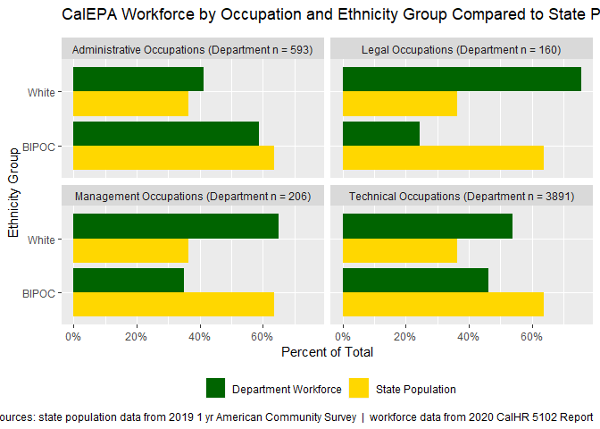<!-- -->

``` r
# ggsave(filename = here('07_slides', '2021-05-14', 'images', 
#                        '5102_dept_groups_level1.png'), 
#        plot = pl_5102_groups_l1, 
#        width = 10, 
#        height = 6, 
#        dpi = 125
#        )

(pl_5102_groups_l1_stack <- sum_5102_groups_l1 %>%  
        left_join(facet_label_5102_groups_l1, 
                  by = c('metrics_group')) %>% 
        select(-metrics_group) %>% 
        rename('metrics_group' = 'facet_label') %>% 
        ggplot() +
        geom_bar(mapping = aes(x = fct_rev(type), 
                               y = rate, 
                               fill = ethnicity_level1), #factor(type, levels = rev(levels(type)))), 
                 stat = 'identity') + 
        facet_wrap(~ metrics_group) +
        scale_fill_manual(values = colors_5102_2) +
        scale_y_continuous(labels = percent) +
        labs(title = default_pl_title_groups,
             subtitle = default_pl_subtitle,
             x = element_blank(),
             y = 'Percent of Total', 
             caption = default_pl_caption) +
        coord_flip() + 
        theme(legend.position = 'bottom', 
              legend.title = element_blank()) +
        guides(fill = guide_legend(reverse = TRUE)))
```

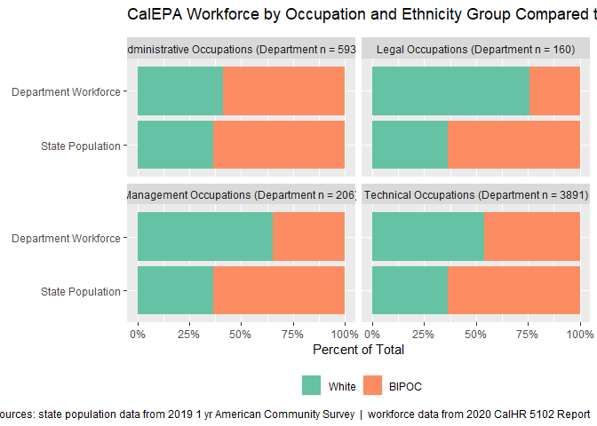<!-- -->

``` r
# ggsave(filename = here('07_slides', '2021-05-14', 'images', 
#                        '5102_dept_groups_level1_stack.png'), 
#        plot = pl_5102_groups_l1_stack, 
#        width = 10, 
#        height = 6, 
#        dpi = 125
#        )
```

#### Level 2 Ethnicity

``` r
### Level 2 ----
fun_summary_5102_groups_l2 <- function(dataset) {
    dataset %>% 
        filter(metrics_group == 'Legal Occupations') %>%
        fun_summary_5102_l2() %>% 
        bind_rows(acs_data_level2) %>% 
        mutate(metrics_group = 'Legal Occupations') %>%
        bind_rows(dataset %>% 
                      filter(metrics_group == 'Management Occupations') %>%
                      fun_summary_5102_l2() %>% 
                      bind_rows(acs_data_level2) %>% 
                      mutate(metrics_group = 'Management Occupations')) %>%
        bind_rows(dataset %>% 
                      filter(metrics_group == 'Administrative Occupations') %>%
                      fun_summary_5102_l2() %>% 
                      bind_rows(acs_data_level2) %>% 
                      mutate(metrics_group = 'Administrative Occupations')) %>%
        bind_rows(dataset %>% 
                      filter(metrics_group == 'Technical Occupations') %>%
                      fun_summary_5102_l2() %>% 
                      bind_rows(acs_data_level2) %>% 
                      mutate(metrics_group = 'Technical Occupations')) %>%
        mutate(type = factor(type)) %>% 
        {.}
}


fun_plot_5102_groups_l2 <- function(dataset, 
                                    plot_title = default_pl_title_groups, 
                                    plot_subtitle = default_pl_subtitle, 
                                    plot_caption = default_pl_caption) {
    dataset %>% 
        ggplot() +
        geom_bar(mapping = aes(x = ethnicity_level2, 
                               y = rate, 
                               fill = factor(type, levels = rev(levels(type)))), 
                 stat = 'identity', 
                 position = 'dodge') + 
        facet_wrap(~ metrics_group) +
        scale_y_continuous(labels = percent) +
        scale_fill_manual(values = colors_5102_state_dept) +
        labs(title = plot_title,
             subtitle = plot_subtitle,
             x = 'Ethnicity Group',
             y = 'Percent of Total', 
             caption = plot_caption) +
        coord_flip() + 
        theme(legend.position = 'bottom', 
              legend.title = element_blank()) +
        guides(fill = guide_legend(reverse = TRUE))
}


sum_5102_groups_l2 <- df_5102_dept_1yr %>%
    fun_summary_5102_groups_l2()

facet_label_5102_groups_l2 <- sum_5102_groups_l2 %>% 
    filter(type == 'Department Workforce') %>% 
    count(metrics_group, wt = ethnicity_total) %>% 
    mutate(facet_label = glue('{metrics_group} (Department n = {n})'))

(pl_5102_groups_l2 <- df_5102_dept_1yr %>% 
        fun_summary_5102_groups_l2() %>%
        left_join(facet_label_5102_groups_l2, by = c('metrics_group')) %>% 
        select(-metrics_group) %>% 
        rename('metrics_group' = 'facet_label') %>% 
        fun_plot_5102_groups_l2())
```

<!-- -->

``` r
# ggsave(filename = here('07_slides', '2021-05-14', 'images', 
#                        '5102_dept_groups_level2.png'), 
#        plot = pl_5102_groups_l2, 
#        width = 10, 
#        height = 6, 
#        dpi = 125
#        )

        
fun_plot_5102_groups_l2_stack <- function(dataset, 
                                          plot_title = default_pl_title_groups, 
                                          plot_subtitle = default_pl_subtitle, 
                                          plot_caption = default_pl_caption) {
    dataset %>% 
        ggplot() +
        geom_bar(mapping = aes(x = fct_rev(type), 
                               y = rate, 
                               fill = ethnicity_level2), 
                 stat = 'identity') + 
        facet_wrap(~ metrics_group) +
        scale_y_continuous(labels = percent) +
        scale_fill_manual(values = colors_5102_7) +
        labs(title = plot_title,
             subtitle = plot_subtitle,
             x = element_blank(),
             y = 'Percent of Total', 
             caption = plot_caption) +
        coord_flip() + 
        theme(legend.position = 'bottom', 
              legend.title = element_blank()) +
        guides(fill = guide_legend(reverse = TRUE))
}


(pl_5102_groups_l2_stack <- df_5102_dept_1yr %>% 
        fun_summary_5102_groups_l2() %>% 
        left_join(facet_label_5102_groups_l2, by = c('metrics_group')) %>% 
        select(-metrics_group) %>% 
        rename('metrics_group' = 'facet_label') %>% 
        fun_plot_5102_groups_l2_stack())
```

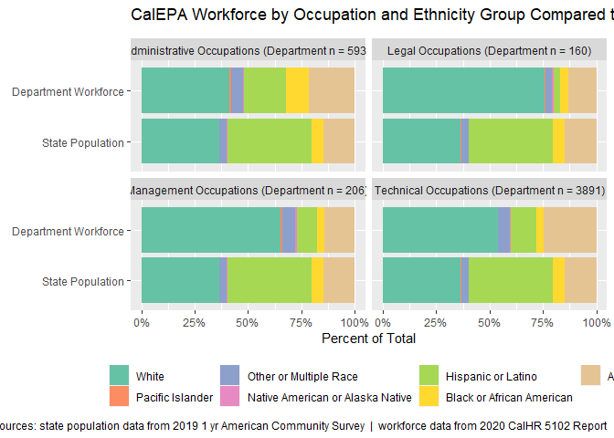<!-- -->

``` r
# ggsave(filename = here('07_slides', '2021-05-14', 'images', 
#                        '5102_dept_groups_level2_stack.png'), 
#        plot = pl_5102_groups_l2_stack, 
#        width = 10, 
#        height = 6, 
#        dpi = 125
#        )
```

### Department/BDO Comparison

To include different levels of your agency, use the code below to
compare. You could also compare departments across the state system.

#### Level 2 Ethnicity

``` r
## 2.4 By BDO Plots ----
### Level 2 ethnicity ----
summary_5102_l2_bdo <- df_5102_dept_1yr %>%
    add_count(dept,  wt = record_count,
              name = 'dept_total') %>% 
    add_count(ethnicity_level2, dept,
              wt = record_count,
              name = 'ethnicity_total') %>%
    select(ethnicity_level2, ethnicity_total, dept, dept_total) %>%
    distinct() %>%
    mutate(rate = ethnicity_total / dept_total) %>%
    mutate(type = 'Department Workforce') %>%
    arrange(dept, ethnicity_level2) %>%
    mutate(type = factor(type)) %>% 
    bind_rows(acs_data_level2 %>% 
                  rename(dept = type)) %>% 
    {.}


ordering_bdo <- summary_5102_l2_bdo %>% 
    filter(ethnicity_level2 == 'White') %>% 
    arrange(rate) %>% 
    pull(dept)

(pl_5102_l2_bdo_stack <- summary_5102_l2_bdo %>% 
        # mutate(type = fct_rev(type)) %>%
        ggplot() +
        geom_bar(mapping = aes(x = fct_relevel(dept, ordering_bdo), #fct_rev(type), 
                               y = rate, 
                               fill = ethnicity_level2), # factor(type, levels = rev(levels(type)))), 
                 stat = 'identity') +
        scale_fill_manual(values = colors_5102_7) +
        scale_y_continuous(labels = percent) +
        labs(title = default_pl_title_bdo,
             x = element_blank(),
             y = 'Percent of Total', 
             caption = default_pl_caption) +
        coord_flip() + 
        # facet_wrap(~ dept) +
        theme(legend.position = 'bottom', 
              legend.title = element_blank()) +
        guides(fill = guide_legend(reverse = TRUE)) + 
        geom_vline(xintercept = 1.5, size = 0.5, linetype = 'dashed'))#, color = 'grey50')
```

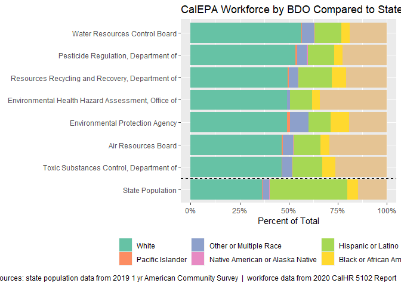<!-- -->

``` r
# ggsave(filename = here('07_slides', '2021-05-14', 'images', 
#                        '5102_dept_bdo_level2.png'), 
#        plot = pl_5102_l2_bdo_stack, 
#        width = 10, 
#        height = 6, 
#        dpi = 125
#        )
```

``` r
### Level 2 ethincity - by BDO & Class Groupings ----

##### Optional: enter dept name you'd like for the plot vs dept name listed 
##### in 5102 dataset
bdo_titles <- c("ARB" = 'Air Resources Board', 
                "OEHHA" = 'Environmental Health Hazard Assessment, Office of',
                "CalEPA (Agency)" = 'Environmental Protection Agency',
                "DPR" = 'Pesticide Regulation, Department of',
                "CalRecycle" = 'Resources Recycling and Recovery, Department of',
                "DTSC" = 'Toxic Substances Control, Department of',
                "SWRCB" = 'Water Resources Control Board')
bdo_titles_filenames <- tolower(c('ARB', 'OEHHA', 'CalEPA_Agency', 
                                  'DPR', 'CalRecycle', 'DTSC', 'SWRCB'))

# To get facet labels
pl_5102_groups_l2_bdo_all_facets <- map2_df(.x = names(bdo_titles), 
                                            .y = unname(bdo_titles), 
                                            .f = ~  df_5102_dept_1yr %>% 
                                                filter(dept == .y) %>% 
                                                fun_summary_5102_groups_l2() %>% 
                                                filter(type == 'Department Workforce') %>% 
                                                count(metrics_group, wt = ethnicity_total) %>% 
                                                mutate(facet_label = glue('{metrics_group} ({.x} n = {n})')) %>% 
                                                mutate(bdo = glue('{.x}'))
                                            )
```

``` r
#### To make plots
pl_5102_groups_l2_bdo_all <- map2(.x = names(bdo_titles), 
                                  .y = unname(bdo_titles), 
                                  .f = ~ df_5102_dept_1yr %>% 
                                      filter(dept == .y) %>% 
                                      fun_summary_5102_groups_l2() %>%
                                      mutate(type = case_when(as.character(type) == 'Department Workforce' ~
                                                                  glue('{.x}'),
                                                              TRUE ~ as.character(type))) %>%
                                      mutate(type = factor(type, 
                                                           levels = c(.x, 'State Population'))) %>%
                                      mutate(bdo = glue('{.x}')) %>%
                                      left_join(pl_5102_groups_l2_bdo_all_facets,
                                                by = c('metrics_group', 'bdo')) %>%
                                      select(-metrics_group) %>%
                                      rename('metrics_group' = 'facet_label') %>%
                                      distinct() %>%
                                      fun_plot_5102_groups_l2_stack(plot_title = glue('{.x} Workforce by Occupation and Ethnicity Group vs. State Population (Year {report_year})')) %>%
                                      {.}
)

# ## View one plot
# pl_5102_groups_l2_bdo_all[[2]]

## print all plots
for (i in seq_along(pl_5102_groups_l2_bdo_all)) {
    print(pl_5102_groups_l2_bdo_all[[i]] + 
              theme(legend.position = 'bottom', 
                    legend.title = element_blank(),
                    plot.margin = margin(t = 30, r = 0, b = 30, l = 0, unit = 'pt') # adding a little bit of space between plots
                    )
          ) 
}
```

<!-- -->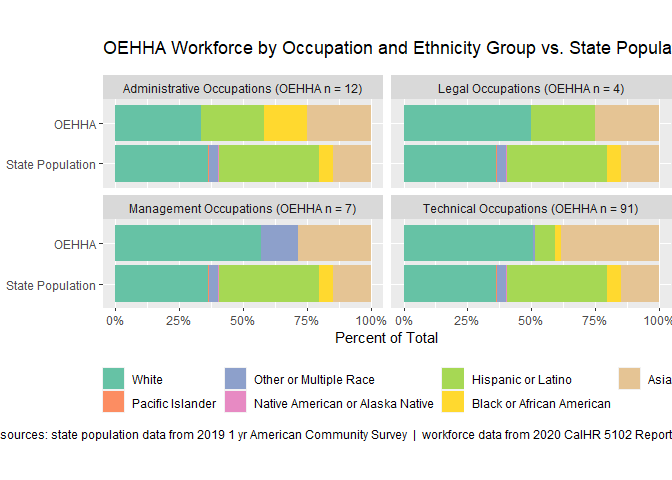<!-- -->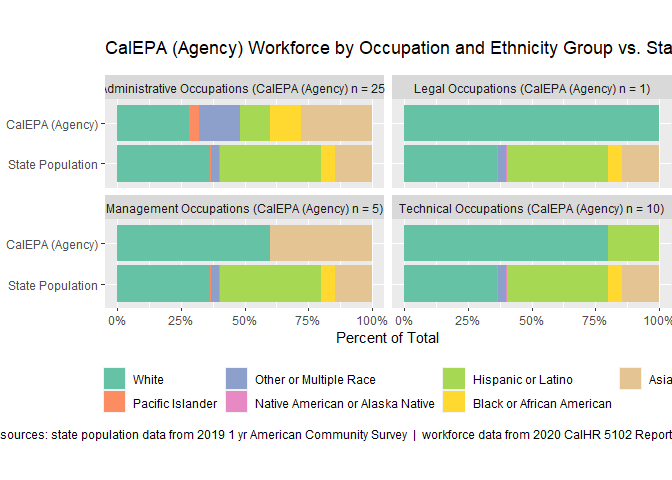<!-- -->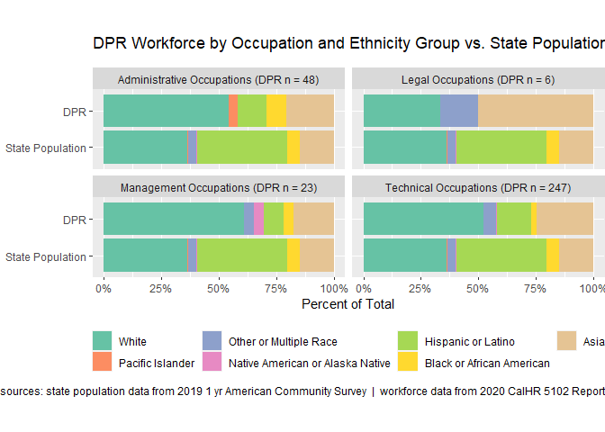<!-- -->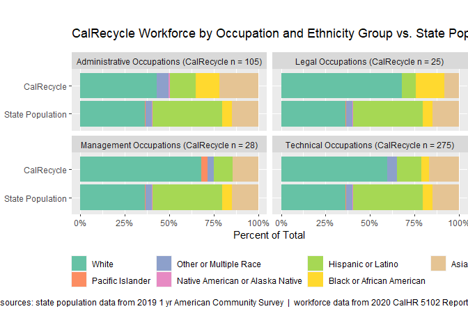<!-- -->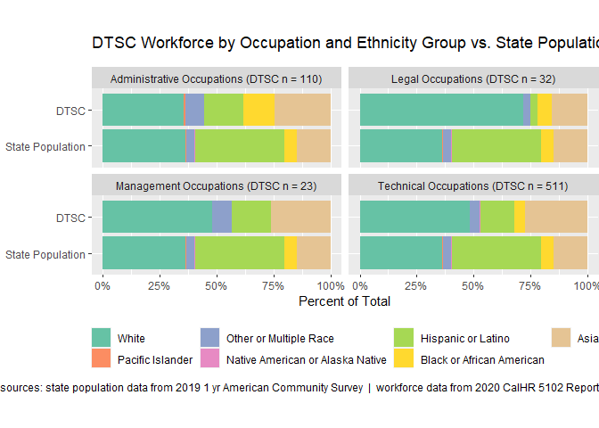<!-- -->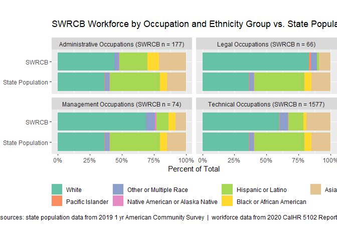<!-- -->

*To save these graphs as png image files, remove the comment symbols
(\#) from the* *code below.*

``` r
# walk2(.x = pl_5102_groups_l2_bdo_all, 
#       # .y = tolower(str_replace_all(string = names(bdo_titles), 
#       #                              pattern = ' ', 
#       #                              replacement = '_') %>% 
#       #                  str_remove_all(pattern = '\\.|(|)')), 
#       .y = bdo_titles_filenames, # keep filenames consistent regardless of changes to plot labels/titles
#       .f = ~ ggsave(filename = here('07_slides', '2021-05-14', 'images', 
#                                     glue('5102_bdo_group_l2_{.y}.png')), 
#                     plot = .x,
#                     width = 10, 
#                     height = 6, 
#                     dpi = 125)
# )
```
